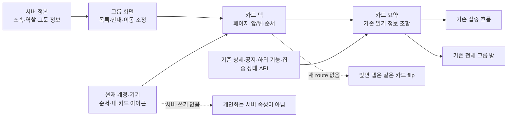
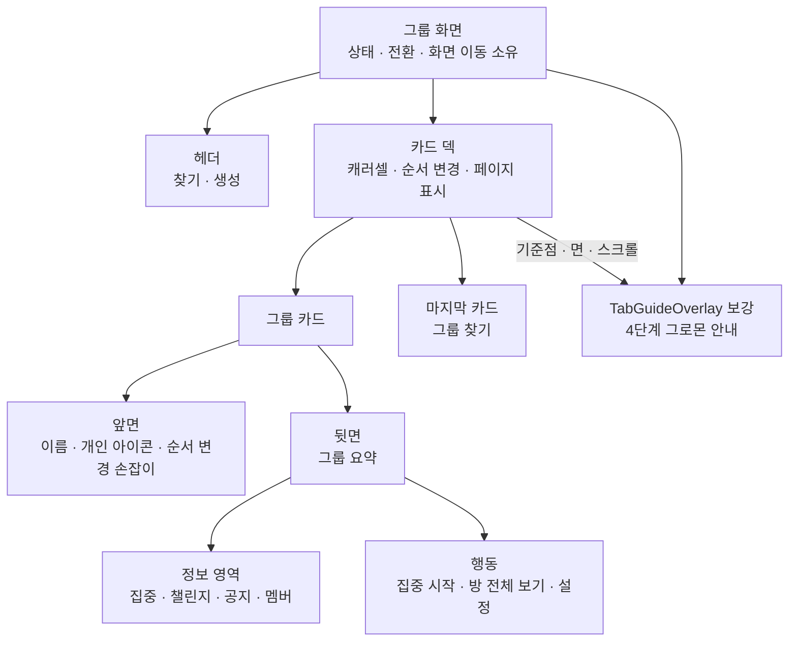
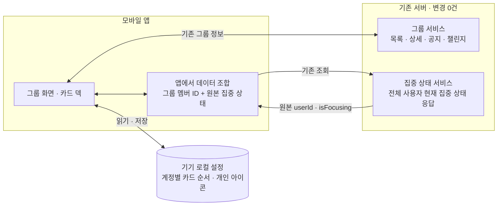
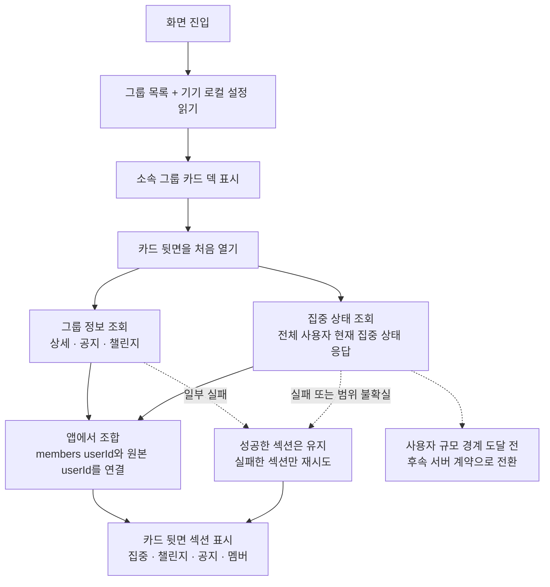
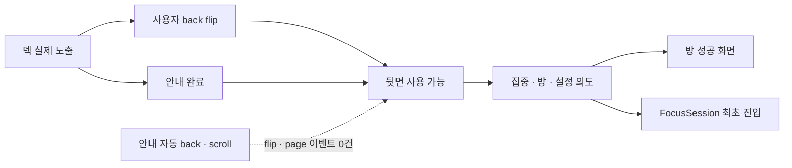

# Feature HLD — 내 그룹 캐러셀·카드 플립

| 항목    | 내용                                                                                                                              |
| ------- | --------------------------------------------------------------------------------------------------------------------------------- |
| 시작    | [구현 착수 카드](./README.md)                                                                                                     |
| 상위    | [그룹 생애주기 PRD](../../prd.md) · [그룹 IA](../../information-architecture.md) · [Feature PRD](./prd.md) · [UX](./ux-design.md) |
| 하위    | [low-level-design.md](./low-level-design.md) (상태 전이·실패 복구·검증 다이어그램)                                                |
| UX 정본 | [ux-design.md](./ux-design.md); [ux.html](./ux.html)은 검토용 비정본 프로토타입                                                   |
| 범위    | 화면 책임 · 앞/뒷면 데이터 경계 · 개인 로컬 설정 · 기존 route/API 연결 · 실패 격리                                                |
| 상태    | **기능 HLD** — 구현 상태와 다음 작업은 [공통 상태 정본](../../shared/implementation-status.md)을 따른다.                          |

---

## 0. 설계 결정 요약

- 이 기능은 **소속 이후 탐색**만 소유한다. 획득·전체 방·집중·운영·챌린지 도메인의 정책을 다시 정의하지 않는다.
- 멤버십과 역할은 서버, 순서와 내 카드 아이콘은 현재 계정·기기의 로컬 설정이 정본이다.
- 카드 뒷면은 기존 읽기 API를 lazy 조합하며 새 카드 API·DTO·DB·OpenAPI를 만들지 않는다.
- 화면 index가 아니라 stable `groupId`로 캐시·행동·route 복귀를 연결한다.
- 공통 이벤트 사전은 [분석 계약](../../shared/analytics.md), 상태·race·검증은 [LLD](./low-level-design.md)가 소유한다.

## 1. 설계 원칙

1. **앞면 탭과 라우트를 분리.** 앞면 탭은 같은 카드의 뒷면으로 flip하며 navigation을 일으키지 않는다. 기존 `onSelect(groupId)`는 뒷면 `방 전체 보기`에서만 호출한다.
2. **의존성 추가 회피.** 전용 캐러셀 라이브러리(`react-native-reanimated-carousel` 등)를 새로 넣지 않는다 — 사내에 네이티브 페이징 선례가 있고(`FocusSessionScreen`의 `pagingEnabled` ScrollView, `DrumPicker`의 `snapToInterval` FlatList), reanimated 4.5.0이 이미 설치돼 있어 peek 모션까지 자급 가능.
3. **기존 API 네 개를 조합한다.** 카드 뒷면을 처음 열 때 해당 `groupId`의 detail·announcements·challenges 세 요청을 lazy 병렬 조회한다. category를 보내지 않은 기존 `GET /api/v1/league/me/ranking?date`의 전체 사용자 현재 집중 상태 원본은 화면 전체에서 공유하고, 첫 back 뒤 foreground 동안 60초 refresh cycle로 갱신한다. 카드 전용 endpoint는 추가하지 않는다.
4. **카드 표현은 개인 로컬 설정.** 앞면 배경은 모든 그룹이 `#5E6AD2`; 그룹별 색·그라데이션·선화 아이콘은 없다. `내 카드 아이콘`은 현재 계정이 이 기기에서 보는 카드에만 적용하며 그룹의 서버 속성이나 OWNER 권한이 아니다.
5. **서버 계약을 늘리지 않는다.** 이모지는 Create/Update request와 Summary/Detail/Search/Overview response, DB, OpenAPI 어디에도 추가하지 않는다. 앱은 userId별 AsyncStorage 값만 읽고, 미설정·손상·신규·가입 그룹은 `🎯`로 fallback한다. 집중 인원도 기존 그룹 상세 멤버 ID와 기존 전체 사용자 현재 집중 상태 응답을 앱에서 join하므로 이 기능의 서버 변경은 0건이다.
6. **도메인 경계를 유지.** 앞면 탭은 같은 자리에서 카드를 뒤집고, 뒷면 `방 전체 보기`만 `GroupRoom` route를 연다. 카드의 하위 기능 영역은 기존 응답을 compact하게 투영할 뿐 상태·정렬·진행률 의미를 만들지 않으며 [챌린지 문서](../../../challenge/README.md)를 따른다.
7. **규모 가정을 임시 계약으로 명시한다.** `eligible_user_count < 100`은 운영상 출시 전제이고 런타임 앱에는 전달되지 않는다. 앱은 성공한 전역 상위 100명 원본 응답 길이가 100 미만일 때만 완전성을 적용한다. 운영 수 90명부터 경고하며 unknown 또는 100 이상이면 출시를 차단하고 pagination·그룹 상세 현재 집중 상태 필드 또는 batch endpoint의 대체 계약을 먼저 배포한다.
8. **멤버십과 표시 순서를 분리.** `GET /groups` 응답이 소속 그룹과 DTO의 정본이다. AsyncStorage는 현재 `userId`에 해당하는 stable `groupId[]`만 기기 로컬 표시 순서로 보관하며, 서버에 없는 그룹을 복원하거나 권한 판정에 쓰지 않는다.
9. **첫 카드 덱 안내도 화면 상태로 다룬다.** 기존 `TabGuideOverlay`의 그로몬·말풍선·진행 dot·dim/spotlight를 재사용·보강한다. `GroupScreen`은 route/다른 overlay와의 queue 및 안정 렌더 조건을, `GroupListScreen`은 카드 anchor·활성 face·programmatic 전환을 소유한다. phase 3→4의 programmatic back은 사용자 이벤트 없이 정상 첫 back과 같은 lazy ensure 경로를 호출한다. `idle`만 새 요청을 시작하고 `loading|ready|error|coverage-unknown`은 현재 상태를 재사용하며, guide는 응답을 기다리지 않는다. 서버 계약은 바꾸지 않는다.
10. **사용자 이벤트는 앱의 단일 typed 분석 경계에서 한 번만 발행한다.** 화면은 분석 SDK를 직접 부르지 않는다. 이름·속성·발행 주체·귀속은 [공통 분석 계약](../../shared/analytics.md)을 따르며 모든 `onPress`를 이벤트로 만들지 않는다.

---

## 2. 화면 컴포넌트와 소유권

상위 그룹 화면이 route·계정·목록을 소유하고, 덱과 카드는 표시 상태와 사용자 의도를 위임받는다.

> ⚠️ **overlay queue의 slot 조정자는 root로 올라간다**(challenge N56 · HLD §1). 결과 모달이
> `GroupScreen` 아래가 아니라 root 오버레이 계층 소유가 되면서, 이 화면이 queue를 들고 있으면
> **`GroupRoom`이 push되는 순간 그 focus가 끝나 결과 모달이 slot을 영영 못 받는다.** 조정자는
> root에 두고 이 화면은 **자기 안내(첫 안내 등)의 eligibility만** 판정한다 — 구현은 GROMO-1575·1576. 카드 한 장의 실패가 화면 전체나 다른 카드의 상태를 소유하지 않는다.

| 책임 영역              | 소유하는 것                                                                                          | 소유하지 않는 것               |
| ---------------------- | ---------------------------------------------------------------------------------------------------- | ------------------------------ |
| 그룹 화면              | 인증 계정, 성공한 전체 목록, route, 화면 공유 cache, **자기 안내의 eligibility**(slot 조정자는 root — 위 주)                                      | 카드 제스처·face 내부 상태     |
| 카드 덱                | active `groupId`, page, face, drag 가장자리 및 popover 이동의 page 전환, 순서 변경, 마지막 찾기 카드 | 멤버십·서버 권한               |
| 카드                   | 앞·뒷면 렌더, 영역별 loading/ready/error, CTA 의도 전달                                              | 전체 방 데이터·집중 세션 결과  |
| 원격 adapter           | 기존 API 조합, keyed cache, retry·late-response guard                                                | 새 도메인 정책·서버 필드       |
| 로컬 설정              | 계정별 순서·아이콘 reconcile와 직렬 저장                                                             | 소속·역할·다기기 동기화        |
| 안내 조정              | eligibility, 4단계 진행, 중단·완료, programmatic back                                                | 요약 데이터의 성공 대기        |
| 공용 reorder primitive | grip drag·tap/click popover·접근성 action의 stable ID 이동                                           | 세로·가로 화면별 좌표 알고리즘 |

---

## 3. 시스템/API 경계와 데이터 흐름

화면 진입에는 기존 `GET /api/v1/groups` 한 개를 사용하고, 카드 뒷면을 처음 열 때 아래 **기존 read API 네 개**를 추가로 조합한다. 카드 전용 endpoint, 그룹 상세의 현재 집중 상태 필드, DB·OpenAPI 변경은 추가하지 않으므로 서버 변경은 **0건**이다.

- 화면 진입 API: `GET /api/v1/groups` — 소속 그룹 summary와 stable groupId의 정본.
- 카드 뒷면을 처음 열 때 사용하는 그룹 서비스 API: `GET /api/v1/groups/{groupId}?date`, `GET /api/v1/groups/{groupId}/announcements`, `GET /api/v1/groups/{groupId}/challenges?date`.
- 카드 뒷면을 처음 열 때 사용하는 집중 상태 API: category를 보내지 않은 `GET /api/v1/league/me/ranking?date`의 원본 응답.
- AsyncStorage는 네트워크 응답을 대체하지 않는다. 화면 진입의 `GET /api/v1/groups`로 확정한 소속 groupId에 대해 현재 계정의 표시 순서와 개인 카드 아이콘만 reconcile한다.
- 그룹 상세는 멤버십과 `members[].userId`의 정본이다. `isFocusing`을 그룹 상세 DTO에 추가하지 않는다.
- 현재 집중 상태 adapter는 category를 보내지 않고 KST 날짜를 명시한 원본 배열을 보존한다. 포커스 세션 UI가 정렬·축약한 12명 결과는 그룹 집계에 사용하지 않는다.
- `/api/v1/league/me/ranking?date` 재사용은 그룹 화면에 리그 UI나 리그 기능을 추가하는 것이 아니다. 기존 응답의 `isFocusing` 값만 현재 집중 상태 판단에 재사용한다.

### 3.1 카드 뒷면을 처음 열 때와 화면 공유 현재 집중 상태 데이터

### 3.2 기존 그룹 상세 + 현재 집중 상태 응답의 client join

카드 전용 request/response와 그룹 상세 필드 확장을 만들지 않는다. 현행 그룹 상세의 `members[].userId`를 멤버십 정본으로, category를 생략한 현행 `GET /api/v1/league/me/ranking?date=YYYY-MM-DD`의 원본 `LeagueMemberResponse[]`를 현재 집중 상태 정본으로 사용한다. 운영 eligible 사용자(`is_deleted=false`이고 닉네임이 공백이 아님) 100명 미만은 출시 전제이며, 닉네임이 있는 게스트도 포함한다. 런타임 앱은 이 수를 받지 않는다.

- 현행 `getMyRanking(category?)`에 날짜 인자가 없다. 계획된 wrapper 확장 `getMyRanking(category?, date = todayStrKst())`이 기존 endpoint에 category를 보내지 않는 호출을 가능하게 하며, 서버 계약 변경은 아니다. 그룹 detail·하위 기능·리그 호출 인자와 `userId + KST date` cache key는 한 refresh cycle 시작 시 한 번 얻은 동일한 `todayStrKst()` 결과를 사용하며 기기 로컬 날짜를 섞지 않는다.
- 포커스 세션 UI용 adapter는 본인 제외·핀 우선 정렬 뒤 12명만 남기므로 재사용하지 않는다. 그룹 화면은 원본 배열을 보존하는 전용 adapter를 한 번만 소유한다.
- 완전한 현재 집중 상태 데이터에 없는 `userId`는 `false`로 본다. 단, 운영 출시 전제가 유효하고 **성공한 raw 응답 길이가 100 미만일 때만** 유효하다. 요청 loading/error나 100행 coverage-unknown 응답은 0명으로 강하하지 않고 집중 섹션을 독립 loading/error로 표시한다.
- 운영 eligible 사용자 수 90~99명은 warning/대체 계약 준비 신호다. unknown 또는 100 이상이면 출시를 차단하고 대체 계약을 먼저 배포한다. 런타임의 100행 응답은 실제 총원을 구분할 수 없으므로 coverage-unknown telemetry를 남기고 count를 미산출한다.
- `/api/v1/league/ranking`은 `isFocusing` 값을 채우지 않으므로 사용하지 않는다. 대상은 이름이 비슷한 이 endpoint가 아니라 반드시 `/api/v1/league/me/ranking`의 category 없는 원본 응답이다.
- 이 설계의 백엔드 DTO·service·DB·migration·OpenAPI 변경은 **0건**이다.
- 최신 공지는 서버가 `createdAt DESC`로 주는 기존 `GroupAnnouncementResponse[]`의 `announcements[0] ?? null`이다. 빈 배열과 요청 실패를 구분한다.
- 멤버 현재 인원은 `detail.members.length`, 최대 인원은 `detail.maxMembers`다.
- member preview는 최대 5명이다. `myUserId`와 일치하는 나를 먼저 두고, 나머지는 **기존 detail 응답의 상대 순서**를 보존한다. `joinedAt`이나 별도 preview 정렬 계약을 추가하지 않는다.
- detail·현재 집중 상태·announcements·challenges 중 하나가 실패해도 성공한 섹션은 표시한다. 집중 count는 detail과 완전한 현재 집중 상태 데이터가 모두 ready일 때만 계산하며, 각 실패는 해당 섹션의 retry로만 복구한다.

### 3.3 하위 기능 compact adapter

카드 뒷면은 기존 그룹 하위 기능 응답을 읽기 전용 compact 영역으로 투영한다.

- 기존 API가 돌려준 항목의 신원·순서·상태를 바꾸지 않는다.
- 카드 전용 제목·진행률·상태를 합성하거나 생성·수정 행동을 추가하지 않는다.
- 카드에서는 일부 정보와 전체 방 진입, 그리고 **미확인 결과의 읽기 전용 모달**을 제공한다. 상세 의미·권한과 결과의 판정·문구·큐 규칙은 [챌린지 문서 세트](../../../challenge/README.md)가 정본이다.
- **결과 모달은 복제가 아니다.** 카드는 결과를 재계산·재해석하지 않고 참가자 스코프 응답을 그대로 읽어 띄운다. 트리거는 화면이 아니라 "미확인 결과가 있다"는 사건이며(챌린지 policy §D3·N56), 확인 처리(ack)의 정본은 서버다(N58). 카드가 자체 결과 상태를 보관하지 않는다.
- 하위 기능 조회 실패는 해당 compact 영역에만 남고 다른 요약과 CTA를 막지 않는다.

### 3.4 로딩·캐시·무효화

- detail·announcements·challenges와 화면 공유 현재 집중 상태 데이터는 각각 `idle → loading → ready|error` 상태를 갖고, 현재 집중 상태 데이터에는 별도 `coverage-unknown` 상태가 있다. detail/challenges cache key는 `groupId + KST date`, announcements key는 `groupId`, 현재 집중 상태 key는 `userId + KST date`다.
- 그룹 화면의 현재 집중 상태 adapter는 같은 KST 날짜의 진행 중 요청과 준비된 원본 배열을 공유한다. 여러 카드의 뒷면을 빠르게 처음 열어도 `/api/v1/league/me/ranking`은 refresh cycle당 한 번만 호출하며 카드별 요청으로 증폭시키지 않는다.
- 같은 화면 세션에서 앞/뒤를 반복할 때 각 ready cache를 즉시 사용한다. 카드 전용 cache type은 만들지 않는다.
- 첫 back 또는 guide의 3→4 준비가 현재 집중 상태 adapter를 활성화한다. 활성화 뒤 `GroupScreen`이 화면 focus이고 앱이 foreground인 동안 **60초 간격**으로 raw ranking을 갱신하며, 화면 focus·foreground 복귀·이 화면에서 시작한 집중 흐름의 복귀·KST 날짜 변경에도 즉시 새 refresh cycle을 시작한다. 아직 back을 한 번도 준비하지 않은 화면은 polling하지 않는다.
- blur·background·unmount·logout·groups=0에서는 polling을 멈춘다. 같은 key의 진행 중 요청은 공유해 interval·foreground·route 복귀가 겹쳐도 새 요청을 만들지 않는다. 갱신 실패 시 이전의 완전한 ready 값만 stale로 유지하고, 최초 실패·100행은 계속 미산출한다.
- `idle` dependency만 새 요청을 한 번 시작한다. `loading`은 기존 promise를 구독하고, `ready`는 cache를 즉시 쓰며, `error|coverage-unknown`은 guide 전환 자체가 retry하지 않는다. 그룹별 영역은 사용자가 `다시 시도`를 수락할 때만, 현재 집중 상태는 다음 60초 tick·화면 복귀·명시 retry에서 새 cycle을 시작한다.
- KST 날짜가 바뀌면 detail·challenges와 현재 집중 상태 데이터를 새 KST date key로 조회한다. 명시 새로고침이나 `onRefresh()`는 추가하지 않는다.
- 요청 중 다른 카드로 이동해도 응답은 groupId key에만 쓴다. 현재 카드에 낡은 응답을 덮어쓰지 않는다.
- 한 요청의 실패는 해당 섹션에서만 retry한다. 현재 집중 상태 loading은 집중 영역 skeleton, 최초 error는 `집중 현황을 불러오지 못했어요 · 다시 시도`, 100행 coverage-unknown은 `집중 현황을 확인할 수 없어요`로 분리하며 모두 `0명`으로 표시하지 않는다. refresh 실패에 이전의 완전한 ready 데이터가 있으면 stale 표시와 함께 count를 유지할 수 있다.

---

## 4. UI 기술 선택

| 판단      | 선택                                                                           | 이유                                                       |
| --------- | ------------------------------------------------------------------------------ | ---------------------------------------------------------- |
| 가로 탐색 | 기존 React Native list·paging primitives 사용                                  | 최대 그룹 수가 작고 새 캐러셀 의존성이 필요하지 않음       |
| 앞·뒷면   | 같은 card shell 안에서 face만 전환                                             | 화면 맥락·크기·stable `groupId` 유지                       |
| 순서 변경 | 앞면 grip drag + 덱 가장자리 한 페이지 이동, 또는 grip tap/click local popover | drag 없는 단일 포인터도 화면 밖 카드까지 이동 가능         |
| 모션      | 기본 flip, Reduce Motion에서는 cross-fade 또는 즉시 전환                       | 상태·포커스 의미는 모션 설정과 무관하게 동일               |
| 긴 이름   | 모든 surface 1줄 tail ellipsis, 접근성은 원문 전체                             | 레이아웃을 보호하면서 정보 손실을 보조기술에 전파하지 않음 |

가장자리 이동은 덱이 page 위치를, 공용 reorder primitive가 drag·popover·접근성 action의 stable ID 이동 의도를 소유한다. drag는 유효 그룹 slot drop 때만 commit하고, popover·접근성 action은 유효한 앞/뒤 한 slot마다 즉시 같은 reducer를 commit한다. popover가 page 경계를 넘으면 덱은 programmatic 이동 뒤 같은 카드의 popover와 focus를 유지한다. popover의 열기·닫기 focus와 CTA 차단은 [UX 정본](./ux-design.md#42-재정렬-grip과-저장-피드백)과 [LLD §3](./low-level-design.md#3-한-번의-입력은-한-가지-결과만-만든다)을 따른다. 구체 list 속성, animation 값, drag 임계, testID는 구현 코드와 테스트가 정본이다.

서버의 목표 상한이 10개여도 경합으로 11개 이상 응답이 오면 덱은 전체 그룹과 마지막 `FindMoreCard`를 렌더한다. indicator는 실제 페이지 수로 계산하고 `group_count_bucket=11_plus`로 계측한다. reorder·로컬 순서는 실제 stable `groupId`만 대상으로 하며 FindMoreCard를 slot·sentinel·이동 대상으로 취급하지 않는다.

## 5. 상태 소유권

| 상태                     | 소유자                    | 신원·수명                                             |
| ------------------------ | ------------------------- | ----------------------------------------------------- |
| 현재 페이지·앞/뒤·drag   | 카드 덱                   | stable `groupId`; 화면이 살아 있는 동안               |
| 상세·공지·하위 기능 요약 | 카드 데이터 adapter       | `groupId + KST date` 또는 `groupId`; 영역별 독립 상태 |
| 현재 집중 상태           | 그룹 화면 공유 adapter    | `userId + KST date`; refresh cycle당 in-flight 1회    |
| 카드 순서·내 카드 아이콘 | 계정별 로컬 store         | 성공한 전체 소속 목록과 reconcile; 서버 쓰기 없음     |
| 안내 진행·완료           | **root의 overlay slot**(그룹 화면은 eligibility만) | 기기 완료 key + 현재 session 가드                     |
| 방 복귀 맥락             | 그룹 화면                 | 출발 `groupId`·face·focus; index는 보조 위치          |

상태 전이, 저장 race, 늦은 응답 폐기, 복귀 fallback은 [LLD](./low-level-design.md)가 실행 정본이다. HLD에서는 같은 상태를 타입·Map·hook 이름으로 다시 정의하지 않는다.

## 6. 그룹 카드 첫 노출 코치마크 계약

### 6.1 trigger·저장·queue

`GroupScreen`은 게스트를 포함한 세션에서 **성공한 전체** `GET /groups` 목록이 1개 이상이고 `GroupListScreen`의 카드 폭·활성 첫 카드·필수 anchor layout이 안정됐을 때 eligibility를 계산한다. userId 미확정, loading/error/부분 목록, groups=0에서는 queue에 넣지 않는다. 다른 modal/sheet/guide가 열려 있으면 eligibility를 버리지 않고 queue가 blocking overlay 대기로 판정하며, slot을 받기 전 화면이 끝나면 다음 focus에서 다시 판정한다.

- 완료 key는 AsyncStorage `gromo:guide:groupDeck:v1`, 값 `1`이며 **기기 단위 v1 1회**다. userId bucket으로 나누지 않는다. key 없음은 미완료, `1`은 완료다.
- key read 성공 뒤 미완료면 queue에 넣고, 완료면 카드 덱을 바로 사용하게 한다. read 실패는 덱을 막지 않으며 `keyState=unknown`과 session memory로 이번 세션에 최대 1회만 시도한다. 다음 진입에서는 다시 read한다. queue 등록 결과가 즉시 slot 획득이면 `shown`, blocking overlay 대기면 `pending`, read 실패의 fallback queue 등록이면 `unknown`이다. 해당 노출 이벤트를 typed helper에 넘긴 뒤에만 카드 사용자 입력을 수락하며, 이후 slot 획득으로 값을 보정하지 않는다.
- 화면 탭 또는 접근성 `다음` action으로 1~3단계를 진행하고 마지막은 `시작` action을 쓴다. skip/replay는 제공하지 않는다. 마지막 `시작`으로 overlay가 닫힌 직후 `tab_guide_completed`를 현재 session 1회 발행하고, 이어 key write를 best-effort로 시도한다. 중간 background/unmount/route 이탈은 event·write 없이 `interrupted` 처리한다.
- key write 실패는 사용자 완료 결과나 `tab_guide_completed`를 취소하지 않는다. `sessionCompleted`로 현재 foreground session의 중복 overlay를 막고 카드 사용을 계속 허용하며, `guide_complete_write_failed` 운영 telemetry만 남긴다. 다음 앱 진입에는 다시 노출될 수 있다.

### 6.2 TabGuideOverlay 단계와 anchor

공용 `TabGuideOverlay`에 `guide=groupDeck:v1`, `phase`, `total=4`, 접근성 label/action과 anchor fallback을 보강한다. 정적 그로몬 asset 이름은 analytics payload에 넣지 않는다.

| 단계          | 캐릭터·anchor                          | 안내 문구                                                                                                    | 준비/종료 상태                                                       |
| ------------- | -------------------------------------- | ------------------------------------------------------------------------------------------------------------ | -------------------------------------------------------------------- |
| 1 소개        | `character_hi`·전체 dim                | 내 그룹이 카드로 모였어. 같이 둘러보자!                                                                      | 첫 활성 카드 front, spotlight 없음                                   |
| 2 가로 탐색   | `character_study`·캐러셀 + indicator   | 2개 이상: 옆으로 넘기면 다른 그룹을 볼 수 있어. 1개: 이 카드가 내 그룹이야. 그룹이 늘면 옆으로 넘길 수 있어. | front 유지                                                           |
| 3 카드 flip   | `character_study`·활성 카드 본문       | 카드를 탭하면 이 자리에서 오늘의 방 상태가 열려.                                                             | 다음 단계 준비에서만 시스템이 active card를 back으로 전환            |
| 4 요약과 행동 | `character_happy`·back 정보 + CTA 영역 | 집중 중인 멤버·챌린지·공지를 보고 바로 집중하거나 방 전체를 열어봐.                                          | 마지막 action 후 overlay를 닫고 active card back·CTA 근처 focus 유지 |

각 단계 시작 직전 현재 layout에서 anchor를 재측정한다. anchor 측정 실패 또는 화면 폭 변경 중에는 잘못된 spotlight를 그리지 않고 전체 dim + 말풍선/단계 문구로 fallback하며 다음 단계에서 재측정한다. 단계 3→4의 back 전환은 guide의 programmatic 준비 동작이므로 `group_card_flipped`·`group_carousel_paged`를 발행하지 않는다. 정상 사용자 첫 back과 **동일한 cache key·in-flight dedupe의 ensure 경로**를 호출하되 dependency별 동작은 다음과 같다.

- `idle`: 해당 요청을 정확히 1회 시작한다.
- `loading`: 기존 promise를 구독하고 새 요청은 0회다.
- `ready`: 준비된 cache를 사용하고 새 요청은 0회다.
- `error|coverage-unknown`: 현재 상태를 보여 주고 3→4 전환이 만드는 retry는 0회다. 그룹별 영역은 명시 retry에서, 현재 집중 상태는 다음 polling·복귀·명시 retry에서 새 cycle을 연다.

혼합 상태에서는 `idle`인 dependency만 시작한다. guide는 어떤 상태에서도 응답을 기다리지 않고 step 4로 진행하며 back 섹션의 독립 `loading | ready | error` UI를 그대로 렌더한다. CTA는 기존 오류/부분 성공 계약대로 유지한다.

### 6.3 접근성·오류 경계

- overlay는 `단계 n/4`, 현재 원문, `다음` 또는 마지막 단계의 `시작` action을 읽는다. spotlight만으로 의미를 전달하지 않으며 화면 탭과 동등한 접근성 action을 제공한다.
- Reduce Motion에서는 overlay/face 전환을 cross-fade 또는 즉시 교체한다. 숨은 face·비활성 CTA는 focus tree에 남기지 않고, 마지막 단계 종료 시 active back의 첫 의미 있는 CTA 또는 요약 제목으로 focus를 복원한다.
- overlay가 열린 동안 일반 modal/sheet/guide는 queue에서 대기한다. route 이탈·background·unmount·계정/멤버십/활성 카드 변경 또는 blocking overlay 등장은 guide를 즉시 닫되 완료로 저장하지 않는다. 동일 화면의 anchor 측정 실패·폭 변경은 전체 dim fallback으로 계속한다. 카드·멤버십·서버 데이터는 롤백하거나 추정하지 않는다.

### 6.4 guide 계측 계약

정확한 이벤트 이름·속성은 [공통 분석 계약 §2](../../shared/analytics.md#2-기능별-이벤트cohort-fact-사전)에서만 정의한다. 이 기능은 발행 위치와 1회 처리만 소유한다.

| 상태 변화                   | 발행 책임               | 발행하지 않는 경우                                                |
| --------------------------- | ----------------------- | ----------------------------------------------------------------- |
| guide 상태가 확정된 덱 노출 | 그룹 화면               | completion key read·queue 등록 전, rerender·resize·안내 단계 이동 |
| 사용자 flip·page·reorder    | 해당 상태를 commit한 덱 | animation·route 복귀·안내 자동 전환·취소·no-op                    |
| CTA 흐름 수락               | 선택된 카드             | disabled·연타·목적 흐름 시작 실패                                 |
| 로컬 아이콘 저장 결과       | 로컬 설정 경계          | glyph 선택만 변경·쓰기 전                                         |
| 마지막 `시작`으로 안내 종료 | 안내 조정자             | 단계별 `다음`·중단·저장 key 쓰기만 완료                           |

guide key 읽기/쓰기 실패, anchor fallback, 중단은 사용자 행동 이벤트가 아닌 이유별 운영 telemetry로 남긴다. 그룹명·소개·emoji glyph·로컬 순서·그로몬 asset 이름은 payload에 넣지 않는다.

### 6.5 공통 분석 계약 연결

이벤트 이름·공통 속성·발행 주체·F1~F3 귀속 window·금지 payload는 [그룹 공통 분석 계약](../../shared/analytics.md)이 정본이다. 이 기능은 §6.4의 카드·guide 이벤트가 **실제 UI 상태 변경에서 한 번만** 발생하도록 구현한다. Room에는 `entry_source=group_card`를 직접 전달하고, Focus에는 `initialGroupId`와 `entrySource=group_card`를 함께 넘겨 `FocusCategory → FocusSession → focus_session_started`까지 보존한다. `focus_session_started`는 FocusSession 최초 화면 진입·세션 시작 처리 시 발행하며 marker API 성공을 뜻하지 않는다. source를 `initialGroupId`에서 추론하지 않는다.

- 모든 신규 클라이언트 이벤트는 앱의 typed helper 한 경로로 보낸다.
- `group_card_deck_viewed`는 성공한 목록·안정 layout 뒤 completion key read와 queue 등록 결과가 확정된 view episode당 1회다. 완료 key는 `completed`, 미완료 queue가 즉시 slot을 받아 overlay를 시작하면 `shown`, blocking overlay 대기는 `pending`, read 실패의 session fallback queue 등록은 `unknown`이다. 그룹 화면은 노출 helper 호출 뒤에만 사용자 입력을 열고, 이후 slot 획득·중단·완료에는 이미 발행한 값을 취소하거나 보정하지 않는다.
- 안내의 자동 scroll/back, animation 완료, rerender, resize, route 복귀, 취소·no-op은 사용자 행동 이벤트가 아니다.
- `back_source=guide`는 안내가 만든 back을 사용자가 다시 flip하기 전까지만 유지한다.
- 그룹명·소개·아이콘 glyph·asset·로컬 순서·raw `userId`는 payload에 넣지 않는다.
- CTA가 수락되면 카드가 비식별 UUID `interaction_id`를 만들고 action과 Room/Focus route context에 보존한다. 결과는 같은 ID의 미소비 intent만 exact match해 한 번 소비한다. Room 30초·Focus 10분 window를 넘기거나 취소·실패·background·route 시작 실패면 소비·결과 귀속은 0건이다. 이 속성은 [공통 분석 계약](../../shared/analytics.md)의 사전을 따라 typed helper 한 경로에만 추가한다.

### 6.6 이 기능의 전환 흐름

- `Direct`와 `Guide`가 같은 session에 모두 있으면 뒷면 사용 가능 상태는 한 번으로 dedupe한다.
- CTA 클릭은 결과가 아니다. Room 최초 성공 렌더 또는 FocusSession 최초 화면 진입·세션 시작 처리가 있어야 전환 결과로 본다. Focus 이벤트는 marker API 성공을 뜻하지 않는다.
- room 30초·focus 10분의 초기 귀속 window와 F1/F3 획득 퍼널은 공통 분석 계약을 따른다.

### 6.7 검증 연결

발행 위치·결과 context는 위 책임 경계를 따르고, 구체 once/dedupe·DebugView 시나리오는 [LLD §7~8](./low-level-design.md#7-카드-기능의-계측-상태)에서 검증한다. 공통 분석 계약의 순서·귀속·금지 payload를 변경할 때는 HLD 표를 복제하지 않고 링크만 갱신한다.

---

## 7. 외부 계약과 영향 경계

| 경계      | 유지할 계약                                                                    | 이 기능의 변경                                                   |
| --------- | ------------------------------------------------------------------------------ | ---------------------------------------------------------------- |
| 그룹 목록 | 서버 응답이 소속과 DTO의 정본                                                  | 성공한 전체 목록과 로컬 순서·아이콘을 합성                       |
| 카드 선택 | 앞면 탭은 route 이동이 아님                                                    | 뒷면의 방 CTA만 기존 `GroupRoom(groupId)` 호출                   |
| 집중      | 기존 `FocusCategory → FocusSession` 흐름                                       | stable `groupId`와 `entrySource=group_card`를 세션 시작까지 전달 |
| 그룹 방   | 방이 자신의 상세·공지를 다시 조회                                              | 카드 cache/view model을 route 정본으로 넘기지 않음               |
| 운영      | OWNER/MEMBER 정책과 서버 검증은 [04 HLD](../04-operation/high-level-design.md) | 역할 공통 로컬 아이콘 편집 진입만 추가                           |
| 챌린지    | 제품·상태·권한·결과 규칙은 [챌린지 정본](../../../challenge/README.md)         | 기존 읽기 응답의 compact 표시, 전체 방 진입, **미확인 결과의 읽기 전용 모달 표시 자리** 제공 |
| 분석      | 이름·속성·귀속은 [공통 분석 계약](../../shared/analytics.md)                   | 카드·안내 surface의 once guard와 결과 context 전달               |
| 서버      | 기존 그룹·리그 read API, DTO·DB·OpenAPI 유지                                   | 서버 변경 없음                                                   |

영향 영역은 그룹 화면·목록, 그룹 전용 카드 컴포넌트, 계정별 로컬 설정 store, 기존 league client wrapper, 공용 reorder primitive, 안내 overlay, 분석 helper와 관련 테스트다. 실제 파일 시작점은 [착수 카드](./README.md#실제-앱테스트-시작점), 세부 테스트 gate는 [LLD §8](./low-level-design.md#8-구현출시-검증)에서 관리한다.

## 8. 설계 리스크

| 리스크 묶음        | 실패 형태                                                                | 설계 완화                                                                                |
| ------------------ | ------------------------------------------------------------------------ | ---------------------------------------------------------------------------------------- |
| 신원·복귀          | 재정렬·목록 갱신 뒤 다른 그룹을 열거나 복원                              | 모든 전달·캐시·복귀를 stable `groupId`로 연결                                            |
| 입력 경합          | 한 제스처가 page·flip·reorder를 함께 실행                                | surface별 입력 소유권과 cancel 규칙을 분리                                               |
| 데이터 증폭·오염   | 카드마다 중복 조회하거나 A 응답을 B에 표시                               | 첫 back lazy load, dependency 상태별 ensure, keyed cache·in-flight 공유, 늦은 응답 guard |
| 집중 상태 노후화   | 열린 화면에서 다른 기기의 시작·종료를 계속 옛 값으로 표시                | 첫 back 뒤 foreground focus 동안 60초 polling, 복귀 즉시 갱신, stale 표시                |
| 불완전한 집중 상태 | 누락 사용자를 0명으로 오판                                               | raw 100행은 미산출, 운영 90 경고·100 전 대체 계약                                        |
| 계정 간 로컬 누출  | 순서·아이콘의 다른 계정 덮어쓰기                                         | userId bucket, key별 직렬 저장, 성공한 전체 목록에서만 reconcile                         |
| 안내 중첩·오계측   | sheet와 겹치거나 자동 back을 사용자 flip으로 기록                        | overlay queue, 중단 상태, programmatic source와 once guard                               |
| 접근성·반응형      | 숨은 face 노출, 작은 grip, drag만 가능한 reorder, 긴 이름·indicator 충돌 | active face만 노출, popover·custom action의 같은 reducer, 측정 폭 기반 표시, 원문 label  |
| 도메인 드리프트    | 카드가 방·운영·챌린지 정책을 복제                                        | compact read adapter·**읽기 전용 결과 모달**과 기존 route만 제공하고 각 정본에 링크. 결과 모달도 판정·문구를 카드에서 재정의하지 않는다 |

## 9. 범위 경계

- 개인 아이콘·순서는 현재 계정·기기의 표현이며 서버·다기기 동기화를 제공하지 않는다.
- 카드 요약은 기존 읽기 응답만 사용하고 그룹·리그 DTO, DB, migration, OpenAPI를 바꾸지 않는다.
- 전체 그룹 방은 자신의 정보를 다시 조회한다. 카드 cache를 route 정본으로 승격하지 않는다.
- 챌린지는 진입점과 compact 표시, 그리고 **미확인 결과의 읽기 전용 모달**까지 포함한다. 상세 상태·권한과 결과의 판정·문구·큐 규칙은 별도 문서로 보낸다. 카드는 결과를 합성하지 않고 표시 자리만 제공한다.
- 안내는 첫 카드 덱 사용법만 다루고 가입 onboarding·replay·새 push를 만들지 않는다.
- 리텐션·재방문 개선은 이 HLD의 완료 기준이 아니다. [그룹 PRD](../../prd.md)의 기준선·실험 단계에서 검증한다.

## 10. 출시 전 설계 게이트

1. [LLD §8](./low-level-design.md#8-구현출시-검증)의 신원·계정 race·부분 실패·안내·계측 시나리오가 테스트 위치와 연결되어야 한다.
2. 앞면→뒷면→방, 앞면 grip drag와 tap/click popover 재정렬, 안내 4단계는 [UX 정본](./ux-design.md)의 형성평가·접근성 gate를 통과해야 한다.
3. 현재 집중 상태는 운영 90 경고와 100 전 대체 계약이 배정되고, runtime loading·error·100행을 0명으로 표시하지 않아야 한다. 첫 back 뒤 화면이 활성화된 동안 60초 갱신·중복 요청 방지·중단 수명이 검증돼야 한다.
4. 기존 그룹·리그 API와 전체 방·집중·운영 route 회귀가 없어야 한다.
5. [공통 분석 계약](../../shared/analytics.md)의 F1~F3, once, 귀속, 금지 payload와 `entrySource`의 `FocusCategory → FocusSession` 보존을 DebugView에서 증명해야 한다.
6. 구현 상태와 남은 출시 blocker는 [공통 상태 정본](../../shared/implementation-status.md)에서 갱신한다.
