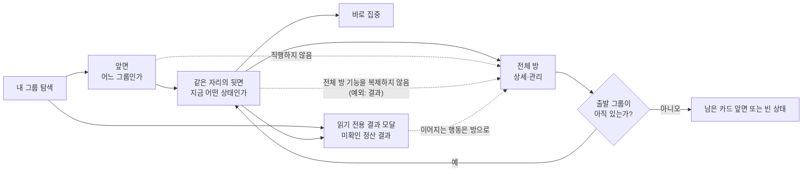
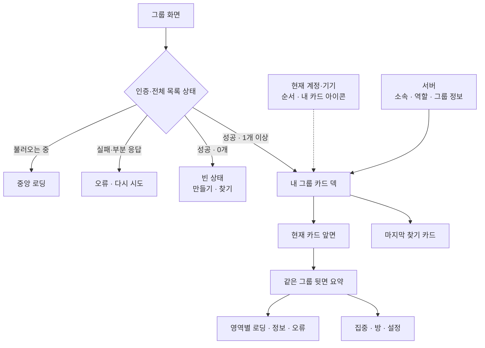

# Feature IA — 내 그룹 캐러셀·카드 플립: 정보 구조

| 항목 | 내용                                                                                                   |
| ---- | ------------------------------------------------------------------------------------------------------ |
| 시작 | [구현 착수 카드](./README.md)                                                                          |
| 상위 | [그룹 전체 IA](../../information-architecture.md) · [Feature PRD](./prd.md)                            |
| 범위 | 화면 위치 · 상태 트리 · 카드 앞/뒷면 정보 위계 · 내비게이션 · 권한별 설정                              |
| 상태 | **기능 정보구조 정본** — 구현 상태는 [공통 상태 정본](../../shared/implementation-status.md)을 따른다. |

이 문서는 **"무엇을, 어떤 순서/위계로 보여주는가"** 만 다룬다. 어떻게 움직이는지(제스처·모션)는 [ux-design.md](./ux-design.md), 어떻게 구현하는지는 [high-level-design.md](./high-level-design.md)·[low-level-design.md](./low-level-design.md).

정확성·규모 전제는 [HLD](./high-level-design.md#3-시스템api-경계와-데이터-흐름), 실행 상태는 [LLD](./low-level-design.md)를 따른다. IA는 그 값을 화면에서 어디에 둘지만 결정한다.

---

## 0. 정보 경계 요약



- 앞면은 식별, 뒷면은 행동 선택에 필요한 요약, 전체 방은 상세·관리다.
- **결과는 복제 금지의 예외다.** 아직 확인하지 않은 내 정산 결과가 있으면 덱 위에 **읽기 전용
  결과 모달**이 열린다. 카드가 여는 것은 이 모달 하나뿐이고, 생성·수정·참여와 정책·권한은
  여전히 복제하지 않는다. 판정·문구·큐 순서·확인 처리는 [챌린지 정본](../../../challenge/policy.md)
  (§D3 · N56~N58)이 소유한다.
- **결과 모달은 덱의 유무와 무관하다.** 덱은 소속 1개 이상에서만 보이지만, 결과 모달은
  **소속 0개 빈 상태 화면 위에도 뜬다** — 모든 그룹에서 탈퇴한 사람의 유일한 인앱 경로다.
  모달을 얹는 주체는 카드·덱이 아니라 **root 오버레이 계층**이라, 덱이 0장이어도 소유자가 사라지지 않는다
  (챌린지 policy §D3 · HLD §1).
- 소속 1개 이상에서만 덱을 보이며 loading·error·0개 상태를 덱으로 가장하지 않는다. 게스트도
  그룹 목록에 소속이 있으면 같은 덱을 본다.
- 역할 차이는 관리 항목에서만 생긴다. 요약 읽기·집중·전체 방 보기는 OWNER와 MEMBER에게 공통이다.
- 시각 이름은 1줄로 줄여도 접근성 이름은 서버 원문 전체를 사용한다.
- 데이터 불명·실패는 0명·없음으로 바꾸지 않는다. 정확한 실패 상태는 HLD·LLD가 소유한다.

## 1. 화면 위치 (Navigation map)

```
앱 main shell (인증 member/guest)
└── Tab: 홈 | 리그 | [그룹] | 전체
       └── GroupScreen  (그룹 탭 진입점 · 상태 소유)
              ├── (공통) 미확인 정산 결과 있음 → 읽기 전용 결과 모달 — **0개 분기에도 뜬다**
              │    ⚠️ 이 모달을 **그리는 주체는 GroupScreen이 아니다.** `GroupRoom`은 이 탭이 아니라
              │       root Stack의 sibling이라(RootNavigator), 탭 화면이 그리면 방이 push된 동안
              │       그 위에 뜨지 못한다 — 방에서 결과를 못 보거나 뒤에서 ack된다.
              │       소유자는 **root 오버레이 계층**이고, 활성 조건만 그룹 흐름 focus다
              │       (챌린지 IA §4.3 · policy §D3).
              ├── 그룹 0개: [그룹 만들기] → GroupCreate → 성공 뒤 덱
              │             [그룹 찾기] → GroupFindSheet → (검색은 선택) → 가입 성공 뒤 덱
              │             초대 링크 수신 → Invite preview sheet → 가입 성공 뒤 덱
              └── 그룹 1개 이상: GroupListScreen  ← ★ peek carousel
                     ├── 미확인 정산 결과 있음 → 읽기 전용 결과 모달(덱 위 오버레이, 순차 큐)
                     ├── 카드 앞면 탭 → 같은 자리 Room Summary back으로 flip
                     ├── back [이 그룹으로 집중] → FocusCategory → 세션 시작
                     ├── back [방 전체 보기] → push GroupRoom → Back 시 같은 back 복귀
                     ├── back [⋯] → 공통 내 카드 아이콘 + role별 GroupSettings
                     └── 앞면 우상단 ReorderHandle → drag/drop 또는 tap/click `순서 변경` popover로 순서 변경
```

- `GroupListScreen`은 **그룹 탭의 첫 화면**(A-9: 소속 1개부터 항상 목록). 자체 백버튼 없음(`onBack` 미전달이 정상).
- 캐러셀은 `GroupScreen`의 **"1건 이상" 분기만** 대체한다. 로딩/에러/빈 상태 화면은 위치·소유 불변.
- **카드 앞면 탭은 라우트 이동이 아니다.** `GroupRoom` push는 뒷면의 명시적 `방 전체 보기`에서만 일어난다.
- 이 흐름의 노출·의도·결과는 [공통 분석 계약](../../shared/analytics.md)에 따라 서로 다른 단계로 기록한다.

### 1.1 화면 결과와 분석 의미

IA는 화면 결과를 **그룹 화면 도달 → 덱 노출 → 뒷면 사용 가능 → CTA 의도 → 방/집중 성공**으로 구분한다. 구체 이벤트 이름·속성·F1~F3 퍼널은 [공통 분석 계약](../../shared/analytics.md), 카드 surface의 발행 시점은 [HLD §6.4](./high-level-design.md#64-guide-계측-계약)를 따른다. 다시 시도·뒤로가기·sheet 닫기·취소는 성공 결과가 아니다.

---

## 2. 상태 트리 (State tree) — 화면 상태와 카드 로컬 상태

화면 수준 상태는 그룹 화면이, 현재 카드·앞뒷면·요약은 내 그룹 탐색 화면이 소유한다. 순서와 내 카드 아이콘만 현재 계정·기기에 남고, 소속과 권한은 서버 목록을 따른다.



**설계 함의**: 캐러셀은 "빈 배열"을 다루지 않는다(0건은 `GroupScreen`이 가로챔). 캐러셀에 도달하면 **항상 최소 1건**이다.

- 다른 그룹으로 페이지를 넘기거나 다른 카드를 뒤집으면 기존 뒷면은 앞면으로 돌아간다.
- 뒷면 로딩 실패는 해당 카드 안에서 재시도하며, 자동으로 `GroupRoom`을 열지 않는다.
- 카드 순서 변경 중에는 carousel page swipe를 잠그고, drop/취소 후 다시 푼다.
- 첫 카드 덱 코치마크가 보이는 동안에는 카드의 일반 flip·page·reorder·CTA 입력을 받지 않는다.
  단, 코치마크 자체의 화면 탭/접근성 다음 action만 다음 단계로 진행한다.

---

## 3. 캐러셀 내부 정보 구조

한 화면은 **중앙의 양면 그룹 카드 1장** + 이웃 peek + 인디케이터 + 생성/찾기 진입점으로 구성한다.

```
GroupListScreen
├── 헤더: "내 그룹" [🔍 찾기] [+ 만들기]
├── 캐러셀:
│    [그룹 A 앞/뒤] [그룹 B 앞/뒤] … [그룹 N 앞/뒤] [🔍 그룹 찾기]
│          └ 동시에 한 장만 뒤집힘                    └ 항상 마지막
└── 페이지 인디케이터: 페이지 수 = 그룹 수 + 1
```

### 3.1 항목 순서와 재정렬

1. **그룹 카드들** — 서버 응답이 현재 소속 집합과 DTO의 정본이다. 같은 기기에 저장한 현재 `userId`의 stable `groupId[]`와 reconcile한 순서로 표시하고, 저장값이 없으면 서버 순서로 시작한다. index 0이 첫 페이지다.
2. **맨 끝 `그룹 찾기` 카드 1장** — 그룹 순서 변경 대상이 아니며 항상 마지막이다.
3. 페이지 수는 **`groups.length + 1`** 이다. 찾기 카드는 구현상 `ListFooterComponent`로 붙인다.
4. 순서 변경의 유일한 시각적 진입점은 **각 앞면 우상단 공용 `ReorderHandle`**이다. drag 외에 같은 handle의 짧은 tap/click은 해당 카드의 local `순서 변경` popover를 연다.

`PageIndicator` mode는 페이지 수가 아니라 실제 레이아웃 폭으로 정한다.

```text
pageCount = groups.length + 1
availableWidth = indicatorContainerWidth - 20pt - 20pt
requiredDotWidth = pageCount * 44pt + (pageCount - 1) * 4pt

requiredDotWidth <= availableWidth  → dots
requiredDotWidth >  availableWidth  → "현재 / 전체" compact
```

- `44pt`는 페이지별 dot hit area, `4pt`는 hit area 사이 간격이다.
- 390pt 컨테이너에서 7페이지가 dots이고 8페이지가 compact인 것은 산식 결과의 예시이며 고정 임계값이 아니다.
- 회전·분할 화면 등으로 컨테이너 실측 폭이 달라지면 mode를 다시 계산한다. mode만 바꾸고 현재 active `groupId`와 index는 유지한다.

- grip을 직접 누르고 끌어 drop하거나, 짧게 tap/click해 해당 카드의 local `순서 변경` popover를 연다. 카드 몸체 탭·롱프레스·뒷면에서는 순서를 바꾸지 않는다.
- grip에서 시작한 drag 동안 카드 flip과 carousel swipe는 발생하지 않는다.
- drag가 좌우 가장자리 조건을 만족하면 덱이 순서를 바꾸지 않은 채 한 페이지씩 이동해 화면 밖 그룹을 drop 대상으로 보여 준다. `그룹 찾기` 페이지는 이동·drop 대상이 아니다.
- popover의 `앞으로 이동`·`뒤로 이동`은 유효한 한 slot을 즉시 commit하고, page 경계를 넘으면 새 페이지의 같은 카드·popover·focus를 유지한다. 첫·마지막 위치의 해당 방향은 disabled이며 `FindMoreCard`는 대상이 아니다. 처음에는 사용 가능한 첫 이동 control에, 둘 다 disabled면 `완료`에 focus하고, `완료`·Escape로 닫으면 출발 grip으로 돌린다. 외부 탭, 목록 변경·route 이탈은 popover만 닫고 이벤트·순서 변경을 만들지 않는다.
- 접근성 사용자는 같은 grip의 `앞으로 이동`·`뒤로 이동` action으로 동일한 stable-ID reducer 결과를 얻는다. 별도 전역 재정렬 버튼을 화면에 추가하지 않는다.
- 찾기 카드는 drag 대상·drop 대상에서 제외한다.
- 공용 `components/reorder/ReorderHandle`은 현행 `CardOrderEditor`의 20pt `drag-vertical` 아이콘과 `T.inkSub` 색을 재사용하되, legacy 36×36 규격을 복사하지 않고 **최소 44×44pt 투명 hit target**으로 확장해 우상단에 배치한다.
- 공용 핸들은 축과 카드 순서를 모른다. 통계의 feature-local `PanResponder`는 세로 controller로 남고, 그룹 캐러셀은 별도 horizontal axis adapter가 `pageX`·슬롯 폭·carousel swipe lock을 계산해 handlers만 핸들에 전달한다.

순서 저장은 다음 경계를 지킨다.

- 카드 **순서 key**에는 `{ [userId]: groupId[] }`만 저장한다. 그룹 객체와 항상 마지막인 `그룹 찾기` 카드는 포함하지 않는다. 카드 아이콘은 `gromo:groups:cardEmoji:v1`의 별도 `{ [userId]: { [groupId]: emoji } }` 구조를 사용한다.
- 서버 전체 목록과 저장 배열에서 중복 ID는 첫 등장만 남긴다. 저장 배열 중 서버에 없는 ID는 제거하고, 저장 배열에 없는 신규 ID는 서버 상대 순서대로 뒤에 붙인 뒤 정상값을 다시 저장한다.
- 저장값 손상·읽기 실패는 서버 순서로 fallback하고 repair를 시도한다. 쓰기 실패는 현재 세션의 화면 순서를 되돌리지 않고 non-blocking inline 실패 상태를 한 번 표시한다. 정상 저장에는 `저장됨` 문구가 없다.
- 동일 기기·동일 `userId`는 화면 재진입과 앱 재실행 후 순서와 아이콘을 각각 복원한다. 다른 계정은 별도 bucket을 사용한다. 앱 삭제·앱 데이터 초기화와 다른 기기에서는 복원하지 않으며 서버 order·card emoji API는 없다.
- 그룹 생성으로 추가된 ID는 다음 성공 목록에서 뒤에 붙고, 탈퇴·강퇴로 사라진 ID는 다음 성공 목록에서 제거한다. 조회 실패나 일부 목록으로는 저장 순서를 정리하지 않는다.

### 3.2 카드 앞면 — 개인 카드 구분

앞면은 그룹별 색·그라데이션·선화 아이콘을 만들지 않는다. 모든 그룹이 같은 토큰을 쓰고, 현재 사용자가 이 기기에서 고른 `내 카드 아이콘`을 개인적인 카드 구분 단서로 쓴다. 같은 그룹도 사용자·기기마다 다른 아이콘으로 보일 수 있으며 공용 그룹 프로필로 취급하지 않는다.

| 위계      | 요소                     | 소스                               | 규칙                                                                                             |
| --------- | ------------------------ | ---------------------------------- | ------------------------------------------------------------------------------------------------ |
| 배경      | **고정 인디고**          | 디자인 토큰                        | 모든 그룹 `#5E6AD2`. 그룹별 tone/gradient 금지                                                   |
| 우상단    | **공용 `ReorderHandle`** | UI                                 | 20pt `drag-vertical`, 최소 44×44pt hit target. drag/drop 및 tap/click `순서 변경` popover 진입점 |
| 아트 중앙 | **내 카드 아이콘**       | 로컬 `cardEmojiByGroupId[groupId]` | 허용 세트 안의 1개. 저장값 없음·손상·미지원 값은 `🎯`                                            |
| 아트 위   | 공개/비밀 칩             | `isPrivate`                        | `공개방`/`비밀방` 중 하나를 항상 표기                                                            |
| 1차       | 그룹 이름                | `name`                             | 1줄. overflow 시 첫 줄 끝에 시각적 `…` 필수                                                      |
| 1차 옆    | 방장 배지                | `role==='OWNER'`                   | 방장에게만 표시                                                                                  |
| 2차       | 소개                     | `description?`                     | 현행 응답의 optional/nullable 필드. 값이 있을 때만 최대 3줄                                      |
| 3차       | 인원 `현재/정원`         | `currentMembers`/`maxMembers`      | tabular-nums                                                                                     |
| 어포던스  | `탭하여 방 요약 보기`    | UI                                 | 탭 결과가 라우트가 아니라 flip임을 전달                                                          |

허용 이모지는 아래 12개로 고정한다.

```text
🌅 📚 💻 ⚡ 🧘 🎨 🏃 ✍️ 🧠 🎯 🌿 🔥
```

- `GroupCreate`에서 위 세트 중 하나를 `내 카드 아이콘`으로 고른다. 초기 선택값은 `🎯`이고 생성 request에는 싣지 않는다.
- OWNER·MEMBER 모두 기존 `GroupSettings`의 `내 카드 아이콘`에서 같은 세트 중 하나로 변경한다. 행과 picker에는 `이 기기에서 나에게만 보여요`를 표시한다.
- 앱은 로컬 값이 없거나 알 수 없는 값이면 `🎯`로 강하한다. 서버 응답에서 아이콘을 읽지 않는다.
- 앞면 전체가 flip 버튼이지만 grip은 독립 조작 영역이므로 앞면 탭에서 제외한다.
- 그룹 이름은 카드 앞면·뒷면·검색 결과·목록형 행 모두 1줄이다. 가용 폭을 넘으면 첫 줄 끝에 `…`를 표시하며 ellipsis 없는 clipping과 2줄 wrap은 금지한다.
- 시각적 말줄임은 접근성 이름을 바꾸지 않는다. 카드·검색 결과·목록형 행·뒷면 헤더의 `accessibilityLabel`/접근성 이름은 모두 DTO의 원문 `name` 전체를 사용한다.

### 3.3 카드 뒷면 — Room Summary

뒷면은 전체 GroupRoom을 축소 복제하지 않고, “지금 이 방을 열 가치가 있는가”를 판단하는 한 화면 요약으로 제한한다.

| 순서 | 요소                                     | 데이터·표시 규칙                                                                                                                                                                                                        |
| ---- | ---------------------------------------- | ----------------------------------------------------------------------------------------------------------------------------------------------------------------------------------------------------------------------- |
| 헤더 | 앞면으로 돌아가기 · 그룹 이름 · `⋯ 설정` | 좁은 영역의 이름은 1줄, overflow 시 첫 줄 끝 `…`. 설정 항목은 role에 따라 §5.2처럼 분기                                                                                                                                 |
| 1    | **현재 집중 인원**                       | 상세 `members[].userId`와 공유 전역 리그 원본을 join해 `isFocusing === true`인 그룹원 수를 별도 시간·제목 없이 `n명 집중 중` 한 줄로 표시. 완전성이 확인된 성공 응답(`<100`행)에 없는 ID는 `false`, 0명도 `0명 집중 중` |
| 2    | **하위 기능 요약**                       | 기존 응답의 신원·순서를 유지한 compact 표시. 상태·정렬·진행률 의미는 [챌린지 정본](../../../challenge/README.md)을 따름                                                                                                 |
| 3    | **최신 공지 1개**                        | `createdAt` 내림차순 첫 항목. 없으면 `아직 공지가 없어요`                                                                                                                                                               |
| 4    | **멤버 요약**                            | `현재/정원`과 최대 5명의 preview. 전체 명단은 GroupRoom에서 확인                                                                                                                                                        |
| 5    | **주 액션 2개**                          | `이 그룹으로 집중` · `방 전체 보기`                                                                                                                                                                                     |

- 첫 back에서 요약에 필요한 기존 읽기 정보를 불러온다. 이후 화면이 활성화된 동안 현재 집중 상태만 60초마다 자동 갱신해 다른 기기의 시작·종료를 반영한다. 요청 조합·cache·중복·중단 수명은 [HLD §3](./high-level-design.md#3-시스템api-경계와-데이터-흐름)이 소유한다.
- 각 정보 영역은 독립 상태다. 로딩 중에는 같은 위계의 skeleton, 실패 시 해당 영역의 인라인 오류와 `다시 시도`를 보여 주며 전체 뒷면과 가능한 CTA를 오류로 만들지 않는다.
- 하위 기능 요약은 기존 응답을 read-only로 투영하며 카드 IA가 상태·정렬·진행률을 다시 정의하지 않는다.
- **결과는 요약 행이 아니라 모달로 나온다.** 미확인 정산 결과는 위 5개 요소 어디에도 상시 표시하지 않고, 덱 위 **읽기 전용 결과 모달**로만 열린다. 큐·순서·문구·확인 처리는 [챌린지 정본](../../../challenge/policy.md) §D3(N56~N58)이 소유하며 카드 IA는 표시 자리만 정한다.
- 최신 공지는 현행 announcements 최신순 응답의 첫 항목만 사용한다. 카드 전용 limit·정렬 API는 만들지 않는다.
- 집중 현황은 완전성이 확인된 기존 원본과 그룹 멤버를 조합한다. 원본 축약 금지·90/100 출시 gate·불명 상태 계산은 [HLD §3.2](./high-level-design.md#32-기존-그룹-상세--현재-집중-상태-응답의-client-join)와 [LLD §5](./low-level-design.md#5-현재-집중-인원은-완전한-정보에서만-계산한다)가 소유한다.
- `방 전체 보기`만 `GroupRoom` 라우트를 연다. 뒤로 오면 같은 그룹의 뒷면과 carousel 위치로 복귀한다.

### 3.4 헤더·끝 찾기 카드

헤더 우측에는 `그룹 찾기`와 `그룹 만들기`를 유지한다.

| 순서 | 버튼            | 액션                                                                    |
| ---- | --------------- | ----------------------------------------------------------------------- |
| 1    | 그룹 찾기 `🔍`  | `onFind()` → 기존 `GroupFindSheet`                                      |
| 2    | 그룹 만들기 `+` | `onCreate()` → `GroupCreate`; 생성 폼에 로컬 `내 카드 아이콘` 선택 추가 |

- 명시 새로고침 아이콘과 당겨서 새로고침은 두지 않는다. 첫 back 뒤 현재 집중 상태는 화면 focus·foreground 동안 60초마다 자동 갱신하고, 영역 오류의 `다시 시도`만 명시 복구 입력으로 둔다.
- 트랙 끝 찾기 카드는 점선 테두리·무채색 표면·`더 볼 그룹이 없어요`·`그룹 찾기` CTA를 유지한다.
- 헤더와 끝 카드는 같은 `onFind()`를 호출하되 `entry_point: header | end_card`로만 구분한다. 데이터가 생기기 전에는 어느 입구가 더 낫다고 결론 내리지 않는다.
- 만들기는 헤더에만 둔다.

---

## 4. 내비게이션 관계 (Interaction → destination)

| 트리거                                     | 계약                       | 목적지/결과                                                                                     |
| ------------------------------------------ | -------------------------- | ----------------------------------------------------------------------------------------------- |
| 카드 앞면 탭                               | 로컬 `flip(groupId)`       | 같은 카드의 뒷면 Room Summary. 라우트 변화 없음                                                 |
| 뒷면의 앞면 전환                           | 로컬 `showFront(groupId)`  | 같은 자리 앞면                                                                                  |
| 뒷면 `이 그룹으로 집중`                    | 집중 진입 콜백             | 선택 그룹을 초기값으로 집중 플로우 진입                                                         |
| 뒷면 `방 전체 보기`                        | 기존 `onSelect(groupId)`   | `GroupScreen`이 full `GroupRoom` route push                                                     |
| 뒷면 `⋯`                                   | 설정 진입                  | 동일 groupId의 공통 `내 카드 아이콘` + role별 `GroupSettings`                                   |
| 앞면 grip drag/drop 또는 tap/click popover | 로컬 순서 변경 + 기기 저장 | drag는 drop 때, popover는 유효 이동 때 즉시 같은 `groupId[]` reducer로 저장. 찾기 footer는 고정 |
| 헤더 `+`                                   | `onCreate()`               | `GroupScreen`이 전이 세우고 `GroupCreate` push                                                  |
| 헤더 `🔍`                                  | `onFind()`                 | `GroupScreen`이 `GroupFindSheet` open                                                           |
| 끝 찾기 카드 탭                            | `onFind()`                 | 헤더 `🔍`와 같은 시트                                                                           |
| 좌우 스와이프                              | (내부 상태)                | 페이지 index 변경 + 인디케이터 갱신 (+ `group_carousel_paged` 계측)                             |
| ~~당겨서 새로고침~~                        | ~~`onRefresh()`~~          | 호출 지점 없음. 목록은 화면 포커스, 집중 상태는 첫 back 뒤 60초 자동 갱신                       |

**`onSelect` 의미 변경:** 콜백 시그니처는 유지하지만 호출 지점은 앞면 카드 전체에서 뒷면 `방 전체 보기`로 이동한다. 따라서 기존 카드 탭 라우팅 테스트는 카드 플립 계약에 맞게 갱신한다.

### 4.1 그룹 카드 첫 노출 코치마크

이 안내는 **앱 가입 온보딩이 아니다.** 앱을 최초 실행한 시점이 아니라, 성공한 전체 그룹 목록이 1개 이상이고 `GroupListScreen`의 카드·인디케이터 layout이 안정된 순간에만 실제 카드 덱 위에 뜬다. `userId` 미확정, loading/error/빈 상태에서는 queue에 등록하지 않는다. 다른 modal·sheet·guide가 열려 있으면 같은 focus의 overlay queue에서 slot을 기다리고, slot 전에 focus가 끝나면 다음 안정 진입에서 다시 판정한다.

| 항목          | 정보 구조 계약                                                                                                                                                                                        |
| ------------- | ----------------------------------------------------------------------------------------------------------------------------------------------------------------------------------------------------- |
| 완료 범위     | 기기 전역 1회. `AsyncStorage('gromo:guide:groupDeck:v1') === '1'`이면 시작하지 않는다. 계정별 bucket이나 가입 온보딩 완료 key를 사용하지 않는다                                                       |
| 안내 표현     | 기존 정적 그로몬 + 말풍선 + 단계 dot + dim/spotlight overlay. 그룹 카드의 `내 카드 아이콘`이나 사용자의 커스텀 캐릭터를 쓰지 않는다                                                                   |
| 시작 전제     | `groups.length >= 1`, stable layout, session에서 아직 시도하지 않음. 다른 overlay가 있으면 같은 focus의 queue에서 대기                                                                                |
| 입력 우선순위 | overlay의 화면 탭 또는 접근성 `다음` action으로 1~3단계를 진행하고 마지막은 `시작` action을 쓴다. 별도 skip·닫기·replay·도움말 진입점은 없다                                                          |
| 종료 결과     | 마지막 `시작`이 overlay를 닫으면 `tab_guide_completed(guide=groupDeck:v1)`를 현재 session에 1회 발행한 뒤 key에 `'1'` 쓰기를 시도한다. 활성 첫 카드의 back face와 해당 카드의 접근성 focus를 유지한다 |

| 단계 | spotlight 대상       | 정적 그로몬·문구                                                                                                                        | 상태 전이                                                             |
| ---- | -------------------- | --------------------------------------------------------------------------------------------------------------------------------------- | --------------------------------------------------------------------- |
| 1    | 없음(전체 dim)       | `character_hi` · `내 그룹이 카드로 모였어. 같이 둘러보자!`                                                                              | 첫 카드 front 유지                                                    |
| 2    | 캐러셀 + 인디케이터  | `character_study` · 복수 그룹: `옆으로 넘기면 다른 그룹을 볼 수 있어.` / 1개: `이 카드가 내 그룹이야. 그룹이 늘면 옆으로 넘길 수 있어.` | front 유지                                                            |
| 3    | 활성 카드 본문       | `character_study` · `카드를 탭하면 이 자리에서 오늘의 방 상태가 열려.`                                                                  | 다음 단계로 넘어갈 때 시스템이 활성 카드를 programmatic back으로 전환 |
| 4    | back의 요약·CTA 영역 | `character_happy` · `집중 중인 멤버·챌린지·공지를 보고 바로 집중하거나 방 전체를 열어봐.`                                               | 마지막 진행 뒤 overlay 종료, back·focus 유지                          |

- 3→4의 시스템 전환은 사용자의 flip이 아니다. 카드가 중앙에 있지 않은 상태라면 첫 카드로 scroll을 복원한 뒤 back으로 전환하며, 이 시연 때문에 사용자 `flip`·`page` analytics 이벤트를 발행하지 않는다. 정상적인 첫 back과 같은 ensure 경로를 호출해 cold `idle` dependency만 각 1회 시작하고, 이미 `loading|ready|error|coverage-unknown`이면 현재 상태를 재사용해 전환 시점의 새 요청을 보내지 않는다. 코치마크는 응답을 기다리지 않고 4단계에서 각 섹션 상태와 CTA를 그대로 보여 준다. 이후 현재 집중 상태의 60초 polling은 별도 refresh cycle이다.
- completion key read와 queue 등록 결과가 확정되기 전에는 카드 사용자 입력을 수락하지 않는다. 완료 key는 `guide_state=completed`, 미완료 key가 즉시 slot을 받으면 `shown`, blocking overlay를 기다리면 `pending`, read 실패 뒤 fallback queue를 등록하면 `unknown`으로 덱 노출을 먼저 기록한다. 이후 slot을 받아도 같은 view episode의 노출을 보정하지 않는다.
- 중간 background, route 이탈, unmount, 계정·멤버십·활성 그룹 변경, blocking overlay 등장은 완료가 아니므로 key를 쓰지 않고, 안정된 다음 진입에 1단계부터 다시 시도한다. guide key read 실패도 카드 덱을 막지 않으며 세션 메모리로 최대 1회만 보여 준다.
- 마지막 `시작`으로 overlay가 닫히는 즉시 `tab_guide_completed(guide=groupDeck:v1)`를 현재 session에 1회 발행한다. key write 실패도 이 완료 이벤트를 취소하지 않으며 `guide_complete_write_failed` telemetry로만 구분한다. 다음 앱 실행에서는 다시 노출될 수 있다. 동일 화면의 anchor 측정 실패나 layout 폭 변경 중에는 잘못된 spotlight를 그리지 않고 전체 dim과 문구만 유지한 뒤 다음 단계에서 재측정한다. route·목록 변경으로 대상 자체가 사라지면 fallback하지 않고 안내를 중단한다.
- **읽기 전용 결과 모달도 이 규칙이 말하는 blocking overlay다.** 미확인 결과가 열려 있으면 첫 안내는 시작하지 않고 대기하며, 안내 도중 결과 모달이 뜨면 위 항목대로 완료가 아니다(key를 쓰지 않고 다음 진입에 1단계부터 다시 시도). 둘을 겹쳐 띄우지 않는다.
- Reduce Motion에서는 spotlight 이동·카드 3D flip을 쓰지 않고 짧은 cross-fade로 face를 바꾼다. VoiceOver에서는 `단계 n/4`, 현재 문구, `다음` 또는 마지막 단계의 `시작` action을 읽으며 spotlight만으로 뜻을 전달하지 않는다.

---

## 5. 생성·설정 정보 구조

### 5.1 그룹 생성

기존 이름·소개·정원·공개 범위에 **내 카드 아이콘 선택**을 추가한다. 이 값은 그룹 속성이 아니라 생성자 자신의 현재 기기 표시값이다.

```text
GroupCreate
├── 내 카드 아이콘 — 허용 세트 중 1개, 초기값 🎯
│      └── 이 기기에서 나에게만 보여요
├── 이름
├── 소개(선택)
├── 정원
├── 공개/비공개
└── 만들기
```

- 선택값은 `CreateGroupRequest` body에서 제외한다. API 성공으로 `CreateGroupResponse.groupId`를 받은 뒤 `gromo:groups:cardEmoji:v1`의 현재 `userId` bucket에만 저장한다.
- 생성 API가 실패하면 로컬 항목을 만들지 않는다. 생성 성공 뒤 로컬 쓰기만 실패하면 POST를 반복하지 않고, 현재 세션의 선택값을 유지한 채 inline 저장 오류와 로컬 재시도를 제공한다.
- 참여로 추가된 그룹과 이 기기에서 처음 본 그룹은 저장값이 없으므로 `🎯`를 표시한다.

### 5.2 그룹 설정

카드 뒷면과 full GroupRoom의 `⋯`는 같은 설정 정보 구조를 연다.

| 현재 역할 | 노출 항목                                                                                         | 비노출                                                                 |
| --------- | ------------------------------------------------------------------------------------------------- | ---------------------------------------------------------------------- |
| **방장**  | **내 카드 아이콘** · 그룹 프로필 설정하기 · 방장 넘기기 · 멤버 관리 · 공지 권한 · **그룹 나가기** | 그룹 삭제                                                              |
| **멤버**  | **내 카드 아이콘** · **그룹 나가기**                                                              | 그룹 프로필 설정하기 · 방장 넘기기 · 멤버 관리 · 공지 권한 · 그룹 삭제 |

- **내 카드 아이콘**: OWNER·MEMBER 모두 현재 `userId`·`groupId`의 로컬 아이콘 picker를 연다. 설정 행과 picker에 `이 기기에서 나에게만 보여요`를 표시하고 서버 권한 검사나 그룹 PATCH를 사용하지 않는다.
- **그룹 프로필 설정하기**: OWNER만 이름·소개·정원·공개 설정을 편집하는 현행 `GroupProfileEdit`로 이동한다. 카드 아이콘은 이 폼에 포함하지 않는다.
- **방장 넘기기**: 방장만 `GroupOwnerTransfer(source: settings)`로 이동한다.
- **멤버 관리**: 방장만 멤버 목록과 강퇴 기능에 접근한다.
- **공지 권한**: 방장만 멤버별 공지 작성 권한을 관리한다.
- **그룹 나가기**: 역할과 무관하게 설정 허브의 마지막 행에 표시하고 확인을 거친다. MEMBER는 성공 후 그룹 목록으로 돌아간다. OWNER가 `HOST_WITHDRAW`를 받으면 `방장 넘기고 나가기` 흐름으로 연결한다.
- **그룹 삭제는 현행 설정 허브에 없으므로 노출하지 않는다.**

`내 카드 아이콘`의 정보 구조는 다음과 같다.

```text
GroupCardIconSettings  (OWNER / MEMBER)
├── 내 카드 아이콘 — 로컬 현재값 preselect, 같은 12개 picker
├── 안내 — 이 기기에서 나에게만 보여요
└── 저장 — 현재 로컬값과 다를 때만 활성화
```

`GroupProfileEdit`는 OWNER 전용인 기존 구조를 유지한다.

```text
GroupProfileEdit  (OWNER only)
├── 이름
├── 소개(선택)
├── 정원
├── 공개/비공개
└── 저장 — 전체 폼에 변경이 있을 때만 활성화
```

- 아이콘 화면 진입 시 `store[userId][groupId] ?? '🎯'`를 기준값과 선택값으로 둔다. 현재 아이콘을 다시 고르면 변경으로 세지 않는다.
- 저장 성공 시 현재 세션의 카드와 기준값을 새 아이콘으로 바꾸고 화면을 닫을 수 있다. 성공 toast는 표시하지 않는다.
- 저장 실패 시 화면을 닫지 않고 현재 실행의 선택·카드를 유지한다. `내 카드 아이콘을 저장하지 못했어요. 앱을 다시 열면 이전 아이콘으로 돌아갈 수 있어요.`를 inline·polite로 알리고, 다음 아이콘 변경 또는 그룹 화면 활성화 때 최신 pending 값만 다시 저장한다.
- MEMBER도 아이콘 화면에는 접근할 수 있다. 다만 `GroupProfileEdit` 진입은 계속 OWNER 전용이며 MEMBER의 메뉴와 deep link를 기존처럼 차단한다.

---

## 6. 정보 원천과 화면 위치

| 정보                     | 보이는 위치       | 원천·신뢰 규칙                                       |
| ------------------------ | ----------------- | ---------------------------------------------------- |
| 소속·이름·역할·인원      | 앞면·뒷면         | 서버 그룹 정보; 로컬 값으로 복원·추정하지 않음       |
| 카드 순서·내 카드 아이콘 | 앞면·설정         | 현재 계정·기기 표현; 다른 사용자·기기에 영향 없음    |
| 집중 현황                | 뒷면              | 기존 집중 상태와 그룹 멤버를 조합; 불완전하면 미산출 |
| 공지·하위 기능           | 뒷면 compact 영역 | 기존 서버 응답; 실패는 해당 영역에만 표시            |
| 상세·관리                | 전체 그룹 방·설정 | 기존 route가 다시 조회; 카드 요약은 정본이 아님      |
| 첫 안내 완료             | 카드 위 overlay   | 기기 1회 상태; 소속·가입 onboarding과 분리           |

API·cache key·reconcile·coverage 계산은 [HLD §3](./high-level-design.md#3-시스템api-경계와-데이터-흐름)과 [LLD](./low-level-design.md), 챌린지의 상태·권한·결과는 [챌린지 문서](../../../challenge/README.md)가 정본이다.

---

## 7. 정보구조 예외

| 상황                       | 사용자에게 남길 구조                                         |
| -------------------------- | ------------------------------------------------------------ |
| 그룹 찾기 카드             | 항상 마지막 페이지이며 그룹 데이터·재정렬 대상이 아님        |
| 회전·폭 변화               | 표시 방식이 바뀌어도 active `groupId`와 현재 페이지를 유지   |
| 아이콘 없음·손상           | 앞면과 편집기에서 `🎯` fallback                              |
| 아이콘·순서 저장 실패      | 현재 선택·순서를 유지하고 해당 설정 영역에만 오류 표시       |
| 첫 뒷면 로딩               | 영역별 skeleton을 보이며 앞면으로 즉시 돌아갈 수 있음        |
| 뒷면 일부 실패             | 실패 영역만 오류·재시도; 다른 정보와 가능한 CTA 유지         |
| 집중 정보 불명·실패        | 미산출·오류로 표시하고 `0명` 금지                            |
| 갱신 실패·이전 완료값 있음 | 마지막 `N명 집중 중`과 갱신 실패 표시를 함께 유지            |
| 공지·하위 기능 없음        | 각 영역의 명시적 빈 상태                                     |
| 방 복귀 중 출발 그룹 소멸  | LLD의 deterministic fallback으로 남은 카드 앞면 또는 빈 상태 |
| 계정·기기 변경             | 개인 설정을 섞지 않고 다른 기기·재설치 복원은 약속하지 않음  |
| 긴 이름                    | 모든 surface 1줄 말줄임, 접근성 이름은 원문 전체             |
| 안내 중단·저장 실패        | 완료와 미완료를 구분하고 카드 사용은 막지 않음               |

indicator 폭 fixture, gesture, 접근성, 안내 문구의 사용성 검증은 [UX 정본](./ux-design.md), 저장·응답·복귀·안내 state machine은 [LLD](./low-level-design.md)가 소유한다.
