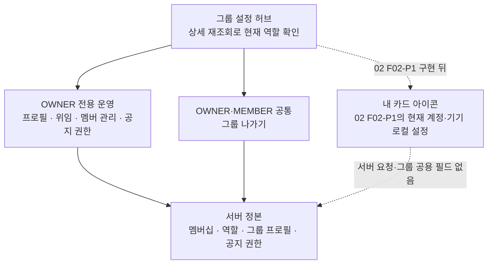
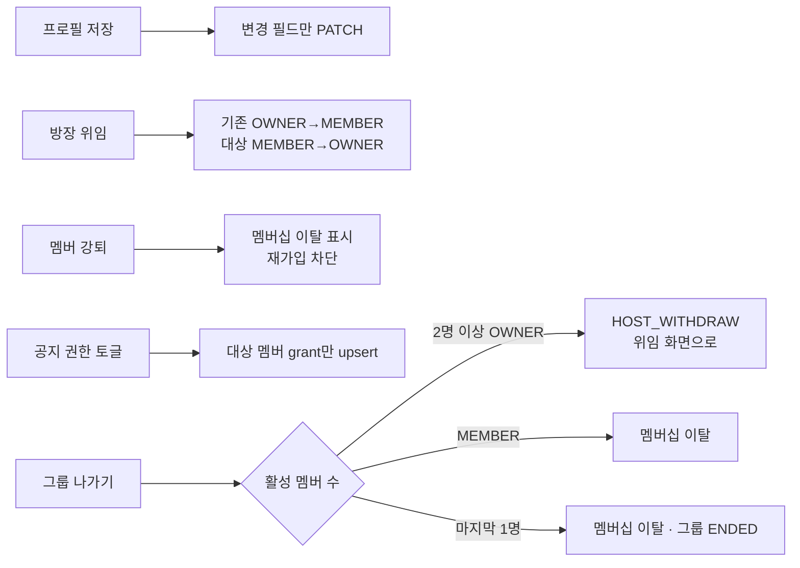
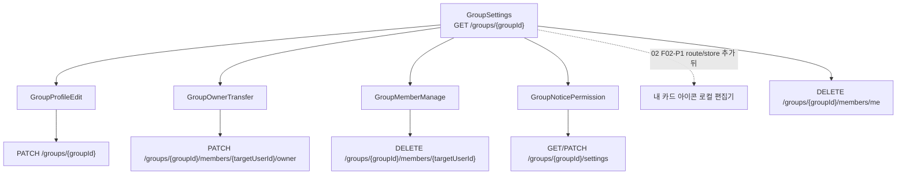

# HLD — 그룹 운영

| 항목      | 내용                                                                         |
| --------- | ---------------------------------------------------------------------------- |
| 시작      | [구현 착수 카드](./README.md)                                                |
| 상위 정본 | [PRD](../../prd.md) · [IA](../../information-architecture.md)                |
| 범위      | 그룹 프로필, 역할·위임, 멤버 강퇴, 공지 권한, 그룹 나가기                    |
| 비범위    | 카드 덱·그룹 가입·공지 작성·챌린지 운영의 상세 동작                          |
| 구현 상태 | [공통 상태 정본](../../shared/implementation-status.md)의 `GRP-04`를 따른다. |

그룹 운영은 기존 `GroupSettings` 허브와 서버 권한을 재사용한다. 화면이 OWNER 행을 숨겨도 권한의 정본은 서버다.

## 1. 책임과 권한 경계

| 기능           | OWNER       | MEMBER      | 서버 경계                                                                    |
| -------------- | ----------- | ----------- | ---------------------------------------------------------------------------- |
| 그룹 프로필    | 가능        | 불가        | `PATCH /groups/{groupId}`; 이름·소개·정원·공개 범위의 부분 수정              |
| 방장 위임      | 가능        | 불가        | 대상 활성 멤버를 OWNER로, 기존 OWNER를 MEMBER로 변경                         |
| 멤버 강퇴      | 가능        | 불가        | 대상 soft-delete·재가입 차단, 자기 자신 강퇴 불가                            |
| 공지 권한      | 가능        | 불가        | `announcementGrants`만 수정; OWNER는 항상 허용·토글 불가                     |
| 내 카드 아이콘 | F02-P1 계획 | F02-P1 계획 | 02 `F02-P1` 로컬 편집기·route/store 추가 뒤 진입; 서버 역할·그룹 속성은 불변 |
| 그룹 나가기    | 가능        | 가능        | MEMBER는 탈퇴, 다인 OWNER는 위임 뒤 탈퇴                                     |

- 허브와 각 운영 화면은 상세의 `members[].role`에서 내 역할을 다시 계산한다. 이전 화면의 역할·캐시는 권한 근거가 아니다.
- `내 카드 아이콘`의 저장 키·계정 격리·직렬화 쓰기·실패 복구는 [02 내 그룹 탐색 LLD §2](../02-my-groups/low-level-design.md#2-카드-순서아이콘-저장과-계정-경계)를 정본으로 한다. 이는 현재 운영 화면의 기능이 아니라 02 `F02-P1` 의존성이다. 02에서 로컬 편집기와 앱 route/store를 추가한 뒤 OWNER·MEMBER 모두 설정 허브에서 진입할 수 있으며, 아이콘을 역할·서버 권한 판단에 사용하지 않는다.

## 2. 운영 흐름과 데이터 영향

- 위임·강퇴·탈퇴는 그룹 멤버십을 바꾸므로 복귀한 허브·방·덱은 목록/상세를 다시 읽어야 한다.
- 탈퇴·강퇴·계정 탈퇴는 해당 사용자가 발급한 초대 링크를 같은 멤버십 전이에서 폐기한다. 링크 수명·재발급·가입 경합은 [01 획득 HLD §2.1](../01-acquisition/high-level-design.md#21-구형-초대-링크-전환)이 정본이며, OWNER 위임 뒤 활성 멤버로 남는 경우는 폐기하지 않는다.
- 강퇴 시 진행 중 내기 판돈은 이 기능에서 변경하지 않는다. 탈퇴는 서버 트랜잭션에서 열린 내기 참여를 해제·환불/정리한다.
- 마지막 1인의 탈퇴만 그룹 `ENDED` 전이를 만든다. 챌린지 `INACTIVE`와 그룹 `ENDED`는 다른 상태다.

## 3. 화면과 기존 API

`GroupRoom`과 02 카드 뒷면의 설정 진입은 같은 허브를 사용한다. 기존 운영 서버 API·DTO는 바꾸지 않지만, `내 카드 아이콘`은 02 `F02-P1`에서 앱 route/store를 새로 추가한 뒤 이 허브와 연결한다.

## 4. 설계 검증

- OWNER/MEMBER 각각에서 노출 행과 서버 거절을 함께 검증한다.
- 위임·강퇴·탈퇴 뒤 포커스 재조회가 바뀐 역할·멤버십을 반영해야 한다.
- 탈퇴·강퇴·계정 탈퇴 뒤 이전 slug가 landing·match·비공개 가입에 쓰이지 않고 claim은 새 사용자를 연결하지 않는 no-op인지, 재가입 뒤 새 slug만 성공하는지 검증한다.
- 02 `F02-P1` 아이콘 편집 route/store가 추가되면, 로컬 아이콘 저장 성공/실패가 그룹 프로필 저장·권한·멤버십 결과를 바꾸지 않음을 검증한다.
- 프로필·위임·강퇴·공지 권한의 기존 앱 이벤트는 API 성공 전용이고 `group_left`는 아직 사용자 귀속이 검증되지 않았다. v1은 이를 운영 성공률로 보고하지 않고, 역할·오류별 E2E에서 2xx 뒤 최신 detail·목록 수렴과 권한·검증·네트워크 실패 뒤 false success 0건을 출시 조건으로 본다. `NOT_FOUND|MEMBER_ONLY`는 최신 서버 응답 또는 후속 detail·목록이 이미 나감·대상 부재라는 postcondition을 확인할 때만 멱등 종료로 처리한다.
- 나가기의 `MEMBER_ONLY`는 활성 인증 뒤 요청자 미소속을 확인하므로 응답 자체를 사후조건으로 사용할 수 있다. `NOT_FOUND`는 비활성 요청자와 그룹 부재가 모두 가능하므로 인증 상태와 그룹 scope를 재확인한다. 그룹 부재면 목록으로 복귀하고, 비활성 요청자면 성공 처리·성공 이벤트 없이 세션을 안전 복구하며, 의미가 불명하거나 확인이 실패하면 현재 상태를 보존하고 오류를 표시한다. 강퇴에서는 `NOT_FOUND`·`MEMBER_ONLY`가 group·requester·target 중 어느 부재인지 모호하므로 최신 detail을 재조회해 target 부재·그룹 종료·요청자 이탈을 구분하고, 확인 실패나 target 유지에는 로컬 행 제거·성공 표시를 하지 않는다.
