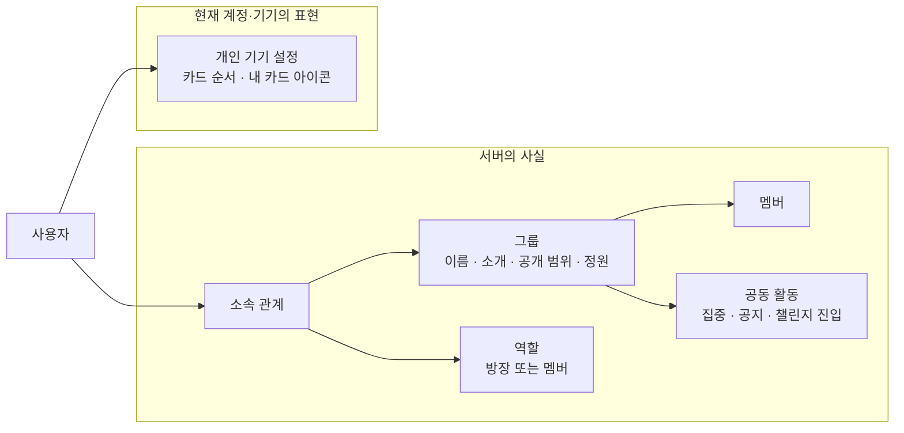
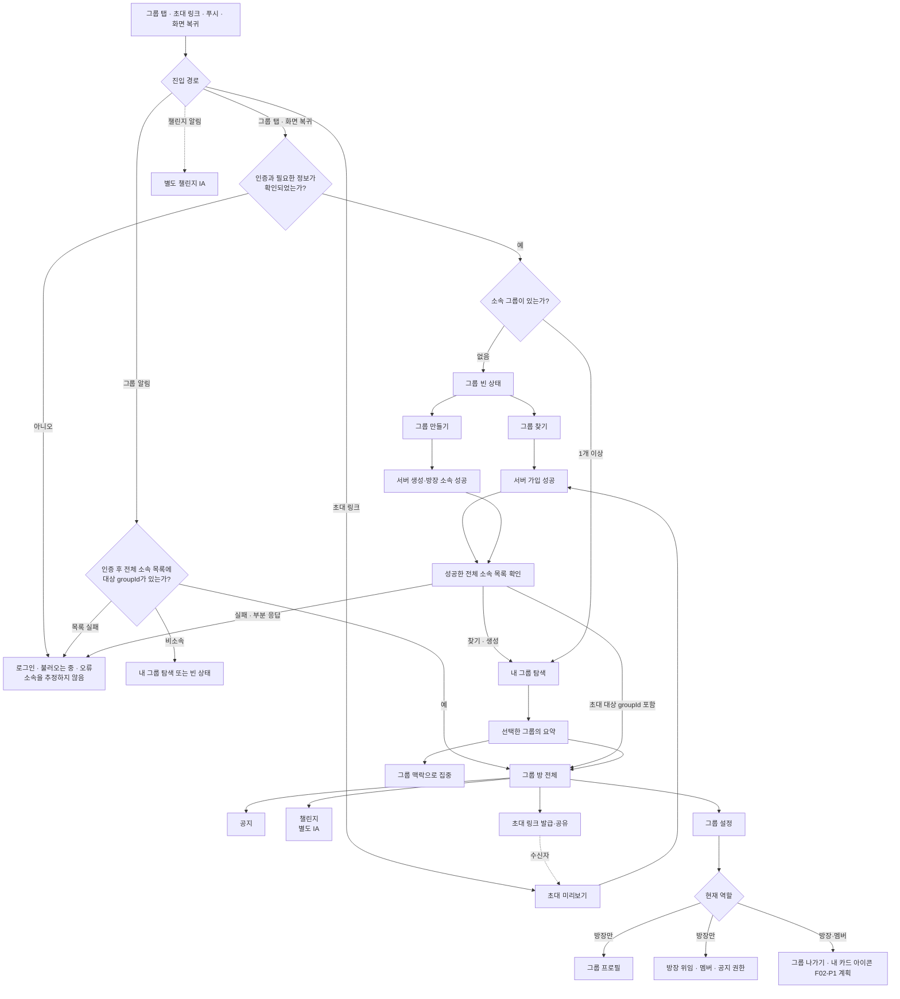
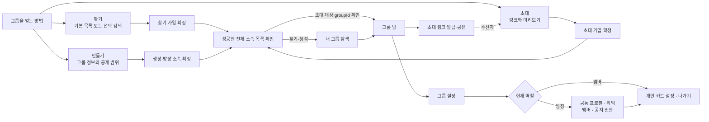
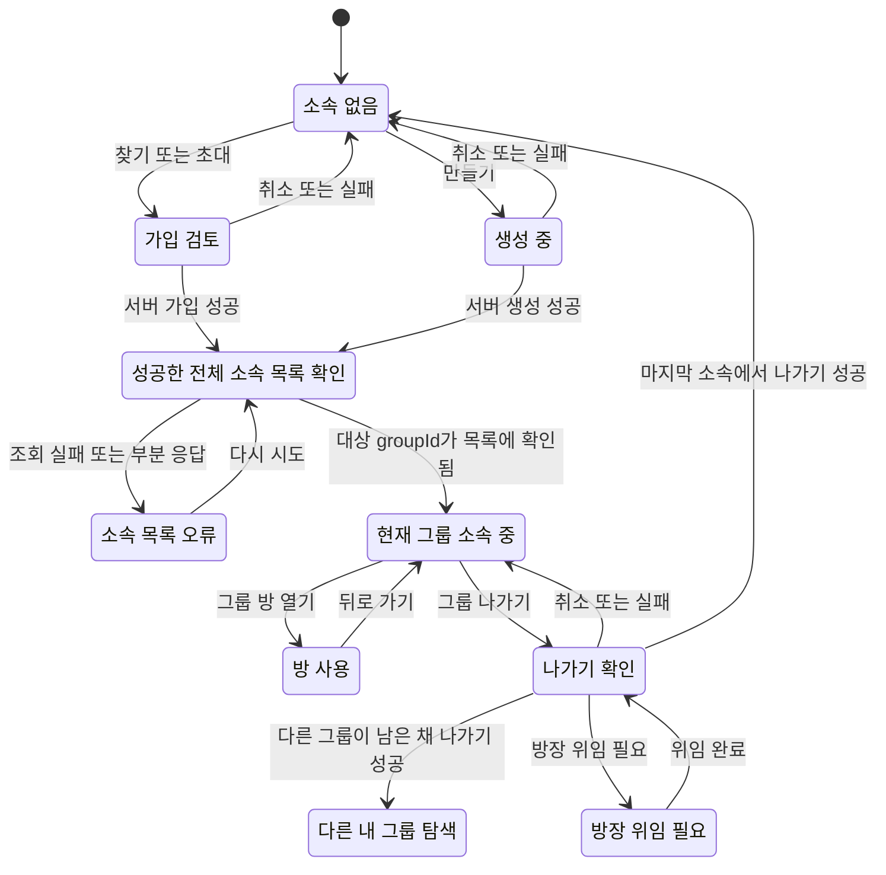
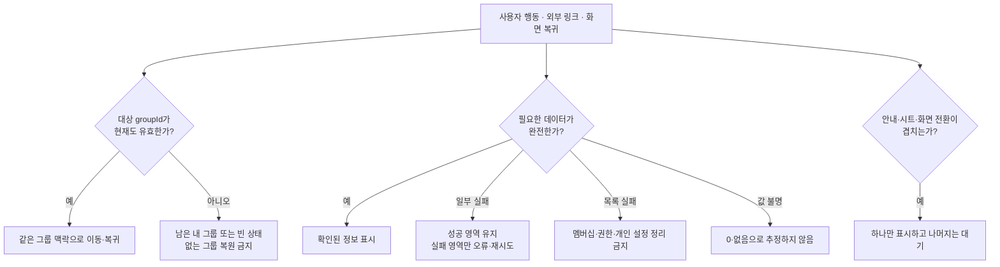

# IA — 그룹 전체 경험

| 항목 | 내용                                                                                                     |
| ---- | -------------------------------------------------------------------------------------------------------- |
| 상위 | [그룹 생애주기 PRD](./prd.md)                                                                            |
| 하위 | [통합 HLD](./high-level-design.md) · [통합 LLD](./low-level-design.md) · [기능별 상세 지도](./README.md) |
| 역할 | 그룹의 정보 관계, 화면 위치, 역할별 접근, 이동과 복귀 원칙을 정의한다.                                   |
| 제외 | API·캐시 키·이벤트 속성·제스처 수치·컴포넌트 구조는 기능별 HLD·LLD에서 다룬다.                           |

이 문서는 전체 화면·정보 관계의 정본이다. 카드 내부처럼 한 기능에 한정된 정보 위계는 기능 IA가 보완하고, 책임·데이터·구현 방식은 HLD·LLD가 결정한다. 문서 종류별 충돌 규칙은 [문서 지도](./README.md#2-정본은-문서-종류별로-결정한다)를 따른다.

---

## 1. 그룹을 이루는 정보

- 서버는 어느 그룹에 속하는지, 어떤 권한이 있는지, 방에서 무슨 일이 일어났는지 결정한다.
- 개인 기기 설정은 같은 서버 그룹을 나에게 어떻게 배열·표시할지만 바꾼다.
- `groupId`가 그룹의 신원이다. 이름과 카드 위치는 이동·복귀·권한의 기준이 아니다.

---

## 2. 전체 화면 지도

- 소속 그룹이 1개여도 기본 진입은 `내 그룹 탐색`이다. 전체 그룹 방은 사용자가 선택한 뒤 열린다.
- 가입·생성의 서버 성공 뒤에는 먼저 성공한 전체 소속 목록을 확인한다. 그 다음 찾기·생성은 내 그룹 탐색으로, 초대는 대상 `groupId`가 목록에 있을 때만 해당 방으로 전환한다.
- 초대 링크는 로그인 전에도 보관될 수 있지만, 인증과 미리보기를 거쳐 가입 결과를 확정한다.

---

## 3. 획득과 운영의 경계

- 찾기·초대·만들기는 같은 획득 목적을 가지지만 진입 맥락과 실패 이유를 섞지 않는다.
- 방장은 공동 프로필·역할·멤버·공지 권한을 관리한다. 공지 권한을 받은 멤버는 공지를 작성·수정·삭제할 수 있다. 내 카드 아이콘은 역할과 무관한 개인 설정이다.
- 그룹 삭제 화면은 제공하지 않는다. 마지막 멤버가 정상적으로 나가면 서버가 그룹을 종료한다.

---

## 4. 소속 생애주기

- 소속은 로컬 카드 상태가 아니라 서버 관계다. 가입·나가기·강퇴 성공 뒤에는 전체 소속 목록을 확인한 뒤에만 목적지를 정한다.
- 강퇴된 사용자는 일반적인 재가입 경로로 복원하지 않는다.
- 다른 멤버가 있는 방장은 먼저 위임한 뒤 나간다. 마지막 멤버의 정상 이탈은 그룹 종료로 이어진다.

---

## 5. 복귀·실패·중첩 원칙

- 방·설정에서 돌아올 때 index가 아니라 `groupId`로 맥락을 복원한다.
- 서버 목록에서 그룹이 사라졌을 때만 유효한 다른 그룹 또는 빈 상태로 이동한다.
- 일부 데이터 실패가 다른 정보와 안전한 행동까지 숨기게 만들지 않는다.
- 안내·초대 미리보기·생성 완료 시트·화면 전환은 동시에 사용자 입력을 점유하지 않는다.

---

## 6. 화면별 정보 책임

| 화면         | 사용자가 답하는 질문             | 포함                                                             | 포함하지 않음                                         |
| ------------ | -------------------------------- | ---------------------------------------------------------------- | ----------------------------------------------------- |
| 그룹 빈 상태 | 어떻게 그룹을 얻을까?            | 찾기·만들기, 외부 초대 진입                                      | 존재하지 않는 추천·가짜 활동                          |
| 찾기·초대    | 이 그룹에 들어갈까?              | 공개 정보·정원·가입 결과                                         | 멤버 전용 공지·하위 기능                              |
| 만들기       | 어떤 그룹을 만들까?              | 이름·소개·정원·공개 범위                                         | 하위 기능 동시 생성                                   |
| 내 그룹 탐색 | 내 그룹 중 어디서 무엇을 할까?   | 소속 그룹 식별·요약·집중/방 진입                                 | 그룹 방 전체 기능의 복제                              |
| 그룹 방      | 이 그룹에서 지금 무슨 일이 있나? | 멤버·집중·공지·하위 기능 진입·초대 공유                          | 다른 그룹의 상태                                      |
| 공지         | 무엇을 모두에게 알려야 하나?     | 전체 멤버 읽기, 방장·공지 권한 멤버의 쓰기                       | 화면 노출만으로 쓰기 권한 확정                        |
| 그룹 설정    | 내가 무엇을 바꿀 수 있나?        | 나가기, `F02-P1` 개인 설정, 방장 전용 프로필·위임·멤버·공지 권한 | MEMBER에게 방장 전용 화면 노출, 낡은 역할로 권한 확정 |

---

## 7. 상세 문서 연결

| 정보 범위                                | 상세 문서                                                                                                                                                                                                                          |
| ---------------------------------------- | ---------------------------------------------------------------------------------------------------------------------------------------------------------------------------------------------------------------------------------- |
| 찾기·초대·생성·가입                      | [착수 카드](./features/01-acquisition/README.md) · [그룹 획득 HLD](./features/01-acquisition/high-level-design.md) · [LLD](./features/01-acquisition/low-level-design.md)                                                          |
| 카드 앞·뒤, 캐러셀, 순서·아이콘, 첫 안내 | [착수 카드](./features/02-my-groups/README.md) · [내 그룹 탐색 IA](./features/02-my-groups/information-architecture.md) · [HLD](./features/02-my-groups/high-level-design.md) · [LLD](./features/02-my-groups/low-level-design.md) |
| 그룹 방, 집중, 공지                      | [착수 카드](./features/03-activity/README.md) · [그룹 활동 HLD](./features/03-activity/high-level-design.md) · [LLD](./features/03-activity/low-level-design.md)                                                                   |
| 챌린지                                   | [PRD](../challenge/prd.md) · [IA](../challenge/information-architecture.md) · [HLD](../challenge/high-level-design.md) · [LLD](../challenge/low-level-design.md)                                                                   |
| 프로필, 역할, 멤버, 권한, 이탈           | [착수 카드](./features/04-operation/README.md) · [그룹 운영 HLD](./features/04-operation/high-level-design.md) · [LLD](./features/04-operation/low-level-design.md)                                                                |
