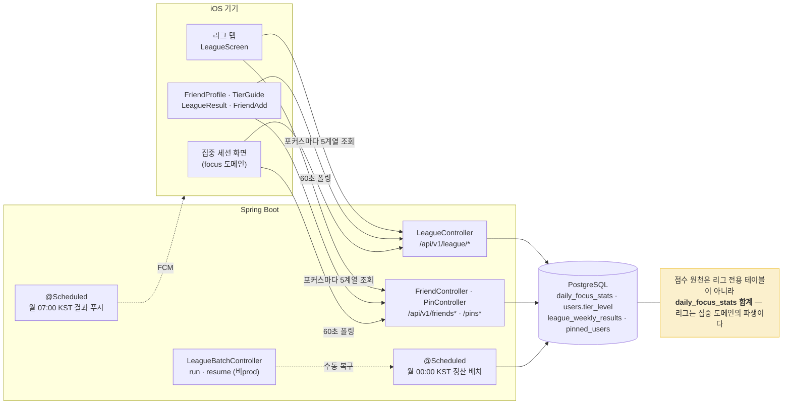
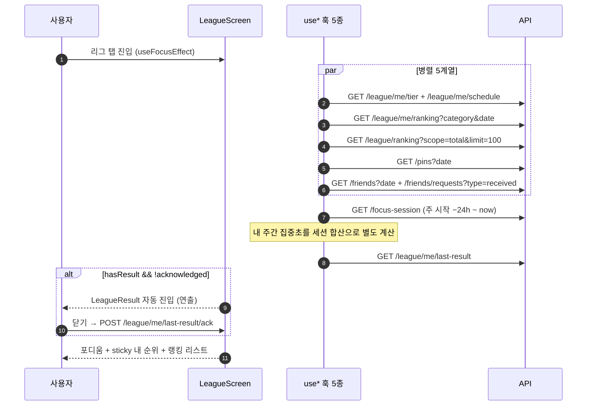
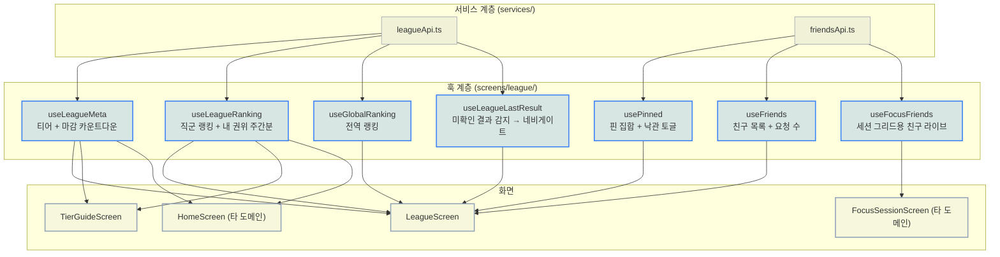
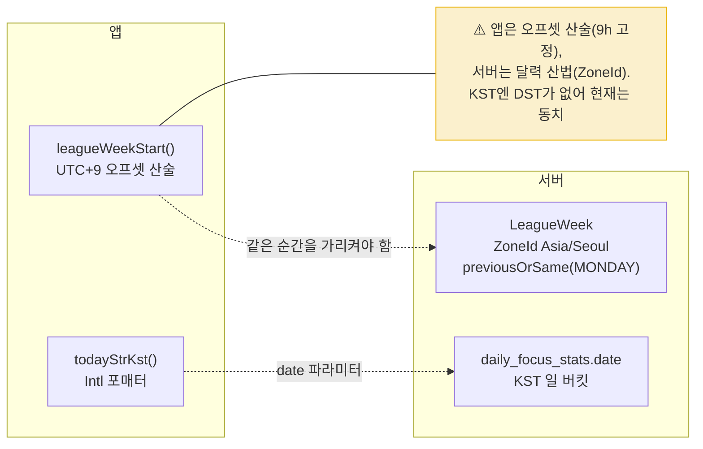
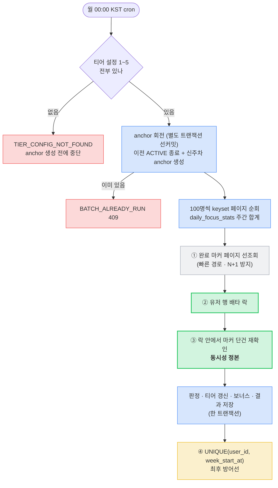
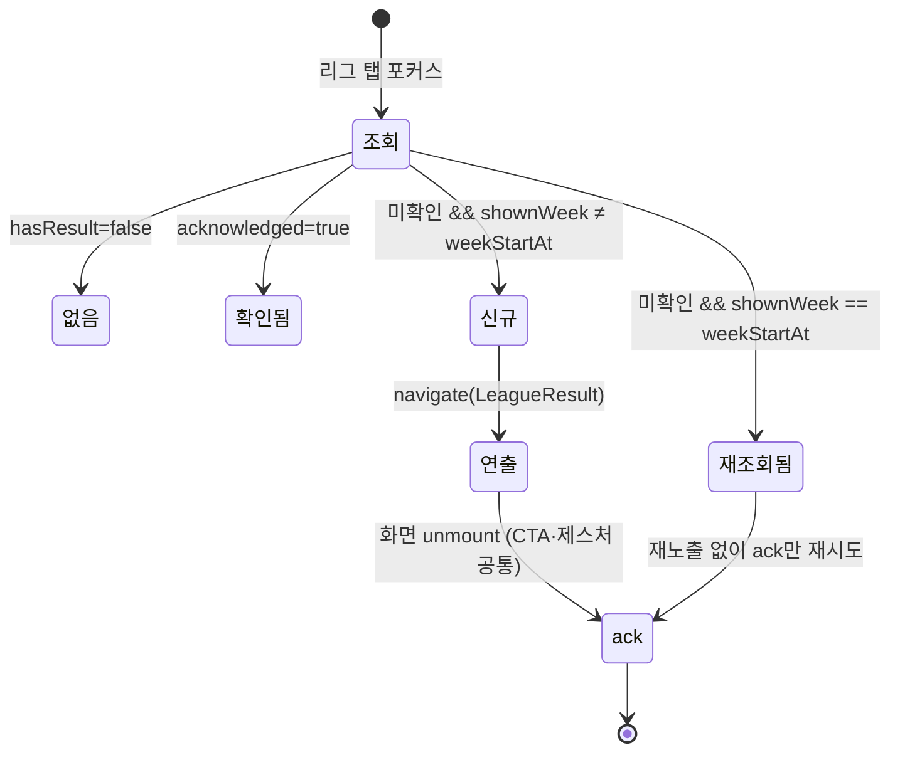
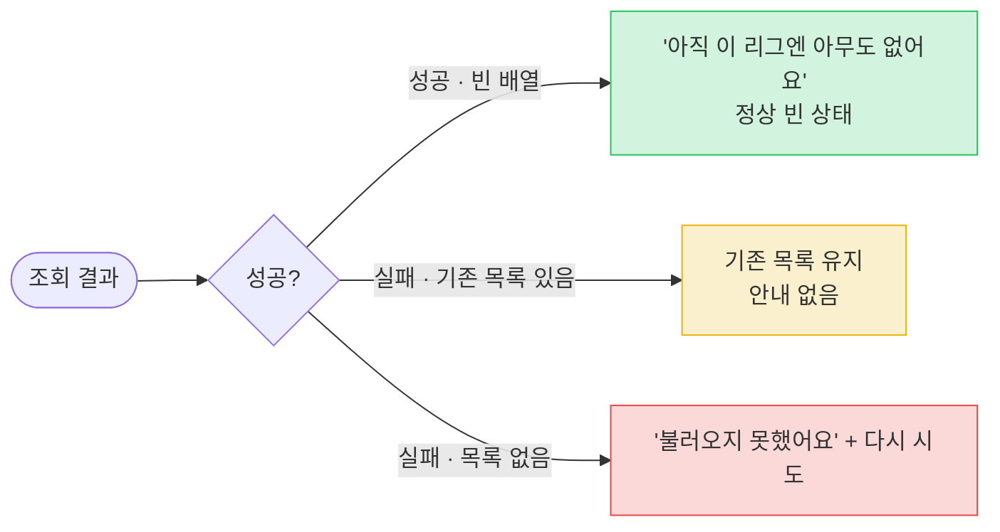
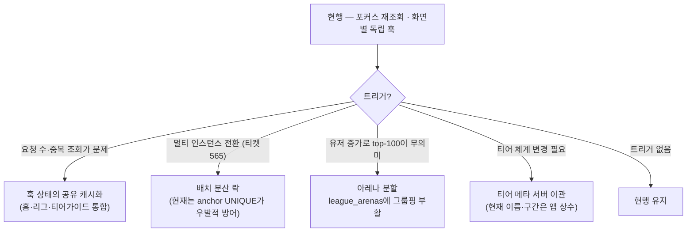

# High-Level Design — 리그

> 작성 2026-08-09 · 현재 구현 상태 기준
> 세트: [IA](information-architecture.md) · [PRD](prd.md) · **HLD** · [LLD](low-level-design.md)

## 1. 시스템 컨텍스트

- **리그는 저장소를 거의 갖지 않는다.** 주간 점수는 `daily_focus_stats`를 매 조회 집계하고, 리그가 소유한 영속 상태는 `users.tier_level` + `league_weekly_results`(정산 결과) + `league_arenas`(주차 anchor)뿐이다.
- **아레나는 "그룹"이 아니라 "주차 마커"다.** 멤버십 테이블(`league_arena_users`)은 V14에서 제거됐고, 남은 `league_arenas`는 주차마다 1행씩 도는 anchor다.
- WS/SSE 없음 — 랭킹 갱신은 화면 포커스 재조회 + 세션 화면 60초 폴링.

## 2. 화면 구성과 데이터 흐름

**한 번의 탭 진입이 최대 8~9개 요청을 낸다.** 홈 화면도 `useLeagueMeta`·`useLeagueRanking`을 마운트하므로 같은 조회가 화면마다 중복된다(공유 캐시 없음 — §9).

## 3. 훅 계층 구조

| 훅 | 책임 | 갱신 트리거 | 실패 정책 |
|---|---|---|---|
| `useLeagueMeta` | 티어 1건 + 마감까지 남은 초. **1초 로컬 카운트다운**을 스스로 돈다 | 화면 포커스 · pull-to-refresh | 중립 티어(레벨 null)·마감 null 유지, 조용히 무시 |
| `useLeagueRanking` | 직군 top-100 + **내 주간 집중초(세션 합산)** + 리그 라벨 | 화면 포커스 · pull-to-refresh | 이전 목록 유지 + `error=true`. **단 카테고리가 바뀐 뒤 실패면 비운다** |
| `useGlobalRanking` | 전역 top-100 | 화면 포커스 · pull-to-refresh | 이전 목록 유지 + `error=true` |
| `useLeagueLastResult` | 조회 후 **네비게이션 부수효과만** — 상태를 반환하지 않는다 | 화면 포커스 | 조용히 무시, 다음 포커스 재시도 |
| `usePinned` | 핀 ID 집합 + 낙관 토글. in-flight·세대 가드 2중 | 화면 포커스 · 토글 | 상태 유지 / 토글 실패는 롤백 + Alert |
| `useFriends` | 친구 목록 + 받은 요청 수 (`allSettled`로 부분 실패 허용) | 화면 포커스 · pull-to-refresh | 목록 유지 + `error=true`. 요청 수 실패는 에러로 올리지 않음 |
| `useFocusFriends` | 친구 전체 라이브 + 핀 ID 집합 | 60초 인터벌 · 포그라운드 복귀 | 상태 유지 |

**공통 규율 — 요청 시퀀스 가드.** 포커스 재조회와 pull-to-refresh가 겹칠 때 늦게 도착한 이전 응답이 최신 상태를 덮지 않도록, 훅마다 `requestSeqRef`로 stale 응답을 버린다(`useLeagueRanking.ts:109,138`).

**책임 분리의 예외 하나** — `useLeagueLastResult`는 값을 반환하지 않고 `navigation.navigate`를 직접 호출한다. "조회 결과에 따라 화면을 띄운다"가 이 훅의 전부라, 호출부에 조건 분기를 넘기면 같은 로직이 화면마다 복제된다.

## 4. 주간 경계와 KST 시간 축

- **주 경계**: 양쪽 모두 KST 월요일 00:00. 앱은 `Date.now() + 9h`로 벽시계를 옮긴 뒤 월요일 00:00으로 내리고 되돌린다(`useLeagueRanking.ts:55-60`). 서버는 `LocalDate.with(previousOrSame(MONDAY)).atStartOfDay(KST)`.
- **경계를 걸친 세션**: 서버 세션 조회는 `startedAt` 필터라, 일요일 밤 시작 → 월요일 종료 세션이 새 주 조회에서 빠진다. 앱은 **주 시작 −24시간**부터 받아 `endedAt ≥ weekStart`로 재필터한다. 서버 주간 집계는 `daily_focus_stats`의 **일 버킷** 합이라 그 세션도 새 주에 들어간다 — 두 정의를 맞추는 보정이다.
- **일 축**: 라이브 '당일 집중분'의 기준일도 KST(`todayStrKst()`). 계약 테스트(`services/leagueApi.test.ts`)가 로컬 날짜 유출을 막는다.
- **한계**: 서버 일 버킷의 존은 `country_code` 파생이라 KR이 아닌 유저는 KST가 아닐 수 있다. 앱은 KST를 정본 축으로 통일해 보낸다.

## 5. 정산 파이프라인과 멱등성

**멱등이 4겹인 이유** — 각 층이 막는 사고가 다르다.

| 층 | 막는 것 | 못 막는 것 |
|---|---|---|
| ① 페이지 선조회 | 이미 정산된 유저에 대한 불필요한 락·쿼리 | 동시 재실행 (조회~락 사이 창) |
| ② 배타 락 | 탈퇴 레이스, 지갑 삭제 레이스, lost update | 자기 혼자서는 중복 판정을 못 막음 |
| ③ 락 안 마커 재확인 | **연쇄 승급(래칫)** — 이미 승급된 티어로 다시 판정하는 것 | — (동시성 정본) |
| ④ UNIQUE 제약 | 위 셋이 뚫렸을 때의 이중 결과 행 | flush 시점 예외라 트랜잭션 전체 롤백 |

**판정 기준 티어는 스냅샷이 아니라 락으로 잡은 행이다.** 페이지 조회 시점의 `tierLevel`을 쓰면 락 대기 중 커밋된 다른 주차 정산(예: 과거 주차 resume의 승급)을 놓친다. 락을 두 번째로 잡는 쪽이 항상 커밋된 진실 위에서 판정하도록 재조회한다.

**결과 4갈래** — `SETTLED` / `ALREADY_SETTLED`(같은 주차 기정산) / `SKIPPED_SUPERSEDED`(더 늦은 주차가 이미 정산됨 → 소급 금지) / `SKIPPED_WITHDRAWN`(집계 후 탈퇴). boolean 두 갈래로는 "이미 정산됨"을 표현할 수 없어 enum으로 넓혔다.

**resume은 절대 회전하지 않는다.** 복구 진입점은 대상 주차의 run이 커밋한 **가드 anchor**(= 대상 주차 + 1주)의 존재를 확인하고, 없으면 `BATCH_NOT_RUN`(409)으로 거절한다. 또 `created_at < 주차 종료 경계` 컷오프로 **주차 종료 후 가입자의 0초 STAY 조작**을 막는다.

**유저 단위 롤백** — 한 명이 예외로 터져도 그 유저만 롤백되고 나머지는 계속된다. 이를 위해 배치 오케스트레이터(`LeagueBatchService`)와 건별 트랜잭션(`LeagueUserSettler`)이 **클래스로 분리**돼 있다 — 자기 호출은 프록시를 타지 않아 `@Transactional`이 성립하지 않기 때문.

## 6. 결과 연출의 1회성

**두 개의 가드가 서로를 보완한다.** 서버 `acknowledged`는 기기가 바뀌어도 유지되지만 ack 요청이 실패하면 갱신되지 않는다. 앱 세션 내 `shownWeek` ref는 그 실패 창에서 같은 연출이 반복되는 것을 막는다. ack는 조건부 원자 UPDATE(`acknowledgedAt IS NULL`)라 중복 호출이 안전하다.

## 7. 실패와 빈 상태의 분리

리그가 소셜 기능이라 **"실패"가 "아무도 없음"으로 보이면 서비스가 죽은 것처럼 보인다.** 랭킹(`LeagueScreen.tsx:558-572`)·친구 목록(`:620-626`)이 같은 패턴을 공유한다. 게스트는 실패가 아니라 정상 빈 상태로 취급해 에러 안내를 띄우지 않는다.

## 8. 앞으로 변할 방향

## 9. 트레이드오프 및 한계

| 결정 | 트레이드오프 | 한계 (수용) |
|---|---|---|
| 리그 전용 점수 테이블 없음 | 집중 도메인과 항상 정합 ↔ 조회마다 집계 | 주간 랭킹 쿼리가 `daily_focus_stats` 스캔이다. 유저 증가 시 스냅샷 테이블이 필요해진다 |
| 화면별 독립 훅 (공유 캐시 없음) | 훅이 단순하고 화면 간 결합 0 ↔ 같은 조회 중복 | 리그 탭 1회 진입 = 8~9 요청, 홈도 별도로 2 요청. 세션 전량 조회는 특히 무겁다 |
| 포커스 재조회 (구독 없음) | 구현 단순 · 항상 최신 ↔ 실시간성 없음 | 화면에 머무는 동안 순위가 갱신되지 않는다 (세션 화면만 60초 폴링) |
| 승강 = 절대 시간 임계값 | 판정이 결정적·설명 가능 ↔ 경쟁 실감 약화 | 랭킹 UI가 주는 "순위=승급" 기대와 어긋난다. 가이드 문구가 실제로 틀려 있다 (PRD §4.2) |
| 배치 분산 락 없음 (티켓 565) | 단일 인스턴스에서 단순 ↔ 스케일아웃 시 재작업 | 동시 실행 시 anchor UNIQUE가 하나만 통과시키지만, 스케줄러가 예외를 잡지 않아 스택트레이스가 뜬다 |
| `promotionBonusCoins` 조회 시 재계산 | 미지급 케이스를 0으로 정직하게 보고 ↔ 저장값 아님 | 멱등키 문자열 포맷이 정산부와 문자 단위로 일치해야 한다. 보상 공식이 바뀌면 **과거 결과의 표시 금액이 소급 변경**된다 |
| 전역 랭킹에 라이브·핀 없음 | 전역 쿼리 비용 절감 ↔ 표현 비대칭 | 같은 `RankRow` 컴포넌트가 탭에 따라 다른 정보량을 그린다 |
