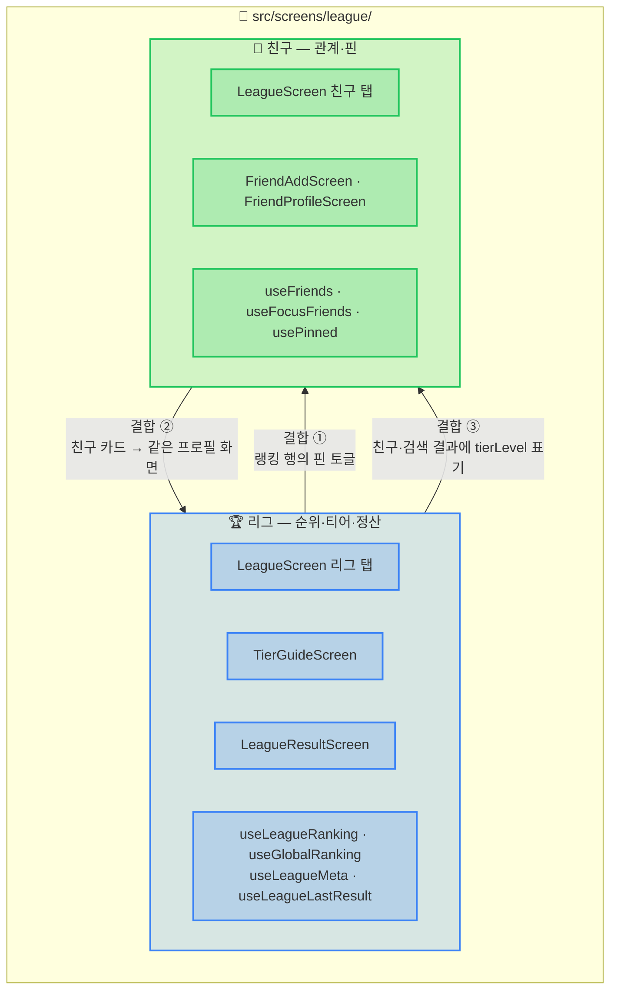
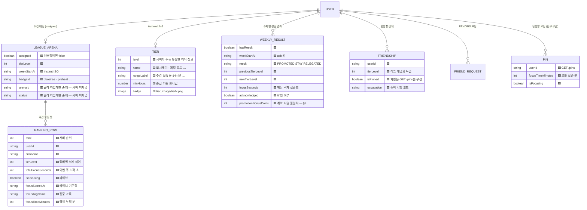
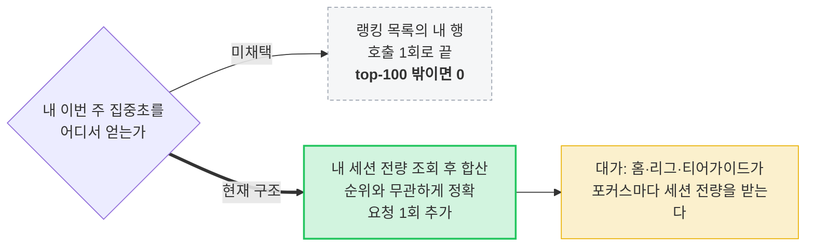
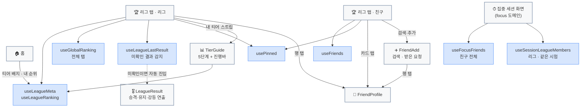
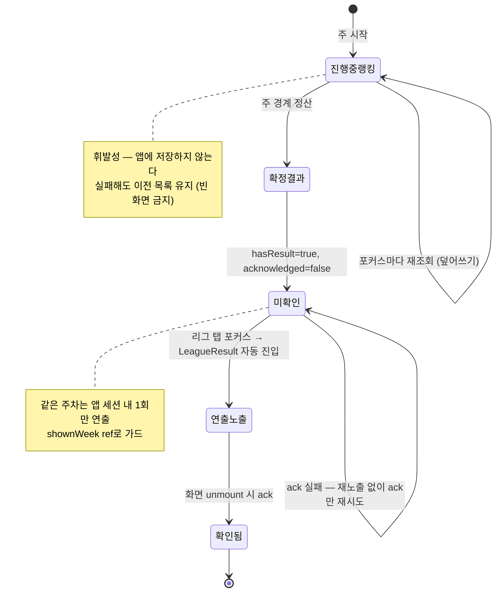

# 리그 — IA (Information Architecture)

> 작성 2026-08-09 · 현재 구현 상태 기준
> 세트: **IA** · [PRD](prd.md) · [HLD](high-level-design.md) · [LLD](low-level-design.md)

**신뢰 등급** — 🟩 서버 정본 · 🟦 클라 파생(서버 값에서 계산) · 🟨 클라 전용 상수(서버가 안 가짐) · 🟥 부채

---

## 1. 한 폴더, 두 도메인

`src/screens/league/` 안에는 개념이 다른 두 도메인이 함께 산다. **폴더 배치일 뿐 같은 도메인이 아니다.**

| 결합 지점 | 무엇이 흐르는가 |
|---|---|
| **핀(pin)** | 리그 랭킹에서 누르고, 친구 그리드에서 배지로 보이고, 프로필 헤더에서 토글한다. 세 화면이 `usePinned` 하나의 서버 상태를 공유한다 (`LeagueScreen.tsx:79`) |
| **프로필 화면** | 랭킹 행·친구 카드·검색 결과·받은 요청 **4개 진입점**이 모두 `FriendProfile`로 모인다 (`LeagueScreen.tsx:231-265`) |
| **티어 배지** | 티어는 리그 소유 개념인데 친구 카드·검색 결과에도 `tierLevel`이 실려 온다 (`types/api.ts:163,178,186`) |

> **친구 ≠ 핀.** 집중 세션 화면의 친구 그리드는 **친구 전체**를 대상으로 한다(`useFocusFriends.ts:5`, `GET /friends`).
> **핀은 랭킹 고정용**이다 — 친구가 아니어도 핀할 수 있고(`friendsApi.ts:62`), 리그 랭킹의 '핀한 사람만' 필터와
> 세션 리그 그리드의 상한 컷 우선 포함에 쓰인다(`useSessionLeagueMembers.ts:41-46`).

---

## 2. 엔티티 관계 (앱이 보는 계약 기준)

`TIER`가 이 그림의 핵심 비대칭이다 — **서버는 `users.tier_level` 정수 하나만 가지고, 티어의 의미(이름·구간·뱃지 이미지)는 전부 앱 상수**다(`constants/tiers.ts:19-60`). 승강 규칙만 서버 테이블 `league_tier_configs`에 있다.

> 🟥 **유령 필드** — 앱의 `LeagueTierResponse`는 `arenaId`·`status`를 선언하지만(`types/api.ts:101,103`),
> 서버 record는 `(assigned, tierLevel, weekStartAt, badgeId)` 넷뿐이다. 두 필드는 항상 `undefined`로 도착하고
> `useLeagueMeta.ts:7-14`의 중립값에만 존재한다. 반대로 서버가 주는 `badgeId`는 앱이 쓰지 않는다(뱃지는 로컬 이미지).

---

## 3. 정보의 출생지와 신뢰 등급

| 정보 | 출생지 | 등급 | 근거 |
|---|---|---|---|
| 주간 랭킹 목록 | `GET /league/me/ranking` · `GET /league/ranking` | 🟩 | `leagueApi.ts:28,37` |
| 내 티어 레벨 | `GET /league/me/tier` | 🟩 | `useLeagueMeta.ts:40` |
| 마감까지 남은 초 | `GET /league/me/schedule` 응답 + **앱의 1초 감산** | 🟩→🟦 | `useLeagueMeta.ts:59-65` |
| **내 이번 주 집중초** | **내 세션 목록 합산** (랭킹에서 뽑지 않음) | 🟦 | `useLeagueRanking.ts:70-81` |
| 화면에 찍히는 순위 | 지금 보고 있는 목록의 **배열 위치 + 1** | 🟦 | `LeagueScreen.tsx:185,540` |
| 라이브 집중 시간 | `totalFocusSeconds + (now − focusStartedAt)` | 🟦 | `LiveFocusTime.tsx:22` |
| 티어 이름·구간·뱃지 | `constants/tiers.ts` | 🟨 | 서버는 level만 준다 |
| 리그 라벨(시험명) | 로컬 카테고리 → Occupation 매핑 | 🟨 | `useLeagueRanking.ts:130` |
| `MY_USER_ID = 'u-07'` | 시안 유래 센티널 — 내 행 표시용 치환값 | 🟨 | `mock.ts:9`, `useLeagueRanking.ts:31` |
| 핀 집합 | `GET /pins` + 낙관적 토글 | 🟩→🟦 | `usePinned.ts:42,70` |
| 친구 목록·요청 수 | `GET /friends`, `GET /friends/requests` | 🟩 | `useFriends.ts:20-21` |
| 과목별/요일별 비교 | 내 통계 + 상대 통계 실조회 | 🟩 | `FriendProfileScreen.tsx:283-289,337-344` |
| 블러 티저 과목 수치 | `TEASER_SUBJECTS` 고정값 | 🟥 | `mock.ts:41-48` — 실데이터 미확보 시 그럴듯한 가짜 수치가 흐리게 깔린다 |

**경계 규칙 — 서버 값을 가공하는 것은 허용, 서버가 안 준 값을 지어내는 것은 금지.** 실제로 적용된 자리: 승급 보너스 코인은 서버가 실어 보낸 값만 쓴다. 클라 공식 폴백을 두면 서버가 진짜 0을 준(지급 실패) 경우에도 금액을 지어내 유령 배지를 띄운다(`LeagueResultScreen.tsx:48-52`).

### 3.1 왜 '내 주간 집중초'만 랭킹에서 뽑지 않는가

`/league/me/ranking`은 "내 아레나 로스터"가 아니라 **상위 100명 리스트**라 나를 포함한다는 보장이 없다
(`useLeagueRanking.ts:63-69`). top-100 밖 유저의 티어가이드 진행바·핀 격차가 조용히 0으로 틀어지는 것을 막는 선택이다.

---

## 4. 화면 ↔ 정보 매핑

---

## 5. 주간 주기 — 정보의 수명

**두 정보의 성격이 정반대다.**

| | 진행 중 랭킹 | 확정된 지난주 결과 |
|---|---|---|
| 소유 | 서버, 매 조회 새 값 | 서버, 주차별 불변 |
| 앱 저장 | 없음 (메모리만) | 없음 — `acknowledged`가 서버에 남는다 |
| 소비 횟수 | 무제한 | **정확히 1회** (연출) |
| 실패 정책 | 이전 목록 유지 + 에러 배너 (`LeagueScreen.tsx:558-572`) | 조용히 무시, 다음 포커스 재시도 (`useLeagueLastResult.ts:48-50`) |
| 멱등 장치 | 요청 시퀀스(stale 응답 폐기) | `ack` 멱등 + `shownWeek` ref |

---

## 6. 시간 축 — 전부 KST

- **주 경계**: `leagueWeekStart()`가 UTC+9 오프셋을 더해 KST 벽시계로 만든 뒤 월요일 00:00으로 내린다 (`useLeagueRanking.ts:51-60`). 기기 로컬로 계산하면 해외 타임존에서 서버와 몇 시간씩 어긋난다.
- **경계 세션 보정**: 서버 세션 조회 필터가 `startedAt` 기준이라 일요일 밤에 시작해 월요일에 끝난 세션이 새 주 조회에서 통째로 빠진다. 주 시작 **24시간 전**부터 받아 `endedAt ≥ weekStart`인 세션만 합산한다 (`useLeagueRanking.ts:72-80`).
- **일 축**: 라이브 '당일 집중분'의 기준일도 KST(`leagueApi.ts:26`, `friendsApi.ts:14`). 계약 테스트로 고정돼 있다 (`services/leagueApi.test.ts`).
- **알려진 한계**: 서버 버킷 존은 `country_code` 파생이라 KR이 아닌 유저는 서버 버킷이 KST가 아닐 수 있다 (`utils/localDate.ts:45-47`).

---

## 7. 앞으로 변할 방향

- **티어 의미의 서버 이관** — 지금은 서버가 `tierLevel`만, 이름·구간·뱃지는 앱 상수다. 티어 체계를 조정하려면 앱을 배포해야 하고, 구버전 앱은 새 기준을 모른 채 옛 구간 라벨을 보여준다. 서버가 티어 메타를 내려주는 방향이 자연스럽다.
- **캐릭터 정보의 랭킹 응답 편입** — 모든 아바타가 같은 정적 이미지다(`MemberAvatar.tsx`의 TODO). `PinnedFriendResponse.character`에 형태만 잡혀 있다.
- **전역 랭킹의 라이브 필드** — `/league/ranking`은 라이브 필드를 안 준다(`useLeagueRanking.ts:35-36`). 전체 탭에서만 '집중 중' 표시가 사라지는 비대칭이 남아 있다.
- **친구 도메인 분리** — `screens/friend/`로 떼면 `useFocusFriends`(집중 세션 전용)가 리그 폴더에 사는 어색함이 사라진다.
- **랭킹 상태의 공유 캐시** — 홈·리그·티어가이드가 각자 `useLeagueMeta`/`useLeagueRanking`을 마운트해 같은 조회를 중복한다.

## 8. 트레이드오프 및 한계

| 결정 | 트레이드오프 | 한계 (수용) |
|---|---|---|
| 티어 메타를 클라 상수로 | 배포 없이 뱃지·문구 조정 가능 ↔ 서버 기준과 어긋날 수 있음 | 실제로 어긋나 있다 — 앱은 "월요일 09시 정산"이라 안내하지만(`TierGuideScreen.tsx:125`) 서버 cron은 **월요일 00:00 KST**다. T5 구간 라벨의 상한 "70시간"도 판정에 없는 값이다 |
| 내 주간분을 세션 합산으로 | top-100 밖에서도 정확 ↔ 요청·페이로드 증가 | 홈 포커스마다 세션 전량 조회가 돈다 |
| 표시 순위 = 목록 위치 | 탭한 숫자와 프로필 숫자가 일치 | 공개 프로필의 서버 `rank`(전역 주간 순위)와 다른 값이 될 수 있다 — 의도된 선택 |
| 핀을 친구와 분리 | 친구 아닌 경쟁자도 고정 가능 | 사용자에게 "친구"와 "핀"의 차이를 설명하는 UI가 얇다 |
| 랭킹 무캐시(포커스 재조회) | 항상 최신 ↔ 화면 전환마다 왕복 | 오프라인에서는 이전 목록만 남고 갱신되지 않는다 |
| `MY_USER_ID` 센티널 치환 | 화면 로직이 단순해짐 | 랭킹 행의 `userId`가 실 ID가 아니게 되어, 프로필 진입 시 실 ID를 따로 넘겨야 한다 (`LeagueScreen.tsx:239-251`) |
| 블러 티저 고정 수치 | 잠금 상태의 시각적 완성도 | 실데이터가 아닌 값이 흐리게라도 화면에 존재한다 |
