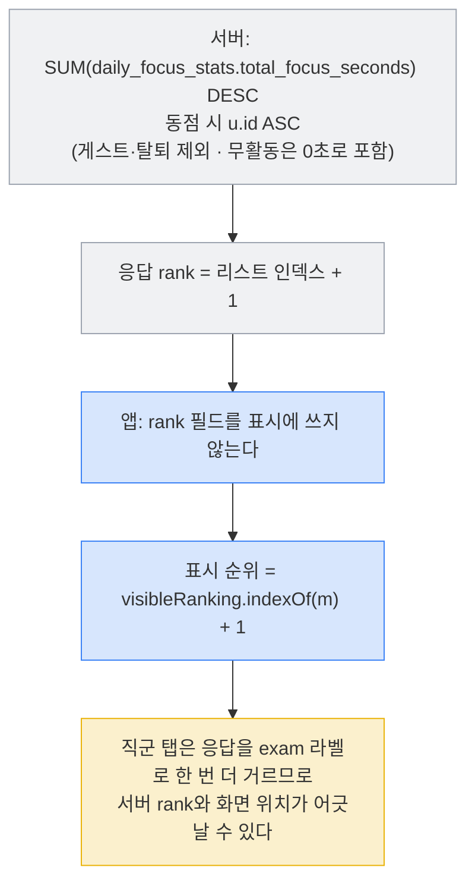
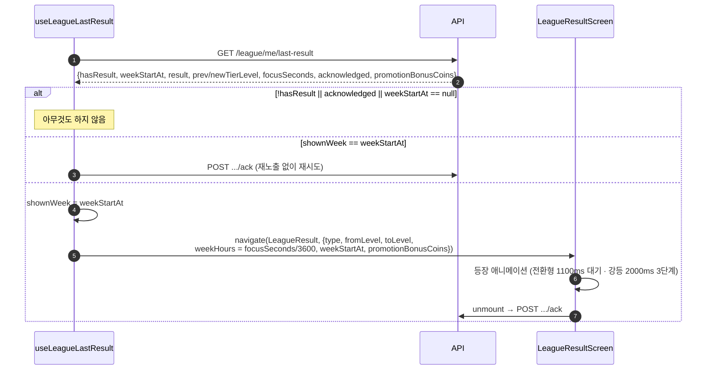
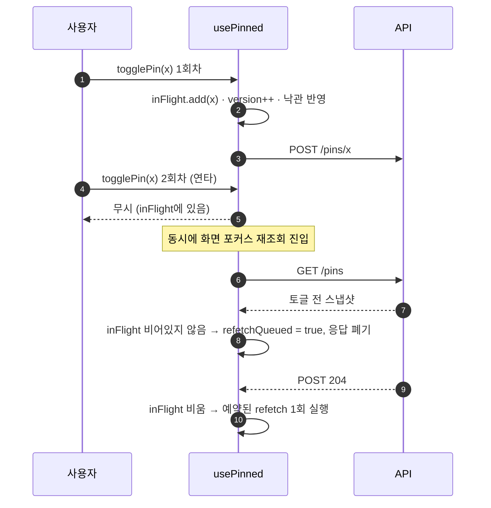
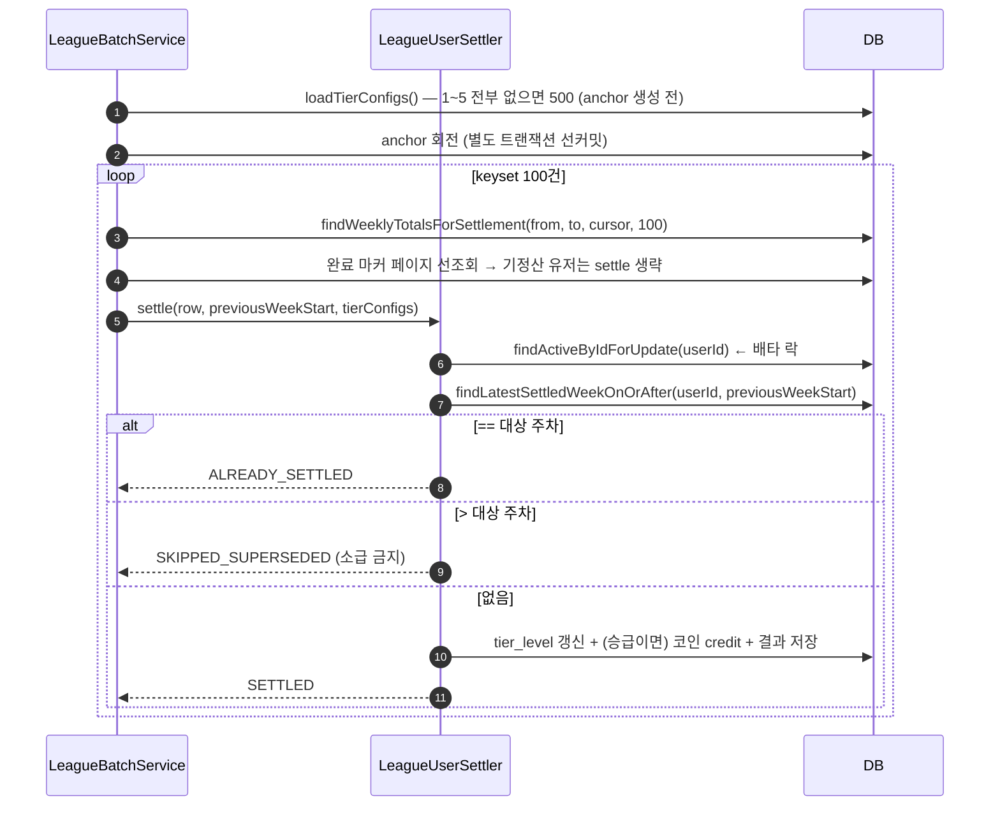

# Low-Level Design — 리그

> 작성 2026-08-09 · 현재 구현 상태 기준
> 세트: [IA](information-architecture.md) · [PRD](prd.md) · [HLD](high-level-design.md) · **LLD**
> 고정 파라미터: 랭킹 상위 100명 · 세션 그리드 상한 12명 · 폴링 60초 · 검색 디바운스 350ms · 검색 결과 20건 · 주 경계 월 00:00 KST

## 1. 파일별 지도

### 1.1 앱 — `src/screens/league/` (22 파일)

| 파일 | 줄 | 역할 |
|---|---|---|
| `LeagueScreen.tsx` | 1063 | 리그/친구 세그먼트 탭. 포디움 · sticky 내 순위 · 랭킹 리스트 · 핀 필터 · 친구 2열 그리드 · 리그 드롭다운 |
| `TierGuideScreen.tsx` | 222 | 현재 티어 히어로(진행바) + 5단계 카드 + 정산 안내 |
| `LeagueResultScreen.tsx` | 408 | 승격/유지/강등 풀스크린 연출(뱃지 크로스페이드 · 강등 3단계) + 승급 보너스 배지 + unmount ack |
| `FriendAddScreen.tsx` | 420 | 닉네임 검색(350ms 디바운스) · 친구 신청 · 받은 요청 수락/거절 |
| `FriendProfileScreen.tsx` | 783 | 공개 프로필 · 요약 · 요일별/과목별 비교 · 친구·핀 CTA. `isMe`면 솔로 모드 |
| `useLeagueRanking.ts` | 201 | 직군 랭킹 + **내 주간 집중초(세션 합산)** + 리그 라벨. `toRankingMembers` 공용 변환기 소유 |
| `useGlobalRanking.ts` | 54 | 전역 랭킹 (`toRankingMembers` 재사용) |
| `useLeagueMeta.ts` | 70 | 티어 + 마감 초 → 1초 로컬 카운트다운 라벨 |
| `useLeagueLastResult.ts` | 57 | 미확인 결과 감지 → `LeagueResult` 네비게이트 (값 미반환) |
| `usePinned.ts` | 89 | 핀 ID 집합 + 낙관 토글 (in-flight · 세대 가드) |
| `useFriends.ts` | 51 | 친구 목록 + 받은 요청 수 (`allSettled`) |
| `useFocusFriends.ts` | 69 | **집중 세션 화면 전용** — 친구 전체 라이브 + 핀 ID (60초 폴링) |
| `format.ts` / `format.test.ts` | 12 / 14 | `fmtDelta` + `timeFormat` 재수출. 델타 부호 표기 테스트 |
| `mock.ts` | 48 | `MY_USER_ID` 센티널 · `RankedMember` 확장 타입 · `TEASER_SUBJECTS` |
| `index.ts` | 7 | 화면 배럴 |
| `components/RankRow.tsx` | 157 | 랭킹 한 행 — 순위·티어뱃지·아바타·이름·시간·핀 |
| `components/LiveFocusTime.tsx` | 23 | 1초 틱 리렌더를 이 컴포넌트에 가둔 라이브 시간 텍스트 |
| `components/TierBadge.tsx` | 19 | `tiers.ts` 일러스트 렌더 |
| `components/MemberAvatar.tsx` | 26 | 원형 정적 캐릭터 아바타 (전원 동일 이미지) |
| `components/DuoDayChart.tsx` | 167 | 요일별 나/상대 2선 그래프 (`soloMine`이면 내 선만) |
| `components/SubjectCompareCard.tsx` | 184 | 과목별 가로 바 + 기간 탭(DAY/WEEK/MONTH) |

### 1.2 폴더 밖 의존

| 파일 | 역할 |
|---|---|
| `src/services/leagueApi.ts` | 리그 7개 엔드포인트 래퍼 |
| `src/services/friendsApi.ts` | 친구 8개 + 핀 3개 래퍼 |
| `src/services/compareAverages.ts` | 통계 비교축 — 랭킹 평균을 계산해 재사용 |
| `src/constants/tiers.ts` | 티어 5단계 메타 (이름·구간 라벨·시간·이미지) |
| `src/screens/focus/useSessionLeagueMembers.ts` | 세션 화면 리그 그리드 — `getMyRanking` 재사용 |
| `src/screens/HomeScreen.tsx:435-437` | 홈 상단바 티어 배지 + 내 순위 |

### 1.3 서버 — `back/.../league/`, `back/.../friend/`

| 파일 | 역할 |
|---|---|
| `league/api/LeagueController.java` | 조회 7종 |
| `league/api/LeagueBatchController.java` | `run`·`resume` 수동 트리거 (`@Profile local/dev/staging`) |
| `league/scheduler/LeagueScheduler.java:19` | `@Scheduled(cron="0 0 0 * * MON", zone="Asia/Seoul")` |
| `league/service/LeagueBatchService.java` | 오케스트레이터 — anchor 회전 · 100명 페이지 순회 · 요약 |
| `league/service/LeagueUserSettler.java` | **유저 1명 = 1 트랜잭션** 정산 (멱등 가드 · 판정 · 보너스 · 결과 저장) |
| `league/service/LeagueWeek.java:15` | KST 주 경계 계산기 |
| `league/domain/LeagueTierConfig.java` | 승급/강등 임계값(초) |
| `friend/api/FriendController.java` · `PinController.java` | 친구 · 핀 |

## 2. API 명세

### 2.1 리그

| 메서드/경로 | 요청 | 응답 | 비고 |
|---|---|---|---|
| `GET /api/v1/league/me/tier` | — | `{assigned, tierLevel, weekStartAt, badgeId}` | 앱 타입엔 `arenaId`·`status`도 있으나 **서버 미제공** |
| `GET /api/v1/league/me/ranking` | `category?`(Occupation), `date`(**필수**) | `LeagueMemberResponse[]` 상위 **100** | 라이브 필드가 채워지는 **유일한** 랭킹 |
| `GET /api/v1/league/ranking` | `scope=total`, `limit`(기본 100, 서버 클램프 1~500) | `LeagueMemberResponse[]` | 라이브·`isPinned` 전부 기본값 |
| `GET /api/v1/league/me/rank` | — | `{assigned, myRank, totalFocusSeconds}` | top-100 밖도 **정확한 순위**. 활동 로그 없음(구 `LEAGUE_RANK_VIEWED` 제거) |
| `GET /api/v1/league/me/schedule` | — | `{nextResetAt, remainingSeconds}` | `nextResetAt` = 다음 월요일 00:00 KST |
| `GET /api/v1/league/me/last-result` | — | `LeagueLastResultResponse` | **주차 필터 없음** — 최신 결과 1건 |
| `POST /api/v1/league/me/last-result/ack` | `{weekStartAt}` | 200 | 조건부 원자 UPDATE, 완전 멱등 |
| `POST /api/v1/league/batch/run` | — | `LeagueBatchSummaryResponse` | 비prod 전용. 409 `BATCH_ALREADY_RUN` |
| `POST /api/v1/league/batch/resume` | 헤더 `X-Batch-Admin-Key`, `weekStartAt?`, `userIds?` | 동상 | 400 `INVALID_WEEK_START` / 409 `BATCH_NOT_RUN` |

```java
// 서버 record 원문
record LeagueMemberResponse(int rank, UUID userId, String nickname, int tierLevel,
        int totalFocusSeconds, boolean isPinned, boolean isFocusing,
        int focusTimeMinutes, Instant focusStartedAt, String focusTagName)

record LeagueLastResultResponse(boolean hasResult, Instant weekStartAt, String result,
        Integer previousTierLevel, Integer newTierLevel, Integer focusSeconds,
        boolean acknowledged, int promotionBonusCoins)
```

### 2.2 친구 · 핀

| 메서드/경로 | 요청 | 응답 | 비고 |
|---|---|---|---|
| `GET /api/v1/friends` | `date`(필수) | `FriendResponse[]` | 페이징·정렬 없음 (전건) |
| `GET /api/v1/friends/requests` | `type=received\|sent` | `FriendRequestResponse[]` | `createdAt`의 실제 소스는 `updated_at` |
| `GET /api/v1/friends/search` | `type=NICKNAME`, `q` | `FriendSearchResultResponse[]` | pg_trgm, **최대 20건**. `type=CODE`는 죽은 값(409) |
| `POST /api/v1/friends/requests` | `{targetUserId}` | **201** | 중복 = 409. soft-delete 행은 복원 재사용 |
| `POST /api/v1/friends/requests/{id}/accept` · `/reject` | — | 200 | 수락은 관용(멱등), 거절은 PENDING 한정 |
| `DELETE /api/v1/friends/{friendUserId}` | — | **204** | 이미 없으면 404 → 앱은 성공 처리 |
| `GET /api/v1/pins` | `date`(필수) | `PinnedUserResponse[]` | `{userId, nickname, character[], focusTimeMinutes, isFocusing}` |
| `POST` · `DELETE /api/v1/pins/{userId}` | — | **204** | 멱등. 친구 아니어도 가능, 자기 자신 400 |

### 2.3 앱 미러 타입과 서버 record의 어긋남

| 필드 | 앱 (`types/api.ts`) | 서버 | 결과 |
|---|---|---|---|
| `LeagueTierResponse.arenaId` · `.status` | 선언함 (`:101,103`) | **없음** | 항상 `undefined`. 중립값에만 존재 |
| `LeagueTierResponse.badgeId` | 선언함 | 있음 | **앱이 안 씀** (뱃지는 로컬 이미지) |
| `LeagueMemberResponse.isPinned` | 의도적 미러 생략 (`:115`) | 있음 | 핀은 `GET /pins`가 정본 |
| `LeagueLastResultResponse.promotionBonusCoins` | `optional`, 주석에 "현재 백엔드 응답엔 없다" (`:148-149`) | **`int` 필수 필드** | 주석이 낡음 — 값은 실제로 온다 |
| `PinnedFriendResponse.focusStartedAt` · `.focusTagName` | `optional` (`:200-201`) | **없음** | `useFocusFriends.ts:44-45`의 폴백 경로가 **도달 불가** |

## 3. 티어 상수와 승강 임계값

### 3.1 앱 상수 (`constants/tiers.ts:19-60`)

| level | name | rangeLabel | minHours | maxHours |
|---|---|---|---|---|
| 1 | 뽀시래기 | 주간 집중 0–14시간 | 0 | 14 |
| 2 | 예열 모드 | 주간 집중 14–28시간 | 14 | 28 |
| 3 | 초집중 모드 | 주간 집중 28–42시간 | 28 | 42 |
| 4 | 갓생러 | 주간 집중 42–56시간 | 42 | 56 |
| 5 | 집중 정복자 | 주간 집중 56–**70**시간 | 56 | `null` |

`tierByLevel(level)`은 범위 밖을 가장 가까운 단계로 클램프한다(`:63-66`).

### 3.2 서버 정본 (`league_tier_configs`, `V13__league_tier_thresholds.sql:9-14`)

| tier | badge_id | promotion_time | relegation_time | 시간 환산 |
|---|---|---|---|---|
| 1 | `bbosirae` | 50400 | 0 | 승급 ≥14h / 강등 없음 |
| 2 | `preheat` | 100800 | 50400 | 승급 ≥28h / 강등 <14h |
| 3 | `hyperfocus` | 151200 | 100800 | 승급 ≥42h / 강등 <28h |
| 4 | `gatsaeng` | 201600 | 151200 | 승급 ≥56h / 강등 <42h |
| 5 | `conqueror` | 252000 | 201600 | 승급 불가(사문) / 강등 <56h |

**앱 `minHours`/`maxHours` = 서버 `relegation_time`/`promotion_time`(시간 환산)과 일치한다.** 예외는 T5의 `rangeLabel` "56–70시간" — 70시간은 판정에 쓰이지 않는 값이라 사용자에게 **존재하지 않는 상한**을 알린다.

### 3.3 판정식 (`LeagueUserSettler.decideResult`)

```java
if (tierLevel < 5 && focusSeconds >= config.getPromotionTime()) return PROMOTED;
if (tierLevel > 1 && focusSeconds <  config.getRelegationTime()) return RELEGATED;
return STAY;
```

승급은 **이상(`>=`)**, 강등은 **미만(`<`)**. 순위는 관여하지 않는다. 새 티어 = `±1` 또는 유지.

### 3.4 승급 보너스 (`CurrencyRewardPolicy.leaguePromotionReward`)

| 승급 **후** 티어 | 2 | 3 | 4 | 5 | 그 외 |
|---|---|---|---|---|---|
| 시간조각 | 50 | 100 | 200 | 500 | 0 |

멱등키 `league:{weekStartAt}:{userId}` — 정산 트랜잭션에 함께 기입된다. 조회 API는 이 키의 원장 존재를 확인한 뒤 **금액을 재계산해** 응답에 싣는다(저장값 아님).

## 4. 훅별 상태 · 캐시 · 리프레시

| 훅 | 내부 상태 | 캐시 | 리프레시 | 경합 가드 |
|---|---|---|---|---|
| `useLeagueMeta` | `tier`, `remainingSeconds` | 없음 (메모리) | 포커스 · `refetch()` · 1초 인터벌 | `requestSeqRef` (`:34,42`) |
| `useLeagueRanking` | `{members,label,mySeconds,forCategory}` 원자 1객체 + `error` | 없음 | 포커스 · `refetch()` | `requestSeqRef` (`:109,138`) + `forCategory` 대조 |
| `useGlobalRanking` | `members`, `error` | 없음 | 포커스 · `refetch()` | `requestSeqRef` (`:23,36`) |
| `useLeagueLastResult` | `shownWeek` ref만 | 앱 세션 내 주차 1회 | 포커스 | `cancelled` 플래그 |
| `usePinned` | `pinned: Set`, `loaded` | 없음 | 포커스 · 토글 | `inFlight: Set` + `version` 세대 + `refetchQueued` |
| `useFriends` | `friends`, `receivedCount`, `loaded`, `error` | 없음 | 포커스 · `refetch()` | `requestSeqRef` (`:15,26`) |
| `useFocusFriends` | `friends`, `pinnedIds`, `loaded` | 없음 | 60초 · AppState active | `pinnedIds` **내용 비교 후 참조 유지** (`:33-37`) |

**`useLeagueRanking`의 상태를 하나의 객체로 묶은 이유** — 목록·라벨·내 주간분·조회 시점 카테고리는 **함께 참이어야 한다**. 따로 두면 라벨만 새 값이고 목록은 옛 값인 중간 상태가 렌더된다.

**카테고리 변경 후 실패 처리** (`useLeagueRanking.ts:151-156`) — 일시 실패엔 기존 목록을 유지하지만, `forCategory`가 현재 카테고리와 다르면 **비운다**. 안 그러면 시험을 바꾼 뒤 이전 카테고리 리그가 계속 "내 리그"로 보인다.

**`usePinned`의 2중 가드** (`:22-46,55-86`)
1. **유저별 in-flight** — 같은 유저 연타 시 앞 요청이 끝나기 전 재토글 무시. POST/DELETE 순서 역전 방지.
2. **세대(`version`) 가드** — 재조회 응답이 토글 전 스냅샷이면 버리고 재시도. 뮤테이션 진행 중이면 `refetchQueued`로 미루고, 마지막 뮤테이션 완료 후 1회 재조회.

## 5. 랭킹 정렬 · 동점 · 순위 계산



| 규칙 | 값 |
|---|---|
| 정렬 | 주간 누적 집중초 **내림차순** |
| 동점 | `users.id` 오름차순 (UUIDv7이라 사실상 **가입 순**) — 동률에 공동 순위를 주지 않는다 |
| 표시 순위 | `visibleRanking.indexOf(member) + 1` (`LeagueScreen.tsx:540`) |
| 내 행 판별 | `userId === MY_USER_ID` — `toRankingMembers`가 내 행의 `userId`를 센티널로 치환 (`useLeagueRanking.ts:31`) |
| 내 직군 순위 | 직군 라벨을 받았고 내가 top-100 안일 때만. 아니면 `null` → 홈 배지 숨김 (`:178-182`) |
| 위 등수와의 격차 | `above.totalFocusSeconds − mySeconds` — **목록 값이 아니라 세션 합산 내 값** 기준 (`LeagueScreen.tsx:478`) |
| 핀 모드 델타 | `m.totalFocusSeconds − mySeconds`, `fmtDelta`로 `+02:12:34` 표기 (`format.ts:9-12`) |

> ⚠️ **격차 계산의 두 원천** — 위 행의 시간은 서버 랭킹 값, 내 시간은 세션 합산 값이다. 두 집계 정의(`daily_focus_stats` 일 버킷 합 vs 세션 경과초 합)가 미세하게 다를 수 있어, 내가 1등이 아닌데 격차가 음수로 보이는 경계 케이스가 이론상 가능하다.

## 6. 핵심 시퀀스

### 6.1 결과 연출 · ack



- `result` 매핑 (`useLeagueLastResult.ts:9-13`): `PROMOTED→promote` / `STAY→maintain` / `RELEGATED→demote`. **모르는 값은 `maintain` 폴백** — 오연출보다 안전한 쪽.
- 보너스 배지는 `type === 'promote' && bonusCoins > 0`일 때만 (`LeagueResultScreen.tsx:52`).
- "다음 티어까지 N시간" = `ceil(nextUp.minHours − weekHours)` — **올림**이라 표시값이 실제 도달 기준을 밑돌지 않는다 (`:72-73`).

### 6.2 핀 토글 경합



실패 시 `apply(wasPinned)`로 롤백 + `Alert`. `FriendProfileScreen`도 같은 취지의 `pinBusy` ref를 따로 갖는다(`:180-200`).

### 6.3 정산 (서버)



`SKIPPED_SUPERSEDED`는 응답 요약에서 `alreadySettledMemberCount`에 **접혀** 구분되지 않는다 — 로그로만 확인 가능.

## 7. 화면 파생값 규칙 (`LeagueScreen`)

| 파생값 | 식 | 근거 |
|---|---|---|
| `myLabel` | `myLeagueLabel ?? (rankingError && ranking.length === 0 ? intendedLeagueLabel : null)` | 조회 실패로 라벨을 못 받아도 "내 리그"를 안다. 단 **유지된 목록이 하나도 없을 때만** — 전역 폴백 목록(`exam=''`)을 의도 라벨로 거르면 멀쩡한 목록이 통째로 사라진다 (`:168-169`) |
| `visibleRanking` | `isAll ? globalRanking : ranking.filter(m => m.exam === filter)` | 전체 탭은 진짜 전역 랭킹, 직군 탭은 라벨 필터 (`:172`) |
| `showRankingError` | `visibleRankingError && visibleRanking.length === 0` | 실패해도 보여줄 목록이 있으면 안내를 띄우지 않는다 (`:176`) |
| `top3` / `listRows` | `slice(0,3)` / 기본 `slice(3)`, 핀 모드는 `나 + 핀` | 핀이 하나도 없으면 `[]` — 나 혼자 남기지 않는다 (`:198-204`) |
| `sortedFriends` | 핀 우선 → 오늘 집중분 내림차순 | 핀 여부는 `pinnedLoaded ? pinned.has() : f.isPinned` — 배지와 정렬이 같은 기준을 쓴다 (`:154-159`) |
| 자동 스크롤 | 내 행 `y` − 70px. 행이 첫 화면 안이면 생략 | 포디움을 가리지 않는다 (`:518-535`) |
| 프로필 진입 `rank` | `visibleRanking.indexOf(member) + 1` | 서버 프로필 `rank`(전역)와 스코프가 달라 **탭한 숫자**를 그대로 넘긴다 (`:236-237`) |
| 프로필 진입 `isPinned` | `pinnedLoaded ? pinned.has(id) : undefined` | `false`를 넘기면 프로필이 확정값으로 믿고 서버 동기화를 건너뛴다 (`:258-261`) |

## 8. 검증 현황

| 대상 | 수단 | 커버 |
|---|---|---|
| `fmtDelta` 부호·절대값 | `format.test.ts` | 0 / 양수 / 음수 |
| `date` 축이 KST인가 | `services/leagueApi.test.ts` | 로컬 `todayStr`를 독극물로 목킹해 유출 감지 |
| 라이브 필드 미배포 서버 호환 | `src/mocks/fixtures/league.ts` | `/league/ranking`은 라이브 없이, `/league/me/ranking`은 있게 |
| **미커버** | — | 승강 판정 경계, 주 경계 −24h 룩백, 핀 경합, 결과 연출 1회성, `myLeagueRank` null 조건 |

## 9. 앞으로 변할 방향

- **미러 타입 정리** — `arenaId`·`status` 제거, `promotionBonusCoins` 주석 갱신, `PinnedFriendResponse`의 도달 불가 필드 정리. 지금은 타입이 서버보다 넓어 **없는 값을 있다고 믿게** 만든다.
- **`toRankingMembers`의 0 채움 제거** — `achievedRate`·`friendCount`·`streakDays`를 0으로 채우고 있는데(`useLeagueRanking.ts:42-47`) 이 값들은 프로필 조회가 별도로 가져온다. 랭킹 행 타입에서 빼는 게 정직하다.
- **`/league/me/rank` 활용** — 계측 부작용만 분리하면 top-100 밖 유저에게도 정확한 순위를 줄 수 있다.
- **`MY_USER_ID` 센티널 제거** — 실 `userId`를 그대로 두고 `isMe` 플래그로 판별하면 프로필 진입 시 실 ID를 따로 넘기는 우회가 사라진다.
- **랭킹 스냅샷 테이블** — `league_rank_snapshots`(일별 순위)가 이미 있으나 앱은 쓰지 않는다. "역대 최고 순위" 같은 프로필 확장 필드의 실데이터 원천이 될 수 있다.

## 10. 트레이드오프 및 한계 (LLD 관점)

- **`fetchMyWeekSeconds`가 세션을 전량 받는다** — 주 시작 −24h ~ now 구간의 모든 세션을 받아 앱에서 합산한다(`useLeagueRanking.ts:70-81`). 이 훅이 리그·티어가이드·홈 **3곳**에 마운트돼 있어 홈 포커스마다도 돈다. 서버가 "내 주간 집중초" 단건 API를 주면 통째로 사라질 비용이다.
- **표시 순위와 서버 순위의 이원화** — 화면은 목록 위치를, 프로필 서버 응답은 전역 순위를 말한다. "탭한 숫자와 상세 숫자를 일치"시키기 위해 목록 값을 넘기는 우회를 쓰지만, 두 숫자가 다르다는 사실 자체는 남는다.
- **`RankedMember`의 유령 확장 필드** — `achievedRate`·`friendCount`·`streakDays`·`bestRank`·`bestWeekMinutes`는 랭킹 응답에 없어 0/파생값으로 채워지고, 실제로 소비되지 않는다. 타입만 보면 있는 데이터처럼 보인다.
- **`TEASER_SUBJECTS` 고정 수치** — 과목 비교를 못 받았을 때 노무사 과목 3종의 가짜 분 수치가 블러 뒤에 깔린다(`mock.ts:41-48`). 흐릿해도 화면에 존재하는 비실데이터다.
- **`toRankingMembers`의 `bestRank = m.rank`** — 역대 최고 순위 자리에 **이번 주 현재 순위**를 넣고 있다. 소비처가 없어 드러나지 않을 뿐, 렌더되는 순간 거짓이 된다.
- **동점에 공동 순위가 없다** — 같은 초를 기록해도 UUID 순으로 갈린다. 초 단위 집계라 실제 충돌은 드물지만, 규칙이 사용자에게 설명되지 않는다.
- **`promotionBonusCoins`의 암묵 결합** — 서버 조회부가 멱등키 문자열을 정산부와 문자 단위로 재조립해 원장 존재를 확인한다. 한쪽 포맷이 바뀌면 배지가 조용히 사라지고, 보상 공식이 바뀌면 과거 결과 표시액이 소급 변경된다.
- **배치 분산 락 부재** — 스케줄러가 예외를 잡지 않아, 멀티 인스턴스에서 중복 실행 시 `BATCH_ALREADY_RUN` 스택트레이스가 뜬다(다른 도메인 스케줄러는 try/catch로 감싼다).
