# 오브젝트 캐릭터(누끼) — 설계서 (PRD · IA · HLD · LLD)

> 현재 구현 상태 기준 · 2026-08-08 `main`
> 재화 설계서: [IA](../currency/information-architecture.md) · [PRD](../currency/prd.md) · [HLD](../currency/high-level-design.md) · [LLD](../currency/low-level-design.md)

**색 규칙** — 🟦 파랑 = 오스카 구현 · ⬜ 회색 = 조재영 구현 · 🟥 빨강 = 미구현/부채

---

## Part 0. 한눈에

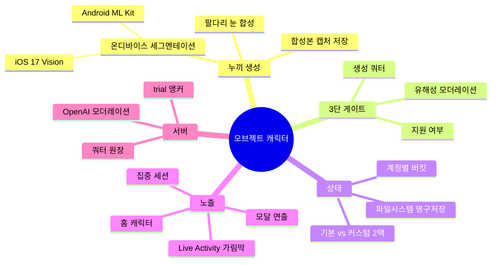
```mermaid
mindmap
  root((오브젝트 캐릭터))
    누끼 생성
      온디바이스 세그멘테이션
        iOS 17 Vision
        Android ML Kit
      팔다리 눈 합성
      합성본 캡처 저장
    3단 게이트
      지원 여부
      유해성 모더레이션
      생성 쿼터
    상태
      기본 vs 커스텀 2택
      계정별 버킷
      파일시스템 영구저장
    노출
      홈 캐릭터
      집중 세션
      Live Activity 가림막
      모달 연출
    서버
      OpenAI 모더레이션
      쿼터 원장
      trial 앵커
```

### 담당 분할

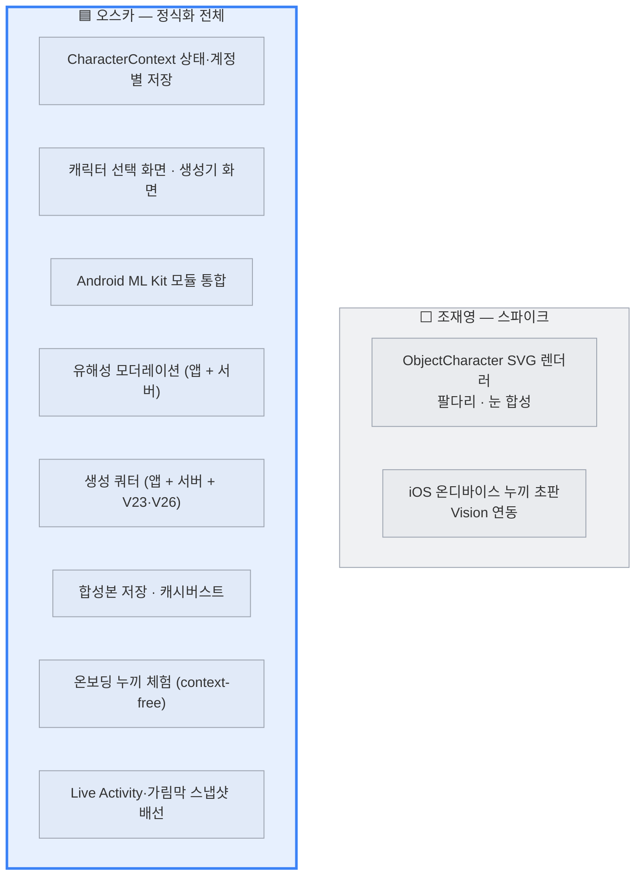
```mermaid
flowchart TB
    subgraph JAE["⬜ 조재영 — 스파이크"]
        J1["ObjectCharacter SVG 렌더러<br/>팔다리 · 눈 합성"]
        J2["iOS 온디바이스 누끼 초판<br/>Vision 연동"]
    end
    subgraph OSCAR["🟦 오스카 — 정식화 전체"]
        O1["CharacterContext 상태·계정별 저장"]
        O2["캐릭터 선택 화면 · 생성기 화면"]
        O3["Android ML Kit 모듈 통합"]
        O4["유해성 모더레이션 (앱 + 서버)"]
        O5["생성 쿼터 (앱 + 서버 + V23·V26)"]
        O6["합성본 저장 · 캐시버스트"]
        O7["온보딩 누끼 체험 (context-free)"]
        O8["Live Activity·가림막 스냅샷 배선"]
    end
    classDef default fill:#9ca3af14,stroke:#9ca3af
    style JAE fill:#9ca3af26,stroke:#9ca3af
    style OSCAR fill:#3b82f61f,stroke:#3b82f6,stroke-width:3px
```

> **스파이크(렌더링 기법 증명)는 조재영, 제품이 되는 전 과정은 오스카.**
> 재화와 같은 패턴이다 — 골격은 BE 담당이 열고, 정책·게이트·표면은 오스카가 채웠다.

---

# Part 1. PRD

## 1.1 목적

기본 캐릭터 하나만으로는 애착이 생기지 않는다. **사용자가 자기 물건을 캐릭터로 만들게** 해서
"내 캐릭터가 나와 함께 공부한다"는 감각을 만든다.

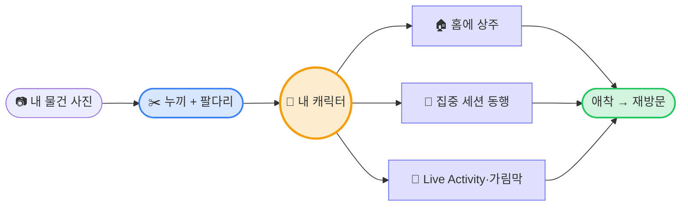
```mermaid
flowchart LR
    P(["📷 내 물건 사진"]) --> C(["✂️ 누끼 + 팔다리"]):::make
    C --> M(("🧸 내 캐릭터")):::char
    M --> H["🏠 홈에 상주"]:::use
    M --> F["🎯 집중 세션 동행"]:::use
    M --> L["📱 Live Activity·가림막"]:::use
    H & F & L --> A(["애착 → 재방문"]):::goal

    classDef make fill:#3b82f633,stroke:#3b82f6,stroke-width:2px
    classDef char fill:#f59e0b33,stroke:#f59e0b,stroke-width:3px
    classDef use fill:#6366f133,stroke:#6366f1
    classDef goal fill:#22c55e33,stroke:#22c55e,stroke-width:2px
```

**AI 생성이 아니다.** 팔다리·눈은 전부 코드로 그리는 SVG이고, 누끼는 OS가 제공하는
온디바이스 세그멘테이션이다. 그래서 **생성 비용이 0이고 오프라인에서도 된다.**

## 1.2 기능 정의

### 캐릭터 2택 장착
기본 정적 캐릭터(`default`)와 사용자가 만든 누끼(`custom`) 중 하나를 고른다.
진화·성장 시스템은 이 범위 밖이다.

### 누끼 캐릭터 만들기
앨범/카메라에서 사물 사진을 고르면 → 온디바이스 누끼 → 팔다리·눈 합성 → 미리보기 →
저장 시 **합성된 화면을 그대로 캡처**해 투명 PNG로 기기에 영구 저장.

## 1.3 3단 게이트

생성 흐름에 관문이 3개 있고, **실패 정책이 서로 다르다.**

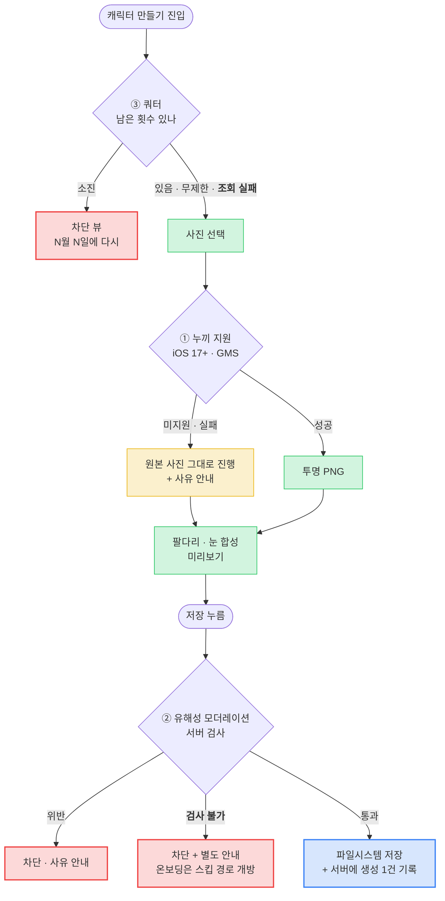
```mermaid
flowchart TD
    S(["캐릭터 만들기 진입"]) --> G3{"③ 쿼터<br/>남은 횟수 있나"}
    G3 -->|"소진"| B3["차단 뷰<br/>N월 N일에 다시"]:::block
    G3 -->|"있음 · 무제한 · <b>조회 실패</b>"| PICK["사진 선택"]:::ok

    PICK --> G1{"① 누끼 지원<br/>iOS 17+ · GMS"}
    G1 -->|"미지원 · 실패"| F1["원본 사진 그대로 진행<br/>+ 사유 안내"]:::soft
    G1 -->|"성공"| CUT["투명 PNG"]:::ok
    F1 --> COMP
    CUT --> COMP["팔다리 · 눈 합성<br/>미리보기"]:::ok

    COMP --> SAVE(["저장 누름"]) --> G2{"② 유해성 모더레이션<br/>서버 검사"}
    G2 -->|"위반"| B2["차단 · 사유 안내"]:::block
    G2 -->|"<b>검사 불가</b>"| B2U["차단 + 별도 안내<br/>온보딩은 스킵 경로 개방"]:::block
    G2 -->|"통과"| ST["파일시스템 저장<br/>+ 서버에 생성 1건 기록"]:::done

    classDef ok fill:#22c55e33,stroke:#22c55e
    classDef soft fill:#eab30833,stroke:#eab308
    classDef block fill:#ef444433,stroke:#ef4444,stroke-width:2px
    classDef done fill:#3b82f633,stroke:#3b82f6,stroke-width:2px
```

**실패 정책이 게이트마다 다른 것이 핵심 설계다:**

| 게이트 | 실패 시 | 정책 | 왜 |
|---|---|---|---|
| ① 누끼 지원 | **원본 사진으로 진행** | graceful degradation | 배경이 남아도 캐릭터는 만들 수 있다. 여기서 막으면 구형 기기 사용자가 기능을 아예 못 쓴다 |
| ② 모더레이션 | **차단** | **fail-closed** | 검사 결과를 신뢰할 수 없으면 통과시키지 않는다. 유해 이미지가 저장·공유되는 것보다 못 만드는 게 낫다 |
| ③ 쿼터 | **허용** | **fail-open** | 쿼터는 '안전'이 아니라 '제한'이다. 인프라 이슈로 정상 사용자를 막지 않는다 |

## 1.4 확정 정책

| # | 정책 | 근거 |
|---|---|---|
| P1 | **AI 생성 안 함** — 팔다리·눈은 코드 SVG, 누끼는 OS 온디바이스 | 생성 비용 0 · 오프라인 동작 · 프라이버시(사진이 서버로 안 감) |
| P2 | **모더레이션은 fail-closed** | 검사 불가 = 차단. 단 "위반"과 "검사 불가"를 UI에서 **구분해 안내** |
| P3 | **모더레이션 이미지는 서버에 저장하지 않음** | 검사만 하고 버린다 |
| P4 | **쿼터는 fail-open** | 제한이 사용을 막는 사고를 방지 |
| P5 | **trial 기준은 배포일이 아니라 유저별 첫 접촉** | 배포·업데이트 시점이 언제든 모든 유저가 7일을 온전히 받는다 |
| P6 | **온보딩 체험은 장착하지 않음** | 만들기만 경험시키고 `choice`는 `default` 유지 — 강제 장착은 부담 |
| P7 | **생성기는 context-free** | Provider·Navigator 밖(온보딩 Modal)에서도 같은 컴포넌트가 돌아야 함 |
| P8 | **누끼 실패를 에러로 취급하지 않음** | 사유 코드 + 원본 폴백. 8종 사유별 한 줄 안내 |

## 1.5 쿼터 정책 (BM 연결점)

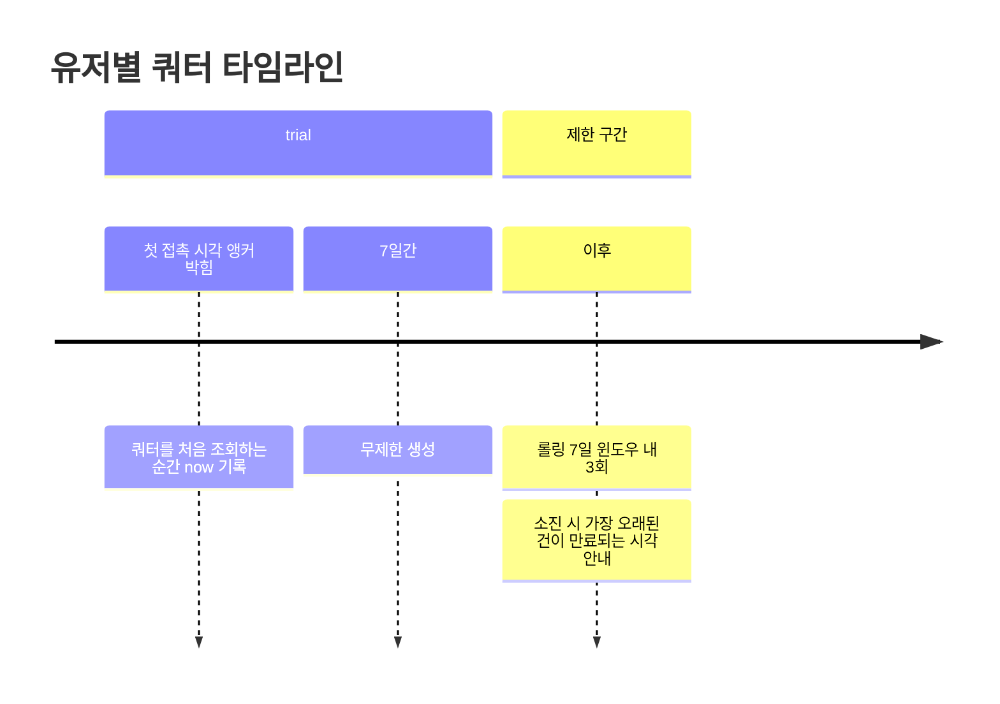
```mermaid
timeline
    title 유저별 쿼터 타임라인
    section trial
        첫 접촉 시각 앵커 박힘 : 쿼터를 처음 조회하는 순간 now 기록
        7일간 : 무제한 생성
    section 제한 구간
        이후 : 롤링 7일 윈도우 내 3회
                : 소진 시 가장 오래된 건이 만료되는 시각 안내
```

| 항목 | 값 |
|---|---|
| trial 기간 | 첫 접촉 후 **7일 무제한** |
| 이후 한도 | **롤링 7일 내 3회** (달력 주가 아님) |
| 앵커 시점 | 쿼터 **최초 조회** 시 `now()` 1회 기록 |
| 초기화 안내 | "N월 N일에 다시 만들 수 있어요" (실제 슬롯 개방 시각) |
| 개발 빌드 | `__DEV__`에서 차단 우회 (서버는 손대지 않음) |

> 유료화 시 `unlimited` 플래그가 그대로 진입점이 된다 — 응답 계약이 이미 그 형태다.

## 1.6 갭

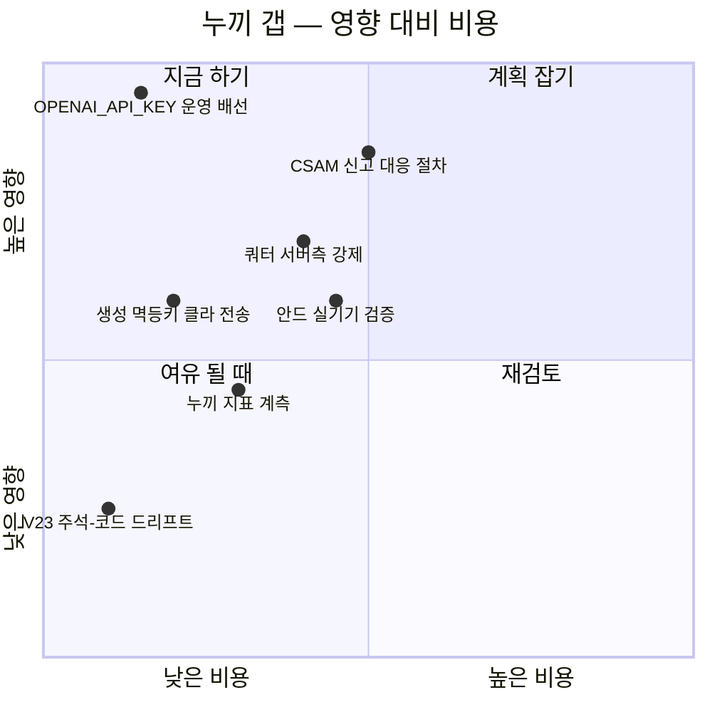
```mermaid
quadrantChart
    title 누끼 갭 — 영향 대비 비용
    x-axis "낮은 비용" --> "높은 비용"
    y-axis "낮은 영향" --> "높은 영향"
    quadrant-1 "계획 잡기"
    quadrant-2 "지금 하기"
    quadrant-3 "여유 될 때"
    quadrant-4 "재검토"
    "OPENAI_API_KEY 운영 배선": [0.15, 0.95]
    "생성 멱등키 클라 전송": [0.2, 0.6]
    "CSAM 신고 대응 절차": [0.5, 0.85]
    "쿼터 서버측 강제": [0.4, 0.7]
    "V23 주석-코드 드리프트": [0.1, 0.25]
    "누끼 지표 계측": [0.3, 0.45]
    "안드 실기기 검증": [0.45, 0.6]
```

| # | 항목 | 영향 |
|---|---|---|
| 1 | **`OPENAI_API_KEY` 미설정 시 전면 차단** | fail-closed라 키가 없으면 **아무도 캐릭터를 못 만든다.** 운영 환경 키 배선이 기능 가동의 전제 |
| 2 | **CSAM 대응 절차 없음** | 모더레이션이 `sexual/minors`를 잡지만, 적발 시 **신고·보존 절차가 정의돼 있지 않다** |
| 3 | **쿼터가 클라 게이트에만 있다** | 서버 `POST /generation`은 기록만 하고 거부하지 않는다 → 클라 우회 시 무제한 |
| 4 | **생성 멱등키 클라 미전송** | `client_generation_id` 컬럼·부분 유니크는 있는데 클라가 안 보낸다 → 재시도가 2슬롯 소비 |
| 5 | 안드로이드 실기기 검증 미완 | ML Kit 모듈은 통합됐으나 GMS 없는 기기·모델 다운로드 대기 경로 실측 필요 |
| 6 | 누끼 관련 GA4 이벤트 없음 | 어느 게이트에서 이탈하는지 모른다 |
| 7 | V23 주석 "2회" ↔ 코드 `ROLLING_LIMIT=3` | 문서 드리프트 (코드가 정본) |

**우선순위: 1 → 3 → 2 → 4 → 5**

> #1이 1순위인 이유: 이 키가 없으면 **기능 전체가 죽는다.** fail-closed의 대가다.

---

# Part 2. IA

## 2.1 데이터 모델 (서버)

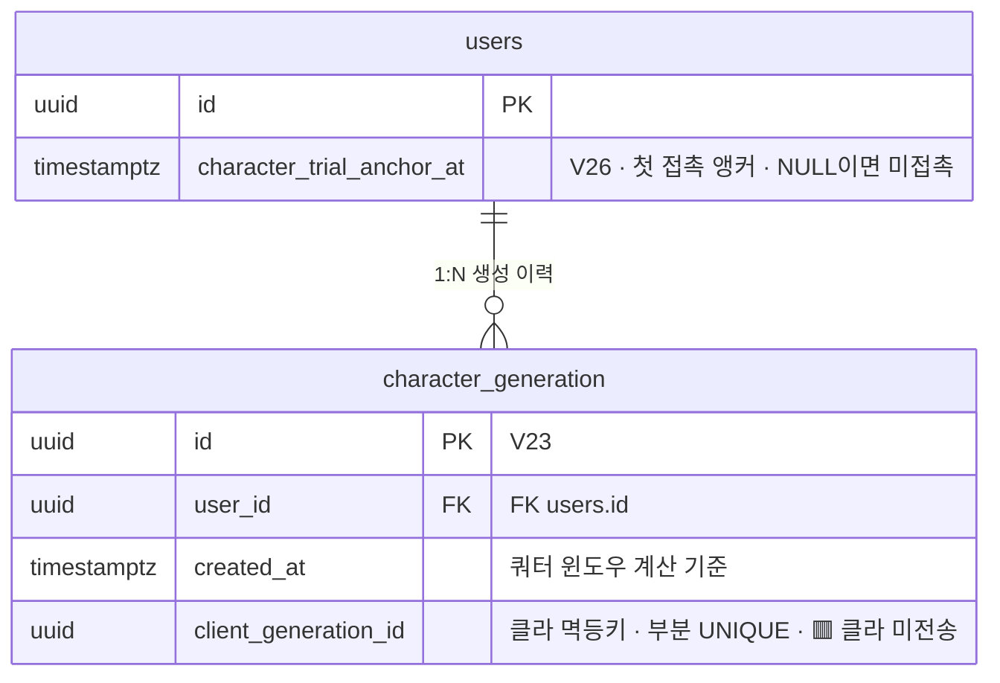
```mermaid
erDiagram
    users ||--o{ character_generation : "1:N 생성 이력"

    users {
        uuid id PK ""
        timestamptz character_trial_anchor_at "V26 · 첫 접촉 앵커 · NULL이면 미접촉"
    }

    character_generation {
        uuid id PK "V23"
        uuid user_id FK "FK users.id"
        timestamptz created_at "쿼터 윈도우 계산 기준"
        uuid client_generation_id "클라 멱등키 · 부분 UNIQUE · 🟥 클라 미전송"
    }
```

| 인덱스 | 용도 |
|---|---|
| `(user_id, created_at)` | 롤링 7일 윈도우 count · 가장 오래된 행 조회 |
| `(user_id, client_generation_id) WHERE ... IS NOT NULL` | 부분 유니크 — 키가 있을 때만 중복 차단 |

**append-only 테이블이다.** 삭제·갱신이 없고 `created_at`만으로 쿼터를 판정한다.

## 2.2 로컬 저장 (앱)

이미지는 파일시스템, 메타는 AsyncStorage로 **분리**한다.

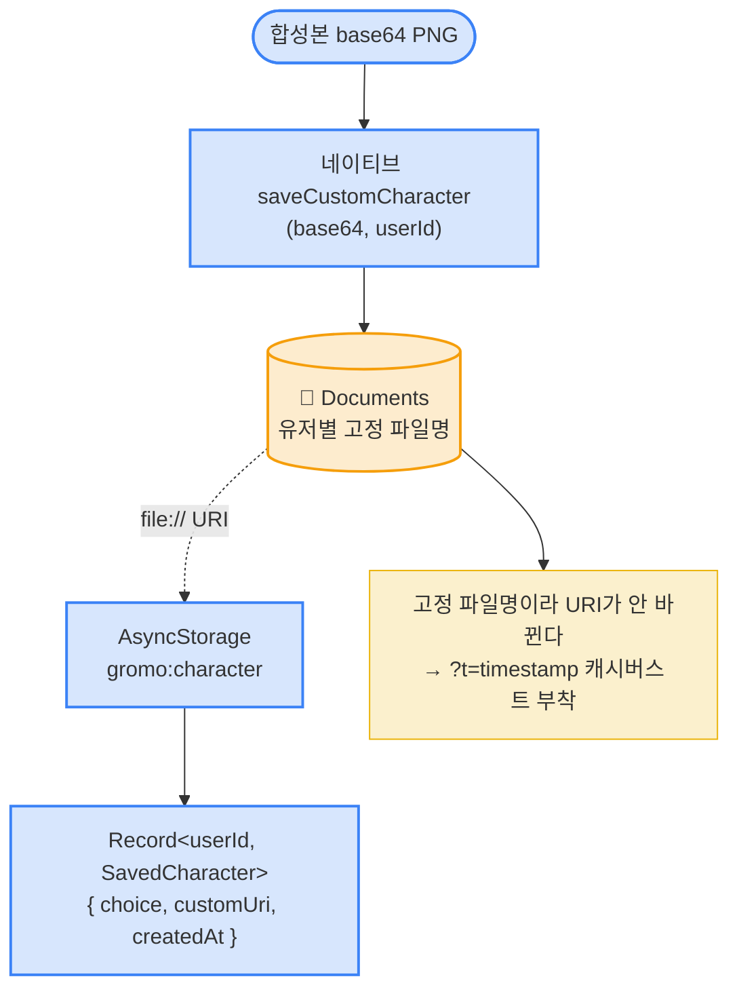
```mermaid
flowchart TD
    CAP(["합성본 base64 PNG"]):::oscar --> NAT["네이티브 saveCustomCharacter<br/>(base64, userId)"]:::oscar
    NAT --> FS[("📁 Documents<br/>유저별 고정 파일명")]:::db
    FS -.->|"file:// URI"| META["AsyncStorage<br/>gromo:character"]:::oscar
    META --> MAP["Record&lt;userId, SavedCharacter&gt;<br/>{ choice, customUri, createdAt }"]:::oscar

    FS --> BUST["고정 파일명이라 URI가 안 바뀐다<br/>→ ?t=timestamp 캐시버스트 부착"]:::note

    classDef oscar fill:#3b82f633,stroke:#3b82f6,stroke-width:2px
    classDef db fill:#f59e0b33,stroke:#f59e0b,stroke-width:2px
    classDef note fill:#eab30833,stroke:#eab308
```

| 저장소 | 키/경로 | 내용 |
|---|---|---|
| AsyncStorage | `gromo:character` | `Record<userId, { choice, customUri, createdAt }>` — **계정별 버킷** |
| 파일시스템 | Documents / 유저별 파일명 | 투명 PNG 합성본 (영구) |
| App Group | 네이티브 스냅샷 | Live Activity·가림막이 읽는 캐릭터 이미지 |

## 2.3 API 표면

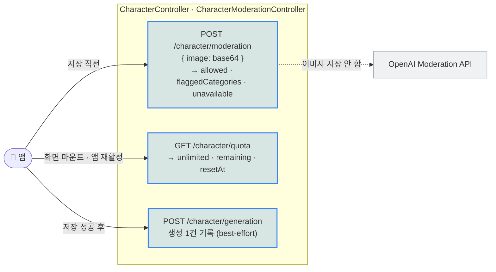
```mermaid
flowchart LR
    APP(["📱 앱"])
    subgraph SRV["CharacterController · CharacterModerationController"]
        A1["POST /character/moderation<br/>{ image: base64 }<br/>→ allowed · flaggedCategories · unavailable"]:::oscar
        A2["GET /character/quota<br/>→ unlimited · remaining · resetAt"]:::oscar
        A3["POST /character/generation<br/>생성 1건 기록 (best-effort)"]:::oscar
    end
    APP -->|"저장 직전"| A1
    APP -->|"화면 마운트 · 앱 재활성"| A2
    APP -->|"저장 성공 후"| A3
    A1 -.->|"이미지 저장 안 함"| OAI["OpenAI Moderation API"]:::ext

    classDef oscar fill:#3b82f633,stroke:#3b82f6,stroke-width:2px
    classDef ext fill:#9ca3af26,stroke:#9ca3af
```

**사진 원본은 서버로 가지 않는다.** 모더레이션에 보내는 것은 **합성본**(누끼 + 팔다리)이고,
그것도 검사 후 저장하지 않는다.

## 2.4 앱 상태 구조

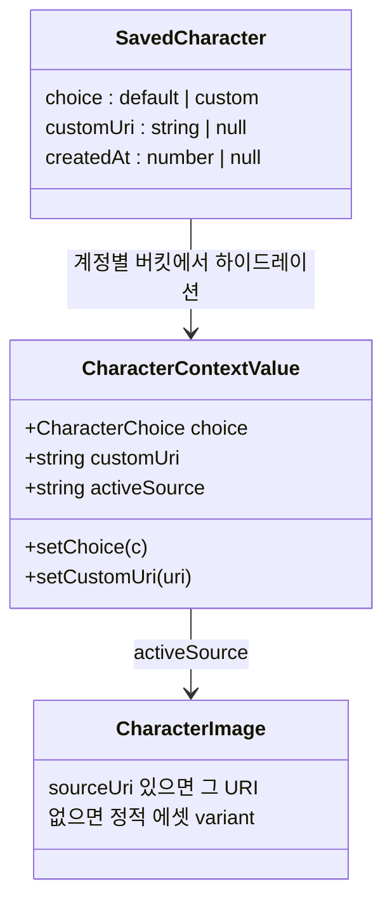
```mermaid
classDiagram
    class CharacterContextValue {
        +CharacterChoice choice
        +string customUri
        +setChoice(c)
        +setCustomUri(uri)
        +string activeSource
    }
    class SavedCharacter {
        choice : default | custom
        customUri : string | null
        createdAt : number | null
    }
    class CharacterImage {
        sourceUri 있으면 그 URI
        없으면 정적 에셋 variant
    }
    CharacterContextValue --> CharacterImage : activeSource
    SavedCharacter --> CharacterContextValue : 계정별 버킷에서 하이드레이션
```

**`activeSource`가 계약면이다** — `choice==='custom' && customUri` 이면 그 URI, 아니면 `null`.
`CharacterImage`는 `null`이면 기본 정적 에셋을 그린다. 소비 화면은 분기를 몰라도 된다.

## 2.5 화면 IA

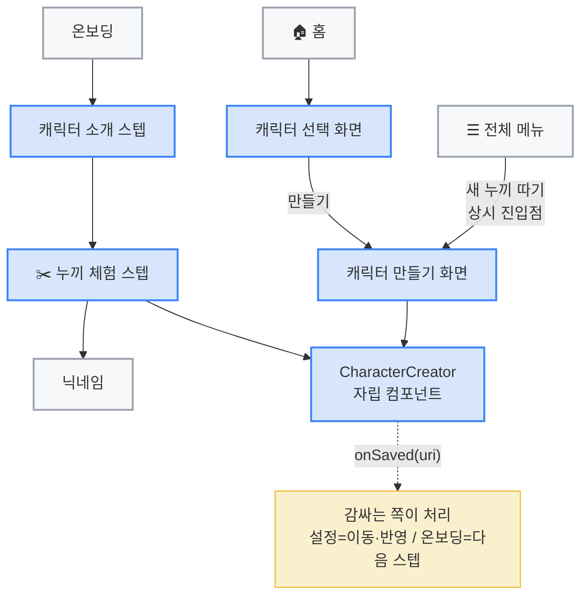
```mermaid
flowchart TD
    ON["온보딩"]:::screen --> CI["캐릭터 소개 스텝"]:::oscar --> CS["✂️ 누끼 체험 스텝"]:::oscar --> NN["닉네임"]:::screen
    HOME["🏠 홈"]:::screen --> SEL["캐릭터 선택 화면"]:::oscar
    MENU["☰ 전체 메뉴"]:::screen -->|"새 누끼 따기<br/>상시 진입점"| CRE["캐릭터 만들기 화면"]:::oscar
    SEL -->|"만들기"| CRE
    CRE --> GEN["CharacterCreator<br/>자립 컴포넌트"]:::oscar
    CS --> GEN

    GEN -.->|"onSaved(uri)"| WRAP["감싸는 쪽이 처리<br/>설정=이동·반영 / 온보딩=다음 스텝"]:::note

    classDef oscar fill:#3b82f633,stroke:#3b82f6,stroke-width:2px
    classDef screen fill:#9ca3af14,stroke:#9ca3af,stroke-width:2px
    classDef note fill:#eab30833,stroke:#eab308
```

### 캐릭터 노출 지점 (22곳)

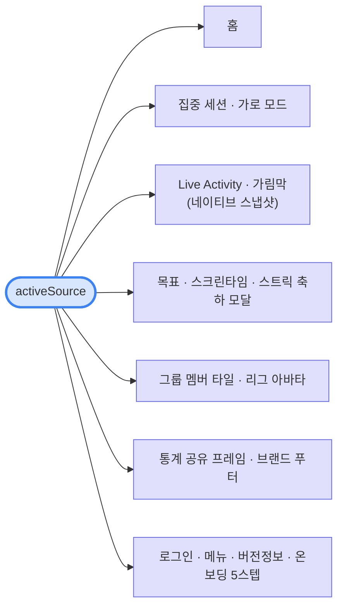
```mermaid
flowchart LR
    AS(["activeSource"]):::oscar --> H["홈"]:::u
    AS --> FS["집중 세션 · 가로 모드"]:::u
    AS --> LA["Live Activity · 가림막<br/>(네이티브 스냅샷)"]:::u
    AS --> MOD["목표 · 스크린타임 · 스트릭 축하 모달"]:::u
    AS --> SOC["그룹 멤버 타일 · 리그 아바타"]:::u
    AS --> SH["통계 공유 프레임 · 브랜드 푸터"]:::u
    AS --> ETC["로그인 · 메뉴 · 버전정보 · 온보딩 5스텝"]:::u

    classDef oscar fill:#3b82f633,stroke:#3b82f6,stroke-width:3px
    classDef u fill:#6366f133,stroke:#6366f1
```

`CharacterImage` 한 컴포넌트가 전 노출 지점을 담당하므로, `activeSource`만 바뀌면 **22곳이 동시에 갱신된다.**

---

# Part 3. HLD

## 3.1 설계 원칙

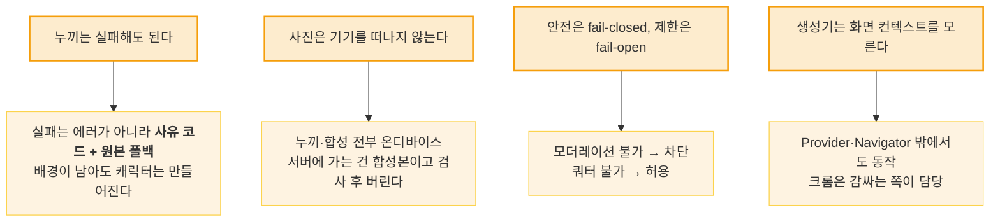
```mermaid
flowchart TD
    R1["누끼는 실패해도 된다"]:::p --> I1["실패는 에러가 아니라 <b>사유 코드 + 원본 폴백</b><br/>배경이 남아도 캐릭터는 만들어진다"]:::i
    R2["사진은 기기를 떠나지 않는다"]:::p --> I2["누끼·합성 전부 온디바이스<br/>서버에 가는 건 합성본이고 검사 후 버린다"]:::i
    R3["안전은 fail-closed, 제한은 fail-open"]:::p --> I3["모더레이션 불가 → 차단<br/>쿼터 불가 → 허용"]:::i
    R4["생성기는 화면 컨텍스트를 모른다"]:::p --> I4["Provider·Navigator 밖에서도 동작<br/>크롬은 감싸는 쪽이 담당"]:::i

    classDef p fill:#f59e0b33,stroke:#f59e0b,stroke-width:2px
    classDef i fill:#f59e0b1f,stroke:#fcd34d
```

## 3.2 컴포넌트 구성

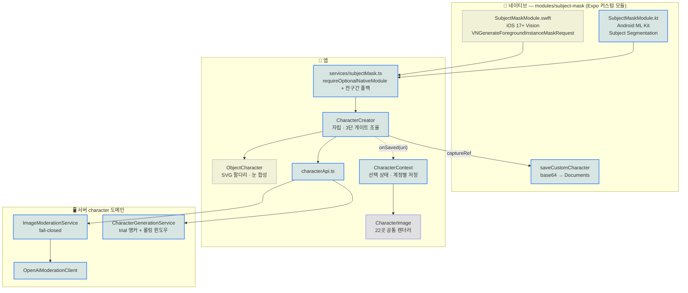
```mermaid
flowchart TD
    subgraph NATIVE["📲 네이티브 — modules/subject-mask (Expo 커스텀 모듈)"]
        IOS["SubjectMaskModule.swift<br/>iOS 17+ Vision<br/>VNGenerateForegroundInstanceMaskRequest"]:::jae
        AND["SubjectMaskModule.kt<br/>Android ML Kit<br/>Subject Segmentation"]:::oscar
        SAVE["saveCustomCharacter<br/>base64 → Documents"]:::oscar
    end

    subgraph APP["📱 앱"]
        WRAP["services/subjectMask.ts<br/>requireOptionalNativeModule + 전구간 폴백"]:::oscar
        CRE["CharacterCreator<br/>자립 · 3단 게이트 조율"]:::oscar
        OBJ["ObjectCharacter<br/>SVG 팔다리 · 눈 합성"]:::jae
        CTX["CharacterContext<br/>선택 상태 · 계정별 저장"]:::oscar
        API["characterApi.ts"]:::oscar
        IMG["CharacterImage<br/>22곳 공통 렌더러"]:::mix
    end

    subgraph SERVER["🖥 서버 character 도메인"]
        MOD["ImageModerationService<br/>fail-closed"]:::oscar
        OAI["OpenAiModerationClient"]:::oscar
        QUO["CharacterGenerationService<br/>trial 앵커 + 롤링 윈도우"]:::oscar
    end

    IOS & AND --> WRAP --> CRE
    CRE --> OBJ
    CRE -->|"captureRef"| SAVE
    CRE --> API --> MOD --> OAI
    API --> QUO
    CRE -.->|"onSaved(uri)"| CTX --> IMG

    classDef oscar fill:#3b82f633,stroke:#3b82f6,stroke-width:2px
    classDef jae fill:#9ca3af26,stroke:#9ca3af
    classDef mix fill:#6366f133,stroke:#6366f1
```

## 3.3 데이터 왕복 — 생성 전 과정

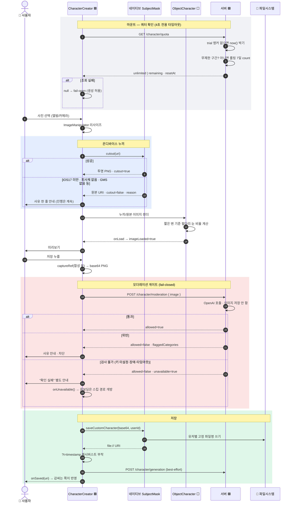
```mermaid
sequenceDiagram
    autonumber
    actor U as 👤 사용자
    participant C as CharacterCreator 🟦
    participant N as 네이티브 SubjectMask
    participant O as ObjectCharacter ⬜
    participant S as 서버 🟦
    participant FS as 📁 파일시스템

    rect rgba(148, 163, 184, 0.14)
    note over C,S: 마운트 — 쿼터 확인 (4초 전용 타임아웃)
    C->>S: GET /character/quota
    S->>S: trial 앵커 없으면 now() 박기
    S->>S: 무제한 구간? 아니면 롤링 7일 count
    S-->>C: unlimited | remaining · resetAt
    alt 조회 실패
        C->>C: null → fail-open (생성 허용)
    end
    end

    U->>C: 사진 선택 (앨범/카메라)
    C->>C: ImageManipulator 리사이즈

    rect rgba(59, 130, 246, 0.14)
    note over C,N: 온디바이스 누끼
    C->>N: cutout(uri)
    alt 성공
        N-->>C: 투명 PNG · cutout=true
    else iOS17 미만 · 피사체 없음 · GMS 없음 등
        N-->>C: 원본 URI · cutout=false · reason
        C->>U: 사유 한 줄 안내 (진행은 계속)
    end
    end

    C->>O: 누끼/원본 이미지 렌더
    O->>O: 짧은 변 기준 팔다리·눈 비율 계산
    O-->>C: onLoad → imageLoaded=true
    C->>U: 미리보기

    U->>C: 저장 누름
    C->>C: captureRef(합성 뷰) → base64 PNG

    rect rgba(239, 68, 68, 0.14)
    note over C,S: 모더레이션 게이트 (fail-closed)
    C->>S: POST /character/moderation { image }
    S->>S: OpenAI 호출 · 이미지 저장 안 함
    alt 통과
        S-->>C: allowed=true
    else 위반
        S-->>C: allowed=false · flaggedCategories
        C->>U: 사유 안내 · 차단
    else 검사 불가 (키 미설정·장애·타임아웃)
        S-->>C: allowed=false · unavailable=true
        C->>U: "확인 실패" 별도 안내
        C->>C: onUnavailable() → 온보딩은 스킵 경로 개방
    end
    end

    rect rgba(34, 197, 94, 0.14)
    note over C,FS: 저장
    C->>N: saveCustomCharacter(base64, userId)
    N->>FS: 유저별 고정 파일명 쓰기
    N-->>C: file:// URI
    C->>C: ?t=timestamp 캐시버스트 부착
    C->>S: POST /character/generation (best-effort)
    C-->>U: onSaved(uri) → 감싸는 쪽이 반영
    end
```

## 3.4 왜 생성기가 context-free인가

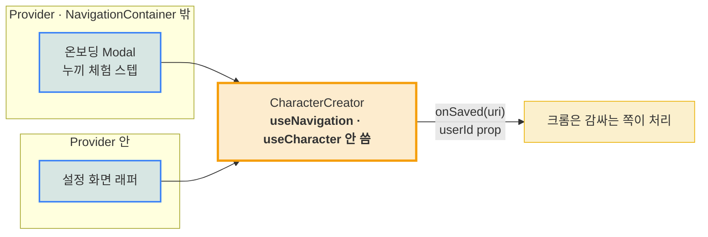
```mermaid
flowchart LR
    subgraph OUT["Provider · NavigationContainer 밖"]
        MODAL["온보딩 Modal<br/>누끼 체험 스텝"]:::oscar
    end
    subgraph IN["Provider 안"]
        SET["설정 화면 래퍼"]:::oscar
    end

    GEN["CharacterCreator<br/><b>useNavigation · useCharacter 안 씀</b>"]:::core
    MODAL --> GEN
    SET --> GEN
    GEN -->|"onSaved(uri)<br/>userId prop"| BACK["크롬은 감싸는 쪽이 처리"]:::note

    classDef oscar fill:#3b82f633,stroke:#3b82f6,stroke-width:2px
    classDef core fill:#f59e0b33,stroke:#f59e0b,stroke-width:3px
    classDef note fill:#eab30833,stroke:#eab308
```

온보딩은 **로그인 전이라 `CharacterProvider`가 아직 없다.** 같은 컴포넌트를 양쪽에서 쓰려면
훅 의존을 끊고 `userId`를 prop으로 받아야 한다 — 온보딩은 토큰을 직접 디코드해 넘긴다.

## 3.5 온보딩 체험 → 본 계정 인계

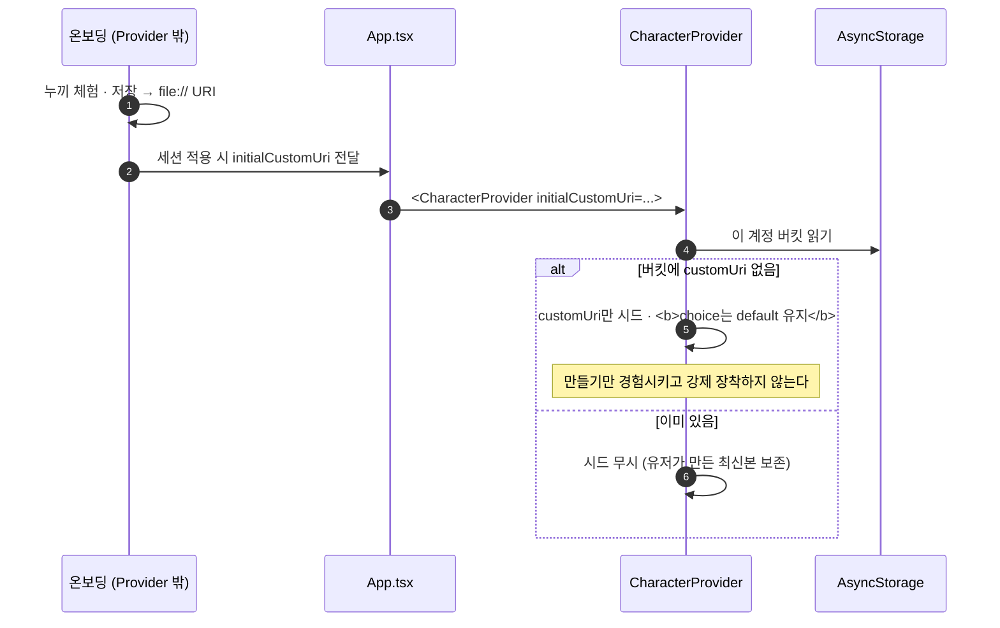
```mermaid
sequenceDiagram
    autonumber
    participant OB as 온보딩 (Provider 밖)
    participant APP as App.tsx
    participant CP as CharacterProvider
    participant ST as AsyncStorage

    OB->>OB: 누끼 체험 · 저장 → file:// URI
    OB->>APP: 세션 적용 시 initialCustomUri 전달
    APP->>CP: <CharacterProvider initialCustomUri=...>
    CP->>ST: 이 계정 버킷 읽기
    alt 버킷에 customUri 없음
        CP->>CP: customUri만 시드 · <b>choice는 default 유지</b>
        note over CP: 만들기만 경험시키고 강제 장착하지 않는다
    else 이미 있음
        CP->>CP: 시드 무시 (유저가 만든 최신본 보존)
    end
```

## 3.6 신뢰 경계

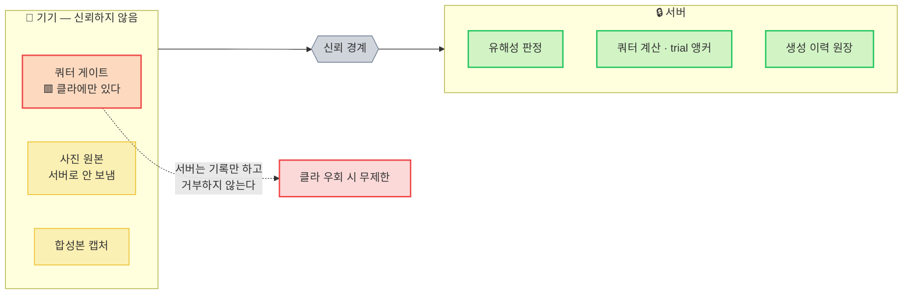
```mermaid
flowchart LR
    subgraph DEV["📱 기기 — 신뢰하지 않음"]
        D1["쿼터 게이트<br/>🟥 클라에만 있다"]:::gap
        D2["사진 원본<br/>서버로 안 보냄"]:::soft
        D3["합성본 캡처"]:::soft
    end
    B{{"신뢰 경계"}}:::b
    subgraph SRV["🔒 서버"]
        S1["유해성 판정"]:::hard
        S2["쿼터 계산 · trial 앵커"]:::hard
        S3["생성 이력 원장"]:::hard
    end
    DEV --> B --> SRV

    D1 -.->|"서버는 기록만 하고<br/>거부하지 않는다"| GAPN["클라 우회 시 무제한"]:::gap

    classDef soft fill:#eab30833,stroke:#eab308
    classDef hard fill:#22c55e33,stroke:#22c55e,stroke-width:2px
    classDef gap fill:#ef444433,stroke:#ef4444,stroke-width:2px
    classDef b fill:#64748b4d,stroke:#64748b
```

---

# Part 4. LLD

## 4.1 네이티브 누끼

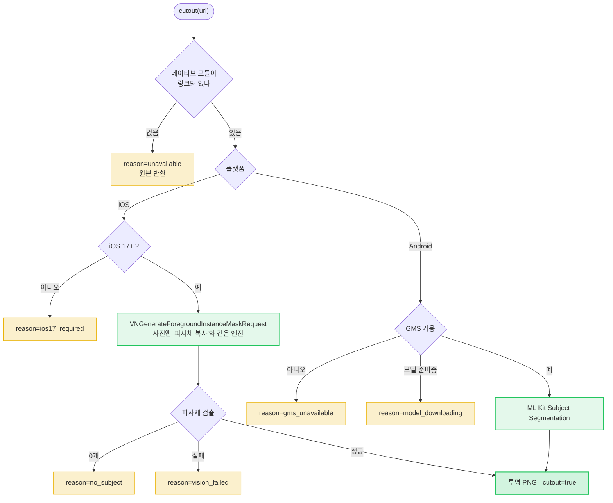
```mermaid
flowchart TD
    CALL(["cutout(uri)"]) --> W{"네이티브 모듈이<br/>링크돼 있나"}
    W -->|"없음"| U["reason=unavailable<br/>원본 반환"]:::soft
    W -->|"있음"| P{"플랫폼"}

    P -->|"iOS"| I{"iOS 17+ ?"}
    I -->|"아니오"| I1["reason=ios17_required"]:::soft
    I -->|"예"| I2["VNGenerateForegroundInstanceMaskRequest<br/>사진앱 '피사체 복사'와 같은 엔진"]:::ok
    I2 --> I3{"피사체 검출"}
    I3 -->|"0개"| I4["reason=no_subject"]:::soft
    I3 -->|"실패"| I5["reason=vision_failed"]:::soft
    I3 -->|"성공"| OK["투명 PNG · cutout=true"]:::done

    P -->|"Android"| A{"GMS 가용"}
    A -->|"아니오"| A1["reason=gms_unavailable"]:::soft
    A -->|"모델 준비중"| A2["reason=model_downloading"]:::soft
    A -->|"예"| A3["ML Kit Subject Segmentation"]:::ok --> OK

    classDef ok fill:#22c55e1f,stroke:#22c55e
    classDef done fill:#22c55e33,stroke:#22c55e,stroke-width:2px
    classDef soft fill:#eab30833,stroke:#eab308
```

```typescript
// requireOptionalNativeModule — 구 바이너리·미지원 플랫폼에서 앱이 죽지 않게
const native = requireOptionalNativeModule<SubjectMaskNativeModule>('SubjectMask');

export interface SubjectMaskResult {
  uri: string;      // 성공=투명 PNG file://, 실패=원본 URI
  width: number; height: number;
  cutout: boolean;  // false면 배경 제거 없이 원본을 쓰는 중
  reason: string;   // cutout=false일 때 사유 코드
}
```

**사유 코드 8종 전부 한 줄 안내 문구를 갖는다** (`REASON_LABEL`). 실패를 숨기지 않고 설명하되
흐름은 막지 않는다. 이미지 정규화는 `maxSide=1600`으로 캡한다.

## 4.2 합성 렌더러 — 짧은 변 기준 비율 보정

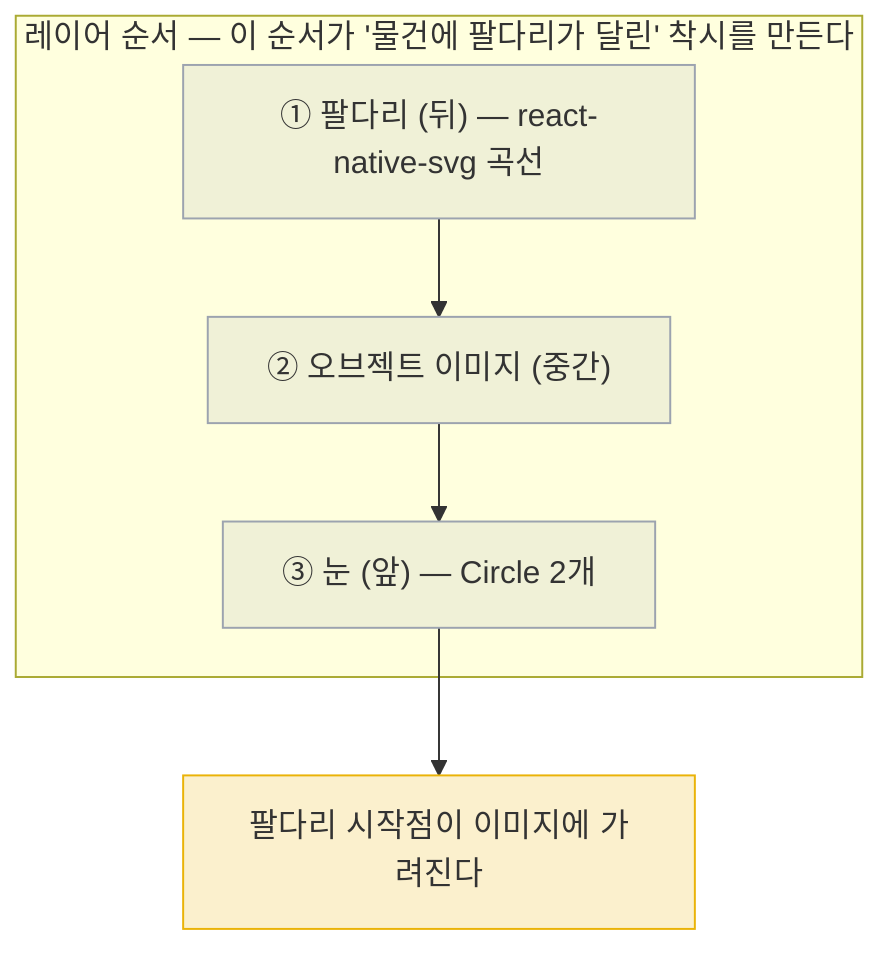
```mermaid
flowchart TD
    subgraph LAYER["레이어 순서 — 이 순서가 '물건에 팔다리가 달린' 착시를 만든다"]
        direction TB
        L1["① 팔다리 (뒤) — react-native-svg 곡선"]:::jae
        L2["② 오브젝트 이미지 (중간)"]:::jae
        L3["③ 눈 (앞) — Circle 2개"]:::jae
    end
    L1 --> L2 --> L3 --> R["팔다리 시작점이 이미지에 가려진다"]:::note

    classDef jae fill:#9ca3af26,stroke:#9ca3af
    classDef note fill:#eab30833,stroke:#eab308
```

**핵심 수치 규칙**: 모든 치수를 폭이 아니라 **짧은 변** `base = min(w, h)` 기준으로 잡는다.

| | 폭 기준 (잘못) | 짧은 변 기준 (현재) |
|---|---|---|
| 키보드처럼 가로로 긴 물건 | 눈이 양끝으로 벌어지고 다리가 몸통보다 길어져 **"탁자"가 된다** | 얼굴·팔다리가 몸통 두께를 따라가 생물처럼 보인다 |

```
MAX_ARM = 42   // 팔이 차지할 좌우 최대 여백
MAX_LEG = 60   // 오브젝트 아래 최대 다리 길이
다리 기본 = 폭 × 0.34, 가로로 긴 물건은 base × 1.6 상한
```

> 오브젝트 크기 ↔ 팔다리 길이가 서로를 참조하는 순환이 있어, **여백을 줄이는 방향으로만** 갱신해
> 수렴시킨다(무한 리레이아웃 방지).

## 4.3 캡처 타이밍 가드

```mermaid
sequenceDiagram
    autonumber
    participant N as 네이티브
    participant C as Creator
    participant I as Image

    N-->>C: cutout 반환 → phase = ready
    note over C: ⚠️ 여기서 바로 저장하면?
    C->>I: <Image source=투명PNG>
    note over I: 아직 디코딩 중
    C--xC: captureRef → <b>물체가 빠진 채로 구워짐</b>

    note over C,I: 그래서 imageLoaded 가드를 둔다
    I-->>C: onLoad
    C->>C: imageLoaded = true → 저장 버튼 활성
```

`uri`가 바뀌면(새 결과·회전) `imageLoaded`를 `false`로 리셋하고 `onLoad`에서 다시 `true`로 올린다.

## 4.4 쿼터 계산

```java
GRACE_PERIOD_DAYS   = 7;   // trial 무제한 기간
ROLLING_WINDOW_DAYS = 7;   // 롤링 윈도우
ROLLING_LIMIT       = 3;   // 윈도우 내 허용 횟수
```

```mermaid
flowchart TD
    Q(["GET /character/quota"]) --> A{"character_trial_anchor_at<br/>있나"}
    A -->|"NULL"| A1["now() 로 1회 박는다<br/>= 첫 접촉 시각"]:::oscar
    A -->|"있음"| A2["그 값 사용"]:::oscar
    A1 & A2 --> T{"anchor + 7일 이내"}

    T -->|"예"| UN["unlimited=true<br/>remaining·resetAt = null"]:::ok
    T -->|"아니오"| CNT["윈도우(now−7일) 내 count 조회"]:::step
    CNT --> R["remaining = max(0, 3 − count)"]:::step
    R --> Z{"remaining == 0"}
    Z -->|"아니오"| OUT1["remaining · resetAt=null"]:::ok
    Z -->|"예"| OFF["offset = count − 3<br/>오래된 순 offset 행의 created_at + 7일<br/>= 다음 슬롯 개방 시각"]:::oscar
    OFF --> OUT2["remaining=0 · resetAt"]:::warn

    classDef oscar fill:#3b82f633,stroke:#3b82f6,stroke-width:2px
    classDef ok fill:#22c55e33,stroke:#22c55e
    classDef warn fill:#eab30833,stroke:#eab308
    classDef step fill:#9ca3af26,stroke:#9ca3af
```

**`offset`이 왜 필요한가** — `count`가 한도를 넘을 수 있다(과거 무제한 구간에 만든 건 포함).
그때는 가장 오래된 행이 만료돼도 여전히 한도 초과일 수 있으므로, **`count − LIMIT` 번째로
오래된 행**이 만료되는 시각이 실제 슬롯 개방 시각이다. `count == LIMIT`이면 `offset = 0`.

### 클라 측 처리

```typescript
const QUOTA_TIMEOUT_MS = 4000;   // 공용 15초로는 사용자가 최대 15초 갇힌다

// 차단 판정 — unlimited이거나 조회 실패(null)면 허용 (fail-open)
const blocked = !__DEV__ && quota != null && !quota.unlimited && (quota.remaining ?? 0) <= 0;
```

**`AppState` 재조회** — 차단 뷰를 켠 채 밤새 백그라운드에 두면 마운트 1회 조회만으론
새로 초기화된 쿼터를 못 받아 계속 차단에 머문다. 앱 재활성 시 재조회해 자동으로 풀리게 한다
(스피너로 되돌리지 않게 `quotaLoading`은 건드리지 않는다).

## 4.5 모더레이션 — fail-closed

```mermaid
flowchart TD
    M(["POST /character/moderation"]) --> K{"OPENAI_API_KEY"}
    K -->|"미설정"| FC["IllegalStateException"]:::err
    K -->|"있음"| O["OpenAI Moderation 호출<br/>이미지는 저장하지 않는다"]:::step
    O --> E{"결과"}
    E -->|"flagged"| B["allowed=false<br/>flaggedCategories<br/>(sexual · sexual/minors · violence · self-harm 등)"]:::err
    E -->|"정상"| P["allowed=true"]:::ok
    E -->|"네트워크·타임아웃·5xx·파싱 실패"| FC
    FC --> FCR["failClosed()<br/>allowed=false · unavailable=true<br/>+ userId·원인 warn 로그"]:::err

    classDef ok fill:#22c55e33,stroke:#22c55e,stroke-width:2px
    classDef err fill:#ef444433,stroke:#ef4444,stroke-width:2px
    classDef step fill:#9ca3af26,stroke:#9ca3af
```

### `unavailable`이 왜 별도 필드인가

"유해 판정"과 "검사 불가"는 **사용자에게 다르게 말해야 한다.** 예전엔 서버가 둘 다
`200 + allowed:false`로 줘서 구분되지 않았다. 두 경로가 있다:

| 경로 | 결과 |
|---|---|
| 앱이 응답을 못 받음 (네트워크·타임아웃·비2xx) | 앱이 `unavailable=true`로 자체 판정 |
| 서버가 응답했지만 검사를 못 해 fail-closed | 서버가 `unavailable=true` 실어 보냄 |

앱 래퍼는 **`throw` 대신 항상 결과 객체를 돌려준다** — 저장 게이트의 필수 관문이라
호출부가 사유별로 안내를 나눠야 하기 때문이다. 필드가 없는 구 서버는 `undefined → false`로
기존 동작을 유지한다.

## 4.6 저장 · 캐시버스트

```mermaid
flowchart LR
    B(["base64 PNG"]) --> N["native saveCustomCharacter"]:::oscar
    N --> F["Documents/{유저별 파일명}"]:::db
    F --> URI["file:// URI (<b>고정</b>)"]:::warn
    URI --> P{"URI가 안 바뀐다<br/>→ RN Image가 캐시된 옛 그림을 쓴다"}:::warn
    P --> BUST["?t=Date.now() 부착"]:::ok --> RENDER["홈 첫 렌더부터 새 캐릭터"]:::ok

    classDef oscar fill:#3b82f633,stroke:#3b82f6,stroke-width:2px
    classDef db fill:#f59e0b33,stroke:#f59e0b,stroke-width:2px
    classDef warn fill:#eab30833,stroke:#eab308
    classDef ok fill:#22c55e33,stroke:#22c55e
```

`userId`가 없는 비정상 세션은 단일 파일명으로 폴백한다.

## 4.7 계정 라이프사이클

```mermaid
stateDiagram-v2
    [*] --> 게스트 : 게스트 로그인 (UUID JWT)
    게스트 --> 소셜 : 계정 연결 → transferCharacter
    소셜 --> 로그아웃
    로그아웃 --> 소셜 : 재로그인 (버킷 그대로)
    소셜 --> [*]

    note right of 게스트
        게스트 UUID 버킷에 저장
    end note
    note right of 소셜
        새 계정에 선택 상태가 이미 있으면
        유지하고 게스트 것은 버린다
    end note
    note right of 로그아웃
        키를 지우지 않는다 —
        이전 Provider가 지운 키에
        옛 상태를 도로 쓰는 레이스 방지
    end note
```

```typescript
// 쓰기 직렬화 — Provider 저장과 전환 인계가 서로를 낡은 스냅샷으로 덮지 않게
let characterWrites: Promise<void> = Promise.resolve();
function updateCharacterStore(update) {
  const run = characterWrites.then(async () => {
    const raw = await AsyncStorage.getItem(STORAGE_KEYS.character);   // 읽기
    const map = raw ? JSON.parse(raw) : {};                           // 수정
    await AsyncStorage.setItem(STORAGE_KEYS.character, JSON.stringify(update(map))); // 쓰기
  });
  characterWrites = run.catch(() => {});
  return run;
}
```

재화의 보유 아이템과 **같은 패턴**이다 — 계정별 버킷 + 쓰기 큐 + 전환 시점 인계.

## 4.8 Live Activity · 가림막 반영

```mermaid
sequenceDiagram
    autonumber
    participant F as FocusSessionScreen 🟦
    participant N as ScreenTimeModule (native)
    participant AG as App Group
    participant LA as Live Activity · 가림막

    F->>F: 세션 시작 시 캐릭터 캡처 → base64
    F->>N: saveCharacterSnapshot(base64)
    N->>AG: 스냅샷 쓰기
    LA->>AG: 읽기
    note over LA: 앱 밖(잠금화면·차단 화면)에서도<br/>내 캐릭터가 보인다
```

앱 밖 표면은 RN 컴포넌트를 렌더할 수 없으므로 **비트맵 스냅샷을 App Group에 넘기는** 방식이다.

## 4.9 마이그레이션

| 파일 | 내용 |
|---|---|
| `V23__character_generation.sql` | 생성 이력 테이블 + `(user_id, created_at)` 인덱스 + 멱등키 부분 유니크 |
| `V26__user_character_trial_anchor.sql` | `users.character_trial_anchor_at` 추가 (NULL = 미접촉) |

> 🟥 **드리프트**: V23 주석은 "롤링 7일 내 **2회** 제한"이라고 적혀 있으나 코드는
> `ROLLING_LIMIT = 3`이다. **코드가 정본**이고 주석이 뒤처졌다.

## 4.10 테스트 현황

| 파일 | 검증 |
|---|---|
| `CharacterContext.test.tsx` 🟦 | 계정별 버킷 · 시드 · 전환 인계 |
| `CharacterSelectScreen.test.ts` 🟦 | 선택 화면 로직 |

🟥 **비어 있는 것**: 쿼터 경계(trial 만료 직후 · `offset` 계산 · `resetAt`) · 모더레이션 fail-closed 분기 ·
누끼 사유 코드별 폴백 · `captureRef` 타이밍 가드.

**쿼터 `offset` 계산이 가장 테스트가 필요한 로직이다** — 과거 무제한 구간 생성분이 윈도우에
남아 `count > LIMIT`인 케이스가 계산의 핵심인데 검증이 없다.
