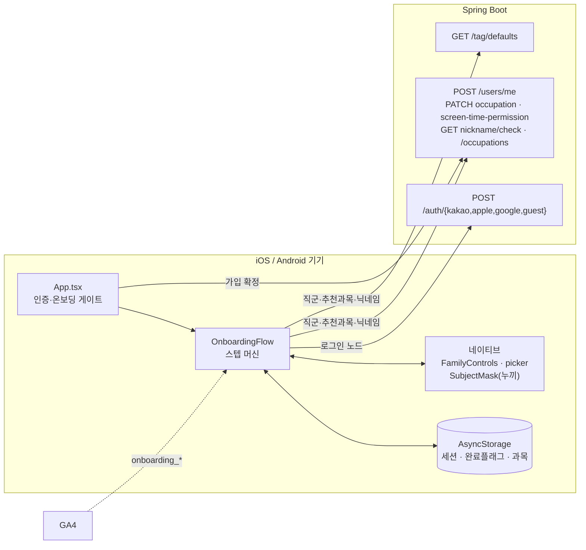
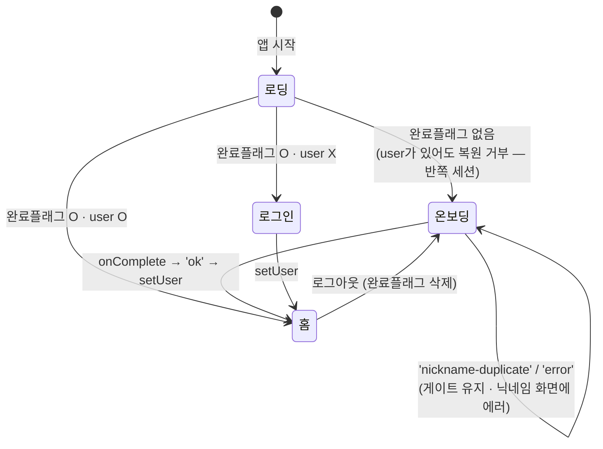
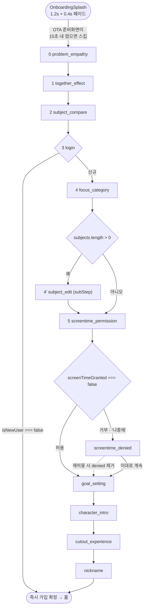
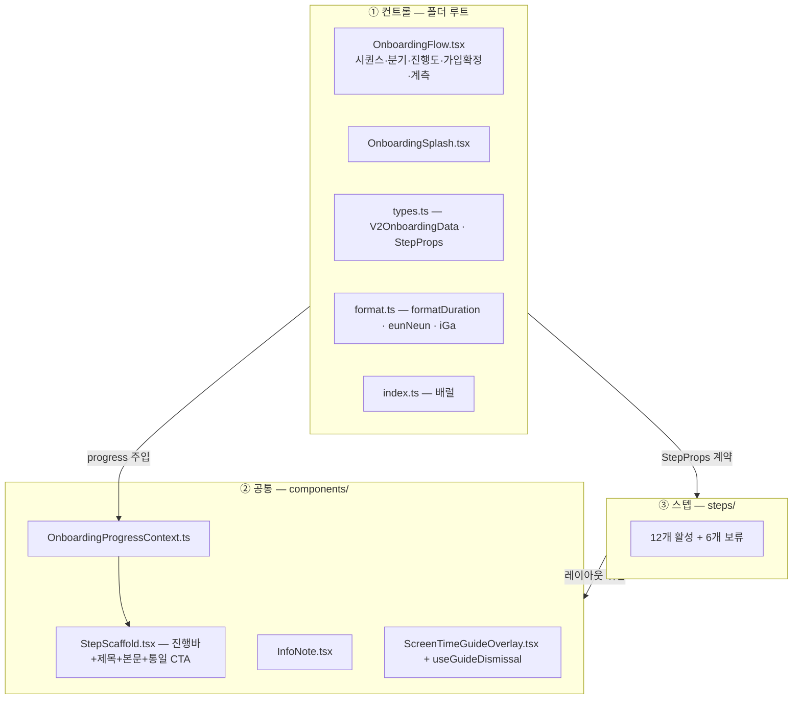
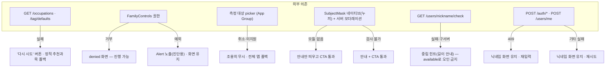
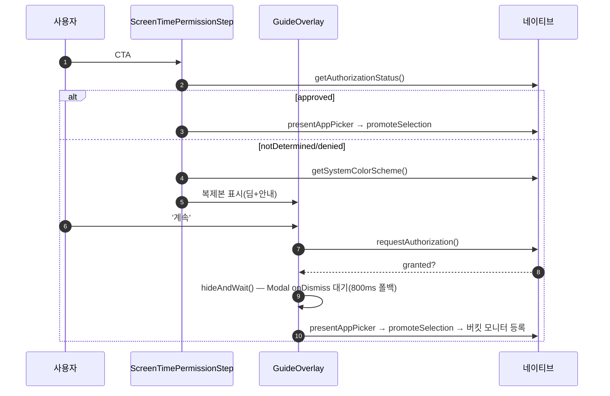

# 온보딩 — HLD (High-Level Design)

> 작성 2026-08-09 · 현재 구현 상태 기준
> 세트: [IA](information-architecture.md) · [PRD](prd.md) · **HLD** · [LLD](low-level-design.md)

---

## 1. 시스템 컨텍스트

온보딩은 **`NavigationContainer` 밖**에서 산다. `App.tsx`의 인증 분기가 직접 렌더하므로 `useNavigation`·`useUser`·`useCharacter` 같은 Provider 의존 훅을 쓸 수 없고, 필요한 것은 전부 props/모듈 함수로 직접 조달한다(누끼 생성기는 RN `Modal`, userId는 저장된 JWT의 `sub`에서 디코드).

---

## 2. 게이팅 — App.tsx는 언제 온보딩을 띄우고 언제 내리는가

| 분기 | 판정식 (`App.tsx:416-437`) | 렌더 |
|---|---|---|
| 로딩 | `loading` | `BrandSplash` |
| 온보딩 | `!user && !onboarded` | `<OnboardingFlow onComplete={…}/>` |
| 재로그인 | `!user && onboarded` | `<LoginScreen/>` (온보딩 플래그 없음) |
| 홈 | `user` | Provider 스택 + `RootNavigator` |

- **해제 조건은 `setUser` 하나뿐이다.** `onboarded=true`만으로는 온보딩이 안 내려간다 — 완료 처리에서 두 값을 함께 세팅한다(`App.tsx:383-395`).
- **반쪽 세션 방어(GROMO-617)**: 인증 성공 시 `auth.ts`가 토큰/유저를 먼저 저장하므로, 프로필 등록이 실패한 채 앱을 끄면 "user는 있는데 완료 플래그는 없는" 상태가 남는다. 부트스트랩은 이 조합을 복원하지 않는다.

---

## 3. 스텝 머신

### 3.1 동적 분기 두 개

| 분기 | 조건 | 성질 |
|---|---|---|
| `subject_edit` 삽입 | `data.subjects.length > 0` | **삽입형** — 노드가 하나 늘어난다. `subStep:true`라 진행바 칸 수에는 안 들어간다 |
| `screentime_denied` 삽입 | `data.screenTimeGranted === false` | **삽입형** — 거부일 때만 권한과 목표 사이에 들어간다. 재허용하면 노드가 빠지고 같은 인덱스가 `goal_setting`을 가리킨다 |

`sequence`는 `useMemo([data.subjects, data.screenTimeGranted])`로 재계산된다 — 분기 입력이 바뀌면 배열이 새로 만들어지고 현재 `index`가 가리키는 노드가 달라진다. 이 "인덱스는 그대로, 노드는 교체" 패턴 때문에 계측 dedup을 **인덱스가 아니라 스텝 이름**으로 한다.

### 3.2 진행바 — 로그인을 기준으로 두 구간

로그인 **전**은 `current=index · total=loginIndex(3칸)`, 로그인 **후**는 `current`=지금까지 지난 non-subStep 수 −1 · `total`=로그인 이후 non-subStep 수다. 승인 경로는 6칸, `screentime_denied`가 삽입되는 거부 경로는 7칸이다. 로그인 노드 자체는 전체화면이라 진행바가 없다. `subject_edit`은 `isSubStep` 필터로 세지 않아 직전 스텝과 칸을 공유한다.

### 3.3 뒤로가기

버튼이 아니라 **왼쪽 가장자리 스와이프**(`PanResponder`). 하한(`backFloor`)은 로그인 성공 시 `loginIndex+1`로 올라가 인증 이전 화면으로 못 돌아간다. 하한 판정은 최신 값을 보려고 `ref`로 참조한다 — `PanResponder`는 마운트 시 1회만 만들어지기 때문이다.

---

## 4. 3층 폴더 구조

| 층 | 책임 | 금지 |
|---|---|---|
| ① 컨트롤 | 순서·분기·전역 계측·가입 확정 | 화면 그리기 |
| ② 공통 | 레이아웃·진행바·공통 오버레이 | 특정 스텝 지식 |
| ③ 스텝 | 한 화면의 UI + 자기 정보 수집(`update`) + 자기 계측 | 다음 스텝이 뭔지 아는 것 (`onNext()`만 호출) |

**통일 CTA**: 모든 스텝이 `StepScaffold`의 하단 풀폭 버튼 하나를 쓴다. 보조 액션이 없어도 22px 슬롯을 예약해 CTA 세로 위치를 전 화면 고정한다. `ctaDisabled`(잠금)와 `ctaHidden`(연출 대기 중 감춤, 자리 유지)이 분리돼 있다.

---

## 5. 외부 의존과 실패 시 흐름

**설계 원칙**: 외부 의존이 실패해도 온보딩은 **막히지 않는다**. 단 하나의 예외가 `POST /users/me`로, 이건 실패하면 완료를 막는다 — 여기서 통과시키면 서버-로컬이 영구 불일치되기 때문이다.

### 5.1 스크린타임 권한 리허설 (GROMO-934)

iOS FamilyControls 권한창은 **승인('계속')이 왼쪽, 파란 강조 버튼이 '허용 안 함'**이라 습관대로 파란 버튼을 눌러 거부되는 사고가 잦다. 그래서 실제 요청 **직전에** 같은 위치·외형의 복제본을 띄우고, 복제본의 '계속'을 누르면 그 손가락 자리에 진짜 창이 뜬다.

`hideAndWait()`가 있는 이유: `setVisible(false)`는 해제를 **예약**만 하므로, 곧바로 네이티브 picker를 present하면 내려가는 모달 위에 떠서 유실된다.

---

## 6. 앞으로 변할 방향

- **재개(resume) 도입 시**: 컨트롤 층이 `{index, data}`를 AsyncStorage에 스냅샷하는 방식이 자연스럽다. 스텝 층은 손댈 필요가 없다 — `StepProps` 계약이 이미 순수하기 때문. 단 `screenTimeGranted`처럼 이미 부수효과가 난 값은 복원이 아니라 **재조회**해야 한다.
- **안드로이드 스크린타임 M2 이후**: 현재 `presentAppPicker`/`promoteSelection`은 iOS 전용이라 안드로이드는 전체 앱 측정이 기본이다. picker가 붙으면 권한 스텝의 안드로이드 분기가 iOS 경로로 수렴한다.
- **푸시 권한 편입**: `NotificationPermissionStep`을 시퀀스에 넣으면 `notificationGranted`가 살아나고, `PushGate`는 "이미 승인된 권한의 토큰 등록"만 하게 된다.
- **보류 스텝 정리**: 6개 고아 파일(`YesterdayScreenTimeStep` 포함)을 되살리거나 지운다.
- **온보딩 전용 로그인 화면 분리**: 현재 `LoginScreen`이 `isOnboarding` 플래그로 계측만 갈라 쓴다. 온보딩 전용 문구·진행바가 필요해지면 분리 지점이다.

---

## 7. 트레이드오프 및 한계

| 결정 | 트레이드오프 | 한계 (수용) |
|---|---|---|
| Provider 밖에서 동작 | 인증 전이라 Context에 의존할 수 없는 구조적 제약을 정면 수용 | 스텝이 필요한 값을 각자 조달한다 — 누끼 스텝은 JWT를 직접 디코드, 목표는 완료 후 `UserProvider` initial로 우회 |
| 시퀀스를 `useMemo` 배열로 | 분기가 선언적이고 읽기 쉬움 | 분기 입력이 바뀌면 **같은 인덱스가 다른 화면**이 된다 — 계측·진행바가 이 사실을 별도로 방어해야 함 |
| 수집 인메모리 · 저장 일괄 | 중도 이탈이 흔적을 안 남김 | 재개 불가. 강제종료 = 처음부터 |
| 권한만 즉시 반영 | 되돌릴 수 없는 부수효과를 미루지 않음 | "온보딩 안 끝냈는데 측정 중"인 상태가 정상적으로 존재 |
| 통일 CTA 하나 | 학습 비용 0, 레이아웃 안정 | 스텝별 다중 액션이 필요하면 보조 액션 1개가 상한 |
| 실패해도 통과시키는 예외들 | 갇힘 방지 | 예외로 통과한 사용자는 그 기능을 **설정 화면에서 스스로 찾아야** 한다 — 유도 장치 없음 |
| 로그인 하한(backFloor) | 인증 이후 화면 되돌림 사고 방지 | 직군을 잘못 골라도 로그인 화면으로 돌아가 다시 시작할 수 없음(직군 스텝 안에서만 변경) |
