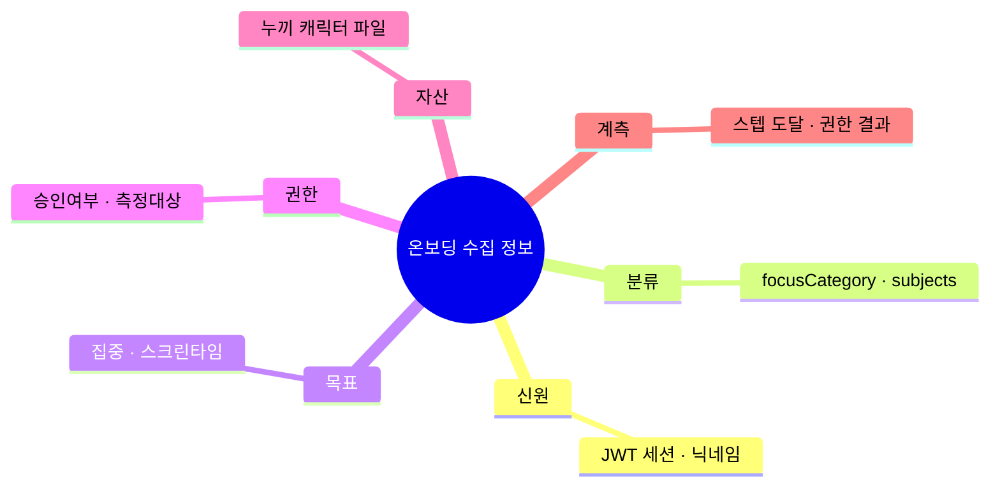
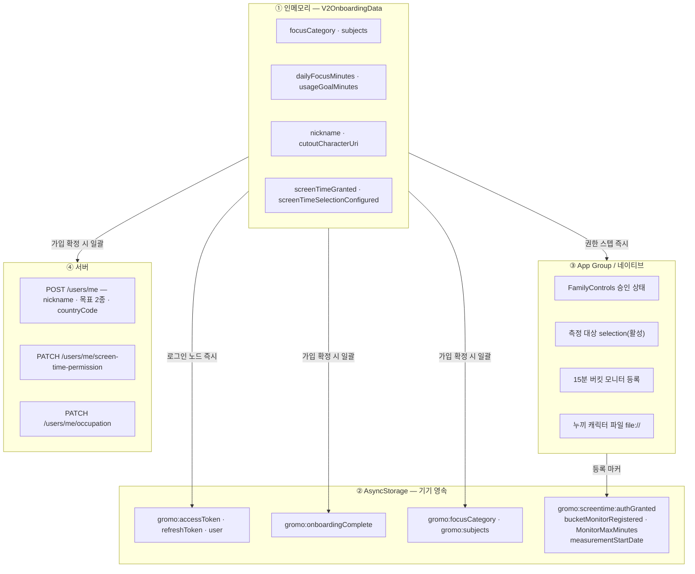
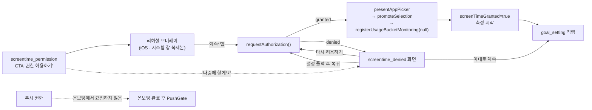
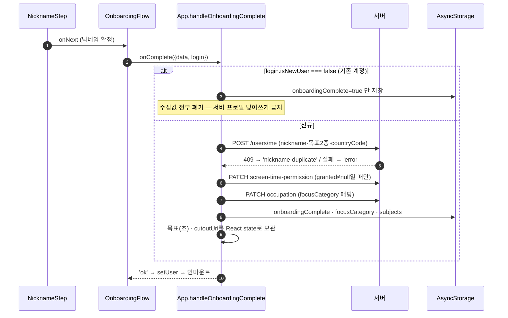

# 온보딩 — IA (Information Architecture)

> 작성 2026-08-09 · 현재 구현 상태 기준
> 세트: **IA** · [PRD](prd.md) · [HLD](high-level-design.md) · [LLD](low-level-design.md)
> 이 문서는 "온보딩에서 태어난 정보가 어디에 저장되고 누가 소비하는가"를 정의한다.

---

## 1. 전체 정보 지도

수집 주체는 전부 `V2OnboardingData` 한 객체(`src/screens/onboarding/types.ts:9-22`)다.
스텝은 이 객체를 `update(patch)`로만 건드리고, **저장·전송은 전부 온보딩 밖(App.tsx)에서 한 번에** 일어난다.
예외는 권한 계열 — 권한은 되돌릴 수 없어 스텝 안에서 즉시 네이티브·AsyncStorage에 반영된다(§4).

---

## 2. 스텝 ↔ 정보 매핑

| # | 노드 | 화면 파일 | 태어나는 정보 | 즉시 부수효과 |
|---|---|---|---|---|
| 0 | `problem_empathy` | `ProblemEmpathyStep.tsx` | — (설득) | — |
| 1 | `together_effect` | `TogetherEffectStep.tsx` | — (설득) | — |
| 2 | `subject_compare` | `SubjectCompareStep.tsx` | — (설득, 집중 결과·보상 예시) | — |
| 3 | `login` | `LoginScreen.tsx` | `LoginResult`(토큰·isNewUser) | **AsyncStorage에 세션 저장**(auth.ts `postAuthSave`) |
| 4 | `focus_category` | `FocusCategoryStep.tsx` | `focusCategory`, `subjects` | `GET /occupations`·`GET /tag/defaults` 조회 |
| 4′ | `subject_edit` *(조건부)* | `SubjectEditStep.tsx` | — (읽기 전용 확인) | — |
| 5 | `screentime_permission` | `ScreenTimePermissionStep.tsx` | `screenTimeGranted`, `screenTimeSelectionConfigured` | **FamilyControls 승인 · picker · 버킷 모니터 등록** |
| 6a | `screentime_denied` *(거부)* | `ScreenTimeDeniedStep.tsx` | `screenTimeGranted`(재요청 시 true로 전환) | 재요청 · 설정 딥링크 |
| 6/7 | `goal_setting` | `GoalSettingStep.tsx` | `dailyFocusMinutes`, `usageGoalMinutes` | 승인 경로 스크린타임 퍼널 계측 |
| 7/8 | `character_intro` | `CharacterIntroStep.tsx` | — (캐릭터 첫 노출) | — |
| 8/9 | `cutout_experience` | `CutoutStep.tsx` | `cutoutCharacterUri`(선택) | 생성 시 캐릭터 이미지 파일 저장(`file://`), 항상 건너뛰기 가능 |
| 9/10 | `nickname` | `NicknameStep.tsx` | `nickname` | `GET /users/nickname/check` 실시간 조회 |

- 순서 정본은 `OnboardingFlow.tsx:108-134`. 코드 주석과 계측 상수에 남은 **W1~W15 번호는 V3 이전 시안 번호**로 실제 순서와 일치하지 않는다(§7).
- `subject_edit`은 `data.subjects.length > 0`일 때만 삽입되고, 진행바 칸 수에서는 제외된다(`subStep`).
- `screentime_denied`는 `data.screenTimeGranted === false`일 때만 권한과 목표 사이에 삽입된다. 거부 화면에서 권한을 다시 허용하면 `onNext` 없이 노드가 빠지고 같은 인덱스에서 `goal_setting`으로 전환된다.

---

## 3. 정보가 사는 네 곳

**로그인 노드가 정보 지형의 분수령이다.** 그 앞은 아무것도 남기지 않고, 그 뒤부터는 토큰이 있어 서버 조회·권한 등록이 가능해진다.

---

## 4. 권한은 언제, 어디서 획득되는가

| 권한 | 요청 지점 | 저장처 | 비고 |
|---|---|---|---|
| FamilyControls(스크린타임) | `ScreenTimePermissionStep` / `ScreenTimeDeniedStep` | 네이티브 + `gromo:screentime:authGranted`(`'1'`/`'0'`) | 승인/거부 **양쪽 다** 기록 — 콜드런치 `notDetermined` quirk 보정용 |
| 측정 대상 selection | 권한 승인 직후 picker | App Group(활성 selection) | 취소해도 진행. 선택 없으면 전체 앱 폴백 |
| 15분 버킷 모니터 | picker 확정 직후 | `bucketMonitorRegistered='1'`(소유 미상 sentinel) | 온보딩 미완주 이탈해도 측정이 이미 시작된다 |
| 푸시 알림 | **온보딩 아님** — `PushGate`(완료 후) | — | `NotificationPermissionStep.tsx`는 존재하지만 시퀀스에 없음 |

`registerUsageBucketMonitoring(null)`은 소유 userId를 `'1'`로 기록하고, 이후 `ScreenTimeSyncer` 첫 실행이 현재 계정으로 귀속시킨다(`screentimeSync.ts:86,276-280`).

---

## 5. 가입 확정 — 정보가 서버로 나가는 유일한 순간

- `POST /users/me` 실패는 **완료를 막는다** — 온보딩 게이트가 유지되고 닉네임 화면이 에러와 함께 그대로 남는다(`App.tsx:344-348`).
- 뒤이은 권한·직군 PATCH 실패는 완료를 막지 않는다(`App.tsx:127-129`, 재동기화는 TODO).

---

## 6. 정보 수명 — 남는 것과 사라지는 것

| 정보 | 온보딩 종료 후 | 소비처 |
|---|---|---|
| 토큰·`gromo:user` | **영속** | 앱 전역 인증 |
| `gromo:onboardingComplete` | **영속** | 온보딩 게이트(로그아웃 시 삭제 → 재온보딩) |
| `gromo:focusCategory` | **영속**(신규만) | 리그 기본 시험·통계 비교 모수. 재로그인 시 서버 `occupation`에서 백필 |
| `gromo:subjects` | **영속**(신규만) | `SubjectProvider` 첫 로드 — 저장 안 하면 신규 계정은 과목 0개로 시작 |
| 목표 2종 | 서버 프로필 + App state → `UserProvider` initial | 홈 목표 게이지·달성 판정 |
| `cutoutCharacterUri` | 파일은 영속, 경로는 App state → `CharacterProvider` 시드 | 홈 캐릭터 선택(자동 장착 안 함) |
| 스크린타임 권한·모니터 마커 | **영속** | 홈 사용시간·목표 판정 |
| `screenTimeSelectionConfigured` | **휘발** — 읽는 곳 없음 | (없음) |
| `guessedYesterdayMinutes` · `notificationGranted` | **휘발** — 채우는 스텝이 시퀀스에 없음 | (없음) |
| 계측 이벤트 | GA4로 발사 후 로컬 미보관 | 퍼널 분석 |

---

## 7. 앞으로 변할 방향

- **W번호 폐기**: `W1~W15`는 V3 재구성 이전 시안 번호다. 코드 주석(`ProblemEmpathyStep.tsx:17` = W3인데 시퀀스 0번)과 `analyticsEvents.ts`의 `step_index` 상수가 이 낡은 번호를 붙들고 있다. 정본은 `OnboardingStepName` 문자열이므로, 다음 정리 때 W번호를 주석·상수에서 걷어내는 방향.
- **`focusCategory`/`subjects`의 서버 계약화**: `types.ts:8`이 "서버 계약 미정"이라 적고 있으나 실제로는 `occupation`(PATCH)·`focus tag`(세션 업로드 시 find-or-create)로 절반은 서버에 도달한다. 남은 절반(과목 목록 자체의 서버 소유)이 붙으면 `gromo:subjects` 로컬 저장은 캐시로 강등된다.
- **푸시 권한의 온보딩 편입**: `NotificationPermissionStep.tsx`가 이미 있으므로 제품 결정만 나면 시퀀스 삽입은 한 줄이다. 그때 `notificationGranted` 필드가 살아난다.
- **측정 대상 selection의 정보화**: 현재 picker 결과는 네이티브에만 남고 JS 쪽 기록(`selectionConfigured`·`selectionCounts` 키)은 사문화 상태다. 설정 화면과 공유하려면 이 키들을 되살리거나 삭제해야 한다.

---

## 8. 트레이드오프 및 한계

| 정보 구조 결정 | 얻는 것 | 한계 (수용) |
|---|---|---|
| 수집은 인메모리, 저장은 완료 시 일괄 | 중도 이탈이 기기에 쓰레기를 남기지 않음 | **온보딩 중 앱이 죽으면 전부 소실** — 재실행 시 처음부터. 재개(resume) 지점 없음 |
| 로그인을 플로우 중간에 배치 | 이후 스텝이 서버 조회(직군·추천과목·닉네임 중복)를 쓸 수 있음 | 로그인 전 3스텝은 완전히 로컬 — 이탈 분석이 익명 이벤트에만 의존 |
| 권한만 즉시 반영 | 미완주 이탈자도 측정이 시작됨 | 온보딩을 끝내지 않은 사용자에게도 권한·모니터가 남아 "쓴 적 없는데 측정 중"인 상태가 가능 |
| 기존 계정은 수집값 전량 폐기 | 서버 프로필 덮어쓰기 사고 원천 차단 | 재로그인 유저가 온보딩에서 다시 고른 목표·과목이 조용히 버려진다 — 화면상 피드백 없음 |
| `screenTimeGranted=false`가 '거부'와 '나중에'를 겸함 | 분기 로직 단일화 | 서버 `screen-time-permission`도 둘을 구분 못 함 — "미요청"과 "명시 거부"가 같은 값 |
| 누끼 캐릭터는 파일 경로만 전달 | 온보딩이 `CharacterProvider` 밖에서도 동작 | 파일이 사라지면 경로만 남아 깨진 이미지 — 검증 지점 없음 |
