# 온보딩 — LLD (Low-Level Design)

> 작성 2026-08-09 · 현재 구현 상태 기준
> 세트: [IA](information-architecture.md) · [PRD](prd.md) · [HLD](high-level-design.md) · **LLD**
> 파일 기준 경로: `app/src/screens/onboarding/` (다른 경로는 명시)

---

## 1. 파일 지도

### 1.1 컨트롤 층 (폴더 루트)

| 파일 | 역할 |
|---|---|
| `OnboardingFlow.tsx` | 시퀀스 정의(`:98-135`)·동적 분기·index/data 상태·진행도 계산(`:229-235`)·스와이프 뒤로(`:166-177`)·가입 확정(`:181-198`)·시작/완주 계측 |
| `OnboardingSplash.tsx` | 진입 스플래시. `HOLD_MS=1200` 노출 후 `FADE_MS=400` 페이드 → `onDone` |
| `types.ts` | `V2OnboardingData`·`INITIAL_ONBOARDING_DATA`·`StepProps`·`OnboardingResult`·`OnboardingCompleteStatus` |
| `format.ts` | `formatDuration(분→"N시간 M분")`·`eunNeun`·`iGa`(한글 조사) |
| `format.test.ts` | 포맷 유틸 단위 테스트 |
| `index.ts` | 배럴 — `export { default } from './OnboardingFlow'` + `export * from './types'` |

### 1.2 공통 층 (`components/`)

| 파일 | 역할 |
|---|---|
| `StepScaffold.tsx` | 진행바 + 제목/부제 + 본문 + 하단 통일 CTA(+보조 액션 슬롯). `useSafeAreaInsets`를 패딩으로 직접 적용(네이티브 `SafeAreaView`는 remount마다 인셋 미적용 프레임이 생겨 CTA가 튄다 — `:49-51`) |
| `OnboardingProgressContext.ts` | `{current, total}` Context + `useOnboardingProgress()` |
| `InfoNote.tsx` | 점+텍스트 안내 박스, `NoteStrong` 강조 |
| `ScreenTimeGuideOverlay.tsx` | 시스템 권한창 복제 오버레이(GROMO-934) + `useGuideDismissal` 훅 |

### 1.3 스텝 층 (`steps/`) — 활성 12

| 파일 | 스텝 이름 | 수집/부수효과 |
|---|---|---|
| `ProblemEmpathyStep.tsx` | `problem_empathy` | — |
| `TogetherEffectStep.tsx` | `together_effect` | — |
| `SubjectCompareStep.tsx` | `subject_compare` | — (집중 결과·보상 예시) |
| `FocusCategoryStep.tsx` | `focus_category` | `focusCategory`·`subjects` |
| `SubjectEditStep.tsx` | `subject_edit` | — (읽기 전용) |
| `ScreenTimePermissionStep.tsx` | `screentime_permission` | `screenTimeGranted`·`screenTimeSelectionConfigured` |
| `ScreenTimeDeniedStep.tsx` | `screentime_denied` | `screenTimeGranted`(재허용) |
| `GoalSettingStep.tsx` | `goal_setting` | `dailyFocusMinutes`·`usageGoalMinutes` |
| `CharacterIntroStep.tsx` | `character_intro` | — |
| `CutoutStep.tsx` | `cutout_experience` | `cutoutCharacterUri` |
| `NicknameStep.tsx` (+ `.test.tsx`) | `nickname` | `nickname` · 중복확인 계약 테스트(GROMO-1215) |
| `@/screens/LoginScreen.tsx` | `login` | `LoginResult` |

### 1.4 스텝 층 — **보류 6 (온보딩 시퀀스에서 import되지 않음)**

`UsageGuessStep.tsx`(W9) · `YesterdayScreenTimeStep.tsx`(W11) · `LiveRankingStep.tsx`(W6) · `PhoneManageStep.tsx`(W8) · `NotificationPermissionStep.tsx`(W13) · `GromoStartStep.tsx`(W14)

### 1.5 외부 연계

| 대상 | 쓰이는 곳 |
|---|---|
| `@/services/ScreenTimeModule` | 권한·picker·색상스킴 |
| `@/services/screentimeSync` `registerUsageBucketMonitoring` | picker 확정 직후 |
| `@/services/analyticsEvents` | 전 스텝 계측 |
| `@/services/userApi` `getOccupations`·`checkNickname` / `@/services/focusApi` `getDefaultTags` | 직군·추천과목·닉네임 |
| `@/hooks/useNicknameCheck` | 닉네임 실시간 중복확인(디바운스 350ms) |
| `@/components/DurationDrumPicker` | 목표 5분 눈금 휠 |
| `@/constants/goals` | 목표 선택 범위(집중·스크린타임 하한/상한) — 설정 화면과 공유 |
| `@/screens/character/CharacterCreator` | 누끼 생성기(RN `Modal`로 호스팅) |
| `@/utils/otaGate` `wasOtaSplashJustShown` | 스플래시 스킵 판정 |
| `@/utils/haptics` | `hapticLight`(시작) · `hapticMedium`(스텝 전환) |

---

## 2. 상태 명세

### 2.1 `V2OnboardingData` (`types.ts:9-34`)

| 필드 | 초기값 | 쓰는 스텝 | 읽는 곳 |
|---|---|---|---|
| `focusCategory: string \| null` | `null` | `focus_category` | `App.syncOnboardingToServer`·`gromo:focusCategory` |
| `subjects: string[]` | `[]` | `focus_category` | `subject_edit` 표시·분기 조건·`gromo:subjects` |
| `guessedYesterdayMinutes: number \| null` | `null` | **없음(보류 스텝)** | 없음 |
| `screenTimeGranted: boolean \| null` | `null` | 권한·거부 스텝 | 분기 조건·`PATCH screen-time-permission` |
| `screenTimeSelectionConfigured: boolean` | `false` | 권한·거부 스텝 | **없음 (write-only)** |
| `nickname: string` | `''` | `nickname` | `POST /users/me`·`setUser` |
| `cutoutCharacterUri?: string` | `undefined` | `cutout_experience` | `CharacterProvider initialCustomUri` |
| `usageGoalMinutes: number \| null` | `null` | `goal_setting` | `dailyScreenTimeGoalMinutes` |
| `dailyFocusMinutes: number \| null` | `null` | `goal_setting` | `dailyFocusTimeGoalMinutes` |
| `notificationGranted: boolean \| null` | `null` | **없음(보류 스텝)** | 없음 |

주석의 범위 표기(`usageGoalMinutes` 60~600 / `dailyFocusMinutes` 30~600)는 **현재 코드 상수와 다르다** — §4 참조.

### 2.2 컨트롤러 로컬 상태 (`OnboardingFlow.tsx:65-75`)

| 상태 | 용도 |
|---|---|
| `index` | 현재 시퀀스 위치 |
| `data` | 수집 데이터 |
| `showSplash` | `!wasOtaSplashJustShown()`로 초기화 (OTA 준비화면 15초 시효) |
| `login: LoginResult \| null` | 중간 로그인 세션. `backFloor` 계산에도 쓰임 |
| `serverError` | 가입 확정 실패 메시지 (입력 수정 시 클리어) |
| `submitting` | 확정 요청 중 입력·CTA 잠금 |
| `viewedStepsRef: Set<OnboardingStepName>` | 계측 dedup(스텝 **이름** 기준) |
| `backFloorRef` / `indexRef` | `PanResponder`가 1회만 생성되므로 최신값 참조용 |

### 2.3 저장 키 (`@/types/storage` `STORAGE_KEYS`)

| 키 | 쓰는 시점 | 값 |
|---|---|---|
| `gromo:accessToken` / `refreshToken` / `user` | 로그인 노드 (`auth.ts postAuthSave:85-98`) | 토큰·`LoginResult` JSON |
| `gromo:onboardingComplete` | 가입 확정 (`App.tsx:383`) | `'true'` |
| `gromo:focusCategory` | 가입 확정, 신규만 (`App.tsx:358`) | 표시명 문자열 |
| `gromo:subjects` | 가입 확정, 신규·`length>0`만 (`App.tsx:365-375`) | `{date, subjects:[{id:'subj-ob-N', name, accumulatedSeconds:0}]}` |
| `gromo:screentime:authGranted` | `requestAuthorization`/`getAuthorizationStatus` 확정 답마다 | `'1'`/`'0'` (없음=미확정) |
| `gromo:screentime:bucketMonitorRegistered` | 버킷 모니터 등록 성공 | 소유 userId, 온보딩에선 sentinel `'1'` |
| `gromo:screentime:bucketMonitorMaxMinutes` | 같은 `multiSet` | 등록 시그니처(상한@눈금) |
| `gromo:screentime:measurementStartDate` | 같은 `multiSet` | `{userId:'1', date: todayStr()}` |

세 스크린타임 키는 **한 번의 `multiSet`으로 원자 기록**된다 — 마커만 남고 앵커가 없으면 다음 동기화가 "예전부터 돌던 모니터"로 오인해 어제 0분을 목표 달성으로 만든다(`screentimeSync.ts:87-98`).

---

## 3. 시퀀스·분기 계산식

```typescript
// OnboardingFlow.tsx:101-102
const hasSubjects = data.subjects.length > 0;
const denied = data.screenTimeGranted === false;
```

```typescript
// :152-153 — 뒤로가기 하한
const loginIndex = sequence.findIndex((n) => n.kind === 'login');
const backFloor = login ? loginIndex + 1 : 0;
```

```typescript
// :229-235 — 진행바
const progress =
  index < loginIndex
    ? { current: index, total: loginIndex }                       // 로그인 전: 3칸
    : {
        current: postLogin.slice(0, index - loginIndex).filter((n) => !isSubStep(n)).length - 1,
        total: postLogin.filter((n) => !isSubStep(n)).length,     // 로그인 후: 승인 6칸, 거부 7칸
      };
```

- 로그인 후 `total` = 승인 경로 **6칸**, `screentime_denied`가 삽입되는 거부 경로 **7칸**이다(`subject_edit` 제외).
- `index === loginIndex`에서 `current`는 `-1`이 되지만, 로그인 노드는 `StepScaffold`를 쓰지 않는 전체화면이라 진행바가 그려지지 않는다.

**스와이프 뒤로 임계값** (`:166-177`)

| 축 | 값 |
|---|---|
| 시작 x | `g.x0 < 24` (왼쪽 가장자리) |
| 이동 인식 | `g.dx > 12` **AND** `|dx| > |dy| * 1.5` |
| 확정(release) | `g.dx > 60` **AND** `|dx| > |dy|` |
| 하한 | `index > backFloorRef.current` |

---

## 4. 검증 규칙과 경계값

### 4.1 목표 설정 (`GoalSettingStep.tsx:20-27`)

범위는 설정 화면과 공유한다 — `@/constants/goals` 한 곳에만 있다 (GROMO-1255).

```typescript
// @/constants/goals.ts
export const GOAL_STEP_MINUTES = 5;
export const FOCUS_GOAL_MINUTES = { min: 30, max: 24 * 60 };  // 30분~24시간
export const USAGE_GOAL_MINUTES = { min: 30, max: 12 * 60 };  // 30분~12시간

// GoalSettingStep.tsx
const E2E = process.env.EXPO_PUBLIC_E2E === '1';
const E2E_PREFILL = { focus: 720, screen: 240 };
```

| 규칙 | 구현 |
|---|---|
| 프리필 없음 | `data.dailyFocusMinutes ?? 0` — `null`이 곧 "아직 안 정함" |
| '0시간' 표시 | `goalLabel(0) === '0시간'` (선택 가능한 값 아님 — 피커가 하한으로 클램프) |
| '손댔는지' 판정 | `data.dailyFocusMinutes != null` — 뒤로 갔다 와도 유지 |
| CTA 잠금 | `ctaDisabled={!focusSet \|\| !screenSet}` + 잠긴 이유 한 줄 안내 |
| 눈금 | `DurationDrumPicker` `MINUTE_STEP = 5` (분 휠 12칸: 0~55분) |
| 클램프 | `Math.min(max, Math.max(min, h*60+m))`, 결과가 현재 `value`와 같으면 `onChange` 생략 → 휠이 되돌아감 |
| 시 휠 칸 수 | `floor(max/60) + 1` → 집중 25칸, 스크린타임 13칸 |
| 제출 | `update({dailyFocusMinutes, usageGoalMinutes})` 후 계측 2회 → `onNext()` |

**설정 화면(`@/screens/settings/GoalsScreen.tsx`)과의 대조** — 두 화면 모두 `@/constants/goals`를
import하므로 값이 어긋날 수 없다. 예전에는 각자 선언해 아래 두 줄이 불일치했다(GROMO-1255).

| | 온보딩 | 설정 | 상태 |
|---|---|---|---|
| 집중 하한 | 30분 | 30분 | 일치 (설정 5분 → **30분**으로 맞춤) |
| 집중 상한 | 1440분 | 1440분 | 일치 |
| 스크린타임 하한 | 30분 | 30분 | 일치 |
| 스크린타임 상한 | 720분(12h) | 720분(12h) | 일치 (온보딩 480분 → **720분**으로 맞춤) |
| 눈금 | 5분 | 5분 | 일치 |

### 4.2 닉네임 (`NicknameStep.tsx:16-45`)

```typescript
const NICK_MIN = 2;
const NICK_MAX = 10;
const BASE_HINT = `${NICK_MIN}~${NICK_MAX}자로 정할 수 있어요`;
```

| 규칙 | 구현 |
|---|---|
| 길이 | `trimmed.length >= 2 && <= 10`. `TextInput maxLength={10}` |
| CTA | `ctaDisabled={!validLength || !!submitting}` — **`taken`이어도 잠그지 않는다**(검사 응답이 stale할 수 있음) |
| 실시간 검사 | `useNicknameCheck(trimmed, validLength && !submitting)` · 디바운스 `CHECK_DEBOUNCE_MS = 350` · 세대 번호로 stale 응답 폐기 |
| 문구 우선순위 | `serverError` > 형식 오류 > `taken` > `available` > `checking` > `unknown`(중립 힌트) > `idle`(중립 힌트) |
| `unknown` 처리 | **명시 분기**로 중립 힌트 — `available`로 오인 금지(GROMO-1231) |
| 최종 방어 | `POST /users/me` 409 `NICKNAME_DUPLICATE` → `serverError` |

### 4.3 누끼 체험 (`CutoutStep.tsx:60-91`)

```typescript
const canCreate = isSubjectMaskModuleAvailable();
const canSkip = !canCreate || process.env.EXPO_PUBLIC_E2E === '1';
ctaDisabled = !created && !canSkip && !moderationUnavailable && !creatorDismissed;
// canCreate && !created일 때도 별도 '건너뛰기' 버튼이 onNext를 직접 호출한다.
```

- `created = !!data.cutoutCharacterUri`. 저장 경로에 `?t=${Date.now()}` 캐시버스트를 붙인다(고정 파일명이라 `<Image>`가 URI를 캐시 키로 잡음).
- 사진 선택을 원하지 않는 일반 사용자도 `건너뛰기` 버튼으로 즉시 다음 단계에 진입한다.
- `userId`는 저장된 `accessToken`의 JWT `sub`에서 디코드 — 한 기기 두 계정이 서로의 캐릭터 파일을 덮어쓰지 않게.

### 4.4 스크린타임 권한

| 상황 | 처리 |
|---|---|
| `status === 'approved'` | 권한창 없이 통과 → 곧바로 picker |
| `notDetermined` / `denied` | 리허설 오버레이 → `requestAuthorization()` (denied여도 시트가 다시 뜸, GROMO-971) |
| 연타 | `requesting` 가드 — FamilyControls는 시스템 전역 동시 1건(GROMO-909) |
| picker 취소·미지원 | `try/catch`로 무시하고 진행 |
| Android | 시스템 팝업 없음 — `requestAuthorization()`이 Usage Access 설정 딥링크 + 복귀 재확인까지 담당. picker는 M2 전이라 없음 |
| 오버레이 해제 | `hideAndWait()` — `Modal onDismiss` 대기, 800ms 폴백 |
| 설정 폴백 복귀 | `AppState 'active'` + `returningFromSettings` 플래그일 때만 재확인 |

### 4.5 보류된 분석 연출 (`YesterdayScreenTimeStep.tsx` + `ScreenTimeAnalyzingOverlay`)

현재 온보딩 시퀀스에서는 마운트되지 않는다. 파일을 다시 사용할 경우 `ANALYZE_MS = FILL_MS(2000) + HOLD_MS(900) + FINISH_MS(300) = 3200ms`이며,
모듈 전역 `analyzedThisSession`으로 1회만 재생한다. 플로우 재진입마다 재생하려면 `OnboardingFlow` 마운트에서 `resetAnalyzeIntro()`를 다시 연결해야 한다. 연출 중엔 `ctaHidden`으로 CTA 자리만 남기고 감춘다.

---

## 5. 계측 발화 지점

```mermaid
flowchart TD
    M["OnboardingFlow 마운트"] --> A1["onboarding_started + tutorial_begin"]
    SP["스플래시 종료 후 매 스텝"] --> A2["onboarding_step_viewed{step, step_index}<br/>이름 기준 dedup"]
    L["LoginScreen(isOnboarding)"] --> A3["onboarding_signup_selected{method}"]
    L --> A4["onboarding_signup_failed{method, reason}"]
    FC["FocusCategoryStep.proceed"] --> A5["onboarding_focus_category_submitted"]
    PM["권한 요청 직전/직후"] --> A6["onboarding_permission_requested"]
    PM --> A7["onboarding_permission_resulted{granted}"]
    ST["승인 후 목표 설정/거부 안내 진입"] --> A8["onboarding_screentime_viewed{has_data}"]
    GS["GoalSettingStep.onCta"] --> A9["onboarding_goal_submitted × 2<br/>goal_type: focus | usage"]
    NK["NicknameStep.onCta"] --> A10["onboarding_nickname_submitted (닉네임 값 미전송)"]
    FIN["finalize → 'ok' & isNewUser !== false"] --> A11["onboarding_completed + tutorial_complete"]
```



| 이벤트 | 고정 `step_index` (`analyticsEvents.ts`) | 실제 시퀀스 위치 |
|---|---|---|
| `onboarding_started` | 0 | 마운트 |
| `onboarding_step_viewed` | 런타임 `index` | 가변 |
| `onboarding_focus_category_submitted` | 4 | 4 ✅ |
| `onboarding_permission_requested/resulted` | 10 | 5 ❌ |
| `onboarding_screentime_viewed` | 11 | 거부 안내 6 / 승인 후 목표 6 ❌ |
| `onboarding_nickname_submitted` | 12 | 9 또는 10 ❌ |
| `onboarding_goal_submitted` | 13 | 6 또는 7 ❌ |
| `onboarding_signup_selected/failed` | 15 | 3 ❌ |
| `onboarding_completed` | 99 | 종료 |

`step_index` 상수는 V3 이전 W번호에 묶여 있어 **닉네임(12)이 목표(13)보다 앞**으로 보이는 등 실제 순서와 어긋난다. 퍼널 정의는 `step_viewed`의 `step` 문자열을 쓴다.

### 5.1 dedup 규칙 (`OnboardingFlow.tsx:141-149`)

```typescript
const step = reached.kind === 'step' ? reached.name : reached.kind;
if (viewedStepsRef.current.has(step)) return;
```

인덱스가 아니라 **이름** 기준이라 (a) 뒤로가기 재방문은 미발행, (b) 같은 인덱스가 다른 스텝으로 교체되는 동적 분기(거부→허용)는 새 도달로 정상 발행된다.

---

## 6. 알려진 부채 / 한계

| # | 항목 | 근거 | 영향 |
|---|---|---|---|
| 1 | **보류 스텝 6개** — `UsageGuessStep`·`YesterdayScreenTimeStep`·`LiveRankingStep`·`PhoneManageStep`·`NotificationPermissionStep`·`GromoStartStep`이 시퀀스에서 import되지 않음 | `OnboardingFlow.tsx` import·sequence | 죽은 코드가 현재 플로우를 설명하는 것으로 오해될 수 있다 |
| 2 | **죽은 필드 3종** — `guessedYesterdayMinutes`·`notificationGranted`(채우는 스텝 없음), `screenTimeSelectionConfigured`(쓰기만 하고 읽는 곳 없음) | `types.ts:12,14,21` | 타입이 실제보다 넓어 보임 |
| 3 | **사문화된 저장 키 3개** — `gromo:selection:configured`·`:counts`·`:pendingCounts`는 코드베이스 전체에 읽기·쓰기 없음 | `types/storage.ts:52-54` | 온보딩 picker 결과가 JS 쪽에 전혀 기록되지 않아 설정 화면과 상태를 공유하지 못함 |
| 4 | **`step_index` 상수가 실제 순서와 불일치** | §5 표 | GA4 퍼널을 `step_index`로 정의하면 순서가 뒤집힌다. `step_viewed` 속성 ID는 **프로덕션 미배포**라 콘솔에서 `step` 세분화가 아직 불가 |
| 5 | **GA4 퍼널 사고 이력** — 더 이상 발행되지 않는 `shock` 이벤트를 닫힌 퍼널 단계로 잡아 100% 이탈로 보였고 2026-07-30 수정 | — | 퍼널 정의는 `analyticsEvents.ts`에 실재하는 이벤트만 사용 |
| 6 | **재개 불가** — 수집 데이터가 인메모리라 강제종료 시 전부 소실 | `OnboardingFlow.tsx:66` | 조건부 스텝 포함 최대 12개를 처음부터. 권한·모니터 등록만 남는 비대칭 상태 |
| 7 | **`UserContext.goalSecondsRef`가 `initialGoalSeconds`로 초기화되지 않음** — `useRef(3 * 3600)` 하드코딩 | `@/store/UserContext.tsx:60` | 현재 이 ref를 읽는 코드가 없어 무해하나, 소비처가 생기면 온보딩 목표와 무관한 3시간을 즉시 반환한다 |
| 8 | **'나중에 할게요' = 거부** — 둘 다 `screenTimeGranted=false` | `ScreenTimePermissionStep.tsx:163-166` | 서버 `PATCH screen-time-permission`도 구분 못 함 |
| 9 | **`SubjectCompareStep` 결과가 예시 데이터** — 42분 집중과 보상·리그 변화를 정적으로 표시 | `SubjectCompareStep.tsx` | 로그인 전 화면이라 개인 실데이터를 쓸 수 없는 구조적 제약 |
| 10 | **기존 계정 수집값 무통보 폐기** | `App.tsx:342-382` | 재로그인 유저가 다시 고른 목표·과목·직군이 조용히 사라진다 |
| 11 | **`E2E_PREFILL`이 코드에 상주** | `GoalSettingStep.tsx:26-27` | 운영 빌드엔 `EXPO_PUBLIC_E2E`가 없어 무해하지만, 플래그가 잘못 주입되면 목표 잠금이 통째로 풀린다 |

---

## 7. 앞으로 변할 방향

- **W번호 제거**: 주석의 `W1~W15`와 `analyticsEvents.ts`의 `step_index` 리터럴을 걷어내고 `OnboardingStepName`을 유일한 스텝 식별자로 남긴다.
- **보류 파일 처분**: 되살릴 스텝(자가 추측·전날 사용시간·알림 권한)과 지울 스텝(랭킹·핸드폰 관리·시작 히어로)을 갈라 결정한다. 되살린다면 `types.ts`의 죽은 필드가 함께 살아난다.
- **재개(resume)**: `{index, data}` 스냅샷을 AsyncStorage에 두는 방식. 스텝 층은 무변경 — 단 `screenTimeGranted`는 복원이 아니라 `getAuthorizationStatus()` 재조회로 갱신해야 한다.
- **`selection` 키 부활 또는 삭제**: picker 결과를 JS에 기록하면 설정 화면의 "측정 대상 설정됨" 표시와 온보딩이 같은 진실을 본다.

---

## 8. 트레이드오프 및 한계

| 결정 | 얻는 것 | 한계 (수용) |
|---|---|---|
| `StepProps` 단일 계약(`data`/`update`/`onNext`/`onBack`) | 스텝이 순서를 모른다 — 재배치가 배열 한 줄 | 스텝별 고유 인자가 필요하면 계약을 깨야 한다(닉네임이 이미 `serverError`/`submitting`으로 확장) |
| 진행바를 로그인 기준 2구간으로 | 로그인 이후 "몇 개 남았나"가 정직해짐 | 전체 진행률은 사용자에게 보이지 않는다 |
| `subStep`을 칸 수에서 제외 | 동적 삽입에도 칸 수 고정 | 삽입된 스텝에선 진행바가 멈춘 것처럼 보인다 |
| 계측 dedup을 이름 기준으로 | 교체형 분기를 정상 집계 | 같은 스텝을 두 번 "진짜로" 본 경우(거부→허용→거부)는 1회로만 집계 |
| 권한 리허설 오버레이 | 오탭 거부율 감소 | 시스템 창 외형 하드코딩 — iOS가 디자인을 바꾸면 복제본이 어긋난다. 위치·비율은 실기기 실측값 |
| 갇힘 방지 예외(`creatorDismissed` 등) | 어떤 실패로도 온보딩이 막히지 않음 | 예외로 통과한 사용자에게 그 기능을 다시 유도하는 장치가 없다 |
| 완주 계측을 신규 유저로 한정 | 완주율이 실제 가입만 집계 | 기존 계정 재로그인이 `started` 분모에만 들어가 완주율이 실제보다 낮게 보인다 |
