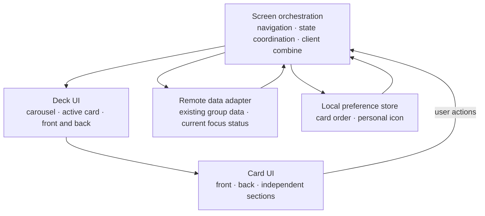
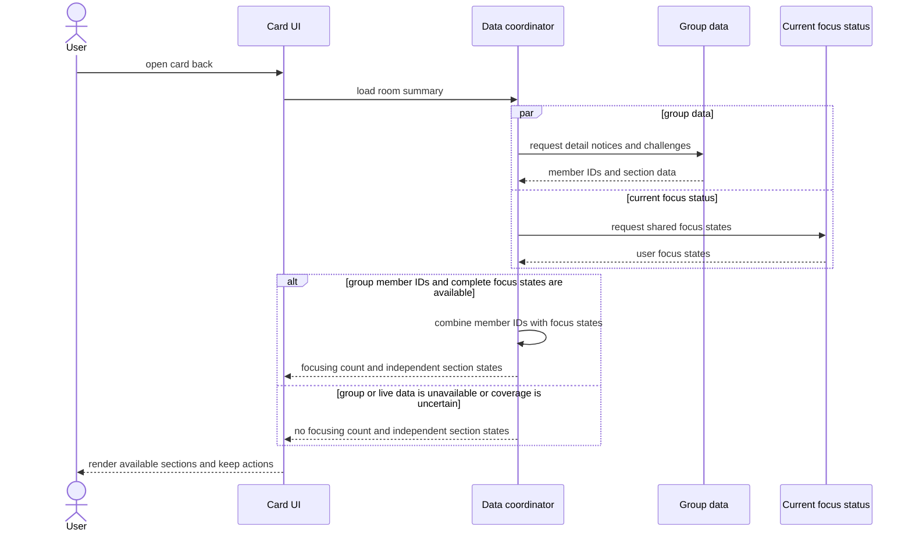
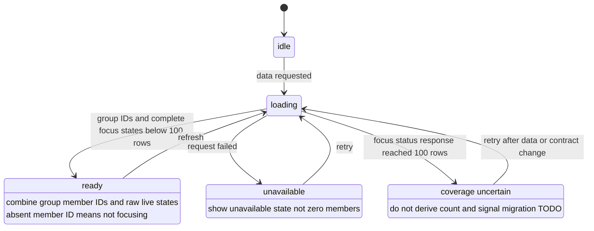
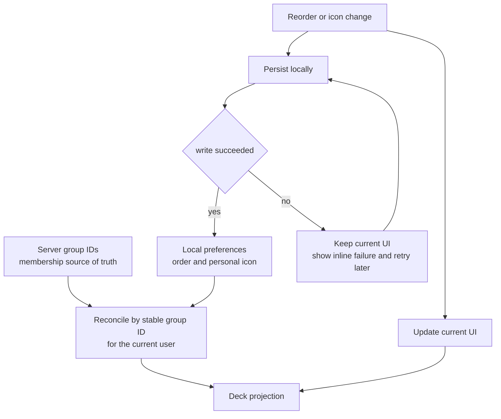

# LLD — 내 그룹 캐러셀·카드 플립 v0.8

| 항목 | 내용 |
| --- | --- |
| 상위 | [HLD.md](./high-level-design.md) · [UX-Design.md](./ux-design.md) |
| 제품 정본 | [design-mockup-flip.html](./design-mockup-flip.html) |
| 공용 목업 모듈 | [design-mockup-shared.js](./design-mockup-shared.js) |
| 범위 | peek 캐러셀 · 카드 플립 · 카드 재정렬·계정별 로컬 순서 · 계정별 로컬 카드 이모지 · 뒷면 요약 · 전체 방 진입/복귀 · 역할별 설정 · 접근성 · 테스트 |
| 상태 | **v0.8 제품 정본 — 앞면 탭은 같은 자리의 카드 플립, 전체 방은 뒷면 CTA route, 카드와 전체 방은 현행 챌린지 목록 계약을 공유** |

> v0.8이 단일 제품 정본이다. 앞면 탭은 같은 자리의 카드 플립, 뒷면 `방 전체 보기`는 전체 `GroupRoom` route 진입으로 고정한다.
>
> 현재 `is_deleted=false AND is_guest=false` 사용자는 100명 미만이다. 이 규모에서 category 없는 top-100 응답을 **전체 사용자 현재 집중 상태 응답**으로 임시 재사용하며, 90명 warning과 100명 도달 전 서버 계약 전환 release gate를 함께 적용한다. 정본의 이동량·시간·크기 값은 구현 시작값이지 사용자 검증으로 확정된 임계값이 아니다.

---

## 1. v0.8 핵심 불변식

1. 목록은 **한 화면에 한 중앙 카드 + 좌우 peek**인 가로 캐러셀이다.
2. 그룹의 신원은 항상 `groupId`다. index는 현재 표시 위치일 뿐이며 재정렬·라우트 복귀·캐시 키로 쓰지 않는다.
3. 앞면의 일반 탭은 **그 카드를 같은 자리에서 뒤집는다.** 전체 방으로 바로 이동하지 않는다.
4. 우상단 공용 `ReorderHandle`에서 시작한 직접 pointer drag만 재정렬을 시작한다. grip 탭은 카드 플립·방 진입·메뉴 열기를 모두 하지 않는다.
5. 뒷면의 집중 영역은 `${n}명 집중 중`만 표시한다. 시간 합계는 표시하지 않는다.
6. 뒷면은 현행 챌린지 목록 응답의 `ACTIVE|INACTIVE` 전건을 서버 최신순 그대로 표시하고, `방 전체 보기`가 전체 `GroupRoom` 라우트의 유일한 진입점이다.
7. 전체 방을 닫으면 **같은 stable `groupId`의 같은 카드 뒷면**으로 돌아온다.
8. 카드 아트 배경은 모든 그룹이 `#5E6AD2` 하나를 쓴다. 이모지는 현재 `userId`가 이 기기에서 보는 개인 카드 설정이며 서버 그룹 필드나 OWNER 전용 설정이 아니다.
9. 트랙 끝 `FindMoreCard`는 항상 마지막이며 재정렬 대상이 아니다. 페이지 수는 `groups.length + 1`이다.
10. 순서는 `GET /groups` 목록과 현재 `userId`의 AsyncStorage `groupId[]`를 reconcile한다. 서버는 멤버십 정본, 로컬 값은 해당 기기의 표시 순서뿐이다.
11. 이모지는 성공한 전체 `GET /groups` 목록과 현재 `userId`의 AsyncStorage map을 reconcile한다. Create/Update/조회 DTO·DB·OpenAPI에는 emoji를 추가하지 않는다.
12. 집중 인원은 기존 그룹 상세 `members[].userId`와 category 없는 `GET /league/me/ranking?date` 원본 응답을 client join한다. `useSessionLeagueMembers`의 12명 slice는 사용하지 않으며, eligible 사용자 100명 미만일 때만 응답 부재를 `false`로 본다.

---

## 2. 치수·peek 캐러셀

화면 폭 `W = useWindowDimensions().width`.

```ts
const SIDE_PEEK = 24;
const CARD_GAP = T.space.md;            // 현재 12
const CARD_W = W - SIDE_PEEK * 2;
const SNAP = CARD_W + CARD_GAP;
const SIDE_INSET = (W - CARD_W) / 2;
const CARD_RADIUS = 22;

const availableH =
  screenH - insets.top - headerH - indicatorH - (insets.bottom + TAB_BAR_SPACE);
const CARD_H = Math.round(availableH * 0.90);
const ART_H = Math.round(CARD_H * 0.52);
```

- `CARD_W`와 `CARD_H`는 레이아웃 값이다. peek 연출 때문에 폭·높이를 애니메이트하지 않는다.
- `SNAP`, 아이템 간격, footer 간격은 같은 상수에서 파생한다.
- 카드 수가 1개여도 `FindMoreCard`가 있어 페이지는 2개다.
- indicator는 고정 pageCount 임계값을 쓰지 않는다. 실제 indicator/container 폭을 측정해 §2.1의 수용 가능 폭 공식으로 dots 또는 `n / pageCount`를 고른다.
- 10개 그룹은 그룹 10장 + 찾기 1장, 총 11페이지다.

```tsx
<Animated.FlatList
  data={visibleGroups}
  horizontal
  keyExtractor={(group) => group.groupId}
  snapToInterval={SNAP}
  decelerationRate="fast"
  disableIntervalMomentum
  showsHorizontalScrollIndicator={false}
  contentContainerStyle={{ paddingHorizontal: SIDE_INSET, gap: CARD_GAP }}
  getItemLayout={(_, index) => ({
    length: SNAP,
    offset: SNAP * index,
    index,
  })}
  renderItem={renderGroupCard}
  ListFooterComponent={<FindMoreCard width={CARD_W} height={CARD_H} />}
/>
```

`FindMoreCard`는 `FlatList.data`에 sentinel로 합성하지 않는다. 마지막 dot은 다음처럼 offset으로 이동한다.

```ts
function goToPage(page: number) {
  if (page < visibleGroups.length) {
    listRef.current?.scrollToIndex({ index: page, animated: true });
    return;
  }
  listRef.current?.scrollToOffset({
    offset: SNAP * visibleGroups.length,
    animated: true,
  });
}
```

### 2.1 responsive `PageIndicator`

indicator가 차지한 실제 폭에서 좌우 20pt gutter를 뺀 값을 dot 사용 가능 폭으로 본다. 각 dot은 시각 원의 크기와 무관하게 44pt hit width를 확보하고, 인접 hit box 사이는 4pt를 둔다.

```tsx
const INDICATOR_GUTTER = 20;
const DOT_HIT_W = 44;
const DOT_GAP = 4;

function requiredDotsWidth(pageCount: number) {
  if (pageCount <= 0) return 0;
  return pageCount * DOT_HIT_W + (pageCount - 1) * DOT_GAP;
}

function PageIndicator({ pageCount, activeIndex, onSelectPage }: Props) {
  const { width: windowWidth } = useWindowDimensions();
  const [measuredWidth, setMeasuredWidth] = useState(0);

  // windowWidth 변화는 상위 레이아웃 재측정을 유발한다. mode 판정은 실제 onLayout 폭을 쓴다.
  const available = Math.max(0, measuredWidth - INDICATOR_GUTTER * 2);
  const required = requiredDotsWidth(pageCount);
  const mode = measuredWidth > 0 && required <= available ? 'dots' : 'counter';

  const onIndicatorLayout = useCallback((event: LayoutChangeEvent) => {
    const nextWidth = event.nativeEvent.layout.width;
    setMeasuredWidth((current) => (current === nextWidth ? current : nextWidth));
  }, [windowWidth]);

  return (
    <View onLayout={onIndicatorLayout} style={styles.indicatorContainer}>
      {mode === 'dots' ? (
        <View style={{ flexDirection: 'row', gap: DOT_GAP, paddingHorizontal: INDICATOR_GUTTER }}>
          {Array.from({ length: pageCount }, (_, page) => (
            <IndicatorDot
              key={page}
              hitWidth={DOT_HIT_W}
              active={page === activeIndex}
              onPress={() => onSelectPage(page)}
            />
          ))}
        </View>
      ) : (
        <Text accessibilityLabel={`${activeIndex + 1} / ${pageCount}`}>
          {activeIndex + 1} / {pageCount}
        </Text>
      )}
    </View>
  );
}
```

- `measuredWidth === 0`인 첫 측정 전에는 overflow가 없는 counter를 렌더한다. 측정 뒤 공간이 충분할 때만 dots로 바꾼다.
- `mode`는 `measuredWidth`와 `pageCount`에서 계산하는 파생값이며 carousel state나 React key로 쓰지 않는다. 폭 변화로 dots↔counter가 바뀌어도 `activeIndex`, 활성 `groupId`, `FlatList` scroll offset, 열린 face와 route 복귀 상태를 유지한다.
- 모드 변경 자체로 `scrollToIndex`/`scrollToOffset`을 호출하거나 페이지 변경 analytics·`aria-live`/RN accessibility announcement를 발생시키지 않는다. announcement는 실제 active page가 바뀔 때만 발생한다.
- 390pt 컨테이너에서는 available 350pt이므로 7페이지 required 332pt는 dots, 8페이지 required 380pt는 counter다. 이는 계산 예시이며 `7`을 코드 상수로 만들지 않는다.

---

## 3. stable ID·계정별 로컬 순서·reconcile

`GET /groups`의 `GroupSummaryResponse[]`는 멤버십과 DTO의 정본이다. AsyncStorage는 표시 순서인 stable `groupId[]`만 저장한다. 순서는 인증 비밀값이 아니므로 현행 로컬 영속 표준인 AsyncStorage를 쓰고 SecureStore를 추가하지 않는다.

### 3.1 storage schema와 계정 격리

`src/types/storage.ts`의 중앙 key 목록에만 아래 항목을 추가한다.

```ts
export const STORAGE_KEYS = {
  // 기존 key 유지
  groupCardOrder: 'gromo:groups:cardOrder:v1',
} as const;

type GroupId = string;
type UserId = string;
type GroupCardOrderByUser = Record<UserId, GroupId[]>;
```

- 통계의 `gromo:stats:cardOrder`처럼 기기 전역 배열을 그대로 복사하지 않는다. 현행 `equipmentV2`·`ownedItemsV2`·`character`처럼 top-level key 하나에 `{ [userId]: value }` bucket을 둔다.
- `userId`는 `useUser()`의 JWT `sub` UUID를 쓴다. `null`이면 공유 `unknown` bucket에 쓰지 않고 서버 순서로만 렌더한다.
- 다른 계정 bucket은 로그아웃에서 지우지 않는다. 같은 기기에서 동일 계정으로 돌아오면 그 계정의 순서만 복원된다.

### 3.2 서버 목록과 로컬 순서 reconcile

```ts
export function reconcileGroupOrder(
  serverIds: readonly GroupId[],
  storedIds: readonly unknown[] | null | undefined,
): GroupId[] {
  const canonical = Array.from(new Set(serverIds));
  const valid = new Set(canonical);
  const seen = new Set<GroupId>();
  const kept: GroupId[] = [];

  for (const value of storedIds ?? []) {
    if (typeof value !== 'string' || !valid.has(value) || seen.has(value)) continue;
    seen.add(value);
    kept.push(value);
  }
  for (const id of canonical) {
    if (!seen.has(id)) kept.push(id); // 신규 그룹은 서버 순서대로 뒤에 append
  }
  return kept;
}
```

hydration은 서버 fetch와 현재 `userId` bucket 읽기가 모두 끝난 뒤 한 번만 화면에 commit한다. 로컬 저장값을 선행 렌더해 탈퇴한 그룹을 노출하지 않는다.

1. 손상된 JSON·map 아닌 값·읽기 실패는 `storedIds = null`로 보고 서버 순서로 fallback한다.
2. 사라진 ID·중복·문자열 아닌 값을 제거한다.
3. 신규 ID는 서버 상대 순서대로 맨 뒤에 붙인다.
4. `FindMoreCard`는 `FlatList.data`·저장 배열에 들어가지 않는다.
5. reconcile 결과가 로컬 값과 다르면 수리된 배열을 해당 bucket에 best-effort로 저장한다.

### 3.3 직렬화 쓰기와 낙관적 이동

계정별 map은 read-modify-write라 연속 drop·계정 전환이 겹치면 다른 bucket을 덮을 수 있다. `CharacterContext`·`EquipmentContext`의 현행 패턴처럼 key 단위 Promise queue로 쓰기를 직렬화한다.

```ts
let groupOrderWrites: Promise<void> = Promise.resolve();

export function persistGroupCardOrder(userId: UserId, ids: readonly GroupId[]): Promise<void> {
  const safeIds = Array.from(new Set(ids));
  const run = groupOrderWrites.then(async () => {
    const raw = await AsyncStorage.getItem(STORAGE_KEYS.groupCardOrder);
    const map = parseGroupOrderMap(raw); // 손상된 전체 map은 {}로 수리
    await AsyncStorage.setItem(
      STORAGE_KEYS.groupCardOrder,
      JSON.stringify({ ...map, [userId]: safeIds }),
    );
  });
  groupOrderWrites = run.catch(() => {}); // 큐는 실패해도 다음 쓰기를 실행
  return run;
}
```

drop과 보조기술 move action은 모두 동일한 commit을 쓴다.

```ts
function commitGroupMove(groupId: GroupId, targetIndex: number) {
  const next = moveStableId(orderedGroupIdsRef.current, groupId, targetIndex);
  if (sameIds(next, orderedGroupIdsRef.current)) return;

  orderedGroupIdsRef.current = next;
  setOrderedGroupIds(next); // optimistic: 즉시 화면 반영
  if (userId) {
    persistGroupCardOrder(userId, next)
      .then(() => setOrderSaveError(false))
      .catch(() => setOrderSaveError(true));
  }
}
```

저장 실패는 현재 세션의 순서를 rollback하지 않는다. `orderSaveError`가 켜지면 캐러셀 상단에 `순서를 저장하지 못했어요. 앱을 다시 열면 이전 순서로 돌아갈 수 있어요.`를 non-blocking inline 상태와 polite live region으로 한 번 전달한다. 다음 저장 성공 시 오류만 조용히 지우고 `저장됨`·`동기화됨` 문구는 노출하지 않는다. 이 순서는 앱 삭제·기기 데이터 초기화 시 소실되고 다른 기기와 동기화되지 않는다.

최종 렌더는 서버 DTO map에서만 객체를 가져온다.

```ts
const groupsById = new Map(groups.map((group) => [group.groupId, group]));
const visibleGroups = orderedGroupIds.flatMap((id) => groupsById.get(id) ?? []);
```

---

## 4. 카드 렌더 트리와 transform 소유권

카드 플립, peek scale, 재정렬 translate가 같은 `transform`을 덮어쓰지 않도록 레이어를 고정한다.

```text
card-shell                 layout · size · flex item · perspective
└─ card-reorder-layer      pointer drag translate · lift
   └─ card-peek-layer      carousel scale · opacity
      └─ card-flipper      front/back rotateY
         ├─ card-front     기본 면
         └─ card-back      정적 rotateY(180deg)
```

| 레이어 | 소유하는 값 | 금지 |
| --- | --- | --- |
| `card-shell` | `width`, `height`, `offset`, `perspective` | scale·drag translate·rotate를 직접 쓰지 않음 |
| `card-reorder-layer` | drag 중 `translate3d(x, y, 0)`, lift z-order | peek scale·rotate 금지 |
| `card-peek-layer` | `scale`, `opacity` | drag translate·rotate 금지 |
| `card-flipper` | `rotateY(0/180deg)` | carousel scale·reorder translate 금지 |
| `card-front` | 앞면 내용·hit target | 재정렬 transform 금지 |
| `card-back` | `rotateY(180deg)`·요약 내용 | 동적 drag/peek transform 금지 |

중간 레이어에는 `transform-style: preserve-3d`를 유지한다. 한 레이어의 inline style로 복합 transform 문자열을 매 프레임 재작성하지 않는다.

```tsx
<View style={styles.cardShell}>
  <Animated.View style={reorderStyle}>
    <Animated.View style={peekStyle}>
      <Animated.View style={flipperStyle}>
        <CardFront />
        <CardBack />
      </Animated.View>
    </Animated.View>
  </Animated.View>
</View>
```

peek 값은 현재 위치로 보간한다.

```ts
const distance = Math.abs(scrollX.value / SNAP - displayIndex);
const scale = interpolate(distance, [0, 1], [1, 0.925], Extrapolation.CLAMP);
const opacity = interpolate(distance, [0, 1], [1, 0.62], Extrapolation.CLAMP);
```

이 수치는 정본 구현의 시작값이다. 실기 프레임 안정성과 식별 가능성을 확인한 뒤 조정할 수 있으며 사용자 검증 결과로 부르지 않는다.

---

## 5. 화면 상태와 제스처 중재

```ts
type GestureState =
  | { kind: 'idle' }
  | { kind: 'carousel-pan'; pointerId: number }
  | {
      kind: 'reorder-drag';
      pointerId: number;
      groupId: GroupId;
      fromIndex: number;
      targetIndex: number;
    }
  | { kind: 'flip-transition'; groupId: GroupId };

type CarouselUiState = {
  activeGroupId: GroupId | null;
  flippedGroupId: GroupId | null;
  gesture: GestureState;
  roomReturn: { groupId: GroupId; face: 'back' } | null;
};
```

### 5.1 우선순위

| 입력 시작점 | 소유자 | 동작 |
| --- | --- | --- |
| `.reorder-handle` pointer down | reorder | pointer capture, carousel pan·flip 차단 |
| 앞면 일반 영역 | carousel/card | 축이 수평이면 carousel, 탭이면 같은 카드 flip |
| 뒷면 버튼 | 해당 버튼 | 뒤집기·집중·설정·전체 방 열기 |
| `FindMoreCard` | find | 찾기 시트 열기 |

### 5.2 재정렬

- grip은 공용 `@/components/reorder/ReorderHandle`을 사용한다. 현행 통계 화면과 동일한 36×36 hit box 안에 `MaterialCommunityIcons name="drag-vertical"` 아이콘을 그린다.
- pointer down 때 `groupId`, 원래 위치, pointer ID를 캡처한다.
- drag 중 target은 **그룹 카드 중심점만** 비교해 계산한다. `FindMoreCard`는 제외한다.
- 가장자리에서 먼 카드로 이동할 수 있도록 캐러셀 auto-scroll을 허용하되, 같은 pointer를 carousel pan이 동시에 소유하지 않는다.
- pointer up에서 `commitGroupMove(groupId, targetIndex)`를 한 번 호출해 낙관적 상태와 best-effort 계정별 저장을 같이 시작하고 reorder transform을 0으로 정리한다.
- pointer cancel은 순서를 commit하지 않고 원위치로 복구한다.
- grip을 누르고 놓기만 하면 아무 시각 메뉴도 열지 않고, 카드 flip·전체 방 진입도 하지 않는다.
- 보이는 `한 칸 앞으로/뒤로` 버튼이나 재정렬 바텀시트는 두지 않는다.
- 키보드·보조기술 이동도 같은 `commitGroupMove`를 호출한다. 이동 결과는 `aria-live`로 알린다.

### 5.2.1 공용 reorder 모듈과 축별 controller

현행 `src/screens/stats/CardOrderEditor.tsx`는 `PanResponder`를 쓴다는 점은 재사용 가치가 있지만 컴포넌트 전체를 그룹 캐러셀에 import할 수는 없다. 통계 구현은 가변 높이 카드의 Y축 위치를 측정하고, 세로 `ScrollView`를 absolute freeze한 뒤 위·아래 auto-scroll하는 controller이기 때문이다. 그룹 캐러셀은 동일 폭 슬롯·X축 중심점·가로 `FlatList`를 사용한다.

안전한 추출 경계:

```text
src/components/reorder/
├── ReorderHandle.tsx        공용 아이콘·hit target·접근성·panHandlers 연결
├── moveStableId.ts          immutable stable-ID 이동
└── index.ts

src/screens/stats/CardOrderEditor.tsx
└── 기존 Y축 측정·freeze·auto-scroll controller + 공용 2개 모듈

src/screens/group/useGroupReorder.ts
└── X축 target·edge scroll·carousel 중재 controller + 공용 2개 모듈
```

```tsx
export interface ReorderHandleProps {
  accessibilityLabel: string;
  testID?: string;
  disabled?: boolean;
  panHandlers?: GestureResponderHandlers;
  accessibilityActions?: AccessibilityActionInfo[];
  onAccessibilityAction?: (event: AccessibilityActionEvent) => void;
}

export function ReorderHandle({
  accessibilityLabel,
  testID,
  disabled = false,
  panHandlers,
  accessibilityActions,
  onAccessibilityAction,
}: ReorderHandleProps) {
  return (
    <View
      testID={testID}
      accessible
      accessibilityRole="button"
      accessibilityLabel={accessibilityLabel}
      accessibilityState={{ disabled }}
      accessibilityActions={disabled ? [] : accessibilityActions}
      onAccessibilityAction={disabled ? undefined : onAccessibilityAction}
      pointerEvents={disabled ? 'none' : 'auto'}
      style={styles.hitTarget}
      {...(disabled ? {} : panHandlers)}
    >
      <MaterialCommunityIcons name="drag-vertical" size={20} color={T.inkSub} />
    </View>
  );
}

const styles = StyleSheet.create({
  hitTarget: {
    width: 36,
    height: 36,
    alignItems: 'center',
    justifyContent: 'center',
  },
});
```

`ReorderHandle`은 좌표·slot·scroll ref를 알지 않는다. `PanResponder` controller는 각 feature가 소유하고 `panHandlers`만 넘긴다. 공용 컴포넌트가 `ScrollView`나 `FlatList`를 감싸지 않으므로 통계 화면의 수직 동작과 그룹 캐러셀의 수평 동작이 서로 결합되지 않는다.

```ts
export function moveStableId<T extends string>(
  ids: readonly T[],
  id: T,
  targetIndex: number,
): T[] {
  const from = ids.indexOf(id);
  if (from < 0 || ids.length < 2) return [...ids];

  const to = Math.max(0, Math.min(targetIndex, ids.length - 1));
  if (from === to) return [...ids];

  const next = [...ids];
  next.splice(from, 1);
  next.splice(to, 0, id);
  return next;
}
```

### 5.3 캐러셀과 flip

- carousel pan이 확정되면 열려 있던 뒷면을 닫고 `flippedGroupId = null`로 만든다.
- 앞면 탭은 탭한 카드의 stable ID를 사용한다. 이웃 peek 카드라면 그 ID로 먼저 스냅하고 **동일 ID 카드**를 뒤집는다.
- flip transition 중 중복 탭을 무시한다.
- 뒷면에서 `Escape` 또는 되돌리기 버튼을 누르면 같은 카드 앞면으로 돌아온다.
- grip 이벤트는 앞면 전체 탭으로 bubble되지 않게 소비한다.

정본 HTML은 pointer와 click을 나누기 위한 내부 이동 기준을 가질 수 있다. 그 값은 브라우저 이벤트 중재용 구현 상수이며, 카드 UX 사용자 검증으로 확정된 제품 임계값이 아니다. RN 구현은 `FlatList`/gesture-handler의 실패·동시 인식 관계로 중재하고 웹의 pixel 값을 복사하지 않는다.

---

## 6. 앞면·아트·개인 카드 이모지

### 6.1 통합 아트

```ts
const GROUP_ART_BACKGROUND = '#5E6AD2';
```

- 모든 카드 앞면 아트와 카드 정체성을 이어받는 헤더는 동일한 `#5E6AD2`를 쓴다.
- `tone`, `toneLight`, `toneDeep`, group ID hash 기반 색상은 API·DTO·view model에 두지 않는다.
- 공개/비밀, 이름, 방장 여부, 인원은 기존 메타 영역에서 구분한다.
- 그룹 간 시각 식별은 현재 계정의 기기 로컬 이모지와 서버 그룹 이름이 담당한다.

### 6.2 로컬 허용 이모지

```ts
export const GROUP_EMOJI_WHITELIST = [
  '🌅', '📚', '💻', '⚡', '🧘', '🎨',
  '🏃', '✍️', '🧠', '🎯', '🌿', '🔥',
] as const;

export type GroupEmoji = (typeof GROUP_EMOJI_WHITELIST)[number];
export const GROUP_EMOJI_FALLBACK: GroupEmoji = '🎯';
```

- 생성 화면의 local draft와 OWNER·MEMBER 공용 `GroupSettings → 내 카드 아이콘` editor가 같은 picker를 재사용한다. 임의 텍스트 입력은 받지 않는다.
- 허용값은 위 12개 **정확한 문자열**뿐이다. 공백 trim이나 grapheme 변환으로 저장값을 보정하지 않는다.
- 선택하지 않은 생성 draft, 신규·가입 그룹, 미설정·손상된 로컬 값은 렌더 단계에서 `🎯`로 fallback한다.
- 이 값은 API request·response에 들어가지 않으며 서버 validation/error code가 없다.

```ts
function normalizeGroupEmoji(input: unknown): GroupEmoji {
  return typeof input === 'string' &&
    (GROUP_EMOJI_WHITELIST as readonly string[]).includes(input)
    ? (input as GroupEmoji)
    : GROUP_EMOJI_FALLBACK;
}
```

허용 목록과 fallback은 앱 단위 테스트로 고정한다.

### 6.3 긴 그룹 이름 clamp

```tsx
type GroupNameVariant = 'cardFront' | 'cardBackHeader' | 'searchRow' | 'listRow';

function GroupNameText({ name, variant, labelOwnedByParent = false }: Props) {
  const numberOfLines = variant === 'cardFront' ? 2 : 1;

  return (
    <Text
      style={styles.groupName} // minWidth: 0, flexShrink: 1
      numberOfLines={numberOfLines}
      ellipsizeMode="tail"
      accessible={!labelOwnedByParent}
      accessibilityLabel={labelOwnedByParent ? undefined : name}
    >
      {name}
    </Text>
  );
}

<Pressable
  accessible
  accessibilityLabel={`${group.name}, 내 카드 아이콘 ${emojiLabel}, ${privacyLabel}, ${
    group.role === 'OWNER' ? '방장, ' : ''
  }${memberLabel}, 방 요약 보기`}
>
  <GroupNameText name={group.name} variant="cardFront" labelOwnedByParent />
</Pressable>
```

- 카드 앞면만 `numberOfLines={2}`를 쓰고 검색 결과·일반 목록행·좁은 카드 뒷면 헤더는 `numberOfLines={1}`을 쓴다. 모두 `ellipsizeMode="tail"`이며 flex row 안에서는 `minWidth: 0`, `flexShrink: 1`로 실제 줄임 공간을 확보한다.
- 시각 Text와 interactive parent가 동시에 같은 이름을 읽지 않게 접근성 소유자는 하나만 둔다. 어느 쪽이 소유하든 `accessibilityLabel`에는 ellipsis가 없는 `group.name` 원문 전체를 넣는다.
- clamp는 view 규칙이다. DTO·검색 결과·navigation params·analytics의 이름을 잘라 저장하거나 가공하지 않는다.

---

## 7. 계정별·기기 로컬 카드 이모지 저장

이모지는 그룹 도메인 데이터가 아니라 카드 presentation preference다. 저장 범위는 `(device, userId, groupId)`이며, 같은 그룹도 계정·기기별로 다른 값을 가질 수 있다.

### 7.1 storage type·parser·projection

`src/types/storage.ts`의 중앙 key 목록에 순서 key와 별도로 추가한다.

```ts
export const STORAGE_KEYS = {
  // 기존 key 유지
  groupCardOrder: 'gromo:groups:cardOrder:v1',
  groupCardEmoji: 'gromo:groups:cardEmoji:v1',
} as const;

type GroupCardEmojiBucket = Record<GroupId, GroupEmoji>;
type GroupCardEmojiByUser = Record<UserId, GroupCardEmojiBucket>;
type ParsedEmojiMap = { value: GroupCardEmojiByUser; needsRepair: boolean };

function isGroupEmoji(value: unknown): value is GroupEmoji {
  return typeof value === 'string' &&
    (GROUP_EMOJI_WHITELIST as readonly string[]).includes(value);
}

function parseGroupCardEmojiMap(raw: string | null): ParsedEmojiMap {
  if (!raw) return { value: {}, needsRepair: false };
  try {
    const source: unknown = JSON.parse(raw);
    if (!source || typeof source !== 'object' || Array.isArray(source)) {
      return { value: {}, needsRepair: true };
    }

    const result: GroupCardEmojiByUser = {};
    let needsRepair = false;
    for (const [userId, bucket] of Object.entries(source)) {
      if (!bucket || typeof bucket !== 'object' || Array.isArray(bucket)) {
        needsRepair = true;
        continue;
      }
      const validEntries = Object.entries(bucket).filter(([, emoji]) => isGroupEmoji(emoji));
      if (validEntries.length !== Object.keys(bucket).length) needsRepair = true;
      result[userId] = Object.fromEntries(validEntries) as GroupCardEmojiBucket;
    }
    return { value: result, needsRepair };
  } catch {
    return { value: {}, needsRepair: true };
  }
}

function emojiForCard(bucket: GroupCardEmojiBucket, groupId: GroupId): GroupEmoji {
  return normalizeGroupEmoji(bucket[groupId]);
}
```

- `userId`는 `useUser()`의 JWT `sub` UUID다. `null`이면 공유 `unknown` bucket을 만들거나 저장하지 않고 `🎯`로만 렌더한다.
- invalid JSON, map이 아닌 top-level, 비객체 bucket, 미허용 값은 읽기 단계에서 제거한다. 정확한 12개 문자열만 유효하다.
- 다른 계정 bucket은 로그아웃 때 지우지 않는다. 동일 계정이 같은 기기에 다시 로그인하면 자기 bucket만 복원한다.
- 저장 map은 sparse해도 된다. 현재 그룹에 key가 없으면 `emojiForCard()`가 `🎯`를 반환한다.

### 7.2 성공한 전체 그룹 목록과 reconcile

서버 groupId 집합은 membership 정본이다. 단, 로컬 stale key를 지우는 reconcile은 **성공한 전체 `GET /groups` 응답**에서만 실행한다.

```ts
export function reconcileGroupCardEmoji(
  serverIds: readonly GroupId[],
  storedBucket: Record<string, unknown> | null | undefined,
): GroupCardEmojiBucket {
  const validIds = new Set(serverIds);
  const next: GroupCardEmojiBucket = {};

  for (const [groupId, emoji] of Object.entries(storedBucket ?? {})) {
    if (validIds.has(groupId) && isGroupEmoji(emoji)) next[groupId] = emoji;
  }
  return next;
}

async function hydrateGroupCardEmoji(args: {
  userId: UserId | null;
  groupsResult: { kind: 'success-full'; groups: GroupSummaryResponse[] } |
    { kind: 'error-or-partial' };
}) {
  if (!args.userId || args.groupsResult.kind !== 'success-full') {
    return { hydrated: false as const }; // prune·repair persist 금지
  }

  return enqueueEmojiOperation(async () => {
    let raw: string | null;
    try {
      raw = await AsyncStorage.getItem(STORAGE_KEYS.groupCardEmoji);
    } catch {
      return { hydrated: true as const, bucket: {} }; // 🎯 fallback, prune/write 금지
    }

    const parsed = parseGroupCardEmojiMap(raw);
    const map = parsed.value;
    const serverIds = args.groupsResult.groups.map((group) => group.groupId);
    const nextBucket = reconcileGroupCardEmoji(serverIds, map[args.userId]);

    if (parsed.needsRepair || !sameEmojiBucket(nextBucket, map[args.userId] ?? {})) {
      try {
        await AsyncStorage.setItem(
          STORAGE_KEYS.groupCardEmoji,
          JSON.stringify({ ...map, [args.userId]: nextBucket }),
        );
      } catch {
        reportEmojiSaveError(); // 수리 실패여도 nextBucket UI는 유지
      }
    }
    return { hydrated: true as const, bucket: nextBucket };
  });
}
```

- 요청 실패, stale cache만 있는 상태, 검색/페이지/필터 결과처럼 부분 목록인 상태에서는 membership 삭제를 판단하지 않는다. 현재 메모리 표시를 유지하고 로컬 bucket도 prune하지 않는다.
- `userId`가 바뀌면 이전 계정의 메모리 bucket을 즉시 비우고 새 계정 read 전에는 `🎯`를 쓴다. 이전 계정 이모지를 한 프레임이라도 재사용하지 않는다.
- 신규 생성·새 가입 그룹은 bucket에 key가 없으므로 `🎯`다. default key를 eager write할 필요가 없다.
- 성공한 전체 목록에서 탈퇴·삭제된 groupId와 invalid 값은 제거하고, 차이가 있을 때만 수리된 현재 user bucket을 best-effort 저장한다.

### 7.3 직렬화 read-modify-write와 낙관적 편집

계정별 map을 한 key에 저장하므로 모든 emoji write는 같은 Promise queue를 사용한다. 매 작업은 queue 안에서 최신 map을 다시 읽어 다른 계정·그룹의 갱신을 보존한다.

```ts
let groupEmojiQueue: Promise<unknown> = Promise.resolve();

function enqueueEmojiOperation<T>(task: () => Promise<T>): Promise<T> {
  const run = groupEmojiQueue.then(task);
  groupEmojiQueue = run.then(() => undefined, () => undefined);
  return run;
}

function enqueueEmojiMapWrite(
  mutate: (latest: GroupCardEmojiByUser) => GroupCardEmojiByUser,
): Promise<void> {
  return enqueueEmojiOperation(async () => {
    const raw = await AsyncStorage.getItem(STORAGE_KEYS.groupCardEmoji);
    const latest = parseGroupCardEmojiMap(raw).value;
    await AsyncStorage.setItem(
      STORAGE_KEYS.groupCardEmoji,
      JSON.stringify(mutate(latest)),
    );
  });
}

function persistGroupCardEmoji(
  userId: UserId,
  groupId: GroupId,
  emoji: GroupEmoji,
): Promise<void> {
  return enqueueEmojiMapWrite((latest) => ({
    ...latest,
    [userId]: { ...latest[userId], [groupId]: emoji },
  }));
}

const pendingEmojiByGroupId = new Map<GroupId, GroupEmoji>();
const emojiWriteInFlight = new Set<GroupId>();

async function attemptPendingCardEmoji(groupId: GroupId) {
  if (!userId || emojiWriteInFlight.has(groupId)) return;
  const snapshot = pendingEmojiByGroupId.get(groupId);
  if (!snapshot) return;
  emojiWriteInFlight.add(groupId);
  try {
    await persistGroupCardEmoji(userId, groupId, snapshot);
    if (pendingEmojiByGroupId.get(groupId) === snapshot) {
      pendingEmojiByGroupId.delete(groupId);
      clearEmojiSaveError(groupId);
    }
  } catch {
    if (pendingEmojiByGroupId.get(groupId) === snapshot) {
      showEmojiSaveErrorOnce(groupId);
    }
  } finally {
    emojiWriteInFlight.delete(groupId);
    // 쓰는 동안 더 최신 선택이 들어왔으면 그 값만 이어서 저장한다.
    if (pendingEmojiByGroupId.has(groupId)
        && pendingEmojiByGroupId.get(groupId) !== snapshot) {
      void attemptPendingCardEmoji(groupId);
    }
  }
}

function commitCardEmoji(groupId: GroupId, emoji: GroupEmoji) {
  if (!userId || !isGroupEmoji(emoji)) return;
  setEmojiBucket((current) => ({ ...current, [groupId]: emoji })); // optimistic
  pendingEmojiByGroupId.set(groupId, emoji); // 같은 그룹의 최신값이 이전 실패값을 대체
  void attemptPendingCardEmoji(groupId);
}

// GroupScreen focus/foreground에서 호출한다. 실패한 최신값만 재시도한다.
function retryPendingCardEmojis() {
  for (const groupId of pendingEmojiByGroupId.keys()) {
    void attemptPendingCardEmoji(groupId);
  }
}
```

- write 실패에도 현재 세션의 선택을 rollback하지 않는다. 해당 editor에 `내 카드 아이콘을 저장하지 못했어요. 앱을 다시 열면 이전 아이콘으로 돌아갈 수 있어요.`를 inline + polite live region으로 한 번 표시한다.
- 최신 실패값은 메모리 `pendingEmojiByGroupId`에 유지한다. 다음 아이콘 변경 또는 그룹 화면 활성화 때 같은 직렬화 queue로 최신 pending 값만 재시도하고, 성공하면 pending과 오류 상태만 조용히 해제한다. 성공 toast, `저장됨`, `동기화됨` 문구는 없다.
- 앱 재시작은 마지막 성공 write를 복원한다. 타 기기·재설치·앱 데이터 초기화에는 동기화하거나 복구하지 않는다.
- 순서 key와 emoji key는 서로 다른 queue를 가져도 되지만, 각 key 내부 RMW는 반드시 직렬화한다.

### 7.4 생성 local draft와 설정 route

```ts
async function submitCreateGroup() {
  const draftEmoji = selectedEmoji; // picker local state, 기본 🎯
  const created = await createGroup({
    name: trimmedName,
    description: trimmedDescription,
    maxMembers,
    isPrivate,
    // emoji 없음: CreateGroupRequest 현행 body 그대로
  });

  commitCardEmoji(created.groupId, draftEmoji);
}
```

- 생성 취소·POST 실패에는 draft를 저장하지 않는다. POST 성공으로 실제 groupId를 받은 뒤에만 현재 계정 bucket에 연결한다.
- 로컬 persist 실패는 생성 성공을 취소하지 않는다. 생성 직후 카드에는 draft를 유지하고 그룹 목록의 해당 카드 인접 inline + polite live region으로 같은 오류를 보여 준다. toast는 쓰지 않는다.
- `GroupSettings({ groupId })`는 OWNER·MEMBER 모두에게 `내 카드 아이콘` 행을 보여 주고 `GroupCardEmojiEdit({ groupId })`를 연다. editor는 공용 picker와 `이 기기에서 나에게만 보여요` 안내를 사용한다.
- `GroupProfileEdit`에는 emoji 선택·base·diff·PATCH가 없다. 그룹 생성/수정 API와 서버 role은 이 개인 설정에 관여하지 않는다.

### 7.5 서버·DB 비영향 계약

- `CreateGroupRequest`, `UpdateGroupRequest`, `GroupSummaryResponse`, `GroupDetailResponse`, `GroupSearchResponse`, `GroupOverviewResponse`에는 emoji 필드를 추가하지 않는다.
- 아이콘과 집중 인원을 위해 백엔드 `Group`, controller/service/DTO mapping, DB `groups` 테이블과 Flyway migration을 변경하지 않는다.
- OpenAPI enum/schema나 `INVALID_GROUP_EMOJI` 오류를 추가하지 않는다. 앱 allowlist와 fallback만 단위 테스트한다.
- 그룹 상세 `members[]`에도 `isFocusing`을 추가하지 않는다. §8에서 기존 category 없는 `/league/me/ranking?date`의 원본 `isFocusing` 행과 client join하므로 이 기능의 서버 변경은 **0건**이다.

---

## 8. 카드 뒷면 요약 계약

카드 뒷면을 처음 열 때 해당 `groupId`의 현행 상세·공지·챌린지 API를 lazy load한다. 동시에 GroupScreen이 소유한 **화면 공유 현재 집중 상태 데이터**를 보장하되, date cache와 in-flight promise를 공유해 여러 카드의 뒷면을 열어도 refresh cycle당 한 번만 요청한다. 카드 전용 endpoint/DTO는 추가하지 않는다.

### 8.1 기존 그룹 상세·공지·챌린지 + 전체 사용자 현재 집중 상태 응답 조합

그룹 상세 DTO는 현재 형태를 그대로 유지한다. 멤버십은 `GroupDetailMemberResponse.userId`, 실시간 여부는 기존 `LeagueMemberResponse.isFocusing`에서 가져온다.

```ts
type GroupCardBackViewModel = {
  focusingMemberCount: number;
  latestNotice: GroupAnnouncementResponse | null;
  memberCount: { current: number; max: number };
  memberPreview: GroupDetailMemberResponse[];
  challenges: GroupChallengeResponse[];
};

type CompleteFocusStatusIndex = ReadonlyMap<string, boolean>;

function toCompleteFocusStatusIndex(
  rows: readonly LeagueMemberResponse[],
): CompleteFocusStatusIndex {
  return new Map(rows.map((row) => [row.userId, row.isFocusing === true]));
}

function countFocusingMembers(
  members: readonly GroupDetailMemberResponse[],
  focusStatusByUserId: CompleteFocusStatusIndex,
): number {
  return members.reduce(
    (count, member) => count + (focusStatusByUserId.get(member.userId) === true ? 1 : 0),
    0,
  );
}

function toMemberPreview(
  members: readonly GroupDetailMemberResponse[],
  myUserId: string,
) {
  const me = members.find((member) => member.userId === myUserId);
  const others = members.filter((member) => member.userId !== myUserId);
  return [...(me ? [me] : []), ...others].slice(0, 5);
}
```

| 영역 | 기존 응답 투영 규칙 |
| --- | --- |
| 집중 중 | complete 현재 집중 상태 index와 `detail.members[].userId`를 join; `isFocusing === true` 수만 `${n}명 집중 중`으로 표시 |
| 공지 | 기존 `createdAt DESC` announcements 배열의 `[0] ?? null`; 공지 1개만 표시 |
| 멤버 | `detail.members.length / detail.maxMembers`, preview 최대 5명. 나를 먼저, 나머지는 응답 상대 순서 유지 |
| 챌린지 | `getChallenges(groupId, date)` 응답 전건을 서버 순서 그대로 compact 투영 |

- 현재 집중 상태 데이터의 실제 원천은 `GET /api/v1/league/me/ranking?date=YYYY-MM-DD`다. `category`를 보내지 않아 `is_deleted=false AND is_guest=false` 전역 주간 상위 100명을 받고, 기존 `LeagueMemberResponse.isFocusing`을 사용한다.
- 경로·서비스·DTO 이름에 `league`가 남는 이유는 기존 소스 `services/leagueApi.ts`, `getMyRanking`, `LeagueMemberResponse`를 그대로 재사용하기 때문이다. **그룹 화면에 리그 UI나 리그 기능을 추가하는 것이 아니며, `isFocusing`만 현재 집중 상태로 재사용한다.**
- 현재 eligible 사용자가 100명 미만이므로 원본 응답은 전원을 포함한다. 이 complete 조건에서만 응답에 없는 그룹 멤버 ID를 `false`로 본다. 요청 loading/error나 100행 coverage-unknown 상태에서는 부재를 false로 바꾸거나 `0명`을 표시하지 않는다.
- `useSessionLeagueMembers`는 본인 제외·핀 우선 처리와 `.slice(0, 12)`를 적용하므로 재사용하지 않는다. 전용 `useGroupFocusStatus`가 `getMyRanking()`의 원본 배열을 그대로 보존한다.
- `GET /api/v1/league/ranking`은 `isFocusing`을 유효하게 채우지 않으므로 이 용도에 쓰지 않는다. 실제 경로 이름과 무관하게 반드시 `/league/me/ranking`의 category 없는 응답에서 `isFocusing`만 사용한다.
- 그룹 상세 `members[]`에 `isFocusing`을 추가하거나 backend `FocusLiveInfoLookup`·`@JsonProperty` mapping을 변경하지 않는다. 새 endpoint·DB·migration·OpenAPI 변경도 없다.
- 팀 집중시간 합계, 개인별 경과 시간, 별도 집중 인원 필드는 DTO와 UI에 추가하지 않는다.
- 공지 empty(`[]`)와 요청 error를 구분한다. member preview를 위해 `joinedAt`이나 별도 정렬 필드를 추가하지 않는다.
- `GroupRoom`은 진입 시 기존 상세·공지·챌린지 API를 현행대로 다시 조회한다. 카드 화면 cache나 view model을 route param/도메인 정본으로 승격하지 않는다.

### 8.2 현재 챌린지 — 구현된 목록 계약 재사용

현행 코드 근거:

| 위치 | 현재 계약 |
| --- | --- |
| `app/src/types/dto/group.ts` | `GroupChallengeStatus = 'ACTIVE' | 'INACTIVE'`, `GroupChallengeResponse`에 미션 종류·카테고리·목표분·시간대·`memberProgress`가 있음 |
| `app/src/services/groupApi.ts` | `getChallenges(groupId, date?)`가 `GET /groups/{id}/challenges`의 배열을 가공·정렬 없이 반환 |
| `app/src/screens/group/GroupRoomScreen.tsx` | `getChallenges(groupId, date)`를 상세·공지와 `Promise.allSettled`로 병렬 조회하고 목록을 렌더 |
| `back/src/main/java/com/oneorthree/phone/group/repository/GroupChallengeRepository.java` | soft-delete 제외 후 `OrderByCreatedAtDesc` |
| `app/src/screens/group/components/challengeLabel.ts` | `missionLabel`과 `categoryLabel`이 구현된 챌린지 문구의 공용 정본 |

카드용 별도 챌린지 endpoint를 추가하지 않는다. 카드 UI에 맞춘 compact view model만 만들며 항목을 선택·제거·재정렬하지 않는다.

```http
GET /api/v1/groups/{groupId}/challenges?date=YYYY-MM-DD
```

```ts
export interface CompactChallengeRow {
  challenge: GroupChallengeResponse;
  label: string;
}

export function toCompactChallengeRows(
  challenges: readonly GroupChallengeResponse[],
): CompactChallengeRow[] {
  return challenges.map((challenge) => ({
    challenge,
    label: missionLabel(challenge) ?? categoryLabel(challenge),
  }));
}
```

- `date`는 `todayStr()`로 전달한다. 생략하면 현행 서버가 `memberProgress = null`을 반환하므로 진행률을 그릴 카드·전체 방에서는 생략하지 않는다.
- 서버가 `createdAt DESC`로 반환하므로 앱은 `ACTIVE|INACTIVE` 전건을 필터·정렬하지 않는다.
- 백엔드 enum에 예정 상태가 없으므로 가까운 예정 항목을 합성하지 않는다. 시작/종료 시각 tie-break로 한 건을 선택하지도 않는다. `INACTIVE`도 전체 방의 현행 목록과 똑같이 남긴다.
- compact row의 제목은 `missionLabel(challenge) ?? categoryLabel(challenge)`다. 응답에 없는 `아침 호흡 14일`, 연속일, 임의 title을 만들지 않는다.
- 응답이 복수이면 모두 표시한다. 카드 높이 안에서 스크롤이 필요하면 **챌린지 목록 내부 스크롤을 새로 중첩하지 않고**, 카드의 기존 콘텐츠 스크롤/높이 정책에서 처리한다.
- `GroupChallengeList`는 배열 신원·상태·순서와 empty/error 문구를 공유한다. `variant="compact"`는 위 projection을, `variant="full"`은 기존 `ChallengeCard` 전건 `map`을 사용한다.
- `GroupRoomScreen`은 오늘 응답 전건을 현행대로 렌더한다. 어제 조회 결과는 챌린지 결과 모달 계산 전용이며 오늘 목록에 합치지 않는다.

### 8.3 독립 로딩·캐시

```ts
async function loadCardBack(groupId: string, date: string) {
  // GroupScreen-level query: 같은 date 요청/응답은 모든 카드가 공유한다.
  void ensureGroupFocusStatus(date);

  const [detail, announcements, challenges] = await Promise.allSettled([
    getGroupDetail(groupId, date),
    getAnnouncements(groupId),
    getChallenges(groupId, date),
  ]);

  commitDetail(`${groupId}:${date}`, detail);
  commitAnnouncements(groupId, announcements);
  commitChallenges(`${groupId}:${date}`, challenges);
}
```

`services/leagueApi.ts`는 기존 호출자를 깨지 않게 date만 optional로 받을 수 있다. 서버 request/response는 바뀌지 않는다.

```ts
export async function getMyRanking(
  category?: OccupationCategory,
  date = todayStr(),
): Promise<LeagueMemberResponse[]> {
  const { data } = await api.get<LeagueMemberResponse[]>('/api/v1/league/me/ranking', {
    params: { category, date },
  });
  return data; // 원본 최대 100행: filter/sort/slice 금지
}
```

전용 query/hook의 최소 상태는 다음과 같다.

```ts
type GroupFocusStatusState =
  | { status: 'idle' | 'loading' }
  | { status: 'ready'; rows: LeagueMemberResponse[]; focusStatusByUserId: CompleteFocusStatusIndex }
  | { status: 'stale'; rows: LeagueMemberResponse[]; focusStatusByUserId: CompleteFocusStatusIndex }
  | { status: 'error' }
  | { status: 'coverage-unknown'; rowCount: number };

// query key: ['group-focus-status', userId, date]
// GroupScreen에 한 번 mount하며 ready cache와 in-flight promise를 카드 전체가 공유한다.
async function fetchGroupFocusStatus(date: string): Promise<GroupFocusStatusState> {
  const rows = await getMyRanking(undefined, date);
  if (rows.length >= 100) {
    reportGroupFocusStatusCoverageUnknown(rows.length);
    return { status: 'coverage-unknown', rowCount: rows.length };
  }
  if (rows.length >= 90) reportGroupFocusStatusCapacityWarning(rows.length);
  return { status: 'ready', rows, focusStatusByUserId: toCompleteFocusStatusIndex(rows) };
}
```

- detail·challenges cache key는 `groupId + date`, announcements key는 `groupId`, **화면 공유 현재 집중 상태 데이터** key는 `userId + date`다. 인증 계정이 바뀌면 이전 현재 집중 상태 cache를 폐기한다.
- `useGroupFocusStatus`는 GroupScreen에서 한 번만 mount한다. 같은 key가 loading이면 기존 promise를 반환하고 ready면 원본 배열을 반환하므로 여러 카드의 뒷면을 빠르게 열어도 현재 집중 상태 요청 1건으로 합쳐진다.
- 카드 뒷면을 처음 열 때 각 미수신 섹션에 skeleton을 표시한다. 상세·공지·챌린지는 독립 상태이고, 집중 count만 detail과 complete 현재 집중 상태 데이터를 함께 기다린다. 현재 집중 상태 데이터가 loading이면 집중 영역에 skeleton과 접근성 문구 `집중 현황 불러오는 중`을 사용한다.
- 같은 key 재진입은 ready cache를 먼저 그리고 background refresh할 수 있다.
- 요청 도중 카드가 바뀌어도 응답은 stable `groupId` 캐시에만 쓴다. 현재 index 카드에 덮어쓰지 않는다.
- 실패한 섹션에만 `불러오지 못했어요 · 다시 시도`를 표시하고 이전 그룹의 데이터를 재사용하지 않는다. 현재 집중 상태 최초 조회가 실패하면 집중 영역만 `집중 현황을 불러오지 못했어요 · 다시 시도`를 표시하며 `0명`으로 대체하지 않는다. retry는 화면 공유 요청 한 건만 다시 호출한다.
- 날짜 변경은 새 date key를 사용한다. foreground·집중 시작/종료·pull-to-refresh에서는 **화면 공유 현재 집중 상태 데이터**를 한 번 invalidate/refetch하고, detail/challenges와 공지는 기존 규칙대로 갱신한다. refresh 실패에 이전 complete 현재 집중 상태 데이터가 있으면 `stale`로 유지할 수 있다.

### 8.4 top-100 임시 전제와 전환 TODO

현재 집중 상태의 실제 원천 endpoint 내부 query는 `users.is_deleted=false AND users.is_guest=false` 전원을 주간 집중시간순으로 정렬하고 `LIMIT 100`을 적용한다. 현재 eligible 사용자가 100명 미만이므로 `rows.length < 100`이면 **전체 사용자 현재 집중 상태 응답**이 완전하고, 이때만 `focusStatusByUserId`에 없는 그룹 멤버를 `false`로 처리한다.

| 신호 | 현재 동작 | 운영 조치 |
| --- | --- | --- |
| 0~89행 | count 표시 | 현행 client join 유지 |
| 90~99행 | count 표시 | warning/Sentry breadcrumb·대시보드 경고, 서버 전환 작업 즉시 착수 |
| 100행 | coverage unknown으로 count 미산출, `집중 현황을 확인할 수 없어요` | telemetry/TODO 신호 확인; release gate에 따라 전환 계약 배포 |
| eligible 사용자 수 100명 도달 전 | 기존 방식 유지 | top-100 join을 대체할 서버 계약을 배포하는 release gate 통과 |

- 운영 대시보드에서 eligible 사용자 수와 앱의 raw response 길이를 함께 관측한다. response 100행은 실제 총원이 100인지 그 이상인지 구분할 수 없으므로 coverage-unknown telemetry를 남기고 count를 미산출한다. 앱 전체 기능을 강제로 끄는 런타임 feature flag까지 요구하지는 않는다.
- **100명 도달 전 TODO:** (1) 그룹 상세 `members[]` 현재 집중 여부 필드, (2) group member userId를 받는 batch 현재 집중 상태 endpoint, (3) `isFocusing`이 포함된 pagination 중 하나를 선택한다. 전환 뒤 `useGroupFocusStatus` top-100 join과 absent=false 가정을 제거한다.
- 이 TODO가 남아 있어도 현재 출시는 서버 변경 없이 가능하다. 다만 eligible 사용자 100명 도달 전에는 대체 계약을 배포한다는 release gate를 운영 체크리스트에 둔다.

---

## 9. 전체 방 route와 같은 카드 뒷면 복귀

앞면에는 전체 방 navigation이 없다. 뒷면 `방 전체 보기`만 다음을 호출한다.

```ts
function openFullRoom(groupId: GroupId) {
  roomReturnRef.current = { groupId, face: 'back' };
  navigation.navigate('GroupRoom', {
    groupId,
    challengeId: undefined,
  });
}
```

`GroupRoom`은 기존 root stack route를 사용한다. 진입 후 현행 detail·announcements·오늘/어제 challenges 조회를 다시 수행하고 오늘 응답 전건을 기존 `ChallengeCard`로 `map`한다. 카드 cache에서 챌린지를 route param으로 넘기거나 단일 항목을 고정하지 않는다. close/back은 `navigation.goBack()` 하나로 통일한다.

목록 화면이 다시 focus될 때:

1. `roomReturn.groupId`가 최신 그룹 목록에 존재하는지 확인한다.
2. 현재 `orderedGroupIds`에서 그 ID의 새 위치를 찾는다.
3. `scrollToIndex`로 그 카드를 중앙에 놓는다.
4. `activeGroupId`와 `flippedGroupId`를 같은 ID로 복원한다.
5. flip 완료 뒤 뒷면의 `방 전체 보기` 또는 뒤집기 버튼으로 focus를 돌린다.

재정렬 전후 index가 달라도 ID로 복원하므로 다른 카드로 돌아가지 않는다. 방 안에서 탈퇴·삭제되어 ID가 사라졌다면 뒷면 복원을 취소하고 가장 가까운 유효 카드 앞면 또는 빈 상태로 간다.

목록 screen이 stack 아래에서 계속 mount된 정상 복귀도 같은 불변식을 따른다. process 복원까지 보장해야 하면 `roomReturn`을 navigation state에 직렬화하되, index가 아닌 `{ groupId, face: 'back' }`만 저장한다.

---

## 10. 역할별 설정 — 현행 허브 재사용

카드 뒷면과 전체 방의 `⋯`는 동일한 현행 root stack 화면을 연다.

```ts
navigation.navigate('GroupSettings', { groupId });
```

| 역할 | 노출 항목 |
| --- | --- |
| `OWNER` | `내 카드 아이콘`, `그룹 프로필 설정하기`, `방장 넘기기`, `멤버 관리`, `공지 권한`, `그룹 나가기` |
| `MEMBER` | `내 카드 아이콘`, `그룹 나가기` |

- `내 카드 아이콘`은 역할 공용 행이다. `GroupCardEmojiEdit({ groupId })`에서 12개 picker와 `이 기기에서 나에게만 보여요`를 보여 주고 AsyncStorage만 바꾼다.
- `그룹 프로필 설정하기`는 기존 서버 그룹 정보만 다루며 emoji를 포함하지 않는다.
- 멤버에게 owner 전용 행을 disabled 상태로 보여 주지 않는다.
- 프로필은 `GroupProfileEdit`, 위임은 `GroupOwnerTransfer(source:'settings')`, 멤버 관리는 `GroupMemberManage`, 공지 권한은 `GroupNoticePermission` 라우트를 그대로 사용한다.
- `그룹 나가기`는 `withdrawGroup()` → `DELETE /groups/{id}/members/me`를 사용하고 확인 Alert를 거친다.
- OWNER의 나가기가 `HOST_WITHDRAW`이면 현행처럼 `GroupOwnerTransfer(source:'withdraw')`로 보내 위임 후 나가게 한다.
- 설정 화면에서 돌아오면 열었던 `groupId`의 설정 버튼으로 focus를 돌리고, role은 현행 화면의 focus 재조회 결과를 따른다.

---

## 11. 접근성·Reduce Motion

### 11.1 카드와 grip

```tsx
<Pressable
  accessibilityRole="button"
  accessibilityLabel={`${group.name}, ${privacyLabel}, ${
    group.role === 'OWNER' ? '방장, ' : ''
  }${group.currentMembers}/${group.maxMembers}명, ${position + 1}번째 총 ${pageCount}개`}
  accessibilityHint="두 번 탭하면 이 카드의 방 요약을 봅니다"
  onPress={() => flipSameCard(group.groupId)}
/>

<ReorderHandle
  accessibilityLabel={`${group.name} 카드 드래그 순서 변경, 현재 ${position + 1}/${groupCount}`}
  panHandlers={panResponder.panHandlers}
  accessibilityActions={[
    { name: 'decrement', label: '앞으로 이동' },
    { name: 'increment', label: '뒤로 이동' },
  ]}
  onAccessibilityAction={handleAccessibleReorder}
/>
```

- grip에는 `aria-haspopup`/popup 의미를 주지 않는다.
- grip 탭은 no-op이고 drag와 접근성 action만 순서를 바꾼다.
- grip hit box는 현행 통계 화면과 같은 36×36이다. 44pt 권장치보다 작으므로 접근성 충족을 주장하지 않고, 실기 미탭률과 보조기술 custom action을 별도 검증한다.
- inactive 카드의 앞·뒷면 및 버튼은 tab order에서 제외한다.
- flip 상태에 따라 반대 면은 `inert`/`aria-hidden` 처리한다.
- 이동 완료, flip 완료, 방에서 복귀는 `aria-live="polite"`로 stable 그룹 이름과 새 상태를 알린다.
- 화면에 1·2줄로 잘린 그룹 이름도 카드·검색/목록행의 접근성 label과 이동/flip/복귀 announcement에서는 `group.name` 원문 전체를 읽는다.
- dots는 중복 위치 안내를 만들지 않도록 접근성 트리에서 숨긴다.

### 11.2 Reduce Motion

| 동작 | 기본 | Reduce Motion |
| --- | --- | --- |
| peek | scale + opacity | scale 1 고정, opacity만 완화 |
| flip | `rotateY(0→180deg)` | 앞·뒷면 짧은 cross-fade |
| reorder drop | 위치 전환 애니메이션 허용 | 즉시 새 순서에 배치 |
| 전체 방 | route 전환 | 시스템 reduce-motion 전환 또는 fade |

Reduce Motion에서도 pointer drag 중 카드는 손가락/포인터를 따라야 한다. 제거하는 것은 장식적 회전·spring·layout 이동이며 직접 조작 피드백은 제거하지 않는다.

---

## 12. 테스트 계획

### 12.1 필수 교차 매트릭스

| 그룹 수 | 캐러셀·인디케이터 | reorder | flip·전체 방 복귀 | emoji | 역할 |
| --- | --- | --- | --- | --- | --- |
| 1 | 그룹 1 + 찾기 1, 320pt 이상에서 dots 2, 첫/끝 중앙 정렬 | 유효 target이 없어 no-op, 찾기 카드는 이동 안 함 | 앞면 탭→같은 카드 back→전체 방→같은 ID back | 미설정 `🎯`, 같은 계정·기기 재실행 복원 | OWNER/MEMBER 모두 `내 카드 아이콘` 확인 |
| 5 | 총 6페이지. 320pt는 `n / 6`, 390pt 이상은 dots 6 | 첫↔중간↔끝 drag, 재실행 복원, pointer cancel rollback, grip tap no-op | 이동한 카드도 stable ID로 flip·복귀 | local 변경 성공/실패, userId bucket 격리, whitelist·fallback | OWNER 관리 4행+나가기+로컬 행, MEMBER 나가기+로컬 행 |
| 10 | 총 11페이지. 320/390/430pt는 `n / 11`, 768pt는 dots 11, 마지막 offset | edge auto-scroll로 먼 위치 이동, find footer 고정 | 재정렬 뒤 route 왕복해도 같은 ID back | whitelist 12개 전부 렌더, 타기기·재설치 미동기 | owner/member가 섞여도 공용 로컬 행과 role 전용 행 분리 |

### 12.2 indicator 폭 경계 테스트

좌우 gutter를 뺀 available과 `required = pageCount × 44 + (pageCount - 1) × 4`를 동일 단위(pt)로 비교한다.

| measured width | available | 마지막 dots 케이스 | 첫 counter 케이스 | 확인 |
| ---: | ---: | ---: | ---: | --- |
| 320 | 280 | 5페이지 = 236 | 6페이지 = 284 | 5는 dots, 6은 `n / total` |
| 390 | 350 | 7페이지 = 332 | 8페이지 = 380 | 7/8 경계는 이 폭의 계산 결과일 뿐 고정 임계가 아님 |
| 430 | 390 | 8페이지 = 380 | 9페이지 = 428 | 8은 dots, 9는 `n / total` |
| 768 | 728 | 15페이지 = 716 | 16페이지 = 764 | 제품 최대 11페이지(524)는 dots; 순수 컴포넌트는 15/16 경계도 검증 |

320→390→430→768 및 역방향 resize/회전에서 같은 active page를 유지한다. 모드가 바뀌는 경계에서도 active `groupId`, `activeIndex`, scroll offset, 열린 face, route 복귀 ref가 그대로이고 페이지 변경 analytics와 접근성 announcement가 추가로 발생하지 않는지 검증한다.

### 12.3 단위·계약 테스트

| 영역 | 필수 케이스 |
| --- | --- |
| transform | shell/reorder/peek/flipper 각각 transform 소유; drag update가 scale·rotate를 덮지 않음 |
| gesture | grip pointer가 carousel/flip을 시작하지 않음; grip tap no-op; carousel 시작 시 열린 flip 종료; pointer cancel reorder 미반영 |
| reorder 공용화 | 통계·그룹 모두 `ReorderHandle`/`moveStableId` 사용, 아이콘은 `drag-vertical`, Y/X controller는 분리 |
| stable ID | 재정렬·재조회·route 복귀 뒤 동일 `groupId`; index 변경으로 다른 그룹 요약이 붙지 않음 |
| order storage | A/B 계정 bucket 격리, 저장 없음, 재실행 복원, 신규 append, 사라진·중복·비문자열·FindMore 제거, 수리 persist, 손상/read 실패 서버 fallback |
| order write | 연속 drop·보조기술 move의 최종 순서 직렬화, 쓰기 실패에도 세션 UI 유지·inline 실패 상태 1회·성공 문구 없음, 앱 삭제/데이터 초기화 소실, 타기기 미동기 |
| emoji parser/reconcile | 정확한 allowlist 12개, 미설정·null·공백 포함·unknown fallback `🎯`, invalid JSON/map/bucket/value 제거, 성공한 전체 GET에서만 stale groupId prune, 실패·부분 목록 무삭제 |
| emoji account/device | A/B 계정 bucket 격리·전환 중 이전 계정 값 무노출, 같은 계정·기기 재실행 복원, 로그아웃 후 복귀, 타기기·재설치·앱 데이터 초기화 미동기 |
| emoji write | 그룹/계정이 다른 연속 선택의 serialized RMW 최종값, 낙관적 UI 유지, 쓰기 실패 inline polite 1회·성공 toast 없음, 다음 성공 시 오류만 해제 |
| emoji create | picker 기본 `🎯`·local draft, POST body에 emoji 없음, 성공 groupId에만 persist, 취소/POST 실패 무저장, persist 실패에도 그룹·현재 UI 유지, 가입 그룹 default |
| emoji server 비영향 | Create/Update/Summary/Detail/Search/Overview emoji 없음, Group/DB migration/OpenAPI/error code 변경 없음, MEMBER도 서버 요청 없이 로컬 편집 |
| 서버 무변경 | 그룹 상세 `members[]`·Group DTO/service·`FocusLiveInfoLookup`·DB/migration·OpenAPI 모두 변경 없음, 새 endpoint 없음, 기존 4개 read API만 사용 |
| 전체 사용자 현재 집중 상태 응답 | `getMyRanking(undefined, date)` category 미전달·원본 순서/100행 보존, `useSessionLeagueMembers`의 본인 제외·핀 우선·12명 slice 결과 미사용, 같은 userId/date에서 여러 카드 뒷면을 열어도 in-flight 1건 |
| 현재 집중 상태 결합 | detail `members[].userId`와 원본 응답 `userId` join, `isFocusing === true`만 count, complete(<100) 데이터의 absent=false, 요청 loading/error/coverage-unknown은 0명 아닌 독립 loading/error, stale complete cache 정책 |
| 규모 게이트 | 89행 정상, 90·99행 warning, 100행 coverage-unknown telemetry·count 미산출, eligible 사용자 100명 도달 전 release gate, warning 중복 억제, 전환 TODO 존재 |
| 카드 뒷면 데이터 | 카드 뒷면을 처음 열 때 기존 detail·announcements·challenges 병렬 호출 + 화면 공유 현재 집중 상태 요청, 집중 중 0/N명만 표시, 시간 합계 필드 없음, 챌린지 0/1/복수 및 ACTIVE/INACTIVE 혼합 전건·서버 최신순, 공지 최신 1개, 네 dependency 부분 실패 독립 처리 |
| role | 공용 `내 카드 아이콘`은 OWNER/MEMBER 모두, OWNER 관리 4개+나가기, MEMBER는 그 밖에 나가기만, OWNER 나가기 `HOST_WITHDRAW`→위임 후 나가기 |
| 접근성 | 면별 inert, 36×36 grip 미탭 위험, grip label/accessible actions, reorder·flip·복귀 live announcement, Reduce Motion cross-fade |
| footer | 모든 그룹 수에서 찾기 카드 정확히 1개·항상 마지막·재정렬 제외 |
| responsive indicator | 320/390/430/768pt 공식 경계, 첫 측정 전 counter, onLayout/회전 재계산, mode 전환 시 activeIndex/groupId/offset/announcement 무변경 |
| 긴 그룹 이름 | 긴 한글은 앞면 2줄·검색/목록행/좁은 뒷면 1줄, 공백 없는 영문과 연속·ZWJ 이모지도 tail ellipsis·레이아웃 비침범, 접근성 label/announcement는 원문 전체 |

실기 QA는 iOS/Android, 작은 화면/큰 글자, 긴 한글·공백 없는 영문·연속/ZWJ 이모지 이름, VoiceOver/TalkBack, Reduce Motion, 빠른 연속 입력, drag 중 앱 background/취소를 포함한다. 정본 HTML의 특정 pixel 임계값을 그대로 성공 기준으로 고정하지 않고, 오탭·오드래그와 조작 가능성을 관찰해 gesture 설정을 조정한다.

---

## 13. 구현 스켈레톤

```tsx
function GroupScreen({ groups, didLoadFullGroups, onCreate, onFind, onOpenRoom }: Props) {
  const { userId } = useUser();
  const date = todayStr();
  const { orderedGroupIds, orderHydrated, commitGroupMove } = useGroupReorder({
    groups,
    userId,
  });
  const { emojiBucket, emojiHydrated } = useGroupCardEmoji({
    groups,
    userId,
    canReconcile: didLoadFullGroups,
  });
  const cardBackData = useGroupCardBackData();
  // 한 screen instance가 state·raw rows·in-flight promise를 소유한다.
  // mount 시점은 idle이고 ensure(date)에서만 네트워크를 시작한다.
  const focusStatus = useGroupFocusStatus({ userId, date });
  const roomReturnRef = useRef<{ groupId: GroupId; face: 'back' } | null>(null);

  const groupsById = useMemo(
    () => new Map(groups.map((group) => [group.groupId, group])),
    [groups],
  );
  const visibleGroups = orderedGroupIds.flatMap((id) => groupsById.get(id) ?? []);

  const ensureCardBack = (groupId: GroupId) => {
    void cardBackData.ensure(groupId, date); // detail·announcements·challenges 병렬
    void focusStatus.ensure(date); // 동일 userId+date ready/in-flight 공유
  };

  const openFullRoom = (groupId: GroupId) => {
    roomReturnRef.current = { groupId, face: 'back' };
    onOpenRoom(groupId);
  };

  if (!orderHydrated || !emojiHydrated) return <GroupCarouselSkeleton />;

  return (
    <GroupCarousel
      groups={visibleGroups}
      emojiForGroup={(groupId) => emojiForCard(emojiBucket, groupId)}
      backStateByGroupId={cardBackData.stateByGroupId}
      focusStatus={focusStatus.state}
      onBackOpen={ensureCardBack}
      onReorder={commitGroupMove}
      onCreate={onCreate}
      onFind={onFind}
      onOpenRoom={openFullRoom}
    />
  );
}

function GroupCarousel({
  groups,
  emojiForGroup,
  backStateByGroupId,
  focusStatus,
  onBackOpen,
  onReorder,
  onCreate,
  onFind,
  onOpenRoom,
}: GroupCarouselProps) {
  const [flippedGroupId, setFlippedGroupId] = useState<GroupId | null>(null);

  const flipSameCard = (groupId: GroupId) => {
    if (gestureRef.current.kind !== 'idle') return;
    setFlippedGroupId((current) => {
      const next = current === groupId ? null : groupId;
      if (next !== null) onBackOpen(groupId);
      return next;
    });
  };

  return (
    <View testID="group.list">
      <CarouselHeader onCreate={onCreate} onFind={onFind} />
      <PeekCarousel
        groups={groups}
        emojiForGroup={emojiForGroup}
        backStateByGroupId={backStateByGroupId}
        focusStatus={focusStatus} // 모든 카드가 같은 read-only 현재 집중 상태를 참조
        flippedGroupId={flippedGroupId}
        onFlip={flipSameCard}
        onReorder={onReorder}
        onOpenRoom={onOpenRoom}
        footer={<FindMoreCard onPress={onFind} />}
      />
    </View>
  );
}
```

컴포넌트 경계는 `GroupCardShell`, `GroupCardReorderLayer`, `GroupCardPeekLayer`, `GroupCardFlipper`, `GroupCardFront`, `GroupCardBack`, `GroupChallengeList`, `FindMoreCard`, `PageIndicator`로 나눈다. grip은 공용 `ReorderHandle`, 배열 이동은 공용 `moveStableId`를 사용한다. `useGroupReorder`/`groupCardOrderStore`는 순서를, `useGroupCardEmoji`/`groupCardEmojiStore`는 성공한 전체 목록 기준의 개인 이모지 hydrate·reconcile·낙관적 표시·직렬화 RMW를 소유한다. `useGroupFocusStatus`는 GroupScreen 단일 인스턴스에서 전체 사용자 현재 집중 상태 응답·in-flight·coverage 상태를 소유하고 카드에는 read-only state만 전달한다. 각 레이어가 자기 transform과 접근성 상태만 소유하게 해 flip·reorder·carousel 변경이 서로의 style을 덮지 않도록 한다.

---

## 14. 구현 다이어그램 정본

이 절은 앞 절의 타입·상태·폴백 계약을 실행 순서로 압축한 구현 지도다. Mermaid가 텍스트 계약을 대체하지 않으며, 세부 타입과 오류 문구는 위 절을 정본으로 한다.

### 14.1 책임 구조



- `GroupScreen`은 네트워크 cache·계정별 로컬 저장소·route callback을 소유한다. `GroupCarousel`은 현재 표시 위치·face·gesture만 소유하고, 카드는 서버나 AsyncStorage를 직접 호출하지 않는다.
- `GroupCardBack`은 detail·announcements·challenges·화면 공유 현재 집중 상태를 각각 받는다. 집중 인원만 detail과 complete 현재 집중 상태 데이터 둘 다가 필요하고, 나머지 섹션과 CTA는 이 데이터의 실패에 종속되지 않는다.

### 14.2 카드 뒷면 데이터 흐름



- 현재 집중 상태 호출은 카드별이 아니라 `userId + date` query cycle별 1건이다. 동일 key의 ready cache와 in-flight promise를 공유하므로 여러 카드의 뒷면을 연속으로 열어도 요청이 증폭되지 않는다.
- 이 흐름은 기존 API 4개만 쓴다. 그룹 상세 `members[]`에 `isFocusing`을 추가하지 않고, 새 card-summary·batch endpoint·DB·migration·OpenAPI 변경도 없다.

### 14.3 현재 집중 상태 데이터 가용 상태



- `ready`에서만 `CompleteFocusStatusIndex`를 만들고 `detail.members[].userId`와 join한다. 이 때 `isFocusing === true`만 세며, 성공한 complete 현재 집중 상태 데이터에 없는 ID는 `false`다.
- `loading`·`error`·`coverage-unknown`은 `0명 집중 중`이 아니다. 각각 skeleton·재시도 오류·coverage 불명 상태를 드러내며, 100행은 telemetry와 서버 계약 전환 TODO 신호로 사용한다.
- `useSessionLeagueMembers`는 본인 제외·핀 우선·`slice(0, 12)` 결과이므로 이 상태 머신에 연결하지 않는다. `getMyRanking(undefined, date)` 원본만 입력으로 받는다.

### 14.4 로컬 선호 저장 흐름



- hydrate의 prune·repair는 **성공한 전체 `GET /groups`**에서만 실행한다. 목록 실패·부분 응답은 탈퇴로 오인해 order·emoji key를 지우지 않는다.
- order와 emoji는 각각 `gromo:groups:cardOrder:v1`, `gromo:groups:cardEmoji:v1`의 현재 `userId` bucket만 직렬화 RMW한다. 저장 실패는 현재 실행 UI를 rollback하지 않고 마지막 정상 저장값도 훼손하지 않는다.
- 순서·아이콘은 둘 다 기기 로컬 표시 설정이다. 서버 order·emoji 필드를 추가하지 않고, 다른 계정 bucket과 다른 기기로 전파하지 않는다.
