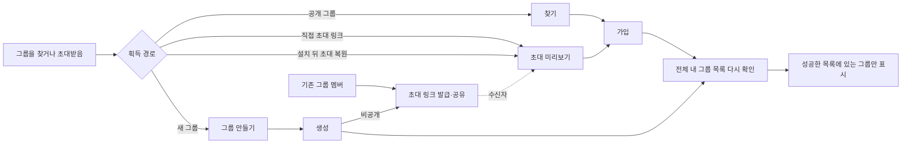
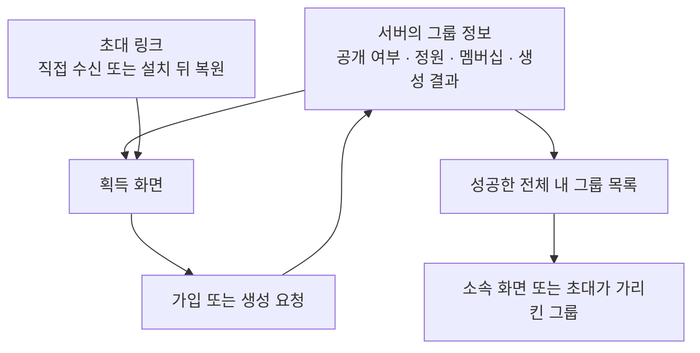
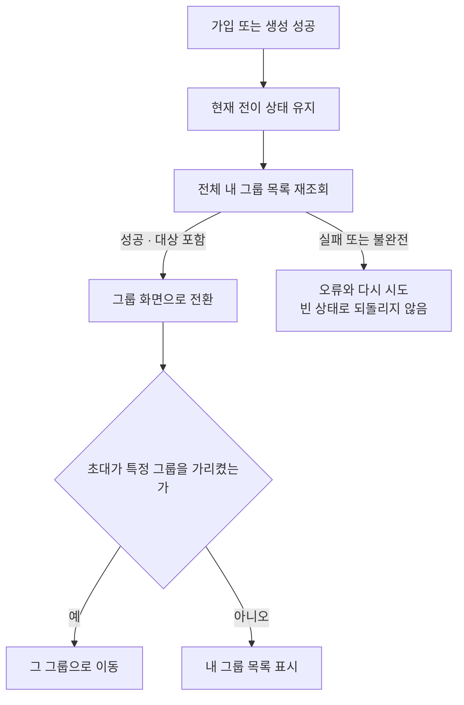

# HLD — 그룹 획득

| 항목      | 내용                                                                         |
| --------- | ---------------------------------------------------------------------------- |
| 시작      | [구현 착수 카드](./README.md)                                                |
| 상위 정본 | [그룹 PRD](../../prd.md) · [그룹 IA](../../information-architecture.md)      |
| 범위      | 찾기·초대·가입·생성·생성 뒤 초대·성공 뒤 목록 확정                           |
| 비범위    | 그룹 안 활동, 카드 덱, 권한 관리, 탈퇴                                       |
| 구현 상태 | [공통 상태 정본](../../shared/implementation-status.md)의 `GRP-01`을 따른다. |

## 1. 사용자 약속과 책임 경계

- 찾기는 공개 그룹만 대상으로 한다. 비공개 그룹의 현재 UI 기본 획득 경로는 초대 링크다. 다만 서버 `joinGroup`은 아직 `isPrivate` 또는 유효한 `inviteSlug`를 가입 조건으로 강제하지 않으므로, 링크 수신자만 참여한다는 보안·멤버십 보장은 미구현이다.
- 현재 생성·프로필 화면의 `초대 링크를 받은 사람만`·`초대 링크로만 참여` 문구는 서버 보장보다 강하다. 서버 강제 전에는 `검색에 표시되지 않으며 링크로 공유할 수 있음`까지만 안내한다.
- 초대는 특정 그룹의 미리보기 뒤에 참여를 결정하는 흐름이며, 로그인 전 도착한 초대는 로그인 뒤 이어질 수 있다.
- 현재 멤버는 기존 그룹에서도 초대 링크를 발급·복사·공유할 수 있다. 공유 성공 여부가 기존 멤버십을 바꾸지는 않는다.
- 생성은 그룹 생성과 챌린지 생성을 분리한다. 비공개 그룹은 생성 뒤 서버가 발급한 링크를 공유한다.
- 가입·생성 성공만으로 화면 소속을 추정하지 않고, 성공한 전체 목록 재조회 뒤 다음 화면을 정한다.

## 2. 정보 원천과 경계

- 공개 검색 결과는 참여 가능한 후보를 보여 주며, 이미 참여한 그룹은 다시 가입시키지 않고 기존 그룹으로 이동한다.
- 초대 미리보기는 참여 전에도 볼 수 있는 공개 개요를 사용한다. 이미 멤버·정원 마감·사라진 그룹은 각각 다른 상태로 안내한다.
- 가입 상한, 정원, 이미 멤버 여부는 서버가 최종 판단한다.
- 가입 가능한 그룹은 `deletedAt=null`이고 상태가 `WAITING|ACTIVE`인 그룹이다. 서버는 공개·비공개, 검색·링크·직접 요청 모두에서 새 멤버십 생성 또는 LEFT 행 재활성화 전에 이 조건을 확인한다. `ENDED`·삭제 그룹은 `NOT_FOUND`로 끝내고 멤버십·`group_joined`를 만들지 않는다.
- 이미 활성 멤버의 재접근은 새 가입 mutation이 아니다. 기존 `ALREADY_MEMBER` 응답과 해당 그룹 방 이동을 유지하며 `group_joined`를 다시 발행하지 않는다.
- 비공개 그룹의 링크 수신자 검증은 서버가 최종 판단해야 하나 현재는 미구현이다. 이 한계는 UI의 공개 검색 제외와 별개다.
- 초대 링크의 클릭 기록이나 분석 실패는 링크 열기와 참여 가능 여부를 막지 않는다.
- 초대 가입은 기존 `JoinGroupRequest.appInstanceId`를 best-effort로 전달한다. 검색 가입은 아직 전달하지 않으며 `GRP-01` 후속 앱 작업에서 같은 계약으로 맞춘다. 앱은 식별자 조회를 먼저 끝내고 `group_join_attempted(result_track)`와 가입 API를 바로 이어 실행한다. 값이 있으면 서버 GA4와 S-LOG에, 없으면 S-LOG에만 성공 결과를 남기며 분석 식별자 조회 실패가 가입을 막지 않는다.
- cold direct·deferred 초대는 전체 목록의 0개 확정을 기다리지 않는다. 열린 F3 episode가 없을 때 `result_track=ga4`인 실제 가입 API 시도만 `invite_intent` fallback을 열며, preview 노출·로그인 대기·`s_log_only` 시도는 분모를 만들지 않는다. 구체 귀속·dedupe는 [공통 분석 계약 §4](../../shared/analytics.md#4-공통-퍼널과-귀속)를 따른다.

### 2.1 구형 초대 링크 전환

| 그룹·링크                            | 서버 강제 이후 계약                                                          |
| ------------------------------------ | ---------------------------------------------------------------------------- |
| 공개 그룹 + slug 없는 구형 링크      | 가입 가능한 그룹에서 정원·멤버십 조건으로 허용. slug attribution은 없음      |
| 공개 그룹 + 현재 slug 링크           | 가입 가능한 그룹에서 허용하고 유효한 slug만 attribution에 사용               |
| 비공개 그룹 + 현재 유효한 slug       | 가입 가능한 그룹·그룹 일치·미폐기·발급자 활성 멤버십을 모두 확인할 때만 허용 |
| 비공개 그룹 + 누락·무효·타 그룹 slug | 폐기 또는 발급자 이탈까지 같은 일반 오류로 거절하고 멤버십을 만들지 않음     |

- `gromo://join?g={groupId}` 파싱은 공개 그룹과 사용자 안내를 위해 유지하지만, 구형 링크 자체를 비공개 가입 credential로 보지 않는다. 이미 멤버라면 새 가입 없이 기존 방으로 이동한다.
- 전환 순서는 **invite-only 과장 문구 완화 → 모든 신규 공유를 slug 형식으로 검증 → slug 생성·해석과 구형 링크 안내가 있는 앱을 최소 지원 버전으로 지정 → 기존 비공개 그룹에서 새 링크 재발급·재공유 가능 확인 → 서버 강제**다.
- 서버 강제 뒤 구형 비공개 링크는 자동 승격하거나 grace 가입시키지 않는다. `이전 형식의 링크예요. 비공개 그룹에 참여하려면 새 초대 링크를 받아주세요.`라고 안내하며, 구버전 앱의 직접 요청도 서버가 같은 일반 오류로 막는다.
- 실제 최소 지원 버전과 강제 전환 시각은 배포 티켓에 기록한다. 이 두 값과 재발급 경로가 확정되기 전에는 invite-only 출시 gate를 완료하지 않는다.

링크 수명은 다음처럼 고정한다.

| 전이                       | 링크 결과                                                       |
| -------------------------- | --------------------------------------------------------------- |
| 활성 멤버의 최초 발급      | 새 active slug 발급. 반복 발급은 같은 active 링크를 재사용      |
| 발급자 탈퇴·강퇴·계정 탈퇴 | 해당 그룹에서 발급한 active 링크를 멤버십 전이와 함께 논리 폐기 |
| 발급자 재가입 뒤 발급      | 폐기된 slug는 부활하지 않고 새 버전의 slug 발급                 |
| OWNER 위임 뒤 멤버십 유지  | 발급자가 여전히 활성 멤버이므로 링크 유지                       |
| 그룹 종료                  | 그룹의 모든 링크를 만료로 취급                                  |

- landing·설치 뒤 match·claim·비공개 가입은 **활성 그룹 + active link + 발급자 `isLeft=false` 멤버십**을 같은 validator로 확인한다. 미리보기 성공 뒤에도 가입 commit 직전에 다시 확인해 이탈과의 경합을 막는다.
- 링크와 기존 click·claim 감사 행은 hard delete하지 않는다. 폐기 전 완료된 claim은 감사 이력으로 남기되 폐기 뒤 새 claim은 사용자에게 상태를 노출하지 않는 no-op이고 어떤 클릭에도 사용자를 붙이지 않는다. 폐기 시각을 보존하고, 한 `(groupId, inviterId)`에는 active 버전만 하나가 되도록 migration한 뒤 새 발급은 별도 버전으로 만든다.

## 3. 성공 뒤의 화면 경계

- 초대 참여는 실제로 가입된 그룹을 목적지로 사용한다. 새 초대가 도착해도 먼저 성공한 가입의 목적지를 바꾸지 않는다.
- 생성·검색 가입·초대 가입 뒤 재조회 실패는 다시 만들기·찾기 빈 상태로 위장하지 않는다.
- 실제 가입 2xx의 `{targetGroupId, resultTrack}`을 목록 재조회까지 보존한다. `s_log_only` 요청의 성공한 전체 목록에 대상이 포함되면 `group_membership_reconciled(cause=join)`을 요청당 1회 발행해 열린 F3를 `unattributed`로 닫는다. `ALREADY_MEMBER`·목록 실패·대상 미포함은 발행하지 않는다.
- 이 기능은 새 그룹 서버 도메인이나 카드 전용 데이터를 추가하지 않는다.
