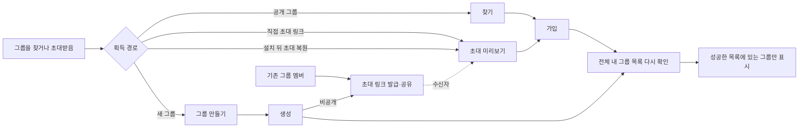
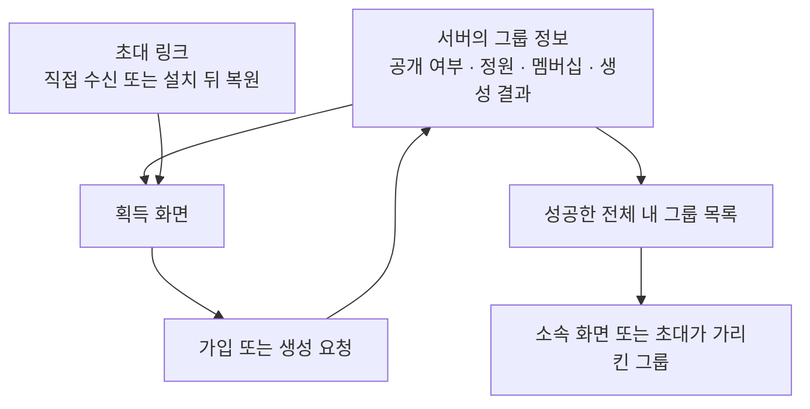
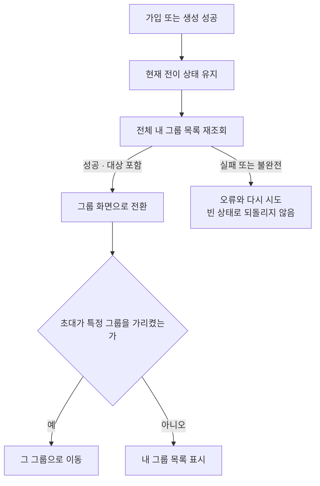

# HLD — 그룹 획득

| 항목      | 내용                                                                                  |
| --------- | ------------------------------------------------------------------------------------- |
| 상위 정본 | [그룹 PRD](../../prd.md) · [그룹 IA](../../information-architecture.md)                                     |
| 범위      | 찾기·초대·가입·생성·생성 뒤 초대·성공 뒤 목록 확정                                    |
| 비범위    | 그룹 안 활동, 카드 덱, 권한 관리, 탈퇴                                                |
| 구현 상태 | **✅ 주요 흐름 구현됨** — 공개 찾기·직접/복원 초대·생성·가입·목록 재확인·대상 방 이동 |

## 1. 사용자 약속과 책임 경계

- 찾기는 공개 그룹만 대상으로 한다. 비공개 그룹은 초대 링크를 받은 사람만 참여할 수 있다.
- 초대는 특정 그룹의 미리보기 뒤에 참여를 결정하는 흐름이며, 로그인 전 도착한 초대는 로그인 뒤 이어질 수 있다.
- 현재 멤버는 기존 그룹에서도 초대 링크를 발급·복사·공유할 수 있다. 공유 성공 여부가 기존 멤버십을 바꾸지는 않는다.
- 생성은 그룹 생성과 챌린지 생성을 분리한다. 비공개 그룹은 생성 뒤 서버가 발급한 링크를 공유한다.
- 가입·생성 성공만으로 화면 소속을 추정하지 않고, 성공한 전체 목록 재조회 뒤 다음 화면을 정한다.

## 2. 정보 원천과 경계

- 공개 검색 결과는 참여 가능한 후보를 보여 주며, 이미 참여한 그룹은 다시 가입시키지 않고 기존 그룹으로 이동한다.
- 초대 미리보기는 참여 전에도 볼 수 있는 공개 개요를 사용한다. 이미 멤버·정원 마감·사라진 그룹은 각각 다른 상태로 안내한다.
- 가입 상한, 정원, 이미 멤버 여부는 서버가 최종 판단한다.
- 초대 링크의 클릭 기록이나 분석 실패는 링크 열기와 참여 가능 여부를 막지 않는다.

## 3. 성공 뒤의 화면 경계

- 초대 참여는 실제로 가입된 그룹을 목적지로 사용한다. 새 초대가 도착해도 먼저 성공한 가입의 목적지를 바꾸지 않는다.
- 생성·검색 가입·초대 가입 뒤 재조회 실패는 다시 만들기·찾기 빈 상태로 위장하지 않는다.
- 이 기능은 새 그룹 서버 도메인이나 카드 전용 데이터를 추가하지 않는다.
