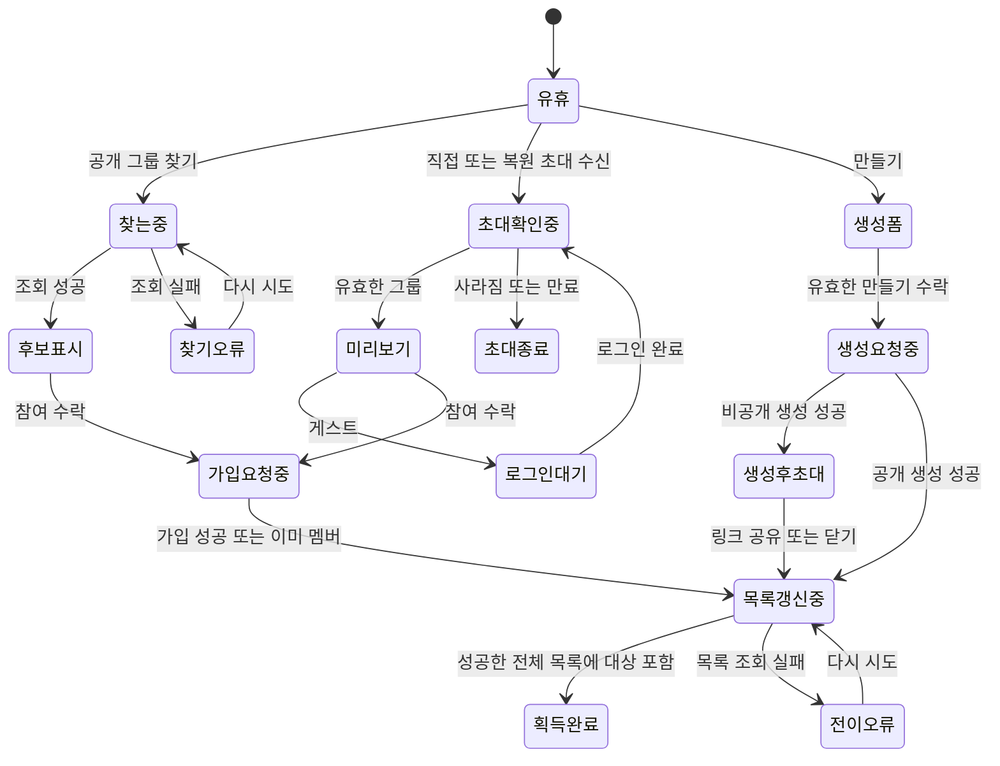
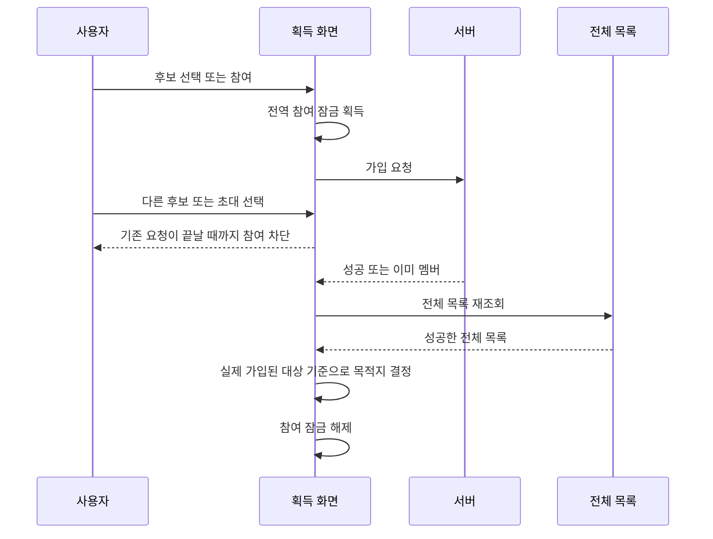

# LLD — 그룹 획득

| 항목      | 내용                                                                                   |
| --------- | -------------------------------------------------------------------------------------- |
| 상위 정본 | [그룹 획득 HLD](./high-level-design.md) · [그룹 PRD](../../prd.md)                                   |
| 역할      | 획득 흐름의 상태·경쟁·멱등성·오류·검증 기준                                            |
| 구현 상태 | **🟡 일부 구현** — 주요 흐름은 구현됨; 생성 submit의 같은 순간 이중 실행 잠금은 미구현 |

## 1. 상태 전이

- 빈 결과와 조회 실패는 다른 상태다.
- 가입 또는 생성 요청 중에는 같은 획득 요청을 다시 시작하지 않는다.
- 비공개 생성의 링크 공유 실패는 그룹 생성 성공을 되돌리거나 생성 요청을 반복하지 않는다.
- 기존 그룹의 링크 발급은 같은 멤버·그룹 조합의 서버 결과를 재사용하며, 중복 탭이 여러 링크나 멤버십 변경을 만들지 않는다.

## 2. 경쟁과 멱등성

- 검색 요청은 검색어가 바뀌거나 화면이 닫히면 이전 응답을 폐기한다. 늦은 결과가 현재 검색어를 덮지 않는다.
- 참여 잠금은 검색과 초대가 공유한다. 한 요청의 중복 탭과 두 화면의 동시 가입을 막는다.
- 초대 참여 중 다른 링크가 도착해도, 성공 콜백은 요청을 시작한 그룹을 사용한다.
- 목록 재조회는 최신 요청만 화면에 반영한다. 계정 전환·화면 이탈 뒤 응답은 반영하지 않는다.

## 3. 오류와 복구

| 상황                          | 사용자 상태                        | 복구 원칙                           |
| ----------------------------- | ---------------------------------- | ----------------------------------- |
| 검색 실패                     | 결과 없음과 구분한 오류            | 같은 검색어로 다시 시도             |
| 초대 대상 없음                | 사라진 그룹 안내                   | 참여 요청 없음                      |
| 초대 대상 정원 마감           | 참여 비활성                        | 최신 초대 개요를 다시 확인          |
| 게스트 초대                   | 로그인 유도                        | 초대 맥락을 보존하고 로그인 뒤 재개 |
| 가입 제한·정원 초과           | 인라인 안내와 참여 잠금            | 서버 판단을 유지, 임의 재시도 없음  |
| 생성 실패                     | 폼 입력 유지                       | 수정 또는 다시 제출                 |
| 가입·생성 뒤 목록 재조회 실패 | 전이 오류와 다시 시도              | 빈 상태·중복 생성으로 되돌리지 않음 |
| 링크 발급·공유 실패           | 생성은 유지, 링크 관련 오류만 표시 | 생성 요청을 반복하지 않음           |

## 4. 검증 gate

1. 공개 검색에는 비공개·종료·참여 불가 후보를 참여 가능한 것처럼 표시하지 않는다.
2. 직접 초대와 설치 뒤 복원 초대 모두 미리보기→참여→전체 목록 재조회로 합류한다.
3. 게스트는 초대 맥락을 잃지 않고 로그인 뒤 같은 초대 흐름으로 돌아온다.
4. 가입·생성 성공 뒤 목록 갱신 실패가 빈 상태나 중복 가입·중복 생성으로 이어지지 않는다.
5. 빠른 검색어 변경, 두 초대 수신, 중복 탭, 계정 전환, 화면 이탈에서 늦은 응답이 현재 화면이나 목적지를 바꾸지 않는다.
6. 비공개 생성 뒤 링크 발급·공유 실패가 이미 성공한 생성을 취소하거나 다시 보내지 않는다.
