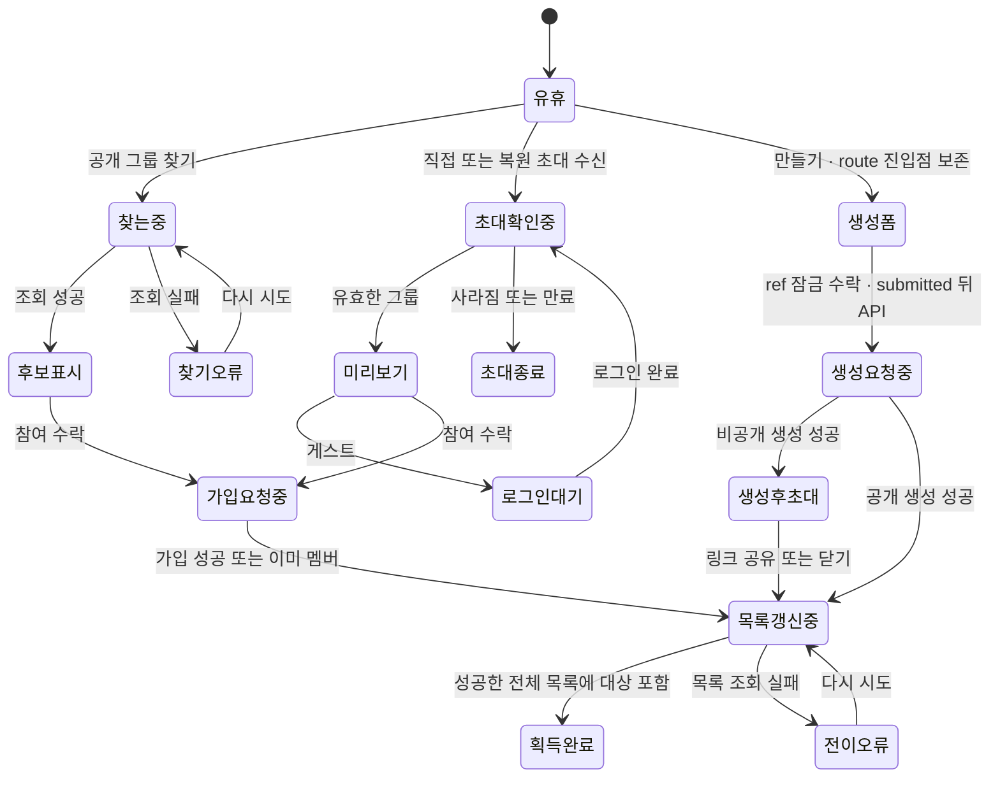
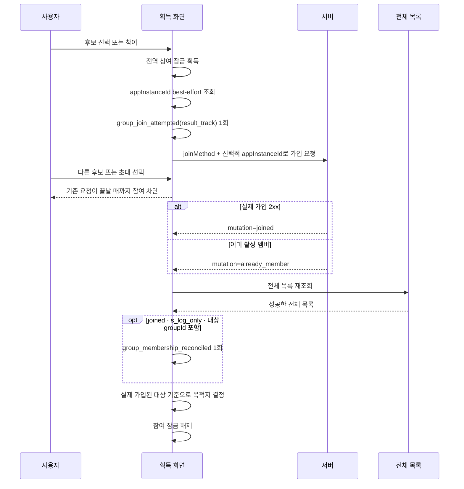
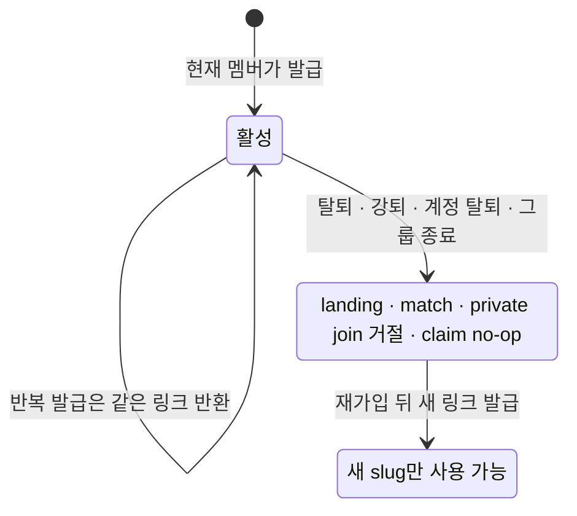

# LLD — 그룹 획득

| 항목      | 내용                                                                         |
| --------- | ---------------------------------------------------------------------------- |
| 시작      | [구현 착수 카드](./README.md)                                                |
| 상위 정본 | [그룹 획득 HLD](./high-level-design.md) · [그룹 PRD](../../prd.md)           |
| 역할      | 획득 흐름의 상태·경쟁·멱등성·오류·검증 기준                                  |
| 구현 상태 | [공통 상태 정본](../../shared/implementation-status.md)의 `GRP-01`을 따른다. |

## 1. 상태 전이

- 빈 결과와 조회 실패는 다른 상태다.
- 가입 또는 생성 요청 중에는 같은 획득 요청을 다시 시작하지 않는다.
- 생성 폼은 route가 전달한 `entryPoint=empty|list|header`를 한 진입 동안 보존하고 폼 표시 성공 때 started를 한 번 발행한다. 현재 목록 수나 비동기 재조회 결과로 진입점을 다시 추론하지 않는다.
- submit handler는 state를 보기 전에 `submittingRef.current`를 검사하고, 수락 즉시 ref를 선점한다. 유효성 검사·disabled·ref lock에서 거절된 호출은 submitted·API·created 모두 0건이다.
- 수락된 호출은 생성 API 직전에 submitted를 한 번 발행하고, API 2xx를 받은 직후 created를 한 번 발행한 다음 비공개 링크·목록 전이로 간다. API 실패 뒤 새 수락은 새 submitted가 되지만, 링크 공유·목록 재조회 실패는 이미 발생한 created를 재발행하지 않는다.
- 비공개 생성의 링크 공유 실패는 그룹 생성 성공을 되돌리거나 생성 요청을 반복하지 않는다.
- 기존 그룹의 링크 발급은 같은 멤버·그룹 조합의 서버 결과를 재사용하며, 중복 탭이 여러 링크나 멤버십 변경을 만들지 않는다.
- 비공개 그룹은 UI에서 공개 검색으로 노출하지 않고 초대 링크를 기본 획득 경로로 쓴다. 그러나 현재 서버는 `joinGroup` 요청의 `inviteSlug`·`isPrivate`를 가입 허가 조건으로 검증하지 않으므로, 링크 수신자만 가입한다는 강제는 별도 서버 작업이다.

## 2. 경쟁과 멱등성

- 검색 요청은 검색어가 바뀌거나 화면이 닫히면 이전 응답을 폐기한다. 늦은 결과가 현재 검색어를 덮지 않는다.
- 위 그림은 `GRP-01` 목표 계약이다. 현재 구현은 초대 화면이 시도 이벤트 뒤 식별자를 조회하고 검색은 식별자를 전달하지 않는다. 목표 계약에서는 두 경로를 모두 **식별자 조회 완료 → `result_track=ga4|s_log_only` 시도 이벤트 → 즉시 가입 API 호출** 순서로 변경한다. 값이 없거나 조회가 실패해도 요청을 계속하며, 이때 서버 구조화 로그만 성공 정본으로 남는다.
- 참여 잠금은 검색과 초대가 공유한다. 한 요청의 중복 탭과 두 화면의 동시 가입을 막는다.
- 초대 참여 중 다른 링크가 도착해도, 성공 콜백은 요청을 시작한 그룹을 사용한다.
- 목록 재조회는 최신 요청만 화면에 반영한다. 계정 전환·화면 이탈 뒤 응답은 반영하지 않는다.
- 가입 요청은 `{targetGroupId, mutation, resultTrack}`을 목록 확인까지 보존한다. `mutation=joined`·`s_log_only`이고 성공한 전체 목록에 target이 있을 때만 `group_membership_reconciled(cause=join)`을 요청당 1회 발행한다. `already_member`·목록 실패·부분 응답·target 미포함·늦은 세대는 발행하지 않는다.
- cold direct·deferred는 목록 0개 확정을 기다리지 않는다. 열린 F3 episode가 없을 때 `result_track=ga4`인 실제 API 전송 직전의 invite attempt만 `invite_intent` fallback을 열고, `s_log_only` 시도·sheet mount·게스트 로그인·rerender·foreground는 열지 않는다. 30분 안의 같은 pending/다른 링크 시도는 기존 episode에 진단 이벤트만 더한다.
- C attempt는 `search|invite|deferred_invite`만 발행한다. S/S-LOG 결과의 `code|unknown|미전송` 또는 C/S method 불일치는 열린 episode를 `unattributed_legacy_or_invalid_method`로 닫고 이후 결과를 귀속하지 않는다. payload의 미전송은 literal `absent`가 아니라 `join_method` 키 없음이다.

### 2.1 초대 링크 수명과 이탈 경합

- 링크는 논리 폐기해 click·claim 감사 관계를 보존한다. 전체 `(groupId, inviterId)` unique를 **active 버전 1개** 제약으로 migration하고, 재발급은 새 slug 행을 만든다. 폐기 뒤 claim은 멱등 no-op으로 끝나며 미claim click에 사용자를 새로 연결하지 않는다.
- 멤버십 이탈과 링크 폐기는 같은 transaction에서 처리한다. 초대 write 경로는 slug를 잠금 없이 한 번 읽어 대상 ID를 찾은 뒤 **관련 user UUID 오름차순 → groupId 오름차순의 group·membership → active link ID** 순으로 잠그고 모든 조건을 재검증한다. 계정 탈퇴의 여러 그룹도 groupId 순서로 폐기하며, 발급·재발급은 `findActive`와 partial unique 충돌 재조회로 active slug 하나에 수렴한다.
- private join·이탈·재발급은 위 순서로 직렬화한다. join이 먼저 commit한 경우만 가입이 남고 이탈·폐기가 먼저면 join은 일반 초대 오류로 끝나며, 동시 재발급은 같은 active slug를 반환한다.
- 모든 join은 group 행 잠금 뒤 `deletedAt=null`과 `status=WAITING|ACTIVE`를 재검증하고 나서 insert/rejoin한다. 마지막 멤버 이탈도 같은 group 행을 잠근다. join이 먼저면 이탈은 늘어난 활성 멤버를 보고 그룹을 종료하지 않으며, 종료가 먼저면 join은 `NOT_FOUND`·멤버십 0건이다.
- 기존 attribution용 nullable 처리와 private authorization validator를 분리한다. authorization은 그룹 일치·미폐기·발급자 활성 멤버십을 모두 요구한다.

## 3. 오류와 복구

| 상황                          | 사용자 상태                        | 복구 원칙                                                 |
| ----------------------------- | ---------------------------------- | --------------------------------------------------------- |
| 검색 실패                     | 결과 없음과 구분한 오류            | 같은 검색어로 다시 시도                                   |
| 초대 대상 없음                | 사라진 그룹 안내                   | 참여 요청 없음                                            |
| 초대 대상 정원 마감           | 참여 비활성                        | 최신 초대 개요를 다시 확인                                |
| 종료·삭제 그룹                | 사라진 그룹 안내                   | 공개·비공개·slug 무관 `NOT_FOUND`, 가입 없음              |
| 이미 활성 멤버                | 기존 그룹 방으로 이동              | `ALREADY_MEMBER`, membership mutation·`group_joined` 없음 |
| 게스트 초대                   | 로그인 유도                        | 초대 맥락을 보존하고 로그인 뒤 재개                       |
| 가입 제한·정원 초과           | 인라인 안내와 참여 잠금            | 서버 판단을 유지, 임의 재시도 없음                        |
| 생성 실패                     | 폼 입력 유지                       | 수정 또는 다시 제출                                       |
| 가입·생성 뒤 목록 재조회 실패 | 전이 오류와 다시 시도              | 빈 상태·중복 생성으로 되돌리지 않음                       |
| 링크 발급·공유 실패           | 생성은 유지, 링크 관련 오류만 표시 | 생성 요청을 반복하지 않음                                 |
| 비공개 그룹 가입 강제         | 검색 비노출·링크 공유까지만 안내   | 서버 링크 수신자 검증은 미구현                            |
| slug 없는 구형 공개 링크      | 미리보기·가입 유지                 | attribution 없이 기존 조건으로 처리                       |
| slug 없는 구형 비공개 링크    | 새 링크 재요청 안내                | 강제 전환 뒤 가입 요청 거절·자동 승격 금지                |
| 비공개 링크 누락·무효·불일치  | 동일한 일반 오류                   | 멤버십 미생성, 사용자 임의 재시도 금지                    |
| 폐기·발급자 이탈 private 링크 | 새 링크 재요청 안내                | landing·match·가입 만료, claim은 no-op                    |
| 검색 가입 분석 식별자 없음    | 가입 흐름 유지                     | S-LOG만 기록, GA4 결과로 가장하지 않음                    |

## 4. 검증 gate

1. 공개 검색에는 비공개·종료·참여 불가 후보를 참여 가능한 것처럼 표시하지 않는다.
2. 직접 초대와 설치 뒤 복원 초대 모두 미리보기→참여→전체 목록 재조회로 합류한다.
3. 게스트는 초대 맥락을 잃지 않고 로그인 뒤 같은 초대 흐름으로 돌아온다.
4. 가입·생성 성공 뒤 목록 갱신 실패가 빈 상태나 중복 가입·중복 생성으로 이어지지 않는다.
5. 빠른 검색어 변경, 두 초대 수신, 중복 탭, 계정 전환, 화면 이탈에서 늦은 응답이 현재 화면이나 목적지를 바꾸지 않는다.
6. 비공개 생성 뒤 링크 발급·공유 실패가 이미 성공한 생성을 취소하거나 다시 보내지 않는다.
7. 다음 앱 배포 전 생성·프로필의 invite-only 보장 문구를 제거한다. 서버가 `inviteSlug`를 가입 허가 조건으로 강제하기 전에는 링크 수신자 전용 가입을 완료로 판정하지 않는다.
8. 검색·초대 가입에서 식별자 조회 뒤 `group_join_attempted(join_method,result_track)`와 API가 연속 실행되고 선택적 `appInstanceId`가 서버까지 전달된다. 값 있음/없음의 GA4·S-LOG 분기가 가입 결과에 영향을 주지 않는다.
9. parser·navigation은 slug 없는 링크를 계속 해석한다. 서버 강제 뒤 public legacy와 그룹 일치·미폐기·발급자 활성 조건을 만족한 private slug는 멤버십을 정확히 1건 만들고, private null·unknown·타 그룹·폐기·발급자 이탈 slug는 멤버십 생성 없이 같은 일반 오류가 된다.
10. slug 형식 앱의 최소 지원 버전·구형 비공개 링크 재발급 안내·강제 전환 시각을 먼저 배포한 뒤 서버 enforcement를 켠다. 구버전 직접 요청도 우회하지 못한다.
11. issue→탈퇴·강퇴·계정 탈퇴→old landing·match·claim·private join 실패→재가입→old slug 실패→fresh issue 성공을 검증한다. OWNER 위임으로 활성 멤버십이 유지되면 기존 링크도 유지된다.
12. private join·발급자 이탈·재발급이 경합해도 정해진 잠금 순서와 partial unique로 가입은 한 결과, 링크는 active slug 최대 1개에 수렴하며 deadlock·폐기 링크 재반환이 없다.
13. cold direct·deferred 가입이 `group_viewed(0)` 없이 시작될 때 `result_track=ga4` attempt만 F3 episode를 정확히 1건 열고, `s_log_only`·preview·로그인 대기·rerender·같은 pending invite는 분모를 추가하지 않는다.
14. `WAITING|ACTIVE` 공개·비공개 그룹은 기존 조건을 만족하면 가입되고, `ENDED`·`deletedAt!=null` 그룹은 public search/direct·private valid slug/direct·LEFT 재가입 모두 멤버십·`group_joined` 없이 `NOT_FOUND`다. 이미 활성 멤버는 상태 검사보다 먼저 `ALREADY_MEMBER`로 끝나며 mutation·`group_joined` 0건인 기존 분기도 고정한다.
15. 마지막 멤버 이탈과 join/rejoin이 경합하면 group 행 잠금 순서에 따라 가입 선행은 그룹 유지, 종료 선행은 가입 0건 중 하나로 수렴한다.
16. 실제 가입 2xx+s_log_only 뒤 전체 목록에 target이 확인될 때만 reconciliation이 1회 발행된다. `ALREADY_MEMBER`·목록 실패·target 미포함은 0건이고, 이 terminal 뒤의 후속 GA4 결과는 이전 F3 episode에 귀속되지 않는다.
17. 서버는 `code`를 보존하고 계약 밖 nonblank를 `unknown`으로, null·blank를 키 미전송으로 남긴다. F3 fixture는 C/S method가 일치하는 정상 값만 전환으로 세며 legacy·unknown·absent·mismatch terminal 뒤 결과를 오귀속하지 않는다.
18. 생성 화면은 route의 `empty|list|header`를 그대로 사용한다. 진입당 started 1회, 실제 API 요청당 submitted 1회, API 2xx당 created 1회이며 validation·disabled·same-tick lock 거절은 submitted·created 0건이다. 실패 뒤 새 유효 재시도, 비공개 링크 실패, 성공 뒤 목록 실패는 같은 요청 결과를 재발행하지 않는다. 같은 episode의 두 번째 실제 2xx도 created는 요청당 1회 남기되 F3 conversion은 최초 결과만 1건이고 이전 episode 귀속은 0건이다.
19. `group_first_membership_created_v1` query는 create OWNER와 모든 서버 가입 이력을 GA4·S-LOG 결과 도착 여부와 무관하게 계정 최초 `created_at` 1건으로 만든다. 기존 멤버·재가입·추가 그룹·`ALREADY_MEMBER`는 새 cohort를 만들지 않는다. nullable `created_at` backfill, 서버 UUID↔GA4 `user_id`, 7×24시간 경계·성숙 window·snapshot 재현성을 증명하지 못하면 `G-P3` 기준선을 차단한다.
