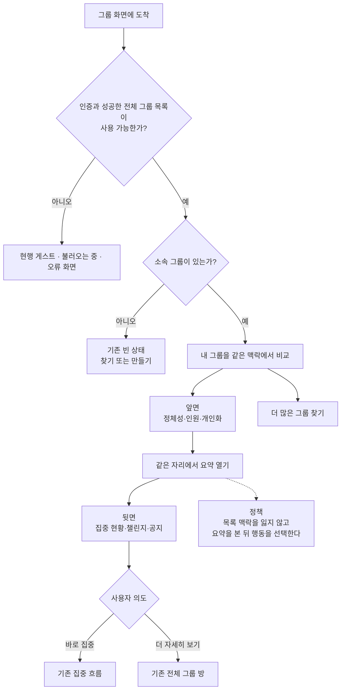
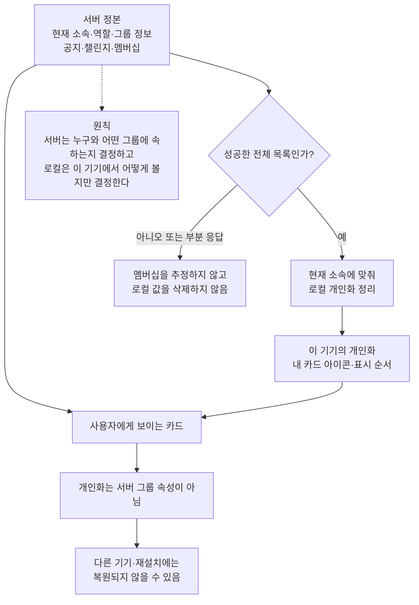
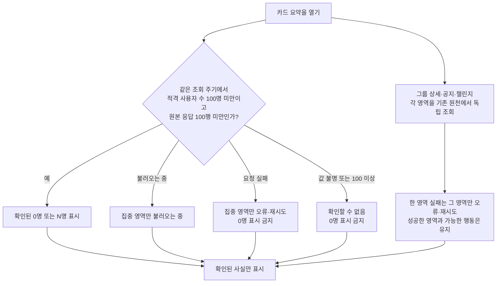
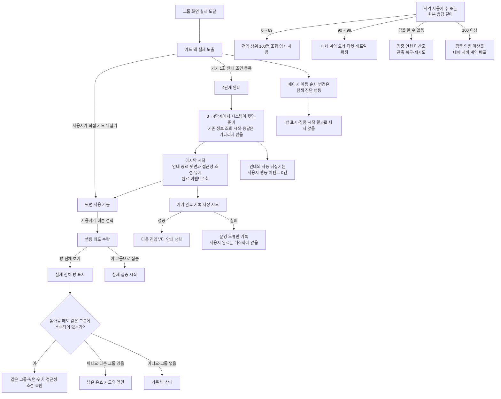
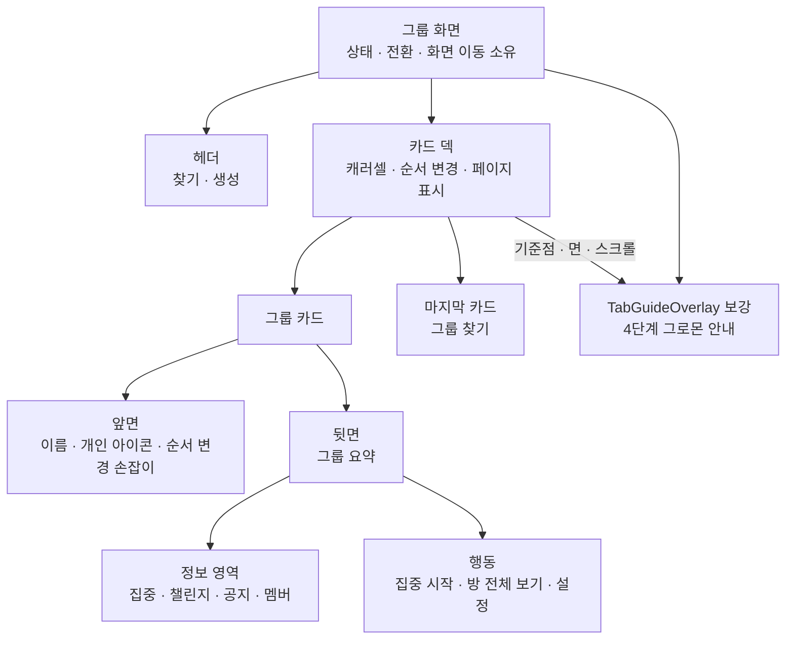
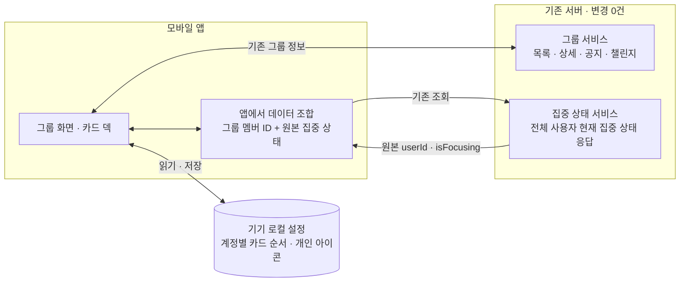
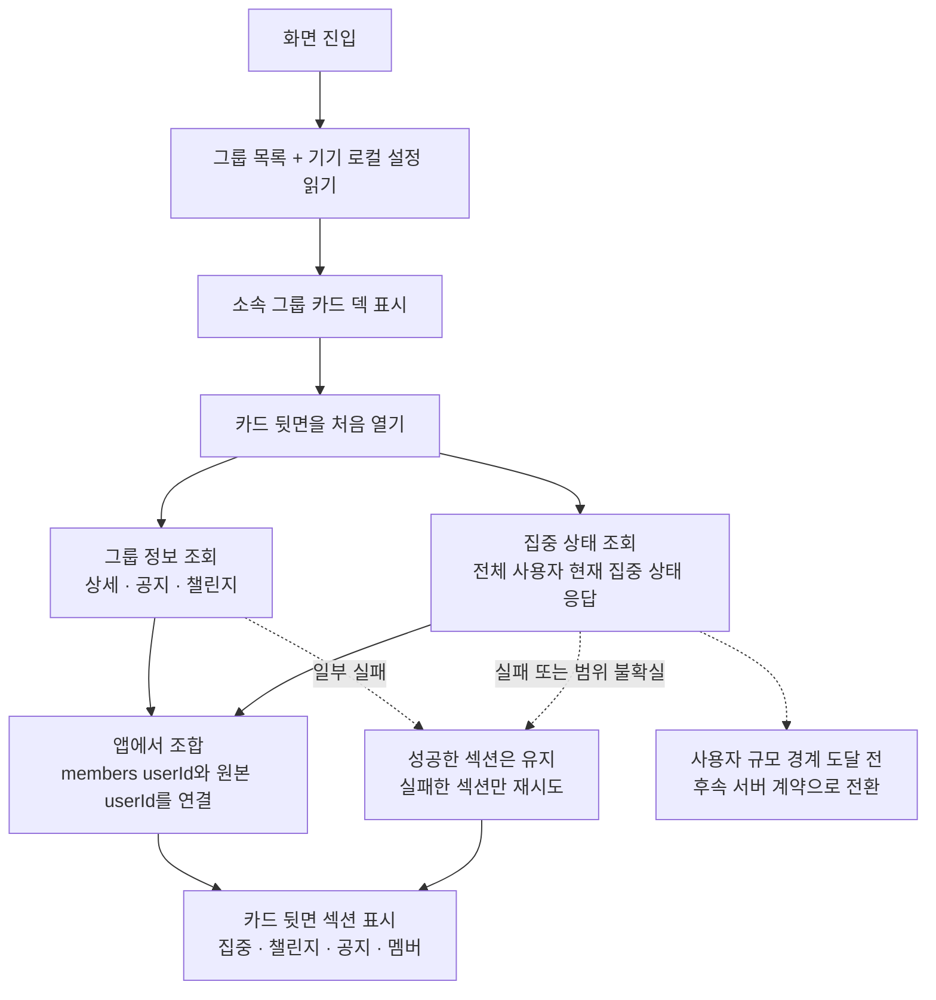

# Feature HLD — 내 그룹 캐러셀·카드 플립

| 항목 | 내용 |
| --- | --- |
| 상위 | [그룹 생애주기 PRD](../../prd.md) · [그룹 IA](../../information-architecture.md) · [Feature PRD](./prd.md) · [UX](./ux-design.md) |
| 하위 | [low-level-design.md](./low-level-design.md) (상태 전이·실패 복구·검증 다이어그램) |
| 시각 정본 | [ux.html](./ux.html) · 공용 목업 모듈 [ux-shared.js](./ux-shared.js) |
| 범위 | 컴포넌트 구조 · 앞/뒷면 데이터 흐름 · 개인 카드 이모지/뒷면 정보/현재 챌린지 목록/순서 계약 · 설정 권한 · 영향 범위 |
| 상태 | **v1.1 기능 설계 정본** — 앞면 탭은 같은 자리의 카드 플립, 전체 방은 뒷면 CTA route, 첫 안정 카드 덱에는 기존 TabGuideOverlay를 보강한 4단계 코치마크를 1회 제공 |
| 구현 상태 | **🟡 일부 구현** — 덱·플립·재정렬·로컬 아이콘·독립 조회·집중 범위 gate는 현재 작업 트리에 구현됨; 코치마크 overlay 조정과 공통 퍼널 일부는 미구현 |

---

## 정책 지도 — 비개발 동료용

이 절은 구현 명칭보다 **결정과 책임의 경계**를 먼저 설명한다. 문서의 우선순위는 **PRD(제품 결정·수용 기준) → IA/HLD(정보·시스템 정책) → LLD(구현·상태·테스트 세부)**다. 세 문서가 충돌하면 PRD를 우선하고, IA와 HLD는 각각 정보 구조와 시스템 경계를 보완하며, LLD는 이 정책을 임의로 바꾸지 않는다. 아래 지도는 기존 상세 설계를 대체하지 않고 그 상세를 읽는 기준이다.

### 0.1 화면 경험과 책임의 약속



이 기능은 새 그룹 도메인을 만들지 않는다. 그룹 화면은 **목록·카드·안내·화면 이동을 조율**하고, 기존 전체 방·집중·생성·가입 흐름은 각 도메인 책임으로 남는다. 카드가 실패해도 다른 카드나 기존 흐름의 상태를 소유하지 않는다.

### 0.2 서버 정본과 기기 로컬 개인화



서버 정보가 개인화로 덮여서는 안 되며, 개인화가 권한·멤버십·다른 사용자의 화면을 바꾸어서도 안 된다. 서버 목록 실패는 탈퇴나 삭제의 증거가 아니다.

### 0.3 기존 정보 조합과 실패 시 신뢰 정책



카드 전용 서버 계약을 늘리지 않고 기존 읽기 정보를 조합한다. 단, 조합 실패가 모든 정보를 지우거나 거짓 수치를 만들면 안 된다. 현재 집중 상태는 규모 가정이 성립하는 완전한 데이터에서만 계산한다.

### 0.4 연속성·안내·측정·확대의 운영 경계



안내는 한 번의 학습 기회일 뿐 안내가 만든 자동 카드 뒤집기를 사용자 행동으로 기록하지 않는다. 측정은 **화면 노출 → 사용자 의도 → 실제 결과**를 분리하고, 규모가 커져 현재 상태를 완전하게 알 수 없으면 ‘0명’이 아니라 전환 gate를 작동시킨다.

---

## 1. 설계 원칙

1. **앞면 탭과 라우트를 분리.** 앞면 탭은 같은 카드의 뒷면으로 flip하며 navigation을 일으키지 않는다. 기존 `onSelect(groupId)`는 뒷면 `방 전체 보기`에서만 호출한다.
2. **의존성 추가 회피.** 전용 캐러셀 라이브러리(`react-native-reanimated-carousel` 등)를 새로 넣지 않는다 — 사내에 네이티브 페이징 선례가 있고(`FocusSessionScreen`의 `pagingEnabled` ScrollView, `DrumPicker`의 `snapToInterval` FlatList), reanimated 4.5.0이 이미 설치돼 있어 peek 모션까지 자급 가능.
3. **기존 API 네 개를 조합한다.** 카드 뒷면을 처음 열 때 해당 `groupId`의 detail·announcements·challenges 세 요청을 lazy 병렬 조회하고, category를 보내지 않은 기존 `GET /api/v1/league/me/ranking?date`의 전체 사용자 현재 집중 상태 원본 응답은 화면 전체에서 날짜별 한 번만 조회·캐시한다. 카드 전용 endpoint는 추가하지 않는다.
4. **카드 표현은 개인 로컬 설정.** 앞면 배경은 모든 그룹이 `#5E6AD2`; 그룹별 색·그라데이션·선화 아이콘은 없다. `내 카드 아이콘`은 현재 계정이 이 기기에서 보는 카드에만 적용하며 그룹의 서버 속성이나 OWNER 권한이 아니다.
5. **서버 계약을 늘리지 않는다.** 이모지는 Create/Update request와 Summary/Detail/Search/Overview response, DB, OpenAPI 어디에도 추가하지 않는다. 앱은 userId별 AsyncStorage 값만 읽고, 미설정·손상·신규·가입 그룹은 `🎯`로 fallback한다. 집중 인원도 기존 그룹 상세 멤버 ID와 기존 전체 사용자 현재 집중 상태 응답을 앱에서 join하므로 이 기능의 서버 변경은 0건이다.
6. **제품 계약을 하나로 유지.** 앞면 탭은 같은 자리에서 카드를 뒤집고, 뒷면 `방 전체 보기`만 `GroupRoom` route를 연다. `GroupChallengeResponse[]`, `ACTIVE|INACTIVE`, `createdAt DESC`와 role별 설정 허브는 현행 정본이다. 없는 `UPCOMING` 상태나 챌린지 제목·연속일·단일 항목 tie-break를 설계로 만들어내지 않는다.
7. **규모 가정을 임시 계약으로 명시한다.** 현재 `is_deleted=false AND is_guest=false` 사용자는 100명 미만이므로 전역 주간 상위 100명 응답이 전체 대상자를 포함한다. 이 가정은 영구 계약이 아니며 90명부터 경고하고, 100명 도달 전 pagination·그룹 상세 현재 집중 상태 필드 또는 batch endpoint로 전환하는 release gate를 둔다.
8. **멤버십과 표시 순서를 분리.** `GET /groups` 응답이 소속 그룹과 DTO의 정본이다. AsyncStorage는 현재 `userId`에 해당하는 stable `groupId[]`만 기기 로컬 표시 순서로 보관하며, 서버에 없는 그룹을 복원하거나 권한 판정에 쓰지 않는다.
9. **첫 카드 덱 안내도 화면 상태로 다룬다.** 기존 `TabGuideOverlay`의 그로몬·말풍선·진행 dot·dim/spotlight를 재사용·보강한다. `GroupScreen`은 route/다른 overlay와의 queue 및 안정 렌더 조건을, `GroupListScreen`은 카드 anchor·활성 face·programmatic 전환을 소유한다. phase 3→4의 programmatic back은 사용자 이벤트 없이 정상 첫 back과 같은 lazy query를 정확히 한 번 시작하되, guide는 응답을 기다리지 않고 step 4의 loading/ready/error를 그대로 표시한다. 서버 계약은 바꾸지 않는다.
10. **사용자 이벤트는 typed 경계에서 한 번만 발행한다.** 화면은 Firebase SDK를 직접 부르지 않고 `analyticsEvents.ts`의 typed helper → 기존 `analytics.track()`만 호출한다. `C`(클라이언트), `S`(서버 Measurement Protocol), `S-LOG`(서버 구조화 로그), `A`(GA4/Firebase 자동 수집)를 구분해 퍼널에는 C·S·검증된 A만 쓰며, raw 버튼/모든 `onPress`를 이벤트로 만들지 않는다.

---

## 2. 화면 컴포넌트와 소유권



상위 그룹 화면이 상태와 화면 이동을 소유하고, 카드 덱과 앞·뒷면은 표시와 사용자 행동을 위임받는다. 따라서 카드 한 장의 실패가 화면 전체나 다른 카드의 상태를 소유하지 않는다. 아래 컴포넌트 이름은 이 개념 구조를 실제 코드 경계로 옮길 때의 계약이다.

- **캐러셀 로컬 컴포넌트**:
  - `CarouselHeader` — 타이틀 + 진입점 아이콘 2개. `onCreate`/`onFind` 위임.
  - `GroupFlipCard` — 앞/뒷면과 접근성 상태를 묶는다. 동시에 하나만 flipped.
  - `GroupCardFront` — 목록 응답 데이터만 소비한다. 그룹 이름은 1줄 tail ellipsis, 카드 몸체는 flip, grip은 reorder.
  - `GroupCardBack` — 집중 중 인원, 현재 챌린지 목록, 공지 1개와 멤버 정보의 독립 로딩 상태를 렌더하고 전체 방·집중·설정 액션을 위임. 좁은 카드 헤더의 그룹 이름은 1줄 ellipsis다.
  - `GroupChallengeList` — `GroupChallengeResponse[]` 전체와 서버 순서를 보존한다. 카드에서는 compact row로 투영하고, 전체 방에서는 기존 `ChallengeCard`를 렌더한다.
  - `PageIndicator` — 활성 index + 총 페이지 수를 받는 순수 표시 컴포넌트. 실제 indicator/container 폭에서 좌우 20pt gutter를 뺀 공간에 44pt hit width의 dot과 4pt gap이 모두 들어가면 dots, 아니면 `n / total`을 렌더한다.
  - `FindMoreCard` — 그룹 데이터를 모르는 고정 footer.
  - `GroupEmojiPicker` — 생성 화면의 local draft와 OWNER·MEMBER 공용 `내 카드 아이콘` 편집 화면에서 재사용. 서버 요청 body를 만들지 않는다.
- **훅/컨트롤러**:
  - `useCarousel` — scrollX·activeIndex·snap 계산.
  - `useGroupFlipState` — `flippedGroupId`와 face 전환.
  - `useGroupCardBackData` — 카드 뒷면을 처음 열 때 현행 detail·announcements·challenges의 lazy fetch·독립 오류·retry·invalidate를 조정한다.
  - `useGroupFocusStatus` — `getMyRanking(undefined, date)`의 **전체 사용자 현재 집중 상태 원본 최대 100행**을 날짜별 한 번 조회하고 in-flight를 합치며, 모든 카드가 공유할 `userId → isFocusing` index를 제공한다. 12명만 남기는 `useSessionLeagueMembers`는 재사용하지 않는다.
  - `useGroupReorder` — grip gesture·낙관적 순서 상태·서버 목록/AsyncStorage hydration·계정별 저장을 조정한다.
  - `groupCardOrderStore` — `STORAGE_KEYS.groupCardOrder`의 계정별 map 읽기·검증·직렬화 쓰기를 담는다.
  - `useGroupCardEmoji` — 성공한 전체 그룹 목록과 현재 `userId`를 기준으로 이모지 hydrate/reconcile·낙관적 표시·오류 상태를 조정한다.
  - `groupCardEmojiStore` — `STORAGE_KEYS.groupCardEmoji`의 계정별 map 읽기·검증·직렬화 read-modify-write를 담는다.
  - `useGroupDeckGuide` — `gromo:guide:groupDeck:v1` read/write, 현재 세션 fallback, 4단계 진행·anchor 재측정·programmatic back 전환 및 완료 이벤트를 조정한다. phase 3→4에서는 `useGroupCardBackData`와 공유 focus query의 정상 첫 back trigger를 호출하되 응답 상태를 소유하지 않는다.
- **overlay 소유권**: `GroupScreen`은 인증된 성공 목록 1개 이상·카드 layout 안정·다른 modal/sheet/guide 없음이라는 eligibility를 판정하고 overlay queue에 `groupDeck`을 넣는다. `GroupListScreen`은 queue가 시작시킨 guide에만 첫 활성 카드·캐러셀/indicator·카드 본문·back 요약/CTA anchor를 제공하고, unmount/route 이탈을 `interrupted`로 반환한다. 카드 컴포넌트는 guide key를 읽거나 완료를 저장하지 않는다.
- 그룹 전용 UI는 `screens/group/components/`에 콜로케이션한다. 다만 통계 카드와 그룹 카드가 함께 쓰는 grip 표현·접근성·불변 순서 이동은 `components/reorder/`로 먼저 추출한다.
- 현행 `screens/stats/CardOrderEditor.tsx` 전체를 수평 캐러셀에 import하지 않는다. 이 컴포넌트는 가변 높이 카드, `ScrollView`, Y축 좌표·auto-scroll·absolute freeze를 함께 소유해 수평 `FlatList`와 직접 호환되지 않는다.

---

## 3. 시스템/API 경계와 데이터 흐름

화면 진입에는 기존 `GET /api/v1/groups` 한 개를 사용하고, 카드 뒷면을 처음 열 때 아래 **기존 read API 네 개**를 추가로 조합한다. 카드 전용 endpoint, 그룹 상세의 현재 집중 상태 필드, DB·OpenAPI 변경은 추가하지 않으므로 서버 변경은 **0건**이다.



- 화면 진입 API: `GET /api/v1/groups` — 소속 그룹 summary와 stable groupId의 정본.
- 카드 뒷면을 처음 열 때 사용하는 그룹 서비스 API: `GET /api/v1/groups/{groupId}?date`, `GET /api/v1/groups/{groupId}/announcements`, `GET /api/v1/groups/{groupId}/challenges?date`.
- 카드 뒷면을 처음 열 때 사용하는 집중 상태 API: category를 보내지 않은 `GET /api/v1/league/me/ranking?date`의 원본 응답.
- AsyncStorage는 네트워크 응답을 대체하지 않는다. 화면 진입의 `GET /api/v1/groups`로 확정한 소속 groupId에 대해 현재 계정의 표시 순서와 개인 카드 아이콘만 reconcile한다.
- 그룹 상세는 멤버십과 `members[].userId`의 정본이다. `isFocusing`을 그룹 상세 DTO에 추가하지 않는다.
- 현재 집중 상태 데이터는 `getMyRanking(undefined, date)`의 원본 배열을 사용한다. 포커스 세션 화면용 `useSessionLeagueMembers`가 본인을 제외하고 12명으로 자른 결과는 그룹 집계에 사용하지 않는다.
- `/api/v1/league/me/ranking?date` 재사용은 그룹 화면에 리그 UI나 리그 기능을 추가하는 것이 아니다. 기존 응답의 `isFocusing` 값만 현재 집중 상태 판단에 재사용한다.

### 3.1 카드 뒷면을 처음 열 때와 화면 공유 현재 집중 상태 데이터



### 3.2 기존 그룹 상세 + 현재 집중 상태 응답의 client join

카드 전용 request/response와 그룹 상세 필드 확장을 만들지 않는다. 현행 그룹 상세의 `members[].userId`를 멤버십 정본으로, category를 생략한 현행 `GET /api/v1/league/me/ranking?date=YYYY-MM-DD`의 원본 `LeagueMemberResponse[]`를 현재 집중 상태 정본으로 사용한다. 현재 eligible 사용자(`is_deleted=false AND is_guest=false`)가 100명 미만이므로 이 top-100 응답에 eligible 사용자 전원이 포함된다는 **임시 규모 가정** 아래 앱에서 join한다.

- `getMyRanking(undefined, date)`는 기존 endpoint에 category를 보내지 않아 전역 주간 상위 100명과 각 행의 기존 `isFocusing`을 그대로 받는다. 날짜 일관성을 위해 `getMyRanking(category?, date = todayStr())`처럼 앱 wrapper에 optional date 인자만 더할 수 있으며 이는 서버 계약 변경이 아니다.
- 포커스 세션 UI용 `useSessionLeagueMembers`는 본인 제외·핀 우선 정렬 뒤 12명으로 `slice`한다. 그룹 count는 그 결과를 재사용하지 않고, `getMyRanking()`의 원본 배열을 보존하는 전용 `useGroupFocusStatus`를 GroupScreen에서 한 번만 사용한다.
- 완전한 현재 집중 상태 데이터에 없는 `userId`는 `false`로 본다. 단, 이는 **eligible 사용자 수와 응답 길이가 모두 100 미만이라 데이터가 완전하다는 게이트를 통과했을 때만** 유효하다. 요청 loading/error나 100행 coverage-unknown 응답은 0명으로 강하하지 않고 집중 섹션을 독립 loading/error로 표시한다.
- 조회 결과가 90~99행이면 운영 warning/계측을 남긴다. 100행은 실제 총원이 100인지 그 이상인지 구분할 수 없으므로 coverage-unknown telemetry를 남기고 count를 미산출한다. eligible 사용자 100명 도달 전 TODO로 그룹 상세 현재 집중 상태 필드, userId batch 현재 집중 상태 endpoint 또는 pagination 중 하나를 배포한다.
- `/api/v1/league/ranking`은 `isFocusing` 값을 채우지 않으므로 사용하지 않는다. 대상은 이름이 비슷한 이 endpoint가 아니라 반드시 `/api/v1/league/me/ranking`의 category 없는 원본 응답이다.
- 이 설계의 백엔드 DTO·service·DB·migration·OpenAPI 변경은 **0건**이다.
- 최신 공지는 서버가 `createdAt DESC`로 주는 기존 `GroupAnnouncementResponse[]`의 `announcements[0] ?? null`이다. 빈 배열과 요청 실패를 구분한다.
- 멤버 현재 인원은 `detail.members.length`, 최대 인원은 `detail.maxMembers`다.
- member preview는 최대 5명이다. `myUserId`와 일치하는 나를 먼저 두고, 나머지는 **기존 detail 응답의 상대 순서**를 보존한다. `joinedAt`이나 별도 preview 정렬 계약을 추가하지 않는다.
- detail·현재 집중 상태·announcements·challenges 중 하나가 실패해도 성공한 섹션은 표시한다. 집중 count는 detail과 완전한 현재 집중 상태 데이터가 모두 ready일 때만 계산하며, 각 실패는 해당 섹션의 retry로만 복구한다.

### 3.3 현재 챌린지 목록 — 현행 API 재사용

```ts
GET /api/v1/groups/{groupId}/challenges?date=YYYY-MM-DD

type GroupChallengeStatus = 'ACTIVE' | 'INACTIVE';

interface CompactChallengeRow {
  challenge: GroupChallengeResponse;
  label: string;
}

function toCompactChallengeRows(
  challenges: readonly GroupChallengeResponse[],
): CompactChallengeRow[] {
  return challenges.map((challenge) => ({
    challenge,
    label: missionLabel(challenge) ?? categoryLabel(challenge),
  }));
}
```

- 앱 서비스는 현행 `getChallenges(groupId, date)`와 `GroupChallengeResponse[]`를 그대로 사용한다. `date`를 전달해야 `memberProgress`가 포함된다.
- 백엔드는 soft-delete되지 않은 챌린지를 `createdAt DESC`로 반환한다. 앱은 `ACTIVE|INACTIVE` 전체를 **필터·재정렬하지 않고** 렌더한다.
- 현재 백엔드에는 `UPCOMING` 상태가 없다. 카드가 예정 챌린지를 합성하거나 `startsAt/endsAt` 기반으로 한 개를 고르지 않는다. `INACTIVE`도 현행 전체 방과 동일하게 목록에 남는다.
- compact row의 기본 문구는 현행 `missionLabel(challenge) ?? categoryLabel(challenge)`를 재사용한다. 서버에 없는 고유 제목·연속일·단일 진행률을 만들지 않는다.
- 카드 뒷면은 `GroupChallengeList variant="compact"`로 응답 전건을 표시한다. 전체 방도 같은 배열을 기존 `ChallengeCard`에 전달한다. 두 화면의 정보 밀도는 달라도 목록 신원·상태·순서는 같다.
- 전체 방의 어제 챌린지 조회는 결과 모달 후보 계산 전용으로 유지하며, 화면의 현재 챌린지 목록에는 섞지 않는다.

### 3.4 로딩·캐시·무효화

- detail·announcements·challenges와 화면 공유 현재 집중 상태 데이터는 각각 `idle → loading → ready|error` 상태를 갖고, 현재 집중 상태 데이터에는 별도 `coverage-unknown` 상태가 있다. detail/challenges cache key는 `groupId + date`, announcements key는 `groupId`, 현재 집중 상태 key는 `userId + date`다.
- `useGroupFocusStatus`는 같은 날짜의 in-flight promise와 ready 원본 배열을 공유한다. 여러 카드의 뒷면을 빠르게 처음 열어도 `/api/v1/league/me/ranking`은 refresh cycle당 한 번만 호출하며 카드별 요청으로 증폭시키지 않는다.
- 같은 화면 세션에서 앞/뒤를 반복할 때 각 ready cache를 즉시 사용한다. 카드 전용 cache type은 만들지 않는다.
- 날짜가 바뀌면 detail·challenges와 현재 집중 상태 데이터를 새 date key로 조회한다. 앱 foreground·집중 시작/종료·pull-to-refresh에서는 화면 공유 현재 집중 상태 데이터를 한 번 갱신하고, detail/challenges와 필요한 공지를 기존 규칙대로 갱신한다.
- 요청 중 다른 카드로 이동해도 응답은 groupId key에만 쓴다. 현재 카드에 낡은 응답을 덮어쓰지 않는다.
- 한 요청의 실패는 해당 섹션에서만 retry한다. 현재 집중 상태 loading은 집중 영역 skeleton, 최초 error는 `집중 현황을 불러오지 못했어요 · 다시 시도`, 100행 coverage-unknown은 `집중 현황을 확인할 수 없어요`로 분리하며 모두 `0명`으로 표시하지 않는다. refresh 실패에 이전의 완전한 ready 데이터가 있으면 stale 표시와 함께 count를 유지할 수 있다.

---

## 4. 렌더 구현

캐러셀은 **Animated `FlatList` + `snapToInterval` + Reanimated**로 구현한다. 새 캐러셀 의존성을 추가하지 않고, 고정 카드 폭·간격에서 snap offset과 peek transform을 직접 계산한다.

- **가상화 경계**: 그룹 최대 10개 + 끝 카드 = 최대 11페이지다. 기본값에서 시작하되 양면 렌더와 detail·announcements·challenges cache가 추가되므로 저사양 기기 프로파일링 뒤 `windowSize`를 확정한다. 화면 공유 현재 집중 상태 데이터는 카드마다 복제하지 않고 상위 화면에서 한 벌만 보유한다.

### 4.1 끝 찾기 카드 — `ListFooterComponent`

`FindMoreCard`는 `ListFooterComponent`로 렌더한다. `data`에는 실제 그룹만 유지하며 sentinel이나 별도 트랙 아이템을 합성하지 않는다. footer는 index 밖이므로 마지막 페이지 이동은 `scrollToOffset`을 사용한다.

- footer 폭·높이·간격은 카드와 **동일하게** 준다. 어긋나면 `SNAP` 배수가 깨져 마지막 페이지에서만 스냅이 어긋난다(§10 H-7).
- `gap`으로 간격을 주면 footer에도 적용된다(컨텐츠 컨테이너의 flex 자식이므로). 아이템 마진 방식으로 갈 경우 **footer에 같은 마진을 직접 줘야 한다**.

### 4.2 카드 flip

- 앞면과 뒷면은 같은 card shell 안에서 동일한 width/height를 차지한다. flip 중 레이아웃 치수를 바꾸지 않는다.
- Reanimated의 shared value 하나(`0=front`, `1=back`)로 회전·opacity를 구동한다. 중간 프레임에서 두 face의 텍스트가 동시에 읽히지 않게 접근성 상태는 애니메이션 시작과 함께 전환한다.
- 앞면 탭은 `flippedGroupId`만 바꾸며 `onSelect`를 호출하지 않는다.
- 뒷면이 active면 앞면 전체를 접근성 트리·포인터에서 제외하고, 앞면이면 반대로 한다.
- Reduce Motion에서는 3D 회전 대신 짧은 cross-fade 또는 즉시 교체하되 상태와 포커스 순서는 동일하다.
- 페이지 swipe 시작 시 현재 카드를 앞면으로 정규화한다. full GroupRoom에서 돌아오는 경우만 source group의 뒷면을 복원한다.

### 4.3 grip drag/drop

- gesture 시작점은 `GroupCardFront` 우상단 grip뿐이다. 카드 몸체의 pan은 carousel, tap은 flip으로 예약한다.
- 프로덕션 grip은 공용 `components/reorder/ReorderHandle`을 사용한다. 현행 통계 화면과 같은 `MaterialCommunityIcons name="drag-vertical"`과 36×36 hit box를 렌더하고 색상 토큰·접근성 action을 한곳에서 관리한다.
- grip pan이 활성화되면 FlatList `scrollEnabled=false`, 해당 카드 lift/translate, 인접 카드 shift를 적용한다.
- drop index는 안정적인 `orderedGroupIds`로 계산한다. visual index나 `GroupSummaryResponse[]` mutation에 의존하지 않는다.
- drop 직후 로컬 `orderedGroupIds`를 낙관적으로 갱신하고, 해당 `userId` bucket에 best-effort로 저장한다. 저장 실패는 현재 세션 순서를 rollback하지 않고 non-blocking inline 실패 상태로 전달한다. 성공 문구는 노출하지 않는다.
- keyboard/screen-reader custom action도 같은 `moveGroup(groupId, targetIndex)` 명령을 호출한다.

`CardOrderEditor` 전체 재사용은 금지한다. 공용 추출 경계는 다음과 같다.

| 공용 `components/reorder/` | 통계 전용 | 그룹 캐러셀 전용 |
| --- | --- | --- |
| `ReorderHandle`의 아이콘·hit target·접근성, `moveStableId()` | 가변 높이 측정, Y축 slot, 세로 auto-scroll, absolute freeze | 동일 폭 카드 중심점, X축 target, 가로 edge scroll, `FlatList.scrollEnabled` 중재 |

이 경계면 수직·수평 알고리즘의 좌표계를 억지로 일반화하지 않으면서 사용자에게는 같은 grip과 같은 순서 변경 의미를 제공한다. `CardOrderEditor`도 추출 후 공용 handle·pure move 함수를 소비하도록 바꾼다.

### 4.4 긴 그룹 이름

- 카드 앞면·뒷면 헤더·검색 결과·일반 목록행의 그룹 이름은 모두 최대 1줄로 고정하고 넘치는 시각 텍스트에 tail ellipsis를 적용한다. 긴 이름 때문에 카드 높이·CTA·grip 위치를 밀지 않는다.
- line clamp는 표시 규칙일 뿐 데이터 절단 규칙이 아니다. 접근성 label·flip/reorder/route announcement에는 서버에서 받은 `group.name` 원문 전체를 사용하고 ellipsis 문자나 잘린 문자열을 넣지 않는다.
- 동일 interactive parent가 카드 전체 접근성 label을 소유하면 자식 이름 Text는 중복 announcement에서 제외한다. 검색·목록행처럼 이름 Text가 label을 소유하는 경우에도 `accessibilityLabel`은 원문 전체다.

---

## 5. 상태 관리

- `scrollX`(reanimated shared value) + `activeIndex`(파생) — carousel 로컬.
- `flippedGroupId: string | null` — 동시에 한 장만 뒷면. face 자체는 navigation history에 넣지 않는다.
- `backSourceByGroupId: Record<GroupId, 'user' | 'guide'>` — guide가 phase 3→4에서 만든 active back만 `guide`로 둔다. 사용자가 front로 바꾸거나 다른 카드를 거쳐 다시 back을 열면 해당 back은 `user`로 덮어써 CTA의 `back_source`가 오래 남지 않게 한다.
- `detailByKey: Map<groupId:date, AsyncState<GroupDetailResponse>>` — 멤버 ID·인원·preview의 현행 상세 응답 캐시. `isFocusing` 필드를 추가하지 않는다.
- `focusStatusByUserAndDate: Map<userId:date, FocusStatusState>` — category 없는 `/api/v1/league/me/ranking`의 전체 사용자 현재 집중 상태 원본 최대 100행을 화면 전체에서 공유하는 캐시. 인증 계정 변경 시 폐기한다.
- `focusStatusByUserId: Map<userId, boolean>` — 완전한 현재 집중 상태 데이터의 `isFocusing === true`를 index한 파생값. loading/error/coverage-unknown 상태에서는 만들지 않는다.
- `announcementsByGroupId: Map<groupId, AsyncState<GroupAnnouncementResponse[]>>` — 현행 최신순 공지 응답 캐시. 카드에는 첫 1개만 투영.
- `challengesByKey: Map<groupId:date, AsyncState<GroupChallengeResponse[]>>` — 현행 챌린지 응답 캐시. 카드 compact projection 외 필터·정렬을 적용하지 않는다.
- `orderedGroupIds: string[]` — 서버 목록과 현재 계정의 기기 로컬 순서를 reconcile한 현재 표시 순서.
- `orderHydrated: boolean` — 서버 목록과 AsyncStorage 읽기가 끝나 reconcile된 순서를 안전하게 그릴 수 있는지 표시.
- `orderSaveError: boolean` — 마지막 로컬 쓰기 실패를 캐러셀 상단 inline 상태와 polite live region에 한 번 전달. 다음 저장 성공 시 조용히 해제.
- `cardEmojiByGroupId: Record<GroupId, GroupEmoji>` — 성공한 전체 서버 목록과 현재 계정 bucket을 reconcile한 개인 카드 표현. 조회 시 미설정 값은 `🎯`로 파생한다.
- `emojiHydrated: boolean` — 성공한 전체 `GET /groups`와 현재 계정의 로컬 read가 함께 끝났는지 표시. 목록 실패·부분 응답으로 reconcile하지 않는다.
- `emojiSaveErrorByGroupId: Record<GroupId, boolean>` — 로컬 저장 실패 시 현재 화면 선택은 유지하고 해당 편집 화면의 inline polite 오류만 한 번 노출한다.
- `pendingEmojiByGroupId: Record<GroupId, GroupEmoji>` — 쓰기 실패 뒤 현재 실행에만 남는 최신 재시도 값. 다음 아이콘 변경·그룹 화면 활성화 성공 시 제거하며 앱 프로세스가 끝나면 마지막 정상 저장값으로 돌아간다.
- `reorderDrag` — active groupId·from/to index·translation. drop/cancel 뒤 반드시 해제한다.
- `groupDeckGuide: { keyState, sessionAttempted, sessionCompleted, phase, queueState }` — `keyState`는 `unread | incomplete | completed | unknown`, `sessionAttempted`는 local read 실패를 포함해 이번 앱 세션의 최대 1회 시작 가드, `sessionCompleted`는 마지막 `시작`으로 overlay를 닫은 뒤 foreground 재노출을 막는 메모리 상태, `phase`는 `1 | 2 | 3 | 4 | null`이다. key write 성공 때만 `keyState=completed`가 영속되며 write 실패는 telemetry로만 남긴다.
- 화면 폭은 `useWindowDimensions()`(회전/스플릿 대응) 또는 컨테이너 `onLayout`으로 취득 → 카드 폭/스냅 계산의 입력.
- detail·announcements·challenges·현재 집중 상태 cache는 화면 로컬로 유지하고 AsyncStorage에 저장하지 않는다. AsyncStorage에는 계정별 `groupId[]` 순서와 별도 key의 `{[groupId]: emoji}` 개인 설정만 저장한다.
- GroupRoom route를 열 때 source `{ groupId, face: 'back', index }`를 화면 로컬에 보존하고, 정상 복귀 시 그 카드가 여전히 존재하면 뒷면과 위치를 복원한다.

---

## 6. 그룹 카드 첫 노출 코치마크 계약

### 6.1 trigger·저장·queue

`GroupScreen`은 인증 사용자에게서 **성공한 전체** `GET /groups` 목록이 1개 이상이고 `GroupListScreen`의 카드 폭·활성 첫 카드·필수 anchor layout이 안정됐을 때만 eligibility를 계산한다. guest, userId 미확정, loading/error/부분 목록, groups=0, 다른 modal/sheet/guide가 열린 상태에서는 시작하지 않는다. 다른 overlay가 먼저 닫힌 뒤에도 화면이 안정돼 있으면 queue에서 다시 판정한다.

- 완료 key는 AsyncStorage `gromo:guide:groupDeck:v1`, 값 `1`이며 **기기 단위 v1 1회**다. userId bucket으로 나누지 않는다. key 없음은 미완료, `1`은 완료다.
- key read 성공 뒤 미완료면 queue에 넣고, 완료면 카드 덱을 바로 사용하게 한다. read 실패는 덱을 막지 않으며 `keyState=unknown`과 session memory로 이번 세션에 최대 1회만 시도한다. 다음 진입에서는 다시 read한다.
- 화면 탭 또는 접근성 `다음` action으로 1~3단계를 진행하고 마지막은 `시작` action을 쓴다. skip/replay는 제공하지 않는다. 마지막 `시작`으로 overlay가 닫힌 직후 `tab_guide_completed`를 현재 session 1회 발행하고, 이어 key write를 best-effort로 시도한다. 중간 background/unmount/route 이탈은 event·write 없이 `interrupted` 처리한다.
- key write 실패는 사용자 완료 결과나 `tab_guide_completed`를 취소하지 않는다. `sessionCompleted`로 현재 foreground session의 중복 overlay를 막고 카드 사용을 계속 허용하며, `guide_complete_write_failed` 운영 telemetry만 남긴다. 다음 앱 진입에는 다시 노출될 수 있다.

### 6.2 TabGuideOverlay 단계와 anchor

공용 `TabGuideOverlay`에 `guide=groupDeck:v1`, `phase`, `total=4`, 접근성 label/action과 anchor fallback을 보강한다. 정적 그로몬 asset 이름은 analytics payload에 넣지 않는다.

| 단계 | 캐릭터·anchor | 안내 문구 | 준비/종료 상태 |
| --- | --- | --- | --- |
| 1 소개 | `character_hi`·전체 dim | 내 그룹이 카드로 모였어. 같이 둘러보자! | 첫 활성 카드 front, spotlight 없음 |
| 2 가로 탐색 | `character_study`·캐러셀 + indicator | 2개 이상: 옆으로 넘기면 다른 그룹을 볼 수 있어. 1개: 이 카드가 내 그룹이야. 그룹이 늘면 옆으로 넘길 수 있어. | front 유지 |
| 3 카드 flip | `character_study`·활성 카드 본문 | 카드를 탭하면 이 자리에서 오늘의 방 상태가 열려. | 다음 단계 준비에서만 시스템이 active card를 back으로 전환 |
| 4 요약과 행동 | `character_happy`·back 정보 + CTA 영역 | 집중 중인 멤버·챌린지·공지를 보고 바로 집중하거나 방 전체를 열어봐. | 마지막 action 후 overlay를 닫고 active card back·CTA 근처 focus 유지 |

각 단계 시작 직전 현재 layout에서 anchor를 재측정한다. anchor 측정 실패 또는 화면 폭 변경 중에는 잘못된 spotlight를 그리지 않고 전체 dim + 말풍선/단계 문구로 fallback하며 다음 단계에서 재측정한다. 단계 3→4의 back 전환은 guide의 programmatic 준비 동작이므로 `group_card_flipped`·`group_carousel_paged`를 발행하지 않는다. 다만 정상 사용자 첫 back과 **동일한 cache key와 in-flight dedupe**로 detail·announcements·challenges 병렬 조회와 화면 공유 league query를 정확히 1회 시작한다. guide는 응답을 기다리지 않고 step 4로 진행하며 back 섹션의 독립 `loading | ready | error` UI를 그대로 렌더한다. CTA는 기존 오류/부분 성공 계약대로 유지한다.

### 6.3 접근성·오류 경계

- overlay는 `단계 n/4`, 현재 원문, `다음` 또는 마지막 단계의 `시작` action을 읽는다. spotlight만으로 의미를 전달하지 않으며 화면 탭과 동등한 접근성 action을 제공한다.
- Reduce Motion에서는 overlay/face 전환을 cross-fade 또는 즉시 교체한다. 숨은 face·비활성 CTA는 focus tree에 남기지 않고, 마지막 단계 종료 시 active back의 첫 의미 있는 CTA 또는 요약 제목으로 focus를 복원한다.
- overlay가 열린 동안 다른 modal/sheet/guide는 queue에서 대기한다. anchor가 사라지는 route 이탈·background·카드 목록 변경은 guide를 즉시 닫되 완료로 저장하지 않는다. 카드·멤버십·서버 데이터는 롤백하거나 추정하지 않는다.

### 6.4 guide 계측 계약

| 이벤트 | 정확한 발행 시점 | 속성·중복 방지 |
| --- | --- | --- |
| `group_card_deck_viewed` | 그룹 1개 이상 덱, guide eligibility 및 첫 렌더가 확정된 뒤 화면 진입당 1회 | `group_count_bucket`, `group_entry`, `guide_state`(shown·completed·unknown); rerender·resize·guide 단계 이동은 재발행 금지 |
| `group_card_flipped` | 사용자 입력으로 face가 실제 전환된 순간 | `to_face`, `trigger`, `group_count_bucket`; animation·route 복귀·guide programmatic 전환 발행 금지 |
| `group_carousel_paged` | 사용자 입력으로 active `groupId`가 바뀐 순간 | `trigger`, `from_index`, `to_index`, `group_count_bucket`; resize·indicator mode 변경·guide scroll 발행 금지 |
| `group_card_action_clicked` | back CTA가 focus·room·settings 흐름을 시작한 순간 | `action`, `role`, `back_source`; 탭 1회당 1회 |
| `group_card_reordered` | pointer up 또는 접근성 이동으로 순서를 commit한 순간 | `trigger`, `from_index`, `to_index`, `group_count_bucket`; drag 중간 위치 발행 금지 |
| `group_card_icon_save_result` | 로컬 아이콘 쓰기의 성공·실패가 확정된 순간 | `surface`, `result`; glyph·그룹명 전송 금지 |
| `tab_guide_completed` | 마지막 `시작`으로 overlay가 닫힌 직후 | `guide=groupDeck:v1`; 현재 session 완료당 1회, 단계별 next·programmatic 전환·가입 onboarding 이벤트 발행 금지 |

guide의 programmatic face/scroll 변경은 `group_card_flipped`·`group_carousel_paged`에 포함하지 않는다. guide key read/write·anchor fallback·중단은 각각 `guide_state=unknown`, `guide_complete_write_failed`, `guide_anchor_fallback`, `guide_interrupted` 운영 로그로 구분한다. 그룹명·소개·emoji glyph·로컬 순서·그로몬 asset 이름은 어떤 guide payload에도 넣지 않는다.

### 6.5 공통 분석 이벤트 사전

이 절은 [통합 HLD §6](../../high-level-design.md#6-기능별-상세-정본)이 위임한 공통 이벤트명·속성·발행 규칙의 문서 정본이다. 이벤트의 의미상 기능 소유권은 통합 HLD를 따른다. 모든 신규 클라이언트 이벤트는 `analyticsEvents.ts`의 typed helper를 통해 기존 `analytics.track()`으로만 보낸다. `C`는 이 클라이언트 경로, `S`는 서버 Measurement Protocol, `S-LOG`는 서버 구조화 activity log, `A`는 GA4/Firebase 자동 수집이다. 퍼널 정본에는 C·S·DebugView에서 검증된 A만 사용하고 S-LOG는 export/join이 확인되기 전까지 운영 분석에만 쓴다.

| 이벤트 | 유형·주체 | 소유 surface·발행 시점 | 필수 속성·제외 |
| --- | --- | --- |
| `session_start` | lifecycle·A | GA4 자동 세션 시작 | 앱에서 수동 발행 금지; DebugView 검증 전 공식 KPI 분모로 미사용 |
| `app_main_viewed` | screen·C | `RootNavigator`/main shell이 입력 가능한 foreground 상태가 된 진입당 1회 | `app_entry`, `auth_state`, `initial_tab`; provider rerender·탭 이동 제외 |
| `main_tab_selected` | action·C | `TabBar`의 비활성 탭이 실제 전환된 순간 | `tab`, `from_tab`; 같은 탭 재탭·programmatic navigation 제외 |
| `group_viewed` | screen·C | `GroupScreen` focus cycle당 1회 | `group_entry`; 단순 rerender 제외 |
| `group_create_started` / `group_create_submitted` / `group_created` | screen·C / action·C / result·C | `Create` 폼 표시 성공 / 유효한 만들기 버튼 수락 뒤 API 직전 / create API 성공 응답 직후 | `entry_point` / `entry_point`, `is_private` / `entry_point`, `is_private`; 요청당 1회이며 icon 저장과 분리 |
| `group_find_opened` | screen·C | `Find` sheet 실제 표시 | `entry_point`; sheet open cycle당 1회 |
| `invite_link_opened` / `group_invite_sheet_viewed` | action·C / screen·C | 설치된 앱의 초대 링크 처리 / 초대 preview sheet 실제 표시 | 기존 `group_id`, `slug`, `via` / 기존 `group_id`, `slug`, `entry=link|deferred`; 초대 계약의 `entry`는 `group_entry`와 분리 |
| `group_join_attempted` / `group_joined` / `group_left` | action·C / result·S / result·S-LOG | 검색·초대 가입 요청 직전 / 가입 commit / 탈퇴·강퇴 commit 뒤 | `join_method`; 클라이언트 중복 발행 금지, `group_left`는 GA4 연결 확인 전 S-LOG |
| `group_card_deck_viewed` | exposure·C | `GroupListScreen`의 1개 이상 목록+layout 안정 첫 렌더 | `group_count_bucket`, `group_entry`, `guide_state`; focus당 1회 |
| `group_card_flipped` / `group_carousel_paged` | action·C | 실제 face/active groupId가 사용자 입력으로 변경 | 기존 props; guide·animation·route 복귀·resize 제외 |
| `group_card_action_clicked` | action·C | `Card` back의 focus·room·settings 흐름이 수락된 순간 | `action`, `role`, `back_source`; disabled·double tap·no-op 제외 |
| `group_card_icon_editor_viewed` / `group_card_icon_save_result` | screen·C / result·C | editor 실제 표시 / local write 확정 | 없음 / `surface`, `result`; create inline picker와 분리, glyph 제외 |
| `group_room_viewed` / `focus_session_started` | result·C | `Room` 최초 성공 렌더 / `Focus` 기존 성공 시작 계약 | 기존 속성 + `entry_source`; action 결과 귀속 |
| `tab_guide_completed` | result·C | 마지막 `시작`으로 overlay가 닫힌 직후 | `guide=groupDeck:v1`; session 1회, key write 결과와 분리 |

속성 enum은 `app_entry=cold_start|foreground|auth_complete|unknown`, `auth_state=guest|member`, `group_entry=tab|invite|push|return|unknown`, 탭=`home|league|group|menu`, `entry_point=empty|header|end_card`, `group_count_bucket=1|2_5|6_10|unknown`, `guide_state=shown|completed|unknown`, `action=focus|room|settings`, `role=owner|member`, `to_face=front|back`, `back_source=user|guide`, `surface=create|settings`, `result=success|failed`, `entry_source=group_card|group_room|group_find|invite|home_fab|unknown`, `join_method=search|invite|deferred_invite`처럼 저카디널리티로 고정한다. `back_source=guide`는 guide가 만든 back face를 사용자가 face를 다시 바꾸기 전까지만 허용하며, front로 돌아갔다 다시 back을 열면 `user`다. 기존 초대 sheet의 `entry=link|deferred`는 초대 흐름에서만 쓰며 `group_entry`와 섞지 않는다. `group_id`는 기존 `group_room_viewed` 외 새 카드 이벤트에 추가하지 않으며, 이름·소개·emoji·버튼 문구·asset·로컬 순서·`user_id` 파라미터는 금지한다.

### 6.6 F1/F2/F3 퍼널과 결과 귀속

```text
F1  app_main_viewed(auth_state=member)
      ├─ main_tab_selected(tab=group) → group_viewed(group_entry=tab)
      └─ group_viewed(group_entry=invite|push|unknown)

F2  group_card_deck_viewed
      → back 사용 가능 = tab_guide_completed OR group_card_flipped(to_face=back)
      → group_card_action_clicked
        ├─ room  → group_room_viewed(entry_source=group_card)
        └─ focus → focus_session_started(entry_source=group_card)

F3  group_viewed(groups=0)
      ├─ group_find_opened → [group_search_performed 선택] → group_join_attempted(search) → group_joined
      ├─ invite_link_opened → group_invite_sheet_viewed → group_join_attempted(invite|deferred_invite) → group_joined
      └─ group_create_started → group_create_submitted → group_created → 다음 group_card_deck_viewed
```

- F1 분석 단위는 로그인 `user_id + ga_session_id`의 고유 세션이다. 탭 경로의 B→C는 10초 안에 `group_viewed(group_entry=tab)`로 이어질 때만 navigation 성공으로, invite/push 직접 경로에 `main_tab_selected`가 없는 것은 정상으로 본다.
- F2의 back 사용 가능은 같은 session의 합집합으로 dedupe한다. 자발 flip률은 `to_face=back`의 user action만 별도 분자로 쓰며 guide programmatic back은 절대 포함하지 않는다. room 결과 attribution은 action 뒤 30초, focus 결과는 10분을 초기 window로 둔다.
- F3에서 find의 검색은 선택 단계다. 기본 목록에서 바로 가입할 수 있으므로 `group_find_opened→group_join_attempted(search)`도 정상 경로다. 초대는 `invite_link_opened→group_invite_sheet_viewed`를 별도 branch로 유지하며 기존 초대 sheet의 `entry=link|deferred`를 그룹 화면 유입의 `group_entry`로 재사용하지 않는다. 가입 결과 정본은 S `group_joined`다. create는 유효한 만들기 action 수락 뒤 API 직전에 C `group_create_submitted`를 요청당 1회, 성공 응답 직후 C `group_created`를 1회 발행한다. 서버 GA4 귀속용 app instance가 생기기 전까지 같은 생성 event를 서버에서 중복 발행하지 않는다.
- `settings`, carousel, reorder, icon editor와 중간 guide next는 진단 행동이므로 F2 core 단계가 아니다. action만 있고 result가 없으면 취소·background·navigation/focus 오류일 수 있으므로 운영 telemetry와 분리해 해석한다.

### 6.7 구현 영향·DebugView QA

| 대상 | 변경 책임 |
| --- | --- |
| `analyticsEvents.ts` | event name·저카디널리티 props의 discriminated typed helper와 once/dedupe 경계. 화면의 Firebase 직접 호출 금지 |
| `RootNavigator` | foreground main shell `app_main_viewed` 1회와 `app_entry`·`auth_state`·`initial_tab` 산출 |
| `TabBar` | 실제 tab 전환 때만 `main_tab_selected`; deep link/programmatic 전환 제외 |
| `GroupScreen` | focus cycle `group_viewed(group_entry)`, F1 entry propagation, eligibility 뒤 deck exposure 소유. 기존 초대 sheet `entry`와 상태를 분리 |
| `Create` / `Find` / invite link | form 표시 `group_create_started`, 유효한 만들기 action 수락 뒤 API 직전 `group_create_submitted`, API 성공 `group_created`, sheet 표시 `group_find_opened`의 entry_point 전파. 기본 목록 즉시 가입과 선택 검색을 구분하고 invite link→preview sheet→`join_method=invite|deferred_invite` branch는 기존 초대 ownership 유지 |
| `Card` / guide | deck·flip·page·CTA·reorder·icon 결과와 guide 종료 event. programmatic transition 금지 규칙 적용 |
| `Room` / `Focus` | 기존 성공 결과 event에 `entry_source`를 붙여 CTA 결과를 귀속 |

DebugView에서 (1) 홈→그룹 탭→flip→room은 `app_main_viewed→main_tab_selected→group_viewed→deck→flip→action→room result` 각 1건, (2) invite/push 직접 진입은 tab selected 0건, (3) 첫 guide는 programmatic flip/page 0·마지막 시작 `tab_guide_completed` 1건, (4) key write 실패도 completed 1·운영 telemetry 1·현 foreground 재노출 0, (5) CTA double tap은 action 최대 1·결과 없는 경우 0을 확인한다. rerender/resize/route 복귀는 deck·flip·page를 재발행하지 않으며 raw payload에 금지 속성이 없어야 한다.

---

## 7. API·props·권한 계약

### 7.1 계정별·기기 로컬 카드 이모지

`내 카드 아이콘` 선택값은 그룹 속성이 아니라 **현재 계정의 개인 카드 표현**이다. 같은 그룹도 계정이나 기기가 다르면 다른 이모지를 볼 수 있다.

```ts
export const GROUP_EMOJI_WHITELIST = ['🌅','📚','💻','⚡','🧘','🎨','🏃','✍️','🧠','🎯','🌿','🔥'] as const;
export type GroupEmoji = (typeof GROUP_EMOJI_WHITELIST)[number];
export const GROUP_EMOJI_FALLBACK: GroupEmoji = '🎯';

type GroupCardEmojiByUser = Record<UserId, Record<GroupId, GroupEmoji>>;

export const STORAGE_KEYS = {
  // 기존 key 유지
  groupCardEmoji: 'gromo:groups:cardEmoji:v1',
} as const;
```

1. 현재 `userId`와 성공한 **전체** `GET /groups` 응답을 받은 뒤 로컬 bucket을 읽고 reconcile한다. 전체 서버 목록에 속한 groupId의 정확한 12개 allowlist 값만 유지하며, stale·비문자열·미허용 값은 제거한다.
2. 저장값이 없는 신규 생성·새 가입 그룹과 손상·읽기 실패는 `🎯`로 렌더한다. 목록 요청이 실패했거나 부분 목록만 확보한 경우에는 membership 정본이 아니므로 로컬 key를 prune·수리 저장하지 않는다.
3. 선택 변경은 화면 상태에 즉시 반영하고, `gromo:groups:cardEmoji:v1`의 계정별 map을 직렬화된 read-modify-write로 best-effort 저장한다. 연속 선택과 다른 계정 bucket을 덮지 않도록 key 단위 Promise queue를 사용한다.
4. 쓰기 실패 시 현재 UI 선택을 rollback하지 않는다. `내 카드 아이콘을 저장하지 못했어요. 앱을 다시 열면 이전 아이콘으로 돌아갈 수 있어요.`를 해당 화면의 non-blocking inline 상태와 polite live region으로 한 번 알린다. 최신 실패값은 메모리 pending으로 두고 다음 아이콘 변경 또는 그룹 화면 활성화 때 다시 저장하며, 성공 시 오류만 조용히 지우고 성공 toast는 표시하지 않는다.
5. 같은 계정·같은 기기의 앱 재시작에서는 복원된다. 다른 계정 bucket과 섞이지 않으며 다른 기기, 앱 삭제·재설치, 앱 데이터 초기화에는 동기화·복구되지 않는다.
6. 생성 화면 picker는 local draft다. `CreateGroupRequest` body에는 넣지 않고, `POST /groups` 성공으로 새 `groupId`를 받은 뒤에만 그 계정 bucket에 persist한다. 생성 취소·실패에는 저장하지 않는다.
7. `GroupSettings`의 `내 카드 아이콘`은 OWNER와 MEMBER 모두에게 보이며 같은 로컬 editor를 연다. `GroupProfileEdit`, OWNER PATCH, 서버 role 검증과 분리하고 `이 기기에서 나에게만 보여요`를 고정 안내한다.
8. `CreateGroupRequest`, `UpdateGroupRequest`, `GroupSummaryResponse`, `GroupDetailResponse`, `GroupSearchResponse`, `GroupOverviewResponse`에 emoji나 `isFocusing`을 추가하지 않는다. 백엔드 `Group`/DTO/service, `groups` 테이블, migration, OpenAPI, `INVALID_GROUP_EMOJI`를 변경하지 않는다.

앞면 배경색 역시 DTO가 아니다. 모든 카드가 로컬 토큰 `#5E6AD2`를 사용하며 `tone`, `gradient`, `lineIcon` 같은 그룹별 필드를 추가하지 않는다.

### 7.2 `GroupListScreenProps`와 navigation 의미

```ts
export interface GroupListScreenProps {
  groups: GroupSummaryResponse[];
  onSelect: (groupId: string) => void; // 뒷면 '방 전체 보기' 전용
  onFocus: (groupId: string) => void;
  onOpenSettings: (groupId: string) => void;
  onCreate: () => void;
  onFind: () => void;
  onRefresh: () => Promise<void>;
  onBack?: () => void;
}
```

- 시그니처는 유지하지만 **`onSelect` 호출 의미가 바뀐다.** 앞면 탭은 로컬 flip이고, 뒷면 `방 전체 보기`만 `onSelect(groupId)`를 호출한다.
- `onRefresh`는 시그니처만 유지하고 캐러셀에서 직접 호출하지 않는다. 포커스 재조회가 목록 갱신을 담당한다.
- 설정·집중 진입은 `GroupScreen`이 소유한 `onOpenSettings(groupId)`·`onFocus(groupId)` callback으로 위임하고 기존 navigation contract를 사용한다.
- 헤더와 끝 카드의 찾기는 같은 `onFind()`를 호출한다.

### 7.3 계정별 기기 로컬 그룹 순서

`GET /groups`는 멤버십·DTO 정본으로 남기고, grip drag/drop으로 바꾼 표시 순서만 AsyncStorage에 기기 로컬로 유지한다.

- 중앙 key는 `STORAGE_KEYS.groupCardOrder: 'gromo:groups:cardOrder:v1'`, 값은 `{ [userId]: string[] }`다. 통계의 기기 전역 `statsCardOrder` 패턴을 그대로 복사하지 않고 현행 장비·보유 아이템·캐릭터와 같은 계정별 map 관행을 따른다.
- 서버 목록과 현재 `userId` bucket을 모두 읽은 뒤 reconcile한다. 남아 있는 ID의 상대 순서를 유지하고, 새 ID는 서버 순서대로 뒤에 붙이며, 사라진·중복 ID를 제거한다. `FindMoreCard`는 저장 값에 들어가지 않는다.
- reconcile 결과가 저장값과 다르면 수리된 `groupId[]`를 해당 계정 bucket에 best-effort로 다시 저장한다. 손상된 JSON·타입·읽기 실패는 서버 순서로 fallback한다.
- drop과 보조기술 이동 action은 동일하게 낙관적 `orderedGroupIds`를 먼저 갱신하고, 계정별 map read-modify-write를 직렬화해 저장한다.
- 저장 실패는 현재 세션 순서를 rollback하지 않고 non-blocking inline 실패 상태로 알린다. UI는 `저장됨`이나 `다른 기기에도 반영됨` 같은 완료 문구를 표시하지 않는다.
- 순서는 앱 삭제·기기 데이터 초기화 시 소실되고 다기기 동기화되지 않는다. 서버 order API를 추가하지 않는다.

### 7.4 설정 진입 경계

카드와 방의 `⋯`는 `GroupSettings({ groupId })` 진입만 소유한다. 그룹 프로필, 위임, 멤버 관리, 공지 권한, 나가기의 역할 정책·API·복구 정본은 [04 그룹 운영 HLD](../04-operation/high-level-design.md)다. 이 절은 `내 카드 아이콘`의 카드 반영과 로컬 편집 진입만 다룬다.

| 역할 | 설정 항목 | 권한·저장 |
| --- | --- | --- |
| OWNER | 내 카드 아이콘 · 그룹 프로필 설정하기 · 방장 넘기기 · 멤버 관리 · 공지 권한 · 그룹 나가기 | 카드 아이콘은 개인 로컬, 다음 4개 OWNER only, 나가기는 멤버 공용 |
| MEMBER | 내 카드 아이콘 · 그룹 나가기 | 카드 아이콘은 개인 로컬, 나가기는 멤버 공용 |

- 카드 뒷면과 전체 방의 `⋯`는 모두 현행 root stack `GroupSettings({ groupId })`로 이동한다. 별도 role sheet를 새로 만들지 않는다.
- `내 카드 아이콘`은 역할과 무관하게 `GroupCardEmojiEdit({ groupId })`로 이동하며 AsyncStorage만 갱신한다. 설명 `이 기기에서 나에게만 보여요`를 행 또는 편집 화면에 노출한다.
- 그 밖의 운영 항목은 04 HLD·LLD의 권한·API·실패 복구를 그대로 따른다.

---

## 8. 영향 범위 & 회귀

| 대상 | 영향 |
| --- | --- |
| `GroupScreen.tsx` | `onSelect` 시그니처는 유지. 뒷면 CTA route·방 복귀, 성공한 전체 서버 목록과 계정별 로컬 순서·이모지 hydrate/reconcile 및 groupDeck eligibility/overlay queue를 소유 |
| `GroupListScreen.tsx` | 캐러셀 + flip + 카드 뒷면 lazy 조회 + 화면 공유 현재 집중 상태 조합 + grip reorder. guide가 시작한 뒤 첫 카드/anchor/phase 3→4 programmatic back을 제공하고, 정상 첫 back과 같은 dedupe 경로로 4개 lazy query를 1회 시작하며 step 4의 dependency 상태를 렌더. guide key·queue는 소유하지 않음 |
| `screens/group/components/` | `GroupFlipCard`·앞/뒷면·`GroupChallengeList` compact variant·공용 `GroupEmojiPicker`·가로 reorder controller 추가 |
| `components/reorder/` | 통계에서 공용 `ReorderHandle`·`moveStableId` 추출. 그룹과 통계가 함께 소비 |
| `screens/stats/CardOrderEditor.tsx` | 세로 drag controller는 유지하고 직접 아이콘·배열 이동만 공용 모듈로 교체 |
| `GroupCreateScreen.tsx` | 공용 12개 picker를 local draft로 유지. POST body에서는 제외하고 create 성공의 새 groupId에만 로컬 persist; 취소·실패에는 저장하지 않음 |
| `GroupSettingsScreen`·`GroupCardEmojiEditScreen` | OWNER·MEMBER 공용 `내 카드 아이콘` 행과 로컬 editor 추가. `이 기기에서 나에게만 보여요` 안내, 낙관적 표시·inline 저장 오류 처리 |
| `GroupProfileEditScreen.tsx` | `내 카드 아이콘`과 무관. 기존 서버 그룹 프로필 필드와 OWNER 권한만 유지 |
| `types/storage.ts`·그룹 local store | `groupCardOrder`와 별도로 `groupCardEmoji: 'gromo:groups:cardEmoji:v1'` 추가. `{[userId]: {[groupId]: emoji}}` 검증·reconcile·직렬화 쓰기 |
| `TabGuideOverlay`·guide storage/controller | 공용 그로몬·말풍선·dot·dim/spotlight를 재사용하고 `groupDeck:v1` 4단계, `gromo:guide:groupDeck:v1`, session fallback, anchor fallback, 단계 접근성 action을 보강. 서버/API 변경 없음 |
| `types/dto/group.ts`·`services/groupApi.ts` | emoji·`isFocusing` 변경 없음. 현행 `getGroupDetail`·`getAnnouncements`·`getChallenges` 재사용 |
| `services/leagueApi.ts`·`useGroupFocusStatus` | 기존 `getMyRanking()` 원본 응답을 category 없이 사용. 동일 날짜를 명시할 optional client 인자와, 전체 사용자 현재 집중 상태 원본 100행을 보존하는 그룹 전용 화면 캐시/in-flight dedupe 추가. `useSessionLeagueMembers`의 12명 slice 결과는 재사용하지 않음 |
| 백엔드 `Group`·DTO·service | 변경 없음. 그룹 상세 `members[]`에는 기존 필드만 유지하고 `FocusLiveInfoLookup`·`@JsonProperty` mapping을 추가하지 않음 |
| DB migration·OpenAPI | 변경 없음. emoji·현재 집중 상태 컬럼·schema·새 API path 모두 추가하지 않음 |
| 기존 그룹 조회 API | controller/service 경로 추가 없음. detail·announcements·challenges의 권한·정렬·부분 실패 계약을 카드와 전체 방에서 함께 회귀 검증 |
| `GroupSettingsScreen` 및 하위 route | 기존 허브에 공용 로컬 `내 카드 아이콘` route만 추가. OWNER는 기존 관리 4항목+나가기, MEMBER는 기존 나가기를 유지 |
| `GroupRoomScreen` | 현행 detail·announcements·오늘/어제 challenges `Promise.allSettled`와 응답 전건 `map`을 유지. 카드도 같은 API 계약과 부분 실패 원칙을 따름 |
| 테스트 | 기존 카드 lazy data·독립 실패/캐시·순서·이모지·role 회귀와 함께 guide trigger matrix, 4단계 anchor/programmatic back의 4개 query 1회·step 4 상태, session fallback/write failure, 접근성·이벤트 중복을 추가 |
| 계측 | PRD §6.5의 C/S/S-LOG/A 카탈로그와 F1/F2/F3를 정본으로 한다. `app_main_viewed`·`main_tab_selected`·획득 결과/화면 이벤트와 기존 카드 이벤트를 typed helper로 발행하고, guide programmatic 전환은 flip/page에서 제외한다. 기존 카드/API 계약은 변경하지 않음 |

---

## 9. testID 매핑 (테스트 연속성)

현행 루트 ID는 유지하되 양면·액션·grip은 서로 다른 ID를 갖는다.

| testID | v1.1 대상 |
| --- | --- |
| `group.list` | 유지(루트) |
| `group.list.items` | 캐러셀 트랙에 유지 |
| `group.list.card.<groupId>` | 양면 card shell |
| `group.list.card.<groupId>.front` | 앞면 flip target |
| `group.list.card.<groupId>.grip` | 재정렬 시작점 |
| `group.list.card.<groupId>.back` | 카드 뒷면 |
| `group.list.card.<groupId>.detail.retry` | 상세 멤버·인원 섹션 재시도 |
| `group.list.card.<groupId>.live.retry` | 화면 공유 현재 집중 상태 조회 재시도(동일 date in-flight dedupe) |
| `group.list.card.<groupId>.announcements.retry` | 공지 섹션 재시도 |
| `group.list.card.<groupId>.challenges.retry` | 챌린지 섹션 재시도 |
| `group.list.card.<groupId>.focus` | 집중 CTA |
| `group.list.card.<groupId>.room` | full GroupRoom CTA |
| `group.list.card.<groupId>.settings` | role별 설정 |
| `group.list.create` / `group.list.find` | 헤더 아이콘 버튼 |
| `group.list.find.card` | 끝 찾기 footer |
| `group.list.guide` / `group.list.guide.next` | groupDeck overlay와 접근성 다음 action |

앞면 `group.list.card.<groupId>.front` press는 flip만, 뒷면 `*.room` press는 `GroupRoom` route 진입만 정확히 한 번 수행해야 한다.

---

## 10. 리스크(설계 레벨)

| # | 리스크 | 완화 |
| --- | --- | --- |
| H-1 | scale 애니메이션이 스냅 치수를 흔듦 | **폭은 불변, scale만**(UX §4). 스냅은 레이아웃 폭 기준 |
| H-2 | 화면 회전/폭 변화 시 스냅 어긋남 | 폭을 `useWindowDimensions`로 반응 취득 → 파생 재계산 |
| H-3 | 카드 tap·carousel swipe·grip drag가 충돌 | 시작 영역과 gesture priority를 분리하고 기기 테스트로 인식 임계를 확정 |
| H-4 | flip 중 양면이 동시에 보조기술에 노출 | active face만 접근성 트리·pointer에 남기고 포커스를 새 face의 제목으로 이동 |
| H-5 | 카드마다 기존 API 세 호출이 발생 | 활성 카드의 뒷면을 처음 열 때만 detail·announcements·challenges를 `Promise.allSettled`로 병렬 호출하고 각 응답 cache 사용. 현재 집중 상태 데이터는 date별 화면 공유 query 한 번으로 dedupe |
| H-6 | 현재 집중 상태 snapshot이 오래됨 | foreground·집중 시작/종료·pull-to-refresh에서 화면 공유 현재 집중 상태 데이터를 한 번 무효화·재조회. 시간 tick은 표시하지 않음 |
| H-7 | footer 치수가 아이템과 어긋남 | footer 폭/높이/간격을 카드와 같은 상수에서 파생; 마지막 페이지 스냅 QA |
| H-8 | footer는 `scrollToIndex` 대상이 아님 | 마지막 점 이동만 `scrollToOffset({ offset: SNAP * groups.length })` |
| H-9 | 로컬 순서가 다기기 동기화로 오해됨 | 성공·동기화 문구를 쓰지 않고 기기 로컬 범위를 테스트·문서에 고정 |
| H-10 | 전역 emoji key로 다른 계정의 개인 설정이 노출됨 | `{[userId]: {[groupId]: emoji}}` bucket으로 격리하고 `userId` 없이는 읽기·쓰기하지 않음 |
| H-11 | 설정 진입 후 다른 기기에서 role이 바뀜 | 현행 `GroupSettingsScreen`처럼 focus마다 상세 재조회 후 OWNER 행을 다시 판정 |
| H-12 | 사용자 효과를 내부 선호로 오판 | 성장 KPI 금지. §12 사용성·품질·계측 준비 게이트만 적용 |
| H-13 | 현행 36×36 grip이 44pt 권장 target보다 작음 | 공용 컴포넌트에 위험을 명시하고 VoiceOver/TalkBack custom action을 제공. 오탭·미탭 실기 결과 전까지 접근성 충족을 주장하지 않음 |
| H-14 | 전역 order key로 계정 순서가 누출됨 | `{[userId]: groupId[]}` bucket으로 분리하고 `userId` 없이 읽기·쓰기 금지 |
| H-15 | 연속 drop·bucket read-modify-write가 나중 상태를 덮음 | 해당 key 쓰기를 직렬화하고 매 작업마다 최신 map을 재로드 |
| H-16 | 손상·중복·탈퇴 그룹 ID가 렌더됨 | 서버 ID set으로 검증·중복 제거·수리 저장, 읽기 실패는 서버 순서 fallback |
| H-17 | 로컬 emoji write 실패·연속 선택·create 성공 직후 저장이 서로 덮음 | key 단위 직렬화 RMW, 낙관적 UI 유지, inline polite 오류. create는 성공 groupId 확정 뒤만 persist |
| H-18 | 고정 pageCount 임계가 작은 화면에서 overflow하거나 큰 화면 공간을 낭비 | 실제 indicator/container 폭에서 40pt gutter를 뺀 available과 dot hit width/gap의 required를 비교. mode는 carousel 상태와 분리된 파생값 |
| H-19 | 긴 이름이 카드 높이·CTA를 밀거나 보조기술에도 잘린 이름이 전달됨 | 앞면·뒷면·검색·목록 모두 1줄 tail ellipsis. 접근성 label은 항상 원문 전체 사용 |
| H-20 | 실패·부분 그룹 목록으로 emoji stale key를 지움 | 성공한 전체 `GET /groups`에서만 reconcile/prune하고, 실패·부분 목록에서는 현재 local bucket을 보존 |
| H-21 | eligible 사용자가 100명에 도달해 top-100 밖 그룹원이 `false`로 오판됨 | 90~99명 warning, 응답 100행은 coverage-unknown telemetry·count 미산출. eligible 사용자 100명 도달 전 pagination·그룹 상세 현재 집중 상태 필드·batch 현재 집중 상태 endpoint 중 하나로 전환하는 release gate 적용 |
| H-22 | 카드마다 `/api/v1/league/me/ranking`을 호출해 요청이 증폭됨 | GroupScreen 소유 date cache와 in-flight promise를 모든 카드가 공유하고, 12명 slice 훅 대신 원본 전용 hook 사용 |
| H-23 | guide가 sheet·route 복귀와 겹쳐 잘못된 anchor 또는 화면 차단을 만듦 | GroupScreen overlay queue·안정 렌더 gate를 사용하고 background/unmount는 미완료 interrupt로 종료 |
| H-24 | guide 시연 back이 사용자 flip·page 이벤트 또는 lazy query 미시작/중복으로 오인됨 | programmatic source를 별도 표시해 flip/page analytics는 차단하되, 정상 첫 back과 같은 cache/in-flight dedupe로 detail·공지·challenge·공유 league query를 정확히 1회 시작한다. guide는 기다리지 않고 step 4의 loading/ready/error를 표시 |
| H-25 | 공용 overlay가 보조기술에 단계·다음 action을 전달하지 못함 | `단계 n/4`·원문·다음/시작 action을 공용 계약으로 추가하고 VoiceOver/TalkBack·Reduce Motion E2E로 검증 |
| H-26 | guide key read/write 실패가 반복 노출 또는 카드 차단으로 이어짐 | read 실패는 session 1회 fallback, write 실패는 session 완료 유지·다음 앱 실행 재시도, 운영 로그 분리 |

---

## 11. 범위 경계

- `내 카드 아이콘`은 서버 그룹 속성이 아니다. OWNER·MEMBER 모두 `GroupSettings → 내 카드 아이콘`에서 현재 계정·기기의 카드 표현을 바꿀 수 있고, 다른 사용자·기기에는 보이지 않는다.
- 생성 picker는 local draft이며 그룹 생성 성공 뒤 반환된 groupId에만 저장한다. 신규·가입 그룹의 미설정 기본은 `🎯`다.
- 카드 순서는 계정별·기기 로컬로 재실행 후에도 유지하지만 앱 삭제·데이터 초기화 시 소실되고 다기기 동기화는 제공하지 않는다.
- member preview는 최대 5명이며, 앱이 요청 사용자를 먼저 분리한 뒤 나머지는 기존 detail 응답의 상대 순서를 그대로 유지한다. `joinedAt` 계약은 추가하지 않는다.
- 카드는 완전한 전체 사용자 현재 집중 상태 데이터에서 `isFocusing === true`인 userId와 그룹 상세 `members[].userId`를 join해 `${n}명 집중 중`만 표시한다. 해당 데이터에 없는 ID는 100명 미만 게이트 안에서만 false다.
- 챌린지는 `ACTIVE|INACTIVE` 전건을 서버 `createdAt DESC` 순서 그대로 표시한다.
- 코치마크는 첫 실제 카드 덱 사용법만 안내하며 가입 온보딩·replay 메뉴·새 push/인앱 알림을 만들지 않는다. 카드/guide 도입으로 서버 DTO·DB·migration·OpenAPI·카드 read API는 변경하지 않는다.

---

## 12. 출시 전 검증 게이트

카드 기능의 행동 baseline은 아직 없고 현재 eligible 사용자는 100명 미만이다. 아래는 사업 효과가 아니라 구현 가능성, 규모 가정, 과업 이해를 확인하는 게이트다.

- **사용성:** 앞면 탭→뒷면, 뒷면→전체 방, grip 재정렬을 설명 없이 수행하는지 관찰.
- **상태:** 그룹 1·5·10개, local emoji 미설정/무효/읽기·쓰기 실패/연속 변경, detail/현재 집중 상태/announcements/challenges 독립 loading/error/empty, 현재 집중 상태 0/N명 및 userId join, 챌린지 0/1/복수 및 ACTIVE/INACTIVE 혼합, 공지 없음.
- **순서 저장:** 계정 A/B 분리, 신규·탈퇴·중복·손상 저장값 reconcile, 읽기/쓰기 실패 fallback, 재실행 복원, 다기기 미동기화를 검증한다.
- **이모지 저장:** 계정 A/B·그룹 ID 격리, 성공한 전체 목록에서만 reconcile, 실패·부분 목록에서 무삭제, 같은 계정·기기 재실행 복원, 타기기·재설치 미동기화, create 성공 후 저장·취소/실패 무저장을 검증한다.
- **권한:** `내 카드 아이콘`은 OWNER·MEMBER 모두 노출되고 로컬에서만 동작한다. OWNER에는 그 밖의 관리 4항목과 그룹 나가기, MEMBER에는 그 밖에 그룹 나가기만 노출되며 서버 관리 API는 기존 권한을 강제한다.
- **코치마크 trigger·복원:** guest·userId 미확정·loading/error/0개/1개 이상·완료 key·다른 overlay·read 실패를 교차 검증한다. 성공한 1개 이상 덱의 첫 안정 렌더에서만 시작하고, 중간 background/unmount/route 이탈은 key를 쓰지 않으며 다음 안정 진입에 1단계부터 재개한다.
- **코치마크 단계:** 1/복수 그룹의 문구·character·anchor와 1→4 순서를 검증한다. 단계 3→4의 programmatic back은 flip/page 이벤트를 0회로 유지하면서 normal first back과 같은 detail·공지·challenge·공유 league lazy query를 각각 정확히 1회 시작하고, guide가 기다리지 않는 step 4에서 dependency별 loading/ready/error를 표시해야 한다. 완료 뒤 back face와 CTA focus를 유지한다.
- **접근성:** face 전환 포커스, grip custom action, guide의 단계 n/4·원문·다음/시작 action, Reduce Motion, 현행 36×36 grip의 미탭 위험, route 복귀.
- **responsive indicator:** 320/390/430/768pt에서 폭 공식을 검증하고, dots↔`n / total` 전환이 active index/groupId·scroll offset·announcement를 바꾸지 않는지 확인한다.
- **긴 이름:** 긴 한글, 공백 없는 영문, 연속·조합 이모지 이름이 앞면·뒷면·검색·목록 모두 1줄 tail ellipsis를 넘지 않고, VoiceOver/TalkBack에는 원문 전체가 전달되는지 확인한다.
- **호환:** 기존 Create/Update/Summary/Detail/Search/Overview DTO가 emoji·`isFocusing` 추가 없이 그대로 동작하고, 현행 공지 최신순·`ACTIVE|INACTIVE` 챌린지 응답을 검증한다.
- **회귀:** 앞면 press에서 GroupRoom이 열리지 않고, 뒷면 `*.room`에서만 정확히 한 번 열린다.
- **기존 API 회귀:** category 없는 `/api/v1/league/me/ranking?date` 원본에 `isFocusing` 값이 있고, 그룹 detail의 기존 멤버 필드, announcements 최신순, challenges의 date·상태·정렬 계약이 카드 도입 뒤에도 유지된다.
- **규모 게이트:** eligible 사용자 수와 raw response 길이를 관측한다. 90~99명은 warning과 전환 작업 착수, 100행 응답은 coverage-unknown telemetry와 count 미산출 상태다. 이를 `0명`으로 표시하지 않는다.
- **전환 TODO:** 100명 도달 전에 그룹 상세의 멤버별 현재 집중 상태 필드, userId batch 현재 집중 상태 endpoint, 또는 `/api/v1/league/me/ranking` pagination 중 하나의 서버 계약을 선택·배포한 뒤 top-100 join을 제거한다.
- **계측 준비:** PRD §6.5 카탈로그와 §6.6 F1/F2/F3의 이벤트별 발행 시점·속성·중복 방지를 staging/DebugView에서 검증한다. 특히 `app_main_viewed`는 foreground main shell당 1회, `main_tab_selected`는 실제 global tab 변경 때만 1회, `group_card_deck_viewed`는 eligibility 확정 첫 렌더에 focus당 1회, `tab_guide_completed`는 마지막 `시작`으로 overlay가 닫힌 현재 session당 1회여야 한다. key write 실패는 completed를 취소하지 않고 운영 telemetry만 1회다. guide programmatic flip/page, rerender, resize, route 복귀에서는 flip/page 금지 이벤트가 0건이어야 하며 payload에 그룹명·emoji·버튼 문구·asset·로컬 순서·user_id가 없어야 한다.

리텐션·재방문·전환율 개선은 이 HLD의 성공 기준이 아니다. 실제 사용자 데이터가 쌓인 뒤 별도 제품 지표로 정의한다.
