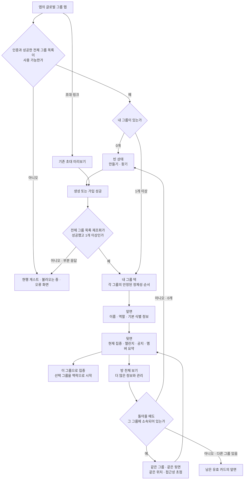
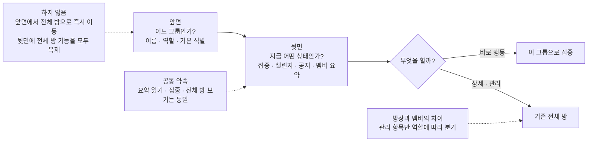
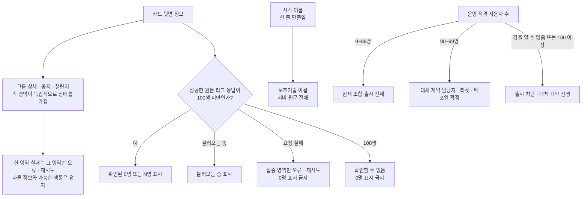
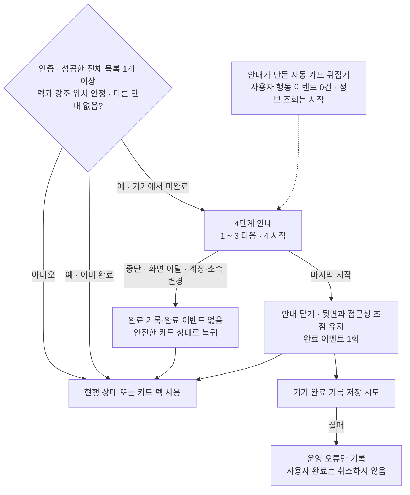

# Feature IA — 내 그룹 캐러셀·카드 플립: 정보 구조

| 항목 | 내용                                                                                                                                             |
| ---- | ------------------------------------------------------------------------------------------------------------------------------------------------ |
| 상위 | [그룹 전체 IA](../../information-architecture.md) · [Feature PRD](./prd.md)                                                                                           |
| 범위 | 화면 위치 · 상태 트리 · 카드 앞/뒷면 정보 위계 · 내비게이션 · 권한별 설정                                                                        |
| 상태 | **v1.1 정보구조 정본** — 카드 플립·기기 로컬 순서·사용자별 `내 카드 아이콘`·기존 전역 리그 라이브 합성·그룹 카드 첫 노출 코치마크 정보 구조 확정 |
| 구현 상태 | **⬜ 설계 완료·구현 미착수** — 카드 덱·플립·재정렬·로컬 아이콘·안내는 아직 앱에 구현되지 않음 |

이 문서는 **"무엇을, 어떤 순서/위계로 보여주는가"** 만 다룬다. 어떻게 움직이는지(제스처·모션)는 [ux-design.md](./ux-design.md), 어떻게 구현하는지는 [high-level-design.md](./high-level-design.md)·[low-level-design.md](./low-level-design.md).

> **현실성 전제:** 작성 시점의 실제 행동 데이터는 0이다. `eligible_user_count < 100`은 운영상 출시 전제일 뿐 런타임 앱에는 전달되지 않는다. 앱은 성공한 전역 리그 원본 응답 길이가 100 미만일 때만 top100 완전성을 적용하며, `length === 100`·loading·error는 미산출(0명 금지)이다. 운영 수가 unknown 또는 100 이상이면 출시는 차단하고 대체 계약을 먼저 정한다.

---

## 정책 지도 — 비개발 동료용

### 정본 우선순위와 이 문서의 역할

제품의 **왜·무엇·성공 판단**은 [prd.md](./prd.md)가 정한다. 이 문서는 그 결정을 사용자가
보는 정보·화면 경계·복귀 규칙으로 번역한다. HLD는 시스템 책임 경계를, LLD는 구현과 테스트
방법을 구체화한다. 충돌하면 **PRD → IA/HLD → LLD** 순으로 해석하고, 같은 계층의 충돌은 PRD에
되돌려 결정한다.

### 0.1 화면과 이동 경계



### 0.2 앞면·뒷면·전체 방의 정보 위계



### 0.3 정보 신뢰·부분 실패·규모 경계



### 0.4 첫 카드 덱 안내의 사용자 약속



| 정책          | 사용자에게 보이는 결과                                                                                    | 지켜야 하는 경계                                                            |
| ------------- | --------------------------------------------------------------------------------------------------------- | --------------------------------------------------------------------------- |
| 정보 계층     | 앞면은 빠른 식별, 뒷면은 지금 행동을 고르는 데 필요한 요약, 전체 방은 상세·관리다                         | 앞면 탭만으로 전체 방에 이동하지 않는다                                     |
| 상태 분기     | 그룹이 없으면 획득 경로를, 하나 이상이면 언제나 내 그룹 덱을 먼저 보여준다                                | 빈 상태·게스트·불러오는 중·오류를 덱으로 가장하지 않는다                    |
| 정체성과 복귀 | 같은 그룹이 여전히 소속 목록에 있으면 보던 그룹·면·위치를 유지하고, 아니면 안전한 앞면·빈 상태로 복귀한다 | 순서는 개인 기기 선호일 뿐 멤버십 사실이나 다른 사람의 화면을 바꾸지 않는다 |
| 신뢰와 실패   | 확인된 정보만 단정하고, 한 영역의 실패가 나머지 정보나 행동을 막지 않는다                                 | 불완전한 집중 정보는 0명으로 표시하지 않는다                                |
| 역할과 접근성 | 역할에 따라 관리 기능만 달라지고, 읽기·집중·전체 방 보기의 핵심 경로는 이해 가능해야 한다                 | 시각적 줄임이 보조기술의 원문 정보나 조작 가능성을 줄이지 않는다            |

아래 §1 이후의 화면 구조·상태·필드 표는 이 정책 지도를 검증 가능한 상세로 풀어 쓴 **부록성 정보
구조 정본**이다. 구현 구성요소·저장 방식·네트워크 호출은 HLD·LLD에서만 확정한다.

---

## 1. 화면 위치 (Navigation map)

```
앱 main shell (인증 member/guest)
└── Tab: 홈 | 리그 | [그룹] | 전체
       └── GroupScreen  (그룹 탭 진입점 · 상태 소유)
              ├── 그룹 0개: [그룹 만들기] → GroupCreate → 성공 뒤 덱
              │             [그룹 찾기] → GroupFindSheet → (검색은 선택) → 가입 성공 뒤 덱
              │             초대 링크 수신 → Invite preview sheet → 가입 성공 뒤 덱
              └── 그룹 1개 이상: GroupListScreen  ← ★ peek carousel
                     ├── 카드 앞면 탭 → 같은 자리 Room Summary back으로 flip
                     ├── back [이 그룹으로 집중] → FocusCategory → 세션 시작
                     ├── back [방 전체 보기] → push GroupRoom → Back 시 같은 back 복귀
                     ├── back [⋯] → 공통 내 카드 아이콘 + role별 GroupSettings
                     └── 앞면 우상단 ReorderHandle → 직접 drag/drop으로 순서 변경
```

- `GroupListScreen`은 **그룹 탭의 첫 화면**(A-9: 소속 1개부터 항상 목록). 자체 백버튼 없음(`onBack` 미전달이 정상).
- 캐러셀은 `GroupScreen`의 **"1건 이상" 분기만** 대체한다. 게스트/로딩/에러/빈 상태 화면은 위치·소유 불변.
- **카드 앞면 탭은 라우트 이동이 아니다.** `GroupRoom` push는 뒷면의 명시적 `방 전체 보기`에서만 일어난다.
- 이 흐름의 노출·의도·결과 이벤트 정본은 [HLD §6.5 공통 분석 이벤트 사전](./high-level-design.md#65-공통-분석-이벤트-사전)과 [§6.6 퍼널·결과 귀속](./high-level-design.md#66-f1f2f3-퍼널과-결과-귀속)이다. 앱 main shell, 글로벌 탭 선택,
  `GroupScreen` 도달, 덱 노출, back CTA 수락, 방/집중 결과를 서로 다른 단계로 기록한다.

### 1.1 화면 결과의 semantic event

아래는 정보 구조상 결과가 실제로 발생한 지점만 연결한 것이다. 버튼 원문이나 그룹 이름은 payload에
넣지 않으며, 이벤트의 속성·중복 규칙은 [HLD §6.5](./high-level-design.md#65-공통-분석-이벤트-사전)·[§6.6](./high-level-design.md#66-f1f2f3-퍼널과-결과-귀속)을 따른다.

| 화면 결과                                                 | semantic event                                                                                                                                       | 분류                              |
| --------------------------------------------------------- | ---------------------------------------------------------------------------------------------------------------------------------------------------- | --------------------------------- |
| 인증/게스트 main 탭 shell이 입력 가능해짐                 | `app_main_viewed`                                                                                                                                    | 신규                              |
| 비활성 글로벌 `그룹` 탭이 실제 선택됨                     | `main_tab_selected(tab=group)`                                                                                                                       | 신규                              |
| 그룹 화면이 focus되어 표시됨                              | `group_viewed(group_entry=tab\|invite\|push\|return\|unknown)`                                                                                       | 기존 속성 보강                    |
| 생성 폼이 표시됨 / 유효한 `만들기` 수락 / create API 성공 | `group_create_started(entry_point=empty\|header)` / `group_create_submitted(entry_point, is_private)` / `group_created`                              | 기존 속성 보강 / 신규 / 신규      |
| 빈 상태·헤더·끝 카드에서 찾기 sheet가 표시됨              | `group_find_opened(entry_point=empty\|header\|end_card)`                                                                                             | 신규                              |
| 그룹 1개 이상 덱이 조작 가능해짐                          | `group_card_deck_viewed`                                                                                                                             | 신규                              |
| back CTA가 수락됨 → 실제 방/집중 결과가 성공              | `group_card_action_clicked(action=room\|focus)` → `group_room_viewed(entry_source=group_card)` 또는 `focus_session_started(entry_source=group_card)` | 신규 action / 기존 결과 속성 보강 |

`다시 시도`, 일반 뒤로가기, sheet 닫기, 생성·집중 흐름의 취소는 이 표의 제품 이벤트가 아니다. 결과 이벤트가
없으면 클릭 이후 취소·오류·이탈로 보고 운영 telemetry와 함께 판단한다.

그룹 0개 사용자의 획득 흐름은 `group_find_opened → [group_search_performed 선택] → group_join_attempted(search) → group_joined`,
`invite_link_opened → group_invite_sheet_viewed(entry=link|deferred) → group_join_attempted(invite|deferred_invite) → group_joined`다.
생성 경로는 `group_create_started → group_create_submitted → group_created → group_card_deck_viewed`다.
여기서 `group_entry`는 그룹 화면 진입 출처이고, 초대 sheet의 기존 `entry=link|deferred`와 섞지 않는다.

---

## 2. 상태 트리 (State tree) — 화면 상태와 카드 로컬 상태

화면 수준 상태는 계속 `GroupScreen`이 소유한다. 카드 face·요약 로딩·현재 화면 순서는 `GroupListScreen` 로컬 상태이고, 재정렬 선호 순서와 `내 카드 아이콘`만 서로 다른 `AsyncStorage` key에 계정별로 영속한다.

```
GroupScreen
├── isGuest ─────────────► [게스트 안내 + 로그인 CTA]          (불변)
├── groups===null & loading ─► [중앙 스피너]                   (불변)
├── (null | 전이) & error ──► [에러 + 다시 시도]               (불변)
├── myGroups.length === 0 ──► [빈 상태: 만들기 · 찾기]          (불변)
└── myGroups.length >= 1 ──► ★ GroupListScreen  ← 캐러셀로 교체
        + staleNotice (재조회 실패 인라인 배너)                 (불변, 캐러셀 위에 얹힘)
        + findSheet / inviteSheet (오버레이)                    (불변)
        + orderedGroupIds                                      (서버 집합 + userId별 기기 저장 순서 reconcile)
        + cardEmojiByGroupId                                   (현재 userId의 기기 로컬 groupId→emoji, 기본 🎯)
        + flippedGroupId: string | null                         (동시에 최대 1장)
        + detail[groupId+date]: idle|loading|ready|error        (멤버 userId·preview·정원)
        + leagueLive[date]: idle|loading|ready|error            (전역 top100 원본, 모든 카드 공유)
        + announcements[groupId]: idle|loading|ready|error      (현행 최신순 목록의 첫 공지)
        + challenges[groupId+date]: idle|loading|ready|error    (현행 목록 API 재사용)
        + groupDeckGuide: idle|reading|waiting-stable|showing(1..4)|session-complete
          (기기 전역 `gromo:guide:groupDeck:v1`; 가입 온보딩과 별개)
```

**설계 함의**: 캐러셀은 "빈 배열"을 다루지 않는다(0건은 `GroupScreen`이 가로챔). 캐러셀에 도달하면 **항상 최소 1건**이다.

- 다른 그룹으로 페이지를 넘기거나 다른 카드를 뒤집으면 기존 뒷면은 앞면으로 돌아간다.
- 뒷면 로딩 실패는 해당 카드 안에서 재시도하며, 자동으로 `GroupRoom`을 열지 않는다.
- 카드 순서 변경 중에는 carousel page swipe를 잠그고, drop/취소 후 다시 푼다.
- 첫 카드 덱 코치마크가 보이는 동안에는 카드의 일반 flip·page·reorder·CTA 입력을 받지 않는다.
  단, 코치마크 자체의 화면 탭/접근성 다음 action만 다음 단계로 진행한다.

---

## 3. 캐러셀 내부 정보 구조

한 화면은 **중앙의 양면 그룹 카드 1장** + 이웃 peek + 인디케이터 + 생성/찾기 진입점으로 구성한다.

```
GroupListScreen
├── 헤더: "내 그룹" [🔍 찾기] [+ 만들기]
├── 캐러셀:
│    [그룹 A 앞/뒤] [그룹 B 앞/뒤] … [그룹 N 앞/뒤] [🔍 그룹 찾기]
│          └ 동시에 한 장만 뒤집힘                    └ 항상 마지막
└── 페이지 인디케이터: 페이지 수 = 그룹 수 + 1
```

### 3.1 항목 순서와 재정렬

1. **그룹 카드들** — 서버 응답이 현재 소속 집합과 DTO의 정본이다. 같은 기기에 저장한 현재 `userId`의 stable `groupId[]`와 reconcile한 순서로 표시하고, 저장값이 없으면 서버 순서로 시작한다. index 0이 첫 페이지다.
2. **맨 끝 `그룹 찾기` 카드 1장** — 그룹 순서 변경 대상이 아니며 항상 마지막이다.
3. 페이지 수는 **`groups.length + 1`** 이다. 찾기 카드는 구현상 `ListFooterComponent`로 붙인다.
4. 순서 변경의 유일한 시각적 진입점은 **각 앞면 우상단 공용 `ReorderHandle`**이다.

`PageIndicator` mode는 페이지 수가 아니라 실제 레이아웃 폭으로 정한다.

```text
pageCount = groups.length + 1
availableWidth = indicatorContainerWidth - 20pt - 20pt
requiredDotWidth = pageCount * 44pt + (pageCount - 1) * 4pt

requiredDotWidth <= availableWidth  → dots
requiredDotWidth >  availableWidth  → "현재 / 전체" compact
```

- `44pt`는 페이지별 dot hit area, `4pt`는 hit area 사이 간격이다.
- 390pt 컨테이너에서 7페이지가 dots이고 8페이지가 compact인 것은 산식 결과의 예시이며 고정 임계값이 아니다.
- 회전·분할 화면 등으로 컨테이너 실측 폭이 달라지면 mode를 다시 계산한다. mode만 바꾸고 현재 active `groupId`와 index는 유지한다.

- grip을 직접 누르고 끌어 drop한다. 카드 몸체 탭·롱프레스·뒷면에서는 순서를 바꾸지 않는다.
- grip에서 시작한 drag 동안 카드 flip과 carousel swipe는 발생하지 않는다.
- 접근성 사용자는 같은 grip의 `앞으로 이동`·`뒤로 이동` action으로 동일한 결과를 얻는다. 별도 재정렬 버튼을 화면에 추가하지 않는다.
- 찾기 카드는 drag 대상·drop 대상에서 제외한다.
- 시각·터치 규격은 현행 `CardOrderEditor`에서 추출한 공용 `components/reorder/ReorderHandle`을 사용한다: `MaterialCommunityIcons`의 `drag-vertical` 20pt·`T.inkSub`, 36×36 투명 hit box, 우상단 배치.
- 공용 핸들은 축과 카드 순서를 모른다. 통계의 feature-local `PanResponder`는 세로 controller로 남고, 그룹 캐러셀은 별도 horizontal axis adapter가 `pageX`·슬롯 폭·carousel swipe lock을 계산해 handlers만 핸들에 전달한다.

순서 저장은 다음 경계를 지킨다.

- 카드 **순서 key**에는 `{ [userId]: groupId[] }`만 저장한다. 그룹 객체와 항상 마지막인 `그룹 찾기` 카드는 포함하지 않는다. 카드 아이콘은 `gromo:groups:cardEmoji:v1`의 별도 `{ [userId]: { [groupId]: emoji } }` 구조를 사용한다.
- 서버 전체 목록과 저장 배열에서 중복 ID는 첫 등장만 남긴다. 저장 배열 중 서버에 없는 ID는 제거하고, 저장 배열에 없는 신규 ID는 서버 상대 순서대로 뒤에 붙인 뒤 정상값을 다시 저장한다.
- 저장값 손상·읽기 실패는 서버 순서로 fallback하고 repair를 시도한다. 쓰기 실패는 현재 세션의 화면 순서를 되돌리지 않고 non-blocking inline 실패 상태를 한 번 표시한다. 정상 저장에는 `저장됨` 문구가 없다.
- 동일 기기·동일 `userId`는 화면 재진입과 앱 재실행 후 순서와 아이콘을 각각 복원한다. 다른 계정은 별도 bucket을 사용한다. 앱 삭제·앱 데이터 초기화와 다른 기기에서는 복원하지 않으며 서버 order·card emoji API는 없다.
- 그룹 생성으로 추가된 ID는 다음 성공 목록에서 뒤에 붙고, 탈퇴·강퇴로 사라진 ID는 다음 성공 목록에서 제거한다. 조회 실패나 일부 목록으로는 저장 순서를 정리하지 않는다.

### 3.2 카드 앞면 — 개인 카드 구분

앞면은 그룹별 색·그라데이션·선화 아이콘을 만들지 않는다. 모든 그룹이 같은 토큰을 쓰고, 현재 사용자가 이 기기에서 고른 `내 카드 아이콘`을 개인적인 카드 구분 단서로 쓴다. 같은 그룹도 사용자·기기마다 다른 아이콘으로 보일 수 있으며 공용 그룹 프로필로 취급하지 않는다.

| 위계      | 요소                     | 소스                               | 규칙                                                        |
| --------- | ------------------------ | ---------------------------------- | ----------------------------------------------------------- |
| 배경      | **고정 인디고**          | 디자인 토큰                        | 모든 그룹 `#5E6AD2`. 그룹별 tone/gradient 금지              |
| 우상단    | **공용 `ReorderHandle`** | UI                                 | `drag-vertical`, 36×36 투명 hit box. 직접 drag/drop 전용    |
| 아트 중앙 | **내 카드 아이콘**       | 로컬 `cardEmojiByGroupId[groupId]` | 허용 세트 안의 1개. 저장값 없음·손상·미지원 값은 `🎯`       |
| 아트 위   | 공개/비밀 칩             | `isPrivate`                        | `공개방`/`비밀방` 중 하나를 항상 표기                       |
| 1차       | 그룹 이름                | `name`                             | 1줄. overflow 시 첫 줄 끝에 시각적 `…` 필수                 |
| 1차 옆    | 방장 배지                | `role==='OWNER'`                   | 방장에게만 표시                                             |
| 2차       | 소개                     | `description?`                     | 현행 응답의 optional/nullable 필드. 값이 있을 때만 최대 3줄 |
| 3차       | 인원 `현재/정원`         | `currentMembers`/`maxMembers`      | tabular-nums                                                |
| 어포던스  | `탭하여 방 요약 보기`    | UI                                 | 탭 결과가 라우트가 아니라 flip임을 전달                     |

허용 이모지는 아래 12개로 고정한다.

```text
🌅 📚 💻 ⚡ 🧘 🎨 🏃 ✍️ 🧠 🎯 🌿 🔥
```

- `GroupCreate`에서 위 세트 중 하나를 `내 카드 아이콘`으로 고른다. 초기 선택값은 `🎯`이고 생성 request에는 싣지 않는다.
- OWNER·MEMBER 모두 기존 `GroupSettings`의 `내 카드 아이콘`에서 같은 세트 중 하나로 변경한다. 행과 picker에는 `이 기기에서 나에게만 보여요`를 표시한다.
- 앱은 로컬 값이 없거나 알 수 없는 값이면 `🎯`로 강하한다. 서버 응답에서 아이콘을 읽지 않는다.
- 앞면 전체가 flip 버튼이지만 grip은 독립 조작 영역이므로 앞면 탭에서 제외한다.
- 그룹 이름은 카드 앞면·뒷면·검색 결과·목록형 행 모두 1줄이다. 가용 폭을 넘으면 첫 줄 끝에 `…`를 표시하며 ellipsis 없는 clipping과 2줄 wrap은 금지한다.
- 시각적 말줄임은 접근성 이름을 바꾸지 않는다. 카드·검색 결과·목록형 행·뒷면 헤더의 `accessibilityLabel`/접근성 이름은 모두 DTO의 원문 `name` 전체를 사용한다.

### 3.3 카드 뒷면 — Room Summary

뒷면은 전체 GroupRoom을 축소 복제하지 않고, “지금 이 방을 열 가치가 있는가”를 판단하는 한 화면 요약으로 제한한다.

| 순서 | 요소                                     | 데이터·표시 규칙                                                                                                                                                                                                        |
| ---- | ---------------------------------------- | ----------------------------------------------------------------------------------------------------------------------------------------------------------------------------------------------------------------------- |
| 헤더 | 앞면으로 돌아가기 · 그룹 이름 · `⋯ 설정` | 좁은 영역의 이름은 1줄, overflow 시 첫 줄 끝 `…`. 설정 항목은 role에 따라 §5.2처럼 분기                                                                                                                                 |
| 1    | **현재 집중 인원**                       | 상세 `members[].userId`와 공유 전역 리그 원본을 join해 `isFocusing === true`인 그룹원 수를 별도 시간·제목 없이 `n명 집중 중` 한 줄로 표시. 완전성이 확인된 성공 응답(`<100`행)에 없는 ID는 `false`, 0명도 `0명 집중 중` |
| 2    | **챌린지 목록**                          | 현행 GroupRoom의 `GroupChallengeResponse[]`를 서버 최신순 그대로 표시. 단일 대표 선정·상태 필터·`UPCOMING` 합성 없음                                                                                                    |
| 3    | **최신 공지 1개**                        | `createdAt` 내림차순 첫 항목. 없으면 `아직 공지가 없어요`                                                                                                                                                               |
| 4    | **멤버 요약**                            | `현재/정원`과 최대 5명의 preview. 전체 명단은 GroupRoom에서 확인                                                                                                                                                        |
| 5    | **주 액션 2개**                          | `이 그룹으로 집중` · `방 전체 보기`                                                                                                                                                                                     |

- 첫 flip에서 기존 detail·announcements·challenges 세 요청을 병렬 lazy load하고, `localDate`의 공유 리그 cache가 없으면 카테고리 미전달 `GET /api/v1/league/me/ranking?date=YYYY-MM-DD`도 한 번 시작한다. 로딩 중에는 같은 위계를 유지하는 skeleton, 실패 시 해당 섹션의 인라인 오류와 `다시 시도`를 보여준다.
- 세 요청은 독립 상태다. 일부 요청이 실패하거나 섹션만 비어 있어도 전체 뒷면과 두 CTA를 오류로 만들지 않는다.
- 챌린지 목록은 `GET /api/v1/groups/{groupId}/challenges?date=YYYY-MM-DD` 응답을 사용한다. 서버가 `createdAt DESC`로 준 순서를 유지하며 클라이언트가 `status`로 거르거나 다시 정렬하지 않는다.
- 카드 뒷면의 챌린지 영역은 고정 카드 높이 안에서 세로 스크롤한다. 각 항목의 카테고리·방식·목표·시간대·멤버 진행 의미는 현행 `ChallengeCard`와 같고, 생성·삭제·내기 같은 변경 동작은 전체 방에 둔다.
- 최신 공지는 현행 announcements 최신순 응답의 첫 항목만 사용한다. 카드 전용 limit·정렬 API는 만들지 않는다.
- 집중 현황은 `leagueApi.getMyRanking()` 원본 또는 동일한 전용 query hook을 쓴다. `useSessionLeagueMembers`는 자기 제외와 `MAX_MEMBERS=12` slice가 있으므로 정보 원천으로 쓰지 않는다.
- `LeagueRankingQueryRepository`가 `users LEFT JOIN daily_focus_stats`로 0초 사용자도 포함한다. 운영 eligible 사용자 수가 100명 미만이라는 출시 전제 아래, 런타임의 성공 원본 응답 길이가 100 미만일 때만 응답에 없는 그룹원 ID를 `false`로 본다.
- 그룹 상세·리그 DTO·DB를 바꾸거나 새 endpoint를 만들지 않는다. 운영 eligible 사용자 90명에서 경고·대체 안을 착수하며, unknown 또는 100 이상이면 출시를 차단하고 live 필드·batch endpoint·live pagination 중 하나의 대체 계약을 먼저 배포한다. 런타임 리그 응답 `length === 100`은 coverage 불명 telemetry 신호로 남긴다.
- `방 전체 보기`만 `GroupRoom` 라우트를 연다. 뒤로 오면 같은 그룹의 뒷면과 carousel 위치로 복귀한다.

### 3.4 헤더·끝 찾기 카드

헤더 우측에는 `그룹 찾기`와 `그룹 만들기`를 유지한다.

| 순서 | 버튼            | 액션                                                                    |
| ---- | --------------- | ----------------------------------------------------------------------- |
| 1    | 그룹 찾기 `🔍`  | `onFind()` → 기존 `GroupFindSheet`                                      |
| 2    | 그룹 만들기 `+` | `onCreate()` → `GroupCreate`; 생성 폼에 로컬 `내 카드 아이콘` 선택 추가 |

- 명시 새로고침 아이콘은 두지 않고 `GroupScreen`의 포커스 재조회를 유지한다.
- 트랙 끝 찾기 카드는 점선 테두리·무채색 표면·`더 볼 그룹이 없어요`·`그룹 찾기` CTA를 유지한다.
- 헤더와 끝 카드는 같은 `onFind()`를 호출하되 `entry_point: header | end_card`로만 구분한다. 데이터가 생기기 전에는 어느 입구가 더 낫다고 결론 내리지 않는다.
- 만들기는 헤더에만 둔다.

---

## 4. 내비게이션 관계 (Interaction → destination)

| 트리거                  | 계약                       | 목적지/결과                                                                         |
| ----------------------- | -------------------------- | ----------------------------------------------------------------------------------- |
| 카드 앞면 탭            | 로컬 `flip(groupId)`       | 같은 카드의 뒷면 Room Summary. 라우트 변화 없음                                     |
| 뒷면의 앞면 전환        | 로컬 `showFront(groupId)`  | 같은 자리 앞면                                                                      |
| 뒷면 `이 그룹으로 집중` | 집중 진입 콜백             | 선택 그룹을 초기값으로 집중 플로우 진입                                             |
| 뒷면 `방 전체 보기`     | 기존 `onSelect(groupId)`   | `GroupScreen`이 full `GroupRoom` route push                                         |
| 뒷면 `⋯`                | 설정 진입                  | 동일 groupId의 공통 `내 카드 아이콘` + role별 `GroupSettings`                       |
| 앞면 grip drag/drop     | 로컬 순서 변경 + 기기 저장 | 그룹 카드 순서를 즉시 바꾸고 현재 `userId`의 `groupId[]`로 저장. 찾기 footer는 고정 |
| 헤더 `+`                | `onCreate()`               | `GroupScreen`이 전이 세우고 `GroupCreate` push                                      |
| 헤더 `🔍`               | `onFind()`                 | `GroupScreen`이 `GroupFindSheet` open                                               |
| 끝 찾기 카드 탭         | `onFind()`                 | 헤더 `🔍`와 같은 시트                                                               |
| 좌우 스와이프           | (내부 상태)                | 페이지 index 변경 + 인디케이터 갱신 (+ `group_carousel_paged` 계측)                 |
| ~~당겨서 새로고침~~     | ~~`onRefresh()`~~          | 호출 지점 없음. 갱신은 `GroupScreen` 포커스 재조회                                  |

**`onSelect` 의미 변경:** 콜백 시그니처는 유지하지만 호출 지점은 앞면 카드 전체에서 뒷면 `방 전체 보기`로 이동한다. 따라서 기존 카드 탭 라우팅 테스트는 v1.1 카드 플립 계약에 맞게 갱신한다.

### 4.1 그룹 카드 첫 노출 코치마크

이 안내는 **앱 가입 온보딩이 아니다.** 인증을 마치거나 앱을 최초 실행한 시점이 아니라, 인증 사용자의 성공한 전체 그룹 목록이 1개 이상이고 `GroupListScreen`의 카드·인디케이터 layout이 안정된 순간에만 실제 카드 덱 위에 뜬다. 따라서 게스트, `userId` 미확정, loading/error/빈 상태, 다른 modal·sheet·guide가 열린 상태에서는 시작하지 않고 안정된 다음 진입까지 대기한다.

| 항목          | 정보 구조 계약                                                                                                                                                                                        |
| ------------- | ----------------------------------------------------------------------------------------------------------------------------------------------------------------------------------------------------- |
| 완료 범위     | 기기 전역 1회. `AsyncStorage('gromo:guide:groupDeck:v1') === '1'`이면 시작하지 않는다. 계정별 bucket이나 가입 온보딩 완료 key를 사용하지 않는다                                                       |
| 안내 표현     | 기존 정적 그로몬 + 말풍선 + 단계 dot + dim/spotlight overlay. 그룹 카드의 `내 카드 아이콘`이나 사용자의 커스텀 캐릭터를 쓰지 않는다                                                                   |
| 시작 전제     | `groups.length >= 1`, stable layout, 다른 overlay 없음, session에서 아직 시도하지 않음                                                                                                                |
| 입력 우선순위 | overlay의 화면 탭 또는 접근성 `다음` action으로 1~3단계를 진행하고 마지막은 `시작` action을 쓴다. 별도 skip·닫기·replay·도움말 진입점은 없다                                                          |
| 종료 결과     | 마지막 `시작`이 overlay를 닫으면 `tab_guide_completed(guide=groupDeck:v1)`를 현재 session에 1회 발행한 뒤 key에 `'1'` 쓰기를 시도한다. 활성 첫 카드의 back face와 해당 카드의 접근성 focus를 유지한다 |

| 단계 | spotlight 대상       | 정적 그로몬·문구                                                                                                                        | 상태 전이                                                             |
| ---- | -------------------- | --------------------------------------------------------------------------------------------------------------------------------------- | --------------------------------------------------------------------- |
| 1    | 없음(전체 dim)       | `character_hi` · `내 그룹이 카드로 모였어. 같이 둘러보자!`                                                                              | 첫 카드 front 유지                                                    |
| 2    | 캐러셀 + 인디케이터  | `character_study` · 복수 그룹: `옆으로 넘기면 다른 그룹을 볼 수 있어.` / 1개: `이 카드가 내 그룹이야. 그룹이 늘면 옆으로 넘길 수 있어.` | front 유지                                                            |
| 3    | 활성 카드 본문       | `character_study` · `카드를 탭하면 이 자리에서 오늘의 방 상태가 열려.`                                                                  | 다음 단계로 넘어갈 때 시스템이 활성 카드를 programmatic back으로 전환 |
| 4    | back의 요약·CTA 영역 | `character_happy` · `집중 중인 멤버·챌린지·공지를 보고 바로 집중하거나 방 전체를 열어봐.`                                               | 마지막 진행 뒤 overlay 종료, back·focus 유지                          |

- 3→4의 시스템 전환은 사용자의 flip이 아니다. 카드가 중앙에 있지 않은 상태라면 첫 카드로 scroll을 복원한 뒤 back으로 전환하며, 이 시연 때문에 사용자 `flip`·`page` analytics 이벤트를 발행하지 않는다. 다만 정상적인 첫 back과 동일하게 detail·공지·챌린지와 날짜별 공유 리그 lazy 조회를 정확히 한 번 시작한다. 코치마크는 응답을 기다리지 않고 4단계에서 각 섹션의 loading·ready·error 상태와 CTA를 그대로 보여 준다.
- 중간 background, route 이탈, unmount는 완료가 아니므로 key를 쓰지 않고, 안정된 다음 진입에 1단계부터 다시 시도한다. guide key read 실패도 카드 덱을 막지 않으며 세션 메모리로 최대 1회만 보여 준다.
- 마지막 `시작`으로 overlay가 닫히는 즉시 `tab_guide_completed(guide=groupDeck:v1)`를 현재 session에 1회 발행한다. key write 실패도 이 완료 이벤트를 취소하지 않으며 `guide_complete_write_failed` telemetry로만 구분한다. 다음 앱 실행에서는 다시 노출될 수 있다. anchor 측정 실패나 layout 폭 변경 중에는 잘못된 spotlight를 그리지 않고 전체 dim과 문구만 유지한 뒤 다음 단계에서 재측정한다.
- Reduce Motion에서는 spotlight 이동·카드 3D flip을 쓰지 않고 짧은 cross-fade로 face를 바꾼다. VoiceOver에서는 `단계 n/4`, 현재 문구, `다음` 또는 마지막 단계의 `시작` action을 읽으며 spotlight만으로 뜻을 전달하지 않는다.

---

## 5. 생성·설정 정보 구조

### 5.1 그룹 생성

기존 이름·소개·정원·공개 범위에 **내 카드 아이콘 선택**을 추가한다. 이 값은 그룹 속성이 아니라 생성자 자신의 현재 기기 표시값이다.

```text
GroupCreate
├── 내 카드 아이콘 — 허용 세트 중 1개, 초기값 🎯
│      └── 이 기기에서 나에게만 보여요
├── 이름
├── 소개(선택)
├── 정원
├── 공개/비공개
└── 만들기
```

- 선택값은 `CreateGroupRequest` body에서 제외한다. API 성공으로 `CreateGroupResponse.groupId`를 받은 뒤 `gromo:groups:cardEmoji:v1`의 현재 `userId` bucket에만 저장한다.
- 생성 API가 실패하면 로컬 항목을 만들지 않는다. 생성 성공 뒤 로컬 쓰기만 실패하면 POST를 반복하지 않고, 현재 세션의 선택값을 유지한 채 inline 저장 오류와 로컬 재시도를 제공한다.
- 참여로 추가된 그룹과 이 기기에서 처음 본 그룹은 저장값이 없으므로 `🎯`를 표시한다.

### 5.2 그룹 설정

카드 뒷면과 full GroupRoom의 `⋯`는 같은 설정 정보 구조를 연다.

| 현재 역할 | 노출 항목                                                                                         | 비노출                                                                 |
| --------- | ------------------------------------------------------------------------------------------------- | ---------------------------------------------------------------------- |
| **방장**  | **내 카드 아이콘** · 그룹 프로필 설정하기 · 방장 넘기기 · 멤버 관리 · 공지 권한 · **그룹 나가기** | 그룹 삭제                                                              |
| **멤버**  | **내 카드 아이콘** · **그룹 나가기**                                                              | 그룹 프로필 설정하기 · 방장 넘기기 · 멤버 관리 · 공지 권한 · 그룹 삭제 |

- **내 카드 아이콘**: OWNER·MEMBER 모두 현재 `userId`·`groupId`의 로컬 아이콘 picker를 연다. 설정 행과 picker에 `이 기기에서 나에게만 보여요`를 표시하고 서버 권한 검사나 그룹 PATCH를 사용하지 않는다.
- **그룹 프로필 설정하기**: OWNER만 이름·소개·정원·공개 설정을 편집하는 현행 `GroupProfileEdit`로 이동한다. 카드 아이콘은 이 폼에 포함하지 않는다.
- **방장 넘기기**: 방장만 `GroupOwnerTransfer(source: settings)`로 이동한다.
- **멤버 관리**: 방장만 멤버 목록과 강퇴 기능에 접근한다.
- **공지 권한**: 방장만 멤버별 공지 작성 권한을 관리한다.
- **그룹 나가기**: 역할과 무관하게 설정 허브의 마지막 행에 표시하고 확인을 거친다. MEMBER는 성공 후 그룹 목록으로 돌아간다. OWNER가 `HOST_WITHDRAW`를 받으면 `방장 넘기고 나가기` 흐름으로 연결한다.
- **그룹 삭제는 현행 설정 허브에 없으므로 노출하지 않는다.**

`내 카드 아이콘`의 정보 구조는 다음과 같다.

```text
GroupCardIconSettings  (OWNER / MEMBER)
├── 내 카드 아이콘 — 로컬 현재값 preselect, 같은 12개 picker
├── 안내 — 이 기기에서 나에게만 보여요
└── 저장 — 현재 로컬값과 다를 때만 활성화
```

`GroupProfileEdit`는 OWNER 전용인 기존 구조를 유지한다.

```text
GroupProfileEdit  (OWNER only)
├── 이름
├── 소개(선택)
├── 정원
├── 공개/비공개
└── 저장 — 전체 폼에 변경이 있을 때만 활성화
```

- 아이콘 화면 진입 시 `store[userId][groupId] ?? '🎯'`를 기준값과 선택값으로 둔다. 현재 아이콘을 다시 고르면 변경으로 세지 않는다.
- 저장 성공 시 현재 세션의 카드와 기준값을 새 아이콘으로 바꾸고 화면을 닫을 수 있다. 성공 toast는 표시하지 않는다.
- 저장 실패 시 화면을 닫지 않고 현재 실행의 선택·카드를 유지한다. `내 카드 아이콘을 저장하지 못했어요. 앱을 다시 열면 이전 아이콘으로 돌아갈 수 있어요.`를 inline·polite로 알리고, 다음 아이콘 변경 또는 그룹 화면 활성화 때 최신 pending 값만 다시 저장한다.
- MEMBER도 아이콘 화면에는 접근할 수 있다. 다만 `GroupProfileEdit` 진입은 계속 OWNER 전용이며 MEMBER의 메뉴와 deep link를 기존처럼 차단한다.

---

## 6. 데이터 경계

앞면과 뒷면은 데이터 수명주기가 다르다.

| 면                    | 원천                                                                    | 규칙                                                                                         |
| --------------------- | ----------------------------------------------------------------------- | -------------------------------------------------------------------------------------------- |
| 앞면 그룹 정보        | `GET /groups` → `GroupSummaryResponse`                                  | 이름·소개·인원·역할·공개 범위. 응답에는 카드 아이콘 필드가 없음                              |
| 앞면 내 카드 아이콘   | `AsyncStorage('gromo:groups:cardEmoji:v1')`                             | `{ [userId]: { [groupId]: emoji } }`. 현재 계정·기기의 값만 합성하고 없으면 `🎯`             |
| 그룹 덱 코치마크 완료 | `AsyncStorage('gromo:guide:groupDeck:v1')`                              | 기기 전역 `'1'` = 완료. 그룹 목록·멤버십·카드 순서와 독립이며 가입 온보딩 key가 아님         |
| 생성 아이콘 연결      | `POST /groups` 응답의 `CreateGroupResponse.groupId` + 같은 AsyncStorage | 선택값은 Create body에서 제외. API 성공 뒤 반환 ID에만 로컬 저장                             |
| 그룹 프로필 편집      | `GET /groups/{id}` + `PATCH /groups/{id}`                               | OWNER의 이름·소개·정원·공개 범위만 처리. 카드 아이콘을 읽거나 쓰지 않음                      |
| 뒷면 상세             | `GET /groups/{id}?date=YYYY-MM-DD`                                      | 첫 flip에서 lazy load. `members[].userId`를 집중 현황 join key로 쓰고 멤버 preview·정원 표시 |
| 공유 집중 현황        | `GET /api/v1/league/me/ranking?date=YYYY-MM-DD` (카테고리 미전달)       | `localDate`별 원본 top100을 한 번 받아 모든 카드가 공유. `userId -> isFocusing` map으로 합성 |
| 뒷면 공지             | `GET /groups/{id}/announcements`                                        | 첫 flip에서 lazy load. 현행 서버 최신순 배열의 첫 항목 1개만 표시                            |
| 뒷면 챌린지           | `GET /groups/{id}/challenges?date=YYYY-MM-DD`                           | 현행 GroupRoom과 같은 `GroupChallengeResponse[]`. 최신순 목록 그대로 렌더                    |
| 전체 방               | 기존 GroupRoom 상세/공지 + 같은 challenges 조회                         | `방 전체 보기` 후 route에서 기존 전체 데이터 로드. 챌린지 내용·순서는 뒷면과 동일            |

- 뒷면 때문에 모든 그룹의 detail·announcements·challenges를 캐러셀 진입 시 선조회하지 않는다.
- 그룹 Create/Update 요청과 Summary/Detail/Search/Overview 응답, DB·OpenAPI에는 `emoji`를 추가하지 않는다. OWNER 여부도 로컬 아이콘 편집 권한과 무관하다.
- `userId`가 확정되지 않은 상태에서는 아이콘 저장소를 읽거나 쓰지 않고 `🎯`로 표시한다.
- 성공한 전체 `GET /groups`의 ID 집합과 현재 `userId`의 아이콘 map을 reconcile해 stale `groupId`와 허용 밖 값을 제거한다. 목록 오류·부분 응답에서는 삭제하지 않고 다른 사용자 bucket은 유지한다.
- 서버 변경은 **0건**이다. 카테고리 미전달 전역 리그 원본과 그룹 상세 멤버 ID를 클라이언트에서 join하며, 기존 API·DTO·DB·OpenAPI를 바꾸지 않는다.
- 운영 출시 전제는 `eligible_user_count = COUNT(users WHERE is_deleted=false AND is_guest=false) < 100`이다. 이 값은 런타임 앱에 전달되지 않는다. 90명에서 경고·대체 안을 착수하며, unknown 또는 100 이상이면 출시를 차단하고 그룹 live 필드·그룹 멤버 batch live endpoint·live pagination 중 하나의 대체 계약을 먼저 배포한다. 런타임의 성공 raw 응답 길이 `<100`만 complete이고, `length === 100`·loading·error는 coverage 불명(0명 금지)이다.
- 챌린지는 현행 DTO의 `ACTIVE | INACTIVE`, nullable `memberProgress`, `bet?`, `lastSettledBet?` 의미를 유지한다. 앱에 없는 `UPCOMING`, 단일 `title`, `progressPercent`, 연속일수 필드를 새로 정의하지 않는다.
- room summary와 challenge 목록은 그룹 멤버 전용 응답이다.

---

## 7. 경계·엣지와 사용성 게이트

| 상황                                                    | IA 규칙                                                                                                                                                                                          |
| ------------------------------------------------------- | ------------------------------------------------------------------------------------------------------------------------------------------------------------------------------------------------ |
| 페이지 인디케이터                                       | 실측 컨테이너 폭과 산식으로 dots/compact 결정. 고정 pageCount 임계값 없음                                                                                                                        |
| 회전·분할 화면                                          | 새 폭으로 mode 재계산. active `groupId`와 index는 유지                                                                                                                                           |
| 찾기 카드                                               | 항상 마지막. 재정렬 대상·drop 대상 아님                                                                                                                                                          |
| 로컬 아이콘 없음/손상/미지원                            | 앞면과 picker 기준값에서 `🎯`                                                                                                                                                                    |
| 내 카드 아이콘 변경 없음                                | 현재 로컬값 preselect, 같은 값을 고르면 저장 disabled                                                                                                                                            |
| OWNER·MEMBER 아이콘 저장 성공                           | 현재 세션 카드와 기준값을 즉시 갱신. 성공 toast 없음                                                                                                                                             |
| OWNER·MEMBER 아이콘 저장 실패                           | picker·현재 선택값 유지, inline 오류와 로컬 쓰기 재시도                                                                                                                                          |
| 생성 성공·아이콘 로컬 쓰기 실패                         | 그룹 POST를 반복하지 않음. 세션 선택값 유지 + inline 오류 + 로컬 저장만 재시도                                                                                                                   |
| MEMBER 그룹 프로필 접근                                 | `내 카드 아이콘`은 접근 가능. OWNER 전용 `GroupProfileEdit` 메뉴·deep link·PATCH는 기존 권한으로 차단                                                                                            |
| 첫 flip 데이터 로딩                                     | detail·announcements·challenges 섹션별 skeleton. 앞면으로 즉시 복귀 가능                                                                                                                         |
| 뒷면 요청 일부/전체 실패                                | 실패한 섹션만 인라인 오류 + 재시도. 성공 섹션과 CTA 유지, full room을 자동으로 열지 않음                                                                                                         |
| 완전성이 확인된 리그 성공 응답(`<100`행)에 멤버 ID 누락 | 운영 출시 전제가 유효할 때만 `false`. 오늘 집중분으로 추정하지 않음                                                                                                                   |
| 리그 loading / 요청 실패                                | `0명`으로 오인하지 않고 집중 현황 블록만 skeleton 또는 인라인 오류 + 재시도                                                                                                                      |
| 리그 응답 `length === 100`                              | coverage 불명 telemetry를 남기고 집중 인원을 미산출한다. 런타임 전체를 차단하지 않음                                                                                                                      |
| 운영 eligible 사용자 90~99명 / unknown·100 이상                            | 90~99명에서 경고·대체 안 착수. unknown·100 이상이면 카드 덱 출시를 차단하고 대체 계약을 먼저 배포                                                                                                               |
| 챌린지 없음                                             | `아직 챌린지가 없어요`                                                                                                                                                                           |
| 공지 없음                                               | `아직 공지가 없어요`                                                                                                                                                                             |
| 현재 집중 0명                                           | `0명 집중 중`                                                                                                                                                                                    |
| 방 전체 보기 후 복귀                                    | 같은 카드 위치와 뒷면 유지                                                                                                                                                                       |
| 재정렬 후 화면/앱 재진입                                | 같은 기기·같은 `userId`의 저장 순서를 서버 소속 집합과 reconcile해 복원                                                                                                                          |
| 신규 그룹                                               | 저장 순서를 유지하고 신규 ID를 서버 상대 순서대로 뒤에 append                                                                                                                                    |
| 탈퇴·강퇴·중복/stale ID                                 | 성공한 서버 전체 목록에 없는 ID와 중복을 순서에서 제거하고, 현재 사용자 아이콘 map의 stale ID도 제거                                                                                             |
| 순서 저장 손상·읽기 실패                                | 서버 순서 fallback 후 정상 배열 저장을 재시도                                                                                                                                                    |
| 순서 쓰기 실패                                          | 현재 세션 UI 순서 유지 + inline 실패 상태 1회. 다음 진입은 마지막 정상값 또는 서버 순서                                                                                                          |
| 다른 계정·기기·재설치                                   | 순서와 아이콘 모두 `userId`별 분리. 다른 기기와 앱 삭제·데이터 초기화 후 복원은 지원하지 않음                                                                                                    |
| 그룹 나가기                                             | MEMBER는 성공 후 제거하고 인접 카드로 이동. OWNER는 먼저 방장 위임 후 나가며, 마지막 그룹이면 `GroupScreen` 빈 상태                                                                              |
| 재조회 실패(기존 데이터 있음)                           | 캐러셀 위 `staleNotice` 배너(불변). 캐러셀 자체는 유지.                                                                                                                                          |
| 긴 이름 overflow fixture                                | 앞면·뒷면·검색·목록형 행은 모두 1줄이며 overflow 시 첫 줄 끝 `…`. 모든 위치의 접근성 이름은 축약하지 않은 원문 전체                                                                              |
| 코치마크 trigger                                        | 성공한 인증 사용자 그룹 목록 1개 이상 + stable layout + 다른 overlay 없음일 때만 session당 최대 1회. 게스트·미확정 userId·loading/error·0개에서는 미노출                                         |
| guide key read 실패                                     | 카드 덱은 즉시 사용 가능. 현재 session에서만 최대 1회 시도하고 다음 진입에서 read 재시도                                                                                                         |
| guide key write 실패                                    | 마지막 `시작`의 완료 event는 이미 1회 발행한다. `guide_complete_write_failed` telemetry를 남기고, overlay·카드 back·focus는 유지한다. session에는 재노출하지 않으며 다음 앱 실행에서 재노출 가능 |
| 코치마크 중단                                           | background·route 이탈·unmount는 완료 저장하지 않음. 안정된 다음 진입에서 1단계부터                                                                                                               |
| spotlight anchor 실패                                   | 잘못된 anchor 대신 전체 dim + 말풍선으로 fallback, 다음 단계에서 재측정                                                                                                                          |

`PageIndicator` QA는 아래 화면 폭×그룹 수 매트릭스를 고정 fixture로 사용한다. `availableWidth`는 각 컨테이너 폭에서 좌우 20pt씩을 뺀 값이며 페이지 수는 그룹 수+찾기 카드 1이다.

| 컨테이너 폭 | available | 그룹 1 / 2p | 그룹 5 / 6p | 그룹 6 / 7p | 그룹 7 / 8p | 그룹 10 / 11p |
| ----------- | --------: | ----------- | ----------- | ----------- | ----------- | ------------- |
| 320pt       |     280pt | dots        | compact     | compact     | compact     | compact       |
| 390pt       |     350pt | dots        | dots        | dots        | compact     | compact       |
| 430pt       |     390pt | dots        | dots        | dots        | dots        | compact       |
| 768pt       |     728pt | dots        | dots        | dots        | dots        | dots          |

각 셀은 하드코딩한 제품 임계값이 아니라 동일 산식의 회귀 fixture다. 폭이 경계값과 같을 때는 `requiredDotWidth <= availableWidth` 규칙에 따라 dots를 쓴다. 회전·분할 화면 QA는 mode 변경 전후의 active `groupId`와 index가 같은지도 함께 검증한다.
