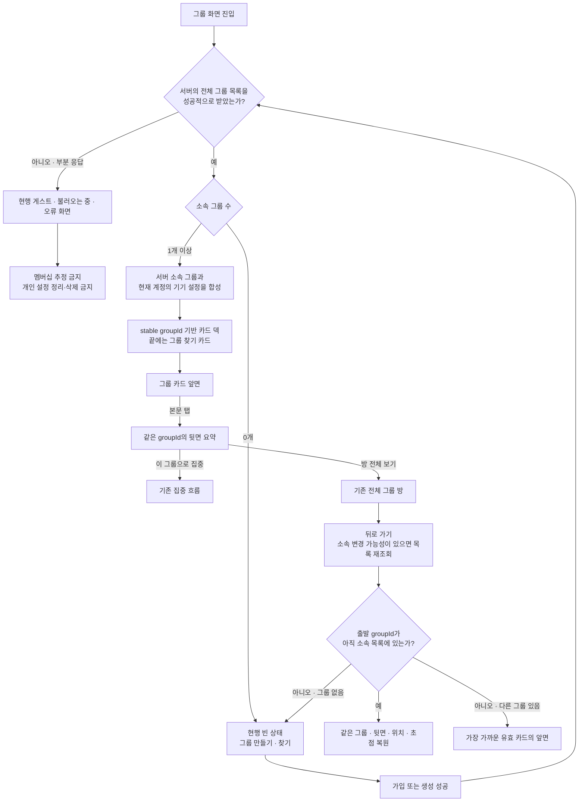
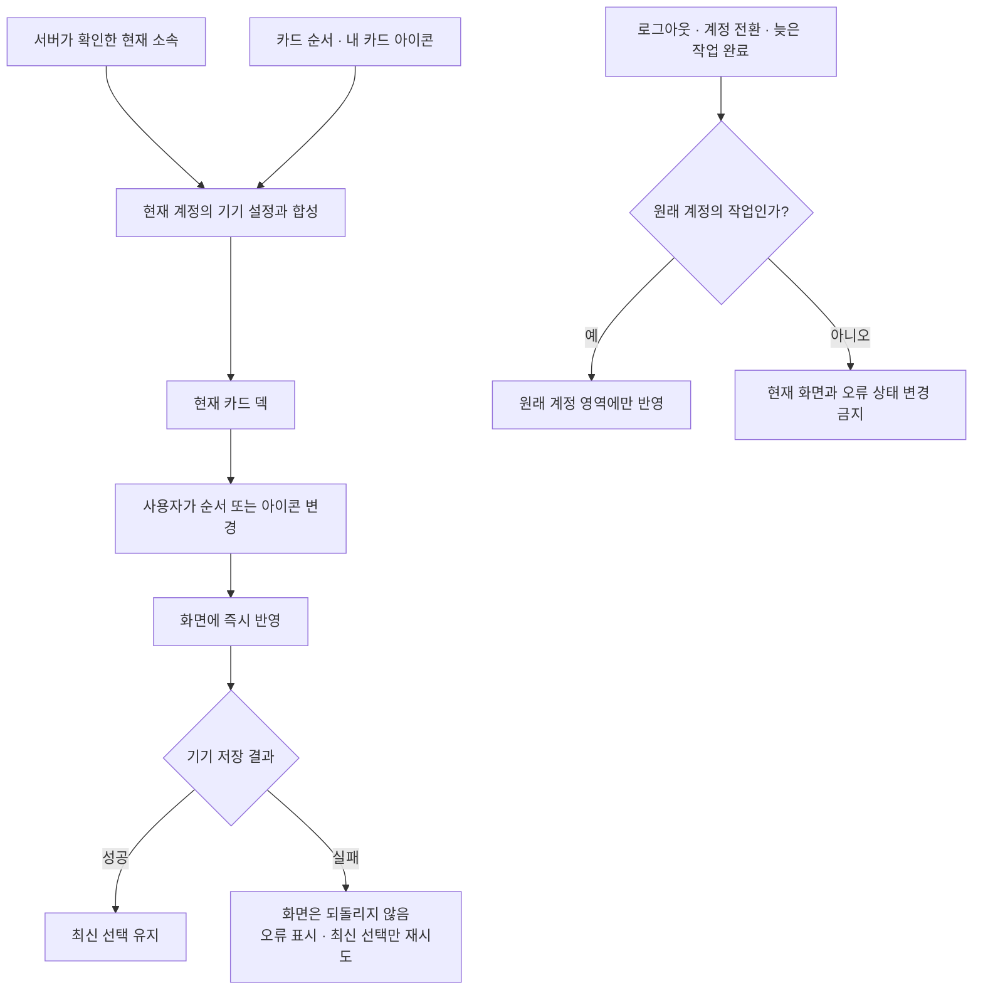
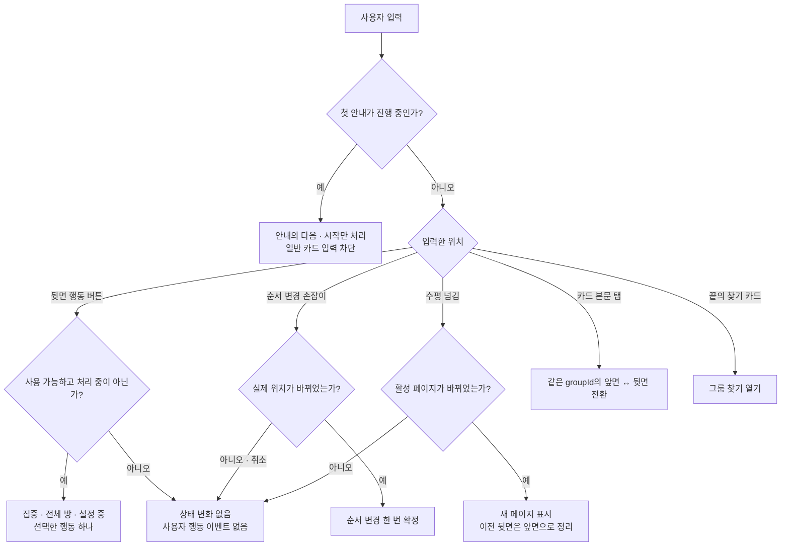
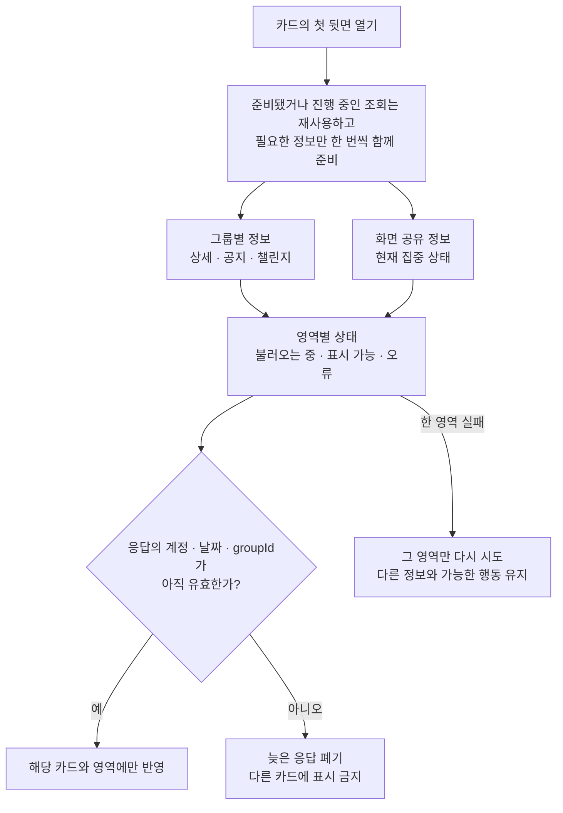
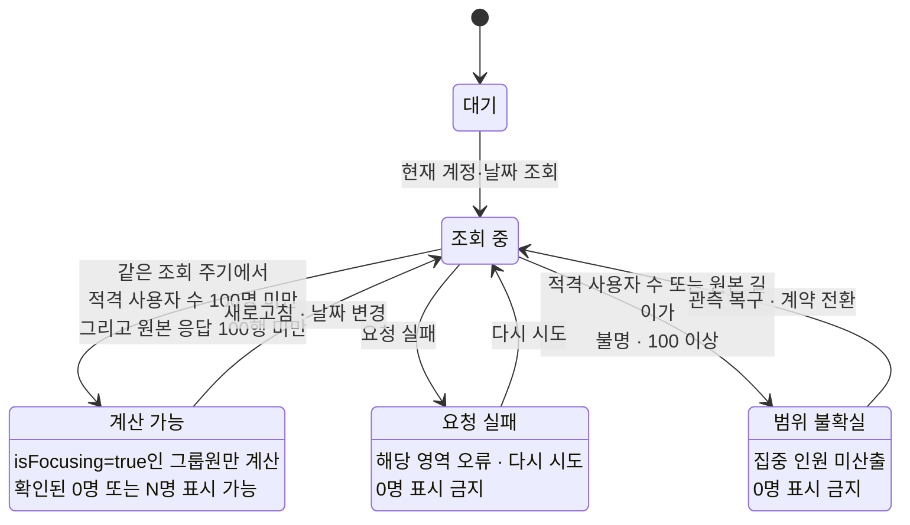
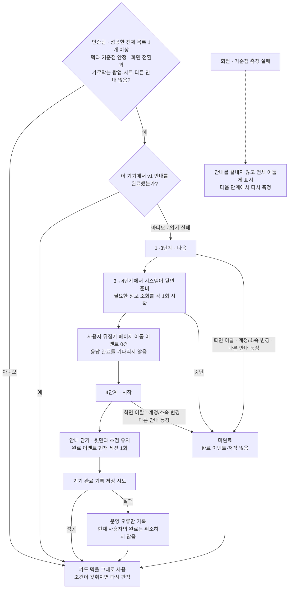
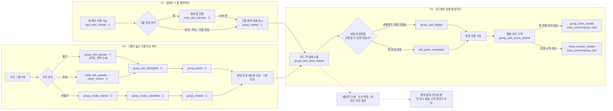
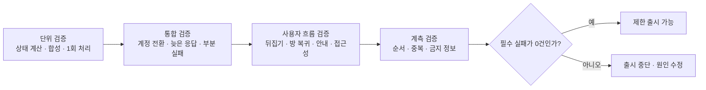

# Feature LLD — 내 그룹 카드 덱 v1.1

| 항목 | 내용 |
| --- | --- |
| 상위 정본 | [그룹 PRD](../../prd.md) · [Feature PRD](./prd.md) · [Feature IA](./information-architecture.md) · [HLD](./high-level-design.md) |
| 역할 | 카드 덱의 상태 전이·실패 복구·검증 기준을 그림으로 확정한다. |
| 문서 범위 | 구현 정책과 예외만 다룬다. 코드·타입·컴포넌트 목록·시각 수치는 반복하지 않는다. |
| 구현 상태 | **🟡 일부 구현** — 핵심 테스트 88개와 TypeScript 검사는 통과; guide queue·중단·저장 실패 telemetry와 일부 공통 이벤트는 남음 |

PRD가 제품 결정을, IA가 화면과 정보 구조를, HLD가 시스템 책임을 정한다. 이 문서는 그 결정을 바꾸지 않고 **어떤 상태 전이만 허용할지**를 정한다.

---

## 1. 그룹 카드의 정체성과 화면 복구

- 그룹의 신원·캐시·뒤집힘·방 복귀는 모두 `groupId`로 판단한다. index는 화면 위치일 뿐이다.
- 끝의 그룹 찾기 카드는 서버 그룹, 저장 순서, 순서 변경 대상이 아니다. 다만 전체 페이지 수와 현재 페이지 표시에는 `그룹 수 + 1`로 포함한다.
- 실패하거나 일부만 받은 목록은 탈퇴·삭제의 증거로 쓰지 않는다.
- 가입·생성 직후에도 전체 목록 재조회가 성공해야 카드 덱으로 전환한다.

---

## 2. 카드 순서·아이콘 저장과 계정 경계

- 순서와 아이콘은 **현재 계정이 현재 기기에서 보는 방식**일 뿐이며 서버 속성이 아니다.
- 오래된 값을 정리하는 작업은 전체 그룹 목록을 성공적으로 받은 경우에만 한다.
- 순서와 아이콘 저장은 각각 순서대로 처리하며, 저장 직전에 최신 값을 합성해 마지막 선택이 이긴다.
- 늦은 과거 작업은 다른 계정의 화면·오류·이벤트를 바꾸지 못한다.
- 생성 화면의 아이콘은 서버가 생성에 성공해 `groupId`가 생긴 뒤에만 저장한다.

---

## 3. 한 번의 입력은 한 가지 결과만 만든다

- 순서 변경 중에는 카드 넘김과 뒤집기를 시작하지 않는다.
- 수평 넘김이 시작되면 본문 탭은 취소한다.
- 접근성의 `앞으로 이동`·`뒤로 이동`도 같은 순서 변경 결과로 합류한다.
- 안내의 자동 뒤집기, 다시 그리기, 애니메이션 완료, 취소 입력은 사용자 행동으로 기록하지 않는다.

---

## 4. 카드 뒷면 데이터와 늦은 응답

- 새 카드 요약 API를 만들지 않고 기존 상세·공지·챌린지·현재 집중 상태를 조합한다.
- 다시 열린 뒷면은 준비된 결과와 진행 중인 조회를 재사용하며 같은 요청을 중복 시작하지 않는다.
- 각 영역은 독립적으로 `불러오는 중 · 표시 가능 · 오류` 상태를 가진다. 실패한 영역만 다시 시도한다.
- 한 영역의 실패는 다른 영역과 `이 그룹으로 집중`·`방 전체 보기`를 막지 않는다. 단, 소속이 사라지면 행동을 중단한다.
- 늦은 응답은 원래 `groupId`에만 반영하며, 그 그룹이 더 이상 유효하지 않으면 버린다.
- 전체 그룹 방은 자신의 기존 정보를 다시 조회한다. 카드의 임시 조합 결과를 방의 정본으로 넘기지 않는다.

---

## 5. 현재 집중 인원은 완전한 정보에서만 계산한다

- `eligible_user_count < 100`과 원본 응답 길이 `< 100`이 **같은 조회 주기에서 모두 확인될 때만** 응답에 없는 멤버를 `집중하지 않음`으로 본다.
- 현재 집중 상태는 `현재 계정 + 날짜` 기준으로 화면에서 공유하고, 동시에 같은 요청을 여러 번 보내지 않는다.
- 90~99명 또는 90~99행이면 대체 계약의 담당자·티켓·배포일을 확정한다.
- 100명에 도달하기 전에 완전한 서버 계약으로 전환한다. 값이 불명인 경우에는 우선 미산출·재시도·관측 복구로 처리한다.

---

## 6. 첫 카드 덱 안내

- 완료 기록은 기기 전체 키 `gromo:guide:groupDeck:v1`을 사용한다.
- 1~3단계 행동은 `다음`, 마지막 행동만 `시작`이다.
- 완료 기록 읽기에 실패해도 현재 화면 세션에서는 안내를 한 번만 시도한다.
- 4단계는 각 요약 영역의 `불러오는 중 · 표시 가능 · 오류`를 그대로 보여 준다.
- 완료 이벤트는 마지막 `시작`으로 안내가 닫힌 직후 기록하고, 기기 저장은 그 다음에 시도한다.
- 저장 실패는 현재 foreground에서 안내를 다시 띄우지 않지만, 다음 앱 실행에서는 다시 노출될 수 있다.

---

## 7. 계측은 노출·의도·결과를 분리한다

- 화면을 본 것, 행동을 선택한 것, 실제 결과가 발생한 것을 서로 다른 단계로 기록한다.
- 자동 전환, 다시 그리기, 크기 변경, 애니메이션, 취소, 재시도는 사용자 행동 이벤트가 아니다.
- 클라이언트 이벤트는 공통 계측 경계를 통해 한 번만 발행한다.
- 그룹명·소개·아이콘 문자·전체 순서·원본 userId는 이벤트에 넣지 않는다.
- `C`는 클라이언트, `S`는 서버 확정 결과다. 세부 이벤트 속성·`back_source` 수명·방 30초/집중 10분 결과 귀속은 [HLD §6.4~6.6](./high-level-design.md#64-guide-계측-계약)을 정본으로 사용한다.

---

## 8. 구현·출시 검증

필수 출시 게이트는 네 가지다.

1. **정체성·복귀:** 재정렬·목록 갱신·방 왕복 뒤에도 같은 `groupId`를 가리키며, 사라진 카드는 복원하지 않는다.
2. **개인화·늦은 응답:** 빠른 변경과 계정 전환에서도 최신 의도와 계정 영역을 보존하고, 과거 응답을 다른 카드에 표시하지 않는다.
3. **데이터 신뢰:** 부분 실패는 해당 영역에만 남고, 집중 상태의 불명·실패·100 이상을 `0명`으로 표시하지 않는다.
4. **안내·접근성·계측:** 안내의 읽기·중단·저장 실패와 자동 전환을 각각 검증한다. 자동 전환의 사용자 이벤트는 0건이고 완료 이벤트는 저장 성공과 무관하게 1건이다. 그룹명은 모든 위치에서 1줄 말줄임, 접근성 이름은 원문 전체이며, DebugView의 노출 → 의도 → 결과 순서·중복·금지 정보를 확인한다.

## 9. 구현 전에 확정할 두 가지

1. 방에서 돌아왔을 때 출발 그룹이 사라진 경우, `가장 가까운 유효 카드`를 고르는 정확한 우선순위.
2. 첫 안내의 `덱과 기준점이 안정됨`을 판정하는 신호와 다른 안내를 기다리는 최대 시간.
