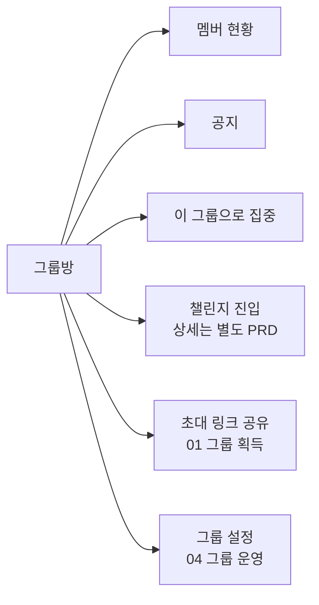
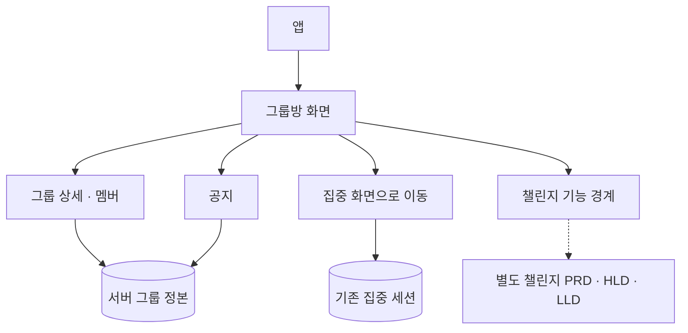
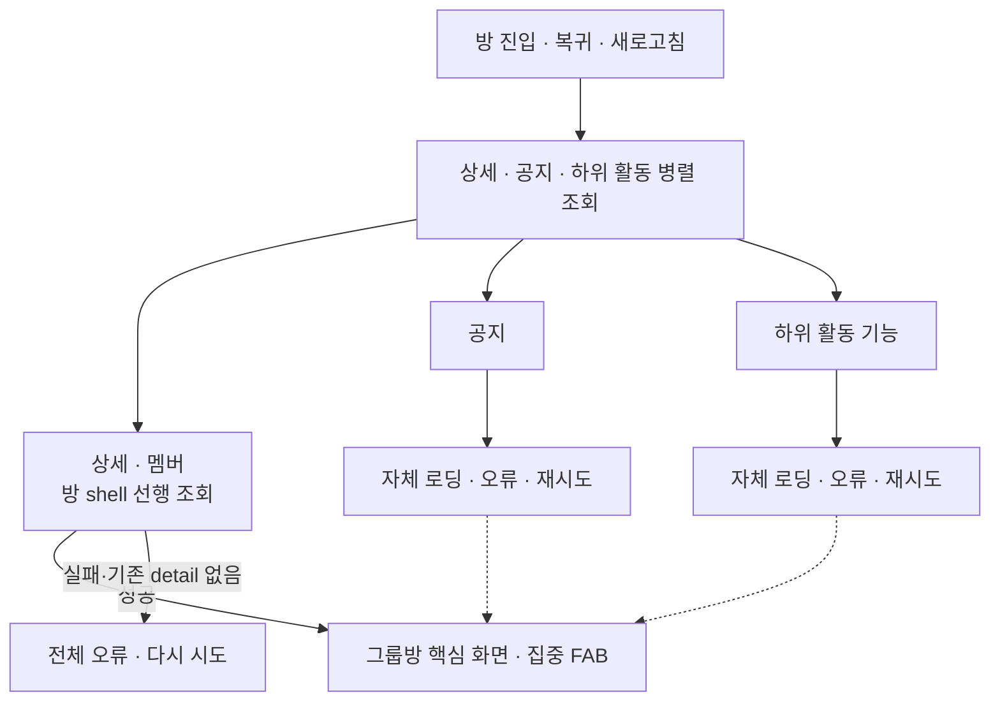

# HLD — 그룹 활동

| 항목      | 내용                                                                                                              |
| --------- | ----------------------------------------------------------------------------------------------------------------- |
| 시작      | [구현 착수 카드](./README.md)                                                                                     |
| 상위 정본 | [그룹 PRD](../../prd.md) · [그룹 IA](../../information-architecture.md)                                           |
| 범위      | 그룹방, 멤버 현황, 공지, 그룹 맥락의 집중 진입                                                                    |
| 구현 상태 | [공통 상태 정본](../../shared/implementation-status.md)의 `GRP-03`을 따른다.                                      |
| 별도 문서 | **챌린지는 그룹방 안에 노출되지만 상세 정책·설계·구현은 [챌린지 문서 세트](../../../challenge/README.md)가 소유** |

카드 덱은 02, 초대 링크 발급·공유는 01, 역할·멤버십 관리는 04가 소유한다. 이 문서는 챌린지의 상세 정책과 구현을 정의하지 않는다.

## 1. 사용자 약속

- 그룹원은 전체 방에서 현재 멤버와 공지를 확인하고, 같은 `groupId` 맥락으로 집중을 시작한다.
- 공지는 방장 또는 서버가 허용한 멤버가 작성·수정·삭제한다.
- 챌린지는 그룹방의 하위 기능으로 보이지만, 내부 정책과 성공 기준은 이 문서에서 판단하지 않는다.

## 2. 책임과 정보 정본

| 영역           | 정본과 책임                       | 앱이 해서는 안 되는 일                        |
| -------------- | --------------------------------- | --------------------------------------------- |
| 소속·역할·멤버 | 서버 상세의 현재 그룹원과 역할    | 과거 목록이나 로컬 설정으로 소속·권한 추정    |
| 공지           | 서버 최신 목록과 쓰기 권한        | 실패한 쓰기를 성공으로 표시하거나 임의 재정렬 |
| 집중 진입      | 기존 집중 흐름에 전달한 `groupId` | 그룹방에서 세션 성공을 미리 가정              |
| 챌린지         | 별도 챌린지 문서                  | 이 문서에서 상세 정책 재정의                  |

## 3. 독립 조회와 실패 격리

- 상세는 그룹방 shell과 집중 FAB를 표시하기 위한 선행 데이터다. 최초 상세 조회가 실패하고 기존 detail도 없으면 전체 오류와 재시도만 표시한다.
- 상세·공지·하위 활동 요청은 함께 시작할 수 있지만, detail 성공 전에는 방 shell·공지·집중 FAB를 표시하지 않는다.
- 상세가 성공한 뒤 공지와 하위 활동은 서로 독립적으로 성공하거나 실패할 수 있다. 이 하위 영역의 실패는 다른 성공 영역과 집중 진입을 막지 않는다.
- 하위 활동 기능의 오류는 detail이 준비된 그룹방 전체를 거짓 빈 상태로 만들지 않는다.
- 네트워크 실패는 탈퇴·강퇴의 증거가 아니다. 서버가 현재 소속 없음으로 확인한 경우에만 상위 탐색으로 안전하게 돌아간다.

## 4. 구현 경계

- 그룹방은 선택한 `groupId`의 서버 정보를 직접 조회한다. 카드 요약 캐시를 방의 정본으로 사용하지 않는다.
- 집중 버튼은 `initialGroupId`를 기존 집중 흐름에 전달한다. 집중이 끝나면 시작한 그룹방 맥락으로 돌아와 필요한 정보를 다시 확인한다.
- 공지 변경은 서버 성공 뒤 목록을 다시 확인한다. 권한은 요청 시 서버가 최종 검증한다.
- 챌린지 관련 화면·API·동시성·계측·테스트는 [챌린지 PRD](../../../challenge/prd.md)·[HLD](../../../challenge/high-level-design.md)·[LLD](../../../challenge/low-level-design.md)를 정본으로 연결한다.
