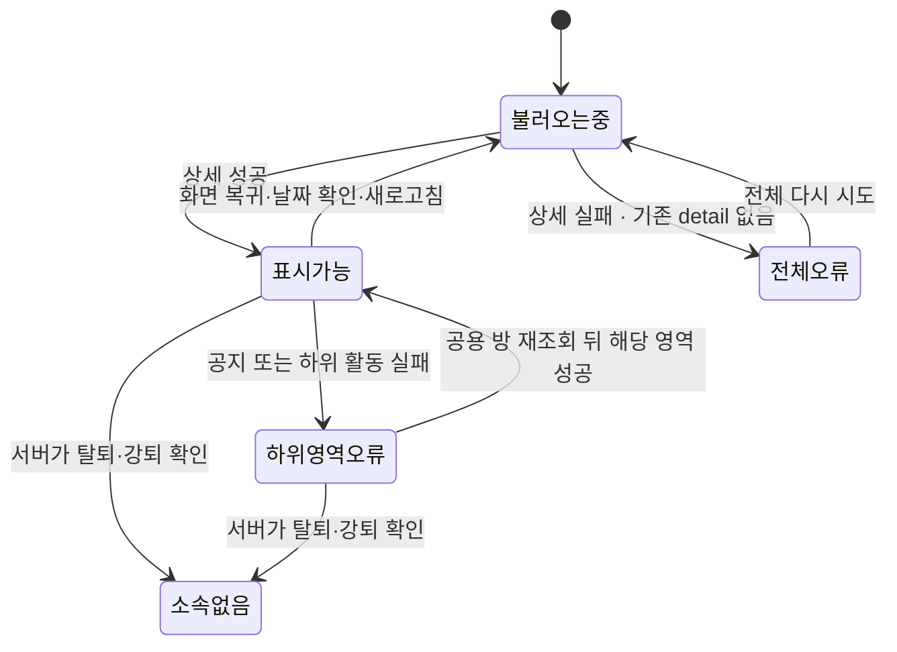
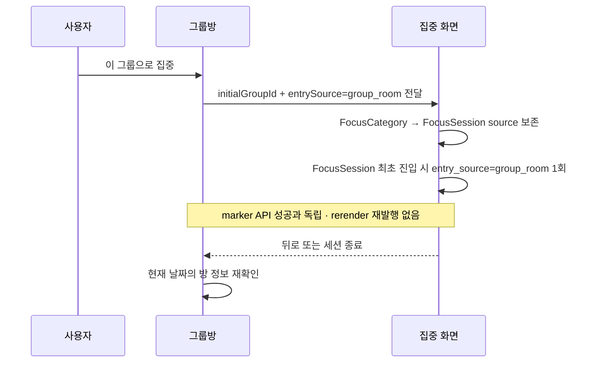
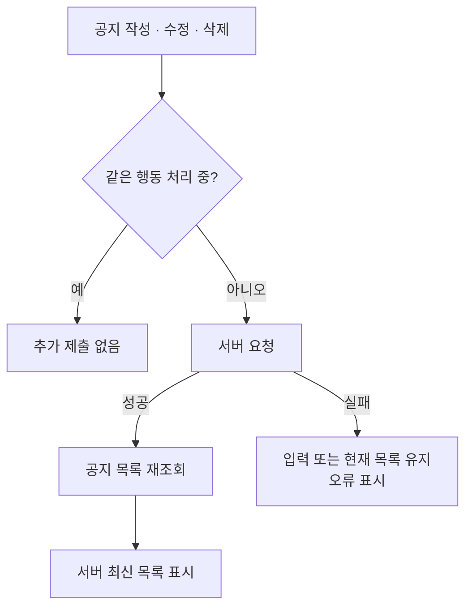
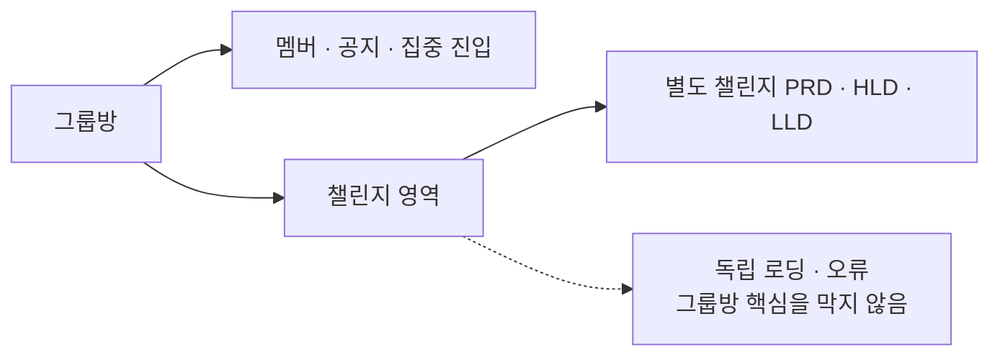

# LLD — 그룹 활동

| 항목      | 내용                                                                                                              |
| --------- | ----------------------------------------------------------------------------------------------------------------- |
| 시작      | [구현 착수 카드](./README.md)                                                                                     |
| 상위 정본 | [그룹 활동 HLD](./high-level-design.md) · [그룹 PRD](../../prd.md) · [그룹 IA](../../information-architecture.md) |
| 범위      | 그룹방 핵심 조회, 늦은 응답 격리, 공지 변경, 집중 진입·복귀                                                       |
| 구현 상태 | [공통 상태 정본](../../shared/implementation-status.md)의 `GRP-03`을 따른다.                                      |
| 별도 문서 | 챌린지의 상세 실행 계약과 테스트는 [챌린지 LLD](../../../challenge/low-level-design.md)로 이관                    |

## 1. 방 상태와 늦은 응답

- 요청은 시작한 `groupId`, 날짜, 화면 세대가 현재 맥락과 같을 때만 반영한다.
- 최초 상세 실패와 기존 detail 없음은 전체 오류다. detail이 준비된 뒤에만 공지·하위 활동의 늦은 실패가 다른 성공 영역을 비우거나 집중 진입을 막지 않는다.
- 현행 오류 버튼은 detail·공지·하위 활동을 함께 다시 요청하는 공용 `reload`를 사용한다. 성공·실패 결과는 영역별로만 반영하며, 특정 영역 요청만 재시도하는 구현은 아직 없다.
- 네트워크 오류는 재시도 상태다. 소속 없음이 서버에서 확인된 경우에만 상위 화면으로 복귀한다.

## 2. 집중 진입과 방 복귀

- ✅ `initialGroupId` 전달과 복귀 뒤 재조회는 구현되어 있다.
- ⬜ 공통 Focus route/helper가 `group_room|home_fab|unknown`을 `FocusCategory → FocusSession`에 보존하고 최초 진입 이벤트 payload에 싣는 변경은 아직 구현되지 않았다. `group_card`는 02 작업 패키지가 같은 공통 경계를 사용한다. source를 `initialGroupId`에서 추론하지 않는다.
- ⬜ 집중 버튼을 같은 순간 빠르게 두 번 누를 때 navigation을 정확히 한 번만 수락하는 잠금은 아직 없다.
- 🟡 날짜 변경은 포그라운드 복귀·수동 새로고침에서 확인한다. 화면을 계속 연 채 자정을 넘기는 자동 경계 감지는 아직 없다.

## 3. 공지 변경

- 공지 권한은 화면 표시와 별개로 서버가 요청 시 다시 검증한다.
- 성공 응답 뒤 서버 목록으로 수렴하며, 실패한 변경을 낙관적으로 남기지 않는다.

## 4. 하위 기능 경계

이 문서는 챌린지의 상세 상태를 정의하거나 구현 완료로 판정하지 않는다. 그룹방은 해당 기능의 진입점과 실패 격리만 보장한다.

## 5. 검증 상태

| 검증                                                                                                    | 상태                                                        |
| ------------------------------------------------------------------------------------------------------- | ----------------------------------------------------------- |
| 최초 상세 실패 시 전체 오류·다시 시도, detail 성공 뒤 공지·하위 영역 실패 시 다른 영역과 집중 진입 유지 | ✅ 구현·화면 테스트 있음                                    |
| 다른 `groupId`·날짜·화면의 늦은 응답 폐기                                                               | ✅ 구현됨                                                   |
| 공지 권한 변경·실패·재조회                                                                              | ✅ 구현·테스트 있음                                         |
| 공지·하위 영역 오류 버튼의 공용 재조회와 성공 영역 보존                                                 | 🟡 현행 구현·호출 범위 회귀 테스트 보강 필요                |
| 특정 오류 영역의 요청만 다시 보내는 영역별 retry                                                        | ⬜ 미구현                                                   |
| 집중 버튼 빠른 이중 탭 차단                                                                             | ⬜ 미구현                                                   |
| 공통 Focus route의 `group_room`, `home_fab`, `unknown` 보존·정규화와 최초 진입 이벤트 1회               | ⬜ 미구현                                                   |
| 열린 화면에서 자정 경계 자동 갱신                                                                       | ⬜ 미구현                                                   |
| 권한 변경과 제출이 겹치는 전체 E2E                                                                      | ⬜ 검증 미작성                                              |
| 챌린지 상세 검증                                                                                        | [챌린지 LLD](../../../challenge/low-level-design.md)로 이관 |
