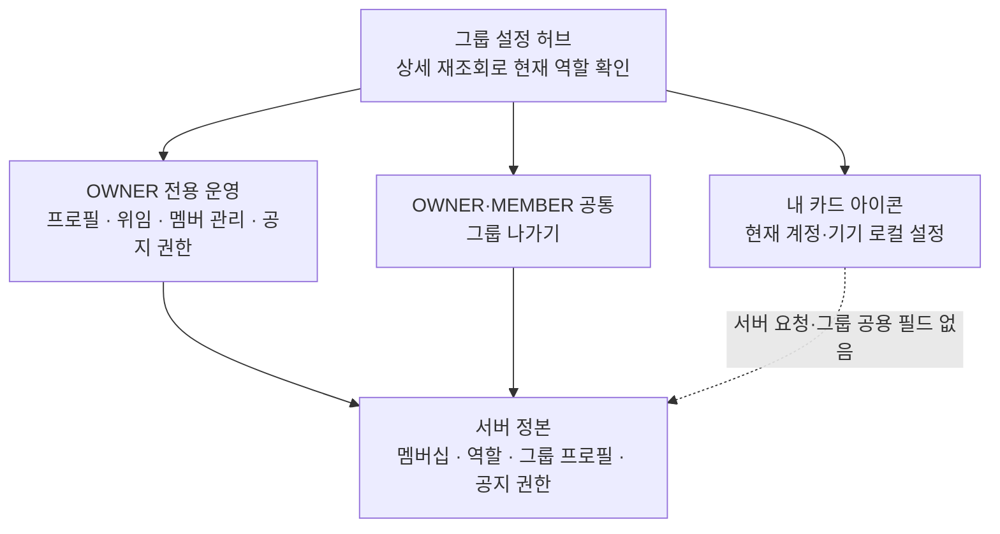
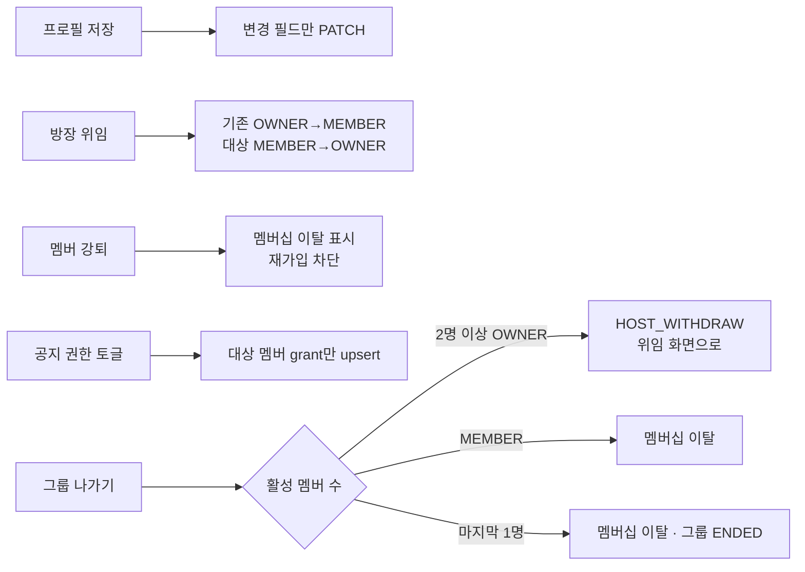
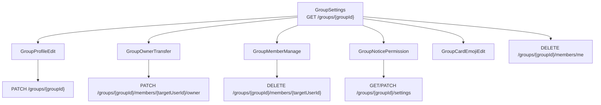

# HLD — 그룹 운영

| 항목      | 내용                                                                                                 |
| --------- | ---------------------------------------------------------------------------------------------------- |
| 상위 정본 | [PRD](../../prd.md) · [IA](../../information-architecture.md)                                                              |
| 범위      | 그룹 프로필, 역할·위임, 멤버 강퇴, 공지 권한, 그룹 나가기 및 `내 카드 아이콘` 설정 진입              |
| 비범위    | 카드 덱·그룹 가입·공지 작성·챌린지 운영의 상세 동작                                                  |
| 구현 상태 | **🟡 일부 구현** — 주요 화면·서버 권한은 구현됨; 일부 하위 화면의 최신 역할 재검증과 통합 E2E는 남음 |

그룹 운영은 기존 `GroupSettings` 허브와 서버 권한을 재사용한다. 화면이 OWNER 행을 숨겨도 권한의 정본은 서버다.

## 1. 책임과 권한 경계

| 기능           | OWNER | MEMBER | 서버 경계                                                       |
| -------------- | ----- | ------ | --------------------------------------------------------------- |
| 그룹 프로필    | 가능  | 불가   | `PATCH /groups/{groupId}`; 이름·소개·정원·공개 범위의 부분 수정 |
| 방장 위임      | 가능  | 불가   | 대상 활성 멤버를 OWNER로, 기존 OWNER를 MEMBER로 변경            |
| 멤버 강퇴      | 가능  | 불가   | 대상 soft-delete·재가입 차단, 자기 자신 강퇴 불가               |
| 공지 권한      | 가능  | 불가   | `announcementGrants`만 수정; OWNER는 항상 허용·토글 불가        |
| 내 카드 아이콘 | 가능  | 가능   | 02의 로컬 편집기로 진입; 서버 역할·그룹 속성은 불변             |
| 그룹 나가기    | 가능  | 가능   | MEMBER는 탈퇴, 다인 OWNER는 위임 뒤 탈퇴                        |

- 허브와 각 운영 화면은 상세의 `members[].role`에서 내 역할을 다시 계산한다. 이전 화면의 역할·캐시는 권한 근거가 아니다.
- `내 카드 아이콘`의 저장 키·계정 격리·직렬화 쓰기·실패 복구는 [02 내 그룹 탐색 HLD §7.1](../02-my-groups/high-level-design.md#71-계정별기기-로컬-카드-이모지)을 정본으로 한다. 04는 OWNER·MEMBER 모두가 설정 허브에서 편집기로 진입할 수 있음만 보장하며, 아이콘을 역할·서버 권한 판단에 사용하지 않는다.

## 2. 운영 흐름과 데이터 영향

- 위임·강퇴·탈퇴는 그룹 멤버십을 바꾸므로 복귀한 허브·방·덱은 목록/상세를 다시 읽어야 한다.
- 강퇴 시 진행 중 내기 판돈은 이 기능에서 변경하지 않는다. 탈퇴는 서버 트랜잭션에서 열린 내기 참여를 해제·환불/정리한다.
- 마지막 1인의 탈퇴만 그룹 `ENDED` 전이를 만든다. 챌린지 `INACTIVE`와 그룹 `ENDED`는 다른 상태다.

## 3. 화면과 기존 API

`GroupRoom`의 설정 진입과 카드 뒷면 설정 진입은 같은 허브를 사용한다. 운영 기능은 새 route·DTO·서버 API를 추가하지 않는다.

## 4. 설계 검증

- OWNER/MEMBER 각각에서 노출 행과 서버 거절을 함께 검증한다.
- 위임·강퇴·탈퇴 뒤 포커스 재조회가 바뀐 역할·멤버십을 반영해야 한다.
- 로컬 아이콘 저장 성공/실패는 그룹 프로필 저장·권한·멤버십 결과를 바꾸지 않는다.
