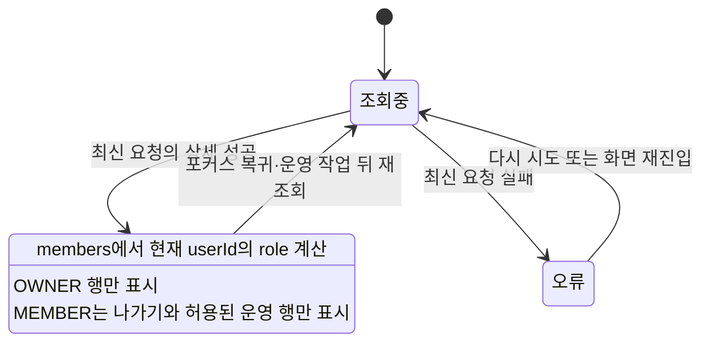
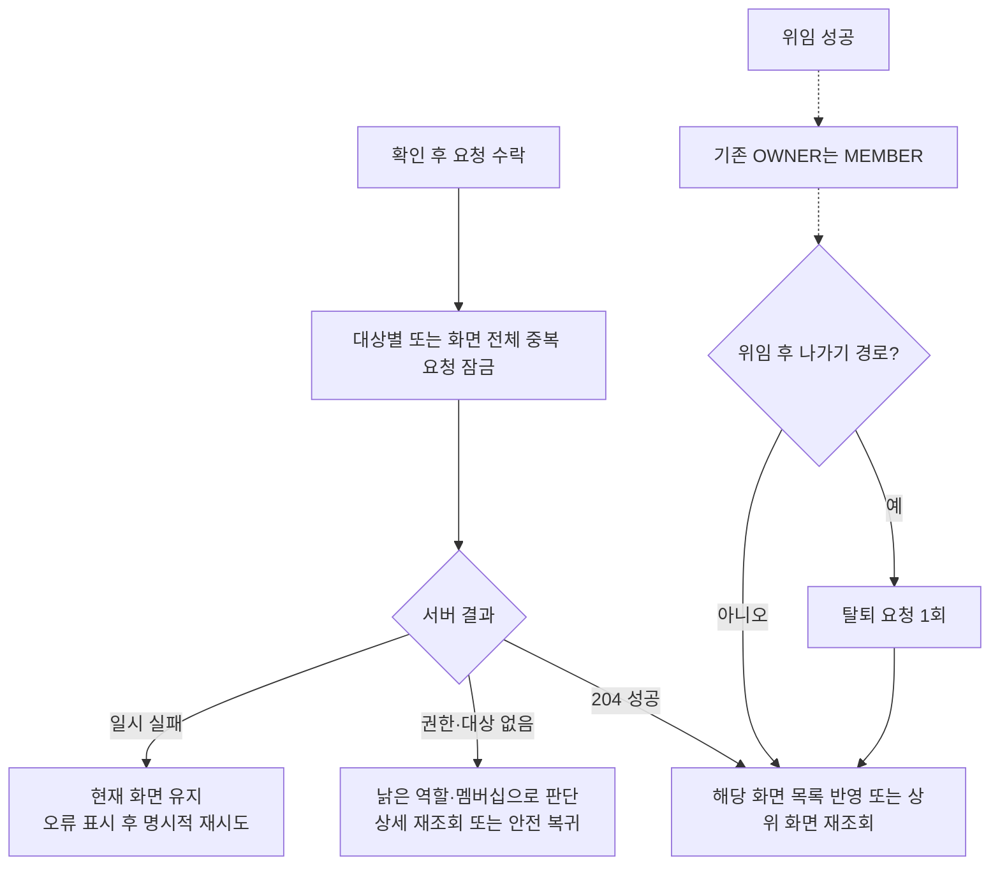
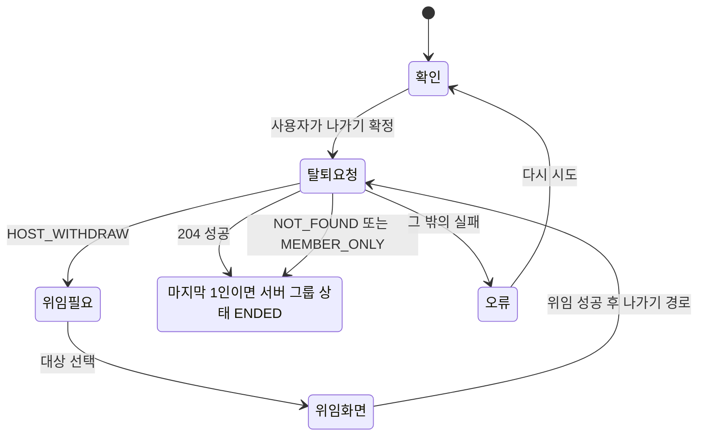
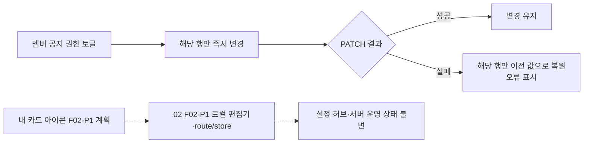

# LLD — 그룹 운영 상태·복구

| 항목      | 내용                                                                         |
| --------- | ---------------------------------------------------------------------------- |
| 시작      | [구현 착수 카드](./README.md)                                                |
| 상위 정본 | [HLD](./high-level-design.md) · [그룹 PRD](../../prd.md)                     |
| 역할      | 기존 운영 API의 상태 전이, 중복 요청·늦은 응답·실패 복구를 고정한다.         |
| 구현 상태 | [공통 상태 정본](../../shared/implementation-status.md)의 `GRP-04`를 따른다. |

## 1. 상세 재조회와 역할 변경

- 화면마다 요청 세대를 올린다. 이전 `GET /groups/{groupId}` 응답은 최신 role·멤버 목록을 덮지 않는다.
- 상세가 실패하면 운영 버튼을 추정해 활성화하지 않고 오류와 다시 시도를 보인다.

## 2. 되돌릴 수 없는 멤버십 작업

- 위임 대상은 본인을 제외한 현재 멤버다. 위임 중에는 대상 변경·재탭·뒤로가기를 잠근다.
- `source=withdraw`에서 위임은 성공했지만 탈퇴가 실패할 수 있다. 이때 위임을 되돌리지 않으며, 사용자는 MEMBER 상태에서 나가기를 다시 시도한다.
- 강퇴는 자기 자신에게 보이지 않아야 하며, 서버의 `CANNOT_KICK_SELF`·권한·대상 없음은 성공으로 가장하지 않는다.

## 3. 나가기와 마지막 1인

- `NOT_FOUND`·`MEMBER_ONLY`는 이미 그룹에 없는 안전한 종료로 처리한다.
- 마지막 1인의 `ENDED`는 서버 결과다. 앱이 멤버 수를 보고 미리 종료를 만들지 않는다.
- 탈퇴·강퇴·계정 탈퇴는 [01 획득 링크 수명 계약](../01-acquisition/low-level-design.md#21-초대-링크-수명과-이탈-경합)에 따라 발급자의 active 링크를 같은 transaction에서 폐기한다. OWNER 위임만으로는 폐기하지 않는다.

## 4. 공지 권한과 02 `F02-P1` 로컬 편집 의존성

- OWNER의 공지 권한은 토글하지 않는다. PATCH는 대상 멤버의 `announcementGrants`만 보낸다.
- 아이콘 저장·복구는 [02 내 그룹 탐색 LLD §2](../02-my-groups/low-level-design.md#2-카드-순서아이콘-저장과-계정-경계)를 따른다. 현재 운영 화면에는 편집 진입이 없으며, 02 `F02-P1`에서 로컬 편집기와 앱 route/store가 추가된 뒤 04는 그 진입과 서버 운영 상태의 독립성만 검증한다.

## 5. 필수 검증

| 수준 | 확인                                                                                                                             |
| ---- | -------------------------------------------------------------------------------------------------------------------------------- |
| 단위 | OWNER/MEMBER 행 분기, 자기 위임·자기 강퇴 제외, 마지막 1인·`HOST_WITHDRAW` 분기, grant rollback, 02 `F02-P1` 아이콘 실패 독립성  |
| 통합 | 위임 후 hub 재조회, 위임 뒤 탈퇴 실패, 강퇴/권한 변경 중 늦은 상세 응답, 이탈 transaction의 발급 링크 폐기·old claim no-op       |
| E2E  | MEMBER 나가기, 다인 OWNER 위임 후 나가기, 마지막 1인 `ENDED`, 강퇴 후 old slug·미claim click·목록·방 접근 불가, 비활성 토글 제외 |

분석 이벤트의 정확한 속성·발행 주체는 상위 [HLD](./high-level-design.md)와 공통 분석 정본을 따른다. 이 문서는 새 제품 이벤트를 정의하지 않는다.
