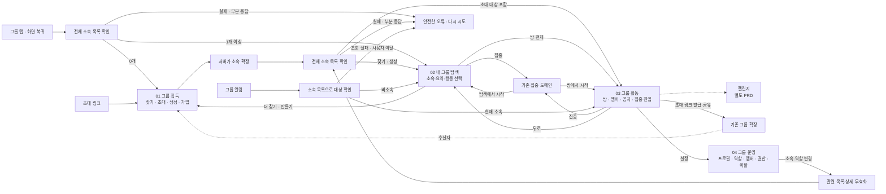
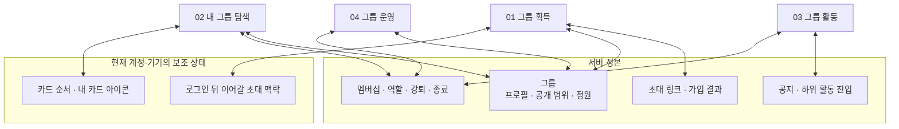
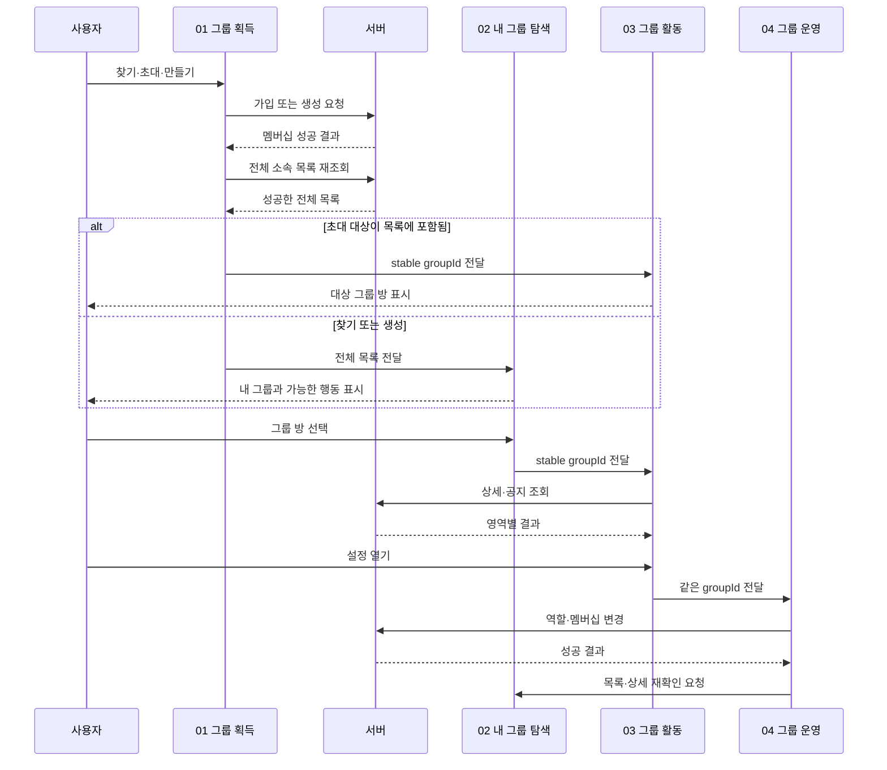
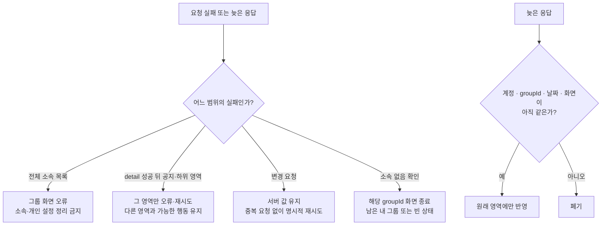
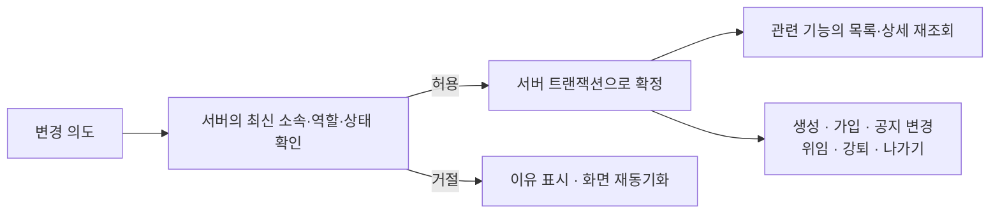

# HLD — 그룹 생애주기 통합 설계

| 항목 | 내용                                                                                             |
| ---- | ------------------------------------------------------------------------------------------------ |
| 상위 | [그룹 PRD](./prd.md) · [그룹 IA](./information-architecture.md)                                  |
| 하위 | [통합 LLD](./low-level-design.md) · [기능별 상세 문서](./README.md)                              |
| 역할 | 01 그룹 획득, 02 내 그룹 탐색, 03 그룹 활동, 04 그룹 운영의 책임과 연결을 한 문서에서 보여 준다. |
| 제외 | 카드 치수, 화면별 컴포넌트, API 요청 body, 세부 오류 코드는 기능별 HLD·LLD를 따른다.             |

---

## 0. 구현 상태

기준은 **2026-08-10 `origin/main`(`595bd822`)**이다. 배포·스토어 출시 상태를 뜻하지 않는다.

| 표시         | 의미                                              |
| ------------ | ------------------------------------------------- |
| ✅ 구현됨    | 현재 앱·서버 코드에서 주요 흐름 확인              |
| 🟡 일부 구현 | 핵심 코드는 있으나 일부 정책·안전장치·검증이 남음 |
| ⬜ 미구현    | 문서 계약은 있으나 대응 코드를 확인하지 못함      |

| 기능            | 상태                | 현재 코드에서 확인                                          | 남은 범위                                                                                 |
| --------------- | ------------------- | ----------------------------------------------------------- | ----------------------------------------------------------------------------------------- |
| 01 그룹 획득    | 🟡 일부 구현        | 찾기·직접/복원 초대·생성·가입·목록 재확인·초대 대상 방 이동 | 비공개 그룹의 invite-only 서버 enforcement, 생성 요청의 같은 순간 이중 탭 방지            |
| 02 내 그룹 탐색 | ⬜ 설계 완료·미구현 | 기능 문서의 덱·플립·재정렬·로컬 아이콘·guide 계약           | 앱 덱/플립/재정렬/아이콘/guide 코드와 이벤트·검증 전체                                    |
| 03 그룹 활동    | 🟡 일부 구현        | 그룹방·멤버·공지·집중 진입                                  | 최초 detail 실패 시 전체 오류와 집중 숨김; detail 성공 뒤 공지·하위 영역만 독립 실패 격리 |
| 04 그룹 운영    | 🟡 일부 구현        | 설정 허브·프로필·위임·강퇴·공지 권한·나가기                 | 일부 하위 화면의 최신 역할 재검증·통합 E2E, 02 P1 아이콘 편집 의존성                      |

---

## 1. 기능 책임과 생애주기 연결

- `01`은 소속을 얻는 과정, `02`는 소속 이후의 탐색, `03`은 공동 활동, `04`는 공동 관계의 변경을 소유한다.
- 기능 간 전달값의 신원은 항상 `groupId`다. 화면 index·이름·카드 위치는 전달 계약이 아니다.
- 소속·역할이 바뀌면 관련 화면이 각자 추정하지 않고 서버 목록·상세를 다시 확인한다.
- 초대 가입은 목록에서 대상 소속을 확인한 뒤 해당 방으로 가고, 찾기·생성은 내 그룹 탐색으로 합류한다. 집중이 끝나면 시작한 탐색 또는 방 맥락으로 돌아온다.

---

## 2. 데이터 정본과 개인 상태의 경계

| 정보                     | 정본                  | 허용되는 로컬 역할                                        |
| ------------------------ | --------------------- | --------------------------------------------------------- |
| 소속·역할·정원·공개 범위 | 서버                  | 마지막 확인 결과를 표시할 수 있으나 새 사실을 만들지 않음 |
| 공지·하위 활동           | 서버                  | 공지 입력 draft만 보조; 하위 기능 상세는 별도 문서        |
| 초대 목적지              | 서버 링크의 `groupId` | 인증 전후에 같은 초대 맥락을 잠시 보관                    |
| 카드 순서·내 카드 아이콘 | 현재 계정·기기        | 표시만 변경, 서버 DTO·권한·다른 사용자 화면에 영향 없음   |

---

## 3. 기능 사이의 성공 계약

- 가입·생성 API 성공과 화면 소속 반영은 별도 단계다. 전체 목록 확인 실패를 빈 상태나 중복 요청으로 되돌리지 않는다.
- 그룹 방은 카드 요약 캐시를 정본으로 받지 않고 자신의 서버 정보를 조회한다.
- 운영 성공 뒤에는 이전 역할·멤버·소속 캐시를 그대로 사용하지 않는다.

---

## 4. 실패 격리와 안전한 복귀

- 현재 그룹방은 최초 detail 조회가 실패하면 전체 오류를 보이며 집중 진입도 제공하지 않는다. detail이 성공한 뒤 공지·하위 영역의 실패만 각 영역에서 격리한다.
- 네트워크 실패는 탈퇴·강퇴·그룹 종료의 증거가 아니다.
- `403/404`도 기능별 의미를 확인한 뒤 소속 없음과 단순 권한 변경을 구분한다.
- 불완전한 값은 `0명`이나 빈 공지처럼 정상 데이터로 강하하지 않는다.

---

## 5. 권한과 비가역 행동

- 공동 프로필·방장 위임·멤버 강퇴·공지 권한 관리는 OWNER 전용이다.
- 공지 권한을 받은 MEMBER는 공지를 작성·수정·삭제할 수 있으며 서버가 요청 시 다시 검증한다.
- 카드 순서와 내 카드 아이콘 실패는 공동 상태 변경을 취소하지 않는다.

---

## 6. 기능별 상세 정본

| 번호 | 기능         | HLD                                                        | LLD                                                       |
| ---- | ------------ | ---------------------------------------------------------- | --------------------------------------------------------- |
| 01   | 그룹 획득    | [상세 HLD](./features/01-acquisition/high-level-design.md) | [상세 LLD](./features/01-acquisition/low-level-design.md) |
| 02   | 내 그룹 탐색 | [상세 HLD](./features/02-my-groups/high-level-design.md)   | [상세 LLD](./features/02-my-groups/low-level-design.md)   |
| 03   | 그룹 활동    | [상세 HLD](./features/03-activity/high-level-design.md)    | [상세 LLD](./features/03-activity/low-level-design.md)    |
| 04   | 그룹 운영    | [상세 HLD](./features/04-operation/high-level-design.md)   | [상세 LLD](./features/04-operation/low-level-design.md)   |

분석 이벤트의 의미상 소유 기능은 `01=찾기·초대·생성·가입`, `02=그룹 화면·카드·가이드·개인 아이콘`, `03=방·집중·공지`, `04=역할·멤버십 변경`이다. 챌린지 계측은 별도 PRD에서 소유한다. 공통 이벤트명·속성·발행 주체·금지 정보의 문서 정본은 [02 HLD의 공통 분석 이벤트 사전](./features/02-my-groups/high-level-design.md#65-공통-분석-이벤트-사전)에 한 번만 둔다.

통합 HLD는 기능 사이의 연결 정본이고, 세부 API·상태·테스트가 충돌할 때는 상위 PRD·IA를 확인한 뒤 해당 기능 HLD에서 결정한다.
