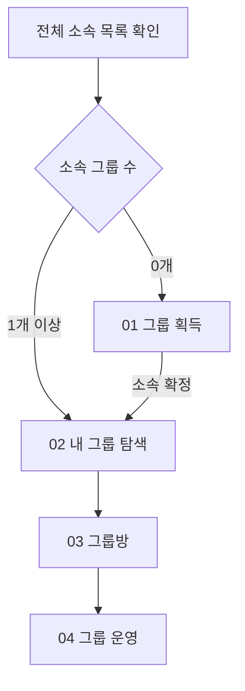
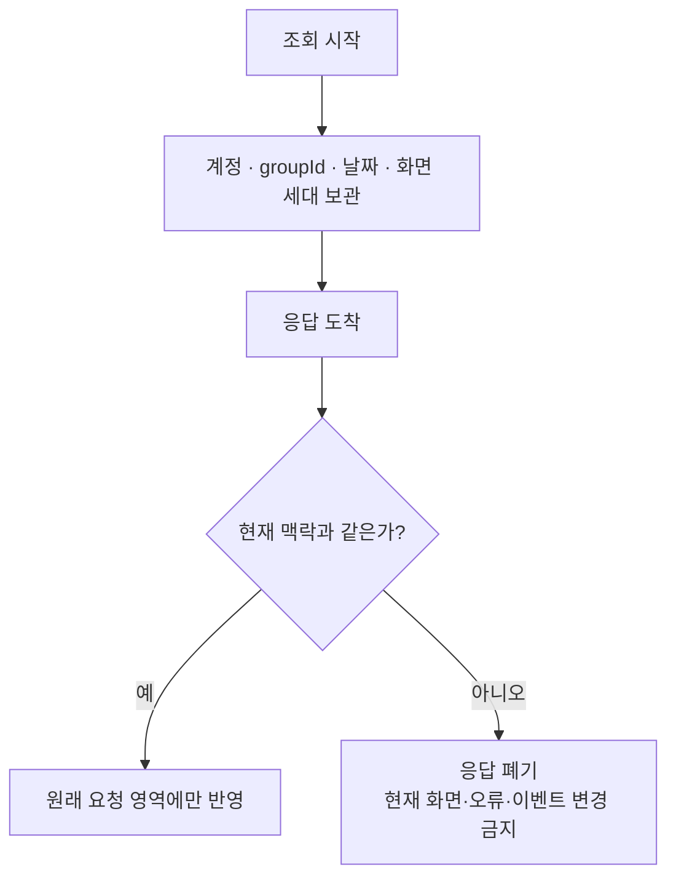
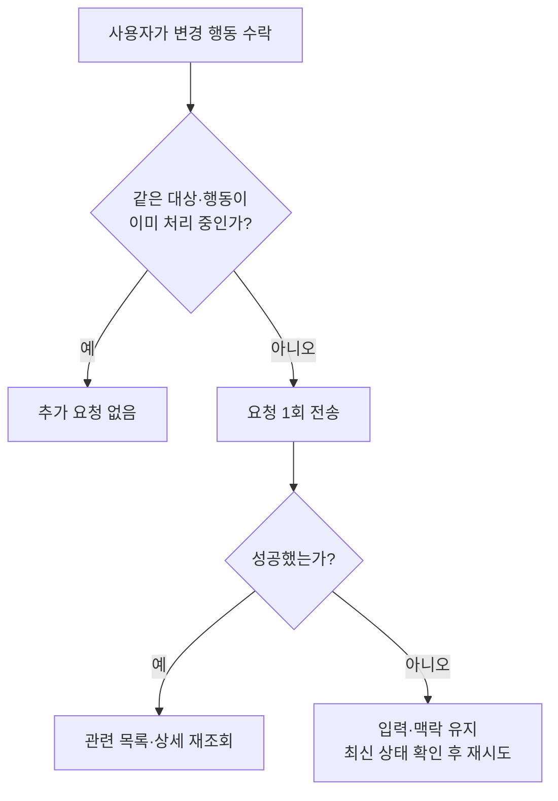
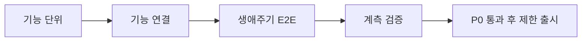

# LLD — 그룹 생애주기 통합 실행 계약

| 항목 | 내용                                                                         |
| ---- | ---------------------------------------------------------------------------- |
| 상위 | [통합 HLD](./high-level-design.md) · [그룹 PRD](./prd.md) · [그룹 IA](./information-architecture.md)             |
| 하위 | [기능별 상세 LLD](./README.md)                                               |
| 역할 | 01~04 기능을 잇는 상태 전이, 신원, 경합, 실패 복구와 통합 테스트를 고정한다. |
| 제외 | 화면 치수·컴포넌트·단일 API의 DTO와 내부 구현은 기능별 LLD를 따른다.         |

---

## 0. 구현 상태

| 기능            | 상태         | ✅ 구현됨                                                  | ⬜ 남은 구현·검증                                                     |
| --------------- | ------------ | ---------------------------------------------------------- | --------------------------------------------------------------------- |
| 01 그룹 획득    | 🟡 일부 구현 | 검색·초대·가입 잠금, 생성·목록 수렴, 늦은 응답 격리        | 생성 submit의 동기식 이중 실행 잠금                                   |
| 02 내 그룹 탐색 | 🟡 일부 구현 | 핵심 코드와 단위/화면 테스트 88개, TypeScript 검사 통과    | 코치마크 queue·중단·read/write 실패 telemetry, F1/F3 공통 이벤트 일부 |
| 03 그룹 활동    | 🟡 일부 구현 | 그룹방 세대 guard·공지 변경·집중 `groupId` 전달            | 집중 이중 탭 잠금, 열린 화면의 자정 경계 갱신, 권한 경합 E2E          |
| 04 그룹 운영    | 🟡 일부 구현 | 요청 잠금·위임 후 이탈·공지 권한 rollback·서버 멤버십 전이 | 위임/공지 권한 화면의 최신 역할 guard와 통합·접근성 E2E               |

챌린지의 내부 실행 상태와 검증은 이 표에서 완료 여부를 판단하지 않으며 별도 챌린지 LLD로 이관한다.

---

## 1. 통합 생애주기

| 상황                     | 다음 상태                                  |
| ------------------------ | ------------------------------------------ |
| 찾기·생성 성공           | 전체 목록 확인 뒤 내 그룹 탐색             |
| 초대 가입 성공           | 전체 목록에 대상 `groupId`가 있으면 그 방  |
| 운영 뒤 마지막 소속 이탈 | 전체 목록 확인 뒤 빈 상태                  |
| 운영으로 소속·역할 변경  | 전체 목록·상세 재확인                      |
| 목록 실패·부분 응답      | 안전한 오류·다시 시도; 0개로 추정하지 않음 |
| 집중 종료·뒤로 가기      | 집중을 시작한 탐색 또는 방 맥락            |

화면·캐시·복귀의 신원은 index가 아니라 `groupId`다.

---

## 2. 현재 맥락과 늦은 응답 격리

- 전체 목록 성공만 오래된 개인 설정을 정리할 근거가 된다.
- A 그룹의 늦은 상세·공지·운영 응답은 B 그룹에 나타나지 않는다.
- 다른 계정의 완료 콜백은 현재 계정의 화면·오류·분석 이벤트를 바꾸지 않는다.

---

## 3. 변경 행동과 중복 요청

이 원칙을 다음 행동에 공통 적용한다.

| 기능    | 행동                              | 성공 뒤 확인                          |
| ------- | --------------------------------- | ------------------------------------- |
| 01 획득 | 가입·생성·초대 링크 발급          | 전체 소속 목록 또는 발급된 링크       |
| 02 탐색 | 카드 순서·개인 아이콘             | 현재 계정·기기 설정, 서버 소속은 불변 |
| 03 활동 | 공지                              | 해당 서버 목록                        |
| 04 운영 | 프로필·위임·강퇴·공지 권한·나가기 | 상세 역할·멤버십·전체 소속 목록       |

- 위임 성공 뒤 나가기 실패처럼 부분 성공이 가능하면 이미 성공한 위임을 되돌리지 않고 다음 행동만 재시도한다.
- 로컬 개인화 저장 실패는 서버의 생성·소속·활동·운영 성공을 취소하지 않는다.

---

## 4. 외부 진입과 목적지 검증

| 진입           | 먼저 확인                        | 성공 목적지        | 실패·비소속                           |
| -------------- | -------------------------------- | ------------------ | ------------------------------------- |
| 직접·복원 초대 | 미리보기 → 가입 → 전체 소속 목록 | 초대 대상 그룹방   | 미리보기 유지 또는 안전한 오류        |
| 그룹 알림      | 전체 소속 목록의 대상 `groupId`  | 대상 그룹방        | 내 그룹 탐색·빈 상태 또는 안전한 오류 |
| 챌린지 알림    | 별도 챌린지 LLD                  | 별도 문서에서 결정 | 별도 문서에서 결정                    |

- 초대와 푸시는 같은 `groupId`를 사용하지만 목적과 성공 조건이 다르므로 상태와 이벤트를 공유하지 않는다.
- 찾기·생성 성공은 내 그룹 탐색으로 합류하지만, 초대 성공은 전체 목록에서 대상 소속을 확인한 뒤 해당 그룹 방으로 간다.
- 외부 진입 대기 중 사용자가 다른 그룹으로 이동하면 늦은 자동 navigation이 현재 행동을 덮지 않는다.

---

## 5. 실패 분류와 복구

| 실패                          | 표시                  | 금지                            | 복구                            |
| ----------------------------- | --------------------- | ------------------------------- | ------------------------------- |
| 전체 소속 목록 실패·부분 응답 | 그룹 화면 오류        | 0개·탈퇴로 추정, 개인 설정 정리 | 전체 목록 다시 시도             |
| 검색·초대 미리보기 실패       | 해당 획득 경로 오류   | 가입 성공으로 이동              | 같은 경로 재시도 또는 닫기      |
| 방의 일부 정보 실패           | 해당 영역 오류        | 다른 성공 영역 삭제             | 그 영역만 재시도                |
| 권한 변경·멤버십 충돌         | 최신 역할·대상 재확인 | 낡은 OWNER 화면으로 성공 처리   | 상세 재조회·안전 복귀           |
| 현재 집중 범위 불명           | 인원 미산출           | `0명` 표시                      | 관측 복구·상세 기능의 전환 gate |

---

## 6. 통합 테스트 게이트

1. 찾기·직접 초대·로그인 뒤 복원 초대·생성 모두 성공 뒤 전체 목록 확인으로 합류한다.
2. 재정렬·방 왕복·포커스 복귀·운영 변경 뒤 같은 `groupId`가 유지되며 사라진 그룹은 복원하지 않는다.
3. A→B 계정 전환, A→B 그룹 이동, 날짜 변경, 화면 종료 뒤 늦은 응답이 현재 화면을 오염시키지 않는다.
4. 상세·공지 중 하나의 실패가 다른 영역과 가능한 행동을 막지 않는다.
5. 위임 후 나가기, 강퇴, 마지막 멤버 이탈, 공지 권한 변경이 서버 상태에 정확히 수렴한다.
6. 초대·푸시·카드·방·집중 결과의 화면 노출, 의도, 성공 이벤트가 중복 없이 올바른 기능에 귀속된다.

## 7. 기능별 상세 LLD

- [01 그룹 획득](./features/01-acquisition/low-level-design.md)
- [02 내 그룹 탐색](./features/02-my-groups/low-level-design.md)
- [03 그룹 활동](./features/03-activity/low-level-design.md)
- [04 그룹 운영](./features/04-operation/low-level-design.md)
