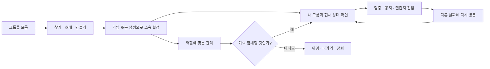

# PRD — 그룹 생애주기

| 항목 | 내용                                                                                                                                              |
| ---- | ------------------------------------------------------------------------------------------------------------------------------------------------- |
| 목적 | 사용자가 그룹을 발견하고, 소속되고, 함께 행동하고, 안전하게 관리·이탈하는 전체 경험을 정의한다.                                                   |
| 하위 | [그룹 IA](./information-architecture.md) · [통합 HLD](./high-level-design.md) · [통합 LLD](./low-level-design.md) · [기능 문서 지도](./README.md) |
| 기준 | 2026-08-10 `origin/main`(`e0a24b7b`) 앱·서버에서 확인한 현재 기능과 아직 검증되지 않은 제품 가설을 분리한다.                                      |
| 상태 | **상위 제품 정본** — 기능별 HLD·LLD는 이 문서의 생애주기와 공통 정책을 바꾸지 않는다.                                                             |

---

## 0. 결정 요약

그룹의 목적은 카드 덱을 사용하는 것이 아니다. 사용자가 **함께 집중할 사람과 맥락을 얻고, 그 맥락에서 행동한 뒤 다시 돌아올 이유를 만드는 것**이다.

현재 카드 덱은 `내 그룹과 현재 상태 확인 → 함께할 행동 선택`을 개선하는 **하위 기능**이다. 그룹 생애주기 전체의 성과를 카드 flip이나 CTA 클릭 하나로 판단하지 않는다.

---

## 1. 현재 사실과 아직 모르는 것

### 확인된 현재 기능

- 사용자는 공개 그룹을 찾거나 초대 링크를 통해 가입할 수 있다. 기존 그룹의 멤버도 초대 링크를 발급·공유할 수 있다.
- 사용자는 그룹을 만들며, 생성자는 방장이 된다. 비공개 그룹은 생성 직후 초대 링크를 공유할 수 있다.
- 소속 사용자는 그룹 방에서 멤버·공지를 보고 그룹 맥락으로 집중하거나 별도 챌린지 기능에 진입할 수 있다.
- 방장은 그룹 프로필, 방장 위임, 멤버 강퇴, 공지 권한을 관리한다.
- 일반 멤버는 나갈 수 있다. 방장은 다른 멤버가 있으면 먼저 위임해야 하며, 마지막 멤버가 나가면 그룹은 종료된다.
- 개인 카드 순서와 아이콘은 서버 그룹 속성이 아니라 현재 계정·기기의 표현으로 설계한다. 해당 탐색 UI와 로컬 저장은 하위 02 기능의 `F02-P1`이며, 이 상위 생애주기 계획에서는 `G-P2`에 포함된다.

### 아직 확인되지 않은 제품 가설

- 사용자가 그룹을 찾거나 가입한 뒤 무엇을 해야 하는지 충분히 이해하는가.
- 그룹 맥락의 행동이 다른 날짜의 재방문으로 이어지는가.
- 그룹 경험이 신규 사용자의 D7·D30 핵심 잔존을 인과적으로 높이는가.
- 기존 멤버에게 과도한 운영·알림·응답 부담을 만들지 않는가.

따라서 현재 문서는 락인 효과를 주장하지 않는다. 먼저 생애주기별 기준선과 실패 지점을 관측하고, 장기 효과는 별도 실험으로 검증한다.

---

## 2. 사용자와 역할

| 사용자                   | 원하는 결과                                         | 제품의 약속                                                                               |
| ------------------------ | --------------------------------------------------- | ----------------------------------------------------------------------------------------- |
| 소속 그룹이 없는 사용자  | 나에게 맞는 그룹을 찾거나 직접 만든다.              | 찾기·초대·만들기의 차이를 이해하고 성공 결과를 확인한다.                                  |
| 그룹 멤버                | 지금 함께할 행동을 찾고 참여한다.                   | 소속·방 정보와 가능한 행동을 일관된 `groupId` 맥락으로 제공한다.                          |
| 그룹 방장                | 그룹과 멤버를 안전하게 운영한다.                    | 공동 자원 변경은 최신 권한을 서버에서 확인하며 되돌리기 어려운 행동은 확인을 거친다.      |
| 그룹에서 나가려는 사용자 | 책임과 데이터 상태를 오해하지 않고 관계를 종료한다. | 멤버는 나가고, 방장은 필요하면 위임한 뒤 나가며, 성공 후 남은 소속으로 안전하게 복귀한다. |

게스트는 그룹을 탐색할 수 있는 진입점이 있더라도 생성·가입·멤버 전용 정보 접근 전에는 인증 흐름을 거친다.

---

## 3. 생애주기별 제품 요구사항

| ID   | 단계         | 제품 요구사항                                                                | 성공 결과                                             |
| ---- | ------------ | ---------------------------------------------------------------------------- | ----------------------------------------------------- |
| G-01 | 발견         | 공개 그룹 찾기와 초대 링크 진입을 구분한다. 검색은 찾기 안의 선택 행동이다.  | 가입을 검토할 그룹 맥락이 보인다.                     |
| G-02 | 초대 공유    | 현재 멤버가 기존 그룹의 초대 링크를 발급·복사·공유할 수 있다.                | 수신자가 같은 그룹 미리보기와 가입 흐름으로 이어진다. |
| G-03 | 생성         | 이름·소개·정원·공개 범위를 확정한 뒤 그룹을 생성한다.                        | 서버가 생성과 방장 소속을 확정한다.                   |
| G-04 | 가입         | 정원·공개 범위·기존 소속·강퇴 상태를 서버가 판정한다.                        | 서버가 멤버십을 확정한다.                             |
| G-05 | 소속 반영    | 가입·생성 성공 뒤 전체 소속 목록을 다시 확인한다.                            | 새 소속이 한 번만 나타난다.                           |
| G-06 | 내 그룹 탐색 | 소속이 1개 이상이면 현재 그룹과 가능한 행동을 비교한다.                      | 같은 그룹 맥락에서 요약·집중·전체 방을 선택한다.      |
| G-07 | 그룹 방      | 멤버·공지와 하위 기능 진입을 서로 독립된 영역으로 제공한다.                  | 일부 실패가 전체 방을 거짓 빈 상태로 만들지 않는다.   |
| G-08 | 함께 행동    | 그룹에서 시작한 집중을 실제 세션 성공 결과와 구분한다.                       | 클릭이 아니라 도메인 성공이 기록된다.                 |
| G-09 | 운영         | 방장은 공동 프로필·멤버·권한을 관리하고, 권한을 받은 멤버는 공지를 관리한다. | 서버의 최신 역할·권한으로 변경이 승인된다.            |
| G-10 | 개인 설정    | 카드 순서·내 카드 아이콘은 역할과 무관한 개인 기기 설정이다.                 | 다른 사용자·계정·서버 그룹 속성에 영향을 주지 않는다. |
| G-11 | 이탈         | 멤버 나가기, 방장 위임 후 나가기, 강퇴를 구분한다.                           | 서버 성공 뒤 소속 화면이 갱신된다.                    |
| G-12 | 복구         | 실패·부분 응답·늦은 응답으로 소속·권한·0명을 추정하지 않는다.                | 마지막으로 확인된 사실 또는 명시적 오류가 보인다.     |
| G-13 | 관측         | 화면 노출, 사용자 의도, 서버·화면 성공 결과를 분리한다.                      | 생애주기의 실제 이탈 지점을 분석할 수 있다.           |

---

## 4. 공통 제품 정책

1. **서버가 관계의 정본이다.** 소속·역할·정원·공개 범위·공동 콘텐츠는 서버 성공 결과로만 바뀐다.
2. **`groupId`가 신원이다.** 이름, 카드 위치, 화면 index는 이동·복귀·권한 판정의 신원이 아니다.
3. **공개와 비공개 획득 경로를 섞지 않는다.** 공개 그룹은 찾기, 비공개 그룹은 초대 링크가 기본 경로다.
4. **모르는 값은 0이나 없음이 아니다.** 요청 실패·부분 목록·범위 불명은 명시적 상태로 표시한다.
5. **부분 실패를 격리한다.** 공지나 하위 기능의 실패가 방 진입을, 카드 요약 실패가 전체 방을 불필요하게 막지 않는다.
6. **비가역 행동은 최신 검증과 확인을 거친다.** 생성·가입·강퇴·위임·나가기는 화면의 낡은 상태만으로 확정하지 않는다.
7. **개인화와 협업 상태를 분리한다.** 기기 로컬 표현은 소속·권한·공동 정보를 바꾸지 않는다.
8. **상관관계를 인과로 주장하지 않는다.** 그룹 가입자의 높은 잔존은 그룹 기능의 효과 증명이 아니다.

---

## 5. 성공 측정

현재 생애주기 전체의 행동 기준선과 충분한 표본이 없다. `G-P0`~`G-P2`는 정확성·이해도·계측 품질을 통과시키고, `G-P3`에서 최소 4주 기준선을 수집한 뒤 목표값을 정한다.

| 층위      | 지표                         | 분모와 분자                                            | 현재 판단                       |
| --------- | ---------------------------- | ------------------------------------------------------ | ------------------------------- |
| 획득      | 가입·생성 완료율             | 유효한 가입·생성 시도 중 서버 성공                     | 경로별 기준선 필요              |
| 활성화    | 7일 내 그룹 연결 행동 경험률 | 소속이 확정된 사용자 중 그룹 맥락의 집중 시작 성공     | 이벤트 계약·기준선 필요         |
| 재방문    | D7 그룹 재방문율             | 그룹 화면·방을 본 사용자 중 다른 날짜에 다시 도달      | 기준선 필요                     |
| 운영      | 권한·나가기 성공률           | 유효한 관리·이탈 시도 중 서버 성공 및 화면 수렴        | 오류 코드별 기준선 필요         |
| 안전      | 조기 이탈·강퇴·중복 처리     | 가입 후 7일 내 나가기, 강퇴, 중복 생성·가입·이벤트     | 원인별 관측 필요                |
| 장기 결과 | D30 핵심 잔존 상승폭         | 사전 배정 실험군과 대조군의 핵심 집중 행동 잔존율 차이 | 별도 성장 실험 전에는 주장 금지 |

이벤트의 공통 이름·속성·발행 규칙은 [그룹 공통 분석 계약](./shared/analytics.md) 한 곳에서 관리한다. 공통 원칙은 `화면 도달 → 실제 노출 → 수락된 의도 → 성공 결과`이며, 자동 전환·다시 그리기·취소·재시도는 사용자 행동으로 세지 않는다.

---

## 6. 범위와 비목표

### 이번 상위 PRD에 포함

- 찾기·초대·생성·가입부터 내 그룹 탐색, 그룹 활동, 운영, 이탈까지의 연결 정책
- 서버 정본, 역할, 실패·복구, 이벤트 해석의 공통 원칙
- 기능별 HLD·LLD의 책임 경계와 출시 순서

### 이번 상위 PRD에서 새로 만들지 않음

- 실시간 그룹 채팅·소셜 피드
- 모든 그룹에 대한 자동 추천·랭킹
- 새 알림 체계나 기존 알림의 무조건적 확대
- 개인 카드 설정의 서버·다기기 동기화
- 챌린지의 상세 정책과 구현 판단 — [챌린지 PRD](../challenge/prd.md)로 이관
- 카드 덱만으로 리텐션·락인이 개선된다는 주장

---

## 7. 단계적 계획

| Phase  | 목적                | 포함 범위                                              | 완료 기준                                         |
| ------ | ------------------- | ------------------------------------------------------ | ------------------------------------------------- |
| `G-P0` | 생애주기 정본 확정  | 상위 PRD·IA, 기능 경계, 공통 분석·구현 상태 정본       | 정본 위치·책임 역할·착수 gate가 한 곳에서 확인됨  |
| `G-P1` | 획득·운영 신뢰성    | 생성·찾기·초대·가입, 권한·위임·강퇴·나가기의 실패 복구 | 중복·권한 누수·잘못된 소속 수렴 0건               |
| `G-P2` | 소속 이후 탐색 개선 | 카드 덱·요약·집중/방 진입·첫 안내                      | 02 기능의 `F02-P1`~`F02-P4` 수용 기준 통과        |
| `G-P3` | 기준선 수집         | 획득→활동→재방문 퍼널과 정성 평가                      | 4주 이상 데이터·분모·분석 책임자의 검증 기록 확정 |
| `G-P4` | 성장 실험           | 그룹 가치 경험이 잔존에 미치는 인과효과                | 별도 실험 PRD·표본·MDE·중단 기준 승인             |

---

## 8. 기능 문서 지도

| 기능         | 생애주기                    | 설계 문서                                                                                                                                                                                                                                                             |
| ------------ | --------------------------- | --------------------------------------------------------------------------------------------------------------------------------------------------------------------------------------------------------------------------------------------------------------------- |
| 그룹 획득    | 찾기·초대·생성·가입         | [착수 카드](./features/01-acquisition/README.md) · [HLD](./features/01-acquisition/high-level-design.md) · [LLD](./features/01-acquisition/low-level-design.md)                                                                                                       |
| 내 그룹 탐색 | 소속 확인·요약·집중/방 선택 | [착수 카드](./features/02-my-groups/README.md) · [Feature PRD](./features/02-my-groups/prd.md) · [IA](./features/02-my-groups/information-architecture.md) · [HLD](./features/02-my-groups/high-level-design.md) · [LLD](./features/02-my-groups/low-level-design.md) |
| 그룹 활동    | 방·멤버·집중·공지           | [착수 카드](./features/03-activity/README.md) · [HLD](./features/03-activity/high-level-design.md) · [LLD](./features/03-activity/low-level-design.md)                                                                                                                |
| 챌린지       | 그룹방의 하위 기능          | [PRD](../challenge/prd.md) · [IA](../challenge/information-architecture.md) · [HLD](../challenge/high-level-design.md) · [LLD](../challenge/low-level-design.md)                                                                                                      |
| 그룹 운영    | 프로필·역할·멤버·권한·이탈  | [착수 카드](./features/04-operation/README.md) · [HLD](./features/04-operation/high-level-design.md) · [LLD](./features/04-operation/low-level-design.md)                                                                                                             |

---

## 9. 후속 제품 결정

- v1의 `7일 내 그룹 연결 행동 경험`은 **소속 확정 사용자 중 7일 안에 그룹 맥락의 `focus_session_started`가 한 번 이상 있는 비율**로 기준선을 만든다. 챌린지 행동을 포함할지는 별도 챌린지·성장 실험 PRD에서 결정한다.
- 이벤트 구현·대시보드·QA 책임 역할과 기능별 착수 gate는 [구현 상태 정본](./shared/implementation-status.md)에 둔다. 사람 단위 담당자는 구현 티켓 생성 시 배정한다.
- 비활성·무응답 그룹을 설명하고 재탐색을 돕는 정책은 현재 기능 구현을 막지 않는 후속 제품 문제다. 근거 없이 자동 추천을 추가하지 않는다.
- `G-P3` 기준선 이후에만 `G-P4` 실험의 목표치·MDE·표본·중단 기준을 확정한다.
