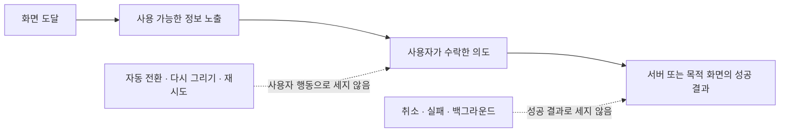

# 그룹 공통 분석 계약

| 항목 | 내용                                                                                                                      |
| ---- | ------------------------------------------------------------------------------------------------------------------------- |
| 상위 | [그룹 PRD](../prd.md) · [통합 HLD](../high-level-design.md)                                                               |
| 역할 | 01~04 기능이 함께 쓰는 이벤트 이름, 발행 주체, 공통 속성, 귀속·중복 규칙의 단일 정본                                      |
| 제외 | 기능별 UI 상태와 구현 위치는 각 기능 HLD·LLD에서 다룬다. 챌린지 계측은 [챌린지 문서](../../challenge/README.md)를 따른다. |
| 기준 | 2026-08-10 `origin/main`; 자동 수집·서버 전송은 실제 DebugView/내보내기 검증 전까지 KPI 정본으로 사용하지 않는다.         |

## 1. 측정 원칙



- `C`는 앱의 typed helper → `analytics.track()` 경로, `S`는 서버 Measurement Protocol, `S-LOG`는 서버 구조화 로그, `A`는 GA4/Firebase 자동 수집이다.
- 퍼널 정본에는 DebugView에서 검증된 `C`·`S`·`A`만 사용한다. `S-LOG`는 분석 export와 사용자 귀속이 확인되기 전까지 운영 진단용이다.
- 같은 결과를 앱과 서버가 함께 발행하지 않는다. 서버가 정본인 가입·이탈 결과는 앱의 클릭 이벤트와 분리한다.
- 그룹 이름·소개·아이콘 glyph·버튼 문구·asset·로컬 순서·raw `userId`는 신규 이벤트 payload에 넣지 않는다.

## 2. 기능별 이벤트 사전

| 기능    | 이벤트                          | 유형·주체      | 정확한 발행 시점                                              | 필수 속성·주의                                                                          |
| ------- | ------------------------------- | -------------- | ------------------------------------------------------------- | --------------------------------------------------------------------------------------- |
| 공통    | `session_start`                 | lifecycle·A    | GA4 자동 세션 시작                                            | 앱 수동 발행 금지                                                                       |
| 공통    | `app_main_viewed`               | screen·C       | main shell이 입력 가능한 foreground 진입당 1회                | `app_entry`, `auth_state`, `initial_tab`; rerender·탭 이동 제외                         |
| 공통    | `main_tab_selected`             | action·C       | 비활성 글로벌 탭이 사용자 입력으로 실제 전환                  | `tab`, `from_tab`; 같은 탭 재탭·programmatic 이동 제외                                  |
| 공통    | `group_viewed`                  | screen·C       | 인증 사용자의 성공한 전체 소속 목록 확정 뒤 focus cycle당 1회 | `group_entry`, `group_count_bucket`; 목록 실패·부분 응답·rerender 제외                  |
| 01 획득 | `group_create_started`          | screen·C       | 생성 폼 표시 성공                                             | `entry_point`; 폼 진입당 1회                                                            |
| 01 획득 | `group_create_submitted`        | action·C       | 유효한 생성 요청을 수락하고 API를 보내기 직전                 | `entry_point`, `is_private`; 요청당 1회                                                 |
| 01 획득 | `group_created`                 | result·C       | 생성 API 성공 응답 직후                                       | `entry_point`, `is_private`; 로컬 아이콘 저장과 분리                                    |
| 01 획득 | `group_find_opened`             | screen·C       | 찾기 sheet가 실제 표시                                        | `entry_point`; open cycle당 1회                                                         |
| 01 획득 | `invite_link_opened`            | action·C       | 설치된 앱이 초대 링크를 처리                                  | 기존 `group_id`, `slug`, `via`                                                          |
| 01 획득 | `group_invite_sheet_viewed`     | screen·C       | 초대 preview sheet가 실제 표시                                | 기존 `group_id`, `slug`, `entry=link\|deferred`                                         |
| 01 획득 | `group_join_attempted`          | action·C       | 검색·초대 가입 요청 직전                                      | `join_method`; 요청당 1회                                                               |
| 01 획득 | `group_joined`                  | result·S+S-LOG | 서버가 가입을 commit                                          | `join_method`; `appInstanceId`가 있으면 GA4에도 발행, 없으면 S-LOG만; 앱 중복 발행 금지 |
| 02 탐색 | `group_card_deck_viewed`        | exposure·C     | 1개 이상 목록과 layout이 안정된 첫 렌더                       | `group_count_bucket`, `group_entry`, `guide_state`; focus당 1회                         |
| 02 탐색 | `group_card_flipped`            | action·C       | 사용자 입력으로 face가 실제 변경                              | `to_face`, `trigger`, `group_count_bucket`; guide·animation·복귀 제외                   |
| 02 탐색 | `group_carousel_paged`          | action·C       | 사용자 입력으로 active `groupId`가 변경                       | `trigger`, `from_index`, `to_index`, `group_count_bucket`; resize 제외                  |
| 02 탐색 | `group_card_action_clicked`     | action·C       | 뒷면의 focus·room·settings 흐름이 수락                        | `action`, `role`, `back_source`; disabled·연타·no-op 제외                               |
| 02 탐색 | `group_card_reordered`          | action·C       | pointer up 또는 접근성 이동으로 순서 commit                   | `trigger`, `from_index`, `to_index`, `group_count_bucket`; drag 중간 제외               |
| 02 탐색 | `group_card_icon_editor_viewed` | screen·C       | 아이콘 편집기가 실제 표시                                     | 설정 편집기만; 생성 inline picker와 구분                                                |
| 02 탐색 | `group_card_icon_save_result`   | result·C       | 로컬 쓰기 성공·실패 확정                                      | `surface`, `result`; glyph 제외                                                         |
| 02 탐색 | `tab_guide_completed`           | result·C       | 마지막 `시작`으로 안내가 닫힌 직후                            | `guide=groupDeck:v1`; session당 1회, key write와 분리                                   |
| 03 활동 | `group_room_viewed`             | result·C       | 그룹 방의 최초 성공 렌더                                      | 기존 속성 + `entry_source`                                                              |
| 03 활동 | `focus_session_started`         | result·C       | 기존 집중 도메인이 세션 시작을 성공 처리                      | 기존 속성 + `entry_source`                                                              |
| 04 운영 | `group_left`                    | result·S-LOG   | 서버가 나가기·강퇴를 commit                                   | `leave_reason`; 최상위 `user_id`는 이탈한 사용자, GA4 귀속 전 운영 로그 전용            |

챌린지·내기의 생성, 참여, 결과 이벤트는 이 표에 추가하지 않는다. 해당 기능의 이벤트 정본은 챌린지 문서가 소유한다.

## 3. 공통 enum과 수명

| 속성                 | 허용값                                                                    |
| -------------------- | ------------------------------------------------------------------------- |
| `app_entry`          | `cold_start \| foreground \| auth_complete \| unknown`                    |
| `auth_state`         | `guest \| member`                                                         |
| `group_entry`        | `tab \| invite \| push \| return \| unknown`                              |
| `tab`                | `home \| league \| group \| menu`                                         |
| `entry_point`        | `empty \| header \| end_card`                                             |
| `group_count_bucket` | `0 \| 1 \| 2_5 \| 6_10`                                                   |
| `guide_state`        | `shown \| completed \| unknown`                                           |
| `action`             | `focus \| room \| settings`                                               |
| `role`               | `owner \| member`                                                         |
| `to_face`            | `front \| back`                                                           |
| `back_source`        | `user \| guide`                                                           |
| `surface`            | `create \| settings`                                                      |
| `result`             | `success \| failed`                                                       |
| `entry_source`       | `group_card \| group_room \| group_find \| invite \| home_fab \| unknown` |
| `join_method`        | `search \| invite \| deferred_invite`                                     |
| `trigger`            | `card_tap \| swipe \| indicator_press \| drag \| accessibility_action`    |
| `leave_reason`       | `self \| kicked`                                                          |

- 초대 sheet의 기존 `entry=link|deferred`는 초대 내부 속성이다. 그룹 화면 유입의 `group_entry`와 섞지 않는다.
- `back_source=guide`는 안내가 만든 뒷면을 사용자가 다시 flip하기 전까지만 유지한다. front로 돌아간 뒤 다시 연 back은 `user`다.
- `trigger`는 이벤트별 허용값을 더 좁힌다. flip은 `card_tap|accessibility_action`, page는 `swipe|indicator_press|accessibility_action`, reorder는 `drag|accessibility_action`만 허용한다.
- `group_left`의 최상위 서버 로그 `user_id`는 행위자가 아니라 **소속에서 빠진 사용자**다. 자발 이탈은 요청자, 강퇴는 `targetUserId`를 명시 오버로드로 기록하고 `leave_reason=self|kicked`로 구분한다. 방장 행위자 정보가 필요하면 기존 요청·감사 맥락을 사용하며 이벤트 payload에 raw ID를 중복 전송하지 않는다.
- 현재 서버는 자발 이탈과 강퇴 모두 `group_id`만 남기고, 강퇴 로그의 최상위 `user_id`도 요청한 방장 MDC를 사용한다. 위 `group_left` 계약이 구현·export 검증되기 전에는 이 이벤트를 이탈률·강퇴율 KPI에 사용하지 않는다.
- 현재 앱의 `group_viewed`는 소속 목록 확정 전에 발행하고 위 두 필수 속성을 보내지 않는다. 성공한 전체 목록 뒤로 발행 위치를 옮기고 typed payload를 검증하기 전에는 F3의 0개 사용자 분모로 사용하지 않는다.
- 검색 가입도 초대 가입처럼 `getAppInstanceId()`를 best-effort로 읽어 `joinGroup` 요청에 전달한다. 조회 실패·미지원은 가입을 막지 않고 S-LOG 결과만 남기며, 검색 경로의 전달과 DebugView를 확인하기 전에는 GA4 F3 성공 전환으로 사용하지 않는다.
- 기존 `group_room_viewed` 외 새 카드 이벤트에는 raw `group_id`를 추가하지 않는다.

## 4. 공통 퍼널과 귀속

```text
F1 앱 → 그룹
  app_main_viewed(auth_state=member)
    ├─ main_tab_selected(tab=group) → group_viewed(group_entry=tab, group_count_bucket=0|1|2_5|6_10)
    └─ group_viewed(group_entry=invite|push|unknown, group_count_bucket=0|1|2_5|6_10)

F2 내 그룹 탐색 → 행동 결과
  group_card_deck_viewed
    → [tab_guide_completed OR group_card_flipped(to_face=back)]
    → group_card_action_clicked
      ├─ room  → group_room_viewed(entry_source=group_card)
      └─ focus → focus_session_started(entry_source=group_card)

F3 그룹 획득 → 소속 반영
  group_viewed(group_count_bucket=0)
    ├─ group_find_opened → [검색 선택] → group_join_attempted(search) → group_joined
    ├─ invite_link_opened → group_invite_sheet_viewed → group_join_attempted(invite|deferred_invite) → group_joined
    └─ group_create_started → group_create_submitted → group_created
  서버 성공 → 성공한 전체 소속 목록 확인 → 다음 목적 화면 노출
```

- F1은 로그인 `user_id + ga_session_id` 고유 세션으로 본다. 탭 전환 뒤 10초 안의 `group_viewed(group_entry=tab)`만 navigation 성공으로 귀속한다.
- F2의 뒷면 사용 가능은 같은 session에서 guide 완료와 사용자 flip의 합집합으로 dedupe한다. room 결과는 action 뒤 30초, focus 결과는 10분을 초기 귀속 window로 둔다.
- F3에서 검색은 선택 단계다. 기본 목록에서 바로 가입해도 정상이다. 가입 결과 정본은 서버 `group_joined`, 생성 결과는 현재 앱 `group_created`이며 같은 결과의 서버 중복 발행을 금지한다.
- CTA 의도 뒤 결과가 없으면 취소·background·navigation 실패일 수 있다. 클릭을 성공으로 해석하지 않는다.

## 5. 구현·검증 게이트

1. 신규 클라이언트 이벤트는 `analyticsEvents.ts`의 typed helper 한 경로에서만 보낸다. 화면의 Firebase 직접 호출을 금지한다.
2. cold/warm start, 로그인 전환, 탭 재선택, background/foreground별 once 기준을 단위 테스트한다.
3. DebugView에서 F1의 tab/direct 분기, F2의 guide/user 분기, F3의 find/invite/create 분기를 각각 검증한다.
4. rerender·resize·route 복귀·guide programmatic 전환·no-op·취소는 사용자 이벤트 0건이어야 한다.
5. CTA 연타는 action 최대 1건이며 실제 목적 결과가 없으면 result 0건이어야 한다.
6. raw payload에 그룹 이름·소개·glyph·asset·로컬 순서·raw `userId`가 없는지 확인한다.
7. 서버 로그에서 자발 이탈은 `leave_reason=self`와 요청자 `user_id`, 강퇴는 `leave_reason=kicked`와 대상자 `user_id`로 기록되는지 검증한다.
8. 검색·초대 가입 각각에서 `join_method`가 보존되고, `appInstanceId` 있음은 GA4+S-LOG, 없음은 비차단 S-LOG 결과가 되는지 검증한다.
9. 이벤트·대시보드 책임 역할과 DebugView 증거가 [구현 상태 정본](./implementation-status.md)에 배정되기 전에는 해당 분석 게이트를 완료로 표시하지 않는다.
