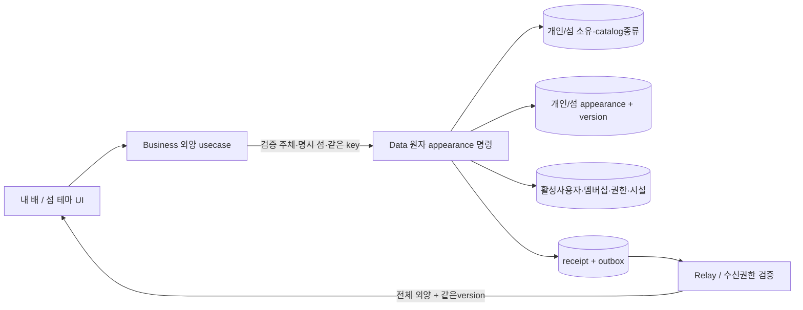
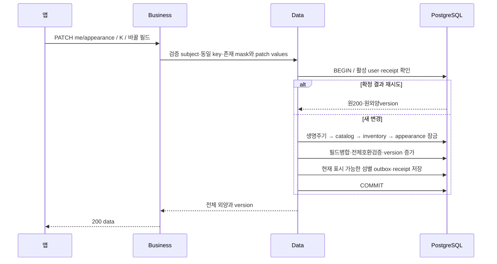

# 개인·섬 외양 — 구성과 데이터 흐름

GROMO-1782 · [정책](policy.md) · [상세 계약](low-level-design.md)

구매는 [상점](../island-shop/high-level-design.md)이 소유권을 만든다. 외양 변경은 돈을 차감하지 않는다.
소유와 외양을 서로 다른 DB로 분리하지 않으며 Data 한 트랜잭션에서 catalog/owned/현재상태를 검증한다.
Business가 owned GET으로 확인한 뒤 무조건 appearance PUT을 보내는 형태는 그 사이 소유/권한변경을 놓친다.

## 개인 외양

필드의 미전달/명시 null/값은 [LLD의 tri-state 전달 규약](low-level-design.md#patch-존재-여부와-멱등-지문)을 따라 Business 역직렬화부터 Data 병합까지 보존한다. 일반 nullable DTO나 null 필드 생략 serializer로 정보를 지우지 않는다. 외양은 wallet을 변경하지 않으므로 공통 생명주기 → catalog → wallet → inventory → appearance 순서 중 wallet만 건너뛴다.

개인외양은 user 하나의 정본이므로 섬이 달라도 같은 version을 사용한다. 여러 섬으로 전달해야 할 때는
섬별 envelope/eventId를 따로 내구화하고 같은 전체 외양/version을 넣는다. 어디에 보이는지의 membership은
수신자 현재권한과 함께 후속구독 도메인이 다시 검사한다. 이벤트가 늦으면 GET me/inventory 또는 화면snapshot으로 복구한다.

## 공동 외양

islandId의 소유목록/시설/appearance/역할 검증을 한 TX에 묶는다. expectedVersion은 **공동 외양**의 버전이다.
섬 일반정보의version, 지갑버전, inventory버전이 같아 보인다는 이유로 대신 비교하지 않는다.
반영된 전체 islandThemeId/buildingThemes/version을 반환·발행하고, patch본문 일부만 이벤트로 내보내지 않는다.

구매→테마적용→음원재생을 한 요청으로 묶지 않는다. 한 단계 실패가 이미 완료된 구매를 암묵 취소하지 않는다.
공동적용권한은1761 권한행렬과 같은 정책provider에서 얻으며 미정이면 전달/변경 기능을 켜지 않는다.

공인 무접두어 `/me/**`·`/islands/**`의 전달은 [공통 라우팅·배포 선행 조건](../island-shop/high-level-design.md#공인-라우팅-연결의-선행-조건)에 따른다. nginx 연결과 JWT 경계 검증 전 외양 endpoint를 공개 사용 가능으로 표시하지 않는다.

## 기존 코드와 후속 의존

기존 `EquipmentService`는 구슬롯별 저장 모델이다. 새외양은 여러필드가 한 전체상태로 정합을 가져야 하므로
원자 병합/검증/버전이 필요하다. 기존 메서드를 필드마다 여러HTTP호출하는 것이 대체구현이 아니다.

회원탈퇴·강퇴·방장이양, catalog비활성, 향후 소유회수와 같은 동시writer는 공통잠금규율에 합류해야 한다.
현재 계획에는 소유회수API가 없지만 row수명주기를 설계할 때 이를 허용하는 구조가 인가를 무력화하지 않게 한다.
1754 payload/수신 정책과1755 router비활성경계,1750 receipt/requestId규약을 동일하게 적용한다.
