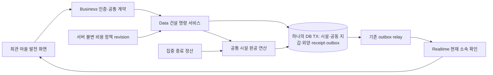
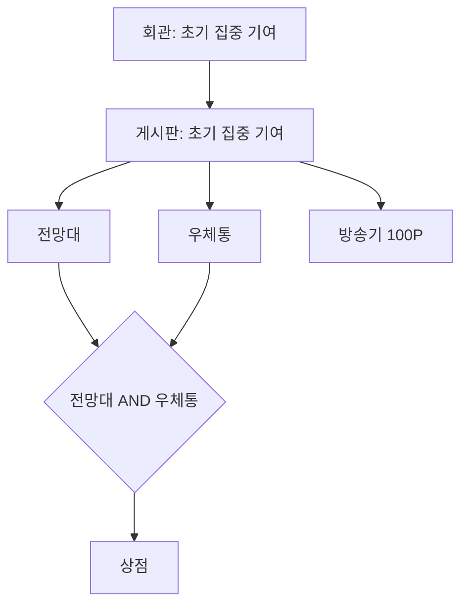
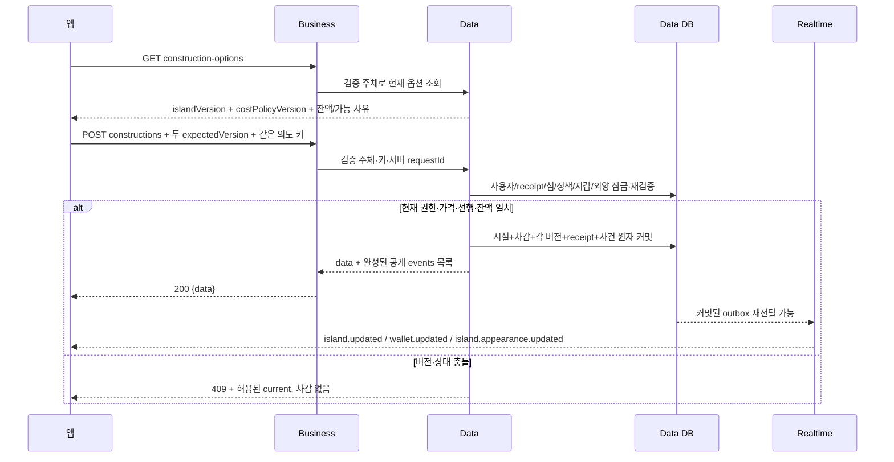

# 건설 아키텍처와 데이터 흐름

앱은 주문서를 보내고 Business는 본인 확인이 된 주문을 Data에 전달한다. Data가 시설과 통장을 같은 장부에서 고친다. 모든 쓰기가 성공해야 영수증과 알림 목록도 남는다. 알림 전달이 잠시 늦어도 영수증과 장부가 남아 있으므로 돈을 다시 빼지 않고 알림만 다시 전달한다.

화살표는 선행 조건이며 자동 구매 명령이 아니다. 초기 기여 계산은 집중 설계 FR-D02 승인 후 같은 Data TX에 연결한다. 목표 선택과 결제는 다른 버튼/명령이며 목표 선택이 결제 예약·잔액 차감을 만들지 않는다.

Business가 지갑 서비스 차감 후 별도 시설 저장을 조합하지 않는다. 섬 버전·지갑 버전·외양 버전은 각 projection의 시계다. 같은 커밋이라고 모두 같은 숫자를 붙이지 않는다. outbox 저장 봉투와 공개 전달 봉투도 구분한다.

기준 main `Group.java`는 기존 그룹 정보·낙관 버전만 갖고 신규 시설 상태가 없다. 기존 CurrencyLedgerService는 User 지갑 대상이다. 이 그림은 새 계약 설계이며 main에서 공용 건설이 이미 동작한다는 설명이 아니다.
