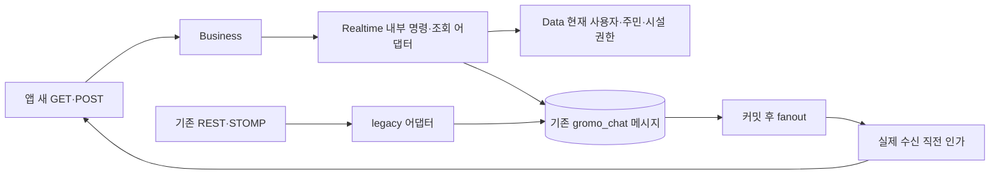
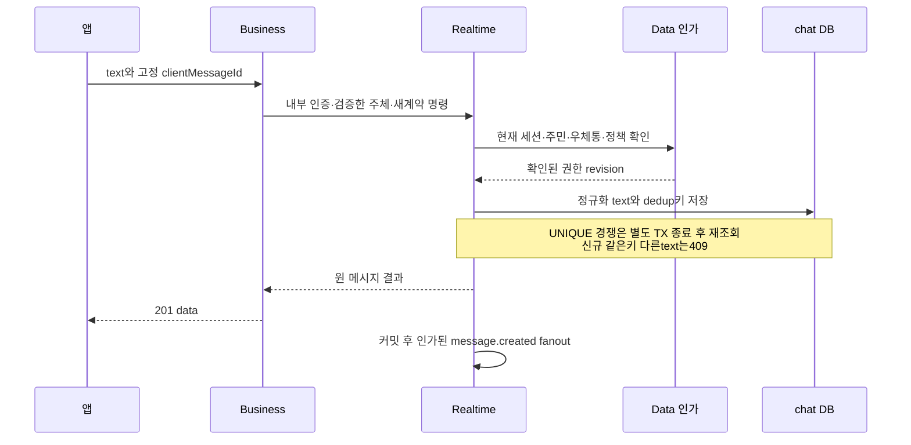

# 우체통 편지방 — HLD

[정책](policy.md) · [상세 설계](low-level-design.md)

Business는 새 편지함의 입구이고, 편지를 보관하는 곳은 기존 chat DB다. 앱이 같은 편지를 다시 보내도 봉투의 clientMessageId를 보고 한 장만 보관한다. 실시간 전달을 놓치면 보관된 편지를 다시 읽는다.

인가 확인과 chat INSERT는 서로 다른 DB라 분산 원자 작업이 아니다. 읽기/발신 인가의 경계와 수신 직전 재검사는 LLD에 명시한다. TTL120초짜리 옛 membership cache를 새 보호 채널의 최종 인가 증거로 쓰지 않는다. Data 확인 실패면 보내거나 읽지 않는다.

공통 `/ws/realtime` CONNECT는 집중 중에도 인증할 수 있어야 집중·휴식·emote가 동작한다. 새 우체통의 읽기·쓰기·수신을 어디까지 제한할지는 별도 정책이며 아직 미답이다. legacy chat 규칙은 보존한다. 같은 소켓의 음악/집중 이벤트를 message 제한 때문에 모두 차단하지 않는다.

message.created는 Data outbox가 아니다. 기존 메시지 커밋 뒤 best-effort fanout을 사용하며 DB/TCP 원자성은 없다. 수신 누락은 history 재조회로 복구하고, 내구 fanout 추가가 필요하면 별도 chat DB outbox 설계·범위를 승인해야 한다. 이 설계가 이미 존재하는 것처럼 쓰지 않는다.

구현 순서: 읽음/집중 정책 → 내부 어댑터/현재 인가 → strict dedup/공개 DTO·프로필 → signed cursor와 history → 신규 event/재연결·권한회수 → legacy/실소켓 테스트. 새로운 메시지 저장소나1:1채팅 기능을 만들지 않는다.
