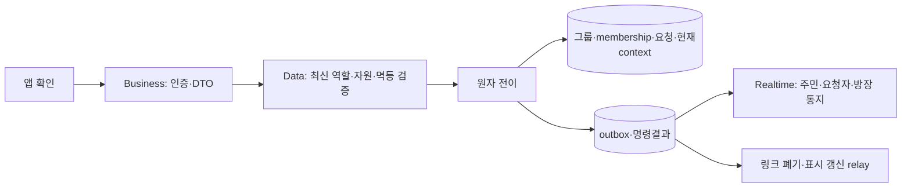
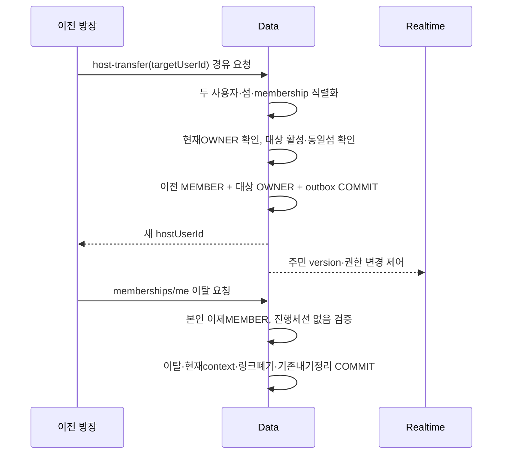

# 섬 관리·주민 — 구성 설계

> GROMO-1761 · 검토 초안. [PRD](./prd.md) · [권한 행렬](./permissions.md) · [LLD](./low-level-design.md)

## 1. 명령 책임

현재 방장은 group_members.role의 OWNER다. UI가 보내는 role/canManage/isHost를 받지 않는다. 사용자·그룹·대상 요청의 식별자는 Data에서 상호 관계를 확인하고, 섬이 다른 requestId를 넣으면 관리 권한이 있어도 처리하지 않는다.

조회는 읽기 전용 projection, 변경은 유스케이스 단위 Data 명령이다. Business에서 target승격→이전host강등을 별도 HTTP로 나누거나 가입승인→membership삽입을 나누지 않는다.

## 2. 위임·탈퇴

위임과 나가기는 각각 확인하는 별도 행동이며 두 명령이다. 위임 성공 후 이탈이 실패해도 이미 위임한 권한을 되돌리지 않는다. 같은 키로 위임을 재시도한다고 OWNER/MEMBER가 다시 뒤집혀서는 안 된다.

다인 방장 이탈은 위임 필요409, 마지막1인의 이탈은 섬 종료다. 마지막 주민 판정과 동시 가입/승인이 같은 그룹 직렬화 경계를 공유해야 한다. 혼자라고 읽은 직후 가입이 끼어 살아 있는 주민의 섬을 닫지 않아야 한다.

## 3. 강퇴·개인 데이터·보상

강퇴는 membership 권한을 제거하는 명령이며 사용자 계정 삭제가 아니다. 개인 프로필·보유품·개인 물고기·완료 집중 기록을 강퇴만으로 삭제하지 않는다. 공유 소유품과 마을 포인트는 섬 소유로 남는다. 이미 확정된 주문/원장/정산을 되돌리는 기능도 아니다.

**진행 세션 종료와 미수령 보상은 제품 결정 대기다.** Data가 강퇴와 동시에 진행 세션을 서버 시간으로 종료하고 개인 확정 보상을 보존하는 방안을 추천하지만, 이 문서가 산식/공동기여/퀘스트 자격을 확정하지 않는다. 정책 없이 `cancel()`을 호출해 집중 시간을 버리거나 임의 보상을 지급하지 않는다. 강퇴가 가능한 기능을 출시하기 전 이 분기를 결정하고 집중/퀘스트 담당의 원자 명령과 연결한다.

현재 섬이 사라진 경우 다른 소속으로 자동 이동하지 않고 null로 비우는 방안은 소속 IM-D06 제안이다. 결정 전에도 권한 없는 섬을 계속 현재 context로 서비스하거나 클라이언트가 보낸 임의 대체 섬을 신뢰해서는 안 된다.

## 4. 권한 상실 전파

Data 상태 전이와 membership epoch/outbox를 함께 커밋한다. 링크 자격 폐기는 링크 서버에 HTTP로 내구 재전달하며 Realtime은 현재 역할·멤버십을 서버에서 다시 검사한다. 공개 `island.members.updated`에는 섬ID/목록version만 보내고, 이탈 대상·사유·권한 철회 제어자료는 내부 데이터로 분리한다.

`join.request.updated`는 신청자 본인과 전달 시점 현재 방장에게만 간다. 이전 방장의 개인큐에 이미 적재된 신청정보도 전달 직전 인가에서 차단한다. 소속 상실자는 앱 UNSUBSCRIBE 없이도 새 보호 프레임을 받지 않아야 한다. 전체소켓 종료 방식이면 앱은 새 허용 채널을 다시 구독한다.

## 5. 단계와 책임

기존 운영 정책 및 성공 와이어 보존 → 공통 잠금/내부 멱등 기반 합류 → 7개 Data 원자명령·projection → Business 외부 DTO → 이벤트/철회/경합 테스트 순서다. 참고 티켓 1659/1750/1754에 있는 기반을 복제하지 않는다.

정책 미답 행은 permissions.md의 TBD로 유지한다. 문서 리뷰 통과나 골격 구현이 공용 권한 확정·강퇴 보상 정책 확정을 뜻하지 않는다. 코드·스키마 변경과 빌드는 이 설계 초안 작업에 포함하지 않는다.
