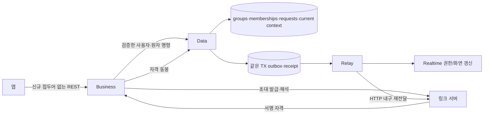
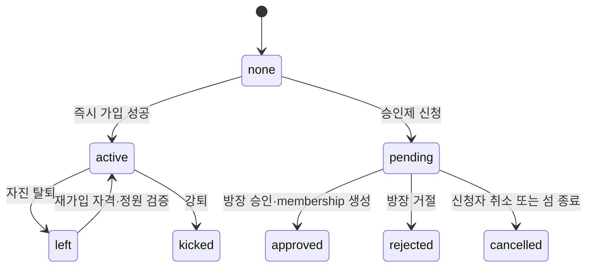
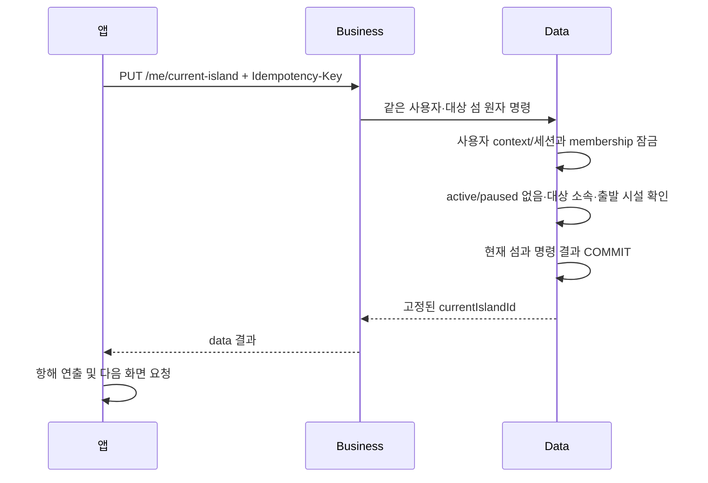

# 섬 소속·탐색 — 구성 설계

> GROMO-1758 · 검토 초안. [PRD](./prd.md) · [상세 계약](./low-level-design.md)

## 1. 구성

Business는 DB를 직접 읽지 않는다. Data는 링크 DB를 읽지 않고 링크 서버는 코어를 역호출하지 않는다. [서비스 아키텍처](../../architecture/service-architecture.md)의 기존 링크 서명 자격·membershipEpoch·claim-intent 계약에 맞춰 합류한다. 이 그림은 별도 새 링크 서비스나 신설 공개 이벤트 endpoint를 요구하지 않는다.

| 소유 | 책임 |
|---|---|
| 섬 소속 Data | 그룹/활성 membership/가입 요청/현재 섬/정원·상한 불변식 |
| 관리 Data | 방장 권한/승인/위임/강퇴·이탈, 링크 폐기와 세션·보상 연계 |
| 건설·외양 Data | 시설·성장·theme 정본, 섬 상세용 projection |
| 링크 서버 | 초대 slug/새 코드 별칭이 채택되면 그 매핑, 링크 수명·서명 자격·클릭/귀속 |
| Business | request/response DTO, 인증·위임, 검색과 코드 해석 조합, 13화면의 고정 context |
| Realtime | 커밋된 사건을 허용된 주민/신청자/방장에게 전달, 이탈자 구독 철회 |

## 2. 가입과 승인

그림의 approved/rejected/cancelled는 **요청** 상태이고 active/left/kicked는 **membership** 상태다. approved가 곧 현재 섬 이동은 아니다. rejoin은 기존 `(user_id,group_id)` 행을 재활성화하되 별도 membership epoch를 증가시킨다. 강퇴자의 재가입 차단은 기존 정책을 보존한다. 새 요청으로 과거 강퇴 이력을 지우지 않는다.

섬 종료는 모든 남은 pending을 기존 cancelled로 종결하고 신청자 개인 outbox를 같은 TX에 기록한다. 종료 후 본인 join-status는 이 terminal 상태를 반환하므로 처리할 host가 없는 승인 대기를 남기지 않는다.

pending의 자리 예약·재신청 정책은 PRD의 IM-D05 제안이다. 어떤 정책이든 실제 승인/즉시 가입 커밋에서는 정원과 계정 소속 상한을 다시 검사한다. 마지막 자리를 두 명이 동시에 얻거나 다른 섬에 동시 가입해 계정 상한을 넘지 않아야 한다.

## 3. 현재 섬과 집중의 한 경계

UI 미리보기는 현재 섬을 바꾸지 않는다. 생성/즉시 가입이 currentIslandId를 설정하는 경우도 위 경계를 공유한다. 그렇지 않으면 PUT만 막아 놓고 생성/가입으로 진행 집중 중 이동할 수 있다. 첫 소속에는 기존 출발 섬이 없으므로 전망대 조건이 적용되지 않는다. current=null 자체는 첫 소속 증명이 아니다. 상실 이유와 서버 복구 근거를 구분하는 [IM-D06 추천안](./prd.md#im-d06-추천-복구-전이승인-전-비활성)은 미승인이며 시설 예외를 자동 활성화하지 않는다. 같은 현재 섬으로의 멱등 PUT는 이동 부수효과를 만들지 않는다.

BFF는 호출마다 user/currentIslandId/contextVersion을 한 번 읽고 모든 fanout에 같은 섬을 전달한다. 내부 각 API가 '지금의 현재 섬'을 독립 조회하지 않는다. 소속이 사라져 context가 무효하면 데이터 조각을 다른 섬으로 자동 대체하지 않고 권한/상태 오류로 회복한다.

## 4. 공개 조회와 발견

공개 조회는 `PublicIslandSummary`를 whitelist로 구성한다. 기존 description=null은 공개 intro=""로 매핑하여 모든 요약/상세에서 문자열 계약을 지키며 DB 내용은 바꾸지 않는다. membership의 유무는 본인에게만 의미 있는 status와 본인 requestId로 표시하고, 전체 주민/신청자/방장 관리 정보를 가져오지 않는다. 비공개 섬의 무자격 ID 직접 조회는 403, 없는/종료/삭제 섬은 404 계약으로 처리한다. 비공개 초대 미리보기는 코드 해석이 검증한 공개 요약을 사용하며 ID 조회를 몰래 허용하지 않는다.

무작위 발견은 요청마다 `ORDER BY random()`을 실행한 페이지네이션이 아니다. 서버가 탐색 세션마다 무작위 순서의 후보 ID 목록을 고정한 bounded cursor 상태를 만들고, 페이지 반환 때 후보의 공개·즉시가입·비소속·생존·자리 조건을 재검증한다. 상태 저장소는 Data의 유한 수명 조회 세션이며 Business 전역 메모리에 둬 인스턴스별 순서가 달라지게 하지 않는다. 이 방식의 TTL/최대 후보 수는 운영 설정과 부하 검증에서 고정한다. 전체 DB 목록을 메모리에 무한 복제하지 않는다.

비공개/종료로 바뀐 후보는 같은 cursor로도 반환하지 않는다. 후보가 빠지면 남은 고정 순서를 따라 채우고 소진 시 nextCursor=null이다. 중간에 생긴 새 섬은 새 탐색에서 반영한다. 같은 cursor를 다시 요청하면 안전 조건 변화로 제거될 수 있으나 이미 반환된 후보를 순서 변경해 중복 반환하지 않는다.

## 5. 저장·이벤트·관측

Data 명령은 상태+요청 결과+이벤트를 같은 TX에 저장한다. 조회·코드 resolve는 membership을 생성하지 않는다. 섬 생성/정보 변화에 island.updated, 가입/승인에 island.members.updated, 요청 생성/처리에 join.request.updated를 만든다. 마지막 주민 이탈은 island.updated와 링크용 group.closed, pending 전건 cancelled의 신청자 개인 join.request.updated를 함께 남긴다. 초대 즉시 가입/승인은 저장한 자격 근거를 커밋에서 재검증하고 link.joined, 실제 pending claim이 있으면 확정 레코드/link.claimConfirmed까지 같은 membership TX에 기록한다. 단순 현재 섬 개인 선택을 섬 멤버 가입/탈퇴 사건으로 위장하지 않는다. 현재 섬에 따른 실시간 context 정리는 내부 제어로 처리한다.

가입 요청 이벤트는 신청자 본인과 현재 방장, 주민 이벤트는 현재 허용된 주민만 받는다. 과거 방장에게 요청 상세가 계속 전달되면 안 된다. 버전은 공개 섬 상태, 주민 목록, 요청 자원, 초대 epoch, 개인 현재 context를 구분한다.

기록할 값은 requestId/commandId/eventId, 처리 단계, 결과 코드, DB 경합/시간, cursor 실패 원인이다. 초대 code/token/slug 원문·검색 q 원문·이름/소개·신청자 프로필 전체는 로그나 메트릭 label로 남기지 않는다. 기존 분석 이벤트도 추가 운영 로그에서 복사하지 않는다.

## 6. 합류와 비활성 조건

기존 `/api/v1/groups` writers와 새 경로가 같은 groups/memberships를 바꾸므로 **같은 불변식과 잠금 primitive를 사용**해야 한다. 새 경로끼리만 정원 잠금을 잡아도 기존 join이 우회하면 보장이 깨진다. 계정 탈퇴·현재 섬 변경·집중 시작·가입 승인·공동 지갑 소비의 잠금 순서를 내부 기반 담당과 함께 맞춘다.

참고 티켓 1659 내부 기반, 1750 공통 계약, 1754 이벤트 설계는 소스와 대조해 재사용하며 main에 없는 문서 링크나 API 완료 주장을 만들지 않는다. 미정 초대/승계 분기는 비활성 상태로 남기고, DB migration 번호·서비스 인증 allowlist·공통 오류는 조정자가 합류한다.
