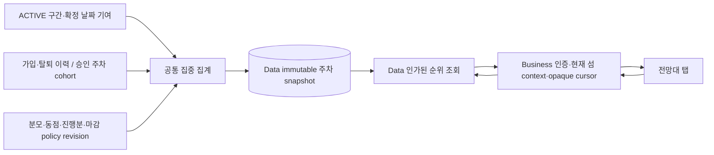
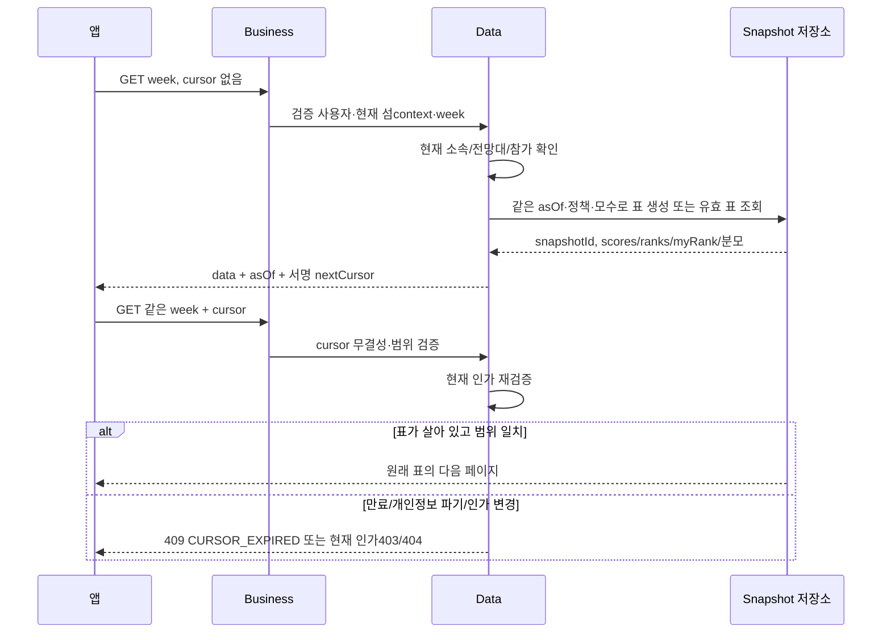

# 주간 랭킹 아키텍처·데이터 흐름

랭킹은 계속 움직이는 전광판을 페이지마다 다시 읽는 대신, 한 시점에 찍은 성적표를 넘겨 보는 방식이다. 성적표에는 순위와 시간, 본인 순위까지 같이 적는다. 새로고침하면 새 성적표를 받고, 페이지를 넘길 때는 원래 표를 사용한다.

하나의 표가 만들어지는 동안 DB의 읽기 snapshot과 asOf를 고정한다. 서로 다른 HTTP 호출로 주민별 점수를 모아 표를 만드는 N+1은 피한다. timestamp만 저장해 두고 나중에 현재 DB에서 점수를 재계산하는 것은 같은 표가 아니다. 참여 자격과 순위 의미가 미결이면 그 표를 생성·공개하지 않는다.

일주일 마감과15분 cursor 수명은 다르다. cursor15분이 지나면 페이지 탐색을 새로 시작하고, 지난 주 결과의 보관/수정 가능 기간은 승인된 별도 정책에 따른다. GET나 snapshot 생성은 기존 리그 지급 함수를 호출하지 않는다.
