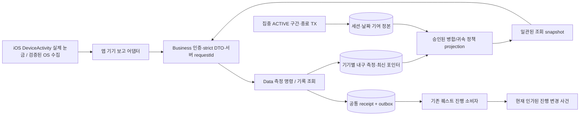
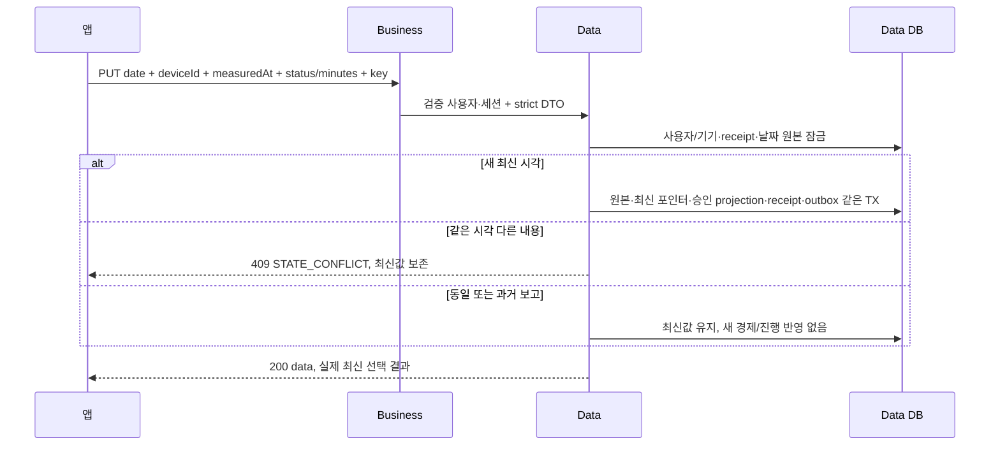

# 회관 기록 아키텍처와 데이터 흐름

기록 화면은 장부를 읽는 창구다. 집중 서비스가 적은 실제 집중 구간과 기기가 보낸 측정 봉투를 Data가 보관하고, 같은 시점의 표를 만든다. Business는 표의 권한과 형태를 확인해 앱으로 돌려준다. 표를 다시 열었다고 보상을 다시 주지 않는다.

원본 수집 범위와 KST 하루가 맞지 않으면 단말의 로컬 합계를 다른 날짜 이름으로 재포장하지 않는다. 서버는 총합90분만으로 어느 시간대에 썼는지 복원할 수 없다. 승인된 수집 경계가 없으면 숫자 대신 측정 상태를 사용한다.

집중 조회의 total/series/records는 한 snapshot에서 계산한다. 이후 페이지도 같은 snapshot을 읽고 현재 인가는 다시 확인한다. finish가 그 사이 일집계로 옮겨가도 완료와 진행을 동시에 두 번 더하지 않는다. 경제 원장·퀘스트 보상 정산은 조회나 snapshot 생성의 부수효과가 아니다.
