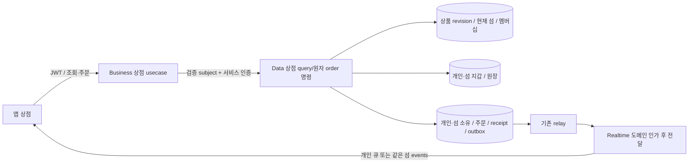
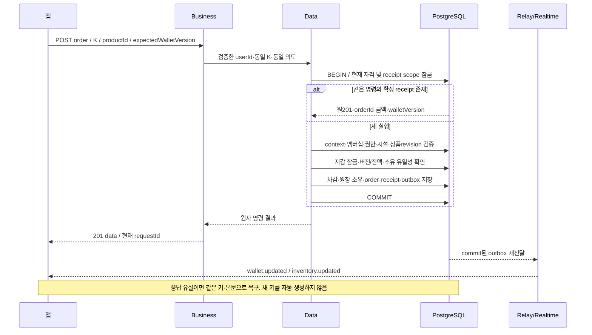

# 섬 상점 — 구성 설계

GROMO-1780 · [정책](policy.md) · [상세 계약](low-level-design.md)

## 소유 경계

Business는 DB나 별도 지갑 캐시 정본을 만들지 않는다. 조회의 context는 인증 사용자와 경로 섬에서
정본을 한 번 읽어 확정하고, 명령은 Data가 커밋 경계에서 다시 검증한다. DTO 응답 캐시가 결제 인가,
현재 섬 선택, 잔액, 상품 가격의 정본이 될 수 없다. 새 Data/Realtime 인가 제공자가 준비되기 전에
1755의 비활성 전달 adapter를 켜지 않는다.

개인/공동 지갑은 같은 Data DB에서 독립 owner aggregate다. 사용자에게는 함께 보여도 한 잔액으로 합치지
않는다. 주문이 양쪽 지갑을 동시에 차감하는 동작은 이 스펙에 없다. 건설/퀘스트/집중 정산은 같은
지갑·원장 서비스와 잠금 순서를 공유한다.

## 주문과 응답 유실

receipt 재생은 인증을 생략하지 않는다. 개인 결과는 본인, 공동 결과는 현재 접근 가능한 섬만 공개한다.
공동 권한이 사라져 원 결과를 공개할 수 없더라도 receipt를 지워 새 구매로 바꾸지 않는다.
현재 섬 변경 후 같은 성공 receipt를 읽는 것은 새 차감이 아니며, 새 실행의 current-island 검증과 분리한다.

## 락과 이벤트

Data의 공통 사용자/섬 생명주기 잠금 순서를 따른다. 상세 순서는 LLD의 제안이며 focus/건설·계정탈퇴
담당과 함께 확정한다. 사용자·멤버십 자격을 잠그지 않고 먼저 wallet을 잠그면 탈퇴 정리 이후 유령 소유가
생길 수 있다. 어떤 예외든 주문과 원장·소유·receipt·outbox가 같이 rollback되어야 한다.

이벤트가 늦거나 유실돼도 GET wallet/inventory/orders가 복구 정본이다. 이벤트에는 잔액 전체나 개인
구매 내역을 넣지 않는다. 1754의 버전 무효화 신호를 받아 같은 정본을 다시 조회한다. 실제 내구 relay와
최신 수신권한은 기존 공통 전달 기반 및 각 도메인 활성화가 제공한다.

## 기존 구현 재사용의 한계

`CurrencyLedgerService`의 지갑잠금+원장 멱등 패턴은 참고하지만 현재 인자는 User/UserWallet이다.
`InventoryService.grantItem`은 가격 결제없는 구 아이템 지급이며 새로운 주문 처리로 노출하지 않는다.
`EquipmentService`의 구 슬롯 검증도 새 clothes/decor/hull과는 다르다. 코드 재사용은 승계 정책을 확정한
뒤 내부 port 수준에서 검토하며, 원자 주문을 기존 currency debit HTTP와 item grant HTTP 두 개로 만들지 않는다.
