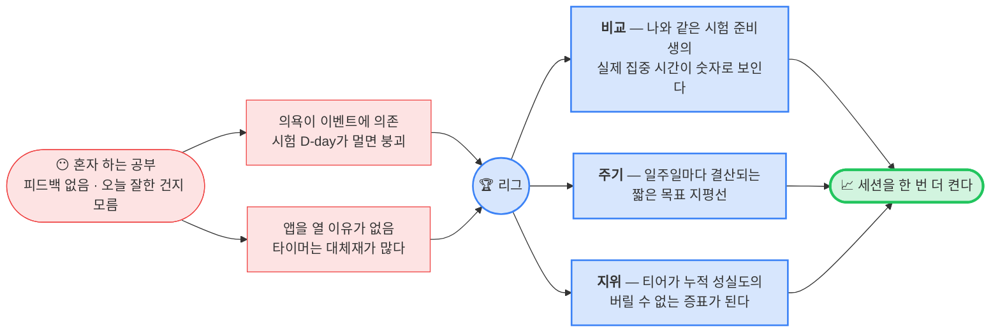

# 리그 — PRD (Product Requirements Document)

> 작성 2026-08-09 · 현재 구현 상태 기준
> 세트: [IA](information-architecture.md) · **PRD** · [HLD](high-level-design.md) · [LLD](low-level-design.md)

---

## 1. 리그가 푸는 문제



집중 시간은 혼자 보면 그냥 숫자다. **같은 시험을 준비하는 사람들 옆에 놓일 때만 의미가 생긴다.**
리그는 그 비교축을 만들고, 티어는 그 비교를 일주일 단위로 결산해 **버리기 아까운 자산**으로 바꾼다.

---

## 2. 목표 / 비목표

| | 내용 |
|---|---|
| **G1** | 주간 집중 시간을 **경쟁 가능한 공개 숫자**로 만든다 (직군 랭킹 · 전체 랭킹) |
| **G2** | 티어로 **일주일 단위 목표 지평선**을 준다 — 다음 단계까지 남은 시간이 항상 보인다 |
| **G3** | 주간 마감 결과를 **놓칠 수 없는 연출**로 전달한다 (승격/유지/강등 · 1회성) |
| **G4** | 핀으로 **나만의 비교 대상**을 고르게 한다 — 전체 1등이 아니라 "그 사람"을 이기게 |
| **G5** | 친구 관계로 **더 깊은 비교**(요일별·과목별)를 잠금 해제한다 |
| **N1** | ~~실시간 경쟁~~ — 순위는 폴링·화면 진입 기준이다. 초 단위 정합은 목표가 아니다 |
| **N2** | ~~보상 극대화~~ — 승급 보너스는 부수 효과지, 리그를 하는 이유가 아니다 |
| **N3** | ~~부정 방지의 완결~~ — 집중 시간 자체의 신뢰성은 focus-session 도메인 과제다 |
| **N4** | ~~소셜 그래프 구축~~ — 친구는 비교 대상 확보 수단이지 메신저가 아니다. 채팅·피드 없음 |
| **N5** | ~~티어 하향 방어~~ — 강등은 벌이 아니라 정직한 신호로 둔다. 방어권·보호막 없음 |

---

## 3. 유저 스토리

| # | 사용자 | 스토리 |
|---|---|---|
| U1 | 노무사 준비생 | 같은 노무사 준비생들이 이번 주 몇 시간 공부했는지 보고, 내가 몇 등인지 알고 싶다 |
| U2 | 순위권 밖 사용자 | 100등 밖이라 리스트에 없어도, **내 이번 주 집중 시간과 다음 티어까지 남은 시간**은 정확히 알고 싶다 |
| U3 | 경쟁형 사용자 | 전체 1등은 너무 멀다. **내 바로 위 사람과의 격차**가 몇 분인지 보고 싶다 |
| U4 | 특정 라이벌이 있는 사용자 | 친구가 아니어도 그 사람을 **핀**해서 나와 나란히 보고 싶다 |
| U5 | 월요일 아침 사용자 | 앱을 켰을 때 **지난주 결과가 무엇이었는지** 바로 알고 싶다 (놓치고 싶지 않다) |
| U6 | 신규 사용자 | 티어가 뭔지, 어떻게 올라가는지, 언제 정산되는지 **설명받고 싶다** |
| U7 | 친구를 찾는 사용자 | 닉네임으로 검색해 친구 신청하고, **받은 요청을 한 곳에서** 수락/거절하고 싶다 |
| U8 | 친구가 있는 사용자 | 친구의 **요일별 집중·폰 사용·과목별 공부량**을 내 것과 비교하고 싶다 |
| U9 | 집중 세션 중인 사용자 | 지금 **누가 같이 집중 중인지** 보면서 혼자가 아니라고 느끼고 싶다 |

---

## 4. 요구사항

### 4.1 랭킹

모수는 둘이다 — **내 시험(직군) 상위 100명**(`/league/me/ranking?category=`, 라이브 상태 포함)과 **전역 상위 100명**(`/league/ranking?scope=total`, 라이브 없음). 직군 목록이 비면 전역으로 폴백하되 라벨은 붙이지 않는다.

| ID | 요구사항 |
|---|---|
| R1 | 랭킹은 **이번 주 누적 집중 시간 내림차순** 상위 100명을 보여준다 |
| R2 | Top3는 포디움(2·1·3 배치), 4위부터 리스트. 내 행은 강조하고 진입 시 자동 스크롤한다 |
| R3 | **sticky 내 순위 스트립** — 항상 화면 상단에 내 등수와 "▲ N위까지 HH:MM:SS"를 띄운다 |
| R4 | 내 이번 주 집중 시간은 **순위와 무관하게 정확**해야 한다 (top-100 밖이어도) |
| R5 | 집중 중인 멤버는 초록 점 · 과목명 · **초 단위로 올라가는 시간**을 보여준다 |
| R6 | 조회 실패는 "아무도 없는 리그" 빈 상태와 **구분**해 에러 + 재시도로 안내한다 |
| R7 | 당겨서 새로고침 — 탭별로 그 탭 데이터만 재조회한다 |

### 4.2 티어 · 승급 / 강등 규칙

**승강은 순위가 아니라 절대 주간 집중 시간으로 결정된다.**

| 티어 | 이름 | 승급 기준(주간) | 강등 기준(주간) | 승급 보너스 |
|---|---|---|---|---|
| 1 | 뽀시래기 | **14시간** 이상 → T2 | 없음 (최하위) | — |
| 2 | 예열 모드 | **28시간** 이상 → T3 | **14시간** 미만 → T1 | 50 시간조각 |
| 3 | 초집중 모드 | **42시간** 이상 → T4 | **28시간** 미만 → T2 | 100 시간조각 |
| 4 | 갓생러 | **56시간** 이상 → T5 | **42시간** 미만 → T3 | 200 시간조각 |
| 5 | 집중 정복자 | 없음 (최상위) | **56시간** 미만 → T4 | 500 시간조각 |

판정식 (`LeagueUserSettler.decideResult`):

```
tier < 5 && focusSeconds >= promotionTime  → PROMOTED
tier > 1 && focusSeconds <  relegationTime → RELEGATED
그 외                                      → STAY
```

| ID | 요구사항 |
|---|---|
| R8 | 티어는 **1~5 단계**, 한 번의 정산에서 **최대 한 단계**만 움직인다 |
| R9 | 승급 보너스는 **승급한 새 티어 기준** 금액을 지급하고, 결과 응답에 실제 지급액을 싣는다 |
| R10 | 앱은 서버가 준 지급액만 표시한다 — **클라가 금액을 계산하지 않는다** (유령 배지 방지) |
| R11 | TierGuide는 5단계 전체와 **다음 단계까지 남은 시간**을 보여준다 |

> 🟥 **문구 결함** — 리그 첫 진입 가이드는 "한 주가 끝나면 **순위에 따라** 티어가 올라가거나 내려가!"라고
> 말하지만(`LeagueScreen.tsx:281`), 서버 판정은 **순위를 전혀 보지 않는다**. 사용자에게 잘못된 행동
> 모델을 심는다. TierGuide 문구("기준을 채우면 승급")가 맞다.

### 4.3 정산 시점

| ID | 요구사항 |
|---|---|
| R12 | 정산은 **매주 월요일 00:00 KST** 자동 실행한다 |
| R13 | 배치가 중간에 실패해도 **재실행이 안전**해야 한다 — 완료 마커로 정확히 한 번만 정산 |
| R14 | 실패한 주차는 `POST /league/batch/resume`으로 **주차를 지정해 복구**할 수 있다 |
| R15 | 한 유저의 정산 실패가 **다른 유저의 정산을 막지 않는다** (유저 단위 트랜잭션) |
| R16 | 마감까지 남은 시간은 서버가 초로 주고, 앱이 1초씩 감산해 카운트다운한다 |
| R17 | 결과 발표 푸시는 정산과 **별도 스케줄**(월 07:00 KST)로 나간다 — 정산 직후가 아니라 사람이 깨어 있을 시각에 알린다 |

> 🟥 **문구 결함** — TierGuide는 "매주 **월요일 09시** 정산"이라고 안내한다(`TierGuideScreen.tsx:125`).
> 실제 정산 cron은 **00:00 KST**, 결과 푸시는 **07:00 KST**다. 09시는 어느 쪽도 아니고,
> 마감 카운트다운(서버 `nextResetAt` = 다음 월요일 00:00)과도 9시간 어긋난다.

> ⚠️ **"지난주 결과"가 아니라 "최신 결과"** — `GET /league/me/last-result`는 주차 필터 없이 가장 최근
> 정산 결과 1건을 준다. 배치가 밀렸거나 resume으로 과거 주차를 복구한 뒤에는 직전 주가 아닐 수 있다.
> 앱은 응답의 `weekStartAt`을 그대로 ack 키·연출 가드로 쓴다(`useLeagueLastResult.ts:31,38`).

### 4.4 결과 연출

| ID | 요구사항 |
|---|---|
| R18 | 미확인 결과가 있으면 리그 탭 진입 시 **자동으로** 결과 화면을 띄운다 |
| R19 | 같은 주차 결과는 **정확히 1회**만 연출한다 (`acknowledged` + 앱 세션 내 `shownWeek` 가드) |
| R20 | 승격·유지·강등 세 타입 모두 같은 포맷 — 강등도 숨기지 않는다 |
| R21 | ack 실패 시 **재연출하지 않고 ack만 재시도**한다 (같은 축하를 두 번 보여주지 않는다) |
| R22 | 모르는 `result` 값은 승격/강등으로 오연출하지 않고 **유지로 폴백**한다 |

### 4.5 친구 정책

| ID | 요구사항 |
|---|---|
| R23 | 친구 추가는 **닉네임 검색 → 신청 → 상대 수락**의 양방향 승인제 |
| R24 | 검색 결과는 나와의 관계(`NONE`/`PENDING`/`FRIEND`)를 함께 보여준다 |
| R25 | 이미 신청한 상대에게 '친구 신청' 버튼이 다시 보이지 않는다 (409 중복 방지 UI) |
| R26 | 친구 끊기는 확인 다이얼로그를 거친다. 이미 끊긴 상태(404)도 성공으로 처리한다 |
| R27 | 요약 통계(오늘 집중·연속)는 **친구 여부와 무관하게 항상 공개**한다 |
| R28 | 세부 비교(요일별·과목별)는 **친구이거나 전체공개**일 때만 — 아니면 잠금 카드로 친구 신청을 유도 |

### 4.6 핀 정책

| ID | 요구사항 |
|---|---|
| R29 | 핀은 **친구가 아니어도** 가능하다 — 랭킹에서 본 낯선 사람도 고정할 수 있다 |
| R30 | 핀은 **단방향**이다 — 상대의 승인이 필요 없고, 상대에게 알리지 않는다 |
| R31 | '핀한 사람만' 필터는 **나 + 핀한 사람**을 보여주고 나 대비 시간 차를 붙인다 |
| R32 | 핀이 하나도 없으면 필터는 나만 남기지 않고 **비운다** (혼자 있는 화면 금지) |
| R33 | 핀 토글은 낙관적으로 즉시 반영하고, 실패하면 롤백 + 안내한다 |
| R34 | 집중 세션 화면의 리그 그리드는 **핀한 멤버를 상한 컷보다 먼저** 포함한다 |

> **친구 ≠ 핀.** 집중 세션의 친구 그리드는 친구 **전체**가 대상이고, 핀은 **랭킹 고정용**이다.
> 서버 API 문서는 핀을 "홈·집중·리그 화면에 표시"로 서술하지만(`PinController.java:35`),
> 앱 구현에서 핀의 역할은 랭킹 필터와 세션 리그 그리드 우선순위다.

---

## 5. 성공 지표

3층으로 본다 — **L1 성과**(리그가 세션을 더 일으켰나) ← **L2 행동**(리그를 어떻게 쓰나)이 원인을 설명하고, **L3 건전성**(경쟁이 사람을 쫓아내지 않나)이 전제 조건을 지킨다.

### 5.1 L1 — 성과

| ID | 지표 | 산출식 | 측정 |
|---|---|---|---|
| **S1** | **리그 열람 → 세션 시작 전환율** (북극성) | `league_viewed` 후 1시간 내 세션 시작 유저 ÷ `league_viewed` 유저 | GA4 |
| S2 | 주간 리텐션 차이 | 리그 열람 유저 W+1 복귀율 − 미열람 유저 복귀율 | GA4 + 서버 |
| S3 | 월요일 복귀 스파이크 | 결과 연출 노출 유저의 당일 세션 시작률 | GA4 |
| S4 | 티어 상승 유저 비율 | `PROMOTED` 유저 ÷ 정산 대상 유저 | `league_weekly_results` |

### 5.2 L2 — 행동

| ID | 지표 | 무엇을 알려주나 | 이벤트 |
|---|---|---|---|
| U1 | 리그 탭 진입 빈도 | 비교축이 습관인가 | `league_viewed` |
| U2 | 넛지 탭률 | 내 순위 스트립(격차)이 실제로 유도하는가 | `nudge_viewed`/`nudge_tapped` (`type: 'rank'`) |
| U3 | 전체 ↔ 직군 전환률 | 어느 모수에서 비교하고 싶어하나 | `league_filter_selected` |
| U4 | 프로필 열람률 | 남의 기록을 파고드는 정도 | `league_profile_opened` |
| U5 | 핀 사용률 | 나만의 라이벌을 만드는가 | `friend_pin_toggled` |
| U6 | 친구 신청 → 수락 전환율 | 관계 형성 퍼널의 병목 | `friend_request_sent`/`_accepted` |
| U7 | 티어 안내 열람률 | 규칙이 스스로 이해되는가 | `tier_guide_viewed` |

### 5.3 L3 — 건전성 가드레일

| ID | 가드레일 | 왜 감시하나 |
|---|---|---|
| GR1 | **강등 후 이탈률** | 강등이 벌처럼 느껴지면 리그가 이탈 장치가 된다. 승격 유저 대비 D+7 복귀율 차이로 본다 |
| GR2 | **티어 분포 쏠림** | T1에 90%가 고이면 14시간 문턱이 너무 높다는 뜻 |
| GR3 | **랭킹 표시 실패율** | 조회 실패가 "아무도 없는 리그"처럼 보이면 리그 자체가 죽어 보인다 |
| GR4 | **정산 실패 유저 수** | 배치 요약 로그의 `failed` — 0이 아니면 resume 필요 |
| GR5 | **top-100 밖 비율** | 리스트에 영영 못 드는 유저가 다수면 아레나 분할이 필요하다 |

---

## 6. 앞으로 변할 방향

- **순위와 승강의 재결합** — 순위 기반 승강은 **이미 한 번 버려졌다**. `arena_size`·`promote_count`·`relegate_count`·`relegate_warning_count` 컬럼과 아레나 멤버십 테이블(`league_arena_users`)이 `V14`에서 제거됐고, 남은 것은 시간 임계값뿐이다. 지금 필요한 결정은 "순위제로 돌아갈지"가 아니라 **순위 UI가 주는 기대를 문구로 정정할지**다.
- **아레나 분할** — 전 유저 통합 랭킹은 상위 100명 밖 사용자에게 아무 의미가 없다. 아레나는 현재 **주차 anchor 1행**일 뿐 그룹핑 기능이 없다. 티어별·규모별로 쪼개면 "내 리그 안 순위"가 살아난다.
- **정확한 내 순위의 화면 반영** — `GET /league/me/rank`는 top-100 밖에서도 정확한 순위를 SQL로 계산해 준다. 앱은 이 API가 호출마다 `LEAGUE_RANK_VIEWED` 활동 로그를 남긴다는 이유로 쓰지 않고 top-100 목록 위치로 대체한다(`useLeagueRanking.ts:68`). 계측 부작용을 분리하면 U2 스토리가 그대로 풀린다.
- **강등 예고의 앱 내 표면** — 서버에는 이미 강등 경고·위기 푸시 스케줄이 있다(일 09:00 위기, 일 18:00 강등 경고). 앱 화면에는 대응하는 표시가 없어 푸시를 놓치면 끝이다.
- **최고 티어의 목표 소실** — T5는 승급할 곳이 없어 "56시간만 넘기면 유지"가 된다. 시드의 T5 `promotion_time`(70시간)은 판정에 쓰이지 않는 사문 값이다. 시즌·명예 점수 같은 상위 목표가 필요하다.
- **캐릭터 아바타** — 랭킹의 모든 아바타가 같은 이미지다. 커스터마이징 도메인과 연결되면 리그가 캐릭터 노출 무대가 된다.

## 7. 트레이드오프 및 한계

| 결정 | 트레이드오프 | 한계 (수용) |
|---|---|---|
| 절대 시간 기준 승강 | 규칙이 단순·설명 가능 ↔ "경쟁"의 실감이 약함 | 남을 이겨도 티어는 안 오른다 — 순위 UI가 주는 기대와 어긋난다 |
| 주 1회 정산 | 짧은 목표 지평선 ↔ 즉시성 없음 | 금요일에 분발해도 결과는 월요일에나 확인된다 |
| 상위 100명만 노출 | 응답 가볍고 단순 ↔ 대다수가 리스트 밖 | 내 주간 시간을 세션 합산으로 따로 구해 보완했지만, "내 옆 사람"은 여전히 안 보인다 |
| 강등 방어 없음 | 정직한 신호 ↔ 이탈 리스크 | 아프면 한 주 쉬어도 강등된다. GR1 가드레일로 감시만 한다 |
| 핀 단방향·무통보 | 부담 없이 라이벌 지정 ↔ 상호 인지 없음 | 핀은 사회적 신호가 되지 못한다 (순수 개인 도구) |
| 친구 승인제 | 원치 않는 노출 차단 ↔ 퍼널 손실 | 신청→수락 두 단계에서 이탈한다. 요약 통계 상시 공개(R26)로 완화 |
| 전체 탭에 라이브 없음 | 전역 쿼리 비용 절감 ↔ 탭마다 표현이 다름 | 같은 사람이 직군 탭에선 "집중 중", 전체 탭에선 정지 상태로 보인다 |
