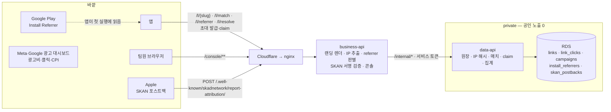
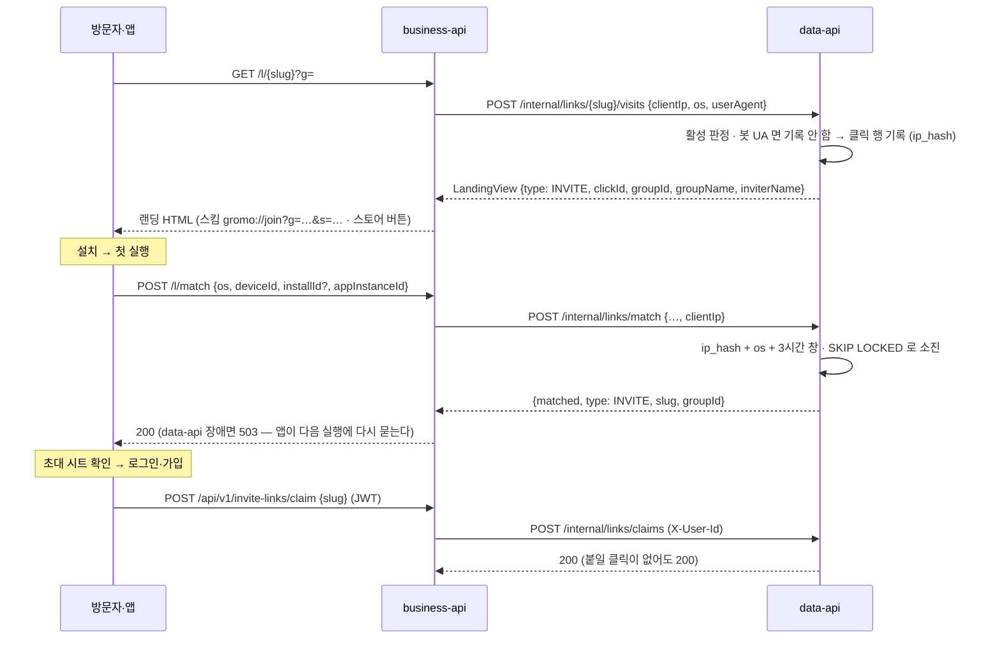
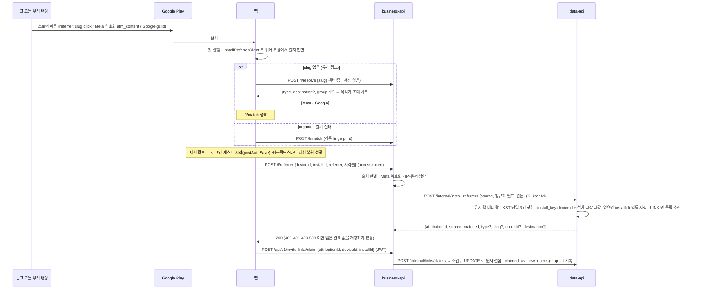
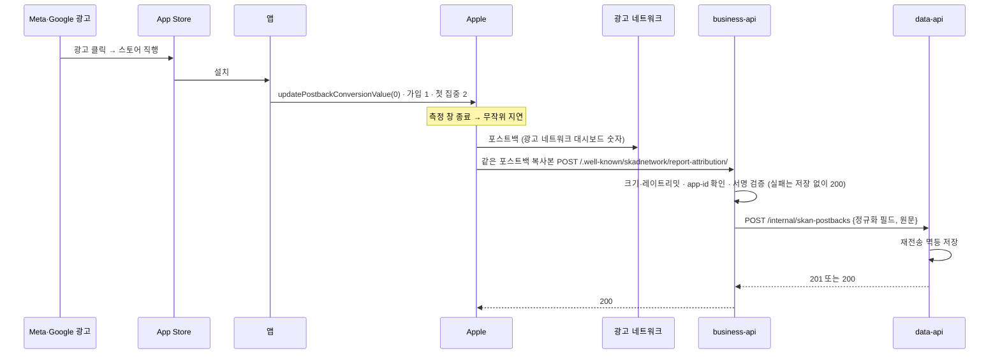

# 링크·어트리뷰션 아키텍처

링크의 공개 입구는 business-api 하나이고, 장부는 data-api 가 쥔다. business-api 는 외부 형식(HTML · Play referrer 문자열 · Apple 포스트백 JSON)을 읽고 검증하는 창구이고, data-api 는 그 결과를 링크·그룹·유저와 **같은 DB 트랜잭션**에 적는 곳이다. 광고 플랫폼 대시보드는 서버와 연결하지 않는다.

## 1. 구성

| 컴포넌트 | 한다 | 안 한다 |
| --- | --- | --- |
| nginx | `/l/`·`/link/`·`/.well-known/`·`/console/` 와 초대 발급·claim 을 business-api 로 보낸다. realip 로 클라이언트 IP 를 복원해 `X-Real-IP` 로 넘긴다(현행) | data-api 로 가는 링크 경로 |
| business-api | 공개 HTTP 계약(HTML · JSON · AASA · assetlinks), 신뢰 헤더에서 클라이언트 IP 추출, referrer 문자열 판별·Meta 복호화, SKAN 서명 검증(통과분만 전달), 콘솔 세션·화면, 공개 경로 레이트리밋 | DB 접근, IP 해시, 매치·claim·귀속 판정 |
| data-api | 링크·클릭·캠페인·referrer·포스트백 저장, IP 해시, fingerprint 매치(`SKIP LOCKED`), claim, 초대 링크 수명([정책 L04](policy.md)), 집계 SQL, 서버 GA4 이벤트 | 외부 요청 수신, 외부 형식 파싱 |
| 앱 | 링크 파싱, 매치·referrer·resolve 전송, claim, SKAN 전환값 갱신 | 귀속 판정 |

## 2. 분리안과 무엇이 다른가

분리안(별도 저장소 · Vercel · Neon)은 링크 서버가 코어 DB 를 읽지 못해서 생긴 장치가 대부분이었다. 한 DB 로 돌아오면 아래가 전부 사라진다.

| 분리안이 요구한 것 | 이유 | 이 설계 |
| --- | --- | --- |
| 발급 때 표시정보 스냅샷 + 변경 이벤트 relay (A22 ㋡) | 링크 서버가 그룹명·닉네임을 못 읽음 | 랜딩 때 조회(현행) |
| revoke 에 `linkVersion`·`membershipEpoch` 분리 적재 (ⓑ″ · ㋑ · ㊊) | HTTP 적용 순서가 보장되지 않음 | 멤버십 전이와 같은 트랜잭션에서 폐기 |
| 링크 서버 서명 자격 `LINK_CAPABILITY_KEY` (ⓚ) | 비공개 가입 검증이 두 DB 에 걸침 | 가입 트랜잭션 안에서 링크 행 잠금·재검증 |
| claim 잠정 기록 + `link.claimConfirmed` relay (㋟ · ㋙) | claim 유효 순서를 Data 가 가짐 | claim·가입이 같은 DB |
| 클릭 이관 정지 창 · 동결 스냅샷 (ⓕ · ⓛ · ㉰) | 원장이 다른 DB 로 이동 | 이관 없음 — 컬럼 추가(expand) 뒤 이름 변경(contract) |
| nginx → Vercel 프록시 · XFF 재작성 · `LINK_PROXY_SECRET` | 랜딩과 매치가 다른 엣지에서 IP 를 봄 | 같은 홉, 현행 `X-Real-IP` 규칙 |
| 서비스 토큰 business→link · data→link · 링크 콘솔→notification | 호출 방향 | 없음. 기존 business→data 하나에 경로만 추가 |

## 3. 흐름

### 3.1 초대 링크 — 위치만 바뀐다

그룹 가입 자체는 그룹 API 가 한다. 매치·claim·랜딩의 활성 판정과 폐기 규칙은 그룹 획득 문서를 따른다.

### 3.2 캠페인 링크 — 오가닉

3.1 과 같은 파이프를 탄다. 다른 점은 넷이다.

- 랜딩 문구에 그룹·초대자가 없고, 스킴 버튼은 캠페인의 목적지(`gromo://…`)를 연다.
- Android 스토어 버튼이 Play 스토어 URL 의 `referrer` 파라미터에 `slug`·`click`(방문 응답의 `clickId`)을 심는다. 콘솔이 캠페인 링크와 함께 주는 Play URL(광고·게시물에 직접 넣는 용)은 방문 전이라 `slug` 만 심는다. 그래서 Android 는 3.3 의 referrer 경로로 결정적으로 귀속되고, fingerprint 는 iOS 와 Android 의 referrer 유실분만 받는다.
- 매치 응답에 `type: CAMPAIGN`·`destination` 이 붙고, 앱은 그 목적지로 이동한다. claim 은 기록만 한다.
- **이미 앱이 깔린 사용자**가 링크를 누르면 Universal Link·App Link 가 랜딩 없이 앱을 연다. 앱은 `POST /l/resolve {slug}` 로 목적지(INVITE 면 `groupId`)를 받는다. 신규 설치가 아니므로 클릭을 기록하지 않는다.

### 3.3 Android — Install Referrer

설치 단위는 `install_key` 라, 같은 기기에서 앱을 지웠다가 다른 광고로 다시 깔면 새 설치로 센다. 앱의 완료 값(referrer 보고와 fingerprint 매치)도 처리한 설치 키(Play 설치 시작 초, 없으면 `installId`)로 저장해, Auto Backup 으로 복원돼도 재설치에서 다시 시도한다. 서버도 설치를 백업되지 않는 `installId` 로 가른다 — 매치 창 안 재설치가 복원된 `deviceId` 로 과거 매치를 돌려받지 않고, Play 설치 시각이 없는 referrer 도 설치마다 다른 키가 된다. 저장은 세션 확보 뒤라 첫 실행 뒤 로그인·게스트 시작 없이 앱을 떠난 설치는 우리 수치에 들어가지 않는다. Auto Backup 이 로그인 세션까지 복원하면 재설치한 앱은 로그인 화면을 건너뛰므로, 저장은 **콜드스타트 세션 복원이 성공한 직후**에도 보낸다. 대신 토큰 없는 위조 저장이 막힌다(§5).

### 3.4 iOS 광고 — SKAN 포스트백

## 4. 누가 무엇을 세나

| | Meta·Google 대시보드 | 우리 서버 | 유저 단위 | 콘솔 신뢰도 표기 |
| --- | --- | --- | --- | --- |
| 광고비 · 노출 · 클릭 · CPI | 준다 | 만들지 않는다 | — | — |
| 설치 — iOS 광고 | 준다 | SKAN 복사본 집계 | 불가 | 집계·지연 |
| 설치 — Android 광고 | 준다 | Install Referrer | 가능 | 결정 |
| 가입 — iOS 광고 | 전환값으로 표시 | 복사본의 전환값 집계 | 불가 | 집계·지연 |
| 가입 — Android 광고 | 못 준다 | claim (Google·캠페인 미귀속 Meta 는 채널 합계) | 가능 | 결정 |
| 오가닉 링크 퍼널 | 못 준다 | 클릭 · fingerprint 또는 referrer · claim | 가능 | 확률 또는 결정 |

## 5. 신뢰 경계와 실패

- **외부 형식 파싱은 business-api, 판정과 저장은 data-api.** data-api 는 business-api 의 서비스 토큰 호출만 믿는다.
- **클라이언트 IP**: nginx 가 Cloudflare 대역 피어일 때만 `CF-Connecting-IP` 를 믿어 `X-Real-IP` 로 넘긴다(현행 `ClientIpResolver` 규칙). business-api 가 같은 규칙으로 IP 를 뽑아 `clientIp` 로 넘기고, data-api 가 솔트로 해시한다. 원본 IP 는 DB 에도 Redis 키에도 저장하지 않는다.
- **앱 계약 보존**: `/l/match`·`/l/referrer`·`/l/resolve` 는 결과가 없으면 200(`{matched:false}`)이고, **data-api 장애·타임아웃은 503, 레이트리밋은 429** 다. 현 앱은 2xx 가 아닐 때 완료 플래그를 세우지 않고 다음 실행에 다시 묻는다. 앱의 매치 타임아웃(5초) 안에 끝나도록 내부 호출 예산을 둔다.
- **랜딩 강등**: data-api 가 응답하지 않으면 스토어 버튼만 있는 기본 랜딩을 준다. 클릭은 기록하지 않는다.
- **SKAN**: 공개·무인증 경로라 **서명을 통과한 우리 앱 포스트백만 저장한다.** 서명 실패·모르는 버전·다른 앱은 저장 없이 200 으로 끝내고 건수만 센다. 본문 16KB 제한, IP 레이트리밋, Cloudflare 엣지 레이트리밋을 함께 둔다. 저장 실패만 5xx 로 남겨 경보한다.
- **referrer 저장 위조**: `/l/referrer` 만 access token 을 요구한다(게스트 포함). 위조량이 게스트 생성 한도(IP 당 시간당 10회, 전체 시간당 300회)에 묶이고, 유저 행 배타 락 아래에서 세는 KST 당일 3건 상한이 동시 요청까지 한 번 더 막는다. 첫 실행의 출처 판별은 앱이 로컬에서 하므로 토큰이 없어도 매치 생략·초대 시트가 늦지 않는다.
- **미리보기 봇**: 카카오톡·Slack·Meta 의 링크 미리보기 수집기는 클릭으로 기록하지 않는다(현행 봇 판별 유지).
- **랜딩 클릭 저장량**: `User-Agent` 는 위조할 수 있으므로 봇 판별만으로는 클릭 부풀림을 못 막는다. `GET /l/{slug}` 에 slug 와 무관한 IP 단위 한도를 두고(넘으면 랜딩만 보여주고 클릭 미기록), data-api 는 같은 링크·IP 해시·OS 의 미매치 클릭을 매치 창 안에서 20건까지만 새로 만든다. Cloudflare 엣지 한도도 같이 둔다.
- **캠페인 플랫폼**: 캠페인의 플랫폼과 다른 OS 로 들어온 설치·가입은 그 캠페인 수치에 넣지 않고 채널 합계로 뺀다. iOS 캠페인에는 Play URL 을 발급하지 않고 랜딩에서 Android 스토어 버튼을 숨긴다.
- **공개 경로 인증 예외**: business-api 의 토큰 필터는 전부 막고 열거한 것만 연다. 예외는 (메서드, 디코딩 전 경로) 정확 목록이고 `/l/**` 같은 와일드카드를 쓰지 않는다 — `/l/referrer` 는 같은 접두어를 쓰는 인증 경로다.
- **가입 수**: 현 앱은 기존 계정 로그인에서도 claim 하므로, claim 때 유저 가입 시각으로 신규 여부를 기록해 신규만 가입 수에 넣는다. referrer 의 비교 기준은 Play 설치 시작 시각(없으면 Play 클릭 시각)이고, 둘 다 없을 때만 저장 시각에서 10분 유예를 뺀 값이다 — referrer 는 로그인 뒤 저장되므로 저장 시각을 그대로 쓰면 신규 사용자가 전부 기존 계정으로 판정된다. 클라이언트가 보낸 신규 여부는 쓰지 않는다. 기간은 claim 시각이 아니라 가입 시각(`signup_at`)으로 자른다.
- **공개 경로 레이트리밋**: 인증이 없는 공개 경로는 business-api 가 IP 단위로 제한한다. 키에는 원본 IP 대신 business-api 전용 비밀로 HMAC 한 값을 쓴다.
- **claim·referrer 저장과 탈퇴**: claim 은 유저 행 공유 락, referrer 저장은 배타 락을 잡아 유저 행을 배타 락으로 잡는 탈퇴와 직렬화된다. 탈퇴 뒤 연결도 `reporter_user_id` 도 남지 않는다. `attributionId` claim 은 조건부 UPDATE 한 번이라 동시 요청 중 하나만 성공한다.

## 6. 기존 결정과의 관계

[아키텍처 결정 장부](../../architecture/decisions.md)는 "어긋나면 이 장부가 맞다"를 규칙으로 둔다. 이 설계는 **A23** 으로 등록되어 다음에 우선한다.

- A8 의 "`/l/**`·`/.well-known/**` 은 nginx/link 서버 몫"
- A11 ⑥ 서비스 토큰 중 링크 콘솔→notification · business→link · data→link
- A12 의 "링크 서버(Vercel)는 브로커에 붙지 않는다"
- A17 의 "link 는 스택이 달라 각자 저장소"
- A22 에서 링크 서버·Neon 을 전제로 한 항목
- `service-architecture.md`·`system-architecture.md` 의 링크 서버·컷오버 서술

원문은 장부의 취소선 정책대로 남긴다.

## 7. 배포 순서

같은 DB 를 두 경로가 함께 읽으므로 **데이터 이관 창이 없다.** 공개 경로 전환은 nginx 설정 한 번이고, 되돌리기도 한 번이다. 스키마는 expand(추가만)와 contract(이름 변경·DROP)로 나눠, **5단계 전까지는 모든 단계를 이전 이미지로 되돌릴 수 있다**(prod 는 `ddl-auto: validate` 라 테이블 이름이 바뀌면 이전 이미지가 기동하지 못한다). **5단계 contract 는 roll-forward 전용**이다.

| 단계 | 내용 | 되돌리기 |
| --- | --- | --- |
| 1 | PR #745 머지(링크 코드 포함). 링크 경로는 data-api 공개 컨트롤러가 계속 서빙하고, [LLD §9.1](low-level-design.md#91-머지-뒤-켜지-않는-것) 의 설정은 켜지 않는다 | — |
| 2 | data-api: **스키마 expand**(기존 테이블 이름 그대로 컬럼·제약 추가, 신설 3, **V21 전체 unique 유지**) · `invitelink` 일반화(엔티티는 `@Table` 로 옛 이름) · `/internal/*` · #745 의 data-api 링크 사장 코드 제거. **기존 공개 컨트롤러와 V52 링크 테이블은 남기고, 링크 폐기·재발급은 켜지 않는다** | 이미지 롤백 — expand 스키마에서 이전 이미지가 그대로 기동하고, 한 `(group_id, inviter_id)` 에 INVITE 행이 하나뿐이라 이전 이미지의 단건 조회도 그대로 동작 |
| 3 | business-api: 공개 표면 · referrer · resolve · SKAN 수신 · #745 의 business-api 링크 사장 코드 제거 | 이미지 롤백 |
| 4 | Infra: nginx 링크 경로를 business-api 로 전환(reload 1회), Cloudflare 에서 SKAN 경로 봇 챌린지 예외 + 엣지 레이트리밋 | nginx 원복 reload — 2 단계의 공개 컨트롤러가 같은 DB 를 읽으므로 무손실 |
| 5 | data-api **contract**: 기존 초대 링크 중 발급자 이탈·그룹 종료 행을 `REVOKED` 로 보정 → 전체 unique 를 active 부분 unique 로 교체 → **링크 폐기·재발급 켬**(그룹 획득 LLD §2.1) · 링크 공개 컨트롤러 제거 · 테이블 rename · V52 링크 테이블 DROP(행 0 확인). 전환 뒤 7일 무사고 · 구 경로 호출 0 확인 · 직전 RDS 수동 스냅샷 뒤 | **불가 — roll-forward 전용.** 장애는 핫픽스로 앞으로 고치고, 최후 수단은 contract 직전 RDS 스냅샷 복원(그 뒤 쓰기 전부 손실). 진입 조건은 [LLD §1.1](low-level-design.md#11-마이그레이션--expand--contract). 4 단계 원복도 불가해지므로 마지막에 한다 |
| 6 | business-api: 콘솔. 캠페인 링크와 캠페인 링크 폐기는 이때부터 생긴다(contract 뒤) | 이미지 롤백 |
| 7 | 앱: ① 파서·목적지·resolve ② Install Referrer(첫 실행 로컬 판별 · 세션 확보 뒤 저장) ③ SKAN 등록·전환값 ④ App Link `autoVerify`. 서버는 구 앱 계약을 유지하므로 최소 지원 버전과 무관 | 앱 배포 |
