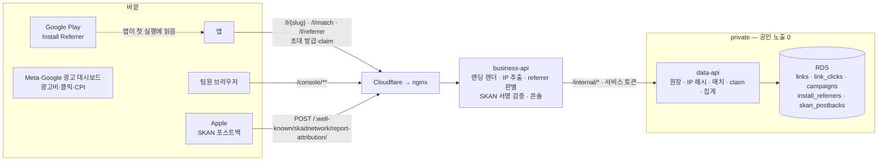
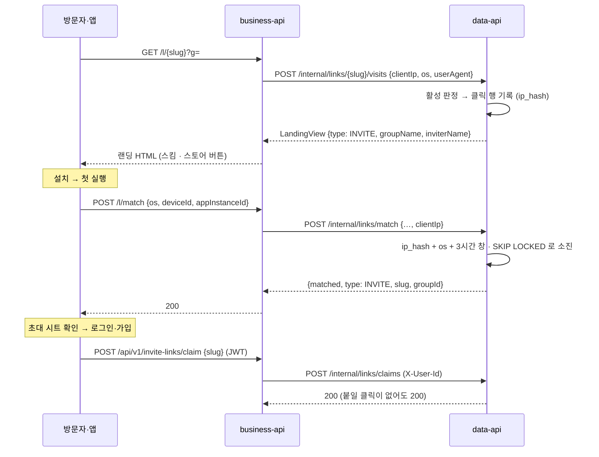
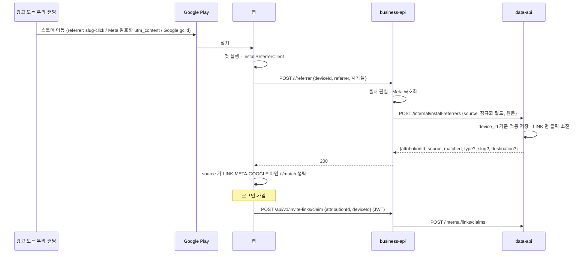
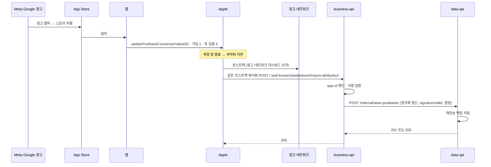

# 링크·어트리뷰션 아키텍처

링크의 공개 입구는 business-api 하나이고, 장부는 data-api 가 쥔다. business-api 는 외부 형식(HTML · Play referrer 문자열 · Apple 포스트백 JSON)을 읽고 검증하는 창구이고, data-api 는 그 결과를 링크·그룹·유저와 **같은 DB 트랜잭션**에 적는 곳이다. 광고 플랫폼 대시보드는 서버와 연결하지 않는다.

## 1. 구성

| 컴포넌트 | 한다 | 안 한다 |
| --- | --- | --- |
| nginx | `/l/`·`/link/`·`/.well-known/`·`/console/` 와 초대 발급·claim 을 business-api 로 보낸다. realip 로 클라이언트 IP 를 복원해 `X-Real-IP` 로 넘긴다(현행) | data-api 로 가는 링크 경로 |
| business-api | 공개 HTTP 계약(HTML · JSON · AASA · assetlinks), 신뢰 헤더에서 클라이언트 IP 추출, referrer 문자열 판별·Meta 복호화, SKAN 서명 검증, 콘솔 세션·화면, 공개 경로 레이트리밋 | DB 접근, IP 해시, 매치·claim·귀속 판정 |
| data-api | 링크·클릭·캠페인·referrer·포스트백 저장, IP 해시, fingerprint 매치(`SKIP LOCKED`), claim, 초대 링크 수명([정책 L04](policy.md)), 집계 SQL, 서버 GA4 이벤트 | 외부 요청 수신, 외부 형식 파싱 |
| 앱 | 링크 파싱, 매치·referrer 전송, claim, SKAN 전환값 갱신 | 귀속 판정 |

## 2. 분리안과 무엇이 다른가

분리안(별도 저장소 · Vercel · Neon)은 링크 서버가 코어 DB 를 읽지 못해서 생긴 장치가 대부분이었다. 한 DB 로 돌아오면 아래가 전부 사라진다.

| 분리안이 요구한 것 | 이유 | 이 설계 |
| --- | --- | --- |
| 발급 때 표시정보 스냅샷 + 변경 이벤트 relay (A22 ㋡) | 링크 서버가 그룹명·닉네임을 못 읽음 | 랜딩 때 조회(현행) |
| revoke 에 `linkVersion`·`membershipEpoch` 분리 적재 (ⓑ″ · ㋑ · ㊊) | HTTP 적용 순서가 보장되지 않음 | 멤버십 전이와 같은 트랜잭션에서 폐기 |
| 링크 서버 서명 자격 `LINK_CAPABILITY_KEY` (ⓚ) | 비공개 가입 검증이 두 DB 에 걸침 | 가입 트랜잭션 안에서 링크 행 잠금·재검증 |
| claim 잠정 기록 + `link.claimConfirmed` relay (㋟ · ㋙) | claim 유효 순서를 Data 가 가짐 | claim·가입이 같은 DB |
| 클릭 이관 정지 창 · 동결 스냅샷 (ⓕ · ⓛ · ㉰) | 원장이 다른 DB 로 이동 | 이관 없음 — 테이블 rename |
| nginx → Vercel 프록시 · XFF 재작성 · `LINK_PROXY_SECRET` | 랜딩과 매치가 다른 엣지에서 IP 를 봄 | 같은 홉, 현행 `X-Real-IP` 규칙 |
| 서비스 토큰 business→link · data→link · 링크 콘솔→notification | 호출 방향 | 없음. 기존 business→data 하나에 경로만 추가 |

## 3. 흐름

### 3.1 초대 링크 — 위치만 바뀐다

그룹 가입 자체는 그룹 API 가 한다. 매치·claim·랜딩의 활성 판정과 폐기 규칙은 그룹 획득 문서를 따른다.

### 3.2 캠페인 링크 — 오가닉

3.1 과 같은 파이프를 탄다. 다른 점은 셋이다.

- 랜딩 문구에 그룹·초대자가 없고, 스킴 버튼은 캠페인의 목적지(`gromo://…`)를 연다.
- Android 스토어 버튼이 Play 스토어 URL 의 `referrer` 파라미터에 `slug`·`click` 을 심는다. 그래서 Android 는 3.3 의 referrer 경로로 결정적으로 귀속되고, fingerprint 는 iOS 와 Android 의 referrer 유실분만 받는다.
- 매치 응답에 `type: CAMPAIGN`·`destination` 이 붙고, 앱은 그 목적지로 이동한다. claim 은 기록만 한다.

### 3.3 Android — Install Referrer

### 3.4 iOS 광고 — SKAN 포스트백

## 4. 누가 무엇을 세나

| | Meta·Google 대시보드 | 우리 서버 | 유저 단위 | 콘솔 신뢰도 표기 |
| --- | --- | --- | --- | --- |
| 광고비 · 노출 · 클릭 · CPI | 준다 | 만들지 않는다 | — | — |
| 설치 — iOS 광고 | 준다 | SKAN 복사본 집계 | 불가 | 집계·지연 |
| 설치 — Android 광고 | 준다 | Install Referrer | 가능 | 결정 |
| 가입 — iOS 광고 | 전환값으로 표시 | 복사본의 전환값 집계 | 불가 | 집계·지연 |
| 가입 — Android 광고 | 못 준다 | claim | 가능 | 결정 |
| 오가닉 링크 퍼널 | 못 준다 | 클릭 · fingerprint 또는 referrer · claim | 가능 | 확률 또는 결정 |

## 5. 신뢰 경계와 실패

- **외부 형식 파싱은 business-api, 판정과 저장은 data-api.** data-api 는 business-api 의 서비스 토큰 호출만 믿는다.
- **클라이언트 IP**: nginx 가 Cloudflare 대역 피어일 때만 `CF-Connecting-IP` 를 믿어 `X-Real-IP` 로 넘긴다(현행 `ClientIpResolver` 규칙). business-api 가 같은 규칙으로 IP 를 뽑아 `clientIp` 로 넘기고, data-api 가 솔트로 해시한다. 원본 IP 는 어디에도 저장하지 않는다.
- **앱 계약 보존**: `/l/match`·`/l/referrer` 는 data-api 장애·타임아웃·형식 오류에도 200 `{matched:false}` 다. 앱의 매치 타임아웃(5초) 안에 끝나도록 내부 호출 예산을 둔다.
- **랜딩 강등**: data-api 가 응답하지 않으면 스토어 버튼만 있는 기본 랜딩을 준다. 클릭은 기록하지 않는다.
- **SKAN**: 서명 실패·다른 앱 포스트백은 200 으로 끝낸다. 저장 실패만 5xx 로 남겨 경보한다.
- **공개 경로 레이트리밋**: `/l/match`·`/l/referrer` 는 인증이 없으므로 business-api 가 IP 단위로 제한한다(기존 게스트 생성 레이트리밋과 같은 방식).

## 6. 기존 결정과의 관계

[아키텍처 결정 장부](../../architecture/decisions.md)는 "어긋나면 이 장부가 맞다"를 규칙으로 둔다. 이 설계는 **A23** 으로 등록되어 다음에 우선한다.

- A8 의 "`/l/**`·`/.well-known/**` 은 nginx/link 서버 몫"
- A11 ⑥ 서비스 토큰 중 링크 콘솔→notification · business→link · data→link
- A12 의 "링크 서버(Vercel)는 브로커에 붙지 않는다"
- A17 의 "link 는 스택이 달라 각자 저장소"
- A22 에서 링크 서버·Neon 을 전제로 한 항목
- `service-architecture.md`·`system-architecture.md` 의 링크 서버·컷오버 서술

원문은 장부의 취소선 정책대로 남긴다.

## 7. 배포 순서

같은 DB 를 두 경로가 함께 읽으므로 **데이터 이관 창이 없다.** 공개 경로 전환은 nginx 설정 한 번이고, 되돌리기도 한 번이다.

| 단계 | 내용 | 되돌리기 |
| --- | --- | --- |
| 1 | PR #745 머지(링크 코드 포함). 링크 경로는 data-api 공개 컨트롤러가 계속 서빙하고, [LLD §9.1](low-level-design.md#91-머지-뒤-켜지-않는-것) 의 설정은 켜지 않는다 | — |
| 2 | data-api: 스키마(rename · 컬럼 · 신설 3) · `invitelink` 일반화 · `/internal/*` · #745 의 data-api 링크 사장 코드와 V52 링크 테이블 제거. **기존 공개 컨트롤러는 남긴다** | 앱 계약 무변경이라 이미지 롤백 |
| 3 | business-api: 공개 표면 · referrer · SKAN 수신 · #745 의 business-api 링크 사장 코드 제거 | 이미지 롤백 |
| 4 | Infra: nginx 링크 경로를 business-api 로 전환(reload 1회), Cloudflare 에서 SKAN 경로 봇 챌린지 예외 | nginx 원복 reload — 2 단계의 공개 컨트롤러가 같은 DB 를 읽으므로 무손실 |
| 5 | data-api: 링크 공개 컨트롤러 제거(전환 뒤 7일 무사고, 구 경로 호출 0 확인) | 4 단계 원복이 불가해지므로 마지막에 한다 |
| 6 | business-api: 콘솔 | 이미지 롤백 |
| 7 | 앱: ① 파서·목적지 ② Install Referrer ③ SKAN 등록·전환값. 서버는 구 앱 계약을 유지하므로 최소 지원 버전과 무관 | 앱 배포 |
