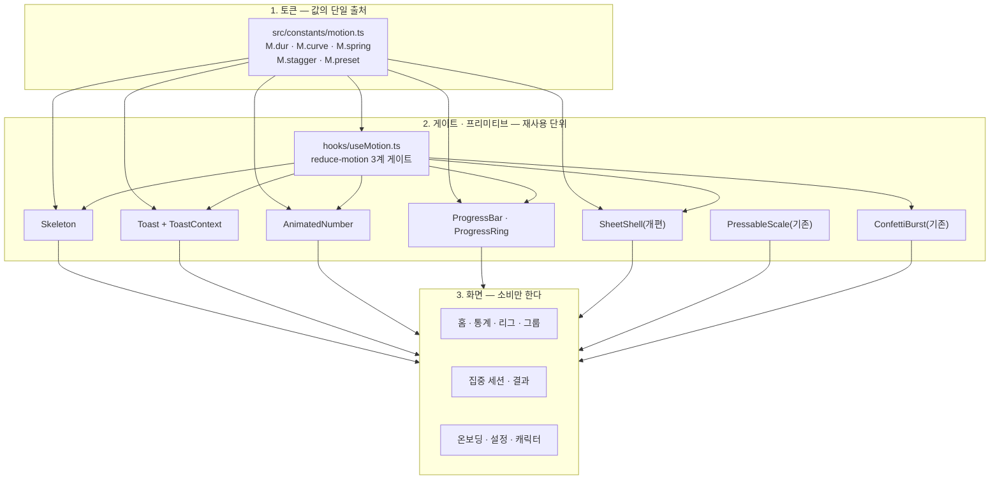
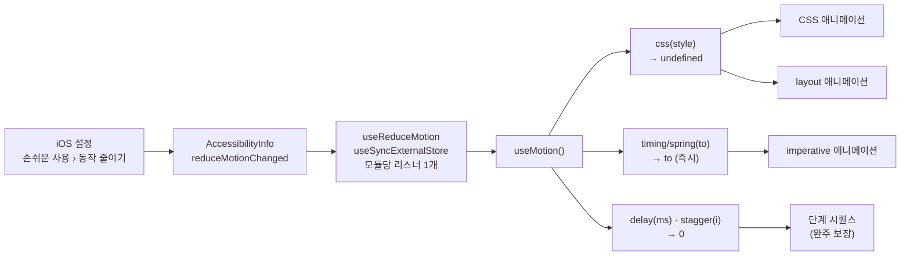
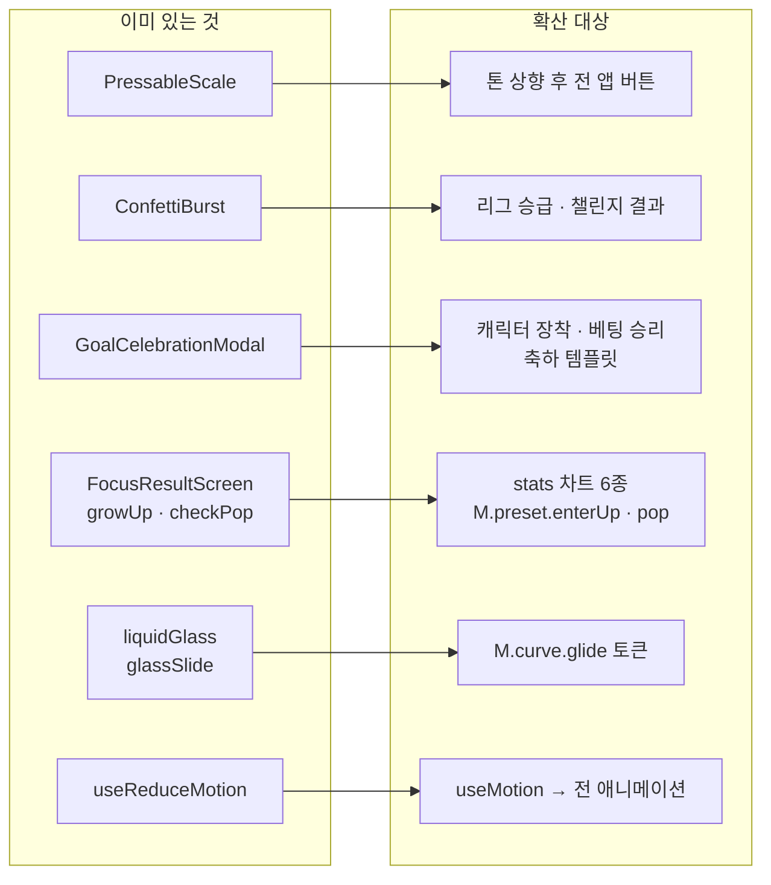
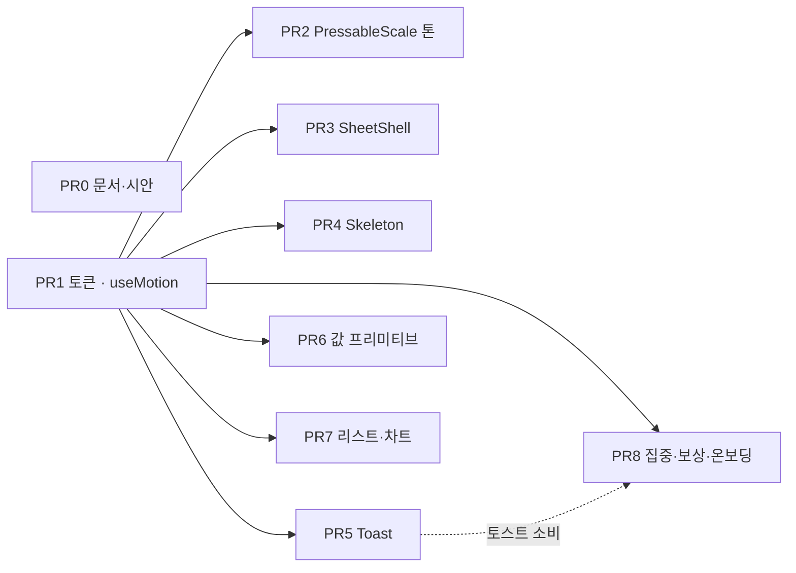

# High-Level Design — 모션

> GROMO-1382 · 작성 2026-08-09 · 현재 구현 상태 기준
> 세트: [IA](information-architecture.md) · [PRD](prd.md) · [정책](policy.md) · **HLD** · [LLD](low-level-design.md)

---

## 1. 3계층 구조

**계층 규칙**
1. **화면은 duration·커브 리터럴을 쓰지 않는다.** 전부 `M` 경유. 예외는 [정책 D15](policy.md#d15) **표에 등록된 것뿐**이다(현재 3건 — 개수를 여기 박아 두면 표가 늘 때 어긋나므로 **표가 정본**이다).
2. **프리미티브는 화면을 모른다.** `Skeleton`이 통계 카드 높이를 알면 안 되고, 호출부가 치수를 넘긴다.
3. **`useMotion`을 거치지 않는 애니메이션이 없다.** 리뷰 체크 항목.

---

## 2. 세 애니메이션 시스템과 선택 기준

Reanimated 4는 세 가지 API를 준다. **셋 다 이미 앱에서 쓰이고 있으므로** 새 API 도입이 아니라 **수렴** 문제다.

| 시스템 | 현재 사용처 | 끄는 법(reduce) |
| --- | --- | --- |
| **CSS** (`animationName` · `transitionProperty`) | `TabBar`, `FocusResultScreen`, `liquidGlass` | 스타일 객체를 `undefined`로 드롭 |
| **imperative** (`withTiming` · `withSpring`) | `PressableScale`, `ScreenTimeAnalyzingOverlay`, `FlipClock`, `ObjectCharacter`, `ConfettiBurst` | 애니메이션 대신 즉시 대입 |
| **layout** (`entering=` · `LinearTransition`) | `ProblemEmpathyStep` | prop을 `undefined`로 |

### 2.1 선택 기준 (구현 시 이 표로 판단한다)

| 상황 | 선택 |
| --- | --- |
| 진입 연출 · stagger · 무한 루프 장식 | **CSS** `animationName` |
| "값이 바뀌면 부드럽게 따라가라" (탭 알약 · 진행바) | **CSS** `transitionProperty` |
| 완료 콜백이 필요 (시트 퇴장 → `onClose`) | **imperative** + `runOnJS` |
| 도중에 끊고 방향을 바꿔야 함 (드래그) | **imperative** |
| `animatedProps` 구동 (SVG `strokeDashoffset`) | **imperative** |
| 워클릿 안에서 값을 읽어야 함 | **imperative** |
| 리스트 항목 재정렬 | **layout** `LinearTransition` |

> ⚠️ **CSS API에는 reduce-motion 내장 처리가 없다.** 반드시 `m.css()`를 통과시켜야 한다.
> ⚠️ **`cubicBezier`(CSS용)와 `Easing.bezier`(imperative용)는 서로 다른 표현이다.** 하나로 합치면 런타임에 조용히 무시된다 → 토큰이 `.css`/`.fn` 두 필드를 쌍으로 갖는 이유.

---

## 3. reduce-motion 전파 경로

**설계 포인트 3가지**

1. **`useReduceMotion`은 손대지 않는다.** 이미 reanimated `useReducedMotion()`의 비반응형 문제를 해결해뒀고(모듈 단위 단일 구독, 미확정 구간은 보수적으로 '켜짐'), 테스트가 3개 있다. `useMotion`은 그 위에 사용 편의만 얹는 얇은 층이다.
2. **`delay()`가 API에 있는 이유가 핵심이다.** 애니메이션만 끄면 delay 기반 단계 시퀀스(`LeagueResultScreen`)가 진행되지 않아 **화면이 멈춘다**. 0을 반환해 시퀀스를 완주시킨다.
3. **호출부 diff는 한 줄이다.** `style={[s.bar, m.css(enterUp(i))]}` — RN이 스타일 배열의 `undefined`를 무시하므로 조건 분기가 없다. 컴포넌트별 `if (reduce) return <View/>` 분기는 렌더 트리를 두 갈래로 갈라 테스트·리뷰 비용을 배가시킨다.

---

## 4. 기존 자산 재사용 지도

**새로 만드는 것보다 퍼뜨리는 게 많다.**

| 기존 자산 | 어떻게 쓰이나 |
| --- | --- |
| `PressableScale` | 새 프리미티브가 아니다. **톤만 올려** 앱 전역에 이미 깔린 효과를 바꾼다 |
| `ConfettiBurst` | `obstacle` prop 하나만 받으므로 **재작성 없이** 리그 승급·챌린지 결과에 붙인다 |
| `GoalCelebrationModal` | 축하 표면의 **참조 구현**. `charReady && uiIdle` + `InteractionManager` 게이팅 패턴을 다른 축하 표면이 그대로 따른다 |
| `FocusResultScreen`의 `growUp`/`checkPop` | `M.preset.growUp`/`pop`으로 **승격**. ⚠️ `growUp`은 **막대에만** 확산한다(정책 D16) — 주간 타임테이블 세션 블록. 통계의 꺾은선은 좌→우 draw-on, 도넛은 링 `fadeIn`, 캘린더는 행 `fadeIn`이라 표면마다 다르다 |
| `liquidGlass`의 `glassSlide` | `M.curve.glide` + `M.dur.base`로 흡수. `SLIDE_MS` export 이름은 유지해 호출부 무변경 |
| `ScreenTimeAnalyzingOverlay` | 로딩 연출의 **품질 기준선**. 다만 타이밍은 가드 타임이라 토큰화하지 않는다 |

---

## 5. PR 의존 그래프 · 롤백

**PR1만이 공통 선행이다.** 나머지는 서로 독립이라 순서를 바꿔도 되고, 하나가 문제를 일으켜도 되돌리면 그 PR의 효과만 사라진다.

| PR | 롤백 시 잃는 것 | 남는 것 |
| --- | --- | --- |
| PR2 | 버튼 톤(값 3개) | 나머지 전부 |
| PR3 | 시트 전환 | 시트 기능 정상(무전환으로 복귀) |
| PR4 | 스켈레톤 | 스피너로 복귀 |
| PR5 | 토스트 | 알럿으로 복귀 — **단, Maestro 플로우도 함께 되돌려야 함** |
| PR6~PR8 | 해당 화면 연출 | 기능 무영향(렌더 계층만 건드림) |

**동시 머지 금지 조합** — PR3(시트) × PR5(토스트). 둘 다 Maestro 플로우를 건드릴 수 있어 실패 원인 분리가 어려워진다.

---

## 6. 성능 · 위험 요약

| 항목 | 판단 | 근거 |
| --- | --- | --- |
| PanResponder(JS 스레드) 잔존 | **유지** | 대체하려면 gesture-handler → 네이티브 모듈 → OTA 불가 ([정책 D5](policy.md#d5)) |
| `LayoutAnimation` | **신규 금지 · 기존 치환** | 전역 스코프라 형제 뷰 영향 + Reanimated 레이아웃과 충돌 ([정책 D12](policy.md#d12)) |
| 레거시 `Animated` 마이그레이션 | **`SheetShell`만** | 나머지는 이미 네이티브 드라이버라 체감 이득 0 ([정책 D4](policy.md#d4)) |
| CSS `animationName` 참조 동등성 | **모듈 스코프/`useMemo` 강제** | 인라인 호출 시 매 렌더 재시작 ([정책 D13](policy.md#d13)) |
| 무한 루프 | **화면당 1개** | 스켈레톤 8~12개 동시 + 컨페티가 겹치면 프레임 예산 초과 |
| `AnimatedNumber` JS 리렌더 | **리프 전용** | 리스트 행 안에서 쓰면 행 전체가 18프레임 리렌더 |
| 레이아웃 패스 | **폭/높이 대신 transform** | 단, 진행바는 둥근 캡 때문에 예외 ([정책 D10](policy.md#d10)) |
| Android CSS 애니메이션 | **PR6에서 집중 검증** | 트랜지션보다 신기능이라 앱에서 처음 쓰는 셈 |
| Maestro testID 계약 | **래퍼 뷰 금지** | 프리셋을 순수 함수로 만든 이유 ([정책 D13](policy.md#d13)) |

---

## 7. 이 설계가 틀렸다면 어디서 드러나는가

정직하게 적어둔다 — 아래 세 가지는 구현 중 뒤집힐 수 있다.

| 가정 | 틀렸을 때 증상 | 대응 |
| --- | --- | --- |
| CSS 스타일을 드롭하면 최종 상태가 된다 | reduce ON에서 요소가 초기 상태(투명·scale 0)로 굳는다 | `animationFillMode:'backwards'` 전제가 깨진 것 → 프리셋에 최종 상태를 베이스 스타일로 명시 |
| 시트 등장을 `onLayout`에 걸면 iOS present 지연이 흡수된다 | 저사양 기기에서 시트가 한 번 깜빡인 뒤 올라온다 | 초기 `translateY`를 화면 높이로 두고 `opacity:0`을 첫 프레임에만 추가 |
| `AnimatedNumber` 18프레임 리렌더가 충분히 싸다 | 홈 진입 시 프레임 드랍 | 프레임 수를 12로 줄이거나 해당 지점만 정적 표시 |
