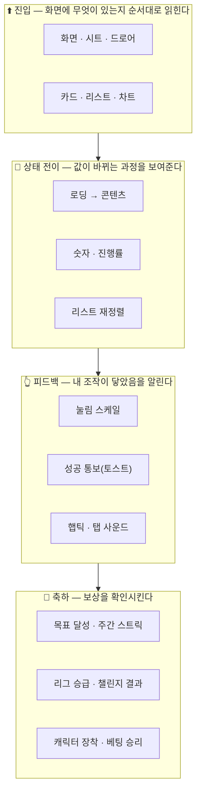

# 모션 — IA (Information Architecture)

> GROMO-1382 · 작성 2026-08-09 · 현재 구현 상태 기준
> 세트: **IA** · [PRD](prd.md) · [정책](policy.md) · [HLD](high-level-design.md) · [LLD](low-level-design.md)

**신뢰 등급** — 🟩 구현됨(현행) · 🟦 이번 작업으로 추가 · 🟨 의도적 예외(토큰 밖) · 🟥 부채(현재 결함)

---

## 1. 모션은 기능이 아니라 **표면 위에 얹히는 층**이다

기능 IA와 달리 모션 IA는 화면 구조가 아니라 **"사용자가 무엇을 기다리고 무엇을 확인하는가"** 로 나뉜다. 같은 화면에도 네 층이 겹친다.

**밀도 원칙** — 아래 층일수록 자주 보이므로 절제하고, 위 층일수록 드물게 오므로 과감해진다. 축하가 화려한 건 **드물게 오기 때문**이지 중요해서가 아니다.

---

## 2. 강도 등급표

| 등급 | 이름 | 무엇 | 허용 duration | 허용 커브 | 오버슛 |
| --- | --- | --- | --- | --- | --- |
| **0** | 무모션 | 정보 전달만 하는 표면. 값이 바뀌어도 즉시 교체 | — | — | — |
| **1** | 전환 | 시트 · 드로어 · 토스트 · 스켈레톤 · 진행바 · 탭 전환 | `press` `quick` `base` | `standard` `out` | **금지** |
| **2** | 진입 | 카드 · 리스트 · 차트 · 화면 첫 렌더 | `base` `slow` `entrance` | `standard` `glide` | 얕게 허용 |
| **3** | 축하 | 목표 달성 · 승급 · 장착 · 챌린지 결과 | `slow` `entrance` `celebrate` | `overshoot` + `spring.bouncy` | 적극 |

**등급을 가르는 질문** — *"이 움직임이 끝나기를 사용자가 기다려야 하는가?"* 기다려야 하면 등급을 낮추고 duration을 줄인다. 축하만이 "기다릴 만한" 유일한 층이다.

**공통 상한**
- 무한 루프 애니메이션은 **화면당 1개 이하** (스켈레톤 펄스 / `ObjectCharacter` 숨쉬기가 여기 해당)
- stagger 총합은 **6단계**까지 (`M.staggerMaxSteps`)
- 버튼 오버슛은 **1회 · 이동량의 16% 이내** — 배율이 아니라 **비율**로 건다. 최대 배율은 `scaleTo`에 비례해서, 기본 0.96이면 1.006이지만 작은 아이콘 버튼(`scaleTo 0.90`)은 **1.016**까지 튄다. `scaleTo`를 0.90보다 깊게 주지 않는 것이 실질 상한이다
- 컨페티와 리스트 stagger를 **동시에 띄우지 않는다**

---

## 3. 표면 지도 — 등급 × 현재 상태

### 3.1 진입 (등급 2)

| 표면 | 현재 | 이후 | PR |
| --- | --- | --- | --- |
| 홈 카드 | 🟥 즉시 표시 | 🟦 `enterUp` stagger 60ms | PR7 |
| 통계 카드 8종 | 🟥 스피너 → 즉시 교체 | 🟦 스켈레톤 → `enterUp` | PR4·PR7 |
| 꺾은선 차트(요일별·주차별) | 🟥 정적 | 🟦 draw-on 좌→우 (D16) | PR7 |
| 도넛 · 캘린더 | 🟥 정적 | 🟦 링·행 `fadeIn` + 범례 `enterUp` | PR7 |
| 주간 타임테이블 세션 블록 | 🟥 정적 | 🟦 `growUp` | PR7 |
| 집중 결과 주간 막대 | 🟩 stagger 80ms | 🟦 60ms로 조정 | PR1 |
| 리그 순위 리스트 | 🟥 즉시 표시 | 🟦 `enterUp` | PR7 |
| 그룹 목록 | 🟥 스피너 → 즉시 교체 | 🟦 스켈레톤 → `enterUp` | PR4·PR7 |
| 온보딩 공감 카드 | 🟩 `SlideInUp` 스프링 | 🟩 유지 | — |
| 온보딩 스텝 전환 | 🟥 하드컷 | 🟦 크로스페이드 | PR8 |
| 로그인 버튼군 | 🟥 즉시 표시 | 🟦 `enterUp` | PR6 |

### 3.2 상태 전이 (등급 1)

| 표면 | 현재 | 이후 | PR |
| --- | --- | --- | --- |
| 바텀시트 등장 (~14곳) | 🟥 무전환 (`animationType="none"`) | 🟦 `spring.snappy` 슬라이드업 + 딤 페이드 | PR3 |
| 시트 드래그 dismiss | 🟩 PanResponder + 스프링 | 🟦 등장과 **같은 스프링**으로 대칭화 | PR3 |
| 집중 드로어 | 🟩 220ms 슬라이드 + 딤 | 🟩 유지(토큰만 이관) | PR1 |
| 로딩 → 콘텐츠 | 🟥 `ActivityIndicator` 38파일 | 🟦 스켈레톤 펄스 | PR4 |
| 화면 사용시간 분석 | 🟩 캐릭터 + 진행바 | 🟨 가드 타임이라 토큰 예외 | — |
| 홈 진행바 | 🟥 `width` 직접 대입 | 🟦 `ProgressBar` 600ms | PR6 |
| 코인 · 스트릭 수치 | 🟥 즉시 교체 | 🟦 `AnimatedNumber` 카운트업 | PR6 |
| 온보딩 진행 세그먼트 | 🟥 즉시 색 변경 | 🟦 `ProgressBar` | PR6 |
| 집중 카운트다운 · 뽀모도로 | 🟥 진행 어포던스 없음 | 🟦 `ProgressRing` | PR8 |
| 뽀모도로 페이즈 전환 | 🟥 무표시 | 🟦 크로스페이드 + `hapticMedium` | PR8 |
| 리그 순위 재정렬 | 🟥 통째 교체 | 🟦 `LinearTransition` | PR7 |
| 리그 리스트 펼침 | 🟥 `LayoutAnimation`(충돌 위험) | 🟦 `LinearTransition`으로 치환 | PR7 |
| 탭바 하이라이트 | 🟩 알약 슬라이드 350ms | 🟩 유지(토큰 이관) | PR1 |

### 3.3 피드백 (등급 1)

| 표면 | 현재 | 이후 | PR |
| --- | --- | --- | --- |
| 버튼 눌림 | 🟩 스케일 + 스프링 + 햅틱 + 사운드 | 🟦 복귀 스프링 톤 상향 | PR2 |
| 성공 통보 | 🟥 `Alert.alert` 149곳 | 🟦 토스트 ~20곳 이관 | PR5 |
| 확인 필요 · 실패 | 🟩 `Alert.alert` | 🟩 **유지** ([정책 D8](policy.md#d8)) | — |
| 캐릭터 장착 성공 | 🟥 시스템 알럿 | 🟦 토스트 + `pop` 리빌 | PR5·PR8 |

### 3.4 축하 (등급 3)

| 표면 | 현재 | 이후 | PR |
| --- | --- | --- | --- |
| 목표 달성 | 🟩 모달 + 컨페티 + 게이팅 — **최고 수준, 템플릿** | 🟦 reduce-motion 존중만 추가 | PR2 |
| 화면시간 목표 달성 | 🟩 같은 형태 | 🟦 동일 | PR2 |
| 주간 스트릭 완성 | 🟩 모달 + 컨페티 | 🟦 동일 | PR2 |
| 일일 스트릭 ✓ · 코인 획득 | 🟩 `checkPop` | 🟩 유지(토큰 이관) | PR1 |
| 리그 승급 | 🟥 단계 시퀀스는 있으나 **컨페티 없음** · 반짝임이 정적 | 🟦 컨페티 + `hapticSuccess` | PR8 |
| 챌린지 결과 | 🟩 팝인 모달 | 🟦 멤버 결과 리스트 stagger | PR8 |
| 베팅 승리 | 🟥 평문 시트 | 🟦 `pop` + 토스트 | PR8 |
| 세션 완료 | 🟥 헤더 문구만 | 🟦 합계 카운트업 | PR6 |

---

## 4. 사용자 여정별 모션 밀도

**원칙** — 매일 반복하는 여정일수록 모션을 줄인다. 반복 노출되는 연출은 3일이면 지연으로만 느껴진다.

| 여정 | 빈도 | 밀도 | 규칙 |
| --- | --- | --- | --- |
| 온보딩 | 평생 1회 | **높음** | 서사 연출 허용. 이미 잘 돼 있음 |
| 집중 세션 진입·종료 | 하루 1~5회 | 낮음 | 진행 어포던스는 **정보**지 연출이 아니다. 시작을 지연시키지 않는다 |
| 홈 복귀 | 하루 10회+ | **최저** | 카드 stagger는 **첫 마운트만**. 탭 복귀 시 재생 금지 |
| 리그·통계 | 하루 1~2회 | 중간 | 차트 진입 연출 허용 |
| 주간 정산·승급 | 주 1회 | 높음 | 단계 시퀀스 + 컨페티 |
| 목표 달성 | 비정기 | **최고** | 컨페티 + 성공 햅틱 |

> ⚠️ **홈의 stagger는 첫 마운트에서만 재생한다.** 탭을 오갈 때마다 카드가 다시 올라오면 앱이 느려 보인다. 이건 구현 시 가장 놓치기 쉬운 지점이다.

---

## 5. reduce-motion 시 각 등급이 어떻게 되는가

| 등급 | '동작 줄이기' ON |
| --- | --- |
| 0 무모션 | 변화 없음 |
| 1 전환 | **즉시 최종 상태.** 시트는 그 자리에 나타나고 딤도 즉시. 스켈레톤은 정적 회색 |
| 2 진입 | **즉시 표시.** stagger 0 |
| 3 축하 | **모달 · 햅틱 · 문구 · 수치는 유지. 컨페티만 생략** ([정책 D7](policy.md#d7)) |

**단계 시퀀스는 반드시 완주해야 한다.** `LeagueResultScreen`처럼 delay로 진행되는 화면은 delay를 0으로 만들어 **끝까지 도달**시킨다. 애니메이션만 끄면 화면이 중간에서 멈춘다.

---

## 6. 부채 목록 (🟥 요약)

| 부채 | 위치 | 해소 |
| --- | --- | --- |
| 애니메이션 9곳이 '동작 줄이기'를 무시 | 전역 | PR2 |
| 시트 ~14곳 무전환 | `SheetShell.tsx:160` | PR3 |
| 스켈레톤 0개 · 스피너 38파일 | 전역 | PR4 |
| 성공 통보가 시스템 알럿 | `Alert.alert` 149곳 | PR5 |
| 진행바 `width` 직접 대입 | `HomeScreen.tsx:132` | PR6 |
| 집중 세션 진행 어포던스 없음 | `FocusSessionScreen.tsx` | PR8 |
| 리그 승급에 컨페티 없음 · 반짝임 정적 | `LeagueResultScreen.tsx` | PR8 |
| `LayoutAnimation` ↔ Reanimated 레이아웃 충돌 위험 | `LeagueScreen.tsx:219,227` | PR7 |
| 오버슛 커브 두 파일 복붙 | `TabBar` · `FocusResultScreen` | PR1 |
