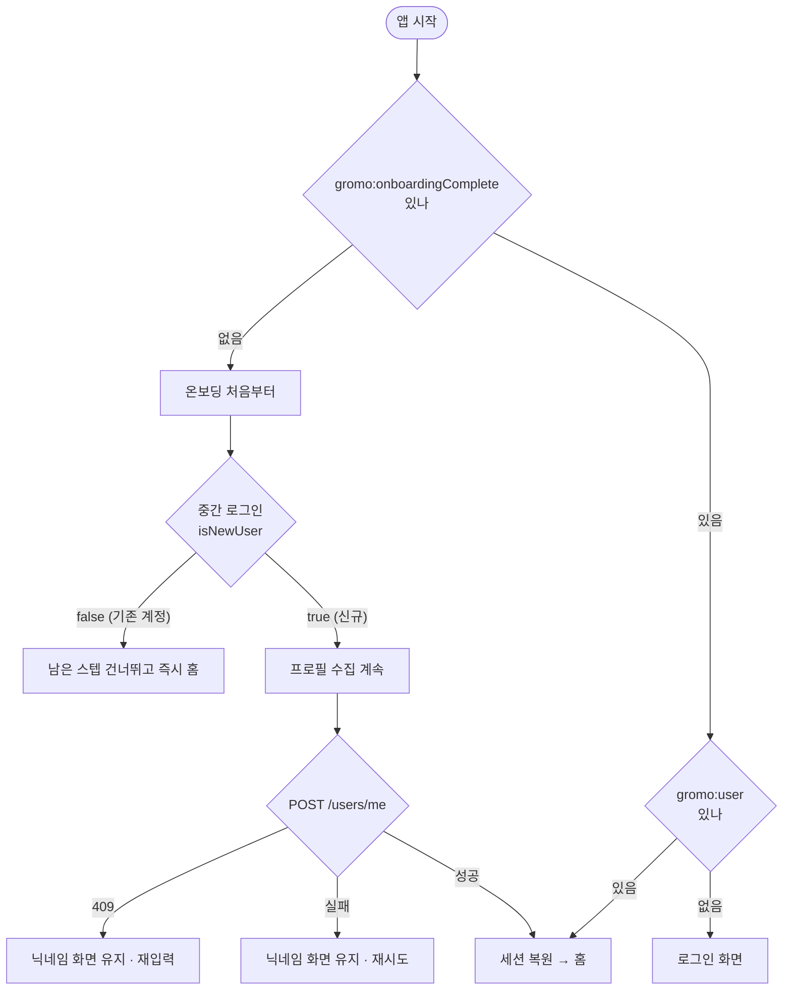

# 온보딩 — PRD

> 작성 2026-08-09 · 현재 구현 상태 기준
> 세트: [IA](information-architecture.md) · **PRD** · [HLD](high-level-design.md) · [LLD](low-level-design.md)

---

## 1. 배경 — 온보딩이 푸는 문제

gromo는 설치 직후 **아무 데이터도 없는 앱**이다. 집중 기록도, 사용시간도, 비교 대상도 없다.
그 상태에서 홈으로 떨어뜨리면 사용자는 "그래서 뭘 하라는 거지"에 걸린다.
동시에 앱의 핵심 기능 세 가지가 **선행 조건**을 요구한다.

| 선행 조건 | 없으면 | 온보딩이 해결하는 방식 |
|---|---|---|
| 계정(JWT) | 리그·그룹·통계 전부 불가 | 플로우 중간에 소셜/게스트 로그인 |
| 스크린타임 권한 + 측정 대상 | 사용시간 표시·목표 판정 불가 | 리허설 오버레이 → 권한 → picker → 버킷 모니터 등록 |
| 목표 직군(occupation) | 리그 매칭·비교 모수 없음 | 직군 선택 → 서버 `occupation` 동기화 |

여기에 제품 설득이 얹힌다 — 왜 이 앱이 필요한지(문제 공감), 왜 같이 해야 하는지(함께 효과), 무엇을 얻는지(과목 비교).

---

## 2. 목표 / 비목표

### 목표

1. **가입 완주** — 설치 사용자를 "서버에 프로필이 등록되고 홈에 진입한 사용자"로 만든다.
2. **측정 개시** — 온보딩을 지난 iOS 사용자의 스크린타임 측정이 실제로 돌기 시작한다(권한 + 측정 대상 + 15분 버킷 모니터).
3. **목표 명시** — 집중·스크린타임 목표를 **사용자가 직접 정하게** 한다(GROMO-1080에서 프리필 제거).
4. **첫 애착** — 캐릭터를 만나고(character_intro) 내 물건으로 한 번 만들어(cutout) 본 뒤 이름을 짓는다.
5. **퍼널 관측** — 어느 스텝에서 이탈하는지 GA4로 스텝 단위 추적.

### 비목표 (이번 범위 아님)

- 온보딩 **중단 후 재개**(resume) — 수집 데이터는 인메모리라 앱이 죽으면 처음부터다.
- 푸시 권한 요청 — 온보딩에서 하지 않는다. 완료 후 `PushGate`가 유일 지점.
- 어제 사용시간 **자가 추측**(`UsageGuessStep`) · 실시간 랭킹 · 핸드폰 관리 설득 — 파일은 있으나 시퀀스에서 빠져 있다.
- 기존 계정의 프로필 갱신 — 재로그인 유저에겐 온보딩 수집값을 **일부러 버린다**.

---

## 3. 유저 스토리

- **신규 사용자**: 앱을 켜면 내가 겪는 문제부터 보여주고, 로그인 뒤에는 내 시험·내 과목·내 목표를 순서대로 정하게 해줘서 홈에 도착했을 때 이미 "내 앱"이 되어 있다.
- **권한이 부담스러운 사용자**: 스크린타임 권한을 거부해도 막히지 않는다. 무엇을 못 쓰게 되는지 알려주고, 마음이 바뀌면 그 화면에서 바로 다시 허용할 수 있다.
- **돌아온 사용자**(로그아웃 후 재로그인): 중간 로그인에서 기존 계정으로 판정되면 남은 스텝을 건너뛰고 곧장 홈으로 간다 — 프로필을 다시 입력시키지 않는다.
- **닉네임이 겹친 사용자**: 입력 중 실시간으로 중복을 알려주고, 최종 확정에서 겹치면 그 화면에 그대로 남아 다시 고칠 수 있다.
- **분석 담당**: 어느 스텝에서 몇 %가 빠지는지 `onboarding_step_viewed`로 스텝 단위로 본다.

---

## 4. 요구사항

### 4.1 스텝별 완료 조건 · 이탈 허용

| 스텝 | '다음'이 열리는 조건 | 건너뛰기 | 뒤로 |
|---|---|---|---|
| `problem_empathy` | 항상 | — | ✕ (첫 스텝) |
| `together_effect` | 항상 | — | ○ |
| `subject_compare` | 항상 | — | ○ |
| `login` | 로그인 성공 | ✕ **필수** | ○ (로그인 전까지) |
| `focus_category` | 직군 1개 선택 + 목록 로드 완료 | ✕ | ✕ (로그인 하한) |
| `subject_edit` | 항상 (읽기 전용) | 추천 과목 없으면 스텝 자체가 없음 | ○ |
| `screentime_permission` | CTA 또는 '나중에 할게요' | ○ ('나중에' = 거부와 동일 취급) | ○ |
| `screentime_denied` | '이대로 계속하기' | ○ | ○ |
| `yesterday_screentime` | 분석 연출(3.2초) 종료 후 CTA 노출 | ✕ (연출 대기 필요) | ○ |
| `goal_setting` | **집중·스크린타임 목표 둘 다** 조작 | ✕ | ○ |
| `character_intro` | 항상 | — | ○ |
| `cutout_experience` | 캐릭터 생성 완료 **또는** 예외 조건 3종 | 조건부 (§4.2) | ○ |
| `nickname` | 2~10자 + 서버 확정 성공 | ✕ | ○ |

- **뒤로가기**는 버튼이 아니라 화면 왼쪽 가장자리(24px) 스와이프다. 로그인 성공 이후엔 로그인 이전 화면으로 돌아갈 수 없다(하한 고정).
- **앱 이탈**(강제종료·백그라운드 킬)은 언제든 허용되지만 수집값은 남지 않는다.

### 4.2 예외로 열어주는 규칙 (갇힘 방지)

| 스텝 | 예외 | 이유 |
|---|---|---|
| `cutout_experience` | 네이티브 모듈 없음 / E2E 빌드 | 만들기 자체가 불가한 기기 |
| `cutout_experience` | 서버 모더레이션 '검사 불가' | 백엔드 미배포·장애 |
| `cutout_experience` | 생성기를 열었다가 X로 닫음 | 누끼 실패 시 영구 차단 방지 |
| `focus_category` | 서버 목록 실패 → '다시 시도' 버튼 | 폴백은 정적 추천 과목 |
| `screentime_permission` | 권한 요청 실패 → Alert 노출 후 화면 유지 | 엔타이틀먼트 문제 진단 |

능동 '건너뛰기' 버튼은 두지 않는다 — 예외는 **막힌 사용자만** 통과시킨다.

### 4.3 재진입 정책

- **반쪽 세션 방어**: `user`는 있는데 완료 플래그가 없으면 세션을 복원하지 않고 온보딩을 다시 밟게 한다(GROMO-617). 프로필 미등록 상태로 홈에 들어가는 것을 막는다.
- **로그아웃**은 완료 플래그를 함께 지운다 → 다음 실행은 온보딩 첫 화면.

### 4.4 목표 설정 (GROMO-1080)

- 프리필 없음 — 두 목표 모두 `null`(화면 표시 '0시간')에서 시작한다.
- 둘 다 조작하기 전에는 '다음' 잠금 + 잠긴 이유를 한 줄로 안내한다.
- '0시간'은 표시일 뿐 선택 가능한 값이 아니다 — 피커가 하한 30분으로 클램프한다(0시간 목표는 매일 자동 달성이 되므로 금지).
- E2E 빌드(`EXPO_PUBLIC_E2E=1`)에서만 예전 기본값이 프리필된다 — 드럼 휠은 Maestro가 굴릴 수 없어서다. 운영 빌드엔 없다.

### 4.5 비기능 요구사항

- **문구**: 전 화면 해요체, '주인' 호칭 금지, 이모지 금지(캐릭터 보이스 규칙).
- **PII 금지**: 닉네임 문자열은 계측 이벤트에 싣지 않는다. 로그인 실패 사유도 에러 **코드**만 버킷한다.
- **레이아웃 안정**: 하단 CTA는 전 스텝 같은 위치. 보조 액션이 없어도 높이를 예약한다.
- **접근성/일관**: 앱 전역 글꼴 스케일 고정(기기 텍스트 크기 무시).

---

## 5. 성공 지표

퍼널은 `onboarding_step_viewed`의 **`step` 파라미터**로 정의한다(순번이 아니라 이름 기준).

| 지표 | 이벤트 | 비고 |
|---|---|---|
| 온보딩 시작 | `onboarding_started` (+ `tutorial_begin`) | 플로우 마운트 1회 |
| 스텝 도달률 | `onboarding_step_viewed{step}` | 같은 플로우에서 스텝 이름당 1회 (뒤로가기 재방문 미발행) |
| 가입 수단 선택/실패 | `onboarding_signup_selected` / `_failed{reason}` | 온보딩 로그인에서만 발행 — 재로그인 화면은 미발행 |
| 직군 선택 | `onboarding_focus_category_submitted` | |
| 권한 요청·결과 | `onboarding_permission_requested` / `_resulted{granted}` | 권한 **획득률**의 정본 |
| 스크린타임 설정 결과 도달 | `onboarding_screentime_viewed{has_data}` | 승인 후 목표 설정은 `true`, 거부 안내는 `false` |
| 목표 제출 | `onboarding_goal_submitted{goal_type,goal_minutes}` | 한 화면에서 focus·usage 2회 |
| 닉네임 제출 | `onboarding_nickname_submitted` | |
| **완주** | `onboarding_completed` (+ `tutorial_complete`) | **신규 유저만** — 기존 계정 재로그인은 미발행 |

**과거 사고 (2026-07-30 수정)**: GA4 닫힌 퍼널이 100% 이탈로 보인 원인은 더 이상 발행되지 않는 `shock` 이벤트를 퍼널 단계로 잡아둔 것이었다. 퍼널 정의는 반드시 `analyticsEvents.ts`에 실재하는 이벤트만 쓴다.
`step_viewed`의 속성(파라미터) 등록은 **프로덕션 미배포** 상태라 GA4 콘솔에서 `step`으로 세분화하려면 커스텀 정의 등록이 선행되어야 한다.

---

## 6. 앞으로 변할 방향

- **보류 스텝 5종의 처분**: `UsageGuessStep`·`LiveRankingStep`·`PhoneManageStep`·`NotificationPermissionStep`·`GromoStartStep`은 시퀀스에 없다. 되살리든 지우든 결정이 필요하다 — 특히 자가 추측(W9)은 `yesterday_screentime`의 "추측과 얼마나 달랐나요?" 문구가 전제하는 스텝이라 **지금은 존재하지 않는 비교를 문구가 가리키고 있다**.
- **온보딩 재개**: 이탈률이 특정 스텝에 몰리면 수집 데이터의 부분 영속화(스텝 인덱스 + data)를 검토.
- **푸시 권한 편입**: 완료 직후 `PushGate`가 시스템 알럿을 띄우는 현재 방식은 홈 진입 첫인상과 겹친다. 온보딩 안으로 옮길지 결정 대상.

---

## 7. 트레이드오프 및 한계

| 선택 | 얻는 것 | 잃는 것 / 한계 |
|---|---|---|
| 로그인을 플로우 중간에 배치 | 이후 스텝이 서버 데이터를 쓸 수 있고, 가입 이탈 지점이 설득 뒤로 밀린다 | 로그인 전 이탈자는 계정이 없어 리타게팅 불가 |
| 수집값 인메모리 보관 | 중도 이탈이 기기에 흔적을 남기지 않음 | 앱이 죽으면 처음부터 — 스텝 11개를 다시 밟아야 한다 |
| 권한만 즉시 반영 | 미완주 이탈자도 측정이 시작돼 다음 방문에 데이터가 있다 | 온보딩을 끝내지 않은 사용자에게 권한·모니터가 남는다 |
| '나중에 할게요' = 거부 | 분기 하나로 단순화 | 서버에도 `granted:false`로 같이 기록돼 "미요청"과 "명시 거부"를 구분 못 함 |
| 기존 계정 수집값 폐기 | 서버 프로필 덮어쓰기 사고 차단 | 재로그인 유저가 다시 고른 값이 조용히 사라짐 (안내 없음) |
| 누끼 체험 스킵 버튼 없음 | 체험 완주율 확보 | 예외 조건에 안 걸리면서 만들기에 실패하는 조합이 생기면 갇힌다 |
| 완주 계측을 신규 유저로 한정 | 완주율 지표가 실제 가입만 센다 | `started` 대비 `completed` 비율에 기존 계정 재로그인이 분모로만 들어가 완주율이 실제보다 낮게 보인다 |
