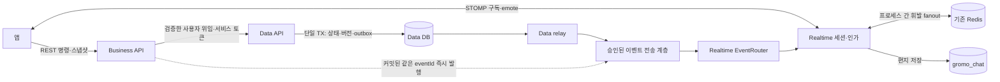
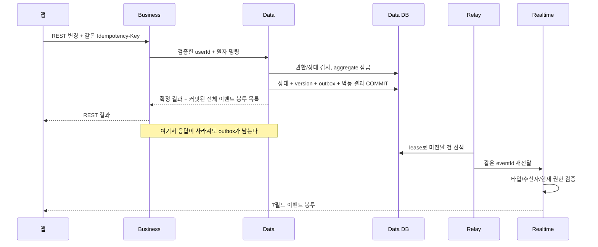
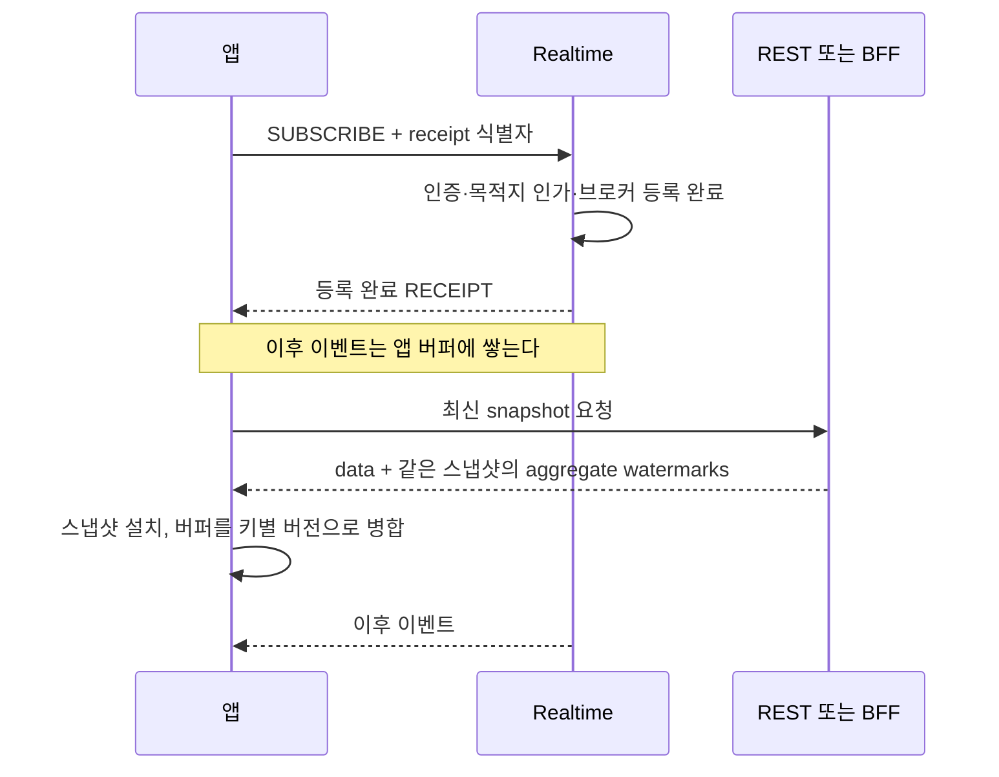
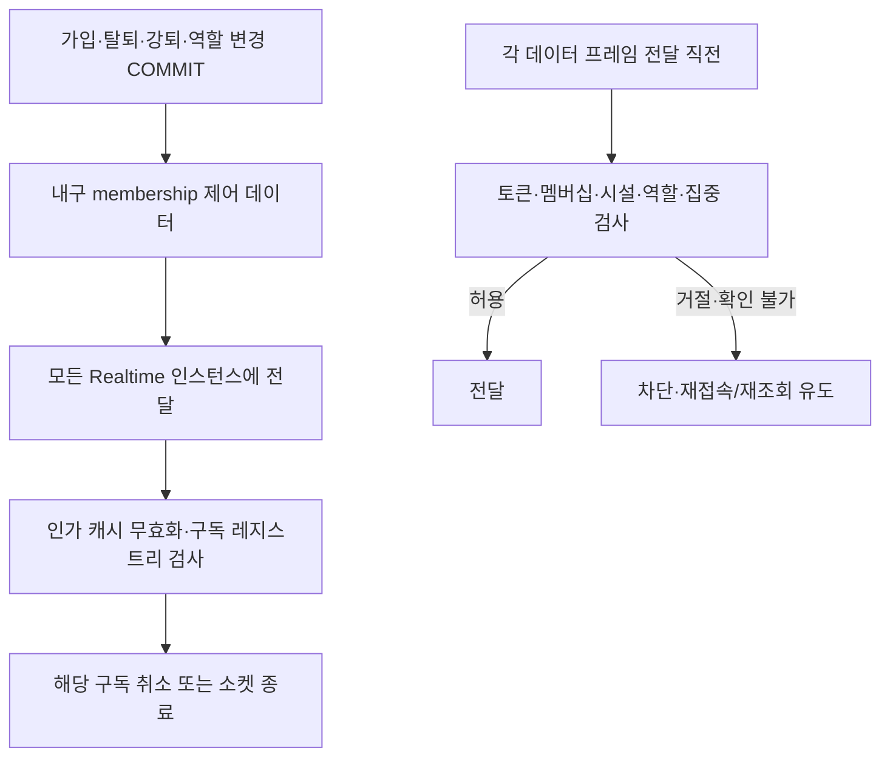

# 섬 실시간 이벤트 — 구성 설계

> GROMO-1754 · 설계 목표 상태. [PRD](./prd.md) · [상세 계약](./low-level-design.md)

## 1. 구성과 책임

화살표는 목표 역할이다. 모든 경로가 현재 구현됐다는 뜻은 아니다. Data 내부 계약과 전송 계층의 실제 adapter는 참고 티켓 1659/1753/1755에 맞춰 연결한다. 이 문서가 새로운 공개 이벤트 POST 또는 별도 MQ 인프라를 만들지 않는다.

| 구성요소 | 소유하는 일 | 소유하지 않는 일 |
|---|---|---|
| Business | 외부 인증·REST 봉투·Data 원자명령 호출·화면 조합, 커밋된 이벤트의 즉시 전달 가능 | Data DB 접속, 차감과 소유권을 여러 HTTP 쓰기로 분리 |
| Data | 섬/집중/경제 상태, TX와 버전, 요청 멱등 결과, outbox·relay | 소켓 연결/기기 음량 |
| Realtime | 소켓 인증, 목적지 allowlist, 구독 등록, 수신자 인가, router, emote, 기존 편지 저장/전파 | 개인/공동 경제 상태 결정, Data presence 쓰기 |
| 앱 | 초기 상태+이벤트 병합, 버전/dedup, 끊김 후 재조회, 로컬 표현 | 권한 판정의 최종 책임, 보상/가격 결정 |

## 2. 영속 상태의 데이터 흐름

[결정 장부](../../architecture/decisions.md)의 A4만 읽고 Business 메모리에 이벤트를 만들지 않는다. A21에 따라 Data 상태를 바꾸는 요청형 사건은 해당 TX에 내구화한다. aggregate version은 갱신 행/명시한 투영 aggregate의 잠금 아래 상태와 함께 증가한다. DB sequence 할당 순서를 커밋 순서라고 가정하지 않는다.

Data 내부 명령 응답은 확정 결과와 `events: RealtimeEventEnvelope[]`를 반환한다. 각 항목은 outbox에 커밋된 `schemaVersion`, `eventId`, `type`, `islandId`, `aggregateVersion`, `occurredAt`, `payload` 전체이며, 한 명령이 여러 사건을 만들면 전부 포함한다. Business는 이 봉투를 그대로 즉시 발행하고 별도 DB 조회나 현재 시각으로 재구성하지 않는다. 재시도에도 저장된 같은 봉투 목록을 재생한다. 이는 내부 응답이며 앱의 REST `{data}`에 내부 이벤트 목록을 자동 노출하는 규칙이 아니다.

릴레이의 선점·만료·재시도·대상별 전달 표시는 내부 명령 기반을 재사용한다. 즉시 발행과 relay가 같은 사건을 중복 전달할 수 있으므로 eventId는 재사용한다. 구독자가 없거나 Redis fanout이 끊겼어도 상태는 REST로 회복된다. 브로커 ACK는 모든 기기의 표시 완료 ACK가 아니다.

편지는 현재 `gromo_chat`의 `chat_messages`가 정본이며 기존 after-commit fanout+히스토리 재조회 경로를 유지한다. `message.created`의 신규 wire 변환은 참고 티켓 1775가 담당한다. 경제용 Data TX에 편지를 억지로 묶거나 기존 편지에 아직 없는 outbox를 이미 존재한다고 쓰지 않는다. 응원은 정본 상태가 없는 휘발 사건이라 outbox/히스토리가 없다.

## 3. 채널과 인가

새 `/ws/realtime`과 기존 `/ws/chat`은 같은 인증된 STOMP 세션 모델로 연결한다. HTTP 업그레이드만으로 인증된 것이 아니며 CONNECT의 Bearer 검증 후 주체가 정해진다. 토큰을 URL에 넣지 않는다.

채널을 하나로 합치지 않는다. 일반 섬 상태와 음악·편지·응원은 수신 권한이 다르다. 개인 재화와 가입 요청은 공개 섬 토픽이 아닌 `/user/queue/events`에 보낸다. 정확한 경로와 이벤트 매핑은 [상세 계약 §3](./low-level-design.md#3-전송-경로와-router)를 따른다.

기존 CONNECT의 `requireNotFocusing`은 Realtime 공통 인증에서 제거한다. 채팅 구독/발신의 `ChatAccessGuard`는 유지하고 새 편지 채널에도 같은 집중 제한을 적용한다. 집중/휴식 목적지에는 이 채팅 가드를 재사용하지 않는다. 기존에 집중 시작 후 연결된 채팅 수신이 남는 한계도 새 기능 활성화 전에 전달 시점 가드로 닫는다.

## 4. 스냅샷과 구독 사이의 경쟁

STOMP 프레임에 `receipt`를 붙였다는 사실만으로 등록 완료를 보장하지 않는다. 현 simple broker 설정에 그러한 보장이 구현됐다고 가정하지 않으며, 참고 티켓 1765는 서버 등록 완료 확인 경로와 실제 소켓 경쟁 테스트를 제공해야 한다. 지원하지 않으면 기능을 활성화하지 않고 등록 완료 제어 응답을 별도 구현한다. 데이터 사건을 15번째 `subscription.ready` 이벤트로 늘리지는 않는다.

스냅샷은 값과 해당 값의 버전을 같은 Data snapshot에서 읽는다. API나 BFF의 수신 시각으로 버전을 발명하지 않는다. BFF 안의 병렬 HTTP가 단일 DB snapshot이라는 보장도 없다. 강한 정합성이 필요한 집중/휴식 상태는 공통 원자 projection 또는 버전 일치 검증을 사용한다.

클라이언트 버퍼를 넘기거나 스냅샷 실패·인가 변경·연결 세대 변경이 생기면 임의 오래된 일부 사건을 적용하지 않고 재조회한다. 스냅샷에 없는 aggregate의 오래된 이벤트가 와도 없는 주민을 다시 만들지 않는다. [상세 병합 규칙](./low-level-design.md#5-스냅샷과-버전-병합)대로 재조회한다.

## 5. 소속 상실과 세션 수명

`island.members.updated`는 주민 화면의 재조회 신호다. 이탈자의 소켓 해지를 그 이벤트를 이탈자에게 방송하는 방식으로 해결하지 않는다. Data의 신뢰된 제어 데이터에는 변경 사용자/섬/버전/원인이 포함되고 Realtime이 서버 세션 레지스트리를 갱신한다. 이 제어 데이터는 공개 payload가 아니며 14종 사용자 이벤트에 추가하지 않는다.

메시지가 큐에서 기다리던 중 권한이 바뀔 수 있으므로 SUBSCRIBE 시점 검사만으로는 충분하지 않다. 새 보호 채널은 전달 직전 현재 인가를 확인한다. TTL 캐시나 비동기 철회 이벤트만으로 '즉시 차단'을 보장한다고 주장하지 않는다. 정본 검사에 실패하면 전송을 보류/차단하고 관측한다. 검사 후 이미 네트워크에 실린 바이트까지 회수할 수 있는 것은 아니다.

토큰 만료는 조용히 듣는 세션에도 적용한다. inbound SEND가 없는 사용자라도 만료 후 새 데이터 프레임이 나가지 않도록 egress 검증/만료 타이머를 둔다. 소속 변경·토큰 만료로 전체 소켓을 닫는 구현이면 앱은 현재 허용 채널만 다시 구독한다. 다른 기능의 정상 구독을 계속 유지할 수 있는 부분 해지가 지원되면 우선 사용한다.

## 6. 다중 인스턴스와 배포

기존 Redis 메시지 채널 `chat:fanout`의 payload를 새 이벤트 봉투로 몰래 바꾸지 않는다. 구형 인스턴스는 `ChatFanoutEvent(originInstanceId,message)`를 읽는다. 새 14종의 **후속 fanout 구현 계약**은 추가 채널 `chat:events:v1`과 별도 subscriber를 사용하는 것이다. 이 추가 채널이 현재 배포됐거나 1755에서 전체 구현된 것은 아니다. 기존 namespace/데이터를 보존하며 old/new wire를 구분한다. 이 채널은 Realtime 내부 휘발 fanout이며 Data의 내구 outbox를 대체하지 않는다.

개인 사건도 인스턴스 전체로 내부 fanout한 뒤 각 노드에서 해당 사용자의 유효 세션에만 보낸다. 한 노드의 `convertAndSendToUser`만 호출하면 다른 노드에 붙은 본인의 기기를 놓친다. `originInstanceId`로 자체 반향을 차단하고 eventId dedup는 별도로 유지한다. 중복 발행 방지와 권한 검사는 독립이다.

배포는 Data 호환 명령/스냅샷·내구 생산자 → Realtime 소비자/권한 → Business → 앱 순서다. 참고 티켓 1755에서 개명만 배포할 때는 기존 경로/DB/Redis/읽음 동작을 유지한다. 새 채널은 기본 비활성 또는 권한 제공자 부재 시 거절하며, 소비자가 준비되기 전에 앱이 구독을 시작하지 않게 한다.

## 7. 관측과 책임 경계

Realtime은 eventId/type/aggregate key/version, 목적지 유형, 인가 결과, 지연, 재조회 원인, fanout 실패를 구조화 로그로 남긴다. 메시지 본문·집중 과목·지갑 금액·JWT·서비스 토큰·전체 payload는 로그에 남기지 않는다. 사용자/섬 식별자가 필요한 접근 감사와 운영 메트릭은 분리하고 메트릭 label에는 식별자를 넣지 않는다.

Data는 commandId/idempotency 처리결과/eventId/lease·retry를, Business는 requestId와 내부 호출시간을 연결한다. HTTP 재시도 requestId는 현재 시도 값이며 재생된 비즈니스 eventId와 구분한다. 사용자에게는 '변경이 저장됐는가'와 '실시간 화면을 재조회해야 하는가'를 구별한다. 불확실한 팬아웃만으로 이미 커밋된 주문을 실패/재차감시키지 않는다.
