# 스크린타임 — 설계서 (PRD · IA · HLD · LLD) + 트러블슈팅

> 현재 구현 상태 기준 · 2026-08-09 `main`
> 관련: [누끼 캐릭터](../object-character/object-character.md) · [재화 PRD](../currency/prd.md)
> 낡은 기록: `app/.claude/ScreenTime_WorkLog.md` (2026-06 기준 — 아키텍처가 바뀌기 전)

**색 규칙** — 🟦 오스카 · ⬜ 조재영 · 🟥 미구현/부채 · 🟨 OS 제약

---

## Part 0. 한눈에

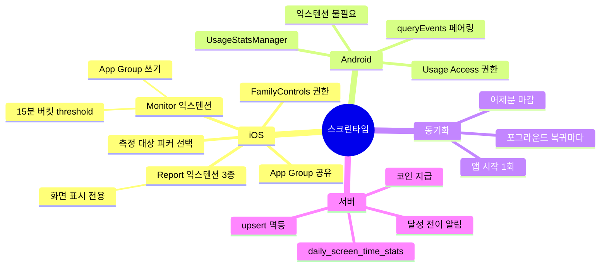

### 담당

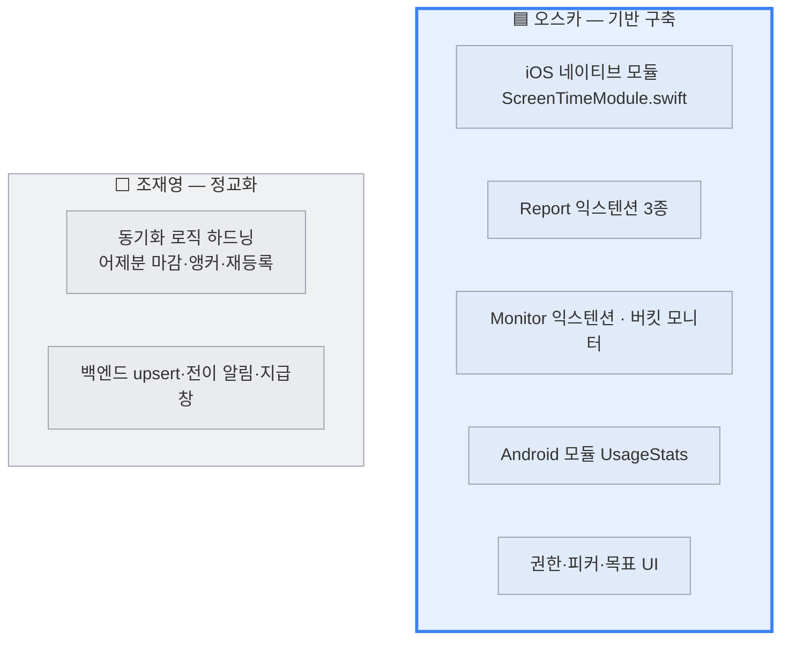

> 네이티브 3층(모듈·Report·Monitor)과 안드로이드 모듈은 **전부 오스카가 최초 구축**했다.
> 이후 서버 동기화 프로토콜 정교화와 백엔드는 조재영이 주도.

---

# Part 1. PRD

## 1.1 목적

스크린타임은 **혼자서는 못 줄이는 것**이다. 사용량을 눈에 보이게 만들고, 목표를 세우게 하고,
지키면 보상하고, 친구와 비교·내기하게 해서 절제를 사회적 행동으로 바꾼다.

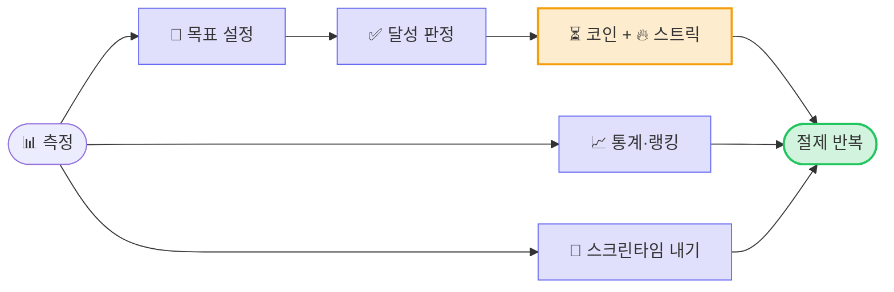

**스크린타임은 3개 기능의 데이터 소스다** — 재화 지급(`SCREEN_TIME_GOAL`) · 통계 화면 · 그룹 내기(SCREEN_TIME 카테고리).

## 1.2 기능 흐름

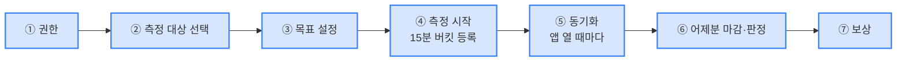

## 1.3 확정 정책

| # | 정책 | 근거 |
|---|---|---|
| **P1** | **당일 중간 동기화는 `goalAchieved=false` 고정** | 스크린타임 달성은 "목표 **이내**"라 하루가 끝나야 판정 가능. 중간에 true를 보내면 서버의 false→true 전이 이벤트가 **조기 발화**한다 |
| **P2** | **최종 보고는 클라 판정을 신뢰** | 서버는 **과거 시점의 목표값을 모른다**(목표는 바뀔 수 있다). 클라가 "그때의 목표"로 계산한 결과를 그대로 쓴다 |
| **P3** | **지급 창 = [어제, 오늘]로 제한** | P2가 클라를 신뢰하므로 위조 채굴 방어가 필요. 오래된 과거도, **미래 날짜도** 거부한다 |
| **P4** | **`reportedAt`은 대상 날짜의 로컬 정오** | 이 기능의 측정 축은 **로컬**(익스텐션이 로컬 하루로 버킷을 자른다)인데 서버 저장 축은 **KST 고정**이라(`ZonePolicy.KST`, GROMO-1259), 두 축을 잇는 값이 필요하다. 정오는 자정 경계 오귀속을 막는 여유가 가장 크다. **다만 전 범위를 덮지는 못한다** — 오프셋 `X` 의 로컬 정오는 KST `21 − X` 시라 같은 날 조건은 **`X > UTC−3`**(UTC−8 → KST 다음 날 05:00). `UTC−3` 이하는 하루 밀리지만 쓰기 경로가 모두 같은 앵커라 시프트가 균일해 손상은 없다 — 수용 한계 L5. 상세·검산은 `docs/date-axis.md` §6 G2 |
| **P5** | **측정값은 클라 보고를 신뢰** | 위조 리스크 **수용 확정 정책** (리그·재화가 공유하는 플랫폼 전제) |
| **P6** | **15분 해상도 수용** | iOS는 threshold 이벤트로만 수치를 알 수 있고, 이벤트 수에 RAM 상한이 있다 (§4.1) |
| **P7** | **권한 없으면 조용히 미동작** | 스크린타임은 민감 권한이다. 거부해도 앱의 다른 기능은 정상 동작한다 |

## 1.4 플랫폼별 도달 범위

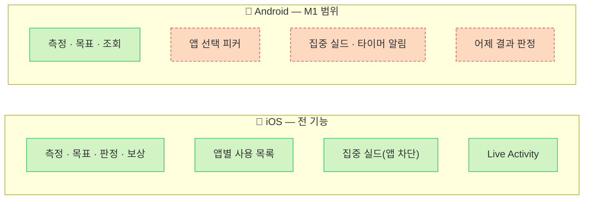

JS 계약 20개 중 안드로이드는 **M1(권한 + 오늘/어제 사용시간 + 목표 저장)만** 구현돼 있다.

---

# Part 2. IA

## 2.1 iOS — App Group이 정보 구조의 중심

**프로세스가 3개**(앱 · Report 익스텐션 · Monitor 익스텐션)로 나뉘어 있고, 이들이 공유하는
유일한 통로가 App Group `group.com.oneorthree.gromo`다.

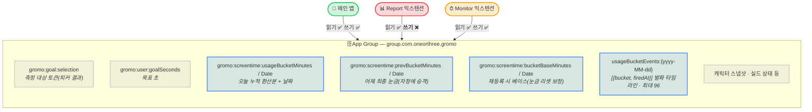

**파랑 키가 Monitor 익스텐션만 쓸 수 있는 측정값이다.** Report 익스텐션은 수치를 알지만
쓸 수 없다 — 이 제약이 전체 아키텍처를 결정했다([Part 5](#part-5-왜-안-받아와졌었나)).

## 2.2 서버 데이터

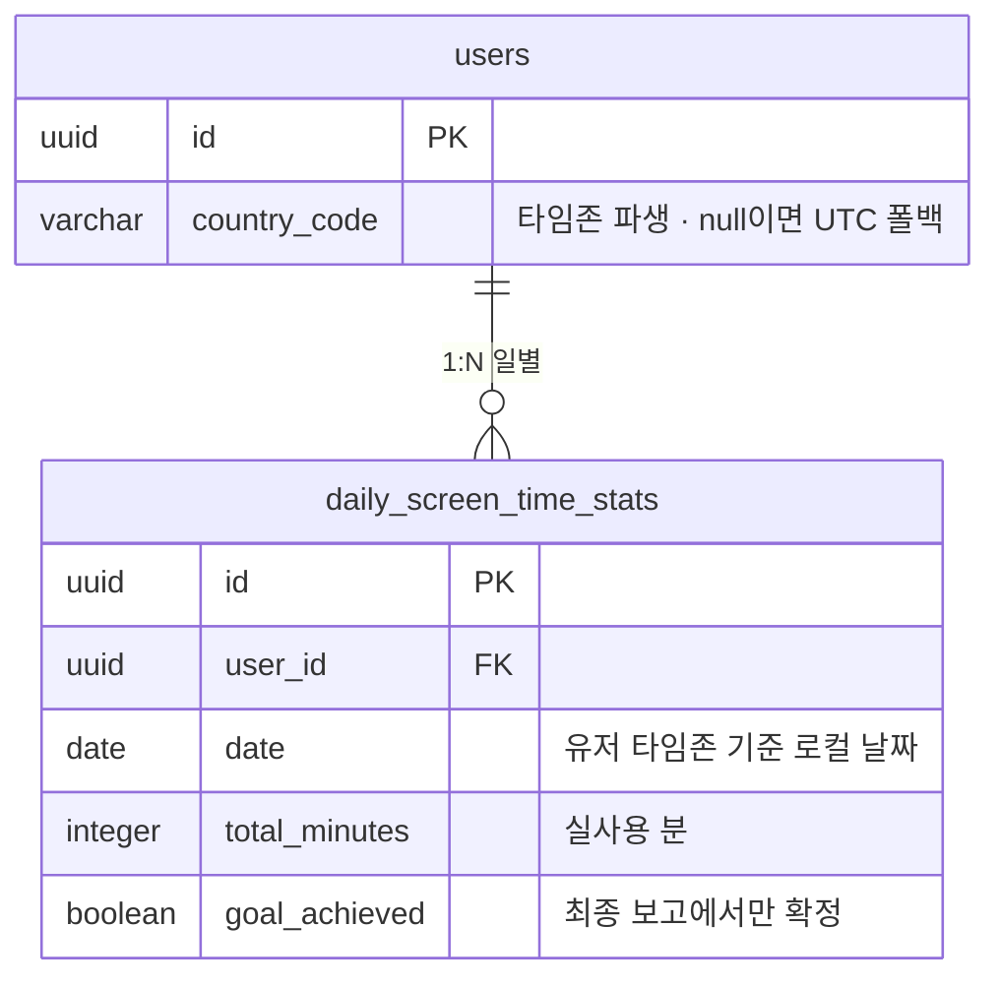

**`(user_id, date)` upsert 멱등** — 하루 여러 번 보내면 최신값으로 덮인다.

## 2.3 API

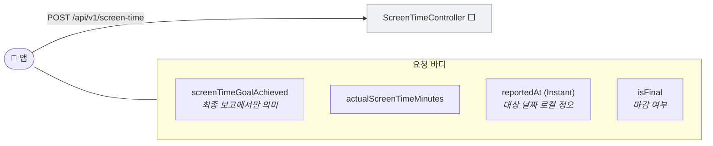

> `isFinal`을 안 보내는 구버전 앱을 위해 **서버가 finality를 추론**한다 — 과거 날짜 보고면 마감으로 간주.

## 2.4 화면 IA

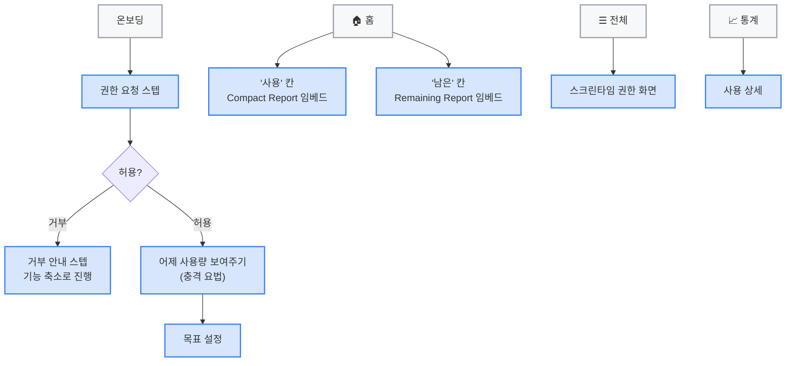

---

# Part 3. HLD

## 3.1 핵심 딜레마 — 이 기능 설계의 전부

iOS DeviceActivity API에는 **구조적 모순**이 있다:

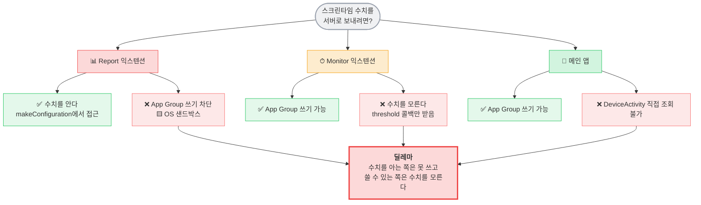

## 3.2 해법 — 버킷 모니터

**"수치를 모른다"를 "눈금을 촘촘히 박아 알아낸다"로 바꾼다.**

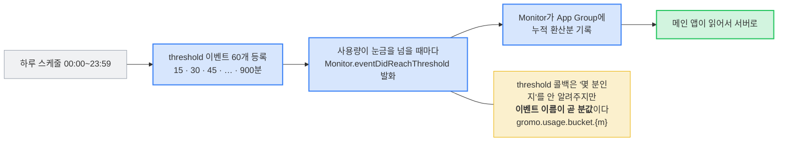

> **Report 익스텐션은 이제 화면 표시 전용이다.** 수치 파이프라인에서 완전히 빠졌다.

## 3.3 iOS 전체 구성

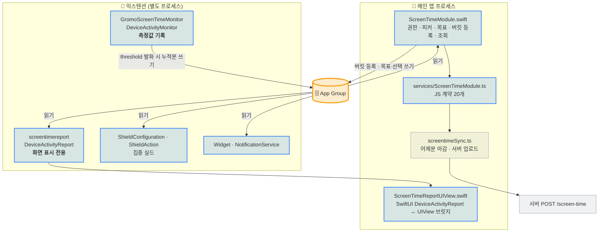

## 3.4 Android — 완전히 다른 구조

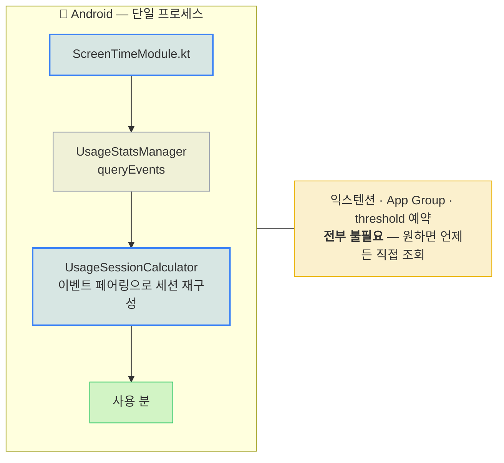

### 플랫폼 비교

| | 🍎 iOS | 🤖 Android |
|---|---|---|
| **API** | FamilyControls + DeviceActivity | `UsageStatsManager` |
| **수치 조회** | ❌ 직접 불가 → **threshold 눈금으로 역산** | ✅ **언제든 직접 조회** |
| **프로세스** | 앱 + 익스텐션 2종 (별도 프로세스) | 단일 프로세스 |
| **데이터 통로** | App Group (UserDefaults) | 없음 (직접 반환) |
| **해상도** | **15분** (눈금 간격) | **초 단위** (이벤트 타임스탬프) |
| **측정 대상** | 사용자가 피커로 선택한 앱/카테고리만 | 전체 앱 |
| **권한 UX** | 시스템 팝업 (`notDetermined` 존재) | **팝업 없음** — 설정 화면으로 보내고 복귀 시 재확인 |
| **앱 꺼져 있을 때** | ✅ Monitor가 계속 측정 | ✅ OS가 기록, 나중에 조회 |
| **지연** | threshold 발화까지 최대 15분 | 없음 |

> **정반대의 어려움**이다. iOS는 "수치를 못 가져와서" 어렵고, 안드로이드는 "원시 이벤트를
> 직접 조립해야 해서" 어렵다(§4.5 엣지 5종).

## 3.5 동기화 트리거 — "몇 분마다"

**주기적 타이머가 없다.** 측정은 OS가 앱과 무관하게 하고, 앱은 열릴 때만 퍼 나른다.

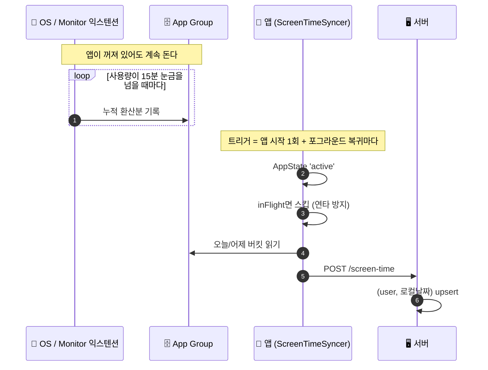

| 층 | 주기 |
|---|---|
| **측정** | 15분 눈금마다 (OS가 발화) — 앱 무관 |
| **App Group 기록** | threshold 발화 즉시 |
| **서버 동기화** | **앱 시작 1회 + 포그라운드 복귀마다** |
| **어제분 마감** | 날짜가 바뀐 뒤 **첫 동기화** 1회 |

> 백그라운드 주기 동기화가 없어도 되는 이유: **측정 자체가 앱과 무관**하고, 서버 upsert가
> 멱등이라 늦게 올려도 값이 맞는다. 어제분은 Monitor가 자정에 보존해두므로
> **어제 앱을 한 번도 안 열었어도 마감된다.**

## 3.6 신뢰 경계

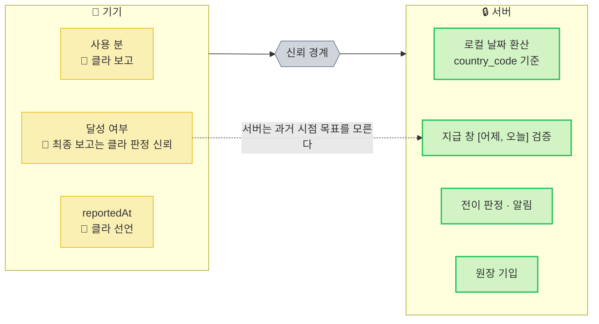

---

# Part 4. LLD

## 4.1 버킷 모니터 등록

```swift
let step = 15                                     // 눈금 간격(분)
let maxMinutes = min(max(Int(v), step), 900)      // 상한 900분 = 15h = 이벤트 60개
```

```mermaid
flowchart TD
    R(["startUsageBucketMonitoring"]) --> S{"측정 대상 selection<br/>토큰이 있나"}
    S -->|"없음"| F["false 반환<br/>토큰 없으면 threshold가 발화하지 않는다"]:::bad
    S -->|"있음"| W{"categoryTokens<br/>가 있나"}
    W -->|"있음"| W1["webDomains = []<br/>비운다"]:::o
    W -->|"없음"| W2["webDomains = 선택값"]:::o
    W1 & W2 --> E["이벤트 60개 생성<br/>gromo.usage.bucket.15 · 30 · … · 900"]:::o
    E --> B["baseMinutes 저장<br/>= 재등록 전까지의 누적"]:::o
    B --> M["center.stopMonitoring → startMonitoring"]:::o

    classDef o fill:#3b82f633,stroke:#3b82f6,stroke-width:2px
    classDef bad fill:#ef444433,stroke:#ef4444
```

| 결정 | 왜 |
|---|---|
| **상한 900분(60개)** | 🟨 Monitor 익스텐션 **RAM 6MB** 제약. 이벤트가 많으면 익스텐션이 죽고, 눈금이 굵으면 경계가 뭉개진다 |
| **카테고리가 있으면 웹도메인 제외** | 카테고리에 웹 사용이 이미 포함돼 **이중 계산**된다 → 버킷이 실사용량보다 커진다 |
| **`baseMinutes`** | 재등록하면 threshold 눈금이 0부터 다시 시작한다. 재등록 시점 누적을 베이스로 저장해 **`bucket = base + 눈금`**으로 환산 |
| **selection 변경 시 재등록 필수** | threshold는 **등록 시점 토큰으로 고정**된다 |

## 4.2 threshold 발화 처리 (Monitor 익스텐션)

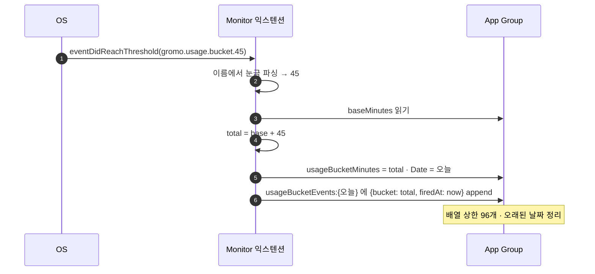

**타임라인(`usageBucketEvents`)을 따로 남기는 이유**: 창(window)형 챌린지가 "몇 시부터 몇 시까지"의
사용량을 알아야 하는데, 누적값만으로는 구간을 못 자른다. `firedAt`이 있어야 구간 사용분을 낸다.

## 4.3 자정 롤오버

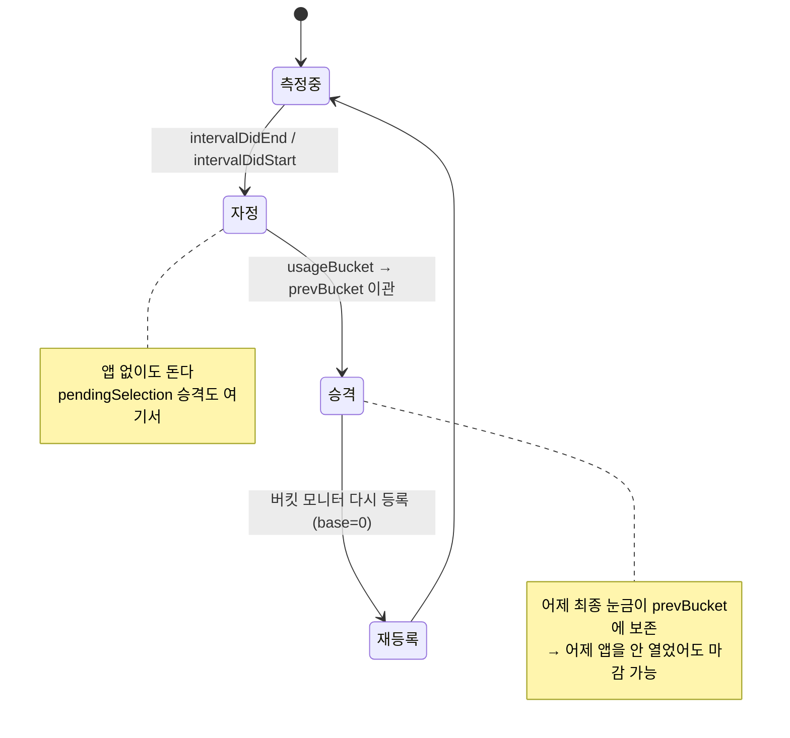

**결측 복구** — 자정 콜백을 놓쳐 `prevBucket`으로 아직 안 넘어간 경우,
`getYesterdayUsageBucketMinutes`가 **현재 버킷의 날짜가 어제면 그 값을 어제분으로 읽는다.**
threshold 콜백의 지연 복구보다 먼저 실행돼도 올바른 값이 나오게 하는 방어다.

## 4.4 서버 동기화

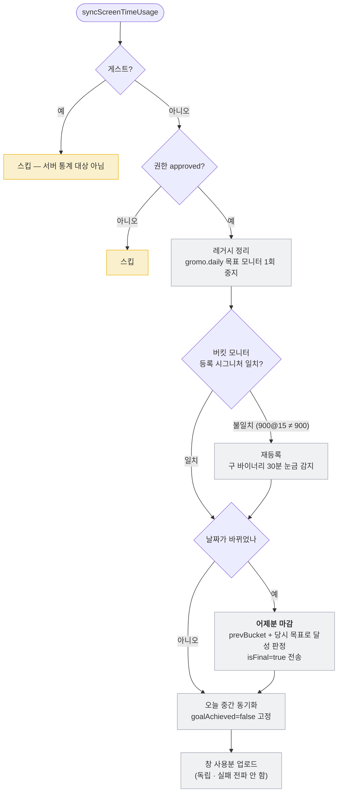

**등록 시그니처 `900@15`** — OTA로 JS만 새로 받은 **구 바이너리는 여전히 30분 눈금**을 등록한다.
그래서 마커에 구 형식(`900`)을 그대로 쓰고, **새 바이너리 설치 후 첫 실행이 불일치를 감지해 재등록**한다.

**`reportedAt` = 대상 날짜의 로컬 정오** ([P4](#13-확정-정책)) — 자정 경계 날짜 오귀속 방지.

**값 보존** — 재부팅 결측 등으로 측정값이 줄어드는 케이스는 `max(보존값, 마지막 동기화값)`으로 방어.

## 4.5 Android 세션 재구성

`queryUsageStats(INTERVAL_DAILY)`는 버킷 경계가 **기기 사정(재부팅 등)에 흔들려 부정확**하다.
그래서 `queryEvents` 원본 스트림을 페어링해 포그라운드 구간을 직접 재구성한다.

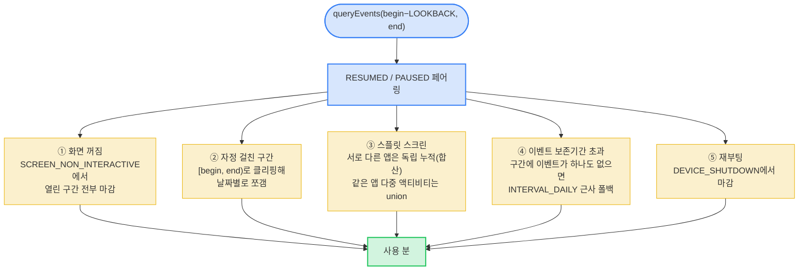

| # | 엣지 | 처리 안 하면 |
|---|---|---|
| ① | 화면 꺼짐 | **잠든 밤새 카운트**된다 |
| ② | 자정 걸친 구간 | 전날 밤에 시작한 사용이 오늘분에 통째로 들어간다 |
| ③ | 스플릿 스크린 | 동시 사용 구간을 어떻게 셀지 정의가 없다 (iOS 스크린타임과 같은 '합산' 채택) |
| ④ | 보존기간 초과 | 며칠 전 데이터가 0으로 나온다 |
| ⑤ | 재부팅 | 열린 구간이 영원히 안 닫힌다 |

> **수용 한계**: LOOKBACK(24h)보다 먼저 시작해 조회 구간 끝까지 이벤트를 하나도 안 남긴 세션은
> 재구성에서 빠진다. 현실적으론 화면 꺼짐이 그 전에 끼어 거의 발생하지 않는다.

### 권한 UX 차이

```mermaid
flowchart LR
    IOS["🍎 requestAuthorization()"]:::o --> P1["시스템 팝업"]:::sys --> S1["notDetermined → approved / denied"]:::ok
    AND["🤖 requestAuthorization()"]:::o --> P2["설정 화면으로 이동<br/><b>팝업 없음</b>"]:::sys --> S2["복귀 시 재확인<br/>'보낸 적' 로컬 플래그로<br/>notDetermined ↔ denied 구분"]:::warn

    classDef o fill:#3b82f633,stroke:#3b82f6,stroke-width:2px
    classDef sys fill:#9ca3af26,stroke:#9ca3af
    classDef ok fill:#22c55e33,stroke:#22c55e
    classDef warn fill:#eab30833,stroke:#eab308
```

Usage Access는 **시스템 팝업이 없는 특수 권한**이라 `notDetermined` 개념 자체가 없다.
"설정에 보낸 적 있음" 로컬 플래그로 미결정과 거부를 구분한다.

## 4.6 백엔드 저장

```mermaid
sequenceDiagram
    autonumber
    participant A as 📱 앱
    participant S as ScreenTimeService ⬜
    participant DB as 💾 daily_screen_time_stats
    participant N as 알림 · 재화

    A->>S: POST /screen-time
    S->>S: country_code → ZoneId (없으면 UTC)
    S->>S: reportedAt → 로컬 날짜 환산
    S->>S: 최종 보고 판정<br/>isFinal=true 또는 과거 날짜
    S->>DB: 기존 행 읽기 (전이 판정용)
    S->>DB: (user, date) upsert
    alt 최종 보고 && false→true 전이
        S->>S: 지급 창 [어제, 오늘] 검증<br/>미래 날짜도 거부
        S->>N: 달성 알림 + SCREEN_TIME_GOAL 코인 지급
    end
```

> `ON CONFLICT` 네이티브 upsert 대신 **재조회 방식**을 쓰는 이유: 순수 upsert가 아니라
> **전이(false→true) side-effect**가 있어서, 덮기 전 값을 알아야 한다.

---

# Part 5. 왜 안 받아와졌었나

세 번 막혔고, 셋 다 원인이 달랐다. **증상이 아니라 "어느 화면에서 안 보이는가"로 갈라야** 진단이 된다.

| 증상 | 의미 |
|---|---|
| 스크린타임 화면에서도 0분 | 익스텐션 자체가 안 돎 (권한/빌드) |
| 상세 화면은 정상, 홈만 0 | 익스텐션은 돌지만 홈의 뷰가 익스텐션을 못 깨움 |

## 5.1 원인 ① — 익스텐션 배포 타겟 불일치

```mermaid
flowchart LR
    B["빌드 설정"]:::s --> M["메인 앱<br/>IPHONEOS_DEPLOYMENT_TARGET 15.1"]:::ok
    B --> E["screentimereport 익스텐션<br/><b>26.5</b>"]:::bad
    E --> R["테스트 기기 iOS < 26.5<br/>→ 익스텐션이 <b>설치조차 안 됨</b>"]:::bad
    R --> F["getTotalScreenTime() 항상<br/>duration: 0.0, lastUpdated: nil"]:::bad
    F --> S["해결: 익스텐션 타겟 16.0으로<br/>(FamilyControls/DeviceActivity 최소)"]:::ok

    classDef s fill:#9ca3af26,stroke:#9ca3af
    classDef ok fill:#22c55e33,stroke:#22c55e
    classDef bad fill:#ef444433,stroke:#ef4444
```

> **추가 함정**: 권한을 허용해도 **앱을 완전히 종료했다 재시작**해야 익스텐션이 인식된다.
> 권한 변경만으로는 부족하다.

## 5.2 원인 ② — 비가시 DeviceActivityReport는 깨어나지 않는다

홈의 "사용" 칸을 채우려고 화면 밖(`top: -1000`)에 숨긴 트리거 뷰를 뒀는데, 익스텐션의
`makeConfiguration()`이 **한 번도 호출되지 않았다.**

```mermaid
sequenceDiagram
    participant H as HomeScreen
    participant V as 숨겨진 트리거 뷰
    participant OS as DeviceActivityReportService
    participant E as Report 익스텐션

    H->>V: top:-1000 위치에 렌더
    V->>OS: scene 생성 요청
    OS-->>OS: Removing parent scene
    OS-->>OS: scene content state: notReady
    OS-->>OS: Unregistering scene
    Note over E: makeConfiguration 호출 안 됨 ❌
```

**중간 시도** — `UIHostingController`를 `addChild`/`didMove(toParent:)` 없이 `addSubview`만
하고 있어 parent VC가 없어 scene이 즉시 invalidate되던 문제를 먼저 고쳤다. 크래시는 사라졌지만
`makeConfiguration`은 여전히 호출되지 않았다 — **뷰가 실제로 화면에 보이지 않았기 때문**이다.

**최종 해결 — 아키텍처 변경**: 비가시 트리거를 버리고 **홈의 "사용" 칸 자체를 보이는
`DeviceActivityReport`로 교체**했다. Report Context를 `Total Activity`(상세) /
`Compact Activity`(홈 사용) / `Remaining Activity`(홈 남은)로 분리.

> 교훈: **`DeviceActivityReport`는 "화면에 실제로 보일 때만" 동작한다.** 데이터 조회 수단으로
> 쓸 수 없고, UI 컴포넌트로만 쓸 수 있다.

## 5.3 원인 ③ — Report 익스텐션의 App Group 쓰기는 OS가 막는다 🟨

"사용" 칸은 표시되는데 `getTotalScreenTime()`은 여전히 0. App Group 접근은 되는데 키가 비어 있었다.

```
cfprefsd rejecting write of key(s) <private> in { group.com.oneorthree.gromo, ... }
from process ... (screentimereport) because setting preferences outside an
application's container requires user-preference-write or file-write-data sandbox access

kernel Sandbox: screentimereport(...) deny(1) file-write-data
/private/var/mobile/.../Library/Preferences/group.com.oneorthree.gromo.plist
```

**entitlements도 provisioning profile도 정상이었다.** Apple이 `DeviceActivityReportExtension`의
App Group **쓰기를 OS 샌드박스 레벨에서 의도적으로 차단**한 것이고, 코드·설정으로는 해결 불가다.
프라이버시 설계상의 구조적 제약이다.

```mermaid
flowchart LR
    T1["앱 삭제 → Clean Build → 재설치"]:::try --> X1["동일 deny"]:::bad
    T2["권한 재허용 + 재시작"]:::try --> X2["동일 deny"]:::bad
    T3["다른 App Group 컨테이너 UUID"]:::try --> X3["동일 deny"]:::bad
    X1 & X2 & X3 --> C["🟨 코드로 못 뚫는다"]:::os

    classDef try fill:#9ca3af26,stroke:#9ca3af
    classDef bad fill:#ef444433,stroke:#ef4444
    classDef os fill:#f59e0b33,stroke:#f59e0b,stroke-width:3px
```

**1차 대응(방향 반전)** — 쓰기가 막히면 **읽기 방향으로 뒤집는다.** 메인 앱이 `goalSeconds`를
App Group에 쓰고, 익스텐션이 그걸 **읽어서** "남은 = 목표 − 사용"을 익스텐션 내부에서 계산해
화면에 그린다. (읽기는 정상 — Report 익스텐션은 App Group에 대해 **read-only**다.)

**최종 대응(현재 구조)** — 그래도 **서버로 보낼 수치**는 얻지 못한다. 화면에만 그려서는
통계·내기·보상을 못 만든다. 그래서 **Monitor 익스텐션 + 15분 버킷 threshold**로 갈아탔고,
Report 익스텐션은 화면 표시 전용으로 물러났다(§3.2).

## 5.4 부수적 사고 — 실패했는데 성공 보상이 지급됨

```mermaid
flowchart TD
    B["DeviceActivityEvent(<br/>applications: [], categories: [], webDomains: [],<br/>threshold: ...)"]:::bad
    B --> R1["🟨 모니터링 대상이 없으면<br/><b>threshold가 절대 발화하지 않는다</b>"]:::os
    R1 --> R2["goalExceededToday 항상 false"]:::bad
    R2 --> R3["intervalDidEnd가 항상 'success' 기록"]:::bad

    BK["백업 판정: totalDuration vs goalSeconds"]:::bad --> BK1["원인 ③으로 totalDuration 항상 0"]:::bad
    BK1 --> R3
    R3 --> OUT["화면엔 '달성 실패',<br/>모달은 '목표 달성!' 🎉"]:::bad

    classDef bad fill:#ef444433,stroke:#ef4444
    classDef os fill:#f59e0b33,stroke:#f59e0b,stroke-width:2px
```

**두 판정 경로가 모두 같은 방향으로 고장 나 있었다.** 지금 구조는 이 문제가 원천적으로 없다 —
달성 판정을 threshold 플래그가 아니라 **버킷 사용시간 ≤ 목표**로 하기 때문이다.
레거시 `gromo.daily` 목표 모니터는 동기화 시 1회 중지 처리된다(§4.4).

## 5.5 검토했지만 버린 대안

| 대안 | 결과 |
|---|---|
| **A.** DeviceActivityReport를 어제 구간으로 렌더 | ❌ 비가시면 `makeConfiguration` 미호출(원인 ②) + 결과 저장 불가(원인 ③) |
| **B.** FileManager로 App Group 컨테이너에 JSON 직접 쓰기 | 🔲 미검증 — `cfprefsd` 차단은 plist 경로 한정이라 다른 규칙일 가능성. **버킷 모니터가 먼저 동작해 불필요해짐** |
| **C.** `DeviceActivityEvent`에 전체 앱 토큰 전달 | ❌ 앱 토큰은 `FamilyActivityPicker`로 사용자가 직접 선택해야 발급. "전체 앱" 토큰 집합을 얻는 공개 API 없음 |

## 5.6 익스텐션 디버깅법

`.appex`는 **메인 앱과 별도 프로세스**라 **Xcode 콘솔에 안 찍힌다.**

1. Spotlight → **Console.app** 실행
2. 좌측에서 연결된 iPhone 선택
3. 검색창에 `screentimereport` 또는 `GromoScreenTimeMonitor`
4. 기기에서 동작 재현 → `print()` 로그와 scene 생명주기 로그 확인

### 일반 체크리스트

| 원인 | 확인 |
|---|---|
| FamilyControls 권한 없음 | Console.app에 익스텐션 로그 자체가 없음 |
| 익스텐션이 번들에 미포함 | Build Phases > Embedded Content에 `.appex` 없음 |
| App Groups가 인증서에 없음 | provisioning profile에 App Groups 미포함 |
| Bundle ID 불일치 | 실제 Bundle ID ≠ entitlements의 App Group |
| **측정 대상 미선택** | selection 토큰이 없으면 threshold가 발화하지 않는다 (§4.1) |

---

# Part 6. 갭

```mermaid
quadrantChart
    title 스크린타임 갭 — 영향 대비 비용
    x-axis "낮은 비용" --> "높은 비용"
    y-axis "낮은 영향" --> "높은 영향"
    quadrant-1 "계획 잡기"
    quadrant-2 "지금 하기"
    quadrant-3 "여유 될 때"
    quadrant-4 "재검토"
    "Android M2~M4 (피커·실드·판정)": [0.8, 0.85]
    "countryCode 전송": [0.2, 0.7]
    "측정 신뢰(위조 방어)": [0.85, 0.6]
    "15분 해상도 한계": [0.7, 0.35]
    "워크로그 현행화": [0.15, 0.3]
    "Android 실기기 엣지 검증": [0.45, 0.55]
```

| # | 항목 | 영향 |
|---|---|---|
| 1 | **Android M2~M4 미구현** | 앱 피커·집중 실드·어제 결과 판정이 없어 안드는 **측정만** 된다. 보상 루프가 반쪽 |
| 2 | **앱이 `countryCode`를 안 보냄** | 서버가 UTC로 폴백 → 타임존 유저의 날짜 귀속이 `reportedAt` 정오 트릭에 의존 |
| 3 | 측정값 위조 방어 없음 | P5로 수용 중이나, 내기·리그가 같이 걸려 있어 **플랫폼 차원 과제** |
| 4 | 15분 해상도 | 🟨 RAM 6MB 제약이라 눈금을 더 못 줄인다. 창형 챌린지의 짧은 구간 정확도 한계 |
| 5 | Android 엣지 5종 실기기 검증 미완 | 스플릿 스크린·보존기간 초과·재부팅 실측 필요 |
| 6 | `ScreenTime_WorkLog.md`가 낡음 | 6월 기준 — 버킷 모니터 전환 이전 구조를 설명. 이 문서로 대체 |

**우선순위: 1 → 2 → 5 → 3**
