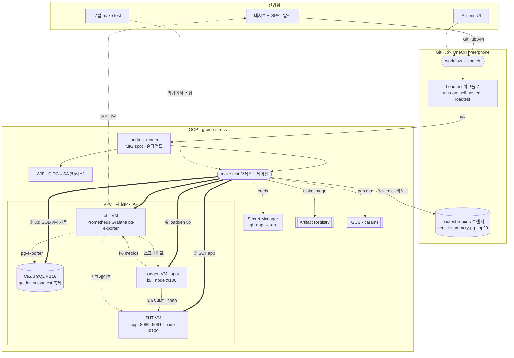
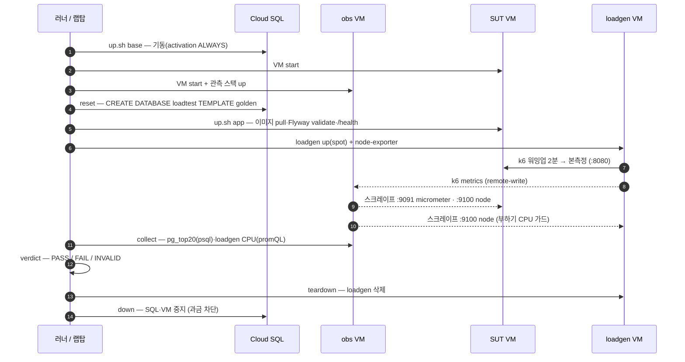

# loadtest — gromo 부하테스트 하네스 (GROMO-548)

버튼 하나(딸깍)로 부하테스트를 실행·판정·비교하는 하네스. 상세 기획은 **[docs/prd.md](docs/prd.md)**,
아키텍처 원천은 `knowledge/topics/부하테스트-아키텍처.md` v2.

## 퀵스타트 (Phase 0 완성 후)

```bash
# 1회: GCP 부트스트랩 + 인프라 + 시드
make bootstrap        # 프로젝트·API·TF 상태·WIF (수동 단계는 infra/bootstrap/README.md)
make infra-up         # terraform apply
make seed             # golden DB (~6,500만 건, 수십 분)

# 딸깍
make test PROFILE=smoke TARGET=scenarios/daily_mix.js   # 로컬 딸깍
make dashboard                                          # 대시보드(트리거·히스토리·판정·diff)
# 또는 GitHub Actions → loadtest.yml → Run workflow
```

## 아키텍처

**딸깍(트리거) → GitHub Actions → GCP** 전체 흐름. 진입점 3개(대시보드·Actions UI·로컬 make)가 같은
`make test` 파이프라인을 실행한다. 원격 2개는 GitHub Actions의 **전용 self-hosted 러너**(온디맨드 spot)를
타고, 러너는 **WIF(키리스)** 로 gromo-stress를 조종한다.

### 전체 구성



### make test 런타임 순서



- **golden 템플릿**: 시드 1회 → `IS_TEMPLATE` 동결, run마다 `TEMPLATE` 복제(reset). 부하는 복제본(loadtest)에만.
- **온디맨드 러너**: 평시 MIG 0대(비용 0), `make runner-up`으로 1대 → 자기 등록(GitHub App creds from Secret Manager). loadgen(spot)도 run마다 생성·삭제.
- **관측**: Prometheus가 SUT(micrometer·node)·loadgen(node)·Cloud SQL(pg-exporter)을 스크레이프하고 k6는 remote-write. Grafana는 인터넷 노출 0, IAP 터널로만 접근.

## 디렉토리

| 경로 | 내용 |
|---|---|
| `docs/` | PRD 등 기획 문서 |
| `infra/bootstrap/` | GCP 1회 부트스트랩 스크립트 |
| `infra/terraform/` | 상시 인프라 (VPC·Cloud SQL·SUT·관측 VM·템플릿) |
| `infra/sut/` `infra/obs/` | SUT·관측 VM docker compose |
| `seed/` | golden DB 시드 파이프라인 (Flyway 스키마 + SQL 데이터 + params/JWT) |
| `k6/` | 부하 스크립트 (lib/profiles/matrix/scenarios) |
| `grafana/` | 부하테스트 전용 대시보드 JSON |
| `scripts/` | run 오케스트레이션 (loadgen·run·collect·verdict) |
| `dashboard/` | 개발자 대시보드 SPA (Vite+React) |
| `reports/baseline/` | 회귀 비교 기준 (사람 승인 PR로만 갱신) |

## 운영 원칙

- **평시 전부 중지** — `make down`이 곧 과금 차단. 부하 VM(spot)은 run마다 생성·삭제.
- run 비교는 **메타(sha·seed·스펙) 동일**할 때만 유효 — 다르면 verdict가 diff를 거부한다.
- 실부하 DB에 `EXPLAIN ANALYZE` 금지 — 심층 분석은 `analysis` 클론에서.
