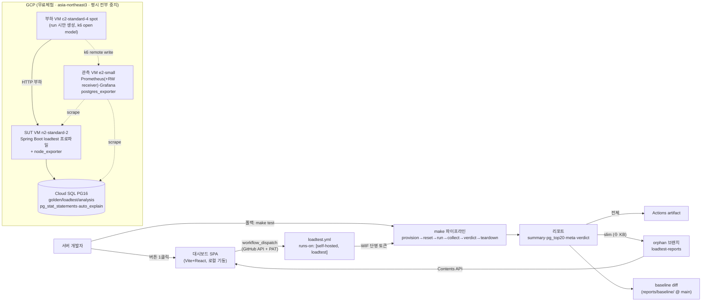

# gromo 부하테스트 하네스 PRD (GROMO-548)

> **한 줄 요약**: gromo 백엔드가 릴리즈 전에 어디까지 버티는지(동접·TPS)와 어디가 병목인지를
> **버튼 하나(딸깍)** 로 측정·판정·비교할 수 있는 부하테스트 하네스를 GCP 위에 구축한다.
>
> - 설계 원천: `knowledge/topics/부하테스트-아키텍처.md` v2 (멘토 세션 기반 설계 → 코드 실측 교정)
> - 관련 티켓: GROMO-548 (완료 조건: 병목 정리·임계 구간 식별 + 모니터링 546 지표 연계)
> - 작성일: 2026-07-10 · 범위: **Phase 0 (하네스 관통)**

---

## 1. 배경과 목표

### 배경

- 관측 스택(티켓 588·546)은 dev에 실배포 완료 — 수집층(Actuator/micrometer)과 Prometheus·Grafana·Loki가 코드로 존재한다.
- 부하테스트는 설계(v2)만 있고 구현 0. 현재는 "내 로컬에선 빠른데" 이상의 근거가 없다.
- `focus_sessions`는 PK 외 인덱스 0개인 채로 커서 페이지네이션 API가 그 위에서 돌고 있고(잠재 병목 1순위), 시드 데이터가 없어 어떤 병목도 재현·정량화할 수 없다.

### 목표

1. **딸깍 실행**: 대시보드 버튼 1클릭(또는 `make test` 한 줄)으로 provision → reset → 부하 → 수집 → 판정 → teardown이 무인 실행된다.
2. **재현 가능한 측정**: golden DB 복제 리셋 + 메타(sha·seed·스펙) 강제로 run 간 비교가 항상 성립한다.
3. **판정 자동화**: 합격선(p95<200ms·p99<500ms·에러율<1%·dropped=0)과 baseline diff(p95 +10% 악화 = 회귀)를 코드가 판정한다.
4. **개발자 대시보드**: run 트리거·히스토리·PASS/FAIL·baseline diff를 한 화면에서. Grafana는 시계열 심층분석 전용으로 분리.

### 성공 지표 (Phase 0)

- smoke run(5rps·1분)이 **수동 개입 0**으로 전 파이프라인을 관통해 PASS 리포트를 남긴다.
- 유휴 시 비용이 스토리지 수준(월 ~$15 이하 추정)으로 떨어진다.

## 2. 범위 / 비범위

| 범위 (Phase 0) | 비범위 (후속) |
|---|---|
| GCP 부트스트랩(제로부터)·Terraform 상시 인프라 | 병목 실측·개선 Phase 1~4 (블로그 4부작) |
| seed ≥3,000만 건(합계 ~6,500만) + golden 동결 | 부하 환경 Loki/promtail (SUT 로그는 ssh로) |
| k6 스위트(smoke 관통에 필요한 최소 매트릭스 3종 + 믹스 1종) | 전체 매트릭스 파일(heatmap·league·friends·search 등) |
| make 딸깍 파이프라인 + verdict/baseline diff | spike(23:59 스크린타임)·soak 실행 |
| workflow_dispatch + 전용 러너 + 대시보드 MVP | 대시보드 호스팅(GCS 정적)·알림·run 취소·멀티 baseline |
| | prod(AWS) 환경 부하 — 절대치는 GCP 기준임을 리포트에 명시 |

## 3. 용어

| 용어 | 의미 |
|---|---|
| **SUT** | System Under Test — 측정 대상(Spring Boot VM + Cloud SQL) |
| **golden DB** | 시드 원본. `IS_TEMPLATE true`로 동결, 접속 불가 |
| **loadtest DB** | 측정용 DB. run마다 `CREATE DATABASE … TEMPLATE golden`으로 리셋 |
| **analysis DB** | EXPLAIN 심층분석용 클론 (실부하 DB에 EXPLAIN ANALYZE 금지) |
| **open model** | `arrival-rate` 기반 부하 — 서버가 느려져도 유입 유지(coordinated omission 회피) |
| **매트릭스 run** | 엔드포인트 1개만 때리는 run — pg_stat_statements 델타 = 그 API의 쿼리 프로필 |
| **verdict** | run 판정: PASS / FAIL(threshold·회귀) / INVALID(spot 선점·부하기 CPU>80%·메타 불일치) |
| **baseline** | 회귀 비교 기준 리포트. `loadtest/reports/baseline/`(main), 사람 승인 PR로만 갱신 |

## 4. 전체 아키텍처



- **진입점 3개, 파이프라인 1개**: 대시보드 버튼 / Actions UI / 로컬 `make test` — 전부 같은 make 타겟을 실행한다.
- 러너는 dev 서버에 **`loadtest` 라벨 전용 러너를 추가 등록** — 부하 run(수십 분~수 시간)이 `cd.yml` 배포 큐를 막지 않게 한다.
- GCP 인증은 **Workload Identity Federation**(GitHub OIDC ↔ GCP SA) — 러너에 키 파일을 두지 않는다.

## 5. 사용자 시나리오

1. **run 트리거**: 개발자가 `make dashboard`로 대시보드를 열고 PAT를 1회 등록 → 프로파일(smoke/load/…)과 타겟(매트릭스/믹스)을 골라 실행 버튼 클릭 → 히스토리에 run이 나타나고 진행 상태가 갱신된다. 끝나면 PASS/FAIL/INVALID 배지가 붙는다.
2. **회귀 확인**: 기능 PR 머지 후 load run 실행 → verdict가 baseline 대비 p95 +10% 악화를 감지해 FAIL → 대시보드 diff 뷰에서 어느 엔드포인트가 얼마나 나빠졌는지 확인 → Grafana에서 해당 시간창의 서버/DB 층 원인 탐색.
3. **baseline 갱신**: 개선 PR 뒤 run이 PASS + 유의미한 개선 → `make baseline-promote RUN=<id>`로 baseline 갱신 PR 생성 → 사람이 리뷰·머지(자동 갱신 금지).

## 6. 기능 요구사항

### 6-1. make 타겟 (딸깍의 실체)

| 타겟 | 하는 일 | 비고 |
|---|---|---|
| `bootstrap` | GCP 프로젝트·API·TF 상태·WIF 1회 구성 | §7-2, 멱등 |
| `infra-up` | terraform apply (상시 인프라) | |
| `up` / `down` | SUT·관측 VM 기동/중지 + compose up | down = 과금 차단 |
| `sync` | 관측 설정(prometheus tpl 렌더·grafana provisioning) VM 반영 | 레포가 진실 원천 |
| `seed` | golden DB 생성(스키마=Flyway V1~최신, 데이터=SQL) | `SCALE=` 축소 지원 |
| `reset` | loadtest ← golden TEMPLATE 복제 + pg_stat reset | 분 단위 |
| `mint` | JWT 대량 재발급(만료 임박 시) → GCS params | exp +30d |
| `run` | 워밍업 2분 → pg_stat reset → 본측정 (k6 2회 실행) | §9 |
| `collect` | summary.json·pg_top20.csv·meta.json 수집 | |
| `verdict` | threshold + baseline diff 판정 → verdict.json | §6-3 |
| **`test`** | **up→reset→run→collect→verdict→down 복합 (딸깍)** | PROFILE=·TARGET= |
| `loadgen-up/down` | 부하 VM(spot) 생성/삭제 | test에 포함 |
| `teardown` | 전체 중지 + 부하 VM 삭제 | |
| `dashboard` | 대시보드 로컬 기동(vite) | |
| `baseline-promote` | run 리포트를 baseline으로 승격(PR용 변경 생성) | 사람 승인 필수 |

### 6-2. 리포트 규격 (run 산출물)

```
reports/<UTC일시>-<sha>-<profile>-<target>/
├── summary.json    # k6 handleSummary — endpoint 태그별 p50/95/99·rps·err·dropped
├── pg_top20.csv    # pg_stat_statements 델타 top-N (calls·mean·total·rows·hit_pct)
├── meta.json       # sha·seedVersion·profile·target·SUT/DB/부하기 스펙·k6OptionsHash·mixVersion·loadgenMaxCpu·startedAt
└── verdict.json    # PASS|FAIL|INVALID + 사유 + baseline diff 표
```

- 전체 → Actions artifact. **slim(4파일, 수 KB) → orphan 브랜치 `loadtest-reports`에 CI 자동커밋**(main 불가침).
- **비교 가능 조건**: sha 외 메타가 전부 동일할 것. seed 버전·스펙이 다르면 diff 거부(INVALID).

### 6-3. 판정 규칙

| 판정 | 조건 |
|---|---|
| FAIL (threshold) | `p(95)≥200ms` 또는 `p(99)≥500ms` 또는 에러율 ≥1% 또는 `dropped_iterations>0` |
| FAIL (회귀) | baseline 대비 엔드포인트 p95 +10% 이상 악화, 같은 rps에서 dropped 발생 |
| INVALID | spot 선점 감지 / 부하기 CPU>80% / 메타 불일치로 diff 불가 |
| PASS | 위 어디에도 해당 없음 |

**평가 순서**: **INVALID 조건을 가장 먼저** 평가하고, 하나라도 참이면 threshold·회귀 판정을 건너뛴다
— 부하기 과부하·spot 선점으로 인한 인위적 고지연이 "회귀(FAIL)"로 오판정되는 것을 막는다.

### 6-4. 대시보드 MVP (4기능, ~500줄 예산)

| # | 기능 | 데이터 소스 |
|---|---|---|
| 1 | run 트리거 폼 (profile+target) | `POST …/actions/workflows/loadtest.yml/dispatches` |
| 2 | run 히스토리 (상태·소요·Actions 링크) | workflow runs API |
| 3 | verdict 배지 (PASS/FAIL/INVALID) | `loadtest-reports` 브랜치 Contents API |
| 4 | baseline diff 표 (p95/p99/err/dropped, ±% 색상) | verdict.json + summary.json |

인증: fine-grained PAT(actions rw, contents r) 1회 입력 → localStorage. **명시적 연기**: 호스팅, 서버 컴포넌트, Grafana 임베드(링크로 대체), run 취소, 스케줄링, 알림.

## 7. 인프라 설계

### 7-1. 리소스 표

| 리소스 | 스펙 | 평시 | 왜 |
|---|---|---|---|
| SUT VM | **n2-standard-2** (2vCPU/8GB), min CPU platform 고정 | 중지 | e2는 CPU 세대 랜덤 배정 → baseline ±10% 판정 오염. prod 동급 크기 |
| Cloud SQL | PG16 db-custom-2-8192, SSD 50GB, **사설 IP 전용** | 중지 | 플래그(pg_stat_statements·auto_explain)·TEMPLATE·pg_trgm 전부 지원 + Query Insights 무료 |
| 관측 VM | e2-small (2vCPU), 디스크 보존 | 중지 | run 간 히스토리 비교. Prometheus(+remote-write receiver)·Grafana·postgres_exporter |
| 부하 VM | **c2-standard-4 spot** (4vCPU), 폴백 n2-highcpu-4 | 없음 (run 시 생성) | 무료체험 8 vCPU 상한 안에서 최대. CPU>80%면 run 무효 |

**vCPU 예산**: SUT 2 + 관측 2 + 부하 4 = **8 = 무료체험 상한** (Cloud SQL은 별도 쿼터). 유료 업그레이드는 stress에서 부하기 선포화가 확인될 때 재결정(Phase 1~4).

### 7-2. 부트스트랩 (1회, 스크립트 + 수동 단계)

1. `bootstrap.sh`(멱등): 프로젝트 생성 → API 활성화(compute·sqladmin·servicenetworking·secretmanager·iam·sts·storage·cloudbilling 등) → TF 상태 GCS 버킷(버저닝) → WIF 풀/프로바이더(GitHub OIDC, 이 레포 한정 신뢰) + `loadtest-runner` SA(최소권한) 생성
2. 수동: 빌링 계정 연결(무료체험), budget alert 이메일 확인
3. `check-quota.sh`: asia-northeast3에서 C2(또는 N2) ≥4, 합산 동시 ≤8, IN_USE_ADDRESSES 확인 — 부족 시 증설 요청 안내 출력
4. 수동: dev 서버에 **`loadtest` 라벨 러너 등록** (기존 러너와 병렬 프로세스, 절차는 bootstrap/README)

### 7-3. 네트워크·보안

- VPC 1개 + 서브넷 1개, 같은 존 — 네트워크 변수·비용 제거. Cloud SQL은 **Private Service Access**로 사설 IP만.
- 방화벽: 22 = IAP 레인지(`35.235.240.0/20`)만 / 3000(Grafana) = 개발자 IP 허용목록 / 내부 상호 스크레이프(8080·9091·9100·9187) / 그 외 인바운드 차단.
- 시크릿: **GCP Secret Manager 전용 랜덤**(`loadtest-jwt-secret`·`loadtest-db-password`, terraform `random_password`). **AWS dev 시크릿 복사 금지** — dev 자격증명이 GCP로 새지 않게.
- DB 접근(시드·pg_stat 덤프)은 전부 **관측 VM에서 IAP ssh 경유** — 랩탑/러너는 DB 직통 경로 없음.

## 8. 시드 설계

### 8-1. 원칙

- **스키마 = Flyway V1+V2** (dockerized Flyway CLI, 앱 부팅 불필요) — prod와 같은 경로로 만들어진 스키마. 이후 앱의 `ddl-auto: validate`가 드리프트 가드.
- **데이터 = 서버사이드 SQL** — 차원 테이블은 CSV `\copy`(한글 닉네임·그룹명), 팩트 테이블은 `INSERT … SELECT generate_series()` (3천만 건도 분 단위).
- **데이터 > RAM**: ~15GB(인덱스 포함) > 인스턴스 RAM 8GB — 전부 메모리에 들어가면 I/O 병목이 안 보인다.
- 적재 가속: 대형 테이블 PK/FK 후생성, 세션 `synchronous_commit=off`·`maintenance_work_mem=2GB`, 완료 후 `VACUUM ANALYZE` → 그 상태로 golden 동결.
- 재현성: 랜덤 시드 고정 + `SEED_VERSION=seed-v1` 태깅 — 메타에 기록, 버전 다르면 diff 거부. `SCALE=` 파라미터로 축소 시드(파이프라인 디버그용) 지원.

### 8-2. 볼륨 표 — **V2 스키마 교정본** (진실 원천: `V2__align_common_columns.sql`)

> 설계 문서(부하테스트-아키텍처.md §상세1)의 볼륨표는 V2 이전 컬럼 기준 — 아래 교정을 적용한다.
>
> **⚠️ 갱신(PRD 확정 직후 V3~V6 머지)**: 아래 표는 post-V2 시점 스냅샷이다. 이후 V4(focus_tags →
> default_tags+user_focus_tags 분리), V5(그룹 미션 컬럼 → 챌린지 CTI 상세), V3(pinned_users·
> group_join_codes), V6(포모도로 2종)이 반영되어, **살아있는 진실 원천은 `loadtest/seed/volume.md`
> (post-V6)** 다. 마이그레이션이 추가되면 volume.md 부터 갱신한다.

| 테이블 | 건수 | V2 교정 사항 |
|---|---|---|
| users (+1:1 **×5**) | 10만 (×5) | `is_deleted` boolean(~2%). 1:1은 wallets·streaks·focus_time/notification/screen_time settings 5종 |
| focus_tags | 40만 | |
| daily_focus_stats | 1,200만 | `total_distraction_seconds`·`is_focus_time_goal_achieved`. **focus_sessions보다 먼저 적재**(FK 대상) |
| daily_screen_time_stats | 1,200만 | `actual_screen_time_minutes`→`total_screen_time_minutes`, `screen_time_goal_achieved`→`is_screen_time_goal_achieved` 리네임(분 단위 유지) |
| **focus_sessions** | **3,000만** | subject/local_date/distraction_count/deleted_at **제거됨** → `status`(COMPLETED ~97%/CANCELED ~3%)·`focus_type`(3종 믹스)·`daily_focus_stat_id`(user+date 조인)·`created_at`=ended_at. **`total_distraction_seconds`(NOT NULL, V1부터 존속)도 시드 필수** — daily_focus_stats의 동명 컬럼과 별개. id = `seed_uuid_v7(started_at)` — 커서 정렬 보존 |
| currency_transactions | 500만 | type ∈ SESSION_COMPLETE/STREAK_BONUS/PURCHASE, `idempotency_key`=결정론 md5 |
| friendships | 200만 | deleted_at 5% (부분 unique 인덱스 현실화) |
| groups / group_members | 5만 / 100만 | 한글 그룹명(Phase 3용). `groups.status` ∈ **WAITING/ACTIVE/ENDED**(V2에서 CLOSED 제거 — 구 도메인 값 시드 시 CHECK 위반). members: `created_at`·`status`(INACTIVE/CHALLENGE/FOCUS)·`is_left` |
| group_challenges / _members | 20만 / 200만 | `status` ∈ **ACTIVE/INACTIVE**(V2에서 ENDED→INACTIVE — 구 도메인 값 시드 금지) |
| league_arenas / league_arena_users | ~4만 / 120만 | 12주 × arena당 30명 |
| items / user_items / character_equipment | 500 / 100만 / 40만 | |
| **합계** | **≈6,500만 / ~15GB** | 하한 요구: **≥3,000만** 충족 |

- UUID: 시간 정렬 필요(focus_sessions 등) = `seed_uuid_v7(ts)`, 차원 = 결정론 `md5('user-'||n)::uuid`.
- 분포: 유저 활동량 Zipf(핫유저), 기간 180일, guest 비율 반영.

### 8-3. params + JWT (seed와 부하가 같은 세상을 보게)

- 마지막 단계에서 export: `users_zipf.json`(핫유저 가중 중복 수록)·`users_uniform.json`·`group_ids.json`·`search_terms.json`(실존 닉네임/그룹명 프리픽스).
- **JWT 사전 대량 발급**: Node(`jose`)로 HS256 `{sub,iat,exp}` 재구현(= `JwtProvider` 계약, smoke마다 SUT가 수락하는지로 암묵 검증), exp +30d, 시크릿은 Secret Manager → params에 병합 → `gs://…-params/<seed-version>/`.

## 9. k6 스위트 구성

```
loadtest/k6/
├── lib/        config·params(SharedArray)·auth(Bearer)·cursor(nextCursor 2페이지)·summary(handleSummary)
├── profiles/   smoke(5rps·1m) load(목표rps·10m) stress(계단·abortOnFail) spike soak   # 정의 5종, Phase 0 실행은 smoke
├── matrix/     focus-session-list.js ⭐ · focus-session-create.js · stats-today.js(대조군)
└── scenarios/  daily_mix.js (6여정 25/20/20/15/10/10 — 비중은 가정, meta에 mixVersion 명시)
```

- **open model**(`constant/ramping-arrival-rate`) 기본. threshold 4종을 스크립트에 내장(§6-3 1차 판정).
- **k6 2회 실행 구조**: ① 워밍업 2분(JIT·풀·버퍼캐시) → ② ssh로 `pg_stat_statements_reset()` → ③ 본측정. 단일 스크립트 내 `startTime` 방식 대신 2회 실행인 이유 — pg_stat은 태그로 워밍업을 제외할 수 없으므로, 리셋 경계를 프로세스 경계에 맞춰 **매트릭스 run의 pg_stat 델타를 순수하게** 유지한다.
- 카디널리티 가드: 모든 요청에 `name`/`endpoint` 태그(원시 URL 금지), `K6_PROMETHEUS_RW_TREND_STATS="p(95),p(99),avg,max"` 한정.
- 랜덤 파라미터(유저 Zipf·기간 랜덤), 쓰기 시나리오는 유저풀 파티셔닝(낙관락 우연 충돌 배제), idempotency_key는 매 요청 신규 UUID.

## 10. 관측 재사용 전략

| 항목 | dev 관측(546) | 부하 관측(이번) |
|---|---|---|
| 정의 원천 | `docker-compose.observability.yml` + `observability/` | **같은 정의의 변형**(`loadtest/infra/obs/`) — 이미지 핀·provisioning 마운트 공유 |
| Prometheus | scrape 5s | 동일 + **`--web.enable-remote-write-receiver`**(k6 RW 수신), 타겟은 tpl로 파라미터화(sut·loadgen·postgres_exporter) |
| Grafana | gromo-overview.json (RED·쿼리부하·리소스) | **재사용** + `loadtest-k6.json`(클라 층) 추가 |
| Loki/promtail/cAdvisor | 코어 | **Phase 0 제외** — 4층 대시보드에 불필요, SUT 로그는 ssh |
| postgres-exporter | compose 내 db 의존 | Cloud SQL 사설 IP 직결(`depends_on` 제거) |

4층 한 시간축: 클라(k6 RW) / 서버(micrometer) / DB(postgres_exporter·pg_stat) / 시스템(node_exporter — 부하기 CPU 가드 포함). 부하 결과(임계 rps·병목)는 546 알람 임계의 근거로 역수입한다(티켓 완료 조건).

## 11. 비용 추정 (무료체험 $300 크레딧 내, 2026-07 추정 단가)

| 항목 | 추정 | 근거 |
|---|---|---|
| smoke run 1회 (~15분) | **< $0.5** | VM 3대 0.25h(스팟 포함 ~$0.2/h 합산) + Cloud SQL 0.5h(~$0.16/h) |
| load run 1회 (~40분) | ~$0.3–0.7 | 위 비례 |
| full seed 1회 (수 시간) | ~$1–3 | Cloud SQL 수 시간 + 관측 VM |
| **유휴 월** | **~$10–15** | Cloud SQL 스토리지 50GB(~$8) + VM 디스크(~$5) + GCS 잔돈. **컴퓨트 0 = down 규율 전제** |

- 방어: budget alert 25/50/75/90%, `make down`이 test 복합 타겟의 마지막 단계, 부하 VM은 run 종료 시 **삭제**(중지 아님).
- 정확 단가는 부트스트랩 후 Billing 콘솔에서 확정해 이 표를 갱신한다.

## 12. 마일스톤 · PR 분할

| M | PR (제목) | 산출물 | 검증 |
|---|---|---|---|
| M0 | `[FEAT] GROMO-548 부하테스트 하네스 PRD 작성` | 이 문서 + README | 사용자 리뷰 |
| M1 | `[FEAT] GROMO-548 GCP 부트스트랩 스크립트` | bootstrap.sh·check-quota.sh·README | 스크립트 green, 버킷·WIF 존재 |
| M2 | `[FEAT] GROMO-548 백엔드 loadtest 프로파일 추가` | application-loadtest.yml | /back-check green (실부팅은 M5) |
| M3 | `[FEAT] GROMO-548 GCP 인프라 Terraform` | terraform/ 일체 | apply→IAP ssh→psql 플래그 확인→down |
| M4 | `[FEAT] GROMO-548 시드 파이프라인` | seed/ 일체 + volume.md | SCALE=0.01 관통 → full: 건수·크기·reset·커서 정렬(API 이전 단계 — psql로 `ORDER BY id DESC` 표본이 `started_at DESC`와 일치하는지 SQL로 직접 확인) |
| M5 | `[FEAT] GROMO-548 SUT·관측 스택 배포 구성` | compose 2종 + prometheus tpl + k6 대시보드 | make up → /health·targets UP·Grafana |
| M6 | `[FEAT] GROMO-548 k6 스위트` | k6/ 일체 | 전 파일 k6 inspect |
| M7 | `[FEAT] GROMO-548 make 딸깍 파이프라인` | Makefile + scripts 4종 | 랩탑 make test smoke 첫 관통 |
| M8 | `[FEAT] GROMO-548 loadtest workflow_dispatch 파이프라인` | loadtest.yml | Actions smoke green + reports 브랜치 커밋 |
| M9 | `[FEAT] GROMO-548 부하테스트 대시보드 MVP` | dashboard/ 일체 | §14 DoD 전체 |

순서: M0→M1→(M2∥M3)→M4→M5→M6→M7→M8→M9. M2·M6은 랩탑 전용이라 쿼터 대기와 병행 가능.
PRD 확정 후 필요 시 `jira-sync`로 M1~M9를 548 하위 티켓으로 분할(생성 전 목록 승인).

## 13. 리스크와 기본값

| 리스크 | 대응 (기본값) |
|---|---|
| 무료체험 8 vCPU — stress에서 부하기(4vCPU) 선포화 | smoke·load엔 충분. 포화 확인 시 유료 업그레이드 재결정 |
| C2 spot 재고 없음 | 템플릿 폴백 n2-highcpu-4 (make 플래그) |
| spot 선점 mid-run | 상태 폴링 → **INVALID**(FAIL 아님) 폐기. soak은 표준 VM(Phase 4) |
| 부하기 자체가 병목 | node_exporter로 CPU 감시, >80%면 INVALID |
| k6 RW 카디널리티 폭발 | name/endpoint 태그 강제·TREND_STATS 4종·보존 7d |
| JWT 시크릿 유출 경로 | GCP 전용 랜덤(Secret Manager), AWS dev 시크릿 복사 금지 |
| 러너 다운 / GitHub 장애 | 로컬 `make test` 폴백 (같은 파이프라인) |
| GCP 절대치의 prod(AWS) 이식 | 개선율만 유효 — 용량 수치는 GCP 기준임을 리포트에 명시 |
| 시나리오 믹스 비율은 가정 | `mixVersion: assumed-v1` 메타 명시, 출시 후 실 로그로 교정 |
| 설계 문서 볼륨표 pre-V2 | `seed/volume.md`가 진실, 아키텍처 문서에 역반영 노트(별도) |

## 14. 완료 기준 (DoD — Phase 0)

중지 상태 인프라에서 한 세션에 모두 성립:

1. 대시보드에서 **smoke+daily_mix 버튼 1클릭** →
2. `loadtest.yml`이 전용 러너에서 green — provision→reset→워밍업→본측정→collect→verdict→teardown **수동 개입 0**
3. artifact + `loadtest-reports`에 리포트 4파일, 부하기 CPU<80%
4. verdict=PASS → `make baseline-promote`로 첫 baseline(사람 승인 커밋)
5. 대시보드에 PASS 배지·baseline diff 렌더 + Grafana 4층 동일 시간창 확인
6. golden = 교정 볼륨(≥3,000만/합계 ~6,500만, 크기 > SUT RAM), `make reset` ≤ ~5분
7. teardown 후 빌링 = 유휴 스토리지 수준

## 15. 후속 (Phase 0 이후)

- **Phase 1**: `GET /focus-session` 매트릭스 실부하 — focus_sessions 인덱스 실험(`(user_id, started_at)` vs `(user_id, id)`), before/after → 블로그 1부
- **Phase 2**: 친구·그룹 N+1(LAZY 경로) — Hibernate Statistics assert + fetch 전략 → 2부
- **Phase 3**: groups/search LIKE → pg_trgm vs tsvector 한글 실측 → 3부
- **Phase 4**: 쓰기 경합(낙관락)·23:59 spike·soak·캐시(TTL Jitter) → 4부
- 운영: 회귀 게이트 루틴화(기능 추가마다 baseline 비교), 546 알람 임계 역수입, 대시보드 GCS 호스팅 검토
