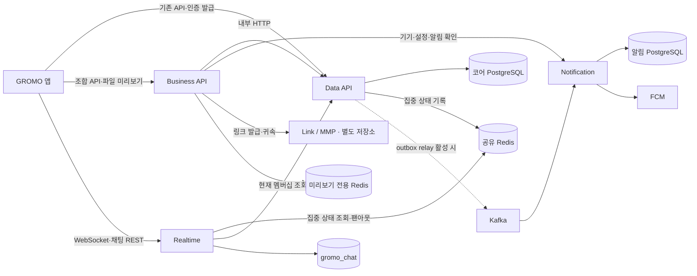
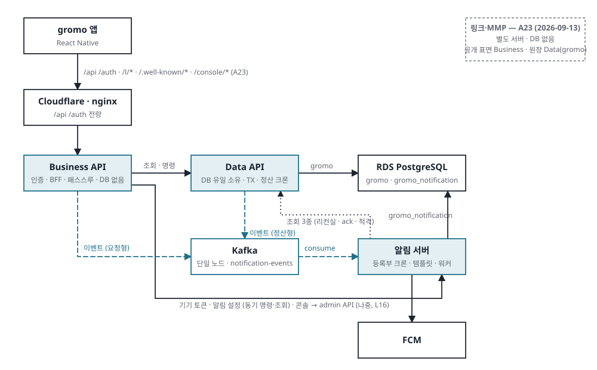

# GROMO 서버

> 집중한 시간이 캐릭터의 성장과 함께하는 섬의 활동으로 이어지도록 만드는 백엔드입니다.

GROMO는 집중 세션과 스크린타임을 기록하고, 캐릭터·아이템·재화·친구·그룹 활동을 연결하는 앱입니다. 이 폴더는 앱의 요청을 처리하는 API부터 실시간 채팅, 푸시 알림, 배포와 관측까지 담습니다.

[전체 프로젝트](../README.md) · [설계 결정](../docs/architecture/decisions.md) · [기능 문서](../docs/README.md) · [부하 테스트](../loadtest/README.md)

## 1. 서버 구성 한눈에 보기

| 구성 | 담당하는 일 | 저장소 · 의존성 | 문서 |
| --- | --- | --- | --- |
| Business API | 앱 요청 인증·조합, 공개 파일 링크 미리보기 | 상류 HTTP, 미리보기 전용 Redis | [README](business-api/README.md) |
| Data API | 계정·집중·섬·재화의 상태와 트랜잭션, 정산 | PostgreSQL, Redis, 선택적 outbox relay | [README](data-api/README.md) |
| Notification | 기기·설정·예약 알림·발송·운영 관리 | 전용 PostgreSQL, Kafka, FCM | [README](notification/README.md) |
| Realtime | 섬 채팅·읽음 위치·인스턴스 간 전파 | 전용 PostgreSQL, Redis Pub/Sub | [README](realtime/README.md) |
| Observability | 요청·쿼리·리소스·로그·트레이스 관측 | Prometheus, Grafana, Loki, Datadog | [README](observability/README.md) |
| Scripts | 환경별 Compose, 서비스별 설정 생성, 데이터 이관 | Docker Compose, Python, Bash, PostgreSQL 도구 | [README](scripts/README.md) |

네 JVM 서비스는 **각자 Gradle Wrapper와 Dockerfile을 가진 독립 프로젝트**입니다. 루트에서 한 번에 빌드하는 Gradle 멀티모듈 구조가 아니므로 해당 서비스 폴더에서 명령을 실행합니다.

## 2. 시스템 구성도

### 현재 코드의 주요 연결

아래는 코드에 존재하는 연결입니다. 위성 서비스와 relay의 실제 사용 여부는 배포 구성·프로파일·기능 플래그에 따라 달라집니다.



알림의 HTTP 이벤트 수신과 Data를 향한 제한된 조회 등 세부 연결은 각 서비스 README를 참고합니다. Link/MMP는 [별도 저장소](https://github.com/OneOrThree/mmp-custom)에서 관리합니다.

### 서비스 분리 목표

목표는 **앱의 일반 API 진입점을 Business로 모으고, 코어 데이터 변경을 Data에 집중하는 구조**입니다. 현재는 기존 API·인증이 Data에 남아 있으며, 새 BFF 화면과 실시간 이벤트의 일부는 기반만 준비되어 있습니다. 다음 그림은 구현 완료 현황이 아닌 Target-1 설계입니다.

[](../docs/architecture/service-architecture.md)

[서비스 아키텍처](../docs/architecture/service-architecture.md) · [시스템·배포 아키텍처](../docs/architecture/system-architecture.md)

## 3. 주요 구현과 설계 포인트

| 사용자 경험 · 운영 과제 | 서버에서 구현하는 내용 | 더 보기 |
| --- | --- | --- |
| 집중 기록과 보상이 일관되게 남기 | 집중 세션·재화 원장·정산을 코어 트랜잭션에서 관리 | [집중·휴식 설계](../docs/prd/focus-rest-session/README.md) |
| 응답을 놓쳐도 명령을 중복 실행하지 않기 | 같은 요청 키로 확정 결과를 재생하고 상태·receipt·outbox를 함께 저장 | [Business 공통 계층](business-api/README.md) |
| 섬 안에서 대화하고 집중 중에는 채팅 제한하기 | 멤버십·집중 상태 검사, Redis 팬아웃, 채팅 이력과 읽음 위치 | [Realtime](realtime/README.md) |
| 알림을 적절한 시점과 기기에 보내기 | 수신 중복 제거, 수신 동의·조용한 시간·확인 여부·발송 적격 검사 | [Notification](notification/README.md) |
| 파일을 공유하면 미리보기 보여주기 | 공개 URL 검증, 이미지·PDF 썸네일 생성, TTL 캐시 | [Business API](business-api/README.md) |
| 문제가 생긴 구간을 찾고 배포를 재현하기 | 요청·DB·리소스 지표와 로그, digest 기반 이미지, 서비스별 환경변수 | [관측](observability/README.md) · [배포 도구](scripts/README.md) |

## 4. 기술 스택

| 영역 | 저장소에서 사용하는 기술 |
| --- | --- |
| 런타임 | Java 17, Spring Boot 4.0.6, Gradle Wrapper |
| HTTP · 인증 | Spring MVC, JWT, 서비스 간 토큰 |
| 데이터 | PostgreSQL, JPA/Hibernate 또는 JDBC, Flyway |
| 비동기 · 실시간 | Kafka, WebSocket/STOMP, Redis Pub/Sub, ShedLock |
| 테스트 · 검사 | JUnit 5, Testcontainers, Checkstyle, SpotBugs, JaCoCo |
| 운영 | Docker Compose, GitHub Actions, Prometheus/Grafana/Loki, Datadog |

## 5. 로컬에서 시작하기

기본 앱 기능을 확인하려면 Data API부터 실행합니다. **저장소 루트 기준**입니다.

```bash
docker compose -f server/scripts/docker-compose.local.yml up -d db
cd server/data-api
# 최초 설정 시에만 복사합니다. 기존 로컬 설정이 있으면 유지합니다.
test -f src/main/resources/application-local.yml || cp src/main/resources/application-local.yml.example src/main/resources/application-local.yml
./gradlew bootRun --args='--spring.profiles.active=local'
```

API는 `http://localhost:8080`, Swagger UI는 `http://localhost:8080/swagger-ui/index.html`입니다. 채팅은 별도 DB·Redis, 위성 서비스는 서비스별 환경변수가 추가로 필요합니다. 각 README의 실행 절차를 이어서 확인합니다.

## 6. 검증 · 배포

서비스 폴더에서 `./gradlew build`로 테스트·정적 검사·패키징을 수행합니다. 통합 테스트에는 실행 중인 Docker가 필요합니다. Business의 PDF 미리보기 테스트는 Poppler가 필요하므로 Dockerfile의 `test` 단계를 사용할 수 있습니다.

- Data API: [dev CI](../.github/workflows/dev-ci.yml), [운영 CI](../.github/workflows/prod-ci.yml).
- Realtime: [독립 CI](../.github/workflows/realtime-ci.yml).
- Business·Notification: [위성 서비스 CI](../.github/workflows/satellite-ci.yml).
- 배포·이관: [Scripts 실행 안내](scripts/README.md).

---

문서 구성은 [EDGE README](https://github.com/alphaeveryday/edge)의 소개·구성도·구현 결과·운영 설명 흐름을 참고했습니다. 서비스 역할과 구현 상태는 이 저장소의 코드·설정·설계 문서를 기준으로 작성했습니다.
