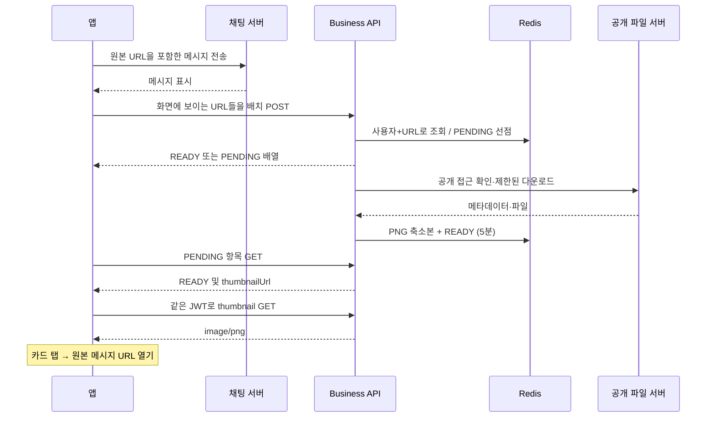

# Business API — 공개 파일 링크 미리보기

채팅에 공유한 URL의 파일명·유형·썸네일을 만드는 별도 서버다. 채팅 메시지는 원본 URL만 유지하고, 미리보기는 실패하거나 만료되어도 다시 만들 수 있는 부가 정보로 취급한다.

## 지원 범위

| 링크 | 결과 |
| --- | --- |
| 공개 Drive 파일, Docs·Sheets·Slides | 파일명·MIME·크기(제공되는 경우), 제공되는 썸네일을 PNG로 변환 |
| 직접 PNG·JPEG·GIF URL | 파일명·크기·최대 480px PNG 썸네일, 첫 프레임만 |
| 직접 PDF URL | 파일명·크기·첫 페이지 PNG 썸네일 |
| 기타 파일·미지원 이미지·일반 페이지 | URL 경로의 이름·응답 MIME·크기, 썸네일 없음 |

비공개 Drive와 폴더·공개 게시용 `/d/e/` 링크는 지원하지 않는다. HTML Open Graph 수집은 하지 않는다. HTTP 응답이 성공했어도 로그인 HTML을 반환하는 일반 파일 서버는 내용 기반 접근 권한을 판별할 수 없다. 이때 파일 다운로드나 HTML 렌더링 없이 일반 링크 카드만 반환한다.

**직접 파일 업로드와 원본 파일의 영구 저장은 없다.** 다운로드는 메모리에서 최대 10MiB까지만 처리한다. PDF 변환에는 권한이 제한된 임시 디렉터리를 사용하고 종료·실패 때 삭제한다. Docker의 `/tmp`는 용량 64MiB인 tmpfs여서 컨테이너 종료 시에도 사라진다. Redis에는 메타데이터와 축소 PNG만 잠시 보관한다.

## 아키텍처


Java 17 / Spring Boot 4.0.6의 독립 Gradle 프로젝트다. 기존 서버와 코드·DB를 공유하지 않는다. JWT 서명 키와 `type=access`·UUID subject 계약만 data-api와 맞춘다. 토큰 발급·갱신은 data-api가 담당한다. 탈퇴·로그아웃 직후의 토큰 폐기는 조회하지 않으므로 access token 만료까지의 창을 허용한다.

## API 계약

모든 API는 `Authorization: Bearer <access-token>`이 필요하다. HTTP 응답에는 `X-Request-Id`와 `Cache-Control: no-store`가 붙는다.

| API | 의미 |
| --- | --- |
| `POST /api/v1/link-previews` | `{ "urls": ["https://example.com/guide.pdf"] }`, 1~10개, URL당 최대 4096자. 같은 순서의 미리보기 배열 반환 |
| `GET /api/v1/link-previews/{id}` | 상태 및 카드 조회. 캐시가 없거나 다른 사용자이면 404 |
| `GET /api/v1/link-previews/{id}/thumbnail` | 인증된 PNG 바이트. 캐시나 썸네일이 없으면 404 |

```json
{
  "id": "64자리 SHA-256 문자열",
  "status": "READY",
  "originalUrl": "https://example.com/guide.pdf",
  "title": "guide.pdf",
  "mimeType": "application/pdf",
  "sizeBytes": 102400,
  "provider": "FILE",
  "thumbnailUrl": "/api/v1/link-previews/<id>/thumbnail",
  "errorCode": null
}
```

`status`는 `PENDING`·`READY`·`FAILED`, `provider`는 `FILE`·`GOOGLE_DRIVE`다. 준비 전 또는 실패 시 제목·유형·provider 등이 null이다. `READY`라도 썸네일이 null일 수 있으므로 MIME별 기본 아이콘을 표시한다. URL fragment(`#...`)는 외부 조회·캐시 식별에서 제외하고 쿼리 문자열(Drive resourcekey, 서명 파라미터 등)은 보존한다. 앱은 원본 메시지 URL로 열면 특정 페이지·시트 fragment도 유지된다.

실패 이유 예: `NOT_PUBLIC_OR_NOT_FOUND`, `DRIVE_NOT_CONFIGURED`, `BLOCKED_ADDRESS`, `FILE_TOO_LARGE`, `REDIRECT_REJECTED`, `FETCH_TIMEOUT`, `FETCH_FAILED`, `BUSY`. 공개 권한이나 파일 크기 검증 실패는 `FAILED`, 공개 파일을 얻은 후 손상된 이미지/PDF·썸네일 실패는 `READY` 카드로 축소한다. 원본 URL을 표시하는 앱은 미리보기 실패를 채팅 전송 실패로 취급하면 안 된다.

HTTP 오류는 `{ "code": "...", "message": "..." }`다. 잘못된 요청은 400, 인증 실패는 401, 본문 256KiB 초과는 413(Content-Length가 없는 요청은 스트림 제한에 의해 400), 요청량 초과는 429(`Retry-After: 60`), Redis 장애는 503(`Retry-After: 10`)이다.

## 앱 연결 흐름

현재 `legacy/screens/group/ChatTab.tsx`는 전송 기능이 준비 중인 화면이다. 이번 PR은 그 화면을 실제 채팅으로 전환하지 않으며 다음 계약으로 연결한다.



- 발신자·수신자·이전 메시지 모두 화면에 보이는 URL을 배치한다. 최대 10개씩 보낸다.
- PENDING은 예를 들어 2초→4초→8초 간격, 최대 90초까지만 확인한다. 화면을 나가면 중단한다. GET 404면 원본 URL로 POST를 다시 요청한다.
- 실패는 30초 동안 캐시한다. 즉시 반복 재요청하지 않고 기본 링크를 표시한다.
- 썸네일 URL은 서비스 기준 상대 경로다. 이미지 요청에도 Authorization 헤더를 넣는다. GET 404/401 시 기본 아이콘으로 돌아간다.
- 카드 탭은 서버를 통한 다운로드가 아니라 원본 메시지 링크 열기다. 실제 채팅 전송 API 연결과 앱 카드 컴포넌트는 후속 작업이다.

## 제한·캐시·복구

- 사용자별 캐시: `cache:business:preview:{userId}:{urlHash}`. ID를 알아도 다른 계정의 URL·이미지는 볼 수 없다. 같은 공개 링크를 받은 사용자는 자기 계정으로 POST하면 된다. 중복 방지는 같은 사용자 내에서 적용된다.
- PENDING 90초 / READY 300초 / FAILED 30초. SET NX로 선점하고 완료 시 원래 generation이 그대로 있을 때만 교체한다. 만료 후 재생성 중에 이전 작업이 끝나도 새 결과를 덮어쓰지 못한다.
- 프로세스 종료·Redis 장애로 결과 저장이 실패하면 pending TTL 후 POST로 복구한다. GET만으로 작업을 생성하지 않는다. Redis eviction으로 일찍 사라질 수도 있다.
- 전용 Redis는 128MiB·allkeys-lru·영속화 없음. 캐시 손실이 허용되며 기존 채팅/프레즌스 Redis와 분리한다. 메모리 압박 시 rate key도 eviction될 수 있어 이 제한은 남용 방어의 보조 수단이다. 인터넷 경계의 인증/IP 요청 제한과 함께 운영한다.
- 1분 240 비용: 배치 POST URL당 4, GET/썸네일당 1. 프로세스별 동시 작업 4·대기 8, 초과는 `BUSY`로 30초 캐시한다.
- 파일 최대 10MiB, Google 메타데이터 64KiB. 이미지 최대 2천만 픽셀·출력 480px/512KiB. SVG/WebP/HTML은 렌더링하지 않는다.
- HTTP(S) 기본 포트만 허용한다. 사설·루프백·링크 로컬·예약 IP 및 IPv6 전환 주소를 차단한다. DNS 결과 전체를 검사하고 실제 연결 주소로 고정한다. 최대 3회 리다이렉트마다 재검증하며 HTTPS→HTTP를 거절한다. 쿠키·자동 압축·자동 재시도는 끈다. Google 키는 메타데이터 API 첫 요청에만 전송하고 Google 메타데이터 리다이렉트는 거절한다.
- DNS 대기 2초·조회 스레드 최대 4. HTTP 체인 10초(재검증 DNS 시간은 별도로 최대 2초), 응답 읽기 5초. PDF는 프로세스 8초·Linux 주소 공간 256MiB/CPU 6초/출력 2MiB. Docker 컨테이너도 메모리·PID·CPU를 제한한다.
- 공개→비공개 변경이 기존 READY에 반영되기까지 최대 5분의 창이 있다. 만료 후에는 Drive API를 다시 검증한다. CDN/브라우저에 영구 캐시하지 않으며 Google의 만료되는 thumbnailLink는 클라이언트에 노출하지 않는다.

## 실행·검증

환경변수:

| 변수 | 내용 |
| --- | --- |
| `JWT_SECRET` | 필수. data-api와 같은 UTF-8 HMAC 키 원문, 최소 32바이트. 기본값 없음 |
| `GOOGLE_DRIVE_API_KEY` | Drive API를 활성화한 프로젝트의 서버 API 키. API 제한은 Drive API로 설정하고 배포 egress IP 제한을 권장. 미설정 시 일반 파일은 동작하고 Drive만 `DRIVE_NOT_CONFIGURED` |
| `BUSINESS_REDIS_HOST/PORT/USERNAME/PASSWORD` | Redis 접속, 기본 localhost:6379. Compose는 전용 Redis 주소 주입 |
| `BUSINESS_LOG_PATH` | 기본 `logs/business-api.log` |

```sh
# 이 디렉터리에서, 셸에 위 환경변수를 주입한 후 실행
# 비밀 값은 소스 파일에 저장하지 않는다.
docker compose up --build -d
docker compose logs -f business-api

# 로컬 JDK17, Docker, Poppler(pdftoppm) 필요. Linux는 util-linux(prlimit)도 필요.
./gradlew build
./gradlew bootRun
```

로컬 Compose는 `127.0.0.1:8082`만 publish한다. 관리 포트 `9091`은 컨테이너 내부 전용이다. dev는 기존 compose에 `server/scripts/docker-compose.business.yml`을 덧씌워 수동 활성화한다. CI는 도구가 설치된 테스트 컨테이너와 독립 Gradle 홈에서 테스트·Checkstyle·SpotBugs·bootJar, Docker 빌드를 검증하고 main push에서만 GAR에 SHA와 latest 태그를 올린다. 자동 배포는 추가하지 않는다. 운영 활성화에는 라우팅·TLS와 Google API 키 설정이 필요하다.

API 경로의 percent encoding·matrix parameter 표기에도 인증·본문 제한·요청 로그를 동일하게 적용한다. 관리용 `/actuator`, `/actuator/health`, `/actuator/health/liveness`, `/actuator/health/readiness`, `/actuator/info`, `/actuator/prometheus`의 정확한 경로만 인증 예외다. 관리 포트는 내부 네트워크에서만 접근한다.

## 로그 확인

표준 출력과 rolling 파일(파일당 20MB, 7일, 총 200MB)을 함께 기록한다. Compose의 `business-logs` 볼륨에 보관한다.

- `business_request`: request_id, HTTP method, status, duration_ms. 모든 API 요청과 인증 실패 포함.
- `preview_cache`: request_id, preview_id, 캐시 status.
- `preview_completed`: request_id, preview_id, status, provider, error reason, thumbnail 존재 여부, duration_ms.
- `preview_failure`, `preview_rejected`, `preview_cache_write_failed`: 실패 분류·과부하·저장 실패. 원문 예외 메시지 대신 예외 타입만 기록한다.

`X-Request-Id`로 HTTP 요청과 비동기 완료를 연결한다. 원본 URL·쿼리·Drive resourcekey·JWT·API 키·파일명·외부 응답 내용은 로그에 기록하지 않는다. 파일명은 외부 입력이므로 앱에서 텍스트로만 표시한다. `/actuator/health/readiness`는 Redis 장애를 반영하고 `/actuator/prometheus`에서 기본 HTTP/JVM 메트릭을 제공한다.

참고: [Drive 공개 API 키](https://developers.google.com/workspace/guides/create-credentials), [파일 메타데이터·thumbnailLink 제약](https://developers.google.com/workspace/drive/api/reference/rest/v3/files), [resourcekey 전달](https://developers.google.com/workspace/drive/api/guides/resource-keys), [Apache HttpClient DNS 연결 설정](https://hc.apache.org/components/httpcomponents-client-5.2.x/5.2.3/httpclient5/apidocs/org/apache/hc/client5/http/class-use/DnsResolver.html).
