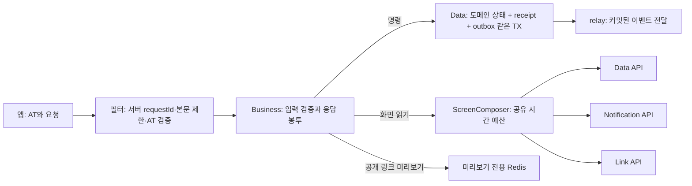
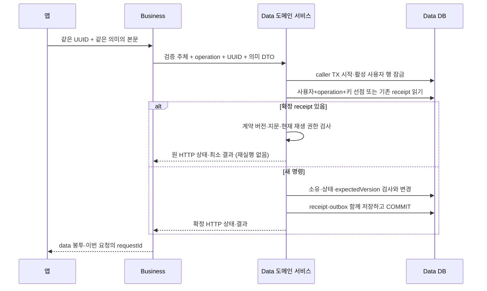
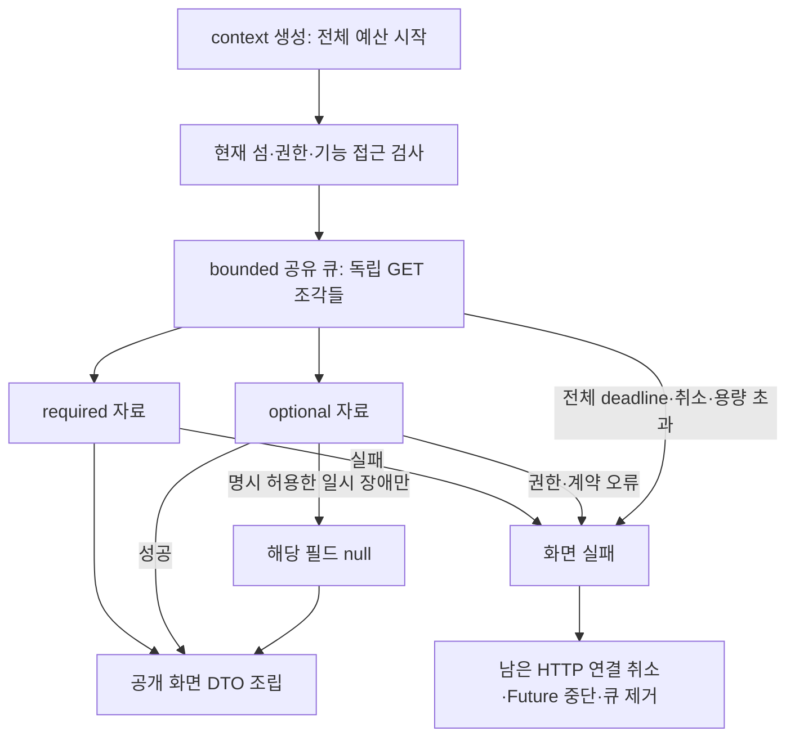
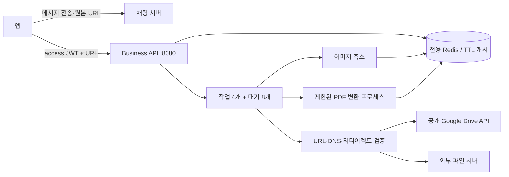
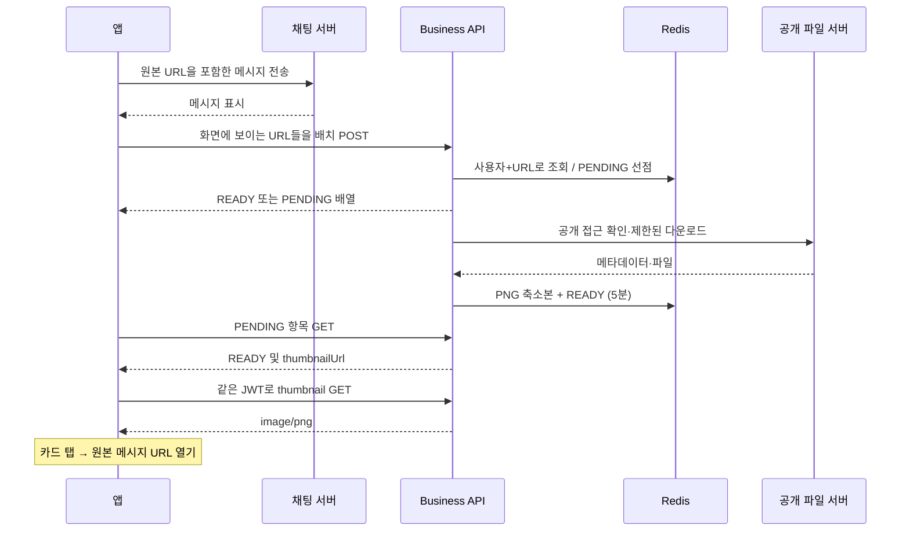

# Business API (`server/business-api`)

앱이 들어오는 유일한 표면이자 코어·위성 조합의 주체다(목표 아키텍처 §2 · A22 ㊫).

**기존 기능은 두 가지다.** ① 링크·알림 위성을 조합하는 외부 경로와 이관 정지 창의 구·신 조합(GROMO-1659),
② 채팅에 공유한 공개 파일 링크의 미리보기 생성(GROMO-1747). 둘은 같은 프로세스·같은 보안 경계 위에
있고 서로의 저장소·상류를 건드리지 않는다 — 조합 API 는 상류 HTTP 만, 미리보기는 전용 Redis 만 쓴다.

> **이것은 최소 구현이다.** 1661 의 전체 BFF/IdP 이전과 구분한다 — 여기 있는 것은 「링크·알림 위성을
> 조합해야만 성립하는 기존 외부 경로」와 「이관 정지 창의 구·신 조합」뿐이다. 인증 발급(AT 서명 ·
> refresh 회전 · logout · 최초 로그인 RT 2단계 · 소셜 선택적 인증)과 그 밖의 패스스루는 **아직 Data
> API 에 남아 있다.** 전환 기간에 이 서비스는 legacy issuer 가 서명한 AT 를 **검증만** 한다.

## 새 공통 계층을 처음 읽는 개발자에게 (GROMO-1751~1753)

앱이 주문서를 내면 Business는 신원을 확인하고 답장을 같은 봉투에 넣는다. Data는 주문서 번호와
처리 결과를 함께 보관한다. 답장이 유실돼 같은 번호로 다시 와도 같은 주문을 두 번 처리하지 않는다.
여러 서버의 자료가 필요한 화면은 Business가 자료를 모으되, 정해진 시간이 끝나면 기다리던 연결도 닫는다.



현재 구현은 **새 응답 봉투·키/버전/커서 도구·Data 명령 결과 저장 포트·상류 HTTP/화면 조합기**다.
새 `/link-previews` 별칭은 연결되어 있다. 계정·섬·집중·상점 등 66개 도메인 계약과 13개 화면
엔드포인트가 모두 구현되거나 활성화된 상태는 아니다. 아래 예시는 후속 도메인이 기반에 연결하는 방법이다.
Business에는 도메인 DB를 추가하지 않는다.

### 1. 새 JSON 봉투를 사용하는 경로

[PublicApiRoutes](src/main/java/com/oneorthree/business/common/api/PublicApiRoutes.java)는 아래 루트와
하위 경로의 **응답 직렬화**를 선택한다. 이 목록을 추가해도 컨트롤러나 무인증 경로가 생기지 않는다.

| 루트 | 적용 범위 |
| --- | --- |
| `/auth/sessions`, `/me`, `/islands`, `/focus-sessions`, `/invitations` | 후속 계정·도메인 API |
| `/rankings`, `/statistics`, `/screens` | 랭킹·통계·화면 집계. 통계 두 경로 `/statistics/focus`, `/statistics/screen-time` 포함 |
| `/link-previews` | 연결된 미리보기 POST·GET. `/link-previews/{id}/thumbnail`은 PNG 그대로 |

신규 JSON 성공은 `{"data": ...}`다. 컨트롤러는 공개 DTO를 반환하면 된다.
[ApiResponseAdvice](src/main/java/com/oneorthree/business/common/api/ApiResponseAdvice.java)가 한 번 감싸며,
이미 `ApiSuccess`인 값은 다시 감싸지 않는다. 문자열도 JSON data 문자열로, 빈 결과도 `data:null`로
반환한다. 신규 빈 204는 200 `data:null`로 통일하며 생성 결과의 201은 유지한다.
바이너리·리소스·스트리밍 응답은 JSON 봉투로 바꾸지 않는다.

```json
{
  "error": {
    "code": "VERSION_CONFLICT",
    "message": "최신 상태를 확인한 뒤 다시 요청해 주세요.",
    "field": "expectedVersion",
    "retryable": false
  },
  "requestId": "9c777da0-a3c6-4fd9-9f06-287b4ca31b36",
  "current": {"version": 4, "resource": {"playing": false}}
}
```

위 message/resource는 설명용 예시다. 오류 코드는 [ApiErrorCode](src/main/java/com/oneorthree/business/common/api/ApiErrorCode.java)를 사용한다.
`error`의 4필드는 항상 있고 `field`가 없으면 null이다. `current`는 409에서만 선택적으로 붙인다.
`new PublicApiException(code, field, new PublicCurrentState(version, publicDto))`를 쓸 때 호출부가
**현재 사용자에게 공개 가능한 DTO와 version을 같은 스냅샷에서 읽어** 전달해야 한다.
wrapper가 임의 JSON의 공개 권한을 검증해 주지는 않는다. 내부 DB 행이나 상류의 임의 `current`를 그대로 넣지 않는다.

필터의 401·413과 MVC의 404·405·415도 같은 오류 serializer를 사용한다.
지원할 수 없는 Accept는 기존 규약대로406과 빈 본문이며 X-Request-Id는 유지한다.
404는 본인 계정 USER_NOT_FOUND, 없는 경로 RESOURCE_NOT_FOUND, 상품 PRODUCT_NOT_FOUND를 구분한다.
기존 preview NOT_FOUND는 호환 계약으로 남긴다. 본문은 Content-Length 선언과
실제 읽은 스트림 양 모두 256KiB를 제한한다. `requestId`는 서버가 요청마다 만들며 오류 본문과
`X-Request-Id`가 같다. 외부 `X-User-Id`는 모든 헤더 접근자에서 제거하고 `@LoginUser`의 검증 주체를 쓴다.
`/auth/sessions`의 무인증 로그인은 아직 열지 않았다.

기존 `/api/v1/**`, `/l/match`, 내부·관리 경로의 기존 응답 형식은 유지한다.
`/api/v1/link-previews`는 기존 DTO/thumbnailUrl을, `/link-previews`는 data 봉투와 새 thumbnailUrl을 반환한다.
`FAILED` 미리보기 항목은 정상 200 응답의 data에 남는다. 미리보기 실패가 채팅 전송 실패라는 뜻은 아니다.

### 2. 키와 버전을 검증한 뒤 Data에서 한 번만 확정하기

[CommandKeys](src/main/java/com/oneorthree/business/common/request/CommandKeys.java)의 `required(request)`는
키 필수로 설계된 명령에서만 호출한다. 앱은 UUID 36자를 만들고 재시도에 보존한다. v4/v7 생성은 권고이며
입력을 두 버전으로 제한하는 정책은 아니다. UUID 대소문자는 동일한 값이다. 키 누락·잘못된 형식·중복 헤더는
400 `INVALID_IDEMPOTENCY_KEY`이고 서버가 새 키를 대신 만들지 않는다. 내부 단계가 필요하면
`CommandKeys.forSteps(key).forStep("link-claim")`처럼 기존 접미 규약을 재사용한다.
로그인·메시지 clientMessageId·조회성 preview POST에는 이 규칙을 일괄 적용하지 않는다.

버전 입력은 JSON 타입 검사 **후** 정수로 변환한다. Jackson이 `1.5`를 `Long`의 `1`로 바꾼 뒤
검사하면 원래 입력이 잘못됐다는 사실을 잃는다. 신규 DTO의 version 필드는 `JsonNode`로 받고 다음처럼 연결한다.
Business는 `tools.jackson.databind.JsonNode`, Data는 `com.fasterxml.jackson.databind.JsonNode`를 사용한다.

```java
record VersionInput(tools.jackson.databind.JsonNode expectedVersion) { }
long expected = ResourceVersions.fromJson(input.expectedVersion(), "expectedVersion");
```

`fromJson`은 소수·문자열·null을 400으로, 음수와 `9007199254740991` 초과를 422로 거절한다.
`required(Long, field)`는 이미 엄격하게 변환한 값의 범위 검사다. 실제 비교·갱신은 Data의 자원 잠금 아래에서 한다.
성공 receipt를 재생할 때 원래의 낡은 expectedVersion을 다시 검사하지 않는다.
[SemanticFingerprint](src/main/java/com/oneorthree/business/common/request/SemanticFingerprint.java)는 검증한 DTO의
객체 키 순서·숫자 표기를 정규화하되 배열 순서·문자열 공백·null/누락을 구분한다.
기본값 등 도메인 의미의 정규화는 호출부가 먼저 하고, Authorization·requestId·현재 DB 상태를 섞지 않는다.



Data의 [PublicCommandService](../data-api/src/main/java/com/oneorthree/phone/outbox/service/PublicCommandService.java)는
`run(request, activeAuthorization, replayAuthorization, command)`를 제공한다.
호출하는 Data 서비스에 `@Transactional`이 있어야 한다. 포트는 `MANDATORY`여서 TX 밖에서 부르면 실패한다.

| 인자/결과 | 도메인 호출부의 의무 |
| --- | --- |
| `PublicCommandRequest(userId, operation, key, semanticRequest)` | 신뢰된 주체를 사용하고 operation에 HTTP 의미와 실제 경로 자원 ID를 포함. 대상 섬이 다르면 다른 scope다. body는 검증·정규화한 JSON 객체 |
| `activeAuthorization` | 실제 활성 사용자 검사와 필요한 행 잠금을 구현하고 TX 끝까지 유지. 빈 콜백 사용 금지. 선점 대기 뒤에도 다시 호출될 수 있다 |
| `replayAuthorization` | 현재 결과 열람 권한 검사. receipt가 있다는 이유로 탈퇴·추방·관리 권한 소멸을 무시하지 않는다 |
| `command` | 신규 실행에만 호출. 같은 TX/자원 잠금 아래 버전·권한·상태 확인, 도메인 변경, outbox 작성, `PublicCommandResult(200 또는 201, data, events배열)` 반환 |
| `IdempotentOutcome<PublicCommandReceipt>` | 내부 저장 결과다. 승인된 공개 DTO로 매핑하며 `replayed`를 보고 이벤트를 재발행하지 않는다 |

같은 사용자·operation·키에 다른 본문이면 409다. 사용자나 실제 대상 자원이 다르면 다른 명령이다.
Data가 자체 `PublicCommandFingerprint`로 저장 지문을 계산하므로 Business 지문 문자열을 그 값으로 대입하지 않는다.
명령 실패는 receipt/outbox와 함께 롤백한다. 초기 `contractVersion=1`이고 미지원 저장 버전은
`PUBLIC_COMMAND_CONTRACT_UNSUPPORTED`로 거절하며 신규 외부 응답은 409 `STATE_CONFLICT`가 된다.
자동 receipt TTL/GC는 없다. 보존·개인정보 파기는 후속 정책과 함께 변경한다.

비활성 계정은 일반 재생을 거절한다. 활성 본인의 leave/host-transfer 때문에 자원 권한만 사라진 경우는
해당 도메인이 명시한 비민감 최소 완료 증거만 제한 재생할 수 있다. 도메인 권한 콜백과 공개 매퍼가 이를
구현해야 하며, 공통 포트가 저장 응답을 자동으로 안전하게 축소해 주지는 않는다.

### 3. 목록 커서와 서명키

[SignedCursorCodec](src/main/java/com/oneorthree/business/common/request/SignedCursorCodec.java)에
`CursorScope(verifiedUserId, resource, normalizedFilters, sort, limit)`과
`CursorBoundary(sortKey, tieBreaker)`를 전달한다. resource에는 실제 목록 대상 ID를 포함하고
필터·정렬·limit을 검증·정규화한다. limit은 1~100이며 범위를 벗어나면 422다.

`encode(scope, boundary)`로 nextCursor를 만들고 `decode(cursor, scope)`로 다음 읽기 경계를 복원한다.
끝 페이지는 nextCursor를 null로 반환한다. 입력 cursor가 null이면 첫 페이지이며, 빈 문자열·변조·다른 scope는
400 `INVALID_CURSOR`, 만료는 409 `CURSOR_EXPIRED`다. 커서는 현재 접근 권한을 대체하지 않는다.
서명은 암호화가 아니므로 boundary에 검색어·개인정보를 넣지 않는다. 정렬 동률을 풀 키도 반드시 포함한다.

커서 빈은 기본 비활성이다. 후속 목록을 연결할 때 외부 설정 파일에 다음처럼 주입한다.
아래 환경변수 이름은 이 예시의 placeholder이며 저장소가 자동 생성해 주는 시크릿은 아니다.

```yaml
business:
  cursor:
    enabled: true
    active-key: k2
    keys:
      k1: ${CURSOR_KEY_K1_BASE64}
      k2: ${CURSOR_KEY_K2_BASE64}
```

키마다 별도로 생성한 최소 32바이트를 표준 Base64로 인코딩한다. JWT 키와 공유하지 않는다.
활성 key ID는 keys에 있어야 하고 ID는 영숫자·밑줄·하이픈 1~32자다. 잘못된 키 설정은 활성화 시 부팅을 실패시킨다.
현재 `CursorConfig`의 TTL은 **15분 고정**이며 설정 프로퍼티로 노출하지 않았다.
회전은 모든 인스턴스에 k2 검증키 배포 → active-key를 k2로 전환 → 마지막 k1 발급 뒤 15분 이상 유지 → k1 제거 순서다.
이전 키를 너무 일찍 제거하면 아직 유효한 커서도 400이 된다. 목록은 keyset 조회 경계이며 여러 페이지 전체의
DB snapshot을 보장하지 않는다.

### 4. 화면 자료를 제한된 시간 안에 모으기

[ScreenComposer](src/main/java/com/oneorthree/business/common/http/ScreenComposer.java)는 JVM 공유 실행기를 쓴다.
먼저 `composer.start(serverRequestId, verifiedSubject)`로 context를 만들고, 현재 섬·권한을 조회하는 선행 단계부터
`context.deadline()`을 사용한다. 그 결과를 확정한 뒤 서로 독립인 읽기만 `compose(context, fragments)`로 보낸다.
각 조각에는 동일 context를 전달한다. 별도 deadline을 만들면 기존 facade 호환 호출에서도 거절한다.



조각은 `ReadFragment<T>(name, required, responseType, allowedFailures, read)`다.
필수 조각은 `allowedFailures=Set.of()`로 만들고 모든 실패를 화면 실패로 전달한다.
선택 조각도 `Set.of(UNAVAILABLE, TIMEOUT)`처럼 허용한 일시 실패만 null로 축소한다.
403/404·상류 자격 오류·DTO 계약 오류·실행 큐 포화는 optional이어도 숨기지 않는다.
전체 deadline 소진이나 부모 취소는 optional null보다 우선한다. 반환 Map을 도메인의 화면 DTO로 명시 매핑한다.
`responseType`은 조각 선언 정보이므로 read 콜백의 실제 typed HTTP 호출에도 정확한 타입을 전달해야 한다.

읽기 콜백 안에서는 승인된 facade 또는 `InternalHttpClient.exchange(call, context, type)`를 사용한다.
화면 조각 context는 GET만 허용하므로 여기서 POST/PUT/PATCH/DELETE를 호출하지 않는다.
상류 요청 경로는 코드에 선언하고 검증한 주체를 `onBehalfOf`로 전달한다. 앱의 URL·헤더를 통째로 전달하지 않는다.
서비스별 토큰·HTTP 풀은 분리되어 있고 requestId는 재시도에도 유지한다.
GET과 명시적 `idempotentCommand()`만 재시도하며 기본 **최대 2회는 최초 호출을 포함한 총 시도 수**다.
429는 도메인 제한으로 전달하고 재시도하지 않는다. 5xx·전송 실패는 예산 내에서 재시도하며,
Retry-After가 남은 전체 예산보다 길면 새 시도를 하지 않고 timeout으로 끝낸다.

신규 외부 응답은 시간 초과 504 `UPSTREAM_TIMEOUT`, 용량 초과·일시 장애 503 `SERVICE_UNAVAILABLE`,
상류 계약 오류 502 `UPSTREAM_CONTRACT_ERROR`, 서비스 자격 오류 502 `UPSTREAM_AUTH_FAILED`다.
legacy 경로의 시간 초과는 기존 503을 유지한다. 취소는 실제 HTTP 요청도 닫으며,
상위 코드가 조기 종료할 때는 `context.cancel()`로 취소를 전파한다.
Servlet의 모든 클라이언트 연결 종료를 자동 감지해 이 context를 취소하는 기능까지 구현한 것은 아니다.

| 설정 | 기본값/의미 |
| --- | --- |
| `business.upstream.composition.pool-size` | 4, JVM 화면 조합 worker 수 |
| `business.upstream.composition.queue-capacity` | 64, 화면 조합 대기열 |
| `business.upstream.composition.deadline` | 3s, 선행 context 조회부터 조합 종료까지 |
| `business.upstream.{data,notification,link}.base-url` / `.service-token` | 기본값 없음, 프로파일별 명시 주입 |
| 각 대상의 `.connect-timeout` / `.read-timeout` | 500ms / 1500ms |
| 각 대상의 `.max-attempts` / `.retry-delay` | 총 2회 / 50ms, 유효 Retry-After가 있으면 그 대기 적용 |
| 각 대상의 `.max-connections` / `.queue-capacity` | 4 / 64, 대상별 HTTP 연결·worker와 대기열 |
| 각 대상의 `.failure-threshold` / `.open-duration` | 연속 5회 / 10s, 대상별 circuit breaker |
| `business.cursor.enabled` | 미설정 시 비활성 |
| `business.cursor.active-key` / `.keys` | 기본 서명키 없음, 활성화 시 독립 키 필수 |

위 용량은 초기 안전 상한이며 운영 처리량/SLO 보장값은 아니다.
대상별 HTTP worker 셋과 조합 worker의 **합계는 16 이하**로 기동 시 검증한다. 환경 설정으로 한 대상만
늘려도 총합을 넘으면 부팅을 거절한다. 서비스/관리 Tomcat worker는 각각 최대16으로 제한해 합계32이며,
preview/DNS8 외에 JVM·Redis·PDF 자식 프로세스가 사용할 PID 여유를 남긴다. Compose의 PID128 상한을
올리지 않으며, 운영 모니터링·부하 검증을 대신하는 처리량 보장은 아니다.
신규 동기 요청은 상류의 정상 `504 UPSTREAM_TIMEOUT` 응답을 제한 재시도한 뒤에도 504로 반환한다.
503 장애와 시간 초과의 종류를 합치지 않고, legacy 오류 매핑과 선택 조각의 허용된 null 폴백은 유지한다.
HTTP 응답 본문은 시도당 1MiB로 제한하고 초과는 계약 오류로 처리한다.
`upstream_retry`, `screen_optional_unavailable` 로그는 서버 request_id로 연결한다.
토큰·원문 URL·본문·cursor를 로그에 추가하지 않는다.

개발 검증의 출발점은 `PublicApiContractTest`(실제 필터/MVC), `RequestContractsTest`,
`SignedCursorCodecTest`, Data의 `PublicCommandIntegrationTest`(실제 PostgreSQL 경합·롤백)다.
권한 콜백이 있다는 테스트가 실제 사용자/자원 잠금 검증을 대신하지 않으므로 새 도메인은 해당 경합을 따로 검증한다.
이 절은 실행 결과 보고가 아니며 전체 빌드 명령과 실행 환경은 아래 기존 절을 따른다.

## 없는 것이 계약이다

| 없는 것 | 왜 |
| --- | --- |
| 도메인 DB · 트랜잭션 | §2 「안 하는 일」. `build.gradle` 에 JPA·Flyway 의존성 자체를 넣지 않아, 나중에 누가 도메인 저장소를 붙이려 하면 빌드 파일에서 먼저 걸린다 |
| 크론(`@Scheduled`) | §6. 재개가 필요한 단 하나의 동작(claim 의도)은 **운영자가 실행하는 일회성 CLI** 로 두어 스케줄을 런북에 남겼다 |
| FCM 발송 경로 | 신 서버의 모든 발송은 공통 `dispatch_enabled` 게이트 뒤에서만 일어난다(A22 ㋭). **발송 경로가 없는 것이 그 게이트를 지키는 방법**이다 |
| 링크 `confirm`·`revoke`·`withdraw` 호출 | claim 확정 전달은 Data 의 락 아래 outbox + relay 가 한다(A22 ㋟). Business 가 응답을 받은 뒤 보내면 그때는 이미 락이 풀려 그 사이 revoke 가 끼어든다. 있으면 누가 그 경로를 쓴다 |
| 범용 프록시 | 인바운드 헤더를 복사할 통로가 없다. `InternalCall` 이 `Authorization`·`X-User-Id` 를 거부하고, 경로는 각 클라이언트의 상수뿐이다 |

> **⚠️ 「저장소가 없다」가 아니다.** 이 서비스에는 **미리보기 전용 Redis 가 있다** — A19 네임스페이스 표의
> `cache:business:*` 소유자다. 그것이 위 계약과 함께 성립하는 이유는 **사본이기 때문**이다: 정본이 없고,
> 비워도 다음 요청이 다시 만들며, 어떤 도메인 판정도 거기에 의존하지 않는다(담기는 것은 미리보기
> 메타데이터와 축소 PNG 뿐이다). 도메인 상태를 여기 얹는 순간 그 구분이 무너진다.
>
> A19 및 A22 ㋺에 따라 `business` ACL 사용자는 `cache:business:*`와 캐시 명령만 사용한다.
> `default` 사용자는 비활성화되며, Redis는 내부 `business-cache` 네트워크에서만 접근한다.
> `BUSINESS_REDIS_PASSWORD`는 Business 전용 env에, 해시된 ACL은 별도 파일에 주입한다.

## 보안 경계 — 필터 두 장

요청은 **봉투 → 인증 → 컨트롤러** 순으로 지난다. 순서가 곧 계약이다.

| 순서 | 필터 | 범위 | 하는 일 |
| --- | --- | --- | --- |
| 0 | `RequestEnvelopeFilter` | `/*` (공개 경로 포함) | `X-Request-Id` · `Cache-Control: no-store` · 본문 **256KiB** 상한(초과 시 413) |
| 1 | `AccessTokenFilter` | `/*` — `PUBLIC_PATHS` 정확 일치만 통과 | AT 검증 · 외부 `X-User-Id` 폐기 · 신원을 요청 속성으로만 흘림 |

1. **AT 검증** — 서명 · **`exp` 존재 + 미경과** · `type=access` · **subject 존재 + UUID**. refresh 는
   서명이 맞아도 거절한다(같은 키로 서명되므로 서명 검증만으로는 구분되지 않고, 수명 30일 RT 로 위성
   쓰기에 닿으면 AT 1시간 만료 정책이 통째로 무력화된다). **`exp` 와 `sub` 는 JWT 스펙상 선택 필드라
   파서가 통과시킨다** — 막지 않으면 전자는 영구 유효 AT 가 되고, 후자는 `UUID.fromString(null)` 의
   NPE 가 401 이 아니라 500 으로 샌다.
2. **외부 `X-User-Id` 폐기 후 재설정**(A22 ㉸) — Data 가 `JwtFilter` 를 떼고 이 헤더를 신뢰하게 되므로,
   앱 헤더가 새어 들어가면 정상 AT 를 가진 사용자가 **남의 데이터를 읽고 쓴다**. 필터 통과 후로는
   인바운드 헤더에서 온 사용자 신원이 존재하지 않는다.

**경로 선택은 「전부 막고 열거한 것만 연다」.** 접두어로 인증 대상을 고르면(예: `/api/` 로 시작할 때만)
우회가 된다 — MVC 는 경로를 디코딩하고 matrix parameter 를 제거하므로 `/%61pi/v1/...` 와
`/api;v=1/v1/...` 가 **같은 컨트롤러로 라우팅되면서 접두어 검사에는 걸리지 않는다**. 그래서 필터를
`/*` 에 걸고 `getRequestURI()`(디코딩 전 원문) **정확 일치**로만 예외를 연다.

무인증으로 열린 것은 셋뿐이다.

| 경로 | 왜 열려 있나 |
| --- | --- |
| `GET /health` | 컨테이너 헬스체크. 관리 포트 9091 을 호스트에 publish 하지 않으므로 서비스 포트에 정보를 담지 않는 최소 응답 하나를 둔다 |
| `POST /l/match` | 정지 창의 구 앱 deferred 매치. 거기 닿는 사람은 아직 우리 유저가 아니다(설치 직후 첫 실행) — 인증을 붙이면 구 앱의 매치가 전멸한다 |
| `/actuator/*` 6종 | 포트 9091 로 격리돼 있다. 서비스 포트로 불렸을 때 **401 이 아니라 404** 여야 포트 격리가 라우팅 문제를 가리지 않는다 |

**본문 상한이 인증보다 앞인 이유**: 상한을 인증 필터 안에 두면 위 공개 경로들이 **상한 없이** 노출된다.
`/l/match` 는 정지 창 동안 구 앱 전체가 두드리는 외부 진입점이라 오히려 더 필요하다.

`gen` claim 은 **없으면 없는 채로 흘린다.** 구 AT 에는 `gen` 이 없는데(현 `JwtProvider` 는 `type`·`guest`
만 싣는다) Data 의 현재 세대로 채우면 로그아웃 전에 발급된 옛 AT 가 최신 세대로 태깅돼 **기기 토큰
tombstone 을 우회**한다(A22 ㊍).

## 외부 경로 (기존 URI·성공상태·오류코드 보존)

| Method · Path | 조합 | 성공 |
| --- | --- | --- |
| `POST /api/v1/groups/{groupId}/invite-link` | 활성검사 → Data 발급컨텍스트 → Link 발급 | 200 `{slug, url}` |
| `POST /api/v1/invite-links/claim` | 활성검사 → Data 내구적재 → Link 잠정claim → Data 확정 | 200 (정지 창엔 202) |
| `PUT /api/v1/users/me/device-token` | 활성검사 → (bootstrap 시) Data 세션확인 → Noti 등록 | 200 `{ownershipToken}` |
| `DELETE /api/v1/users/me/device-token` | Data outbox **먼저** → Noti 직접삭제 → 완료표시 | 204 |
| `PUT /api/v1/users/me/notification-settings` | 활성검사 → Data 내구명령 → Noti 적용(version) | 204 |
| `GET /api/v1/users/me/notification-settings` | Noti **정본** 조회 | 200 5필드 |
| `POST /api/v1/me/challenge-results/{sessionId}/claim` | Data 단독 (재시도 없음) | 200 |
| `POST /api/v1/me/challenge-results/{sessionId}/ack` | Noti prepare → Data ack → Noti commit | 200 |
| `POST /l/match` | **한시**, 무인증. 구 후보 조회 + Neon 소진 | 200 `{matched…}` |

`GET /me/challenge-results` 같은 순수 Data 읽기는 **여기 오지 않는다** — 위성 조합이 필요하지 않아
1661 의 전체 전환 때 함께 옮긴다. 최소 Business 의 범위를 넓히지 않는다.

## 실패 분류 — 「아니오」로 접지 않는다

| 상류 응답 | 결과 | 왜 |
| --- | --- | --- |
| `code` 실린 4xx(401 제외) | **legacy 경로는 그대로 중계** | 앱이 `GROUP_NOT_FOUND`·`RESULT_CLAIM_HELD` 같은 문자열로 분기한다. 재해석하면 그 분기가 조용히 빠진다 |
| 모든 내부 401 · `code` 없는 403 | 502 | **우리** 서비스 토큰 문제다. 401 을 주면 정상 세션이 전부 재로그인으로 튄다 |
| `code` 없는 그 밖 4xx | 502 | 배선·계약 어긋남. 400 으로 접으면 「잘못된 요청」으로 숨는다 |
| 5xx · 타임아웃 · 서킷 | 503 | 「모른다」다. 정상 응답으로 접으면 되돌릴 수 없는 `matched:false` 나 토큰 영구 유실이 된다 |

## 재시도 · 멱등

재시도 대상은 **멱등 GET + 명시적으로 멱등을 선언한 명령**뿐이다(§4). GET 만 재시도하면 로그아웃의
기기 토큰 삭제가 일시 오류 한 번에 영구 실패하고, 앱은 그 실패를 삼키고 로컬 토큰을 지워 사용자가
재시도할 방법이 없다. 결과 선점·ack 는 조건부 원자 UPDATE 라 **재시도하지 않는다**.

`Idempotency-Key` 는 **앱이 소유**한다(A22 ㉼). 공개 입력은 150자 이내이며 초과는 상류 호출 전 400으로 거부한다. Business 는 그 값에 단계별 접미(`:<step>`)를 붙여
파생하고, **재시도에서 같은 값을 유지**한다. 구 앱은 키를 안 보내므로 매 호출 새 키가 되고, 그 기간엔
「Business 내부 재시도만 보호」로 인정한다. **요청 본문 해시를 영구 멱등키로 쓰지 않는다**(A22 ㊞).

시간 예산은 **재시도까지 합친 전체**다 — 구 앱 match 5초(`deferredInvite.ts:100`), claim 15초
(`api.ts:215-218`). 예산을 넘긴 재시도는 앱이 이미 끊은 뒤에 성공한다.

## 초기 조합 API 점검 당시의 통합 의존성 (과거 기록)

> 아래는 main `69d05f873` 시점의 점검 기록이다. 현재 브랜치의 구현 건수를 뜻하지 않는다.
> 현재 통합·배포 여부는 각 제공자의 코드와 배포 설정을 대조해야 하며 mock 성공만으로 판단하지 않는다.

### Data API — `/internal/*` 컨트롤러 **0건**
실제 확인: `grep -rn "/internal" server/data-api/src/main/java` → 0건 (main `69d05f873`).
필요한 15개 경로는 `docs/contracts/business-satellite-api.yaml` 에 스키마·상태·멱등까지 정의했다.
가장 놓치기 쉬운 것들:
- `activation` 응답에 **`authGeneration` 을 담지 말 것** — 담으면 AT 의 빈 `gen` 을 채우려는 유혹이
  생기고 그게 tombstone 우회다(㊍).
- `invite-issue-context` 의 `membershipEpoch` 와 `linkVersion` 은 **발급 경로에서 같은 값**이어야 한다
  (링크가 `ISSUE_EPOCH_MISMATCH` 400 을 준다). 갈리는 것은 폐기뿐이다.
- `claim-intents` 조회는 **원래 `idempotencyKey` 를 저장해 돌려줘야** 한다. 재개 CLI 가 새 키를 만들면
  클릭을 하나 더 소진한다. 그리고 **`pendingTotal`**(인플라이트 포함 전체 미완료)을 줘야 한다 —
  「빈 페이지 = 전부 완료」로 접으면 미완료를 남긴 채 절차가 넘어간다.
- `claim-intents/{id}/lease` 는 **`leaseToken` 을 발급**하고 `.../completed` 는 그것으로 **CAS** 해야
  한다. 없으면 임대 만료 뒤 깨어난 옛 작업자가 새 임대의 작업을 완료로 뺀다. 그리고 **확정이 의도를
  닫을 때 그 리스의 토큰을 완료 토큰으로 물려받아야** 한다 — `null` 로 닫으면 확정을 몰고 온 그
  실행자의 완료 보고가 409 가 되어 성공한 재개가 실패로 세어진다.
- `claim-intents/{id}/abandoned` 는 **`claimId=null`(셀프 초대·붙일 클릭 없음)의 의도를 닫는 유일한
  손**이다. 확정이 없으면 Data 도 큐를 닫아 주지 못하므로, 이 경로가 없으면 정상 처리된 claim 이
  `pendingTotal` 에 영구히 남는다. `outbox-commands/{id}/delivered` 로는 닫히지 않는다(그쪽은 봉투
  `eventId` 로 알림 전달을 닫는 경로라 의도 id 는 **항상 404**).
- 커서는 **시각이 아니라 commit sequence** — 시각 커서는 늦게 커밋된 행을 영구히 건너뛴다(㋖).
- `DurableCommandAck.version` 은 **aggregate 행 잠금 아래** 발급(㊸).

### 알림 서버 — 구현 중 (N 담당)
`/internal/devices`(POST·DELETE) · `/internal/users/{id}/notification-settings`(GET·PUT) ·
`result-ack/{prepare,commit,abort}`. 그리고 **알림 → Data 의
`GET /internal/users/{id}/result-ack`** 이 반드시 있어야 한다 — 없으면 「롤백 직후 프로세스가 죽는
구간」에서 abort 행이 안 생겨 **영구 억제가 실재**한다(A22 ⓓ).

### 링크 서버 — 구현 중 (coordinator 직접)
`link/src/lib/{links,migration}.ts` 를 읽어 맞췄다: `POST /internal/links` ·
`POST /internal/links/{slug}/claim` · `POST /internal/links/match`. **확정 OpenAPI 가 나오면 다시
대조해야 한다.**

## 이관 정지 창 (§7.2)

기본값이 전부 **꺼짐**이다. 컷오버 후 제거가 계약이므로(A22 ㊫) 켜진 채 배포되면 라우팅이 바뀐 뒤에도
구 경로가 남아 이중 소진 위험이 생긴다.

```
COMPAT_MATCH_HANDLER_ENABLED=false   # 한시 /l/match
COMPAT_IMPORT_CONTRACT_READY=false   # 구 후보 → Neon 이관 계약 준비 여부
BUSINESS_COMPAT_CLAIM_QUEUE_REPLAY_ENABLED=false  # 202 허용 여부
```

**소진은 Neon 한 곳에서만**(A22 ㊥). 매치는 읽기가 아니라 쓰기라, 양쪽에서 소진하면 잠금이 공유되지
않아 **같은 클릭이 두 기기에 배정**된다. `IMPORT_CONTRACT_READY=false` 인 동안은 구 후보를 조회해
**세기만** 하고, 요청에 `migrationId` 를 **싣지 않는다** — 링크 서버는 그 필드가 있으면 import 모드로
들어가 `openRun` 을 요구하므로 `IMPORT_CLOSED` 이후엔 빈 배열을 보내도 503 이 된다.

### claim 의도 재개 CLI

`202` 는 「나중에 누가 끝낸다」는 약속인데, 그 주체가 될 수 있는 것이 셋 다 막혀 있다 — Business 에
크론을 넣으면 §6 이 깨지고, Data 는 링크를 relay 허용목록 밖으로 부를 수 없고(§3), 링크는 코어를 부를
수 없다. 그래서 **같은 이미지를 일회성 job 으로 띄운다**:

```bash
docker run --rm --env-file business.env \
  -e BUSINESS_CLAIM_REPLAY_ENABLED=true \
  "$BUSINESS_API_IMAGE"
```

원래 `Idempotency-Key` 로 재생한다(새 키를 만들면 링크의 멱등 저장이 «새 명령»으로 보아 **클릭을
하나 더 소진**한다).

**lease 는 `leaseToken` 으로 CAS 한다.** `leased`/만료시각만으로는 안 닫힌다 — 임대가 만료된 뒤 깨어난
옛 작업자가 **「새 임대 소유자의 작업」을 완료 표시**해, 확정되지 않은 claim 이 큐에서 사라지고 귀속이
조용히 유실된다. 기기 토큰 소유권의 `ownershipToken`(A22 ㊚)과 같은 패턴이다: 서버 상태만 보면
「지연된 옛 요청」과 「정상적인 새 요청」을 구별할 수 없으므로 **값을 요청에도 실어야** 순서를 가른다.
토큰이 오지 않으면 CLI 는 완료 표시하지 않고 실패로 센다.

**「미완료 0」은 빈 페이지가 아니다.** 한 순회의 빈 목록은 「지금 집을 것이 없다」는 뜻일 뿐이고,
다른 작업자의 lease·재시도 예정·커서가 지난 뒤 적재된 행이 남아 있다. 그래서 ⓐ 진행이 있는 동안
**커서를 처음부터 다시** 순회하고 ⓑ gate 는 `pendingTotal`(인플라이트 포함 전체 미완료)로 판정한다.
CLI 는 **실패가 남았을 때와 `pendingTotal` 이 남았을 때 모두 비정상 종료**한다 — 어느 쪽이든 삼키면
미완료를 남긴 채 §7.2 가 다음 단계로 넘어간다. 미완료 0 을 확인한 뒤에만
`BUSINESS_COMPAT_CLAIM_QUEUE_REPLAY_ENABLED` 를 끈다.

**서빙 컨테이너에는 `BUSINESS_CLAIM_REPLAY_ENABLED` 를 절대 넣지 않는다.**

## 실행 · 검증

```bash
export JAVA_HOME=/Users/jojaeyoung/Library/Java/JavaVirtualMachines/corretto-17.0.10/Contents/Home
./gradlew build   # 테스트 + checkstyleMain + spotbugsMain
```

**한 번에 두 기능을 검증한다.** `SPRING_PROFILES_ACTIVE` 를 밖에서 주지 않는다 — 프로파일은 각 테스트가
`@ActiveProfiles("ci")` 로 선언한다(미리보기 테스트도 마찬가지다: 한 컨텍스트에 상류 클라이언트 셋이
함께 뜨고 그 생성자는 base-url·service-token 이 비면 부팅에서 던지므로, ci 프로파일의 더미 값이 필요하다).

| 축 | 방식 |
| --- | --- |
| 조합 API | **실제 필터 체인 + 실제 컨트롤러 + 실제 클라이언트**, 상류만 JDK 내장 `HttpServer`(`MockUpstream`). 클라이언트를 모킹하면 계약 대부분(어떤 헤더가 나가는가, 재시도에서 유지되는가, 상태별로 실패가 어떻게 갈라지는가)이 검증 대상에서 빠진다 |
| 미리보기 | **실제 Redis**(Testcontainers `redis:7-alpine`) + 실제 필터 체인. 수집기(`PreviewResolver`)만 대체해 외부 네트워크를 끊는다. Lua 스크립트·TTL·세대 교체는 스텁으로 볼 수 없다 |
| 보안 경계 | 두 축이 공유한다 — 인증 우회 경로(percent encoding · matrix parameter), 공개 경로 도달, 본문 상한, 봉투 헤더 |

**필요한 로컬 도구**: JDK 17, Docker(Testcontainers), Poppler(`pdftoppm`). Linux 는 `util-linux`(`prlimit`)도
필요하다 — 없으면 PDF 썸네일 테스트가 실패한다. CI 는 그 도구가 설치된 컨테이너 안에서 gradle 을 돌린다.

포트: 서비스 8080(`SERVER_PORT`), 관리 9091. **9091 은 호스트에 publish 하지 않는다** — 포트 격리가
`/actuator/*` 를 사설로 유지하는 유일한 수단이다. compose 헬스체크용으로 서비스 포트에 정보를 담지 않는
`GET /health` 하나를 둔다.

## 실행한 원시 검사 결과 (2026-09-11, **미리보기 통합 전**)

> ⚠️ 아래 수치는 `server/business-api` 에 미리보기(1747)를 합치기 **전** 조합 API 단독 기준이다.
> 통합 후의 테스트 수·검사 결과는 다시 측정해야 한다.

| 검사 | 결과 |
| --- | --- |
| `SPRING_PROFILES_ACTIVE=ci ./gradlew build` | **exit 0** — 91 tests / 0 failures / 0 errors (`test` + `checkstyleMain` + `spotbugsMain`). 통합 후 재측정 필요 |
| `docker build -t business-api-verify:local .` | **exit 0** |
| 컨테이너 부팅(prod 프로파일, 합성 시크릿) | `Started BusinessApplication`, `GET /health` → **200** `{"status":"UP"}` |
| 무인증 `GET /api/v1/users/me/notification-settings` | **401** `{"code":"UNAUTHORIZED",…}` |
| 서비스 포트로 `GET /actuator/health` | **404** `ENDPOINT_NOT_FOUND` (관리 포트 9091 격리 확인) |
| 매핑 없는 `GET /nope` | **404** `{"code":"ENDPOINT_NOT_FOUND",…}` |
| `POST /l/match` (한시 핸들러 꺼짐) | **404** `{"code":"COMPAT_HANDLER_DISABLED",…}` |
| 필수 시크릿 **빈 값** | **exit 1** — `IllegalStateException: LINK service-token 미설정` |
| 필수 시크릿 **부재** | **exit 1** — `LINK service-token 이 치환되지 않았다: ${SVC_TOKEN_BIZ_TO_LINK}` |

### 이 검증에서 실제로 잡은 결함 두 건

**① 필수 시크릿이 「부재」일 때 fail-fast 가 동작하지 않았다.**
`application-prod.yml` 은 기본값 없는 `${SVC_TOKEN_BIZ_TO_LINK}` 만 두므로 변수가 없으면 부팅이 실패할
것으로 기대했지만, **Spring 은 값을 리터럴 `"${SVC_TOKEN_BIZ_TO_LINK}"` 로 남기고 부팅에 성공**했다
(`Started BusinessApplication` 까지 확인). blank 검사는 그 리터럴을 통과시킨다.

그 상태는 정확히 막으려던 것이다 — 리터럴이 Bearer 토큰으로 나가 상류가 전부 401 을 주고, 그 401 은
운영에서 「인증 장애」로 보여 **원인이 시크릿 미주입이라는 사실이 가려진다**. 그리고 이 경로는 가설이
아니다: dev 배포의 env 생성기는 **고정 허용목록에 있는 키만 출력**하므로(A22 ㋯), 새 키를 그 목록에
추가하는 것을 빠뜨리면 변수는 「없는」 상태가 된다. **가장 일어나기 쉬운 실수가 곧 이 구멍이었다.**
→ `RequiredConfig` 가 `${...}` 리터럴을 거절하고, 메시지에 **변수 이름**을 담아 어느 env 키가 빠졌는지
바로 알려 준다(치환되지 않았으므로 비밀이 아니다). `jwt.secret`·`link.ip-salt`·`base-url` 에도 적용했다 —
특히 `jwt.secret` 리터럴은 32바이트를 넘어 **HS256 키로 「성립」**하므로 막지 않으면 legacy issuer 와 다른
키로 조용히 떠서 모든 AT 가 401 이 된다.

**② 매핑되지 않은 경로가 500 이었다.**
전역 핸들러의 `Exception` 그물에 걸려 500 이 나왔다 — 관리 포트 격리가 **정상 동작**한 것인데(서비스
포트에 `/actuator/*` 가 없다) 응답은 「서버 장애」로 보였다. → `NoResourceFoundException` 을 404
`ENDPOINT_NOT_FOUND` 로 매핑했다. `NOT_FOUND` 라는 이름은 쓰지 않는다 — 앱이 그 문자열을 「그룹이
사라짐」으로 해석하는 분기가 17곳이다(GROMO-1725).

> **운영 완료가 아니다.** 위는 전부 로컬 검사다. Data `/internal/*` 제공자가 0건이므로 이 서비스는
> 아직 어떤 환경에서도 실제 트래픽을 처리할 수 없다. dev 배포·prod 전환은 미실행이다.

claim 의도는 사용자·요청 키별로 구분한다. 같은 사용자·slug라도 새 키는 별도 대기 의도를 만든다.
Data의 enqueue 응답이 `completed=true`면 이전 요청의 종결 결과를 200으로 재생하고 Link를 다시 호출하지 않는다.
따라서 과거에 종결된 의도를 새 202의 내구 근거로 재사용하지 않는다.


---

# 파일 미리보기 (GROMO-1747)

채팅에 공유한 URL의 파일명·유형·썸네일을 만드는 별도 서버다. 채팅 메시지는 원본 URL만 유지하고, 미리보기는 실패하거나 만료되어도 다시 만들 수 있는 부가 정보로 취급한다.

## 지원 범위

| 링크 | 결과 |
| --- | --- |
| 공개 Drive 파일, Docs·Sheets·Slides | 파일명·MIME·크기(제공되는 경우), 제공되는 썸네일을 PNG로 변환 |
| 직접 PNG·JPEG·GIF URL | 파일명·크기·최대 480px PNG 썸네일, 첫 프레임만 |
| 직접 PDF URL | 파일명·크기·첫 페이지 PNG 썸네일 |
| 기타 파일·미지원 이미지·일반 페이지 | URL 경로의 이름·응답 MIME·크기, 썸네일 없음 |

Docs·Sheets·Slides의 다중 계정 경로(`/u/0/d/...` 등)도 인식한다. 카드 제목은 최대 300 Unicode 코드 포인트로 자른다.

비공개 Drive와 폴더·공개 게시용 `/d/e/` 링크는 지원하지 않는다. HTML Open Graph 수집은 하지 않는다. HTTP 응답이 성공했어도 로그인 HTML을 반환하는 일반 파일 서버는 내용 기반 접근 권한을 판별할 수 없다. 이때 파일 다운로드나 HTML 렌더링 없이 일반 링크 카드만 반환한다.

**직접 파일 업로드와 원본 파일의 영구 저장은 없다.** 다운로드는 메모리에서 최대 10MiB까지만 처리한다. PDF 변환에는 권한이 제한된 임시 디렉터리를 사용하고 종료·실패 때 삭제한다. Docker의 `/tmp`는 용량 64MiB인 tmpfs여서 컨테이너 종료 시에도 사라진다. Redis에는 메타데이터와 축소 PNG만 잠시 보관한다.

## 아키텍처



Java 17 / Spring Boot 4.0.6의 독립 Gradle 프로젝트다. 기존 서버와 코드·DB를 공유하지 않는다. JWT 서명 키와 `type=access`·UUID subject 계약만 data-api와 맞춘다. 토큰 발급·갱신은 data-api가 담당한다. 탈퇴·로그아웃 직후의 토큰 폐기는 조회하지 않으므로 access token 만료까지의 창을 허용한다.

## API 계약

미리보기 API는 모두 `Authorization: Bearer <access-token>`이 필요하다. HTTP 응답에는 `X-Request-Id`와 `Cache-Control: no-store`가 붙는다 — 이 두 헤더는 봉투 필터가 붙이므로 공개 경로와 401 응답에도 나온다.

| API | 의미 |
| --- | --- |
| `POST /api/v1/link-previews` | `{ "urls": ["https://example.com/guide.pdf"] }`, 1~10개, URL당 최대 4096자. 같은 순서의 미리보기 배열 반환 |
| `GET /api/v1/link-previews/{id}` | 상태 및 카드 조회. 캐시가 없거나 다른 사용자이면 404 |
| `GET /api/v1/link-previews/{id}/thumbnail` | 인증된 PNG 바이트. 캐시나 썸네일이 없으면 404 |

```json
{
  "id": "64자리 SHA-256 문자열",
  "status": "READY",
  "originalUrl": "https://example.com/guide.pdf",
  "title": "guide.pdf",
  "mimeType": "application/pdf",
  "sizeBytes": 102400,
  "provider": "FILE",
  "thumbnailUrl": "/api/v1/link-previews/<id>/thumbnail",
  "errorCode": null
}
```

`status`는 `PENDING`·`READY`·`FAILED`, `provider`는 `FILE`·`GOOGLE_DRIVE`다. 준비 전 또는 실패 시 제목·유형·provider 등이 null이다. `READY`라도 썸네일이 null일 수 있으므로 MIME별 기본 아이콘을 표시한다. URL fragment(`#...`)는 외부 조회·캐시 식별에서 제외하고 쿼리 문자열(Drive resourcekey, 서명 파라미터 등)은 보존한다. 앱은 원본 메시지 URL로 열면 특정 페이지·시트 fragment도 유지된다.

실패 이유 예: `NOT_PUBLIC_OR_NOT_FOUND`, `DRIVE_NOT_CONFIGURED`, `BLOCKED_ADDRESS`, `FILE_TOO_LARGE`, `REDIRECT_REJECTED`, `FETCH_TIMEOUT`, `FETCH_FAILED`, `BUSY`. 공개 권한이나 파일 크기 검증 실패는 `FAILED`, 공개 파일을 얻은 후 손상된 이미지/PDF·썸네일 실패는 `READY` 카드로 축소한다. 원본 URL을 표시하는 앱은 미리보기 실패를 채팅 전송 실패로 취급하면 안 된다.

기존 `/api/v1/link-previews` HTTP 오류는 `{ "code": "...", "message": "..." }`다. 새 `/link-previews`는 위 공통 오류 봉투를 사용한다. 미리보기 전용 예외(`PreviewException`·Redis 장애)는
`PreviewExceptionHandler` 가 **`PreviewController` 에만 붙어** 최우선으로 처리한다 — 전역 핸들러의
`Exception` 그물이 먼저 걸리면 429·404 같은 미리보기 계약이 500 으로 접히고, 반대로 스코프가 없으면 이
핸들러가 조합 API 의 상류 판정 중계 봉투까지 바꿔 버린다. 잘못된 요청은 400, 인증 실패는 401, 본문 256KiB 초과는 413(Content-Length가 없는 요청도 실제 스트림 제한으로 413), 요청량 초과는 429(`Retry-After: 60`), Redis 장애는 503(`Retry-After: 10`)이다.

## 앱 연결 흐름

현재 `legacy/screens/group/ChatTab.tsx`는 전송 기능이 준비 중인 화면이다. 이번 PR은 그 화면을 실제 채팅으로 전환하지 않으며 다음 계약으로 연결한다.



- 발신자·수신자·이전 메시지 모두 화면에 보이는 URL을 배치한다. 최대 10개씩 보낸다.
- PENDING은 예를 들어 2초→4초→8초 간격, 최대 90초까지만 확인한다. 화면을 나가면 중단한다. GET 404면 원본 URL로 POST를 다시 요청한다.
- 실패는 30초 동안 캐시한다. 즉시 반복 재요청하지 않고 기본 링크를 표시한다.
- 썸네일 URL은 서비스 기준 상대 경로다. 이미지 요청에도 Authorization 헤더를 넣는다. GET 404/401 시 기본 아이콘으로 돌아간다.
- 카드 탭은 서버를 통한 다운로드가 아니라 원본 메시지 링크 열기다. 실제 채팅 전송 API 연결과 앱 카드 컴포넌트는 후속 작업이다.

## 제한·캐시·복구

- 사용자별 캐시: `cache:business:preview:{userId}:{urlHash}`. ID를 알아도 다른 계정의 URL·이미지는 볼 수 없다. 같은 공개 링크를 받은 사용자는 자기 계정으로 POST하면 된다. 중복 방지는 같은 사용자 내에서 적용된다.
- PENDING 90초 / READY 300초 / FAILED 30초. SET NX로 선점하고 완료 시 원래 generation이 그대로 있을 때만 교체한다. 만료 후 재생성 중에 이전 작업이 끝나도 새 결과를 덮어쓰지 못한다.
- 프로세스 종료·Redis 장애로 결과 저장이 실패하면 pending TTL 후 POST로 복구한다. GET만으로 작업을 생성하지 않는다. Redis eviction으로 일찍 사라질 수도 있다.
- 전용 Redis는 128MiB·allkeys-lru·영속화 없음. 캐시 손실이 허용되며 기존 채팅/프레즌스 Redis와 분리한다. 메모리 압박 시 rate key도 eviction될 수 있어 이 제한은 남용 방어의 보조 수단이다. 인터넷 경계의 인증/IP 요청 제한과 함께 운영한다.
- 1분 240 비용: 배치 POST URL당 4, GET/썸네일당 1. 프로세스별 동시 작업 4·대기 8, 초과는 `BUSY`로 30초 캐시한다.
- 파일 최대 10MiB, Google 메타데이터 64KiB. 이미지 최대 2천만 픽셀·출력 480px/512KiB. PNG가 바이트 한도를 넘으면 치수를 더 줄여 재인코딩한다. SVG/WebP/HTML은 렌더링하지 않는다.
- HTTP(S) 기본 포트만 허용한다. 사설·루프백·링크 로컬·예약 IP 및 IPv6 전환 주소를 차단한다. DNS 결과 전체를 검사하고 실제 연결 주소로 고정한다. 최대 3회 리다이렉트마다 재검증하며 HTTPS→HTTP를 거절한다. 쿠키·자동 압축·자동 재시도는 끈다. Google 키는 메타데이터 API 첫 요청에만 전송하고 Google 메타데이터 리다이렉트는 거절한다.
- DNS 대기 2초·조회 스레드 최대 4. HTTP 체인 10초(재검증 DNS 시간은 별도로 최대 2초), 응답 읽기 5초. PDF는 프로세스 8초·Linux 주소 공간 256MiB/CPU 6초/출력 2MiB. Docker 컨테이너도 메모리·PID·CPU를 제한한다.
- 공개→비공개 변경이 기존 READY에 반영되기까지 최대 5분의 창이 있다. 만료 후에는 Drive API를 다시 검증한다. CDN/브라우저에 영구 캐시하지 않으며 Google의 만료되는 thumbnailLink는 클라이언트에 노출하지 않는다.

## 실행·검증

환경변수:

| 변수 | 내용 |
| --- | --- |
| `JWT_SECRET` | 필수. data-api와 같은 UTF-8 HMAC 키 원문, 최소 32바이트. 기본값 없음 |
| `GOOGLE_DRIVE_API_KEY` | Drive API를 활성화한 프로젝트의 서버 API 키. API 제한은 Drive API로 설정하고 배포 egress IP 제한을 권장. 미설정 시 일반 파일은 동작하고 Drive만 `DRIVE_NOT_CONFIGURED` |
| `BUSINESS_REDIS_HOST/PORT/USERNAME/PASSWORD` | Redis 접속, 기본 localhost:6379. Compose는 전용 Redis 주소 주입 |
| `BUSINESS_LOG_PATH` | 기본 `logs/business-api.log` |

```sh
# deployment.md의 준비 절차로 만든 compose.env의 절대 경로를 사용한다.
# 서비스별 env와 ACL 파일 경로만 이 파일에서 읽고 실제 자격은 별도 파일에 둔다.
docker compose --env-file /absolute/path/to/prepared/compose.env up --build -d
docker compose --env-file /absolute/path/to/prepared/compose.env logs -f business-api

# 로컬 JDK17, Docker, Poppler(pdftoppm) 필요. Linux는 util-linux(prlimit)도 필요.
./gradlew build
# bootRun은 Redis와 dev/prod 상류 환경변수를 주입한 뒤 해당 프로파일로 실행한다.
SPRING_PROFILES_ACTIVE=dev ./gradlew bootRun
```

로컬 Compose(`compose.yml`)는 `127.0.0.1:8082` → 컨테이너 `8080`을 publish한다.
`prepare-satellite-deploy.py`가 만든 `BUSINESS_API_ENV_FILE`과 `BUSINESS_REDIS_ACL_FILE` 경로를
지정해야 한다. 상류 주소·토큰과 Redis 암호가 빠지면 시작하지 않는다. Redis는 내부 네트워크에만
붙고 호스트에 publish하지 않는다. 관리 포트 `9091`은 컨테이너 내부 전용이다.

배포 절차는 [`deployment.md`](../../docs/prd/server-separation/deployment.md)를 따른다.
`server/scripts/docker-compose.satellites.yml`과 Business 단독 compose는 같은 env/ACL 계약을 사용한다.
`.github/workflows/satellite-ci.yml`이 Poppler를 포함한 테스트·이미지 검증을 담당한다.
운영 활성화에는 라우팅·TLS와 Google API 키 설정이 함께 필요하다.

API 경로의 percent encoding·matrix parameter 표기에도 인증·본문 제한·요청 로그를 동일하게 적용한다.
인증 예외는 `GET /health`, `POST /l/match`, 그리고 관리용 `/actuator`, `/actuator/health`,
`/actuator/health/liveness`, `/actuator/health/readiness`, `/actuator/info`, `/actuator/prometheus`의
**정확한 경로**뿐이다. 관리 포트는 내부 네트워크에서만 접근한다.

## 로그 확인

표준 출력과 rolling 파일(파일당 20MB, 7일, 총 200MB)을 함께 기록한다. Compose의 `business-logs` 볼륨에 보관한다.

- `business_request`: request_id, HTTP method, status, duration_ms. 모든 API 요청과 인증 실패 포함.
- `preview_cache`: request_id, preview_id, 캐시 status.
- `preview_completed`: request_id, preview_id, status, provider, error reason, thumbnail 존재 여부, duration_ms.
- `preview_failure`, `preview_rejected`, `preview_cache_write_failed`: 실패 분류·과부하·저장 실패. 원문 예외 메시지 대신 예외 타입만 기록한다.

`X-Request-Id`로 HTTP 요청과 비동기 완료를 연결한다. 원본 URL·쿼리·Drive resourcekey·JWT·API 키·파일명·외부 응답 내용은 로그에 기록하지 않는다. 파일명은 외부 입력이므로 앱에서 텍스트로만 표시한다. `/actuator/health/readiness`는 Redis 장애를 반영하고 `/actuator/prometheus`에서 기본 HTTP/JVM 메트릭을 제공한다.

참고: [Drive 공개 API 키](https://developers.google.com/workspace/guides/create-credentials), [파일 메타데이터·thumbnailLink 제약](https://developers.google.com/workspace/drive/api/reference/rest/v3/files), [resourcekey 전달](https://developers.google.com/workspace/drive/api/guides/resource-keys), [Apache HttpClient DNS 연결 설정](https://hc.apache.org/components/httpcomponents-client-5.2.x/5.2.3/httpclient5/apidocs/org/apache/hc/client5/http/class-use/DnsResolver.html).
