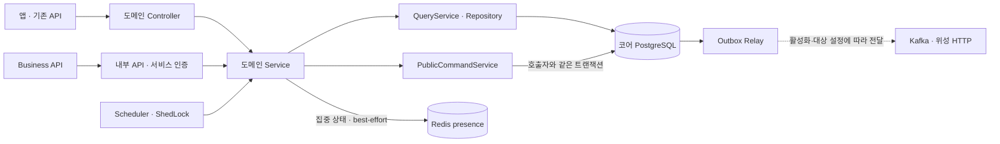

# Data API

> 집중 기록부터 섬 활동과 보상까지, GROMO의 핵심 상태를 확정하는 서버입니다.

[서버 전체 보기](../README.md) · [Business API](../business-api/README.md) · [DB 스키마](docs/db/schema.dbml) · [도메인 계층 규칙](../../docs/conventions/backend-layering.md)

## 1. 역할과 구현 범위

Data API는 계정, 집중 세션, 스크린타임, 친구·그룹, 캐릭터·아이템·재화, 리그·통계 데이터를 관리합니다. 현재는 기존 앱의 공개 API와 인증 발급도 담당합니다. 서비스 분리가 진행되면서 Business용 내부 API, 명령 결과 저장, outbox 전달 기반이 함께 들어 있습니다.

| 영역 | 주요 책임 |
| --- | --- |
| 계정 · 인증 | 사용자·게스트·소셜 로그인, 토큰·세션, 탈퇴 |
| 집중 · 스크린타임 | 세션 상태 전이, 집중 기록, 사용 시간·통계 |
| 친구 · 그룹 · 리그 | 관계·멤버십·활동·챌린지·순위 |
| 캐릭터 · 아이템 · 재화 | 소유·장착·구매·보상·원장 |
| 정산 · 비동기 전달 | 예약 작업, ShedLock 실행 잠금, outbox와 위성 이관 |

신규 공개 API 전체가 전환된 상태는 아닙니다. 예를 들어 새 방장 위임 경로는 명령 기반이 있으나 `island-management.host-transfer-enabled`의 기본값이 false이며, 실시간 전달 준비 전에는 활성화하지 않습니다.

## 2. 데이터 처리 구조



### 같은 명령을 두 번 처리하지 않기

신규 명령 포트는 사용자·operation·요청 키를 기준으로 처리 결과를 보관합니다. 도메인 변경, 최소 응답 결과인 receipt, outbox를 같은 트랜잭션에서 저장합니다. 응답이 유실되어도 같은 의미의 명령이면 권한을 재검사한 뒤 저장된 결과를 반환합니다.

이 보장은 해당 포트를 연결한 명령에 적용됩니다. 모든 기존 API에 자동으로 적용되는 규칙은 아닙니다. [`PublicCommandService`](src/main/java/com/oneorthree/phone/outbox/service/PublicCommandService.java)와 [Business의 사용 계약](../business-api/README.md)을 함께 확인합니다.

### 집중 상태와 채팅 연결

집중 상태는 `presence:focus:{userId}` 키로 Realtime에 전달합니다. Data의 Redis 쓰기는 best-effort이므로 Redis 장애가 집중 세션 자체의 실패로 이어지지 않습니다. 그 대신 기록 실패 시 채팅 제한 반영이 누락될 수 있습니다. Realtime은 이 키를 읽기만 합니다.

## 3. 코드 탐색

기준 패키지는 [`com.oneorthree.phone`](src/main/java/com/oneorthree/phone)입니다.

```text
도메인/
  XxxController.java      HTTP 진입점
  dto/                    요청·응답
  service/                유스케이스·트랜잭션
  repository/             조회·저장, QueryService
    domain/               영속 엔티티
common/                   공통 예외·포트·ID·로깅
config/                   Spring 구성·필터
outbox/                   명령 결과·이벤트 전달 기반
```

컨트롤러는 도메인 루트에 두고, 엔티티 ID 조회는 잠금·삭제 상태·예외를 모은 QueryService를 거칩니다. 도메인 간 참조 방향과 예외 응답 규칙은 [계층 규칙](../../docs/conventions/backend-layering.md), [오류 계약](../../docs/conventions/error-contract.md)이 기준입니다.

## 4. 로컬 실행

Java 17과 Docker를 준비합니다. **저장소 루트에서 시작**합니다.

```bash
docker compose -f server/scripts/docker-compose.local.yml up -d db
cd server/data-api
test -f src/main/resources/application-local.yml || cp src/main/resources/application-local.yml.example src/main/resources/application-local.yml
./gradlew bootRun --args='--spring.profiles.active=local'
```

| 주소 | 용도 |
| --- | --- |
| `http://localhost:8080` | API |
| `http://localhost:8080/swagger-ui/index.html` | Swagger UI |
| `http://localhost:8080/v0/api-docs` | OpenAPI JSON |

로컬 설정 원본은 [`application-local.yml.example`](src/main/resources/application-local.yml.example)입니다. 기본 DB는 Compose의 `tt_db`에 연결됩니다. 채팅 연동 시에는 로컬 Compose의 `redis`도 실행합니다.

## 5. 스키마 · 검증

| 환경 | 스키마 관리 |
| --- | --- |
| local | Flyway 비활성, Hibernate `update` |
| ci | 기본적으로 Flyway 비활성, Hibernate `create-drop` |
| dev · staging · prod | Flyway 적용, Hibernate `validate` |

변경 이력은 [Flyway 마이그레이션](src/main/resources/db/migration), 스키마 문서는 [DBML](docs/db/schema.dbml)로 관리합니다. 이미 적용한 마이그레이션을 수정하지 않고 새 버전을 추가합니다.

서비스 폴더에서 실행합니다. 테스트 DB는 Testcontainers가 준비합니다.

```bash
./gradlew test
./gradlew checkstyleMain spotbugsMain
./gradlew build
```

dev·loadtest·prod의 관리 포트는 `9091`입니다. 배포 시 호스트에 공개하지 않고 내부 수집기가 접근합니다. 지표·로그 분석은 [관측 README](../observability/README.md), 배포 구성은 [Scripts README](../scripts/README.md)를 참고합니다.
