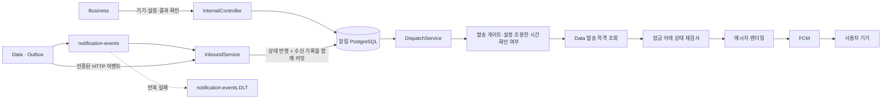

# Notification

> 이벤트를 받아 사용자의 설정과 현재 상태에 맞춰 푸시를 전달하는 알림 서버입니다.

[서버 전체 보기](../README.md) · [내부 API 계약](../../docs/contracts/business-satellite-api.yaml) · [운영 API 계약](../../docs/contracts/notification-admin-api.yaml)

## 1. 역할과 구현 범위

Notification은 기기 토큰, 알림 설정, 수신 이벤트, 예약 발송, 발송 이력과 운영 제어를 소유합니다. Java 17·Spring Boot 4.0.6 기반의 독립 서비스이며 전용 PostgreSQL에 JDBC로 접근하고 Flyway로 스키마를 관리합니다.

앱은 Business를 통해 기기와 설정을 변경합니다. Notification은 앱 JWT를 발급·검증하지 않으며, 호출자별 서비스 토큰과 경로 허용목록으로 내부·운영 API를 보호합니다.

| 기능 | 구현 내용 |
| --- | --- |
| 이벤트 수신 | Kafka·HTTP 공통 처리, `eventId` 중복 제거, 버전 기반 투영 |
| 기기 · 설정 | 세션·세대에 따른 기기 소유권, 수신 동의, 설정 변경 |
| 예약 · 발송 | 조용한 시간, 기한, 결과 확인 여부, 현재 발송 적격 검사 |
| 푸시 생성 | ICU 메시지 렌더링, 묶음 결과 처리, FCM HTTP v1 |
| 운영 · 이관 | 발송 게이트, 감사 기록, 스냅샷 반입·대조, 재조정 |

## 2. 알림 전달 구조



그림은 주요 처리 단계를 설명합니다. 실제 발송은 스케줄러와 DB 발송 게이트가 모두 허용하는 경우에만 진행합니다. FCM 요청 수락은 사용자가 알림을 읽었다는 뜻이 아닙니다.

### 중복 · 장애 처리

- 같은 `eventId`와 같은 봉투는 이미 수신한 결과로 처리합니다. 같은 ID에 다른 내용이 오면 충돌로 거절합니다.
- 상태 반영과 수신 기록을 같은 DB 트랜잭션으로 묶습니다.
- Kafka 실패 메시지는 원본 파티션의 `.DLT`로 전달합니다. DLT 발행 실패를 성공으로 삼키지 않습니다.
- 발송 전 외부 조회와 DB 잠금 단계를 분리하고, 다시 잠근 뒤 게이트·기기 소유권·확인 상태를 재검사합니다.
- Data 조회는 스냅샷 재조정, 결과 확인 수렴, 발송 적격 판정의 제한된 용도입니다. 코어 DB를 직접 조회하지 않습니다.

## 3. 코드 탐색

기준 패키지는 [`com.oneorthree.notification`](src/main/java/com/oneorthree/notification)입니다.

| 진입점 · 구성 | 읽을 코드 |
| --- | --- |
| 내부 인증과 API | `ServiceAuth`, `InternalController` |
| 이벤트 수신 | `KafkaInbound`, `InboundService`, `Envelope` |
| 기기·설정·결과 확인 | `DeviceService`, `SettingsService`, `AckService` |
| 발송 | `DispatchScheduler`, `DispatchService`, `QuietHours` |
| 메시지·전송 | `Renderer`, `FcmPayload`, `FcmTransport` |
| 운영·이관 | `AdminController`, `AdminService`, `MigrationService`, `SnapshotReconciler` |
| DB | `Store`, [Flyway 마이그레이션](src/main/resources/db/migration) |

## 4. 실행과 설정

### 먼저 통합 테스트 실행

Java 17과 Docker를 준비한 뒤 서비스 폴더에서 실행합니다. PostgreSQL·Kafka 통합 테스트는 Testcontainers를 사용합니다.

```bash
cd server/notification
./gradlew test
./gradlew checkstyleMain spotbugsMain
```

### 개발 서버 실행

전용 DB를 만들고 아래 환경변수를 주입한 상태에서 실행합니다. 전체 키와 기본값은 [`application-dev.yml`](src/main/resources/application-dev.yml)이 기준입니다.

| 설정 | 용도 |
| --- | --- |
| `NOTI_DB_URL`, `NOTI_DB_USERNAME`, `NOTI_DB_PASSWORD` | 알림 DB 접속 |
| `KAFKA_BOOTSTRAP_SERVERS` | 브로커 주소 |
| `SVC_TOKEN_BIZ_TO_NOTI`, `SVC_TOKEN_DATA_TO_NOTI`, `SVC_TOKEN_CONSOLE_TO_NOTI` | 호출자별 수신 자격 |
| `DATA_API_BASE_URL`, `SVC_TOKEN_NOTI_TO_DATA` | Data 조회 |
| `FCM_PROJECT_ID`, `FCM_SERVICE_ACCOUNT_JSON` | 실제 FCM 발송 자격 |

```bash
# server/notification 기준, 위 환경변수 주입 후
./gradlew bootRun --args='--spring.profiles.active=dev'
```

기본 서비스 포트는 `8082`, 상태 확인은 `/health`, 관리 포트는 내부 `9091`입니다. 배포용 설정·DB 준비는 [Scripts](../scripts/README.md)를 참고합니다.

### 수신 · 발송 활성화 상태

[`application.yml`](src/main/resources/application.yml)의 기본값은 다음과 같습니다.

| 설정 | 기본값 | 의미 |
| --- | --- | --- |
| `NOTIFICATION_KAFKA_ENABLED` | `false` | Kafka 소비자 활성화 여부 |
| `NOTIFICATION_SCHEDULING_ENABLED` | `false` | 예약 작업 활성화 여부 |
| `NOTIFICATION_GENERATION_REQUIRED` | `false` | 세대 정보 필수 여부 |
| `NOTIFICATION_LEGACY_DEVICE_REGISTRATION` | `true` | 기존 기기 등록 호환 |

서비스가 실행됐다는 이유만으로 발송이 시작되지는 않습니다. DB의 발송 게이트와 이관 검증 절차까지 [운영 API 계약](../../docs/contracts/notification-admin-api.yaml)에 따라 확인합니다.
